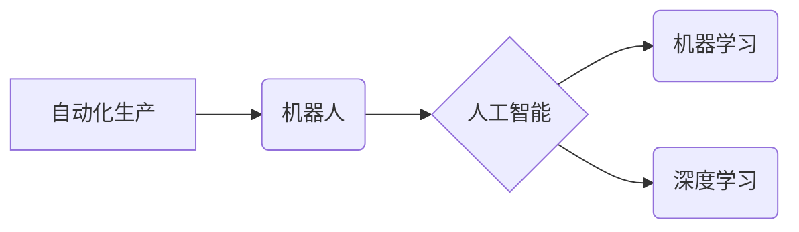

                 

## 机器人创业：自动化生产的未来蓝图

> 关键词：机器人、自动化生产、人工智能、机器学习、深度学习、工业机器人、服务机器人、创业

### 1. 背景介绍

工业革命以来，自动化生产一直是推动经济发展和社会进步的强大引擎。从蒸汽机到数控机床，再到如今的智能机器人，自动化技术不断革新，深刻改变着生产方式和生活方式。

进入21世纪，人工智能（AI）技术的飞速发展为自动化生产注入了新的活力。机器学习和深度学习等人工智能算法赋予机器人更强大的感知、决策和执行能力，使得机器人能够胜任更复杂的任务，并与人类更加协同工作。

与此同时，创业环境的不断优化和科技创新的蓬勃发展，为机器人创业提供了广阔的舞台。越来越多的创业者看到了机器人技术在各个领域的巨大潜力，纷纷投入到机器人研发、制造和应用领域。

### 2. 核心概念与联系

**2.1 核心概念**

* **机器人:** 机器人是一种能够感知环境、自主决策并执行任务的智能化装置。它通常由机械结构、传感器、执行器和控制系统组成。
* **自动化生产:** 自动化生产是指利用机器和自动化技术代替人工完成生产过程，提高生产效率、降低生产成本和提高产品质量。
* **人工智能 (AI):** 人工智能是指模拟人类智能行为的计算机科学领域。它包括机器学习、深度学习、自然语言处理、计算机视觉等多个分支。

**2.2 架构关系**



**2.3 联系分析**

人工智能技术是推动机器人创业的关键驱动力。机器学习和深度学习算法赋予机器人更强大的感知、决策和执行能力，使其能够胜任更复杂的任务，并与人类更加协同工作。

自动化生产是机器人应用的最终目标。通过利用机器人技术，企业可以实现生产过程的自动化，提高生产效率、降低生产成本和提高产品质量。

### 3. 核心算法原理 & 具体操作步骤

**3.1 算法原理概述**

机器学习算法是人工智能的核心技术之一，它能够通过学习数据样本，自动发现模式和规律，并根据这些模式进行预测或决策。

常见的机器学习算法包括：

* **监督学习:** 通过标记数据样本，训练模型预测未知数据样本的标签。例如，图像分类、文本识别等。
* **无监督学习:** 通过未标记数据样本，发现数据中的潜在结构和模式。例如，聚类分析、异常检测等。
* **强化学习:** 通过奖励和惩罚机制，训练模型在特定环境中学习最佳策略。例如，游戏 AI、机器人控制等。

**3.2 算法步骤详解**

以监督学习为例，其基本步骤如下：

1. **数据收集和预处理:** 收集相关数据样本，并进行清洗、转换和特征工程等预处理操作。
2. **模型选择:** 根据具体任务选择合适的机器学习算法模型。
3. **模型训练:** 使用训练数据样本训练模型，调整模型参数，使其能够准确预测未知数据样本的标签。
4. **模型评估:** 使用测试数据样本评估模型的性能，例如准确率、召回率、F1-score等。
5. **模型部署:** 将训练好的模型部署到实际应用场景中，用于预测或决策。

**3.3 算法优缺点**

* **优点:**

    * 自动化学习，无需人工编程。
    * 能够处理复杂数据，发现隐藏模式。
    * 性能不断提升，应用范围不断扩大。

* **缺点:**

    * 需要大量数据进行训练。
    * 模型解释性较差，难以理解模型决策过程。
    * 对数据质量要求高，数据偏差会影响模型性能。

**3.4 算法应用领域**

机器学习算法广泛应用于各个领域，例如：

* **图像识别:** 人脸识别、物体检测、图像分类等。
* **自然语言处理:** 文本分类、情感分析、机器翻译等。
* **推荐系统:** 商品推荐、内容推荐、用户画像等。
* **医疗诊断:** 疾病预测、影像分析、药物研发等。
* **金融风险控制:** 欺诈检测、信用评估、投资决策等。

### 4. 数学模型和公式 & 详细讲解 & 举例说明

**4.1 数学模型构建**

机器学习算法通常基于数学模型进行构建。例如，线性回归模型可以表示为：

$$y = w_0 + w_1x_1 + w_2x_2 + ... + w_nx_n + \epsilon$$

其中：

* $y$ 是预测值。
* $w_0, w_1, w_2, ..., w_n$ 是模型参数。
* $x_1, x_2, ..., x_n$ 是输入特征。
* $\epsilon$ 是误差项。

**4.2 公式推导过程**

模型参数的学习过程通常使用梯度下降算法进行优化。梯度下降算法的目标是找到使模型预测值与真实值误差最小化的参数值。

梯度下降算法的基本公式为：

$$w_{i} = w_{i} - \alpha \frac{\partial Loss}{\partial w_{i}}$$

其中：

* $w_i$ 是模型参数。
* $\alpha$ 是学习率。
* $\frac{\partial Loss}{\partial w_i}$ 是损失函数对参数 $w_i$ 的梯度。

**4.3 案例分析与讲解**

假设我们想要训练一个线性回归模型来预测房价。

* 输入特征：房屋面积、房屋朝向、房屋楼层等。
* 预测值：房屋价格。

我们可以使用梯度下降算法训练模型，并根据训练结果预测新房子的价格。

### 5. 项目实践：代码实例和详细解释说明

**5.1 开发环境搭建**

* 操作系统：Windows、macOS、Linux
* Python 版本：3.6 或更高版本
* 机器学习库：Scikit-learn、TensorFlow、PyTorch等

**5.2 源代码详细实现**

```python
from sklearn.linear_model import LinearRegression
from sklearn.model_selection import train_test_split
from sklearn.metrics import mean_squared_error

# 加载数据
data = ...

# 分割训练集和测试集
X_train, X_test, y_train, y_test = train_test_split(data.drop('price', axis=1), data['price'], test_size=0.2)

# 创建线性回归模型
model = LinearRegression()

# 训练模型
model.fit(X_train, y_train)

# 预测测试集数据
y_pred = model.predict(X_test)

# 计算模型性能
mse = mean_squared_error(y_test, y_pred)
print(f'Mean Squared Error: {mse}')
```

**5.3 代码解读与分析**

* 使用 Scikit-learn 库中的 `LinearRegression` 类创建线性回归模型。
* 使用 `train_test_split` 函数将数据分割成训练集和测试集。
* 使用 `fit` 方法训练模型，将训练数据输入模型进行学习。
* 使用 `predict` 方法预测测试集数据。
* 使用 `mean_squared_error` 函数计算模型性能。

**5.4 运行结果展示**

运行代码后，会输出模型的均方误差值，用于评估模型的预测精度。

### 6. 实际应用场景

**6.1 工业机器人**

* **自动化生产线:** 机器人可以代替人工完成重复性、高危险性的操作，提高生产效率和安全性。
* **焊接、喷涂、装配:** 机器人可以实现高精度、高效率的焊接、喷涂和装配操作，提高产品质量。
* **物流配送:** 机器人可以自动完成货物搬运、分拣和配送任务，提高物流效率。

**6.2 服务机器人**

* **客服机器人:** 机器人可以自动回答客户常见问题，提高客户服务效率。
* **导游机器人:** 机器人可以为游客提供导游服务，讲解景点信息。
* **陪伴机器人:** 机器人可以陪伴老人、儿童等特殊人群，提供情感支持。

**6.3 其他应用场景**

* **医疗机器人:** 机器人可以协助医生进行手术、康复治疗等。
* **农业机器人:** 机器人可以进行田间作业、果园采摘等。
* **探索机器人:** 机器人可以用于探索深海、太空等极端环境。

**6.4 未来应用展望**

随着人工智能技术的不断发展，机器人将应用到更多领域，并发挥更大的作用。未来，机器人将更加智能化、人性化、协同化，与人类更加紧密地合作，共同创造更加美好的未来。

### 7. 工具和资源推荐

**7.1 学习资源推荐**

* **书籍:**

    * 《机器人学导论》
    * 《人工智能：现代方法》
    * 《深度学习》

* **在线课程:**

    * Coursera: 机器人学、人工智能
    * edX: 机器人学、深度学习
    * Udacity: 机器人技术、人工智能

**7.2 开发工具推荐**

* **ROS (Robot Operating System):** 一个开源机器人软件框架。
* **Gazebo:** 一个开源机器人仿真平台。
* **OpenCV:** 一个开源计算机视觉库。
* **TensorFlow:** 一个开源深度学习框架。
* **PyTorch:** 一个开源深度学习框架。

**7.3 相关论文推荐**

* **AlphaGo论文:** DeepMind 的 AlphaGo 论文，展示了深度学习在围棋领域的突破。
* **GPT-3论文:** OpenAI 的 GPT-3 论文，展示了大型语言模型的强大能力。
* **机器人学期刊:** IEEE Robotics and Automation Letters、International Journal of Robotics Research等。

### 8. 总结：未来发展趋势与挑战

**8.1 研究成果总结**

近年来，机器人技术取得了长足进步，人工智能技术的快速发展为机器人创业注入了新的活力。机器人已经应用到各个领域，并发挥着越来越重要的作用。

**8.2 未来发展趋势**

* **更加智能化:** 机器人将更加智能化，能够更好地理解和响应人类指令，并自主完成更复杂的任务。
* **更加协同化:** 机器人将更加协同地与人类合作，共同完成工作。
* **更加人性化:** 机器人将更加人性化，能够更好地理解和满足人类的需求。

**8.3 面临的挑战**

* **技术挑战:** 

    * 如何让机器人更加智能化、更加安全可靠？
    * 如何让机器人更加协同地与人类合作？
    * 如何让机器人更加人性化？

* **伦理挑战:** 

    * 机器人如何与人类的价值观相协调？
    * 机器人如何避免被滥用？
    * 机器人是否应该拥有自主权？

* **社会挑战:** 

    * 机器人将如何影响就业市场？
    * 机器人将如何影响社会结构？
    * 如何让机器人技术造福人类？

**8.4 研究展望**

未来，机器人技术将继续发展，并对人类社会产生深远的影响。我们需要积极应对挑战，推动机器人技术朝着更加安全、可靠、人性化的方向发展，让机器人技术真正造福人类。

### 9. 附录：常见问题与解答

**9.1 机器人创业需要哪些技能？**

* **机器人技术:** 机械设计、控制系统、传感器技术、人工智能等。
* **软件开发:** Python、C++、ROS等。
* **商业技能:** 市场营销、产品管理、财务管理等。

**9.2 机器人创业有哪些风险？**

* **技术风险:** 技术落后、难以实现预期功能。
* **市场风险:** 市场需求不足、竞争激烈。
* **财务风险:** 资金不足、难以盈利。

**9.3 如何降低机器人创业的风险？**

* **充分调研市场需求:** 确定目标市场、分析竞争对手。
* **选择合适的技术路线:** 结合自身优势和市场需求。
* **组建专业的团队:** 拥有丰富的经验和技能。
* **做好风险控制:** 制定合理的财务计划、寻求投资支持。


作者：禅与计算机程序设计艺术 / Zen and the Art of Computer Programming 
<end_of_turn>

