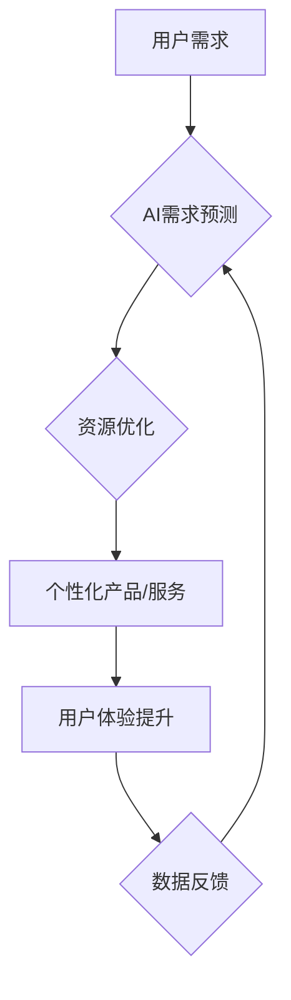

                 

## 欲望的循环经济：AI优化的需求满足

> 关键词：人工智能、需求满足、循环经济、算法优化、需求预测、个性化推荐、资源分配

### 1. 背景介绍

在当今数据爆炸的时代，人工智能（AI）正以惊人的速度发展，深刻地改变着我们生活的方方面面。从智能手机的语音助手到自动驾驶汽车，AI技术的应用无处不在。其中，AI在需求满足领域的应用尤为引人注目。

传统的需求满足模式往往依赖于市场调研、预测分析等方法，效率低下且难以应对快速变化的市场需求。而AI，凭借其强大的数据处理和学习能力，能够更精准地预测用户需求，并提供个性化的产品和服务，从而构建更加高效、灵活的循环经济模式。

### 2. 核心概念与联系

**2.1 循环经济**

循环经济是一种以资源循环利用为核心的经济模式，旨在最大限度地减少资源浪费和环境污染。它强调产品和服务的生命周期管理，从设计、生产、使用到回收再利用，每个环节都追求可持续发展。

**2.2 AI优化需求满足**

AI优化需求满足是指利用人工智能技术，对用户需求进行精准预测和分析，并根据预测结果优化资源分配、产品设计和服务提供，从而实现更加高效、精准、个性化的需求满足。

**2.3 核心概念联系**

AI技术可以有效地推动循环经济的发展，两者之间存在着密切的联系：

* **数据驱动:** 循环经济需要大量的数据来支持决策和优化。AI能够从海量数据中提取有价值的信息，为循环经济提供数据驱动的决策支持。
* **预测分析:** AI能够通过机器学习算法对用户需求进行精准预测，帮助企业提前准备资源，避免浪费。
* **个性化定制:** AI可以根据用户的个性化需求，定制化产品和服务，提高用户满意度。
* **资源优化:** AI可以优化资源分配，减少资源浪费，提高资源利用效率。

**Mermaid 流程图**



### 3. 核心算法原理 & 具体操作步骤

**3.1 算法原理概述**

AI优化需求满足的核心算法主要包括：

* **需求预测算法:** 利用历史数据和用户行为模式，预测未来用户需求。常见的算法包括ARIMA、Prophet、LSTM等。
* **资源分配算法:** 根据需求预测结果，优化资源分配，确保资源高效利用。常见的算法包括遗传算法、模拟退火算法等。
* **个性化推荐算法:** 根据用户的兴趣偏好和历史行为，推荐个性化的产品和服务。常见的算法包括协同过滤、内容过滤、混合推荐等。

**3.2 算法步骤详解**

**需求预测算法:**

1. **数据收集:** 收集用户历史数据，包括购买记录、浏览记录、评价信息等。
2. **数据预处理:** 对收集到的数据进行清洗、转换和特征工程，使其适合算法训练。
3. **模型选择:** 选择合适的需求预测算法，例如ARIMA、Prophet、LSTM等。
4. **模型训练:** 利用训练数据训练模型，并评估模型性能。
5. **需求预测:** 将训练好的模型应用于新的数据，预测未来用户需求。

**资源分配算法:**

1. **需求分析:** 根据需求预测结果，分析不同产品或服务的需求量。
2. **资源评估:** 评估现有资源的可用性和成本。
3. **优化策略:** 根据需求和资源情况，制定资源分配策略，例如优先分配高需求产品，或根据成本效益进行分配。
4. **资源调度:** 根据优化策略，调度资源，确保资源高效利用。

**个性化推荐算法:**

1. **用户建模:** 建立用户的兴趣偏好和行为模式模型。
2. **商品/服务建模:** 建立商品或服务的特征模型。
3. **推荐策略:** 根据用户模型和商品模型，制定个性化推荐策略。
4. **推荐结果:** 生成个性化的推荐结果，并展示给用户。

**3.3 算法优缺点**

**需求预测算法:**

* **优点:** 可以准确预测未来用户需求，帮助企业提前准备资源。
* **缺点:** 预测结果受历史数据影响，难以应对突发事件或市场变化。

**资源分配算法:**

* **优点:** 可以优化资源分配，提高资源利用效率。
* **缺点:** 需要准确的资源成本和需求预测数据。

**个性化推荐算法:**

* **优点:** 可以提供个性化的产品和服务，提高用户满意度。
* **缺点:** 需要大量的用户数据，并可能存在数据隐私问题。

**3.4 算法应用领域**

AI优化需求满足算法广泛应用于以下领域：

* **电商:** 产品推荐、库存管理、物流优化
* **制造业:** 生产计划优化、资源分配、质量控制
* **金融:** 风险管理、投资决策、客户服务
* **医疗:** 疾病诊断、个性化治疗、药物研发
* **教育:** 个性化学习、课程推荐、学生评估

### 4. 数学模型和公式 & 详细讲解 & 举例说明

**4.1 数学模型构建**

需求预测模型可以构建为一个时间序列模型，例如ARIMA模型。ARIMA模型假设时间序列数据具有自回归（AR）、移动平均（MA）和季节性（I）特性。

**4.2 公式推导过程**

ARIMA模型的数学公式如下：

$$
y_t = c + \phi_1 y_{t-1} + \phi_2 y_{t-2} + ... + \phi_p y_{t-p} + \theta_1 \epsilon_{t-1} + \theta_2 \epsilon_{t-2} + ... + \theta_q \epsilon_{t-q} + \epsilon_t
$$

其中：

* $y_t$ 是时间t的观测值
* $c$ 是截距项
* $\phi_i$ 是自回归系数
* $y_{t-i}$ 是时间t-i的观测值
* $\theta_i$ 是移动平均系数
* $\epsilon_{t-i}$ 是时间t-i的随机误差项
* $p$ 是自回归阶数
* $q$ 是移动平均阶数

**4.3 案例分析与讲解**

假设我们想要预测某商品的未来销量。我们可以收集该商品的历史销量数据，并使用ARIMA模型进行预测。

首先，我们需要确定ARIMA模型的参数p、q。可以使用信息准则，例如AIC或BIC，选择最优参数。然后，我们可以使用训练数据训练ARIMA模型，并评估模型性能。最后，我们可以使用训练好的模型预测未来商品的销量。

### 5. 项目实践：代码实例和详细解释说明

**5.1 开发环境搭建**

* Python 3.x
* Jupyter Notebook
* pandas
* scikit-learn
* statsmodels

**5.2 源代码详细实现**

```python
import pandas as pd
from statsmodels.tsa.arima.model import ARIMA
from sklearn.metrics import mean_squared_error

# 加载数据
data = pd.read_csv('sales_data.csv', index_col='Date')

# 数据预处理
data = data['Sales'].dropna()

# 训练ARIMA模型
model = ARIMA(data, order=(5,1,0))
model_fit = model.fit()

# 预测未来销量
forecast = model_fit.predict(start=len(data), end=len(data)+10)

# 评估模型性能
rmse = mean_squared_error(data.tail(10), forecast, squared=False)
print('RMSE:', rmse)

# 可视化预测结果
plt.plot(data, label='实际销量')
plt.plot(forecast, label='预测销量')
plt.legend()
plt.show()
```

**5.3 代码解读与分析**

* 首先，我们使用pandas库加载销售数据，并使用scikit-learn库的ARIMA模型进行预测。
* 然后，我们使用模型训练数据，并评估模型性能。
* 最后，我们使用训练好的模型预测未来销量，并可视化预测结果。

**5.4 运行结果展示**

运行代码后，会生成一个包含实际销量和预测销量的图表，以及RMSE值。RMSE值越小，模型预测精度越高。

### 6. 实际应用场景

**6.1 电商平台**

电商平台可以利用AI优化需求满足，实现个性化推荐、库存管理和物流优化。例如，亚马逊的推荐系统就是基于AI算法，能够根据用户的浏览历史和购买记录，推荐个性化的商品。

**6.2 制造业**

制造业可以利用AI优化需求满足，实现生产计划优化、资源分配和质量控制。例如，通用电气的工厂利用AI算法，可以根据市场需求和生产能力，优化生产计划，并实时监控生产过程，确保产品质量。

**6.3 金融行业**

金融行业可以利用AI优化需求满足，实现风险管理、投资决策和客户服务。例如，摩根大通的风险管理系统就是基于AI算法，能够识别潜在的风险，并采取相应的措施。

**6.4 未来应用展望**

随着AI技术的不断发展，AI优化需求满足将在更多领域得到应用，例如：

* **医疗保健:** 个性化治疗、药物研发
* **教育:** 个性化学习、课程推荐
* **城市管理:** 交通管理、资源分配
* **环境保护:** 污染控制、资源利用

### 7. 工具和资源推荐

**7.1 学习资源推荐**

* **书籍:**
    * 《深度学习》
    * 《机器学习实战》
    * 《Python机器学习》
* **在线课程:**
    * Coursera
    * edX
    * Udacity

**7.2 开发工具推荐**

* **Python:** 
    * pandas
    * scikit-learn
    * TensorFlow
    * PyTorch
* **云平台:**
    * AWS
    * Azure
    * Google Cloud

**7.3 相关论文推荐**

* **需求预测:**
    * "Forecasting: Principles and Practice" by Rob J Hyndman and George Athanasopoulos
* **资源分配:**
    * "Resource Allocation in Cloud Computing: A Survey" by A. Kumar et al.
* **个性化推荐:**
    * "Recommender Systems: The Textbook" by  K. P. Singh et al.

### 8. 总结：未来发展趋势与挑战

**8.1 研究成果总结**

AI优化需求满足已经取得了显著的成果，在电商、制造业、金融行业等领域得到了广泛应用。

**8.2 未来发展趋势**

未来，AI优化需求满足将朝着以下方向发展：

* **更精准的预测:** 利用更先进的算法和数据分析技术，实现更精准的需求预测。
* **更个性化的服务:** 利用用户行为数据和人工智能技术，提供更个性化的产品和服务。
* **更智能的资源分配:** 利用机器学习和优化算法，实现更智能的资源分配，提高资源利用效率。
* **更可持续的循环经济:** 利用AI技术，推动循环经济的发展，实现资源的循环利用和环境保护。

**8.3 面临的挑战**

AI优化需求满足也面临着一些挑战：

* **数据质量:** AI算法依赖于高质量的数据，而现实世界的数据往往存在噪声、缺失和不一致性。
* **算法复杂性:** 一些AI算法非常复杂，难以理解和解释。
* **伦理问题:** AI技术可能会带来一些伦理问题，例如数据隐私和算法偏见。

**8.4 研究展望**

未来，我们需要继续研究和探索AI优化需求满足的新的应用场景和技术方法，并解决其面临的挑战，推动AI技术在循环经济领域的应用，实现可持续发展。

### 9. 附录：常见问题与解答

**9.1 如何选择合适的AI算法？**

选择合适的AI算法取决于具体的应用场景和数据特点。例如，对于时间序列数据，ARIMA模型是一个常用的选择；对于用户行为数据，协同过滤和内容过滤模型是常用的选择。

**9.2 如何解决数据质量问题？**

数据质量问题可以通过数据清洗、数据转换和特征工程等方法解决。

**9.3 如何解释AI算法的决策结果？**

一些AI算法的决策结果难以解释，这被称为“黑盒问题”。为了解决这个问题，我们可以使用可解释AI技术，例如LIME和SHAP，解释AI算法的决策过程。


作者：禅与计算机程序设计艺术 / Zen and the Art of Computer Programming 
<end_of_turn>

