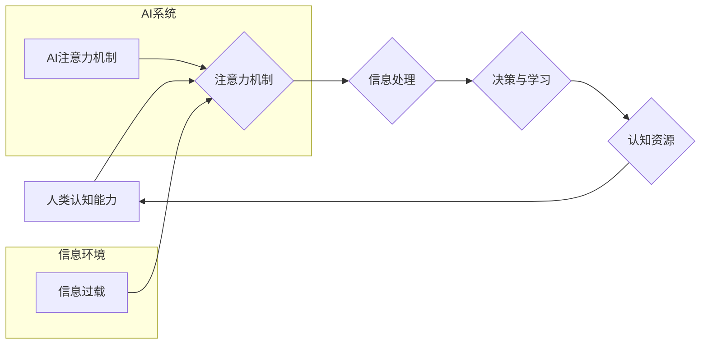

                 

## 注意力生态系统平衡：AI时代的认知资源管理

> 关键词：注意力机制、认知资源、AI伦理、信息过载、可持续发展、生态系统平衡

### 1. 背景介绍

在信息爆炸的时代，人类面临着前所未有的认知挑战。海量信息涌入，注意力资源日益稀缺，如何有效地管理和分配认知资源，成为了当今社会亟待解决的关键问题。人工智能（AI）的快速发展，一方面为我们提供了强大的信息处理能力，另一方面也加剧了信息过载的现象，进一步考验着人类的认知边界。

注意力机制作为AI领域的重要突破，模拟了人类对信息的选择和聚焦能力，在自然语言处理、计算机视觉等领域取得了显著成果。然而，过度依赖AI的注意力机制，可能会导致认知资源的过度依赖和失衡，形成一种“注意力生态系统”的失衡状态。

### 2. 核心概念与联系

**2.1 注意力机制**

注意力机制是一种模拟人类注意力机制的算法，它允许模型在处理信息时，对特定部分信息给予更多的关注，从而提高处理效率和准确性。

**2.2 认知资源**

认知资源是指人类大脑进行信息处理、决策和学习所需要的资源，包括注意力、记忆、执行功能等。

**2.3 注意力生态系统**

注意力生态系统是指人类与AI系统共同构建的注意力管理体系，包括人类的认知能力、AI的注意力机制、信息环境等多方面因素。

**2.4  生态系统平衡**

生态系统平衡是指生态系统中各要素之间的相互作用和协调，保持系统的稳定和可持续发展。

**2.5  AI伦理**

AI伦理是指在人工智能技术发展和应用过程中，遵循道德规范、社会价值和人类利益的原则。

**2.6  信息过载**

信息过载是指在短时间内接收和处理大量信息，导致认知能力超负荷，难以有效地理解和记忆信息。

**2.7  可持续发展**

可持续发展是指满足当前需求，同时不损害后代满足其自身需求的能力。

**Mermaid 流程图**



### 3. 核心算法原理 & 具体操作步骤

**3.1 算法原理概述**

注意力机制的核心原理是通过学习一个“注意力权重”来分配给输入信息的不同部分，从而突出重要信息，抑制无关信息。

**3.2 算法步骤详解**

1. **输入数据:** 将输入数据（例如文本序列）转换为向量表示。
2. **计算注意力权重:** 使用一个注意力函数计算每个输入元素的注意力权重，权重值表示该元素的重要性。
3. **加权求和:** 将注意力权重与输入向量相乘，并求和，得到一个加权后的输出向量。
4. **输出结果:** 将加权后的输出向量作为模型的输出。

**3.3 算法优缺点**

**优点:**

* 可以有效地提高模型的处理效率和准确性。
* 可以学习到输入信息的重要部分，并对无关信息进行抑制。
* 可以应用于多种任务，例如机器翻译、文本摘要、图像识别等。

**缺点:**

* 计算复杂度较高，训练时间较长。
* 容易受到噪声数据的影响。
* 难以解释注意力权重的生成机制。

**3.4 算法应用领域**

注意力机制在人工智能领域有着广泛的应用，例如：

* **自然语言处理:** 机器翻译、文本摘要、问答系统、情感分析等。
* **计算机视觉:** 图像识别、目标检测、图像分割等。
* **语音识别:** 语音转文本、语音合成等。
* **推荐系统:** 商品推荐、内容推荐等。

### 4. 数学模型和公式 & 详细讲解 & 举例说明

**4.1 数学模型构建**

注意力机制的数学模型可以概括为以下公式：

$$
\text{Attention}(Q, K, V) = \text{softmax}\left(\frac{Q K^T}{\sqrt{d_k}}\right) V
$$

其中：

* $Q$：查询向量
* $K$：键向量
* $V$：值向量
* $d_k$：键向量的维度
* $\text{softmax}$：softmax函数，用于将注意力权重归一化到[0, 1]之间。

**4.2 公式推导过程**

1. 计算查询向量 $Q$ 与键向量 $K$ 的点积，并除以 $\sqrt{d_k}$，以规范化结果。
2. 应用 softmax 函数对点积结果进行归一化，得到注意力权重。
3. 将注意力权重与值向量 $V$ 进行加权求和，得到最终的输出。

**4.3 案例分析与讲解**

例如，在机器翻译任务中，查询向量 $Q$ 表示目标语言的词嵌入，键向量 $K$ 表示源语言的词嵌入，值向量 $V$ 表示源语言词的词义向量。注意力机制可以学习到源语言中哪些词对目标语言的词翻译最为重要，从而提高翻译的准确性。

### 5. 项目实践：代码实例和详细解释说明

**5.1 开发环境搭建**

使用 Python 3.x 环境，安装 TensorFlow 或 PyTorch 等深度学习框架。

**5.2 源代码详细实现**

```python
import tensorflow as tf

# 定义注意力机制层
class AttentionLayer(tf.keras.layers.Layer):
    def __init__(self, units):
        super(AttentionLayer, self).__init__()
        self.Wq = tf.keras.layers.Dense(units)
        self.Wk = tf.keras.layers.Dense(units)
        self.Wv = tf.keras.layers.Dense(units)
        self.fc = tf.keras.layers.Dense(units)

    def call(self, inputs):
        Q = self.Wq(inputs[0])
        K = self.Wk(inputs[1])
        V = self.Wv(inputs[2])
        attention_scores = tf.matmul(Q, K, transpose_b=True) / tf.math.sqrt(tf.cast(tf.shape(Q)[-1], tf.float32))
        attention_weights = tf.nn.softmax(attention_scores, axis=-1)
        output = tf.matmul(attention_weights, V)
        return self.fc(output)

# 使用注意力机制层
inputs = [tf.random.normal((1, 10, 64)), tf.random.normal((1, 10, 64)), tf.random.normal((1, 10, 64))]
attention_layer = AttentionLayer(units=128)
output = attention_layer(inputs)
print(output.shape)
```

**5.3 代码解读与分析**

代码实现了一个简单的注意力机制层，其中：

* `Wq`, `Wk`, `Wv`：分别为查询、键、值向量的权重矩阵。
* `fc`：用于最终输出的全连接层。
* `call` 方法：定义了注意力机制层的计算过程。

**5.4 运行结果展示**

运行代码后，输出的 `output` 形状为 `(1, 10, 128)`，表示注意力机制层将输入的三个向量分别表示为查询、键、值，并计算出每个词的注意力权重，最终输出一个加权后的向量。

### 6. 实际应用场景

**6.1 信息过滤与推荐**

注意力机制可以用于过滤信息噪声，识别用户感兴趣的内容，并提供个性化的推荐。例如，新闻聚合平台可以利用注意力机制，根据用户的阅读历史和偏好，推荐最相关的新闻文章。

**6.2 教育与学习**

注意力机制可以帮助学生更好地理解和记忆学习内容。例如，在线学习平台可以利用注意力机制，突出重点内容，并根据学生的学习进度和理解程度，提供个性化的学习建议。

**6.3 医疗诊断与治疗**

注意力机制可以帮助医生更快、更准确地诊断疾病。例如，医学图像分析系统可以利用注意力机制，识别病灶区域，并提供辅助诊断建议。

**6.4 未来应用展望**

随着人工智能技术的不断发展，注意力机制将在更多领域得到应用，例如：

* **自动驾驶:** 帮助车辆识别道路上的障碍物和行人。
* **机器人控制:** 帮助机器人更好地理解环境信息，并做出更精准的行动。
* **人机交互:** 帮助机器更好地理解人类的意图和需求。

### 7. 工具和资源推荐

**7.1 学习资源推荐**

* **论文:** “Attention Is All You Need”
* **博客:** “Attention is All You Need: A Deep Dive”
* **课程:** “Deep Learning Specialization”

**7.2 开发工具推荐**

* **TensorFlow:** https://www.tensorflow.org/
* **PyTorch:** https://pytorch.org/

**7.3 相关论文推荐**

* “Attention Is All You Need”
* “BERT: Pre-training of Deep Bidirectional Transformers for Language Understanding”
* “Transformer-XL: Attentive Language Models Beyond a Fixed-Length Context”

### 8. 总结：未来发展趋势与挑战

**8.1 研究成果总结**

注意力机制在人工智能领域取得了显著成果，为解决信息过载、认知资源分配等问题提供了新的思路和方法。

**8.2 未来发展趋势**

未来，注意力机制的研究将朝着以下方向发展：

* **更有效的注意力机制:** 探索新的注意力机制，提高计算效率和准确性。
* **多模态注意力机制:** 将注意力机制应用于多模态数据，例如文本、图像、音频等。
* **可解释性注意力机制:** 研究如何解释注意力机制的决策过程，提高模型的可解释性。

**8.3 面临的挑战**

注意力机制也面临着一些挑战：

* **计算复杂度:** 某些注意力机制的计算复杂度较高，难以应用于大规模数据。
* **数据依赖性:** 注意力机制的性能依赖于训练数据的质量。
* **伦理问题:** 注意力机制可能被用于操纵用户行为，需要关注其伦理问题。

**8.4 研究展望**

未来，需要加强对注意力机制的理论研究和应用探索，使其更好地服务于人类社会，促进人工智能的可持续发展。

### 9. 附录：常见问题与解答

**9.1 如何选择合适的注意力机制？**

选择合适的注意力机制需要根据具体任务和数据特点进行选择。例如，对于文本序列数据，可以考虑使用自注意力机制；对于图像数据，可以考虑使用空间注意力机制。

**9.2 注意力机制的训练方法是什么？**

注意力机制的训练方法与其他深度学习模型类似，通常使用反向传播算法进行训练。

**9.3 注意力机制的应用场景有哪些？**

注意力机制的应用场景非常广泛，例如机器翻译、文本摘要、图像识别、语音识别等。


作者：禅与计算机程序设计艺术 / Zen and the Art of Computer Programming 
<end_of_turn>

