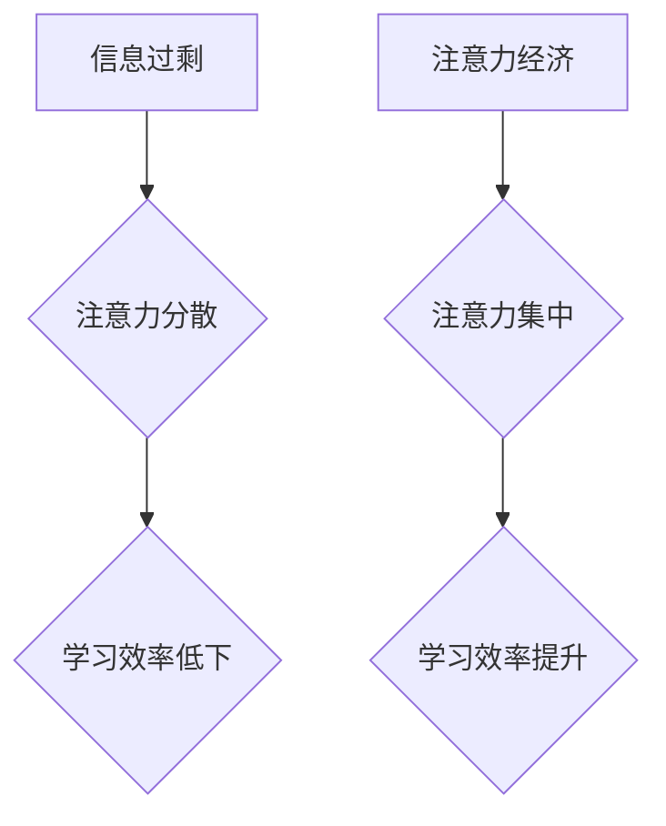

                 

## 1. 背景介绍

在当今信息爆炸的时代，我们每天都被海量的信息所包围。从社交媒体的推送、新闻资讯的轰炸到邮件的提醒，各种信息源源不断地涌入我们的视野。然而，我们的注意力却像一潭清澈的水，很容易被这些信息所污染和分散。

这种注意力经济的困境，深刻地影响着我们的学习效率。我们常常感到难以集中精力，学习内容难以被有效吸收和记忆。传统的学习方法，往往难以应对这种挑战，导致学习效率低下，知识积累缓慢。

## 2. 核心概念与联系

### 2.1 注意力经济

注意力经济指的是在信息过剩的时代，注意力成为一种稀缺资源，而能够有效获取和利用注意力的人或组织，就拥有了巨大的竞争优势。

### 2.2 个人学习效率

个人学习效率是指在给定的时间内，完成学习任务的能力和质量。它受多种因素影响，包括学习方法、学习环境、个人认知能力等。

### 2.3 联系

注意力经济与个人学习效率密切相关。注意力是学习的基础，只有集中注意力，才能有效地理解和记忆学习内容。而信息过剩的时代，注意力更容易被分散，因此提高注意力经济，才能有效提升个人学习效率。

**Mermaid 流程图**



## 3. 核心算法原理 & 具体操作步骤

### 3.1 算法原理概述

提升个人学习效率的核心算法，可以概括为以下几个步骤：

1. **信息筛选:** 过滤掉无关信息，只关注与学习目标相关的关键信息。
2. **注意力训练:** 通过练习和技巧，增强注意力集中能力，减少信息干扰。
3. **知识结构化:** 将学习内容进行整理和归纳，构建知识网络，提高知识记忆和理解。
4. **学习反馈:** 定期回顾和评估学习成果，及时调整学习策略，不断优化学习效率。

### 3.2 算法步骤详解

**1. 信息筛选:**

* 利用工具和技术，例如 RSS 阅读器、信息过滤软件等，筛选出与学习目标相关的关键信息。
* 设定学习时间和空间，避免在学习过程中受到外界干扰。
* 学会拒绝不必要的社交活动和娱乐，集中精力于学习。

**2. 注意力训练:**

* **冥想练习:** 通过冥想，训练专注力和自我意识，增强注意力控制能力。
* **番茄工作法:** 将学习时间划分为25分钟的间隔，每间隔后休息5分钟，提高学习效率和注意力集中度。
* **深度阅读:** 选择高质量的学习材料，进行深度阅读，培养批判性思维和信息提取能力。

**3. 知识结构化:**

* **思维导图:** 利用思维导图，将学习内容进行整理和归纳，构建知识网络，提高知识记忆和理解。
* **笔记整理:** 将学习笔记进行分类和归档，方便查阅和复习。
* **知识卡片:** 利用知识卡片，将学习内容进行碎片化记忆，提高知识复习效率。

**4. 学习反馈:**

* **定期回顾:** 定期回顾学习内容，巩固记忆，发现知识盲点。
* **知识测试:** 进行知识测试，评估学习成果，及时调整学习策略。
* **寻求反馈:** 向老师、同学或导师寻求反馈，了解学习不足之处，改进学习方法。

### 3.3 算法优缺点

**优点:**

* 提高学习效率，缩短学习时间。
* 增强注意力集中能力，减少信息干扰。
* 促进知识结构化，提高知识记忆和理解。
* 提供学习反馈机制，帮助及时调整学习策略。

**缺点:**

* 需要一定的学习成本和时间投入。
* 需要不断练习和调整，才能达到最佳效果。
* 并非适用于所有学习场景和个人。

### 3.4 算法应用领域

* 个人学习和自我提升
* 教育教学和课程设计
* 职场培训和技能提升
* 研究开发和知识管理

## 4. 数学模型和公式 & 详细讲解 & 举例说明

### 4.1 数学模型构建

我们可以用一个简单的数学模型来描述注意力经济和学习效率之间的关系：

$$
Learning Efficiency = f(Attention, Information Quality, Learning Method)
$$

其中：

* **Learning Efficiency** 代表学习效率。
* **Attention** 代表注意力水平。
* **Information Quality** 代表信息质量。
* **Learning Method** 代表学习方法。

这个模型表明，学习效率是一个多因素综合的结果，注意力水平、信息质量和学习方法都是重要的影响因素。

### 4.2 公式推导过程

我们可以进一步推导这个模型，分析各个因素对学习效率的影响：

* **注意力水平:** 注意力水平越高，学习效率越高。因为注意力集中，才能更好地理解和记忆学习内容。
* **信息质量:** 信息质量越高，学习效率越高。因为高质量的信息更易于理解和吸收，能够提供更丰富的知识和技能。
* **学习方法:** 学习方法越有效，学习效率越高。因为不同的学习方法适用于不同的学习内容和个人特点，选择合适的学习方法可以提高学习效率。

### 4.3 案例分析与讲解

例如，假设我们学习一门新的编程语言。

* 如果注意力水平集中，能够有效地理解和记忆编程语法和代码结构，那么学习效率会更高。
* 如果学习到的编程语言资料质量高，能够提供清晰的讲解和丰富的案例，那么学习效率也会更高。
* 如果采用合适的学习方法，例如通过实践编程项目来巩固学习内容，那么学习效率也会更高。

## 5. 项目实践：代码实例和详细解释说明

### 5.1 开发环境搭建

为了更好地理解注意力经济和学习效率的提升，我们可以开发一个简单的项目，例如一个专注学习的番茄工作法计时器。

开发环境搭建：

* 操作系统：Windows/macOS/Linux
* 编程语言：Python
* 开发工具：VS Code/Atom/Sublime Text

### 5.2 源代码详细实现

```python
import time
import tkinter as tk

def start_timer():
    global timer_running
    if timer_running:
        return

    timer_running = True
    work_time = 25 * 60  # 工作时间 25 分钟
    break_time = 5 * 60  # 休息时间 5 分钟

    # 工作阶段
    for i in range(work_time, 0, -1):
        mins, secs = divmod(i, 60)
        timer_label.config(text=f"{mins:02d}:{secs:02d}")
        time.sleep(1)
    # 休息阶段
    for i in range(break_time, 0, -1):
        mins, secs = divmod(i, 60)
        timer_label.config(text=f"{mins:02d}:{secs:02d}")
        time.sleep(1)
    timer_running = False
    start_timer()

# 创建主窗口
root = tk.Tk()
root.title("番茄工作法计时器")

# 创建计时器标签
timer_label = tk.Label(root, text="25:00", font=("Helvetica", 48))
timer_label.pack()

# 创建开始按钮
start_button = tk.Button(root, text="开始", command=start_timer)
start_button.pack()

# 启动主循环
root.mainloop()
```

### 5.3 代码解读与分析

* 该代码实现了一个简单的番茄工作法计时器，可以帮助用户集中注意力，提高学习效率。
* 计时器分为工作阶段和休息阶段，工作阶段持续25分钟，休息阶段持续5分钟。
* 用户可以点击“开始”按钮启动计时器，计时器会倒计时，并在倒计时结束时自动切换到下一个阶段。

### 5.4 运行结果展示

运行该代码后，用户将看到一个窗口，显示一个计时器，计时器会倒计时，并在倒计时结束时自动切换到下一个阶段。

## 6. 实际应用场景

### 6.1 个人学习场景

* 学习编程语言：利用番茄工作法计时器，集中注意力学习编程语法和代码结构。
* 阅读书籍：设定学习时间和空间，利用计时器帮助集中注意力阅读书籍。
* 学习新技能：利用计时器帮助集中注意力练习新技能，例如绘画、音乐、写作等。

### 6.2 教育教学场景

* 课堂教学：利用番茄工作法计时器，帮助学生集中注意力听讲，提高课堂学习效率。
* 在线学习：利用计时器帮助学生集中注意力学习在线课程，提高学习效果。

### 6.3 职场培训场景

* 技能培训：利用计时器帮助员工集中注意力学习新技能，提高工作效率。
* 项目开发：利用计时器帮助团队成员集中注意力协同开发项目，提高项目进度。

### 6.4 未来应用展望

随着人工智能技术的不断发展，注意力经济和学习效率的提升将成为更加重要的研究方向。未来，我们可以期待看到更多基于人工智能的学习工具和平台，帮助人们更好地管理注意力，提升学习效率。

## 7. 工具和资源推荐

### 7.1 学习资源推荐

* **书籍:**

    * 《深度学习》
    * 《机器学习》
    * 《人工智能：一种现代方法》

* **在线课程:**

    * Coursera
    * edX
    * Udacity

### 7.2 开发工具推荐

* **编程语言:** Python, Java, C++
* **开发环境:** VS Code, Atom, Sublime Text
* **机器学习框架:** TensorFlow, PyTorch, scikit-learn

### 7.3 相关论文推荐

* **Attention Is All You Need**
* **BERT: Pre-training of Deep Bidirectional Transformers for Language Understanding**
* **Transformer-XL: Attentive Language Models Beyond a Fixed-Length Context**

## 8. 总结：未来发展趋势与挑战

### 8.1 研究成果总结

注意力经济与个人学习效率的提升是一个重要的研究方向，已经取得了一些成果。例如，番茄工作法、冥想练习等方法可以帮助人们提高注意力集中能力，提升学习效率。

### 8.2 未来发展趋势

未来，注意力经济和学习效率的提升将朝着以下几个方向发展：

* **个性化学习:** 基于人工智能技术，开发个性化学习平台，根据用户的学习目标、学习风格和学习进度，提供定制化的学习内容和学习方法。
* **沉浸式学习:** 利用虚拟现实、增强现实等技术，打造沉浸式的学习环境，提高学习兴趣和学习效果。
* **跨学科学习:** 鼓励跨学科学习，帮助用户建立更全面的知识体系，提升学习深度和广度。

### 8.3 面临的挑战

注意力经济和学习效率的提升也面临一些挑战：

* **信息过载:** 信息爆炸的时代，如何有效筛选和过滤信息，避免信息干扰，仍然是一个难题。
* **注意力碎片化:** 人们注意力越来越碎片化，如何培养专注力和持久力，仍然是一个挑战。
* **技术伦理:** 人工智能技术在学习领域的应用，需要考虑伦理问题，例如数据隐私、算法偏见等。

### 8.4 研究展望

未来，我们需要继续深入研究注意力经济和学习效率的提升，开发更有效的学习方法和工具，帮助人们更好地应对信息时代带来的挑战，提升学习能力和竞争力。

## 9. 附录：常见问题与解答

### 9.1 如何提高注意力集中能力？

* **冥想练习:** 通过冥想，训练专注力和自我意识，增强注意力控制能力。
* **番茄工作法:** 将学习时间划分为25分钟的间隔，每间隔后休息5分钟，提高学习效率和注意力集中度。
* **深度阅读:** 选择高质量的学习材料，进行深度阅读，培养批判性思维和信息提取能力。

### 9.2 如何选择合适的学习方法？

* **根据学习目标:** 不同的学习目标需要不同的学习方法。例如，学习编程语言需要注重实践，学习历史需要注重记忆和理解。
* **根据学习风格:** 不同的学习者有不同的学习风格。例如，视觉型学习者更适合使用图片和视频学习，听觉型学习者更适合使用音频学习。
* **根据学习进度:** 学习进度不同，需要调整学习方法。例如，初学者需要注重基础知识的学习，进阶者需要注重深入理解和应用。


作者：禅与计算机程序设计艺术 / Zen and the Art of Computer Programming 
<end_of_turn>

