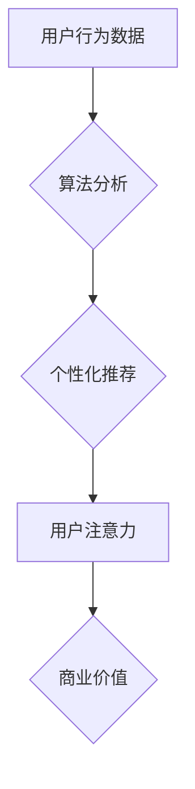

                 

## 注意力经济与个人时间主权的博弈

> 关键词：注意力经济、时间主权、算法、数据驱动、个人隐私、数字产品、用户行为、认知科学、技术伦理

### 1. 背景介绍

在数字时代，信息爆炸和网络技术的飞速发展，使得我们每天面临着海量的数字信息。这些信息竞争着我们的注意力，试图占据我们有限的时间和认知资源。这种现象被称为“注意力经济”，它深刻地改变了我们的生活方式和价值观。

注意力经济的核心在于，注意力是稀缺的资源，而数字产品和服务通过各种手段争夺用户的注意力，从而获取商业价值。从社交媒体的推送算法到电商平台的个性化推荐，从新闻网站的标题党到游戏的设计，无不体现着对用户注意力的精准捕捉和引导。

然而，注意力经济的快速发展也引发了人们对个人时间主权的担忧。个人时间主权是指每个人对自身时间的使用权和控制权，它代表着我们对自身生活节奏和价值观的自主选择。在注意力经济的洪流中，个人时间主权是否会被侵蚀？我们该如何在享受数字产品带来的便利的同时，维护自身的认知自由和时间主权？

### 2. 核心概念与联系

#### 2.1 注意力经济

注意力经济是指在信息爆炸的时代，注意力成为一种稀缺资源，而数字产品和服务通过各种手段争夺用户的注意力，从而获取商业价值的经济模式。

#### 2.2 个人时间主权

个人时间主权是指每个人对自身时间的使用权和控制权，它代表着我们对自身生活节奏和价值观的自主选择。

#### 2.3 数据驱动

数据驱动是指利用数据分析和机器学习等技术，对用户行为进行精准分析和预测，从而优化产品设计和服务体验。

#### 2.4 算法

算法是指解决特定问题的一系列步骤或规则，在注意力经济中，算法被广泛应用于用户行为分析、内容推荐和广告投放等领域。

**Mermaid 流程图**



### 3. 核心算法原理 & 具体操作步骤

#### 3.1 算法原理概述

注意力经济的核心算法通常基于以下原理：

* **用户行为分析:** 通过收集用户浏览历史、点击记录、停留时间等数据，分析用户的兴趣偏好和行为模式。
* **内容推荐:** 根据用户行为分析结果，推荐与用户兴趣相符的内容，以吸引用户的注意力。
* **个性化推送:** 通过用户画像和行为分析，对不同用户进行个性化推送，提高内容的吸引力和用户参与度。
* **反馈机制:** 通过用户反馈，不断优化算法模型，提高推荐精准度和用户体验。

#### 3.2 算法步骤详解

1. **数据收集:** 收集用户在平台上的各种行为数据，例如浏览记录、点击记录、停留时间、评论点赞等。
2. **数据预处理:** 对收集到的数据进行清洗、转换和格式化，以便于后续算法分析。
3. **特征提取:** 从用户行为数据中提取特征，例如用户兴趣、偏好、行为模式等。
4. **模型训练:** 利用机器学习算法，对用户行为数据进行建模，建立用户画像和行为预测模型。
5. **内容推荐:** 根据用户画像和行为预测模型，推荐与用户兴趣相符的内容。
6. **个性化推送:** 对不同用户进行个性化推送，例如推送不同类型的新闻、广告或推荐内容。
7. **反馈收集:** 收集用户对推荐内容的反馈，例如点击、点赞、评论等，并将其反馈到模型训练中，不断优化算法模型。

#### 3.3 算法优缺点

**优点:**

* **精准推荐:** 通过数据分析和算法模型，可以精准推荐用户感兴趣的内容，提高用户体验。
* **个性化服务:** 可以根据用户的不同需求和偏好，提供个性化的服务和体验。
* **商业价值:** 通过精准推荐和个性化服务，可以提高用户粘性，促进商业转化。

**缺点:**

* **隐私问题:** 数据驱动算法需要收集大量的用户数据，可能会引发用户隐私泄露的担忧。
* **算法偏差:** 算法模型可能存在偏差，导致推荐结果不公平或歧视性。
* **注意力过度依赖:** 过度依赖算法推荐，可能会导致用户注意力分散，无法独立思考和判断。

#### 3.4 算法应用领域

注意力经济的算法广泛应用于以下领域：

* **社交媒体:** 推送个性化内容、推荐好友、分析用户情绪。
* **电商平台:** 个性化推荐商品、精准广告投放、分析用户购买行为。
* **新闻网站:** 推送个性化新闻、推荐相关内容、分析用户阅读习惯。
* **游戏:** 个性化游戏推荐、推送游戏活动、分析玩家行为模式。

### 4. 数学模型和公式 & 详细讲解 & 举例说明

#### 4.1 数学模型构建

注意力经济中的核心数学模型通常基于概率论和统计学，例如：

* **贝叶斯网络:** 用于建模用户行为之间的依赖关系，预测用户对特定内容的兴趣。
* **马尔科夫链:** 用于模拟用户在不同平台或内容之间的跳转行为，预测用户未来的行为模式。
* **推荐系统算法:** 例如协同过滤、内容过滤、混合推荐等，用于根据用户行为数据和内容特征，预测用户对特定内容的评分或点击概率。

#### 4.2 公式推导过程

例如，协同过滤算法中常用的**余弦相似度**公式：

$$
\text{相似度} = \frac{\mathbf{u} \cdot \mathbf{v}}{\|\mathbf{u}\| \|\mathbf{v}\|}
$$

其中：

* $\mathbf{u}$ 和 $\mathbf{v}$ 代表两个用户的评分向量。
* $\cdot$ 表示向量点积。
* $\|\mathbf{u}\|$ 和 $\|\mathbf{v}\|$ 表示向量的模长。

该公式计算两个用户评分向量的夹角余弦值，用来衡量两个用户在评分上的相似度。

#### 4.3 案例分析与讲解

例如，假设一个电商平台要推荐商品给用户，可以使用协同过滤算法。

1. 首先，收集用户对商品的评分数据。
2. 将用户和商品表示为向量，其中每个维度代表一个商品。
3. 计算用户之间的余弦相似度，找到与目标用户评分相似度高的用户。
4. 从相似用户购买过的商品中推荐给目标用户。

### 5. 项目实践：代码实例和详细解释说明

#### 5.1 开发环境搭建

* **操作系统:** Linux/macOS/Windows
* **编程语言:** Python
* **库依赖:** numpy, pandas, scikit-learn

#### 5.2 源代码详细实现

```python
import numpy as np
from sklearn.metrics.pairwise import cosine_similarity

# 用户评分数据
ratings = np.array([
    [5, 4, 3, 2, 1],
    [4, 5, 2, 1, 3],
    [3, 2, 5, 4, 1],
    [2, 1, 4, 5, 3],
])

# 计算用户之间的余弦相似度
similarity = cosine_similarity(ratings)

# 打印相似度矩阵
print(similarity)

# 获取用户1与其他用户的相似度
user1_similarity = similarity[0]

# 打印用户1与其他用户的相似度
print(user1_similarity)
```

#### 5.3 代码解读与分析

* 该代码首先定义了用户评分数据，并使用scikit-learn库中的cosine_similarity函数计算用户之间的余弦相似度。
* 余弦相似度矩阵表示了用户之间的相似度，值越大表示相似度越高。
* 代码最后打印了用户1与其他用户的相似度，可以用来推荐用户1可能感兴趣的商品。

#### 5.4 运行结果展示

运行该代码后，会输出一个用户之间的相似度矩阵，以及用户1与其他用户的相似度向量。

### 6. 实际应用场景

#### 6.1 社交媒体

* **个性化内容推荐:** 根据用户的兴趣爱好和浏览历史，推荐相关的内容，例如新闻、视频、图片等。
* **好友推荐:** 根据用户的社交关系和兴趣爱好，推荐潜在的好友。
* **广告投放:** 根据用户的兴趣爱好和行为模式，精准投放广告，提高广告转化率。

#### 6.2 电商平台

* **商品推荐:** 根据用户的购买历史和浏览记录，推荐相关的商品。
* **个性化营销:** 根据用户的消费习惯和偏好，进行个性化的营销推广。
* **库存管理:** 通过预测用户需求，优化库存管理，减少库存积压。

#### 6.3 教育平台

* **个性化学习路径:** 根据学生的学习进度和能力水平，推荐个性化的学习路径。
* **知识点推荐:** 根据学生的学习内容和知识点掌握情况，推荐相关的知识点。
* **学习资源推荐:** 根据学生的学习兴趣和需求，推荐相关的学习资源。

#### 6.4 未来应用展望

随着人工智能技术的不断发展，注意力经济的应用场景将会更加广泛，例如：

* **医疗保健:** 根据患者的病史和症状，推荐相关的医疗服务和药物。
* **金融服务:** 根据用户的财务状况和风险偏好，推荐相关的理财产品和投资策略。
* **城市管理:** 根据用户的出行习惯和需求，优化交通规划和公共服务。

### 7. 工具和资源推荐

#### 7.1 学习资源推荐

* **书籍:**
    * 《武器化するAI: 人工知能がもたらす脅威とチャンス》
    * 《Attention Is All You Need》
    * 《Deep Learning》
* **在线课程:**
    * Coursera: Machine Learning
    * edX: Artificial Intelligence
    * Udacity: Deep Learning Nanodegree

#### 7.2 开发工具推荐

* **Python:** 广泛应用于数据分析、机器学习和人工智能开发。
* **TensorFlow:** 开源深度学习框架，用于构建和训练神经网络模型。
* **PyTorch:** 开源深度学习框架，以其灵活性和易用性而闻名。

#### 7.3 相关论文推荐

* **Attention Is All You Need:** https://arxiv.org/abs/1706.03762
* **BERT: Pre-training of Deep Bidirectional Transformers for Language Understanding:** https://arxiv.org/abs/1810.04805
* **Recurrent Neural Networks for Sequence Learning:** https://www.cs.toronto.edu/~graves/phd.pdf

### 8. 总结：未来发展趋势与挑战

#### 8.1 研究成果总结

注意力经济的研究成果表明，数据驱动算法可以有效地分析用户行为，提供个性化服务，并提升商业价值。然而，注意力经济也引发了人们对个人隐私、算法偏差和注意力过度依赖等问题的担忧。

#### 8.2 未来发展趋势

* **更精准的个性化推荐:** 利用更先进的机器学习算法和数据分析技术，提供更精准的个性化推荐，满足用户多样化的需求。
* **更注重用户隐私保护:** 开发更隐私友好的算法和数据处理方法，保障用户数据安全和隐私权。
* **更公平的算法设计:** 关注算法的公平性和可解释性，避免算法偏差导致的不公平结果。
* **增强用户控制权:** 给予用户更多对自身数据和算法的控制权，例如选择接受哪些推荐、查看算法推荐背后的逻辑等。

#### 8.3 面临的挑战

* **数据安全和隐私保护:** 如何收集、存储和使用用户数据，同时保障用户隐私安全，是注意力经济面临的重大挑战。
* **算法偏差和公平性:** 算法模型可能存在偏差，导致推荐结果不公平或歧视性，需要不断改进算法设计，确保算法公平性。
* **用户注意力过度依赖:** 过度依赖算法推荐，可能会导致用户注意力分散，无法独立思考和判断，需要引导用户理性使用数字产品。
* **技术伦理问题:** 注意力经济的发展引发了诸多技术伦理问题，例如算法操控、信息茧房、数字鸿沟等，需要社会各界共同探讨和解决。

#### 8.4 研究展望

未来，注意力经济的研究将更加注重以下方面：

* **用户行为建模:** 开发更精准的用户行为建模方法，更好地理解用户的需求和偏好。
* **算法可解释性:** 研究算法的决策逻辑，提高算法的可解释性和透明度。
* **用户控制权增强:** 开发技术手段，增强用户对自身数据和算法的控制权。
* **技术伦理规范:** 制定技术伦理规范，引导注意力经济的健康发展。

### 9. 附录：常见问题与解答

#### 9.1 如何保护个人隐私在注意力经济中？

* **谨慎授权应用程序访问权限:** 只授权应用程序访问必要的个人数据。
* **定期清理浏览器历史记录和缓存:** 减少应用程序收集个人数据的痕迹。
* **使用隐私保护浏览器和搜索引擎:** 选择隐私保护功能更强的浏览器和搜索引擎。
* **关注数据安全政策:** 阅读应用程序和网站的数据安全政策，了解如何保护个人数据。

#### 9.2 如何避免算法操控和信息茧房？

* **主动寻求多元信息来源:** 不要只依赖单一平台或算法推荐，主动寻找不同观点和信息来源。
* **批判性思考算法推荐:** 不要盲目相信算法推荐，要进行批判性思考，判断推荐内容的真实性和可靠性。
* **调整算法推荐偏好:** 尝试调整算法推荐偏好，例如取消订阅不感兴趣的频道或话题。
* **定期清理社交媒体好友列表:** 删除不必要的社交媒体好友，避免被信息茧房困住。


作者：禅与计算机程序设计艺术 / Zen and the Art of Computer Programming 
<end_of_turn>

