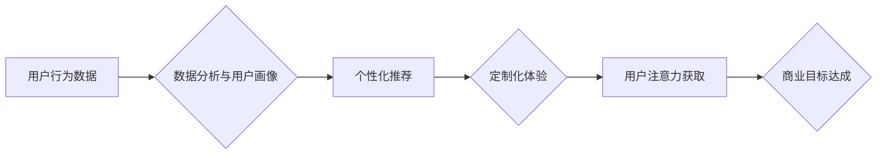

                 

## 注意力经济与个性化营销技术：为受众创建定制、有针对性的体验

> 关键词：注意力经济、个性化营销、深度学习、推荐系统、用户画像、数据分析、A/B测试、机器学习

### 1. 背景介绍

在当今信息爆炸的时代，人们面临着来自各方信息的冲击，注意力已成为稀缺的资源。这便是“注意力经济”的核心概念。在这个背景下，企业需要更加精准地抓住用户的注意力，才能在竞争激烈的市场中脱颖而出。个性化营销技术应运而生，它通过对用户的行为、偏好和需求进行深入分析，为每个用户提供定制化的产品和服务，从而提升用户体验，增强用户粘性，最终实现商业目标。

### 2. 核心概念与联系

#### 2.1 注意力经济

注意力经济是指在信息过载的时代，人们对信息的筛选和选择能力成为重要的经济资源。注意力是有限的，而信息则无限增长，因此，获取和利用用户的注意力成为了企业竞争的关键。

#### 2.2 个性化营销

个性化营销是指根据用户的个人特征、行为和偏好，提供定制化的产品、服务和营销信息。它旨在提升用户体验，增强用户粘性，最终实现商业目标。

#### 2.3 连接

注意力经济和个性化营销是相互关联的。个性化营销技术可以帮助企业更有效地获取和利用用户的注意力。通过提供定制化的内容和体验，企业可以吸引用户的注意力，并引导他们进行购买或其他行动。

**Mermaid 流程图**



### 3. 核心算法原理 & 具体操作步骤

#### 3.1 算法原理概述

个性化营销技术的核心算法主要包括：

* **协同过滤算法:** 基于用户的历史行为数据，预测用户对特定产品的喜好。
* **内容基准算法:** 基于产品的特征和用户偏好，推荐与用户兴趣相符的内容。
* **深度学习算法:** 利用深度神经网络，从海量数据中学习用户行为模式，进行更精准的个性化推荐。

#### 3.2 算法步骤详解

以协同过滤算法为例，其具体操作步骤如下：

1. **数据收集:** 收集用户的行为数据，例如浏览历史、购买记录、评分等。
2. **数据预处理:** 对收集到的数据进行清洗、转换和处理，例如去除缺失值、处理文本数据等。
3. **相似度计算:** 计算用户之间的相似度，例如使用余弦相似度或皮尔逊相关系数。
4. **推荐生成:** 根据用户与其他用户的相似度，推荐与相似用户喜欢的产品。

#### 3.3 算法优缺点

**协同过滤算法:**

* **优点:** 可以发现用户之间的隐性关系，推荐个性化产品。
* **缺点:** 数据稀疏性问题，新用户和新产品的推荐效果较差。

**内容基准算法:**

* **优点:** 不需要大量用户行为数据，可以推荐与用户兴趣相符的内容。
* **缺点:** 推荐结果可能过于简单，缺乏个性化。

**深度学习算法:**

* **优点:** 可以从海量数据中学习更复杂的模式，推荐更精准的产品。
* **缺点:** 需要大量的训练数据和计算资源。

#### 3.4 算法应用领域

个性化营销算法广泛应用于以下领域:

* **电商平台:** 推荐商品、个性化促销活动。
* **社交媒体:** 推荐好友、内容和广告。
* **流媒体平台:** 推荐视频和音乐。
* **新闻平台:** 推荐新闻和文章。

### 4. 数学模型和公式 & 详细讲解 & 举例说明

#### 4.1 数学模型构建

协同过滤算法的数学模型可以表示为用户-物品评分矩阵，其中每个元素表示用户对特定物品的评分。

**用户-物品评分矩阵:**

```
| 用户 | 物品1 | 物品2 | 物品3 |
|---|---|---|---|
| 用户1 | 5 | 3 | 4 |
| 用户2 | 4 | 5 | 2 |
| 用户3 | 3 | 4 | 5 |
```

#### 4.2 公式推导过程

协同过滤算法的相似度计算可以使用余弦相似度公式:

$$
\text{相似度} = \frac{\mathbf{u} \cdot \mathbf{v}}{\|\mathbf{u}\| \|\mathbf{v}\|}
$$

其中:

* $\mathbf{u}$ 和 $\mathbf{v}$ 是两个用户的评分向量。
* $\cdot$ 表示向量的点积。
* $\|\mathbf{u}\|$ 和 $\|\mathbf{v}\|$ 表示向量的模长。

#### 4.3 案例分析与讲解

假设有两个用户，用户1的评分向量为 [5, 3, 4]，用户2的评分向量为 [4, 5, 2]。

使用余弦相似度公式计算用户1和用户2的相似度:

$$
\text{相似度} = \frac{(5 \times 4) + (3 \times 5) + (4 \times 2)}{( \sqrt{5^2 + 3^2 + 4^2}) \times (\sqrt{4^2 + 5^2 + 2^2})} = 0.78
$$

相似度为0.78，表明用户1和用户2的兴趣相符度较高。

### 5. 项目实践：代码实例和详细解释说明

#### 5.1 开发环境搭建

* Python 3.x
* scikit-learn 库
* pandas 库
* numpy 库

#### 5.2 源代码详细实现

```python
import pandas as pd
from sklearn.metrics.pairwise import cosine_similarity

# 加载用户-物品评分数据
data = pd.read_csv('ratings.csv')

# 构建用户-物品评分矩阵
user_item_matrix = data.pivot_table(index='user_id', columns='item_id', values='rating')

# 计算用户之间的余弦相似度
user_similarity = cosine_similarity(user_item_matrix)

# 获取用户1与其他用户的相似度
user1_similarity = user_similarity[0]

# 获取与用户1相似度最高的5个用户
top_5_similar_users = user1_similarity.argsort()[-5:][::-1]

# 推荐与相似用户喜欢的物品
recommended_items = []
for similar_user in top_5_similar_users:
    similar_user_ratings = user_item_matrix.iloc[similar_user].dropna()
    recommended_items.extend(similar_user_ratings.index[similar_user_ratings > 3])

# 去除重复的推荐物品
recommended_items = list(set(recommended_items))

# 打印推荐物品
print(f'推荐给用户1的物品: {recommended_items}')
```

#### 5.3 代码解读与分析

* 代码首先加载用户-物品评分数据，并构建用户-物品评分矩阵。
* 然后使用scikit-learn库中的cosine_similarity函数计算用户之间的余弦相似度。
* 通过获取用户1与其他用户的相似度，并排序，可以找到与用户1兴趣相符的相似用户。
* 最后，根据相似用户的评分，推荐与他们喜欢的物品。

#### 5.4 运行结果展示

运行代码后，会输出一个包含推荐物品的列表。

### 6. 实际应用场景

#### 6.1 电商平台

电商平台可以利用个性化营销技术，根据用户的浏览历史、购买记录和评分等数据，推荐个性化的商品和促销活动。例如，亚马逊的“你可能也喜欢”推荐功能就是基于协同过滤算法实现的。

#### 6.2 社交媒体

社交媒体平台可以利用个性化营销技术，推荐用户可能感兴趣的朋友、内容和广告。例如，Facebook的“朋友推荐”功能就是基于协同过滤算法实现的。

#### 6.3 流媒体平台

流媒体平台可以利用个性化营销技术，推荐用户可能感兴趣的视频和音乐。例如，Netflix的“为你推荐”功能就是基于深度学习算法实现的。

#### 6.4 未来应用展望

随着人工智能技术的不断发展，个性化营销技术将更加智能化、精准化。未来，个性化营销技术将应用于更多领域，例如教育、医疗、金融等，为用户提供更加定制化的服务。

### 7. 工具和资源推荐

#### 7.1 学习资源推荐

* **书籍:**

    * 《推荐系统实践》
    * 《深度学习》
    * 《机器学习》

* **在线课程:**

    * Coursera: “Machine Learning”
    * Udacity: “Deep Learning Nanodegree”
    * edX: “Artificial Intelligence”

#### 7.2 开发工具推荐

* **Python:** 

    * scikit-learn
    * pandas
    * numpy
    * TensorFlow
    * PyTorch

* **其他:**

    * Spark
    * Hadoop

#### 7.3 相关论文推荐

* **协同过滤算法:**

    * “Collaborative Filtering for Implicit Feedback Datasets”
    * “Matrix Factorization Techniques for Recommender Systems”

* **深度学习算法:**

    * “Deep Learning Recommendations for Personalization and Search”
    * “Neural Collaborative Filtering”

### 8. 总结：未来发展趋势与挑战

#### 8.1 研究成果总结

个性化营销技术在近年来取得了显著的进展，特别是深度学习算法的应用，使得推荐系统更加精准化、智能化。

#### 8.2 未来发展趋势

* **更精准的个性化推荐:** 利用更先进的机器学习算法和数据分析技术，对用户的行为和偏好进行更深入的理解，提供更加精准的个性化推荐。
* **跨平台个性化体验:** 将个性化推荐扩展到多个平台，例如电商平台、社交媒体平台、流媒体平台等，为用户提供更加统一、连续的个性化体验。
* **增强用户参与度:** 通过互动式推荐、个性化内容创作等方式，增强用户的参与度，提升用户体验。

#### 8.3 面临的挑战

* **数据隐私保护:** 个性化营销技术依赖于用户的个人数据，因此如何保护用户的隐私安全是一个重要的挑战。
* **算法公平性:** 个性化推荐算法可能会存在偏见，导致某些用户获得不公平的待遇。如何确保算法的公平性是一个需要解决的问题。
* **用户信任:** 用户对个性化推荐的信任度仍然较低，如何提升用户对个性化推荐的信任度是一个重要的挑战。

#### 8.4 研究展望

未来，个性化营销技术将继续朝着更加精准、智能、公平的方向发展。研究者将继续探索新的算法和技术，以更好地理解用户的需求，提供更加个性化的服务。


### 9. 附录：常见问题与解答

#### 9.1 如何解决数据稀疏性问题？

数据稀疏性问题是协同过滤算法面临的一个常见挑战。

一些解决方案包括:

* **使用混合推荐算法:** 将协同过滤算法与内容基准算法相结合，利用两种算法的优势。
* **使用矩阵分解技术:** 将用户-物品评分矩阵分解成两个低维矩阵，从而减少数据稀疏性。
* **使用负采样技术:** 在训练过程中，增加负样本，例如用户没有评分的物品，从而提高算法的鲁棒性。

#### 9.2 如何评估个性化推荐系统的效果？

个性化推荐系统的效果可以通过多种指标进行评估，例如:

* **点击率 (CTR):** 用户点击推荐结果的比例。
* **转化率 (CVR):** 用户点击推荐结果后进行购买或其他行动的比例。
* **用户满意度:** 用户对推荐结果的满意度。

#### 9.3 如何确保个性化推荐算法的公平性？

个性化推荐算法可能会存在偏见，导致某些用户获得不公平的待遇。

一些解决方案包括:

* **使用公平性约束:** 在训练算法时，加入公平性约束，例如确保不同用户群体的推荐结果分布均匀。
* **定期评估算法的公平性:** 定期评估算法的公平性，并根据评估结果进行调整。
* **提高算法透明度:** 使算法的决策过程更加透明，以便用户可以理解推荐结果背后的原因。


作者：禅与计算机程序设计艺术 / Zen and the Art of Computer Programming 
<end_of_turn>

