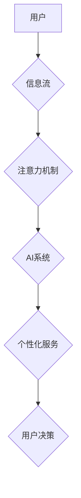

                 

##  注意力经济学：AI时代的注意力分配

> 关键词：注意力机制、深度学习、Transformer、自然语言处理、计算机视觉、信息过滤、认知科学、AI伦理

## 1. 背景介绍

在信息爆炸的时代，人类面临着前所未有的注意力挑战。海量的资讯、信息碎片化和不断涌现的新技术，使得我们难以集中精力，有效地处理信息。同时，人工智能（AI）技术的飞速发展，也带来了新的机遇和挑战。AI系统能够自动学习和处理大量数据，并提供个性化的信息服务，但同时也可能加剧注意力分配的困境。

注意力经济学作为一门新兴的学科，试图从经济学角度分析和解决注意力分配问题。它探讨了注意力作为一种稀缺资源，如何在信息时代被分配、交易和利用。随着AI技术的进步，注意力经济学面临着新的挑战和机遇。

## 2. 核心概念与联系

**2.1 注意力机制**

注意力机制是深度学习领域的重要突破，它模拟了人类的注意力机制，能够帮助模型聚焦于输入数据中最重要的部分，从而提高学习效率和准确性。

**2.2  Transformer 架构**

Transformer是一种基于注意力机制的深度学习架构，它彻底改变了自然语言处理（NLP）领域，并取得了显著的成果。Transformer的核心是“自注意力机制”，它能够捕捉句子中单词之间的长距离依赖关系，从而更好地理解文本语义。

**2.3  AI时代注意力分配**

在AI时代，注意力分配面临着新的挑战和机遇。一方面，AI系统能够提供个性化的信息服务，帮助用户过滤信息噪音，提高注意力效率。另一方面，AI系统也可能利用注意力机制，引导用户关注特定内容，从而影响用户决策和行为。

**Mermaid 流程图**



## 3. 核心算法原理 & 具体操作步骤

### 3.1 算法原理概述

注意力机制的核心思想是赋予模型“选择性关注”的能力，类似于人类在阅读时，会将注意力集中在关键信息上。注意力机制通过计算每个输入元素的重要性权重，并根据这些权重对输入进行加权求和，从而突出重要信息。

### 3.2 算法步骤详解

1. **计算注意力权重:** 对于每个输入元素，计算其与其他元素之间的相关性，并将其转化为注意力权重。常用的注意力机制包括自注意力机制和交叉注意力机制。

2. **加权求和:** 根据计算出的注意力权重，对输入元素进行加权求和，得到一个新的表示向量。

3. **输出:** 将加权求和后的向量作为模型的输出，用于后续的预测或分类任务。

### 3.3 算法优缺点

**优点:**

* 能够捕捉输入数据中长距离依赖关系。
* 能够提高模型的学习效率和准确性。
* 能够解释模型的决策过程。

**缺点:**

* 计算复杂度较高。
* 训练数据量较大。
* 对噪声数据敏感。

### 3.4 算法应用领域

注意力机制在NLP、计算机视觉、语音识别等多个领域取得了成功应用。

* **NLP:** 机器翻译、文本摘要、问答系统、情感分析等。
* **计算机视觉:** 图像分类、目标检测、图像分割等。
* **语音识别:** 语音转文本、语音合成等。

## 4. 数学模型和公式 & 详细讲解 & 举例说明

### 4.1 数学模型构建

注意力机制的数学模型通常基于以下公式：

$$
\text{Attention}(Q, K, V) = \text{softmax}\left(\frac{Q K^T}{\sqrt{d_k}}\right) V
$$

其中：

* $Q$：查询矩阵
* $K$：键矩阵
* $V$：值矩阵
* $d_k$：键向量的维度
* $\text{softmax}$：softmax函数，用于将注意力权重归一化

### 4.2 公式推导过程

注意力机制的核心是计算查询向量 $Q$ 与键向量 $K$ 之间的相似度，并将其转化为注意力权重。

* **相似度计算:** 使用点积或其他相似度度量函数计算 $Q$ 和 $K$ 之间的相似度。
* **归一化:** 使用 softmax 函数将相似度转化为注意力权重，使得权重之和为 1。

### 4.3 案例分析与讲解

假设我们有一个句子 "The cat sat on the mat"，我们想要计算每个单词对句子整体语义的贡献。

1. 将句子中的每个单词转换为向量表示，作为 $Q$、$K$ 和 $V$ 的输入。
2. 计算每个单词对其他单词的注意力权重。
3. 根据注意力权重，对每个单词的向量表示进行加权求和，得到句子整体的语义表示。

## 5. 项目实践：代码实例和详细解释说明

### 5.1 开发环境搭建

* Python 3.6+
* TensorFlow 或 PyTorch

### 5.2 源代码详细实现

```python
import tensorflow as tf

# 定义注意力机制层
class AttentionLayer(tf.keras.layers.Layer):
    def __init__(self, units):
        super(AttentionLayer, self).__init__()
        self.Wq = tf.keras.layers.Dense(units)
        self.Wk = tf.keras.layers.Dense(units)
        self.Wv = tf.keras.layers.Dense(units)
        self.fc = tf.keras.layers.Dense(units)

    def call(self, inputs):
        Q = self.Wq(inputs)
        K = self.Wk(inputs)
        V = self.Wv(inputs)
        attention_weights = tf.matmul(Q, K, transpose_b=True) / tf.math.sqrt(tf.cast(tf.shape(Q)[-1], tf.float32))
        attention_weights = tf.nn.softmax(attention_weights, axis=-1)
        output = tf.matmul(attention_weights, V)
        return self.fc(output)

# 使用注意力机制层构建模型
model = tf.keras.Sequential([
    tf.keras.layers.Embedding(input_dim=10000, output_dim=128),
    AttentionLayer(128),
    tf.keras.layers.Dense(10, activation='softmax')
])
```

### 5.3 代码解读与分析

* `AttentionLayer` 类定义了注意力机制层，包含三个稠密层用于计算查询、键和值向量，以及一个用于计算注意力权重的softmax函数。
* `call` 方法实现了注意力机制的计算过程，包括计算注意力权重和加权求和。
* `model` 对象构建了一个简单的文本分类模型，其中包含一个嵌入层、一个注意力机制层和一个输出层。

### 5.4 运行结果展示

使用训练数据训练模型，并评估模型在测试集上的性能。

## 6. 实际应用场景

### 6.1 个性化信息推荐

注意力机制可以帮助推荐系统理解用户的兴趣偏好，并推荐更相关的资讯和内容。

### 6.2 智能客服

注意力机制可以帮助智能客服系统理解用户的需求，并提供更精准的回复。

### 6.3 医疗诊断

注意力机制可以帮助医生分析病历和影像数据，提高诊断准确率。

### 6.4 未来应用展望

注意力机制在AI领域的应用前景广阔，未来可能在更多领域得到应用，例如：

* **自动驾驶:** 帮助自动驾驶系统关注道路上的重要信息，提高驾驶安全性。
* **机器人交互:** 帮助机器人理解人类的情感和意图，进行更自然的交互。
* **教育:** 帮助教育系统个性化学习，提高学习效率。

## 7. 工具和资源推荐

### 7.1 学习资源推荐

* **书籍:**
    * 《深度学习》
    * 《Attention Is All You Need》
* **在线课程:**
    * Coursera: Deep Learning Specialization
    * Udacity: Deep Learning Nanodegree

### 7.2 开发工具推荐

* **TensorFlow:** 开源深度学习框架
* **PyTorch:** 开源深度学习框架
* **Hugging Face Transformers:** 提供预训练的Transformer模型和工具

### 7.3 相关论文推荐

* 《Attention Is All You Need》
* 《BERT: Pre-training of Deep Bidirectional Transformers for Language Understanding》
* 《GPT-3: Language Models are Few-Shot Learners》

## 8. 总结：未来发展趋势与挑战

### 8.1 研究成果总结

注意力机制是深度学习领域的重要突破，它能够有效地捕捉输入数据中的长距离依赖关系，并提高模型的学习效率和准确性。注意力机制在NLP、计算机视觉等多个领域取得了成功应用。

### 8.2 未来发展趋势

* **更有效的注意力机制:** 研究更有效的注意力机制，例如可解释性更高的注意力机制、计算效率更高的注意力机制。
* **跨模态注意力机制:** 研究跨模态注意力机制，例如将文本和图像等不同模态的信息融合在一起。
* **动态注意力机制:** 研究动态注意力机制，例如能够根据输入数据动态调整注意力权重的机制。

### 8.3 面临的挑战

* **计算复杂度:** 传统的注意力机制计算复杂度较高，难以应用于大规模数据。
* **数据依赖性:** 注意力机制的性能依赖于训练数据的质量和数量。
* **可解释性:** 注意力机制的决策过程难以解释，这可能导致模型的不可信赖性。

### 8.4 研究展望

未来，注意力机制将继续是深度学习领域的重要研究方向。随着研究的深入，注意力机制将更加高效、灵活、可解释，并应用于更多领域，推动人工智能技术的进步。

## 9. 附录：常见问题与解答

* **什么是注意力机制？**

注意力机制是一种模拟人类注意力机制的算法，能够帮助模型聚焦于输入数据中最重要的部分。

* **注意力机制的应用场景有哪些？**

注意力机制在NLP、计算机视觉、语音识别等多个领域取得了成功应用。

* **如何选择合适的注意力机制？**

选择合适的注意力机制需要根据具体任务和数据特点进行选择。

* **注意力机制的未来发展趋势是什么？**

未来，注意力机制将更加高效、灵活、可解释，并应用于更多领域。


作者：禅与计算机程序设计艺术 / Zen and the Art of Computer Programming 
<end_of_turn>

