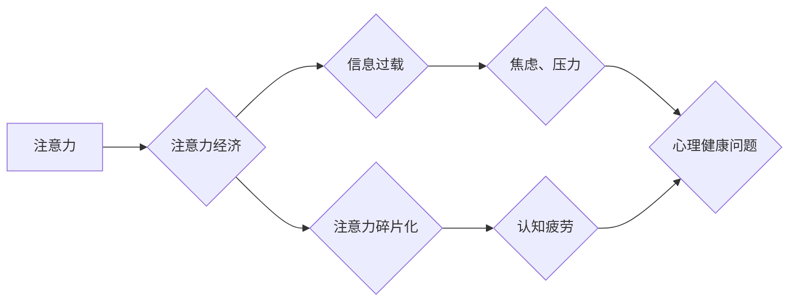

                 

## 1. 背景介绍

在当今数字时代，我们被无处不在的数字信息所包围。从智能手机到社交媒体，从电子邮件到在线游戏，信息源源不断地涌入我们的视野，占据着我们宝贵的注意力。这种信息过载和注意力竞争日益加剧，对我们的心理健康产生了深远的影响。

注意力，作为认知功能的核心，是人类获取、处理和理解信息的关键。然而，注意力经济的兴起，将注意力变成了一个稀缺的资源，被商业利益和算法设计所操控。我们被迫在海量信息中筛选和过滤，不断地切换任务和关注点，这导致注意力力的碎片化和疲劳，进而影响我们的情绪、认知和行为。

## 2. 核心概念与联系

### 2.1 注意力经济

注意力经济是指在信息爆炸时代，注意力成为一种稀缺资源，并被商业利益所利用的经济模式。在这个模式下，平台和企业通过各种手段，例如个性化推荐、推送通知、社交互动等，争夺用户的注意力，从而获取广告收入、数据价值等。

### 2.2  心理健康

心理健康是指个体在生理、心理、社会等方面处于良好的状态，能够有效地应对生活中的压力和挑战，并实现自我价值。心理健康与注意力密切相关，注意力力的集中和稳定是维持心理健康的重要基础。

### 2.3  注意力与心理健康之间的联系

注意力经济对心理健康的影响主要体现在以下几个方面：

* **注意力碎片化:**  注意力经济鼓励快速切换和多任务处理，导致注意力变得碎片化，难以集中精力完成一项任务。
* **信息过载:**  海量信息涌入，让人难以筛选和过滤，造成信息过载，引发焦虑、压力和疲劳。
* **社交比较:**  社交媒体平台上充斥着完美的生活展示，引发社交比较和自我怀疑，影响心理健康。
* **睡眠障碍:**  手机、平板电脑等电子设备的蓝光会抑制褪黑素分泌，影响睡眠质量，进而影响心理健康。

**Mermaid 流程图**



## 3. 核心算法原理 & 具体操作步骤

### 3.1  算法原理概述

注意力机制是一种模仿人类注意力机制的算法，旨在帮助模型专注于输入数据中最重要的部分。它通过学习一个权重向量，将不同输入元素赋予不同的重要性，从而提高模型的性能。

### 3.2  算法步骤详解

1. **输入数据:**  将输入数据（例如文本、图像）转换为向量表示。
2. **计算注意力权重:**  使用一个注意力函数计算每个输入元素的注意力权重。注意力函数通常是一个神经网络，它会根据输入数据和模型的当前状态计算每个元素的重要性。
3. **加权求和:**  将每个输入元素与其注意力权重相乘，然后对所有元素进行加权求和，得到一个新的表示向量。
4. **输出结果:**  将加权求和后的向量作为模型的输出，用于后续的处理。

### 3.3  算法优缺点

**优点:**

* **提高模型性能:**  注意力机制可以帮助模型专注于输入数据中最重要的部分，从而提高模型的准确率、召回率等性能指标。
* **解释性强:**  注意力权重可以直观地反映模型对输入数据的关注程度，从而提高模型的可解释性。

**缺点:**

* **计算复杂度高:**  注意力机制的计算复杂度较高，尤其是在处理大型数据集时。
* **参数量大:**  注意力机制通常需要大量的参数，这可能会导致模型训练时间长、内存占用大。

### 3.4  算法应用领域

注意力机制在自然语言处理、计算机视觉、机器翻译等领域得到了广泛应用。例如，在机器翻译中，注意力机制可以帮助模型关注源语言中与目标语言相关的重要词语，从而提高翻译质量。

## 4. 数学模型和公式 & 详细讲解 & 举例说明

### 4.1  数学模型构建

注意力机制的核心是注意力权重计算。一个常见的注意力函数是基于softmax函数的注意力机制。

**公式:**

$$
\text{Attention}(Q, K, V) = \text{softmax}\left(\frac{Q K^T}{\sqrt{d_k}}\right) V
$$

其中：

* $Q$：查询向量
* $K$：键向量
* $V$：值向量
* $d_k$：键向量的维度
* $\text{softmax}$：softmax函数

### 4.2  公式推导过程

注意力权重计算过程可以分为以下几个步骤：

1. **计算查询向量和键向量的点积:**  $QK^T$ 计算查询向量和键向量的点积，得到一个矩阵。
2. **缩放点积:**  将点积结果除以 $\sqrt{d_k}$，可以防止梯度爆炸。
3. **应用softmax函数:**  对缩放后的点积矩阵应用softmax函数，得到每个键向量的注意力权重。
4. **加权求和:**  将值向量与注意力权重相乘，然后对所有值向量进行加权求和，得到最终的输出向量。

### 4.3  案例分析与讲解

假设我们有一个句子 "The cat sat on the mat"，我们想用注意力机制来找到句子中与单词 "sat" 最相关的词语。

1. 将句子中的每个单词转换为向量表示。
2. 将每个单词的向量作为查询向量，与其他单词的向量作为键向量进行点积计算。
3. 将点积结果缩放并应用softmax函数，得到每个单词的注意力权重。
4. 将值向量与注意力权重相乘，然后对所有值向量进行加权求和，得到与 "sat" 最相关的单词的向量表示。

通过分析注意力权重，我们可以发现 "cat" 和 "mat" 是与 "sat" 最相关的词语。

## 5. 项目实践：代码实例和详细解释说明

### 5.1  开发环境搭建

* Python 3.6+
* TensorFlow 或 PyTorch

### 5.2  源代码详细实现

```python
import tensorflow as tf

# 定义注意力机制
def attention_layer(query, key, value, mask=None):
    # 计算注意力权重
    scores = tf.matmul(query, key, transpose_b=True) / tf.math.sqrt(tf.cast(key.shape[-1], tf.float32))
    if mask is not None:
        scores += (mask * -1e9)
    attention_weights = tf.nn.softmax(scores, axis=-1)
    # 加权求和
    context_vector = tf.matmul(attention_weights, value)
    return context_vector, attention_weights

# 示例代码
query = tf.random.normal([1, 5, 128])
key = tf.random.normal([1, 10, 128])
value = tf.random.normal([1, 10, 256])

context_vector, attention_weights = attention_layer(query, key, value)
print(context_vector.shape)
print(attention_weights.shape)
```

### 5.3  代码解读与分析

* `attention_layer` 函数定义了注意力机制的核心逻辑。
* `scores` 计算了查询向量和键向量的点积，并进行缩放。
* `attention_weights` 使用 softmax 函数将点积结果转换为注意力权重。
* `context_vector` 通过加权求和得到最终的输出向量。

### 5.4  运行结果展示

运行代码后，会输出 `context_vector` 和 `attention_weights` 的形状。

## 6. 实际应用场景

### 6.1  社交媒体平台

社交媒体平台利用注意力机制来推荐个性化内容，提高用户粘性。例如，Facebook 的新闻订阅功能会根据用户的兴趣和行为历史，推荐相关的文章和视频。

### 6.2  搜索引擎

搜索引擎利用注意力机制来理解用户搜索意图，并返回更相关的搜索结果。例如，Google 的搜索算法会根据用户的搜索词和历史记录，计算每个网页的注意力权重，并优先显示权重更高的网页。

### 6.3  在线教育平台

在线教育平台利用注意力机制来个性化学习体验，提高学习效率。例如，Khan Academy 的学习平台会根据学生的学习进度和知识掌握情况，推荐相关的学习内容。

### 6.4  未来应用展望

注意力机制在未来将有更广泛的应用场景，例如：

* **医疗诊断:**  注意力机制可以帮助医生分析病人的医学影像和病历，提高诊断准确率。
* **自动驾驶:**  注意力机制可以帮助自动驾驶汽车识别道路上的障碍物和行人，提高安全性。
* **机器人交互:**  注意力机制可以帮助机器人理解人类的语言和行为，提高交互自然度。

## 7. 工具和资源推荐

### 7.1  学习资源推荐

* **论文:**  "Attention Is All You Need"
* **博客:**  Jay Alammar's Blog
* **在线课程:**  Coursera, Udacity

### 7.2  开发工具推荐

* **TensorFlow:**  https://www.tensorflow.org/
* **PyTorch:**  https://pytorch.org/

### 7.3  相关论文推荐

* "Attention Is All You Need"
* "BERT: Pre-training of Deep Bidirectional Transformers for Language Understanding"
* "Transformer-XL: Attentive Language Models Beyond a Fixed-Length Context"

## 8. 总结：未来发展趋势与挑战

### 8.1  研究成果总结

注意力机制在近年来取得了显著的进展，并在多个领域取得了优异的性能。

### 8.2  未来发展趋势

未来注意力机制的研究方向包括：

* **效率提升:**  研究更高效的注意力机制，降低计算复杂度和参数量。
* **鲁棒性增强:**  研究更鲁棒的注意力机制，提高对噪声和干扰的抵抗能力。
* **解释性增强:**  研究更具解释性的注意力机制，提高模型的可理解性和可解释性。

### 8.3  面临的挑战

注意力机制也面临一些挑战，例如：

* **可解释性:**  注意力机制的内部工作机制仍然难以完全理解，这限制了其在一些安全关键领域中的应用。
* **数据依赖性:**  注意力机制的性能依赖于训练数据的质量和数量，在数据稀缺的情况下，其性能可能会下降。
* **公平性:**  注意力机制可能会存在偏见，导致模型输出不公平的结果。

### 8.4  研究展望

未来，注意力机制的研究将继续深入，并应用于更多领域。随着研究的深入，注意力机制将更加高效、鲁棒、可解释，并更好地服务于人类社会。

## 9. 附录：常见问题与解答

### 9.1  注意力机制和深度学习的关系是什么？

注意力机制是一种深度学习中的重要技术，它可以帮助模型专注于输入数据中最重要的部分，从而提高模型的性能。

### 9.2  注意力机制有哪些不同的类型？

常见的注意力机制类型包括：

* **自注意力机制:**  模型关注自身输入序列中的不同位置。
* **交叉注意力机制:**  模型关注不同输入序列之间的关系。
* **位置感知注意力机制:**  模型考虑输入序列中的位置信息。

### 9.3  注意力机制的应用场景有哪些？

注意力机制在自然语言处理、计算机视觉、机器翻译等领域得到了广泛应用。


作者：禅与计算机程序设计艺术 / Zen and the Art of Computer Programming 
<end_of_turn>

