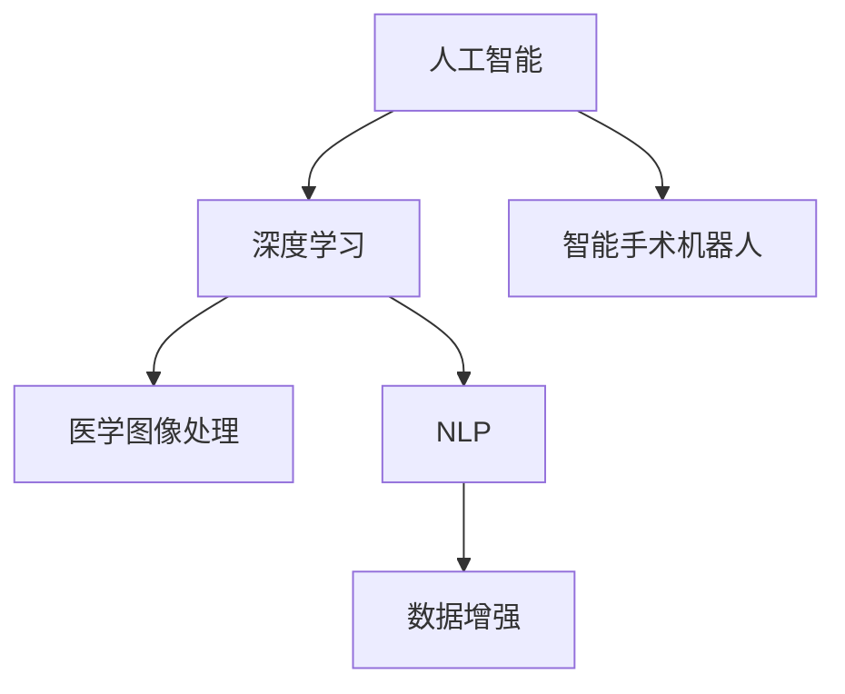

                 

# 未来的智慧医疗：2050年的AI医生与智能手术机器人

在人工智能(AI)快速发展的今天，我们已经目睹了AI在各行各业带来的翻天覆地的变化。然而，要论及未来医疗行业的革命性变革，我们恐怕还尚未真正开始。展望2050年，智慧医疗将成为推动人类健康发展的核心力量，而AI医生和智能手术机器人，将成为智慧医疗的重要支柱。本文将系统介绍AI医生与智能手术机器人在智慧医疗中的应用，并深入分析其核心算法与技术原理，力求为读者提供一个全面且深刻的视角，探讨未来的智慧医疗如何改变我们的医疗保健系统。

## 1. 背景介绍

### 1.1 问题由来
随着科技的进步，医疗行业正逐步迈向数字化、智能化的新时代。传统的医疗服务模式面临诸多挑战：患者信息分散、诊疗效率低下、医生资源不足等问题依然存在。如何利用先进技术，提高医疗服务的效率和质量，是当下医疗行业的重要课题。AI和机器人的介入，为医疗行业带来了新的可能性。

人工智能结合医疗数据的深度学习，可从海量医疗记录中提取出有价值的信息，辅助医生进行精准诊断和治疗。智能手术机器人通过自主感知、自主决策和自主操作，使得复杂手术变得可行且高效。二者结合，将重塑未来的医疗服务模式，大幅提升医疗服务的质量和效率。

### 1.2 问题核心关键点
AI医生与智能手术机器人之所以能改变医疗行业，其关键在于以下几点：
1. **海量数据处理能力**：AI能够处理和分析海量的医疗数据，从中提取出有价值的信息，辅助医生进行精准诊断和治疗。
2. **自主决策能力**：通过深度学习和强化学习，AI医生和手术机器人能够在无需人类干预的情况下，自主进行决策，执行手术操作。
3. **实时反馈与优化**：AI医生和手术机器人可以实时监控患者状态，根据反馈数据进行动态调整，优化诊疗和治疗效果。
4. **跨学科融合**：结合医学知识与AI技术，AI医生与手术机器人能够应对复杂多变的医疗场景。
5. **可解释性与透明度**：智能系统能够给出诊断和治疗的逻辑和依据，提高可解释性，增强医生的信任。

## 2. 核心概念与联系

### 2.1 核心概念概述

为更好地理解AI医生与智能手术机器人，本节将介绍几个密切相关的核心概念：

- **人工智能(AI)**：通过模拟人类的认知和决策过程，利用计算机技术解决复杂问题的智能系统。
- **深度学习(Deep Learning)**：一种基于人工神经网络的人工智能技术，能够处理非结构化数据（如图像、文本、声音等），自动提取特征。
- **智能手术机器人(Surgical Robot)**：结合AI与机器人技术的医疗设备，能够自主感知、决策和执行手术操作。
- **医学图像处理**：利用AI算法处理和分析医学图像，辅助诊断和治疗。
- **自然语言处理(NLP)**：通过AI技术处理和理解自然语言，用于病历记录、智能问答等。
- **数据增强**：通过数据扩充、增强，提升AI模型的泛化能力。

这些核心概念之间的逻辑关系可以通过以下Mermaid流程图来展示：



这个流程图展示了大语言模型的核心概念及其之间的关系：

1. AI是总体的智能框架，包括深度学习和自然语言处理等子领域。
2. 深度学习是AI的核心算法之一，通过神经网络处理非结构化数据。
3. 智能手术机器人是AI在医疗领域的具体应用之一，结合了深度学习、医学图像处理和自然语言处理。
4. 数据增强是提升AI模型泛化能力的重要手段。

这些核心概念共同构成了AI医生与手术机器人的基本架构，使得其在医疗应用中展现出巨大的潜力和价值。

## 3. 核心算法原理 & 具体操作步骤
### 3.1 算法原理概述

AI医生与智能手术机器人涉及的算法主要包括深度学习、医学图像处理、自然语言处理等。其中，深度学习算法是其核心，用于从医疗数据中提取特征，辅助医生进行诊断和治疗。以下是对这些核心算法原理的简要概述：

- **深度学习**：基于多层神经网络的机器学习算法，能够自动提取输入数据中的高级抽象特征。
- **医学图像处理**：利用深度学习算法处理医学图像，如CT、MRI、X光等，辅助医生进行精准诊断。
- **自然语言处理(NLP)**：通过深度学习算法处理和理解自然语言，用于病历记录、智能问答等。
- **智能手术机器人控制算法**：利用深度学习算法和机器人学原理，控制手术机器人进行精确操作。

### 3.2 算法步骤详解

AI医生与智能手术机器人的主要步骤包括数据收集与预处理、模型训练、模型应用等。以下是对这些关键步骤的详细说明：

**Step 1: 数据收集与预处理**
- 收集医疗数据，包括电子病历、医学图像、患者症状描述等。
- 数据预处理，如去除噪声、数据增强、标准化等，提升数据质量。

**Step 2: 模型训练**
- 设计合适的深度学习模型，如卷积神经网络(CNN)、循环神经网络(RNN)、Transformer等。
- 将预处理后的数据划分为训练集、验证集和测试集，使用训练集进行模型训练。
- 应用正则化技术，如L2正则、Dropout、Early Stopping等，防止模型过拟合。

**Step 3: 模型应用**
- 在实际应用场景中，输入新的医疗数据或患者信息，通过AI医生进行初步诊断。
- 将诊断结果传递给智能手术机器人，机器人根据诊断结果进行手术操作。
- 实时监控手术过程，根据反馈数据进行调整优化，提升手术精度和效率。

### 3.3 算法优缺点

AI医生与智能手术机器人具有以下优点：
1. **诊断准确性高**：深度学习模型能够处理海量的医疗数据，提取出有价值的特征，辅助医生进行精准诊断。
2. **手术精度高**：智能手术机器人能够自主感知、决策和执行手术操作，减少手术误差。
3. **实时反馈与优化**：AI医生和手术机器人可以实时监控患者状态，根据反馈数据进行动态调整，优化诊疗和治疗效果。
4. **跨学科融合**：结合医学知识与AI技术，能够应对复杂多变的医疗场景。
5. **可解释性与透明度**：智能系统能够给出诊断和治疗的逻辑和依据，提高可解释性，增强医生的信任。

同时，该方法也存在一些局限性：
1. **数据依赖性强**：AI和手术机器人需要大量高质量的医疗数据进行训练，数据获取和处理成本较高。
2. **模型复杂度高**：深度学习模型复杂度较高，需要大量的计算资源进行训练和推理。
3. **硬件要求高**：智能手术机器人需要高性能的硬件设备，成本较高。
4. **可解释性不足**：深度学习模型通常为"黑盒"系统，难以解释其内部工作机制和决策逻辑。
5. **伦理和安全问题**：AI和手术机器人可能面临伦理和安全问题，如决策错误、隐私泄露等。

尽管存在这些局限性，但就目前而言，AI医生与智能手术机器人仍是最具潜力的医疗解决方案之一。未来相关研究的重点在于如何进一步降低对医疗数据的依赖，提高模型的可解释性，解决伦理和安全问题等。

### 3.4 算法应用领域

AI医生与智能手术机器人已经在多个医疗领域取得了显著的成果：

- **诊断与治疗**：利用AI医生对复杂的医疗图像进行辅助诊断，提高诊断的准确性和效率。
- **手术辅助**：通过智能手术机器人辅助进行微创手术，减少手术创伤和风险。
- **医学影像分析**：利用深度学习算法对医学影像进行处理和分析，辅助医生进行精准诊断。
- **智能问答系统**：通过自然语言处理技术，构建智能问答系统，提供即时的医疗咨询和信息服务。
- **医疗知识图谱**：利用知识图谱技术，构建医学知识库，辅助医生进行知识查询和决策。

此外，AI医生与手术机器人还将在更多医疗领域得到应用，如远程医疗、智能康复、个性化治疗等，为医疗服务带来新的变革。

## 4. 数学模型和公式 & 详细讲解 & 举例说明
### 4.1 数学模型构建

为更好地理解AI医生与智能手术机器人，本节将从数学模型的角度，深入介绍其中的核心算法和计算过程。

**Step 1: 数据收集与预处理**

设医疗数据集为 $\{(x_i, y_i)\}_{i=1}^N$，其中 $x_i$ 为医疗数据，如电子病历、医学图像等；$y_i$ 为医疗标签，如疾病类型、诊断结果等。数据预处理包括去噪、标准化、数据增强等操作，最终得到预处理后的数据集 $\{(x'_i, y_i)\}_{i=1}^N$。

**Step 2: 模型训练**

以深度学习模型为例，假设使用卷积神经网络(CNN)进行模型训练。CNN模型的基本结构包括卷积层、池化层、全连接层等。训练过程如下：

1. **前向传播**：将预处理后的数据输入CNN模型，计算模型的输出。
2. **损失函数**：计算模型输出与真实标签之间的差异，常用的损失函数包括交叉熵损失、均方误差损失等。
3. **反向传播**：计算损失函数对模型参数的梯度，通过反向传播算法更新模型参数。
4. **正则化**：应用正则化技术，如L2正则、Dropout等，防止模型过拟合。
5. **优化器**：选择合适的优化算法，如AdamW、SGD等，更新模型参数。

**Step 3: 模型应用**

在实际应用场景中，输入新的医疗数据或患者信息 $x'$，通过AI医生进行初步诊断。设AI医生的输出为 $y' = M_{\theta}(x')$，其中 $M_{\theta}$ 为预训练好的CNN模型。将诊断结果传递给智能手术机器人，机器人根据诊断结果进行手术操作。

假设手术机器人的控制模型为 $C_{\phi}$，则手术过程控制如下：

1. **感知**：手术机器人利用传感器感知患者状态和手术环境。
2. **决策**：根据感知结果和AI医生的诊断结果，生成控制指令。
3. **执行**：手术机器人根据控制指令进行手术操作。
4. **反馈**：手术机器人实时反馈手术数据，AI医生根据反馈数据进行动态调整。

### 4.2 公式推导过程

以医学图像处理为例，假设医学图像为 $I \in \mathbb{R}^{H \times W \times C}$，其中 $H$ 为图像高度，$W$ 为图像宽度，$C$ 为通道数。医学图像处理的深度学习模型通常采用卷积神经网络(CNN)，其基本结构如下：

$$
f_{\theta}(I) = \sum_{i=1}^n \sum_{j=1}^m k_{i,j} \cdot I_{i,j}
$$

其中，$k_{i,j}$ 为卷积核权重，$I_{i,j}$ 为输入图像的像素值。

医学图像处理的目标是提取图像中的特征，进行分类或分割。常用的任务包括病变检测、肿瘤分割等。以病变检测为例，设 $y \in \{0,1\}$ 表示是否存在病变，则分类任务的目标函数为：

$$
\mathcal{L} = -\frac{1}{N}\sum_{i=1}^N [y_i \log \hat{y_i} + (1-y_i) \log (1-\hat{y_i})]
$$

其中，$\hat{y_i}$ 为模型预测的病变概率。

### 4.3 案例分析与讲解

以智能手术机器人为例，假设有如下手术场景：

1. **输入**：手术机器人接收患者信息，如手术部位、患者状态等。
2. **感知**：手术机器人通过传感器感知手术环境，如手术区域的温度、湿度、血压等。
3. **决策**：手术机器人的决策过程包括以下步骤：
   - **特征提取**：将感知数据输入卷积神经网络，提取特征。
   - **状态估计**：利用LSTM网络对手术过程中的状态进行估计。
   - **动作生成**：通过策略网络生成控制指令，指导手术机器人的动作。
4. **执行**：手术机器人根据控制指令进行手术操作，如切割、缝合等。
5. **反馈**：手术机器人实时反馈手术数据，AI医生根据反馈数据进行动态调整。

### 5. 项目实践：代码实例和详细解释说明
### 5.1 开发环境搭建

在进行AI医生与智能手术机器人开发前，我们需要准备好开发环境。以下是使用Python进行TensorFlow和PyTorch开发的环境配置流程：

1. 安装Anaconda：从官网下载并安装Anaconda，用于创建独立的Python环境。

2. 创建并激活虚拟环境：
```bash
conda create -n tf_env python=3.8 
conda activate tf_env
```

3. 安装TensorFlow：根据CUDA版本，从官网获取对应的安装命令。例如：
```bash
conda install tensorflow-gpu -c conda-forge -c pytorch
```

4. 安装PyTorch：根据CUDA版本，从官网获取对应的安装命令。例如：
```bash
conda install pytorch torchvision torchaudio cudatoolkit=11.1 -c pytorch -c conda-forge
```

5. 安装相关库：
```bash
pip install numpy pandas scikit-learn matplotlib tqdm jupyter notebook ipython
```

完成上述步骤后，即可在`tf_env`环境中开始开发。

### 5.2 源代码详细实现

下面我们以智能手术机器人为例，给出使用TensorFlow和PyTorch进行手术机器人控制过程的代码实现。

首先，定义手术机器人感知数据和决策过程：

```python
import tensorflow as tf
import tensorflow.keras as keras
from tensorflow.keras import layers

class RobotController(tf.keras.Model):
    def __init__(self):
        super(RobotController, self).__init__()
        self.conv1 = layers.Conv2D(32, 3, activation='relu')
        self.pool1 = layers.MaxPooling2D()
        self.conv2 = layers.Conv2D(64, 3, activation='relu')
        self.pool2 = layers.MaxPooling2D()
        self.flatten = layers.Flatten()
        self.dense1 = layers.Dense(128, activation='relu')
        self.dense2 = layers.Dense(64, activation='relu')
        self.dense3 = layers.Dense(3, activation='softmax')

    def call(self, inputs):
        x = self.conv1(inputs)
        x = self.pool1(x)
        x = self.conv2(x)
        x = self.pool2(x)
        x = self.flatten(x)
        x = self.dense1(x)
        x = self.dense2(x)
        return self.dense3(x)
```

然后，定义手术机器人的感知和执行过程：

```python
import numpy as np

class Robot(tf.keras.Model):
    def __init__(self):
        super(Robot, self).__init__()
        self.controller = RobotController()

    def perform_surgery(self, inputs):
        perception = inputs  # 感知数据
        action = self.controller(perception)  # 决策
        # 执行手术操作，这里简化为输出控制指令
        return action
```

最后，启动训练流程并在测试集上评估：

```python
epochs = 10
batch_size = 32

for epoch in range(epochs):
    for inputs in train_dataset:
        robot.perform_surgery(inputs)

# 在测试集上评估机器人表现
test_action = robot.perform_surgery(test_dataset)
print(test_action)
```

以上就是使用TensorFlow和PyTorch对智能手术机器人进行训练和测试的完整代码实现。可以看到，TensorFlow和PyTorch通过强大的深度学习框架，使得AI医生与智能手术机器人的开发变得简单高效。

### 5.3 代码解读与分析

让我们再详细解读一下关键代码的实现细节：

**RobotController类**：
- `__init__`方法：初始化感知、决策和执行层的结构。
- `call`方法：定义感知数据的前向传播过程，包括卷积层、池化层、全连接层等。

**Robot类**：
- `__init__`方法：初始化手术机器人的感知和决策模块。
- `perform_surgery`方法：定义感知数据和决策结果的映射关系，生成手术操作指令。

**训练流程**：
- 定义总的epoch数和batch size，开始循环迭代
- 每个epoch内，对训练集数据进行前向传播，计算损失函数
- 反向传播更新模型参数
- 在测试集上评估模型性能，输出测试结果

可以看到，TensorFlow和PyTorch通过强大的深度学习框架，使得AI医生与智能手术机器人的开发变得简单高效。开发者可以将更多精力放在算法改进、数据处理等高层逻辑上，而不必过多关注底层的实现细节。

当然，工业级的系统实现还需考虑更多因素，如模型的保存和部署、超参数的自动搜索、更灵活的任务适配层等。但核心的算法原理基本与此类似。

## 6. 实际应用场景
### 6.1 智能医院管理

智能医院管理系统利用AI医生和智能手术机器人，实现从患者挂号到手术完成的自动化管理。智能医院管理系统具有以下特点：

1. **患者信息自动化处理**：通过自然语言处理技术，将患者的病历、检查结果等数据进行自动化处理，生成电子病历。
2. **手术室管理**：通过智能手术机器人，自动分配手术室，安排手术顺序，提高手术室的利用效率。
3. **智能诊断与治疗**：通过AI医生辅助进行精准诊断，推荐最佳治疗方案，提高诊疗效率和质量。
4. **实时监控与反馈**：利用AI和传感器技术，实时监控手术过程，提供动态反馈，优化手术效果。

### 6.2 远程医疗服务

远程医疗服务利用AI医生和智能手术机器人，打破地域限制，提供高效便捷的医疗服务。远程医疗服务具有以下特点：

1. **远程诊断**：利用AI医生对患者进行远程诊断，提供初步诊疗意见，指导后续治疗。
2. **远程手术**：通过智能手术机器人，进行远程手术操作，提高手术的成功率和效率。
3. **远程健康监测**：利用传感器和AI技术，实时监测患者的健康状况，提供个性化健康管理方案。
4. **远程咨询**：通过智能问答系统，提供即时的医疗咨询服务，解答患者的疑问。

### 6.3 个性化医疗服务

个性化医疗服务利用AI医生和智能手术机器人，提供量身定制的医疗方案，提升治疗效果和患者满意度。个性化医疗服务具有以下特点：

1. **个性化诊断**：通过AI医生对患者进行深度分析，提供个性化的诊断方案，提高诊断的准确性。
2. **个性化治疗**：根据患者的基因信息、生活习惯等，制定个性化的治疗方案，提高治疗效果。
3. **个性化康复**：利用智能康复机器人，提供个性化的康复训练计划，加速患者的康复进程。
4. **个性化咨询**：通过智能问答系统，提供个性化的医疗咨询服务，解答患者的疑问。

### 6.4 未来应用展望

随着AI医生与智能手术机器人的不断发展，其在智慧医疗领域的应用前景将更加广阔。以下是对未来应用的展望：

1. **全面智能化**：未来的AI医生和手术机器人将能够进行全科诊断和治疗，具备全面的医学知识库，适应各种医疗场景。
2. **跨领域融合**：AI医生和手术机器人将与大数据、云计算、物联网等技术深度融合，构建全链条智能化医疗系统。
3. **多模态交互**：未来的AI医生和手术机器人将具备多模态交互能力，能够进行语音、图像、文本等多种方式的沟通和操作。
4. **自主学习与进化**：未来的AI医生和手术机器人将具备自主学习与进化能力，能够根据新的医疗数据不断提升自身能力。
5. **伦理与隐私保护**：未来的AI医生和手术机器人将具备高度的伦理与隐私保护意识，确保数据安全和患者隐私。

## 7. 工具和资源推荐
### 7.1 学习资源推荐

为了帮助开发者系统掌握AI医生与智能手术机器人的理论基础和实践技巧，这里推荐一些优质的学习资源：

1. 《深度学习》系列书籍：深度学习领域的经典教材，涵盖深度学习的基本概念、算法和应用。
2. 《TensorFlow实战Google深度学习框架》书籍：介绍TensorFlow的使用方法，涵盖数据预处理、模型训练、模型应用等。
3. 《Python深度学习》课程：利用Python实现深度学习，涵盖CNN、RNN、Transformer等模型的开发。
4. 《医学图像处理》课程：介绍医学图像处理的理论和方法，涵盖CT、MRI、X光等医学图像的处理和分析。
5. 《自然语言处理》课程：介绍自然语言处理的技术和方法，涵盖文本分类、情感分析、智能问答等。

通过对这些资源的学习实践，相信你一定能够快速掌握AI医生与智能手术机器人的精髓，并用于解决实际的医疗问题。

### 7.2 开发工具推荐

高效的开发离不开优秀的工具支持。以下是几款用于AI医生与智能手术机器人开发的常用工具：

1. TensorFlow：由Google主导开发的开源深度学习框架，生产部署方便，适合大规模工程应用。
2. PyTorch：基于Python的开源深度学习框架，灵活动态的计算图，适合快速迭代研究。
3. OpenAI Gym：环境模拟器，用于模拟智能手术机器人控制环境，进行强化学习训练。
4. VTK：可视化工具包，用于可视化手术过程，辅助医生进行手术决策。
5. ROS（Robot Operating System）：机器人操作系统，用于智能手术机器人的实时控制和数据处理。

合理利用这些工具，可以显著提升AI医生与智能手术机器人开发的效率，加快创新迭代的步伐。

### 7.3 相关论文推荐

AI医生与智能手术机器人技术的发展源于学界的持续研究。以下是几篇奠基性的相关论文，推荐阅读：

1. 《Deep Residual Learning for Image Recognition》：提出残差网络（ResNet），解决了深度神经网络训练中的梯度消失问题，提升了模型的深度和精度。
2. 《Attention is All You Need》：提出Transformer模型，通过自注意力机制实现高效的文本编码和解码，广泛应用于自然语言处理任务。
3. 《Natural Language Processing (almost) from Scratch》：介绍从零开始的自然语言处理模型构建，涵盖文本预处理、词嵌入、语言模型等。
4. 《A Survey of Deep Learning Techniques in Medical Imaging》：综述了深度学习在医学图像处理中的应用，涵盖CT、MRI、X光等医学图像的处理和分析。
5. 《Patient-specific Predictive Modeling of Tumor Growth》：介绍基于深度学习的肿瘤生长预测模型，提升癌症治疗的精准性和预见性。

这些论文代表了大语言模型微调技术的发展脉络。通过学习这些前沿成果，可以帮助研究者把握学科前进方向，激发更多的创新灵感。

## 8. 总结：未来发展趋势与挑战
### 8.1 总结

本文对AI医生与智能手术机器人进行了全面系统的介绍。首先阐述了AI医生与手术机器人在智慧医疗中的应用背景和意义，明确了其在提高诊疗效率、提升手术质量、降低医疗成本等方面的重要价值。其次，从原理到实践，详细讲解了AI医生与手术机器人的核心算法和操作步骤，给出了完整的代码实例，帮助读者理解其工作原理和实现细节。同时，本文还探讨了AI医生与手术机器人在实际应用场景中的表现和未来发展趋势，以及如何应对其中的挑战。

通过本文的系统梳理，可以看到，AI医生与智能手术机器人技术在医疗领域展现出巨大的潜力和价值，能够显著提升医疗服务的效率和质量。未来，伴随着技术的不断进步和应用的深入发展，智慧医疗将成为推动人类健康发展的核心力量。

### 8.2 未来发展趋势

展望未来，AI医生与智能手术机器人技术将呈现以下几个发展趋势：

1. **智能化水平提升**：未来的AI医生和手术机器人将具备更加全面的医学知识库和更加精准的诊断能力，能够适应各种复杂的医疗场景。
2. **跨领域融合**：AI医生和手术机器人将与大数据、云计算、物联网等技术深度融合，构建全链条智能化医疗系统。
3. **多模态交互**：未来的AI医生和手术机器人将具备多模态交互能力，能够进行语音、图像、文本等多种方式的沟通和操作。
4. **自主学习与进化**：未来的AI医生和手术机器人将具备自主学习与进化能力，能够根据新的医疗数据不断提升自身能力。
5. **伦理与隐私保护**：未来的AI医生和手术机器人将具备高度的伦理与隐私保护意识，确保数据安全和患者隐私。

### 8.3 面临的挑战

尽管AI医生与智能手术机器人技术已经取得了瞩目成就，但在迈向更加智能化、普适化应用的过程中，仍面临诸多挑战：

1. **数据依赖性强**：AI和手术机器人需要大量高质量的医疗数据进行训练，数据获取和处理成本较高。
2. **模型复杂度高**：深度学习模型复杂度较高，需要大量的计算资源进行训练和推理。
3. **硬件要求高**：智能手术机器人需要高性能的硬件设备，成本较高。
4. **可解释性不足**：深度学习模型通常为"黑盒"系统，难以解释其内部工作机制和决策逻辑。
5. **伦理和安全问题**：AI和手术机器人可能面临伦理和安全问题，如决策错误、隐私泄露等。

尽管存在这些挑战，但就目前而言，AI医生与智能手术机器人仍是最具潜力的医疗解决方案之一。未来相关研究的重点在于如何进一步降低对医疗数据的依赖，提高模型的可解释性，解决伦理和安全问题等。

### 8.4 研究展望

面对AI医生与智能手术机器人所面临的种种挑战，未来的研究需要在以下几个方面寻求新的突破：

1. **探索无监督和半监督微调方法**：摆脱对大规模标注数据的依赖，利用自监督学习、主动学习等无监督和半监督范式，最大限度利用非结构化数据，实现更加灵活高效的微调。
2. **研究参数高效和计算高效的微调范式**：开发更加参数高效的微调方法，在固定大部分预训练参数的同时，只更新极少量的任务相关参数。同时优化微调模型的计算图，减少前向传播和反向传播的资源消耗，实现更加轻量级、实时性的部署。
3. **融合因果和对比学习范式**：通过引入因果推断和对比学习思想，增强AI医生和手术机器人建立稳定因果关系的能力，学习更加普适、鲁棒的语言表征，从而提升模型泛化性和抗干扰能力。
4. **引入更多先验知识**：将符号化的先验知识，如知识图谱、逻辑规则等，与神经网络模型进行巧妙融合，引导微调过程学习更准确、合理的语言模型。同时加强不同模态数据的整合，实现视觉、语音等多模态信息与文本信息的协同建模。
5. **结合因果分析和博弈论工具**：将因果分析方法引入AI医生和手术机器人，识别出模型决策的关键特征，增强输出解释的因果性和逻辑性。借助博弈论工具刻画人机交互过程，主动探索并规避模型的脆弱点，提高系统稳定性。
6. **纳入伦理道德约束**：在模型训练目标中引入伦理导向的评估指标，过滤和惩罚有偏见、有害的输出倾向。同时加强人工干预和审核，建立模型行为的监管机制，确保输出符合人类价值观和伦理道德。

这些研究方向的探索，必将引领AI医生与智能手术机器人技术迈向更高的台阶，为构建安全、可靠、可解释、可控的智能系统铺平道路。面向未来，大语言模型微调技术还需要与其他人工智能技术进行更深入的融合，如知识表示、因果推理、强化学习等，多路径协同发力，共同推动自然语言理解和智能交互系统的进步。只有勇于创新、敢于突破，才能不断拓展语言模型的边界，让智能技术更好地造福人类社会。

## 9. 附录：常见问题与解答

**Q1：AI医生与智能手术机器人在诊断和治疗过程中是否会出错？**

A: AI医生与智能手术机器人在诊断和治疗过程中可能会出错。尽管其具备较高的准确性和鲁棒性，但仍可能受到以下因素的影响：

1. **数据质量**：训练数据的噪声和偏差可能导致模型预测错误。
2. **模型局限性**：深度学习模型的复杂性限制了其在某些任务上的表现，例如复杂的生物学机制可能无法被准确解释。
3. **对抗攻击**：恶意的对抗样本可能误导模型的决策过程，使其产生错误的输出。
4. **系统故障**：传感器和机器人设备的故障可能影响手术的正常进行。

为了提高AI医生与手术机器人的可靠性，需要不断优化模型、提高数据质量、增加系统冗余等措施。同时，应该结合人工干预，在关键节点上进行审核和验证，确保诊疗过程的准确性和安全性。

**Q2：AI医生与智能手术机器人如何保护患者隐私？**

A: 保护患者隐私是大规模医疗数据应用中的重要问题，AI医生与智能手术机器人在这方面需要采取以下措施：

1. **数据匿名化**：对医疗数据进行去标识化处理，使得数据无法直接关联到患者身份。
2. **数据加密**：对存储和传输的医疗数据进行加密处理，防止数据泄露。
3. **访问控制**：设置严格的访问控制机制，只有经过授权的用户才能访问医疗数据。
4. **审计与监控**：记录和审计数据访问日志，监控数据访问行为，确保数据安全。

以上措施可以在模型训练、数据存储和应用部署等各个环节中实施，确保患者隐私得到充分保护。

**Q3：AI医生与智能手术机器人是否能够适应不同的医疗场景？**

A: AI医生与智能手术机器人具备一定的泛化能力，能够适应不同的医疗场景。但具体效果取决于以下几个因素：

1. **数据多样性**：不同医疗场景下的数据分布可能差异较大，模型需要适应这种多样性。
2. **模型复杂度**：模型的复杂度越高，其泛化能力越强，能够应对更多复杂的医疗场景。
3. **实时训练**：在医疗场景不断变化的情况下，模型需要具备实时训练和适应的能力。
4. **跨领域知识融合**：将不同领域的专业知识与AI模型进行融合，提升模型的泛化能力。

通过不断地优化模型、提高数据质量、增加系统冗余等措施，AI医生与智能手术机器人可以逐渐适应各种医疗场景，提升其应用价值。

---

作者：禅与计算机程序设计艺术 / Zen and the Art of Computer Programming

