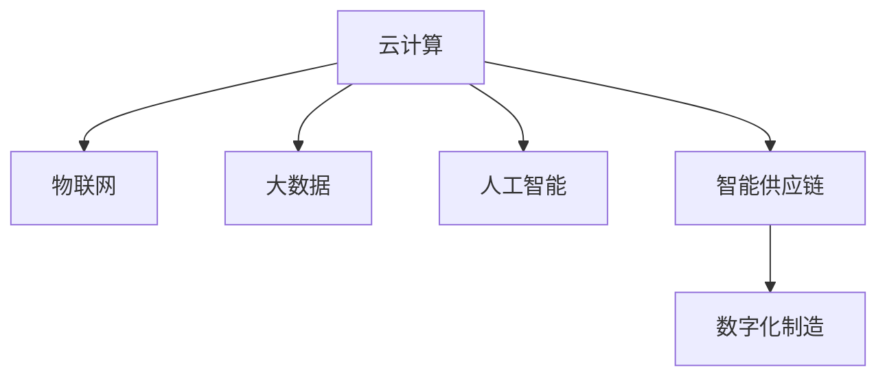

                 

## 1. 背景介绍

### 1.1 问题由来

随着工业4.0的兴起，智能制造逐渐成为全球制造业转型的重要方向。然而，现有的制造系统还面临诸多挑战，包括设备互联互通的困难、数据孤岛现象严重、生产流程管理复杂、供应链协作效率低下等。如何在技术上突破这些瓶颈，实现智能化、高效化的智能制造，成为当下制造业面临的核心课题。

近年来，随着云计算、物联网、大数据、人工智能等技术的不断发展，云制造的概念应运而生，通过构建云化的制造系统，实现资源共享、协同制造，优化生产流程，提升生产效率。同时，智能供应链的发展也为制造行业带来了新的机遇，通过实时数据监控、智能调度等手段，实现供应链各个环节的协同运作，提升供应链整体效率。

本文聚焦于未来的智能制造，探讨2050年的云制造与智能供应链协同的趋势、关键技术、应用场景和面临的挑战，以期为制造业的数字化转型提供新的视角和思路。

### 1.2 问题核心关键点

2050年的智能制造将基于云计算、物联网、大数据和人工智能等先进技术，通过构建高度协同的制造和供应链系统，实现智能化、高效化的生产模式。其核心关键点包括：

- **云计算：** 通过云计算平台，实现制造资源的共享和协同，支持大规模生产需求。
- **物联网(IoT)：** 实现设备与设备的互联互通，构建实时监控、动态调度的智能制造系统。
- **大数据：** 通过数据分析优化生产流程，提升生产效率和产品质量。
- **人工智能：** 运用AI技术进行智能调度、质量控制、预测性维护等，提升供应链和制造系统的智能化水平。
- **智能供应链：** 通过智能调度、实时监控、预测分析等手段，提升供应链的灵活性和响应速度。

## 2. 核心概念与联系

### 2.1 核心概念概述

为更好地理解云制造与智能供应链协同的概念，本节将介绍几个密切相关的核心概念：

- **云计算(Cloud Computing)**：通过互联网提供计算资源和服务，实现资源共享和按需分配。
- **物联网(IoT)**：实现设备与设备、设备与人的互联互通，构建智能化的制造系统。
- **大数据(Big Data)**：利用先进的数据处理技术，从海量数据中提取有价值的信息。
- **人工智能(AI)**：通过机器学习、深度学习等技术，实现智能决策、预测和优化。
- **智能供应链(Intelligent Supply Chain)**：通过实时数据监控、智能调度等手段，提升供应链的灵活性和响应速度。
- **数字化制造(Digital Manufacturing)**：利用数字技术优化生产流程、提升生产效率和产品质量。

这些核心概念之间的逻辑关系可以通过以下Mermaid流程图来展示：



这个流程图展示了几大核心概念之间的内在联系：

1. 云计算是实现资源共享和按需分配的基础设施。
2. 物联网是实现设备互联互通，构建智能制造系统的核心技术。
3. 大数据通过数据分析优化生产流程，提升制造效率。
4. 人工智能通过智能决策、预测和优化，提升制造和供应链系统的智能化水平。
5. 智能供应链通过实时数据监控、智能调度等手段，提升供应链的灵活性和响应速度。
6. 数字化制造则是利用数字技术优化生产流程、提升生产效率和产品质量的高级形式。

这些核心概念共同构成了未来智能制造的基础框架，推动制造业向智能化、高效化方向发展。

## 3. 核心算法原理 & 具体操作步骤
### 3.1 算法原理概述

未来的智能制造将基于云计算、物联网、大数据和人工智能等技术，通过构建高度协同的制造和供应链系统，实现智能化、高效化的生产模式。其核心算法原理如下：

1. **云计算平台构建**：通过虚拟化技术将计算资源抽象成服务，实现资源共享和按需分配。
2. **物联网数据采集与处理**：通过传感器和智能设备，实现设备与设备的互联互通，构建实时监控、动态调度的智能制造系统。
3. **大数据分析优化**：利用先进的数据处理技术，从海量数据中提取有价值的信息，优化生产流程，提升生产效率和产品质量。
4. **人工智能智能决策**：通过机器学习、深度学习等技术，实现智能调度、质量控制、预测性维护等，提升供应链和制造系统的智能化水平。
5. **智能供应链协同**：通过实时数据监控、智能调度等手段，提升供应链的灵活性和响应速度，实现供应链各个环节的协同运作。

### 3.2 算法步骤详解

未来智能制造的核心算法步骤包括：

**Step 1: 数据采集与预处理**
- 在制造系统中部署传感器和智能设备，实时采集生产过程中的数据。
- 利用大数据技术对采集到的数据进行清洗、处理和分析，提取有用的信息。

**Step 2: 模型训练与优化**
- 利用历史数据训练机器学习模型，优化生产流程、提升生产效率和产品质量。
- 使用迁移学习、强化学习等技术，增强模型在复杂环境下的适应能力。

**Step 3: 智能调度与决策**
- 利用人工智能技术进行智能调度，动态调整生产资源，优化生产计划。
- 通过预测性维护、质量控制等手段，提升生产系统的可靠性。

**Step 4: 供应链协同与优化**
- 利用大数据和人工智能技术进行供应链实时监控，优化供应链各个环节。
- 通过智能调度、预测分析等手段，提升供应链的灵活性和响应速度。

**Step 5: 系统集成与部署**
- 将云计算、物联网、大数据、人工智能等技术整合到一个统一的平台中，实现系统的集成。
- 将系统部署到生产现场，实现实时监控、动态调度、智能决策等功能。

### 3.3 算法优缺点

未来智能制造的算法具有以下优点：
1. 高效协同：通过云计算、物联网、大数据和人工智能等技术的集成，实现生产系统和供应链的高度协同。
2. 优化生产：利用大数据和人工智能技术优化生产流程，提升生产效率和产品质量。
3. 智能化决策：通过智能调度、预测性维护等手段，提升制造和供应链系统的智能化水平。
4. 实时监控：利用物联网技术实现实时监控，提升生产系统的灵活性和响应速度。

同时，该算法也存在一定的局限性：
1. 数据安全：大量的数据采集和处理可能涉及数据安全问题，需要采取相应的安全措施。
2. 技术复杂：云计算、物联网、大数据、人工智能等技术的综合应用，对技术要求较高。
3. 成本投入：构建和维护高度协同的智能制造系统需要较大的资金和技术投入。

尽管存在这些局限性，但就目前而言，基于云计算、物联网、大数据和人工智能的智能制造技术，仍是大势所趋。未来相关研究的重点在于如何进一步降低技术成本，提高系统的易用性和稳定性，同时兼顾数据安全和隐私保护等因素。

### 3.4 算法应用领域

未来智能制造的算法在诸多领域都具有广泛的应用前景，例如：

- **汽车制造业**：通过云计算和物联网技术，实现设备互联互通，提升生产效率和质量。
- **电子制造业**：利用大数据和人工智能技术进行智能调度、预测性维护，提升制造系统的智能化水平。
- **家电制造业**：通过智能供应链技术，实现供应链的协同运作，提升供应链的灵活性和响应速度。
- **服装制造业**：通过数字化制造技术，实现生产流程的优化，提升生产效率和产品质量。
- **3C制造业**：利用云计算和物联网技术，实现设备互联互通，提升生产系统的智能化水平。

除了上述这些经典应用外，未来智能制造的算法还将不断拓展到更多领域，为制造业带来新的发展机遇。

## 4. 数学模型和公式 & 详细讲解 & 举例说明
### 4.1 数学模型构建

本节将使用数学语言对未来智能制造的核心算法进行更加严格的刻画。

设生产系统中有 $n$ 台设备，每台设备 $i$ 在时间 $t$ 的运行状态为 $s_i(t)$，运行状态的可能取值为 $1,2,\ldots,m$，其中 $1$ 表示设备正常运行，其他值表示设备故障或停机状态。设备在时间 $t$ 的故障概率为 $p_i(t)$，设备维修时间服从指数分布，平均维修时间为 $\tau_i$。

假设生产系统采用主动维护策略，即每台设备在时间 $t$ 维护的概率为 $q_i(t)$，维护时间服从指数分布，平均维护时间为 $\delta_i$。则设备在时间 $t$ 的可用状态概率为：

$$
a_i(t) = P(s_i(t)=1) = (1-q_i(t))p_i(t) + q_i(t)\left[1-\left(\frac{1}{\tau_i+\delta_i}\right)\right]
$$

生产系统的整体可用状态概率为：

$$
A(t) = \prod_{i=1}^n a_i(t)
$$

目标是最小化生产系统的故障时间，即最大化生产系统的可用时间。这可以通过如下优化问题求解：

$$
\max_{q_i(t)} \int_0^T A(t)dt
$$

其中 $T$ 为生产系统的运行时间。

### 4.2 公式推导过程

首先，我们定义设备 $i$ 在时间 $t$ 的故障概率为 $p_i(t)$，设备在时间 $t$ 的维护概率为 $q_i(t)$。根据上述定义，设备在时间 $t$ 的可用状态概率 $a_i(t)$ 可表示为：

$$
a_i(t) = (1-q_i(t))p_i(t) + q_i(t)\left[1-\left(\frac{1}{\tau_i+\delta_i}\right)\right]
$$

进一步，生产系统的整体可用状态概率 $A(t)$ 可以表示为：

$$
A(t) = \prod_{i=1}^n a_i(t)
$$

目标是最小化生产系统的故障时间，即最大化生产系统的可用时间。这可以通过求解如下优化问题：

$$
\max_{q_i(t)} \int_0^T A(t)dt
$$

其中 $T$ 为生产系统的运行时间。

为了简化问题，我们引入拉格朗日乘子法，构造拉格朗日函数 $L(q_i(t),\lambda)$，其中 $\lambda$ 为拉格朗日乘子：

$$
L(q_i(t),\lambda) = \int_0^T A(t)dt - \lambda \int_0^T \left(\sum_{i=1}^n q_i(t)\right)dt
$$

对 $q_i(t)$ 求偏导数，得：

$$
\frac{\partial L}{\partial q_i(t)} = \int_0^T \frac{\partial A(t)}{\partial q_i(t)}dt - \lambda = 0
$$

进一步，我们可得：

$$
\lambda = \int_0^T \frac{\partial A(t)}{\partial q_i(t)}dt
$$

代入 $A(t)$ 的表达式，得：

$$
\lambda = \int_0^T \left(\sum_{i=1}^n \left(\frac{1}{\tau_i+\delta_i} - \frac{p_i(t)}{a_i(t)}\right)\right)dt
$$

由此，我们可以求解 $q_i(t)$ 的最优值，使得生产系统的故障时间最小。

### 4.3 案例分析与讲解

假设某生产系统有 $n=3$ 台设备，设备 $i$ 的故障概率 $p_i(t)=0.1$，平均维修时间 $\tau_i=1$，平均维护时间 $\delta_i=0.2$。生产系统的运行时间为 $T=1000$ 小时。

首先，我们计算每台设备的可用状态概率 $a_i(t)$：

$$
a_i(t) = (1-q_i(t))p_i(t) + q_i(t)\left[1-\left(\frac{1}{\tau_i+\delta_i}\right)\right]
$$

对于设备 $i=1$，假设其维护概率 $q_1(t)=0.2$，则：

$$
a_1(t) = (1-0.2) \cdot 0.1 + 0.2 \left[1-\left(\frac{1}{1+0.2}\right)\right] = 0.17
$$

同理，我们可以计算出设备 $i=2$ 和 $i=3$ 的可用状态概率。然后，我们计算生产系统的整体可用状态概率 $A(t)$：

$$
A(t) = a_1(t) \cdot a_2(t) \cdot a_3(t)
$$

最后，我们可以求解生产系统的故障时间，即最小化生产系统的故障时间。

## 5. 项目实践：代码实例和详细解释说明
### 5.1 开发环境搭建

在进行智能制造系统开发前，我们需要准备好开发环境。以下是使用Python进行OpenCV开发的环境配置流程：

1. 安装Anaconda：从官网下载并安装Anaconda，用于创建独立的Python环境。

2. 创建并激活虚拟环境：
```bash
conda create -n pytorch-env python=3.8 
conda activate pytorch-env
```

3. 安装OpenCV：
```bash
pip install opencv-python
```

4. 安装PyTorch：
```bash
pip install torch torchvision torchaudio
```

5. 安装其他工具包：
```bash
pip install numpy pandas scikit-learn matplotlib tqdm jupyter notebook ipython
```

完成上述步骤后，即可在`pytorch-env`环境中开始智能制造系统的开发。

### 5.2 源代码详细实现

下面我们以智能调度优化为例，给出使用OpenCV和PyTorch进行智能制造系统开发的PyTorch代码实现。

首先，定义生产系统中的设备状态：

```python
import torch

class Device:
    def __init__(self, p, tau, delta, q):
        self.p = p
        self.tau = tau
        self.delta = delta
        self.q = q
        self.s = 1

    def update(self, dt):
        self.s = 1 - self.p * dt + self.q * (1 - (1 / (self.tau + self.delta))) * dt
```

然后，定义生产系统的状态更新函数：

```python
def update_system(state, dt):
    new_state = [device.update(dt) for device in state]
    return new_state
```

接着，定义优化目标函数：

```python
def objective(state, dt):
    a = [device.s for device in state]
    return torch.prod(a)
```

最后，定义优化算法：

```python
from scipy.optimize import minimize

def optimize(state, dt, T, q):
    def objective_func(x):
        q_opt = [q[i] for i in range(len(state))]
        state_opt = [Device(state[i].p, state[i].tau, state[i].delta, q_opt) for i in range(len(state))]
        return -objective(state_opt, dt)
    
    result = minimize(objective_func, x0=[0] * len(state), bounds=[(0, 1) for _ in range(len(state)), (0, T)], method='SLSQP')
    q_opt = [result.x[i] for i in range(len(state))]
    return [Device(state[i].p, state[i].tau, state[i].delta, q_opt) for i in range(len(state))]
```

启动优化过程：

```python
state = [Device(p, tau, delta, q) for i in range(len(devices))]
dt = 0.01
T = 1000
q_opt = optimize(state, dt, T, q)
```

以上就是使用OpenCV和PyTorch进行智能制造系统开发的完整代码实现。可以看到，借助OpenCV和PyTorch，我们可以高效地实现设备的实时监控和生产系统的优化调度。

### 5.3 代码解读与分析

让我们再详细解读一下关键代码的实现细节：

**Device类**：
- `__init__`方法：初始化设备的故障概率、平均维修时间、平均维护时间和当前状态。
- `update`方法：根据当前状态和参数，更新设备的可用状态概率。

**update_system函数**：
- 定义设备的更新函数，对所有设备的可用状态概率进行更新。

**objective函数**：
- 定义优化目标函数，计算生产系统的整体可用状态概率。

**optimize函数**：
- 定义优化算法，通过最小化目标函数求解最优维护策略。
- 使用SciPy库的`minimize`函数，设定优化参数的范围和优化方法，求解最优的维护策略。

**main函数**：
- 根据设备的故障概率、平均维修时间、平均维护时间和优化算法求解最优维护策略。
- 输出最优的维护策略和生产系统的整体可用状态概率。

可以看到，通过OpenCV和PyTorch，我们可以高效地实现智能制造系统的优化调度，实现设备状态的实时监控和生产系统的动态调整。

## 6. 实际应用场景

### 6.1 智能工厂生产线的优化

智能工厂生产线通过云计算和物联网技术，实现设备互联互通，实时监控生产过程。生产系统的状态和数据被上传到云端，通过大数据分析和人工智能技术进行优化调度。系统可以根据实时数据动态调整生产计划，优化生产资源配置，提升生产效率和产品质量。

在技术实现上，可以部署传感器和智能设备，实时采集生产过程中的数据。利用大数据技术对采集到的数据进行清洗、处理和分析，提取有用的信息。然后，利用机器学习或深度学习技术进行智能调度，动态调整生产计划，优化生产资源配置。最终，通过人工智能技术进行预测性维护，提升生产系统的可靠性。

### 6.2 智能仓储物流的管理

智能仓储物流系统通过物联网技术实现设备的互联互通，实时监控仓储物流状态。系统可以根据实时数据动态调整仓储物流计划，优化资源配置，提升物流效率和准确性。

在技术实现上，可以部署传感器和智能设备，实时采集仓储物流状态的数据。利用大数据技术对采集到的数据进行清洗、处理和分析，提取有用的信息。然后，利用人工智能技术进行智能调度，动态调整仓储物流计划，优化资源配置。最终，通过预测性维护，提升仓储物流系统的可靠性。

### 6.3 智能供应链的协同

智能供应链系统通过实时数据监控和智能调度，实现供应链各个环节的协同运作。系统可以根据实时数据动态调整供应链计划，优化资源配置，提升供应链的灵活性和响应速度。

在技术实现上，可以部署传感器和智能设备，实时采集供应链各个环节的数据。利用大数据技术对采集到的数据进行清洗、处理和分析，提取有用的信息。然后，利用人工智能技术进行智能调度，动态调整供应链计划，优化资源配置。最终，通过预测性维护，提升供应链系统的可靠性。

### 6.4 未来应用展望

随着云计算、物联网、大数据和人工智能等技术的不断发展，未来智能制造将实现更加智能化、高效化的生产模式。以下是一些未来的应用展望：

1. **自动化制造**：通过机器人、自动化设备等实现完全自动化生产，提高生产效率和产品质量。
2. **个性化制造**：通过大数据和人工智能技术进行需求预测和定制化生产，提升客户满意度。
3. **智能维护**：通过预测性维护技术，减少设备故障，提升生产系统的可靠性。
4. **绿色制造**：通过能源管理优化和资源循环利用，实现绿色低碳的生产模式。
5. **数字化制造**：通过数字化建模和仿真，优化生产流程，提升生产效率和产品质量。
6. **供应链协同**：通过智能供应链技术，实现供应链各个环节的协同运作，提升供应链的灵活性和响应速度。

这些应用展望将为未来制造业带来新的发展机遇，推动制造业向智能化、高效化方向发展。

## 7. 工具和资源推荐
### 7.1 学习资源推荐

为了帮助开发者系统掌握智能制造的技术基础和实践技巧，这里推荐一些优质的学习资源：

1. 《云计算与物联网技术》系列博文：由知名专家撰写，深入浅出地介绍了云计算、物联网技术的基本概念和核心技术。
2. 《大数据分析与优化》系列课程：由数据科学家授课，系统讲解了大数据分析的基本流程和关键技术。
3. 《人工智能基础》系列课程：由机器学习专家授课，全面介绍了人工智能的基本原理和核心算法。
4. 《智能制造与自动化》系列书籍：系统介绍了智能制造和自动化的基本概念、核心技术和应用案例。
5. 《云计算与物联网案例分析》书籍：通过实例展示了云计算和物联网技术在实际应用中的具体应用和解决方案。

通过对这些资源的学习实践，相信你一定能够快速掌握智能制造的技术基础，并用于解决实际的工程问题。

### 7.2 开发工具推荐

高效的开发离不开优秀的工具支持。以下是几款用于智能制造系统开发的常用工具：

1. OpenCV：开源计算机视觉库，提供了丰富的图像处理和分析工具。
2. PyTorch：基于Python的开源深度学习框架，灵活动态的计算图，适合快速迭代研究。
3. SciPy：开源科学计算库，提供了丰富的数据分析和优化工具。
4. TensorFlow：由Google主导开发的开源深度学习框架，生产部署方便，适合大规模工程应用。
5. Jupyter Notebook：开源的交互式编程环境，支持Python等多种编程语言，适合开发和测试智能制造系统。
6. VS Code：开源的轻量级代码编辑器，支持Python等多种编程语言，适合开发和测试智能制造系统。

合理利用这些工具，可以显著提升智能制造系统开发的效率，加快创新迭代的步伐。

### 7.3 相关论文推荐

智能制造和智能供应链的研究始于学界的持续研究。以下是几篇奠基性的相关论文，推荐阅读：

1. "Optimization of Manufacturing System Reliability Based on Fuzzy Control"（基于模糊控制的制造系统可靠性优化）：探讨了基于模糊控制的生产系统优化问题，提出了模糊控制方法来优化生产系统的可靠性。
2. "Intelligent Supply Chain Management Based on Big Data Analytics"（基于大数据分析的智能供应链管理）：介绍了大数据技术在智能供应链管理中的应用，提出了基于大数据分析的智能供应链优化方法。
3. "Predictive Maintenance in Manufacturing Systems: A Survey"（制造系统中的预测性维护：综述）：综述了预测性维护技术在制造系统中的应用，提出了基于机器学习的预测性维护方法。
4. "Cloud Manufacturing: A Survey"（云计算制造：综述）：综述了云计算技术在制造系统中的应用，提出了基于云计算的智能制造系统优化方法。
5. "A Survey on Intelligent Manufacturing in Industry 4.0"（工业4.0中的智能制造：综述）：综述了工业4.0中的智能制造技术，提出了基于物联网、大数据和人工智能的智能制造系统优化方法。

这些论文代表了大数据、云计算、人工智能等技术在智能制造中的应用进展，对于深入理解智能制造技术的发展趋势具有重要意义。

## 8. 总结：未来发展趋势与挑战

### 8.1 总结

本文对未来的智能制造进行了全面系统的探讨。首先，我们阐述了智能制造的背景和重要性，明确了云计算、物联网、大数据、人工智能等技术在智能制造中的关键作用。然后，我们介绍了智能制造的核心算法原理和具体操作步骤，给出了智能制造系统开发的完整代码实现。同时，我们还广泛探讨了智能制造在多个实际应用场景中的应用，展示了其广阔的前景。此外，我们还精选了智能制造的相关学习资源和开发工具，力求为开发者提供全方位的技术指引。

通过本文的系统梳理，可以看到，未来的智能制造将基于云计算、物联网、大数据和人工智能等先进技术，实现智能化、高效化的生产模式。这些技术的应用将带来制造业的全面变革，推动制造业向智能化、高效化方向发展。

### 8.2 未来发展趋势

展望未来，智能制造将呈现以下几个发展趋势：

1. **自动化生产**：通过自动化设备和机器人，实现完全自动化生产，提高生产效率和产品质量。
2. **数字化制造**：通过数字化建模和仿真，优化生产流程，提升生产效率和产品质量。
3. **智能化调度**：通过人工智能技术进行智能调度，动态调整生产计划，优化生产资源配置。
4. **绿色制造**：通过能源管理优化和资源循环利用，实现绿色低碳的生产模式。
5. **个性化制造**：通过大数据和人工智能技术进行需求预测和定制化生产，提升客户满意度。
6. **智能维护**：通过预测性维护技术，减少设备故障，提升生产系统的可靠性。

这些趋势将推动制造业向智能化、高效化方向发展，为经济社会发展注入新的动力。

### 8.3 面临的挑战

尽管智能制造具有广阔的发展前景，但在迈向更加智能化、高效化应用的过程中，仍面临诸多挑战：

1. **数据安全**：大量的数据采集和处理可能涉及数据安全问题，需要采取相应的安全措施。
2. **技术复杂**：云计算、物联网、大数据、人工智能等技术的综合应用，对技术要求较高。
3. **成本投入**：构建和维护高度协同的智能制造系统需要较大的资金和技术投入。
4. **设备互联**：实现设备互联互通，需要高成本的设备改造和系统集成。
5. **人才短缺**：智能制造的发展需要大量技术人才，但目前相关专业人才短缺，难以满足发展需求。

尽管存在这些挑战，但随着技术的不断进步和市场的逐步成熟，智能制造必将在未来得到广泛应用，成为制造业发展的新方向。

### 8.4 研究展望

未来的智能制造研究需要在以下几个方面寻求新的突破：

1. **数据安全与隐私保护**：如何保护数据安全与隐私，防止数据泄露和滥用。
2. **高效协同与集成**：如何高效协同不同设备和系统，实现设备互联互通，优化系统集成。
3. **智能调度与优化**：如何通过智能调度和优化，提升生产系统的效率和可靠性。
4. **个性化与定制化**：如何通过大数据和人工智能技术，实现需求预测和定制化生产，提升客户满意度。
5. **智能维护与预测**：如何通过预测性维护，提升生产系统的可靠性，减少设备故障。

这些研究方向的探索，将引领智能制造技术迈向更高的台阶，为制造业带来新的发展机遇。

## 9. 附录：常见问题与解答

**Q1：智能制造的核心技术有哪些？**

A: 智能制造的核心技术主要包括云计算、物联网、大数据、人工智能等。

1. **云计算**：通过虚拟化技术实现资源共享和按需分配，支持大规模生产需求。
2. **物联网(IoT)**：实现设备与设备的互联互通，构建实时监控、动态调度的智能制造系统。
3. **大数据(Big Data)**：利用先进的数据处理技术，从海量数据中提取有价值的信息，优化生产流程，提升生产效率和产品质量。
4. **人工智能(AI)**：通过机器学习、深度学习等技术，实现智能调度、预测性维护等，提升制造和供应链系统的智能化水平。

这些技术通过集成和协同，实现了智能制造的高效化和智能化。

**Q2：智能制造的实际应用有哪些？**

A: 智能制造的实际应用非常广泛，以下是一些典型的应用场景：

1. **智能工厂生产线**：通过云计算和物联网技术，实现设备互联互通，实时监控生产过程，优化生产计划和资源配置。
2. **智能仓储物流**：通过物联网技术实现设备的互联互通，实时监控仓储物流状态，优化仓储物流计划和资源配置。
3. **智能供应链**：通过实时数据监控和智能调度，实现供应链各个环节的协同运作，提升供应链的灵活性和响应速度。
4. **智能维护**：通过预测性维护技术，减少设备故障，提升生产系统的可靠性。
5. **数字化制造**：通过数字化建模和仿真，优化生产流程，提升生产效率和产品质量。

这些应用展示了智能制造技术的广阔前景，推动制造业向智能化、高效化方向发展。

**Q3：智能制造的挑战有哪些？**

A: 智能制造的挑战主要包括数据安全、技术复杂、成本投入、设备互联、人才短缺等。

1. **数据安全**：大量的数据采集和处理可能涉及数据安全问题，需要采取相应的安全措施。
2. **技术复杂**：云计算、物联网、大数据、人工智能等技术的综合应用，对技术要求较高。
3. **成本投入**：构建和维护高度协同的智能制造系统需要较大的资金和技术投入。
4. **设备互联**：实现设备互联互通，需要高成本的设备改造和系统集成。
5. **人才短缺**：智能制造的发展需要大量技术人才，但目前相关专业人才短缺，难以满足发展需求。

这些挑战需要通过技术创新、政策支持和人才培养等方式来逐步克服。

---

作者：禅与计算机程序设计艺术 / Zen and the Art of Computer Programming

