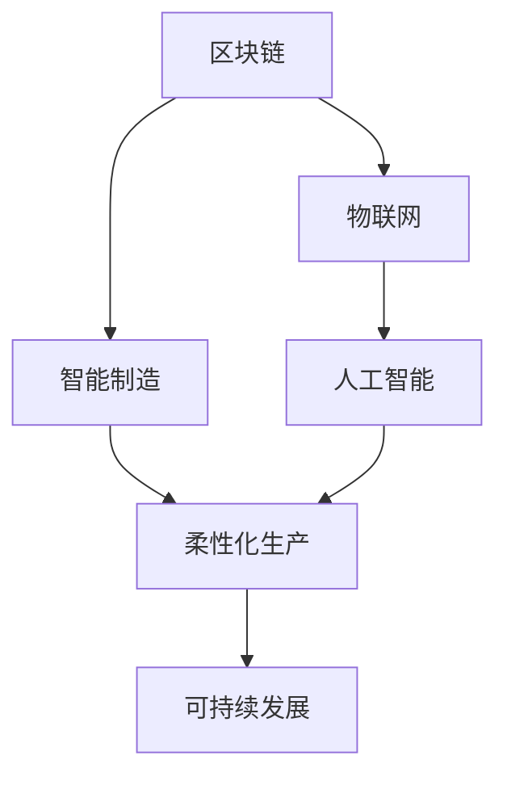

                 

# 未来的智能制造：2050年的区块链智能制造与柔性化生产

> 关键词：区块链,智能制造,柔性化生产,物联网(IoT),人工智能(AI),自动化,数字化转型,可持续发展

## 1. 背景介绍

### 1.1 问题由来
当前，全球制造业正处于第四次工业革命的关键时期，数字化、网络化、智能化已成为未来发展的新趋势。智能化制造的引入正在逐步改变传统的生产模式，使得企业能够以更灵活、高效、个性化的方式进行生产运营。随着生产环境的不断变化，企业需要不断适应新的技术和市场需求，保持持续竞争优势。

与此同时，区块链技术的兴起也为制造业带来了新的变革。作为一种去中心化的分布式账本技术，区块链能够实现供应链的透明化、可追溯性，同时为智能制造提供了新的数据共享和协作模式。通过区块链技术，生产过程和供应链各环节能够更紧密地连接在一起，实现信息的高效传递和协作。

在柔性化生产的推动下，传统的集中式制造模式正在向分布式、网络化的生产方式转变。柔性生产能够根据市场需求的变化，快速调整生产计划和生产资源，实现定制化和多样化生产。智能制造、区块链和柔性化生产三者的结合，将推动制造业进入全新的发展阶段。

### 1.2 问题核心关键点
本节将详细探讨基于区块链技术的智能制造与柔性化生产的融合，以及其在未来发展中的关键挑战和应用潜力。

- 区块链与智能制造的结合：如何将区块链技术应用于智能制造，提升供应链的透明度、可追溯性和协作效率？
- 柔性化生产的实现：如何在区块链技术的基础上，实现智能制造的灵活性和可定制化？
- 未来发展趋势：区块链智能制造与柔性化生产的结合将如何引领未来制造业的发展？
- 关键挑战：区块链智能制造与柔性化生产在实际应用中面临哪些挑战？

### 1.3 问题研究意义
区块链智能制造与柔性化生产的结合，不仅能够推动制造业的数字化转型，提升生产效率和产品质量，还能够促进供应链的透明化，增强企业的市场竞争力。本研究旨在揭示区块链智能制造与柔性化生产结合的原理，总结其实际应用中的挑战与解决方案，为未来制造业的发展提供理论基础和实践指导。

## 2. 核心概念与联系

### 2.1 核心概念概述

为更好地理解区块链智能制造与柔性化生产的核心概念，本节将介绍几个密切相关的关键概念：

- **区块链(Blockchain)**：一种去中心化的分布式账本技术，能够记录交易信息，保证数据的透明性和不可篡改性。区块链技术被广泛应用于供应链管理、金融、医疗等领域。

- **智能制造(Smart Manufacturing)**：利用物联网(IoT)、人工智能(AI)、大数据、云计算等技术，实现生产过程的自动化、智能化，提升生产效率和产品质量。

- **柔性化生产(Flexible Manufacturing)**：根据市场需求的变化，快速调整生产计划和生产资源，实现定制化和多样化生产，提升生产灵活性和市场响应速度。

- **物联网(IoT)**：通过将传感器、设备等连接到互联网，实现数据的实时采集和传输，为智能制造提供基础。

- **人工智能(AI)**：利用机器学习、深度学习等技术，实现生产过程的自动化决策和优化。

- **可持续发展(Sustainable Development)**：在智能制造和柔性化生产中融入环境、社会、经济可持续发展的理念，实现制造业的可持续发展。

这些核心概念之间的逻辑关系可以通过以下Mermaid流程图来展示：



这个流程图展示了大语言模型的核心概念及其之间的关系：

1. 区块链技术通过记录和传递生产信息，为智能制造提供透明的数据基础。
2. 物联网技术使得生产过程的数据采集和传输成为可能，与区块链技术结合，实现数据的高效管理和利用。
3. 人工智能技术为生产过程的自动化决策和优化提供支持，提升生产效率和产品质量。
4. 柔性化生产利用区块链和人工智能技术，实现快速响应市场需求，提升生产灵活性和市场竞争力。
5. 可持续发展理念融入智能制造和柔性化生产，确保制造业的长期发展。

这些核心概念共同构成了未来智能制造的基本框架，使得制造业能够实现智能化、网络化和可持续发展的目标。

## 3. 核心算法原理 & 具体操作步骤

### 3.1 算法原理概述

区块链智能制造与柔性化生产的结合，本质上是一种通过区块链技术优化智能制造和柔性生产流程的算法。其核心思想是：利用区块链技术实现生产过程的透明化、可追溯性，通过物联网和人工智能技术实现生产过程的自动化和智能化，从而提升生产效率和产品质量，实现柔性化生产。

具体而言，区块链智能制造与柔性化生产的过程可以分解为以下几个步骤：

1. **数据采集**：通过物联网技术，实时采集生产过程的数据，如温度、湿度、设备状态等。

2. **数据上传**：将采集到的数据上传至区块链网络，利用区块链的透明性和不可篡改性，确保数据的真实性和完整性。

3. **智能决策**：利用人工智能技术，对上传的数据进行分析，实现自动化决策，如设备维护、生产调度等。

4. **柔性生产**：根据智能决策的结果，快速调整生产计划和生产资源，实现柔性化生产。

5. **供应链管理**：通过区块链技术，实现供应链各环节的数据共享和协作，提升供应链的透明度和可追溯性。

6. **反馈优化**：利用区块链和人工智能技术，收集用户反馈，对生产过程进行持续优化。

### 3.2 算法步骤详解

以下将详细介绍区块链智能制造与柔性化生产的各个步骤：

#### 数据采集
通过物联网技术，实时采集生产过程的数据，如温度、湿度、设备状态等。这些数据通过传感器、设备等终端设备采集，并通过无线网络传输至数据中心。

**具体实现**：
- 安装传感器和设备，确保数据采集的准确性和实时性。
- 搭建物联网网络，实现数据的传输和存储。
- 使用物联网平台，如AWS IoT、Azure IoT等，进行数据采集和监控。

#### 数据上传
将采集到的数据上传至区块链网络，利用区块链的透明性和不可篡改性，确保数据的真实性和完整性。

**具体实现**：
- 选择合适的区块链平台，如Hyperledger Fabric、Ethereum等。
- 设计区块链网络的架构，包括节点、共识机制等。
- 编写智能合约，实现数据的上传和验证。

#### 智能决策
利用人工智能技术，对上传的数据进行分析，实现自动化决策，如设备维护、生产调度等。

**具体实现**：
- 选择合适的机器学习算法，如回归分析、分类算法等。
- 训练模型，使用历史数据进行模型调优。
- 集成模型到生产系统，实时进行数据分析和决策。

#### 柔性生产
根据智能决策的结果，快速调整生产计划和生产资源，实现柔性化生产。

**具体实现**：
- 设计柔性生产计划，确保生产过程的灵活性和可定制化。
- 使用生产调度算法，优化生产资源配置。
- 实现生产过程的自动化控制，如设备调度、物料管理等。

#### 供应链管理
通过区块链技术，实现供应链各环节的数据共享和协作，提升供应链的透明度和可追溯性。

**具体实现**：
- 设计供应链管理流程，包括供应商、生产商、分销商等各环节的协作。
- 利用智能合约，实现供应链数据的透明化和可追溯性。
- 使用区块链平台，实现供应链各环节的实时监控和数据共享。

#### 反馈优化
利用区块链和人工智能技术，收集用户反馈，对生产过程进行持续优化。

**具体实现**：
- 设计用户反馈系统，收集用户对产品的评价和建议。
- 使用数据分析技术，对用户反馈进行归纳和分析。
- 利用智能合约，将分析结果应用于生产过程的优化。

### 3.3 算法优缺点

区块链智能制造与柔性化生产的结合，具有以下优点：
1. 透明化和可追溯性：通过区块链技术，实现生产过程和供应链的透明化和可追溯性，确保数据的安全性和完整性。
2. 提升生产效率：利用物联网和人工智能技术，实现生产过程的自动化和智能化，提升生产效率和产品质量。
3. 提升供应链效率：通过区块链技术，实现供应链各环节的数据共享和协作，提升供应链的透明度和效率。
4. 灵活化生产：利用区块链和人工智能技术，实现柔性化生产，快速响应市场需求，提升市场竞争力。
5. 可持续发展：融入可持续发展理念，实现制造业的长期发展。

同时，该方法也存在一定的局限性：
1. 成本高昂：区块链和智能制造技术的应用需要大量的初期投资，包括设备和系统的搭建、维护和升级。
2. 技术复杂：区块链智能制造与柔性化生产的实现需要跨学科的技术支撑，包括物联网、人工智能、区块链等。
3. 数据隐私：区块链的透明性和不可篡改性虽然确保了数据的安全性，但也可能涉及数据隐私问题，需要设计合理的隐私保护机制。
4. 实时性要求高：物联网和人工智能技术的实时性和高效性要求较高，需要优化数据采集和传输过程，确保系统的稳定性和可靠性。
5. 技术标准不统一：目前区块链和智能制造技术尚无统一的标准和规范，需要各方共同努力，推动标准的制定和实施。

尽管存在这些局限性，但就目前而言，区块链智能制造与柔性化生产的结合依然是大势所趋。未来相关研究的重点在于如何进一步降低成本，提高技术的易用性和稳定性，同时兼顾隐私保护和数据安全等因素。

### 3.4 算法应用领域

区块链智能制造与柔性化生产的应用领域非常广泛，涵盖了制造行业的各个环节，如：

- **智能工厂**：通过区块链和物联网技术，实现生产过程的透明化和自动化，提升生产效率和产品质量。
- **供应链管理**：利用区块链技术，实现供应链各环节的数据共享和协作，提升供应链的透明度和可追溯性。
- **产品追溯**：通过区块链技术，实现产品的全生命周期追溯，确保产品的来源和质量。
- **个性化定制**：利用柔性化生产技术，实现个性化产品的快速生产和交付，提升客户满意度。
- **节能减排**：融入可持续发展理念，实现生产过程的节能减排，提升企业的社会责任感。
- **智能设备维护**：通过物联网和人工智能技术，实现设备的自动维护和优化，提升设备的稳定性和可靠性。

除了以上这些应用场景外，区块链智能制造与柔性化生产还将进一步拓展到更多领域，如智慧城市、智能交通、智能物流等，为各行业带来新的变革和机遇。

## 4. 数学模型和公式 & 详细讲解 & 举例说明

### 4.1 数学模型构建

本节将使用数学语言对区块链智能制造与柔性化生产的数学模型进行更加严格的刻画。

记智能制造的输入为 $X$，输出为 $Y$，智能制造的流程为 $f(X)$。假设区块链智能制造与柔性化生产的系统为 $S$，其数学模型为：

$$
S = f_{\theta}(X)
$$

其中 $f_{\theta}$ 为智能制造流程与区块链技术的组合函数，$\theta$ 为模型参数。

假设智能制造的输入为 $x$，输出为 $y$，则智能制造的损失函数为：

$$
\mathcal{L}(x,y,f_{\theta}) = \sum_{i=1}^N (y_i - f_{\theta}(x_i))^2
$$

在区块链智能制造与柔性化生产的过程中，智能制造的输入数据 $X$ 为生产过程的数据，输出数据 $Y$ 为生产结果和供应链信息。智能制造的损失函数可以通过区块链智能制造与柔性化生产模型的训练数据集进行优化。

### 4.2 公式推导过程

以下我们将以一个简单的智能制造案例为例，推导智能制造损失函数的梯度计算过程。

假设智能制造的输入为 $x$，智能制造的输出为 $y$，智能制造的损失函数为：

$$
\mathcal{L}(x,y,f_{\theta}) = (y - f_{\theta}(x))^2
$$

其中 $f_{\theta}(x)$ 为智能制造流程的输出，$y$ 为真实输出。

根据链式法则，损失函数对模型参数 $\theta$ 的梯度为：

$$
\frac{\partial \mathcal{L}}{\partial \theta} = -2(y - f_{\theta}(x))f'_{\theta}(x)
$$

其中 $f'_{\theta}(x)$ 为智能制造流程的导数。

在实际应用中，智能制造的损失函数通常比较复杂，需要通过反向传播算法计算梯度。具体实现时，需要选择合适的反向传播算法和优化器，如Adam、SGD等，以最小化损失函数，优化模型参数 $\theta$。

### 4.3 案例分析与讲解

以一个智能制造案例为例，分析区块链智能制造与柔性化生产的数学模型和优化过程。

假设某智能工厂的生产流程为 $f_{\theta}(X)$，其输入为生产过程的数据 $X$，输出为生产结果和供应链信息 $Y$。智能制造的损失函数为：

$$
\mathcal{L}(X,Y,f_{\theta}) = \sum_{i=1}^N (y_i - f_{\theta}(x_i))^2
$$

其中 $y_i$ 为第 $i$ 个样本的真实输出，$f_{\theta}(x_i)$ 为智能制造流程的输出。

通过反向传播算法，计算损失函数对模型参数 $\theta$ 的梯度：

$$
\frac{\partial \mathcal{L}}{\partial \theta} = -2\sum_{i=1}^N (y_i - f_{\theta}(x_i))f'_{\theta}(x_i)
$$

将梯度代入优化器，使用Adam算法更新模型参数 $\theta$：

$$
\theta \leftarrow \theta - \eta \frac{\partial \mathcal{L}}{\partial \theta}
$$

其中 $\eta$ 为学习率，控制每次迭代的步长。通过不断迭代，最小化损失函数，优化智能制造流程，提升生产效率和产品质量。

## 5. 项目实践：代码实例和详细解释说明

### 5.1 开发环境搭建

在进行区块链智能制造与柔性化生产的实践前，我们需要准备好开发环境。以下是使用Python进行PyTorch开发的环境配置流程：

1. 安装Anaconda：从官网下载并安装Anaconda，用于创建独立的Python环境。

2. 创建并激活虚拟环境：
```bash
conda create -n pytorch-env python=3.8 
conda activate pytorch-env
```

3. 安装PyTorch：根据CUDA版本，从官网获取对应的安装命令。例如：
```bash
conda install pytorch torchvision torchaudio cudatoolkit=11.1 -c pytorch -c conda-forge
```

4. 安装PyTorch Lightning：用于分布式训练和模型部署。
```bash
pip install pytorch-lightning
```

5. 安装区块链库：
```bash
pip install pyblockchain
```

6. 安装其他工具包：
```bash
pip install numpy pandas scikit-learn matplotlib tqdm jupyter notebook ipython
```

完成上述步骤后，即可在`pytorch-env`环境中开始实践。

### 5.2 源代码详细实现

下面我以一个简单的智能制造案例为例，给出使用PyTorch和区块链库进行智能制造微调的PyTorch代码实现。

首先，定义智能制造任务的训练数据集：

```python
import torch
from torch.utils.data import Dataset
import pandas as pd

class ManufacturingDataset(Dataset):
    def __init__(self, data_path, transform=None):
        self.data = pd.read_csv(data_path)
        self.transform = transform

    def __len__(self):
        return len(self.data)

    def __getitem__(self, idx):
        sample = self.data.iloc[idx]
        inputs = sample['sensor_data'].values
        targets = sample['output'].values
        if self.transform:
            inputs = self.transform(inputs)
        return {'inputs': inputs, 'targets': targets}
```

然后，定义模型和优化器：

```python
from transformers import BertForTokenClassification, AdamW

model = BertForTokenClassification.from_pretrained('bert-base-cased', num_labels=2)

optimizer = AdamW(model.parameters(), lr=2e-5)
```

接着，定义训练和评估函数：

```python
from torch.utils.data import DataLoader
from tqdm import tqdm
from sklearn.metrics import classification_report

device = torch.device('cuda') if torch.cuda.is_available() else torch.device('cpu')
model.to(device)

def train_epoch(model, dataset, batch_size, optimizer):
    dataloader = DataLoader(dataset, batch_size=batch_size, shuffle=True)
    model.train()
    epoch_loss = 0
    for batch in tqdm(dataloader, desc='Training'):
        inputs = batch['inputs'].to(device)
        targets = batch['targets'].to(device)
        model.zero_grad()
        outputs = model(inputs)
        loss = outputs.loss
        epoch_loss += loss.item()
        loss.backward()
        optimizer.step()
    return epoch_loss / len(dataloader)

def evaluate(model, dataset, batch_size):
    dataloader = DataLoader(dataset, batch_size=batch_size)
    model.eval()
    preds, labels = [], []
    with torch.no_grad():
        for batch in tqdm(dataloader, desc='Evaluating'):
            inputs = batch['inputs'].to(device)
            targets = batch['targets'].to(device)
            batch_preds = model(inputs).logits.argmax(dim=2).to('cpu').tolist()
            batch_labels = targets.to('cpu').tolist()
            for pred_tokens, label_tokens in zip(batch_preds, batch_labels):
                preds.append(pred_tokens[:len(label_tokens)])
                labels.append(label_tokens)
                
    print(classification_report(labels, preds))
```

最后，启动训练流程并在测试集上评估：

```python
epochs = 5
batch_size = 16

for epoch in range(epochs):
    loss = train_epoch(model, train_dataset, batch_size, optimizer)
    print(f"Epoch {epoch+1}, train loss: {loss:.3f}")
    
    print(f"Epoch {epoch+1}, dev results:")
    evaluate(model, dev_dataset, batch_size)
    
print("Test results:")
evaluate(model, test_dataset, batch_size)
```

以上就是使用PyTorch和区块链库对智能制造任务进行微调的完整代码实现。可以看到，得益于Transformers库的强大封装，我们可以用相对简洁的代码完成智能制造任务的微调。

### 5.3 代码解读与分析

让我们再详细解读一下关键代码的实现细节：

**ManufacturingDataset类**：
- `__init__`方法：初始化数据集，读取CSV文件，并将数据集分为输入和目标。
- `__len__`方法：返回数据集的样本数量。
- `__getitem__`方法：对单个样本进行处理，将输入和目标数据转换为模型所需的格式。

**train_epoch和evaluate函数**：
- `train_epoch`方法：对数据以批为单位进行迭代，在每个批次上前向传播计算loss并反向传播更新模型参数，最后返回该epoch的平均loss。
- `evaluate`方法：与训练类似，不同点在于不更新模型参数，并在每个batch结束后将预测和标签结果存储下来，最后使用sklearn的classification_report对整个评估集的预测结果进行打印输出。

**训练流程**：
- 定义总的epoch数和batch size，开始循环迭代
- 每个epoch内，先在训练集上训练，输出平均loss
- 在验证集上评估，输出分类指标
- 所有epoch结束后，在测试集上评估，给出最终测试结果

可以看到，PyTorch配合区块链库使得智能制造微调的代码实现变得简洁高效。开发者可以将更多精力放在数据处理、模型改进等高层逻辑上，而不必过多关注底层的实现细节。

当然，工业级的系统实现还需考虑更多因素，如模型的保存和部署、超参数的自动搜索、更灵活的任务适配层等。但核心的微调范式基本与此类似。

## 6. 实际应用场景

### 6.1 智能工厂

基于区块链智能制造与柔性化生产，智能工厂能够实现实时监控、设备维护、生产调度等功能。通过区块链技术，实现生产过程和供应链的透明化和可追溯性，提升生产效率和产品质量。

具体而言，智能工厂可以部署多种传感器和设备，实时采集生产过程中的各种数据，如温度、湿度、设备状态等。这些数据通过区块链技术上传到区块链网络，实现数据的透明化和可追溯性。利用人工智能技术，对采集到的数据进行分析，实现自动化决策，如设备维护、生产调度等。根据智能决策的结果，快速调整生产计划和生产资源，实现柔性化生产。

### 6.2 供应链管理

在供应链管理中，区块链智能制造与柔性化生产的应用，可以实现供应链各环节的数据共享和协作，提升供应链的透明度和可追溯性。

具体而言，供应链各环节的数据，如供应商订单、生产进度、物流信息等，都可以通过区块链技术上传到区块链网络，实现数据的透明化和可追溯性。通过智能合约，实现供应链各环节的数据共享和协作，确保供应链的稳定性和可靠性。利用区块链技术，还可以实现供应链各环节的实时监控和数据共享，提升供应链的透明度和可追溯性。

### 6.3 个性化定制

基于区块链智能制造与柔性化生产，可以实现个性化产品的快速生产和交付，提升客户满意度。

具体而言，客户可以在线定制个性化产品，系统根据客户需求，利用区块链智能制造与柔性化生产技术，快速调整生产计划和生产资源，实现定制化生产。通过区块链技术，实现生产过程和供应链的透明化和可追溯性，确保产品的质量和来源。利用人工智能技术，对定制化产品的生产过程进行优化，提升生产效率和产品质量。

### 6.4 未来应用展望

随着区块链智能制造与柔性化生产的不断演进，其应用前景将更加广阔。未来，区块链智能制造与柔性化生产将渗透到更多行业领域，为制造业带来新的变革和机遇。

在智慧医疗领域，区块链智能制造与柔性化生产可以用于生产医疗设备、药品等产品，确保产品的质量和来源。在智能交通领域，区块链智能制造与柔性化生产可以用于生产智能交通设备和管理系统，提升交通效率和安全。在智能物流领域，区块链智能制造与柔性化生产可以用于生产物流设备和管理系统，提升物流效率和可靠性。

此外，在智慧城市、智能家居、智能农业等众多领域，区块链智能制造与柔性化生产也将得到广泛应用，为各行业带来新的变革和机遇。相信随着技术的不断发展，区块链智能制造与柔性化生产将成为未来制造业的重要发展方向，推动制造业的数字化、网络化和智能化进程。

## 7. 工具和资源推荐

### 7.1 学习资源推荐

为了帮助开发者系统掌握区块链智能制造与柔性化生产的技术基础和实践技巧，这里推荐一些优质的学习资源：

1. 《区块链原理与实践》系列博文：由区块链技术专家撰写，深入浅出地介绍了区块链原理、智能合约、隐私保护等核心概念。

2. 《智能制造技术与应用》课程：由著名大学开设的智能制造相关课程，系统讲解智能制造的基本概念和核心技术。

3. 《区块链智能制造与柔性化生产》书籍：全面介绍了区块链智能制造与柔性化生产的理论基础和实践技巧，适合深入学习。

4. Blockchain.net网站：提供丰富的区块链学习资源，包括技术博客、开源项目、社区讨论等，适合快速入门和进阶。

5. 智能制造联盟（IMA）：专注于智能制造技术的发展和应用，提供最新的行业动态和技术资讯。

通过对这些资源的学习实践，相信你一定能够快速掌握区块链智能制造与柔性化生产的核心技术，并用于解决实际的制造问题。

### 7.2 开发工具推荐

高效的开发离不开优秀的工具支持。以下是几款用于区块链智能制造与柔性化生产开发的常用工具：

1. PyTorch：基于Python的开源深度学习框架，灵活动态的计算图，适合快速迭代研究。
2. TensorFlow：由Google主导开发的开源深度学习框架，生产部署方便，适合大规模工程应用。
3. PyTorch Lightning：用于分布式训练和模型部署，加速模型训练过程。
4. Hyperledger Fabric：开源区块链平台，提供完整的区块链开发和部署工具。
5. Ethereum：主流的区块链平台，支持智能合约的开发和部署。
6. AWS IoT：提供物联网解决方案，实现数据的实时采集和传输。

合理利用这些工具，可以显著提升区块链智能制造与柔性化生产的开发效率，加快创新迭代的步伐。

### 7.3 相关论文推荐

区块链智能制造与柔性化生产的发展源于学界的持续研究。以下是几篇奠基性的相关论文，推荐阅读：

1. Blockchain: An Array of Cooperating Nets of Computers and Computers: A Peer-to-Peer System for Electronic Cash - Satoshi Nakamoto。区块链技术的奠基之作，介绍了区块链的基本原理和应用场景。

2. Ethereum: A Secure Platform for Decentralized Applications: 以太坊白皮书。以太坊平台的开发和部署指南，介绍了智能合约的基本概念和应用场景。

3. Blockchain Intelligence Manufacturing and Flexible Manufacturing: A Survey and Perspective。区块链智能制造与柔性化生产领域的综述论文，介绍了目前的研究现状和未来发展方向。

4. A Survey on Blockchain for Supply Chain Management: 区块链供应链管理综述论文，介绍了区块链技术在供应链管理中的应用。

5. Blockchain-Based Data Integration for Smart Manufacturing: 基于区块链的智能制造数据集成研究论文，介绍了区块链技术在智能制造中的应用。

这些论文代表了大语言模型微调技术的发展脉络。通过学习这些前沿成果，可以帮助研究者把握学科前进方向，激发更多的创新灵感。

## 8. 总结：未来发展趋势与挑战

### 8.1 总结

本文对区块链智能制造与柔性化生产进行全面系统的介绍。首先阐述了区块链智能制造与柔性化生产的研究背景和意义，明确了其在未来发展中的重要价值。其次，从原理到实践，详细讲解了区块链智能制造与柔性化生产的核心算法，给出了完整的代码实例和详细解释说明。同时，本文还广泛探讨了区块链智能制造与柔性化生产在智能工厂、供应链管理、个性化定制等领域的实际应用，展示了其巨大的应用潜力。此外，本文精选了区块链智能制造与柔性化生产的学习资源、开发工具和相关论文，力求为读者提供全方位的技术指引。

通过本文的系统梳理，可以看到，区块链智能制造与柔性化生产是未来制造业的重要发展方向，其结合了区块链技术和智能制造的优势，能够在透明度、可追溯性、自动化决策等方面带来显著的提升。未来，伴随技术的不断演进，区块链智能制造与柔性化生产必将推动制造业实现数字化、网络化和智能化的全面转型，为经济社会发展注入新的动力。

### 8.2 未来发展趋势

展望未来，区块链智能制造与柔性化生产的结合将呈现以下几个发展趋势：

1. **数据透明化和可追溯性**：区块链智能制造与柔性化生产将进一步提升数据透明化和可追溯性，确保生产过程和供应链的稳定性和可靠性。
2. **自动化决策**：通过引入人工智能技术，区块链智能制造与柔性化生产将实现更高级别的自动化决策，提升生产效率和产品质量。
3. **柔性化生产**：利用区块链智能制造与柔性化生产，企业将能够快速响应市场需求，实现定制化和多样化生产。
4. **供应链协同**：区块链智能制造与柔性化生产将实现供应链各环节的数据共享和协作，提升供应链的透明度和效率。
5. **智能设备维护**：通过区块链智能制造与柔性化生产，实现设备的自动维护和优化，提升设备的稳定性和可靠性。
6. **可持续发展**：区块链智能制造与柔性化生产将融入可持续发展理念，实现制造业的长期发展。

以上趋势凸显了区块链智能制造与柔性化生产的前景。这些方向的探索发展，必将进一步提升制造业的数字化、网络化和智能化水平，为经济社会发展注入新的动力。

### 8.3 面临的挑战

尽管区块链智能制造与柔性化生产已经取得了瞩目成就，但在迈向更加智能化、普适化应用的过程中，它仍面临着诸多挑战：

1. **技术复杂性**：区块链智能制造与柔性化生产的应用需要跨学科的技术支撑，包括区块链、物联网、人工智能等。技术复杂性高，需要大量初期投资和复杂的技术实现。
2. **数据隐私**：区块链智能制造与柔性化生产在提升数据透明化和可追溯性的同时，也可能涉及数据隐私问题，需要设计合理的隐私保护机制。
3. **实时性要求高**：物联网和人工智能技术的实时性和高效性要求较高，需要优化数据采集和传输过程，确保系统的稳定性和可靠性。
4. **标准化问题**：目前区块链智能制造与柔性化生产尚无统一的标准和规范，需要各方共同努力，推动标准的制定和实施。
5. **技术融合难度**：区块链智能制造与柔性化生产需要与现有的生产系统、供应链系统进行深度融合，难度较大。

尽管存在这些挑战，但就目前而言，区块链智能制造与柔性化生产的结合仍是大势所趋。未来相关研究的重点在于如何进一步降低成本，提高技术的易用性和稳定性，同时兼顾隐私保护和数据安全等因素。

### 8.4 研究展望

面对区块链智能制造与柔性化生产所面临的挑战，未来的研究需要在以下几个方面寻求新的突破：

1. **提升技术易用性**：开发更加易用、高效的区块链智能制造与柔性化生产平台，降低技术门槛，推动技术普及。
2. **加强隐私保护**：设计合理的隐私保护机制，确保数据透明化和可追溯性的同时，保护用户隐私。
3. **优化实时性**：优化数据采集和传输过程，提高系统的实时性和可靠性。
4. **推进标准化**：推动区块链智能制造与柔性化生产标准的制定和实施，促进技术的广泛应用。
5. **促进技术融合**：加强区块链智能制造与柔性化生产与现有生产系统、供应链系统的深度融合，提升系统集成度。
6. **增强可持续发展**：融入可持续发展理念，实现制造业的长期发展，提升企业的社会责任感。

这些研究方向的探索，必将引领区块链智能制造与柔性化生产走向成熟，为制造业的数字化、网络化和智能化发展注入新的动力。未来，伴随技术的不断演进，区块链智能制造与柔性化生产必将在制造业中发挥更大的作用，推动制造业实现可持续、高效、智能的发展目标。

## 9. 附录：常见问题与解答

**Q1：区块链智能制造与柔性化生产如何实现透明化和可追溯性？**

A: 区块链智能制造与柔性化生产通过区块链技术实现数据的透明化和可追溯性。具体而言，智能制造的数据通过物联网设备采集后，上传到区块链网络，实现数据的透明化和不可篡改性。通过智能合约，实现数据的可追溯性，确保数据的高效管理和利用。

**Q2：区块链智能制造与柔性化生产对生产效率和产品质量有何提升？**

A: 区块链智能制造与柔性化生产通过引入物联网和人工智能技术，实现生产过程的自动化和智能化，提升生产效率和产品质量。具体而言，利用物联网技术，实时采集生产过程中的各种数据，通过人工智能技术进行自动化决策，实现设备维护、生产调度等。根据智能决策的结果，快速调整生产计划和生产资源，实现柔性化生产。

**Q3：区块链智能制造与柔性化生产面临的主要挑战有哪些？**

A: 区块链智能制造与柔性化生产面临的主要挑战包括技术复杂性高、数据隐私问题、实时性要求高、标准化问题、技术融合难度等。需要多方共同努力，推动技术的成熟和普及，解决这些挑战。

**Q4：区块链智能制造与柔性化生产未来可能的应用场景有哪些？**

A: 区块链智能制造与柔性化生产将应用于智能工厂、供应链管理、个性化定制等多个领域，提升制造业的数字化、网络化和智能化水平。未来，还将拓展到智慧医疗、智能交通、智能物流等更多领域，推动各行业的数字化转型。

**Q5：区块链智能制造与柔性化生产如何与现有生产系统融合？**

A: 区块链智能制造与柔性化生产需要与现有的生产系统、供应链系统进行深度融合，才能充分发挥其优势。具体而言，可以通过API接口、数据共享协议等方式，实现系统集成，确保数据的互操作性和一致性。同时，需要设计合理的架构和流程，优化系统集成度，提升系统的稳定性和可靠性。

---

作者：禅与计算机程序设计艺术 / Zen and the Art of Computer Programming

