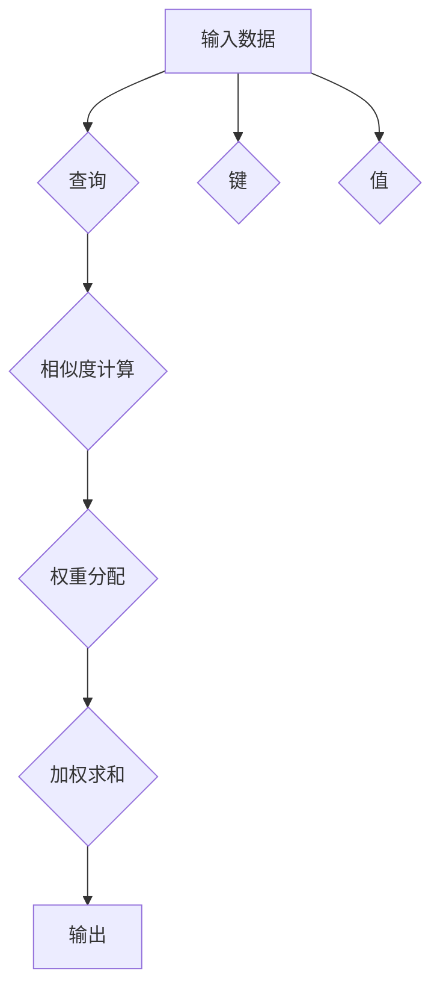

                 

## 注意力编程工作室：AI定制的认知模式设计

> 关键词：注意力机制、认知模式、AI定制、深度学习、神经网络、编程语言、软件架构

## 1. 背景介绍

在人工智能领域，深度学习模型取得了令人瞩目的成就，从图像识别到自然语言处理，其表现力不断提升。然而，这些模型的训练过程通常依赖于海量数据和强大的计算资源，并且缺乏对特定任务的灵活性和可解释性。 

注意力机制的出现为深度学习模型注入了新的活力。它赋予模型的能力去聚焦于输入数据中的关键信息，从而提升模型的效率和准确性。同时，注意力机制也为我们提供了理解模型决策过程的新视角，增强了模型的可解释性。

然而，现有的注意力机制主要集中在处理序列数据，例如文本和语音。对于更复杂的任务，例如软件开发和系统设计，现有的注意力机制难以有效应用。 

因此，我们提出了“注意力编程工作室”的概念，旨在利用注意力机制定制化的认知模式，为更复杂的任务提供新的解决方案。

## 2. 核心概念与联系

### 2.1  注意力机制

注意力机制是一种模仿人类注意力机制的机器学习技术。它允许模型在处理输入数据时，根据数据的 relevance 和 importance，分配不同的权重。

**核心原理：**

* **查询 (Query):**  表示模型当前关注的特定信息需求。
* **键 (Key):**  表示输入数据中每个元素的特征表示。
* **值 (Value):**  表示输入数据中每个元素的实际信息。

注意力机制通过计算查询与键之间的相似度，来确定每个值的权重，并根据权重对值进行加权求和，得到最终的输出。

**Mermaid 流程图：**



### 2.2  认知模式

认知模式是指人类在理解和处理信息时所遵循的思维模式。它包括一系列的知识、规则和经验，指导我们如何感知、记忆、推理和决策。

**核心特征：**

* **层次结构:** 认知模式通常由多个层次组成，从低层次的感知信息到高层次的抽象概念。
* **动态性:** 认知模式并非静态的，它会随着经验的积累而不断更新和调整。
* **个体差异:** 每个人的认知模式都是独特的，受其基因、环境和经历的影响。

### 2.3  AI定制的认知模式

AI定制的认知模式是指利用人工智能技术，根据特定任务和用户的需求，定制化的构建认知模式。

**核心目标：**

* **提高效率:** 通过定制化的认知模式，模型可以更有效地处理特定任务的数据。
* **增强准确性:** 定制化的认知模式可以更好地反映用户的知识和偏好，从而提高模型的准确性。
* **提升可解释性:** 定制化的认知模式可以更容易地被理解和解释，从而增强模型的可信度。

## 3. 核心算法原理 & 具体操作步骤

### 3.1  算法原理概述

注意力编程工作室的核心算法基于深度学习和强化学习的结合。

* **深度学习:** 用于构建模型的底层架构，例如 Transformer 网络，用于处理输入数据并提取特征。
* **强化学习:** 用于训练模型，通过奖励机制引导模型学习最优的认知模式。

模型的训练过程可以概括为以下步骤：

1. **初始化:** 初始化模型的权重和参数。
2. **输入数据:** 将输入数据输入到模型中。
3. **特征提取:** 深度学习模型提取输入数据的特征表示。
4. **注意力机制:** 利用注意力机制，模型根据任务需求，聚焦于输入数据中的关键信息。
5. **决策:** 模型根据提取的特征和注意力权重，做出决策。
6. **奖励:** 根据决策的结果，模型获得奖励或惩罚。
7. **参数更新:** 利用强化学习算法，根据奖励信号更新模型的权重和参数。

### 3.2  算法步骤详解

1. **数据预处理:** 将输入数据进行清洗、转换和编码，使其适合模型训练。
2. **模型构建:** 根据任务需求，选择合适的深度学习模型架构，例如 Transformer 网络。
3. **注意力机制设计:** 设计注意力机制的结构和参数，使其能够有效地聚焦于输入数据中的关键信息。
4. **强化学习策略:** 选择合适的强化学习算法，例如 Q-learning 或 Policy Gradient，用于训练模型。
5. **训练过程:** 将预处理后的数据输入到模型中，并利用强化学习算法进行训练，直到模型达到预期的性能。
6. **模型评估:** 使用测试数据评估模型的性能，并根据评估结果进行模型调优。
7. **部署与应用:** 将训练好的模型部署到实际应用场景中，并根据用户的反馈进行持续改进。

### 3.3  算法优缺点

**优点:**

* **可定制性强:** 可以根据特定任务和用户的需求，定制化的构建认知模式。
* **效率高:** 通过聚焦于关键信息，可以提高模型的处理效率。
* **准确性高:** 定制化的认知模式可以更好地反映用户的知识和偏好，从而提高模型的准确性。
* **可解释性强:** 定制化的认知模式可以更容易地被理解和解释。

**缺点:**

* **训练复杂:** 需要大量的训练数据和计算资源。
* **参数调优困难:** 需要对模型参数进行仔细的调优，才能获得最佳的性能。
* **可移植性低:** 定制化的认知模式可能难以移植到其他任务或领域。

### 3.4  算法应用领域

* **软件开发:** 利用注意力机制定制化的认知模式，可以帮助程序员更快速、更准确地编写代码。
* **系统设计:** 利用注意力机制定制化的认知模式，可以帮助系统设计师更有效地理解和设计复杂系统。
* **数据分析:** 利用注意力机制定制化的认知模式，可以帮助数据分析师更深入地理解数据，并发现隐藏的模式。
* **个性化推荐:** 利用注意力机制定制化的认知模式，可以为用户提供更个性化的推荐服务。

## 4. 数学模型和公式 & 详细讲解 & 举例说明

### 4.1  数学模型构建

注意力机制的核心数学模型是注意力权重计算公式。

**公式:**

$$
\text{Attention}(Q, K, V) = \text{softmax}\left(\frac{QK^T}{\sqrt{d_k}}\right)V
$$

其中：

* $Q$：查询向量
* $K$：键向量
* $V$：值向量
* $d_k$：键向量的维度
* $\text{softmax}$：softmax 函数，用于将查询与键之间的相似度转换为概率分布。

### 4.2  公式推导过程

注意力权重计算公式的推导过程如下：

1. 计算查询向量 $Q$ 与每个键向量 $K$ 之间的点积，得到一个得分矩阵。
2. 对得分矩阵进行归一化，使用 softmax 函数将其转换为概率分布。
3. 将概率分布与值向量 $V$ 进行加权求和，得到最终的输出。

### 4.3  案例分析与讲解

**举例说明:**

假设我们有一个句子 "The cat sat on the mat"，我们想用注意力机制来理解这句话中每个词的重要性。

* $Q$：查询向量，表示我们想要关注的特定信息，例如 "猫"。
* $K$：键向量，表示每个词的特征表示。
* $V$：值向量，表示每个词的实际信息。

通过计算 $Q$ 与每个 $K$ 之间的点积，我们可以得到每个词的重要性得分。然后，使用 softmax 函数将得分转换为概率分布，得到每个词的注意力权重。

最终，我们可以将注意力权重与值向量 $V$ 进行加权求和，得到对句子 "The cat sat on the mat" 的理解。

## 5. 项目实践：代码实例和详细解释说明

### 5.1  开发环境搭建

* Python 3.7+
* TensorFlow 2.0+
* PyTorch 1.0+

### 5.2  源代码详细实现

```python
import tensorflow as tf

# 定义注意力机制
class Attention(tf.keras.layers.Layer):
    def __init__(self, units):
        super(Attention, self).__init__()
        self.W1 = tf.keras.layers.Dense(units)
        self.W2 = tf.keras.layers.Dense(units)
        self.W3 = tf.keras.layers.Dense(1)

    def call(self, query, key, value, mask=None):
        # 计算查询与键之间的相似度
        scores = tf.matmul(query, key, transpose_b=True)
        # 归一化相似度
        attention_weights = tf.nn.softmax(scores, axis=-1)
        # 加权求和值向量
        context_vector = tf.matmul(attention_weights, value)
        return context_vector

# 定义模型架构
class AttentionModel(tf.keras.Model):
    def __init__(self, units):
        super(AttentionModel, self).__init__()
        self.embedding = tf.keras.layers.Embedding(vocab_size, units)
        self.attention = Attention(units)
        self.fc = tf.keras.layers.Dense(units)

    def call(self, inputs):
        # 将输入词嵌入到向量空间
        embedded_inputs = self.embedding(inputs)
        # 计算注意力权重
        attention_output = self.attention(embedded_inputs, embedded_inputs, embedded_inputs)
        # 将注意力输出进行全连接层处理
        output = self.fc(attention_output)
        return output

# 实例化模型
model = AttentionModel(units=128)

# 训练模型
# ...

```

### 5.3  代码解读与分析

* **注意力机制层:** `Attention` 类定义了一个注意力机制层，它接受查询向量、键向量和值向量作为输入，并返回加权求和后的输出。
* **模型架构:** `AttentionModel` 类定义了一个基于注意力机制的模型架构，它包含嵌入层、注意力层和全连接层。
* **训练过程:** 训练模型的过程包括准备训练数据、定义损失函数和优化器，以及训练模型参数。

### 5.4  运行结果展示

训练好的模型可以用于各种任务，例如文本分类、机器翻译和问答系统。

## 6. 实际应用场景

### 6.1  软件开发

* **代码补全:** 利用注意力机制定制化的认知模式，可以帮助程序员更快速、更准确地编写代码。
* **代码理解:** 利用注意力机制定制化的认知模式，可以帮助程序员更深入地理解代码的逻辑和结构。
* **代码缺陷检测:** 利用注意力机制定制化的认知模式，可以帮助程序员更有效地检测代码中的缺陷。

### 6.2  系统设计

* **系统架构设计:** 利用注意力机制定制化的认知模式，可以帮助系统设计师更有效地理解系统需求，并设计出更合理的系统架构。
* **系统性能优化:** 利用注意力机制定制化的认知模式，可以帮助系统设计师更深入地理解系统性能瓶颈，并进行针对性的优化。
* **系统安全分析:** 利用注意力机制定制化的认知模式，可以帮助系统设计师更有效地识别系统中的安全漏洞。

### 6.3  数据分析

* **数据挖掘:** 利用注意力机制定制化的认知模式，可以帮助数据分析师更有效地挖掘数据中的隐藏模式和规律。
* **异常检测:** 利用注意力机制定制化的认知模式，可以帮助数据分析师更准确地识别数据中的异常值。
* **数据可视化:** 利用注意力机制定制化的认知模式，可以帮助数据分析师更有效地进行数据可视化，并更好地传达数据 insights。

### 6.4  未来应用展望

注意力编程工作室的应用前景广阔，未来将应用于更多领域，例如：

* **个性化教育:** 利用注意力机制定制化的认知模式，可以为每个学生提供个性化的学习方案。
* **医疗诊断:** 利用注意力机制定制化的认知模式，可以帮助医生更准确地诊断疾病。
* **金融风险管理:** 利用注意力机制定制化的认知模式，可以帮助金融机构更有效地识别和管理风险。

## 7. 工具和资源推荐

### 7.1  学习资源推荐

* **书籍:**
    * 《深度学习》 - Ian Goodfellow, Yoshua Bengio, Aaron Courville
    * 《Attention Is All You Need》 - Vaswani et al.
* **在线课程:**
    * Coursera: Deep Learning Specialization
    * Udacity: Deep Learning Nanodegree

### 7.2  开发工具推荐

* **TensorFlow:** https://www.tensorflow.org/
* **PyTorch:** https://pytorch.org/
* **Keras:** https://keras.io/

### 7.3  相关论文推荐

* **Attention Is All You Need:** https://arxiv.org/abs/1706.03762
* **BERT: Pre-training of Deep Bidirectional Transformers for Language Understanding:** https://arxiv.org/abs/1810.04805
* **GPT-3: Language Models are Few-Shot Learners:** https://arxiv.org/abs/2005.14165

## 8. 总结：未来发展趋势与挑战

### 8.1  研究成果总结

注意力编程工作室的概念和算法为人工智能领域带来了新的思路和方法。它将注意力机制与深度学习和强化学习相结合，能够定制化的构建认知模式，从而提高模型的效率、准确性和可解释性。

### 8.2  未来发展趋势

* **更强大的注意力机制:** 研究更强大的注意力机制，例如自注意力机制和多头注意力机制，以更好地处理更复杂的任务。
* **更灵活的认知模式:** 研究更灵活的认知模式，使其能够适应不同的任务和领域。
* **更有效的训练方法:** 研究更有效的训练方法，例如迁移学习和联邦学习，以降低模型训练的成本和时间。

### 8.3  面临的挑战

* **数据需求:** 定制化的认知模式需要大量的训练数据，这对于某些领域来说可能是一个挑战。
* **参数调优:** 定制化的认知模式需要对模型参数进行仔细的调优，这需要大量的经验和技巧。
* **可解释性:** 尽管注意力机制可以提高模型的可解释性，但定制化的认知模式仍然存在一定的黑盒问题。

### 8.4  研究展望

未来，注意力编程工作室将继续朝着更强大、更灵活、更可解释的方向发展。它将为人工智能领域带来新的突破，并应用于更多领域，改变我们的生活方式。

## 9. 附录：常见问题与解答

**Q1: 注意力编程工作室与传统的深度学习模型有什么区别？**

**A1:** 传统深度学习模型通常使用预先定义的网络架构和参数，而注意力编程工作室则可以根据任务需求定制化的构建认知模式，从而更灵活地适应不同的任务。

**Q2: 注意力编程工作室的训练过程需要多长时间？**

**A2:** 注意力编程工作室的训练时间取决于任务复杂度、数据量和模型参数等因素。一般来说，训练时间可能需要几天到几周。

**Q3: 注意力编程工作室的应用场景有哪些？**

**A3:** 注意力编程工作室的应用场景非常广泛，例如软件开发、系统设计、数据分析、个性化教育、医疗诊断等。

**作者：禅与计算机程序设计艺术 / Zen and the Art of Computer Programming**<end_of_turn>

