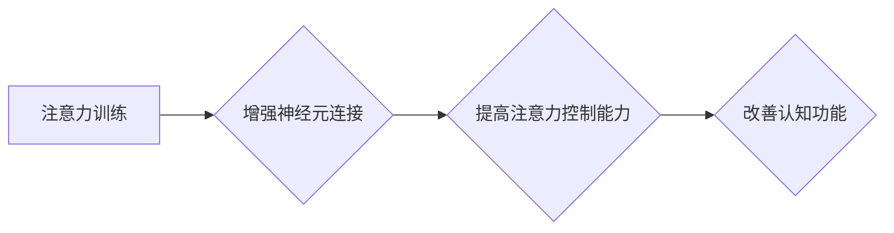

                 

## 1. 背景介绍

在当今信息爆炸的时代，注意力已经成为至关重要的认知能力。我们每天都被来自各种渠道的信息轰炸，想要有效地学习、工作和生活，必须具备强大的注意力控制能力。然而，现代社会节奏快、压力大，人们的注意力持续时间越来越短，注意力缺陷问题日益突出。

注意力训练旨在通过特定的练习和方法，增强大脑的注意力控制能力，提高专注力、记忆力、学习效率等认知功能。近年来，注意力训练的研究和应用越来越受到关注，越来越多的证据表明，注意力训练能够有效地改善注意力缺陷，提升认知能力，甚至改变大脑结构和功能。

## 2. 核心概念与联系

### 2.1 注意力机制

注意力机制是认知神经科学中一个重要的研究领域，它试图解释我们如何选择性地关注信息，并过滤掉无关的信息。

注意力机制可以分为以下几个层次：

* **定向注意力:** 指的是将注意力集中在特定目标或信息上，忽略周围的干扰。
* **分割注意力:** 指的是同时关注多个目标或信息，并有效地切换注意力。
* **维持注意力:** 指的是在长时间内保持对目标的关注，避免注意力分散。

### 2.2 神经可塑性

神经可塑性是指大脑神经元连接和功能在使用和学习过程中不断变化的能力。注意力训练通过改变大脑神经元连接和活动模式，从而增强注意力控制能力。

**注意力训练与大脑可塑性的关系：**



## 3. 核心算法原理 & 具体操作步骤

### 3.1 算法原理概述

注意力训练算法通常基于以下几个核心原理：

* **重复性练习:** 通过重复性地进行注意力训练，可以强化大脑神经元之间的连接，提高注意力控制能力。
* **渐进式难度:** 从简单的训练开始，逐渐增加训练难度，挑战大脑的注意力极限，促进神经可塑性。
* **反馈机制:** 提供实时反馈，帮助用户了解自己的注意力水平，并及时调整训练策略。

### 3.2 算法步骤详解

1. **评估初始注意力水平:** 通过注意力测试或问卷调查，评估用户的初始注意力水平。
2. **设计个性化训练计划:** 根据用户的初始注意力水平和目标，设计个性化的训练计划，包括训练内容、训练时长、训练频率等。
3. **进行注意力训练:** 使用各种注意力训练方法，例如：
    * **专注力练习:** 训练用户集中注意力在特定目标上，忽略周围的干扰。
    * **切换注意力练习:** 训练用户快速切换注意力，从一个目标切换到另一个目标。
    * **记忆力练习:** 训练用户记忆信息，提高记忆能力。
4. **提供实时反馈:** 在训练过程中，提供实时反馈，例如：
    * **注意力持续时间:** 显示用户注意力持续的时间。
    * **错误率:** 显示用户犯错的次数。
    * **进步情况:** 显示用户注意力水平的进步情况。
5. **调整训练计划:** 根据用户的训练反馈，调整训练计划，例如：
    * **增加训练难度:** 当用户表现良好时，可以增加训练难度。
    * **调整训练时长:** 根据用户的精力水平，调整训练时长。
    * **更换训练内容:** 避免训练内容单调，可以更换不同的训练内容。

### 3.3 算法优缺点

**优点:**

* **有效性:** 许多研究表明，注意力训练能够有效地改善注意力缺陷，提升认知能力。
* **可操作性:** 注意力训练方法简单易行，可以随时随地进行。
* **个性化:** 可以根据用户的需求和目标，设计个性化的训练计划。

**缺点:**

* **时间成本:** 注意力训练需要投入一定的时间和精力。
* **坚持性:** 需要用户坚持训练，才能看到效果。
* **个体差异:** 注意力训练的效果因人而异，有些人可能比其他人更容易看到效果。

### 3.4 算法应用领域

注意力训练算法可以应用于以下领域:

* **教育:** 帮助学生提高注意力和学习效率。
* **医疗:** 治疗注意力缺陷多动障碍 (ADHD) 等注意力缺陷问题。
* **职场:** 帮助员工提高工作效率和专注力。
* **个人成长:** 帮助个人提升专注力，更好地管理时间和精力。

## 4. 数学模型和公式 & 详细讲解 & 举例说明

### 4.1 数学模型构建

注意力机制可以用数学模型来表示，例如：

* **Softmax 函数:** 用于计算每个候选目标的注意力权重。

$$
\alpha_i = \frac{exp(e_i)}{\sum_{j=1}^{N} exp(e_j)}
$$

其中：

* $\alpha_i$ 是第 $i$ 个目标的注意力权重。
* $e_i$ 是第 $i$ 个目标的特征向量。
* $N$ 是候选目标的数量。

* **加权求和:** 用于根据注意力权重，对目标特征进行加权求和，得到最终的输出。

$$
\mathbf{o} = \sum_{i=1}^{N} \alpha_i \mathbf{h}_i
$$

其中：

* $\mathbf{o}$ 是最终的输出。
* $\mathbf{h}_i$ 是第 $i$ 个目标的特征向量。

### 4.2 公式推导过程

Softmax 函数的推导过程如下：

1. 首先，我们需要计算每个目标的得分，可以使用一个神经网络或其他机器学习模型来实现。
2. 然后，我们将每个目标的得分进行归一化，使其总和为 1，从而得到注意力权重。
3. 最后，我们将注意力权重与目标特征进行加权求和，得到最终的输出。

### 4.3 案例分析与讲解

例如，在机器翻译任务中，注意力机制可以用来选择翻译句子中每个单词对应的源语言单词，从而提高翻译的准确性和流畅度。

## 5. 项目实践：代码实例和详细解释说明

### 5.1 开发环境搭建

* Python 3.x
* TensorFlow 或 PyTorch

### 5.2 源代码详细实现

```python
import tensorflow as tf

# 定义注意力机制层
class AttentionLayer(tf.keras.layers.Layer):
    def __init__(self, units):
        super(AttentionLayer, self).__init__()
        self.W1 = tf.keras.layers.Dense(units)
        self.W2 = tf.keras.layers.Dense(units)
        self.V = tf.keras.layers.Dense(1)

    def call(self, inputs):
        # 计算每个单词的得分
        scores = self.V(tf.nn.tanh(self.W1(inputs[0]) + self.W2(inputs[1])))
        # 归一化得分，得到注意力权重
        attention_weights = tf.nn.softmax(scores, axis=-1)
        # 根据注意力权重，对输入进行加权求和
        context_vector = tf.matmul(attention_weights, inputs[1])
        return context_vector

# 定义注意力训练模型
model = tf.keras.Sequential([
    tf.keras.layers.Embedding(input_dim=10000, output_dim=128),
    AttentionLayer(units=64),
    tf.keras.layers.Dense(units=10, activation='softmax')
])

# 训练模型
model.compile(optimizer='adam', loss='sparse_categorical_crossentropy', metrics=['accuracy'])
model.fit(x_train, y_train, epochs=10)
```

### 5.3 代码解读与分析

* `AttentionLayer` 类定义了一个注意力机制层，它包含三个密集层：`W1`、`W2` 和 `V`。
* `call` 方法计算每个单词的得分，并使用 softmax 函数将其归一化，得到注意力权重。
* `context_vector` 是根据注意力权重对输入进行加权求和的结果。
* `model` 是一个包含嵌入层、注意力机制层和全连接层的模型。
* `compile` 方法配置模型的优化器、损失函数和指标。
* `fit` 方法训练模型。

### 5.4 运行结果展示

训练完成后，可以评估模型的性能，例如：

* 准确率
* F1 分数
* BLEU 分数

## 6. 实际应用场景

### 6.1 教育领域

* **提高学生注意力:** 注意力训练可以帮助学生集中注意力，提高学习效率。
* **改善学习障碍:** 注意力训练可以帮助学生克服学习障碍，例如注意力缺陷多动障碍 (ADHD)。
* **增强记忆力:** 注意力训练可以帮助学生增强记忆力，更好地记住学习内容。

### 6.2 医疗领域

* **治疗注意力缺陷多动障碍 (ADHD):** 注意力训练已被证明是治疗 ADHD 的有效方法之一。
* **改善认知功能:** 注意力训练可以帮助改善认知功能，例如记忆力、执行功能和决策能力。
* **促进神经可塑性:** 注意力训练可以促进大脑神经元连接和功能的变化，从而改善认知功能。

### 6.3 职场领域

* **提高工作效率:** 注意力训练可以帮助员工集中注意力，提高工作效率。
* **增强专注力:** 注意力训练可以帮助员工更好地专注于工作任务，减少分心。
* **改善决策能力:** 注意力训练可以帮助员工更好地收集和分析信息，从而做出更明智的决策。

### 6.4 未来应用展望

注意力训练技术的未来应用前景广阔，例如：

* **个性化学习:** 根据用户的注意力水平和学习风格，定制个性化的学习计划。
* **增强现实 (AR) 和虚拟现实 (VR) 应用:** 在 AR 和 VR 环境中，注意力训练可以帮助用户更好地沉浸在虚拟世界中。
* **脑机接口 (BCI):** 注意力训练可以帮助开发更精准的 BCI 系统，实现人脑与计算机的直接交互。

## 7. 工具和资源推荐

### 7.1 学习资源推荐

* **书籍:**
    * 《注意力训练与大脑增强练习》
    * 《大脑的奥秘》
    * 《认知心理学》
* **在线课程:**
    * Coursera: 神经科学
    * edX: 认知科学
    * Udemy: 注意力训练

### 7.2 开发工具推荐

* **TensorFlow:** 深度学习框架
* **PyTorch:** 深度学习框架
* **Keras:** 高级深度学习 API

### 7.3 相关论文推荐

* **Attention Is All You Need:** https://arxiv.org/abs/1706.03762
* **BERT: Pre-training of Deep Bidirectional Transformers for Language Understanding:** https://arxiv.org/abs/1810.04805
* **Improving Language Understanding by Generative Pre-Training:** https://arxiv.org/abs/1905.11025

## 8. 总结：未来发展趋势与挑战

### 8.1 研究成果总结

注意力训练的研究取得了显著进展，证明了注意力训练能够有效地改善注意力缺陷，提升认知能力，并改变大脑结构和功能。

### 8.2 未来发展趋势

* **更个性化的注意力训练:** 基于用户的脑电图、眼动追踪等生物信号，开发更个性化的注意力训练计划。
* **增强现实 (AR) 和虚拟现实 (VR) 应用:** 在 AR 和 VR 环境中，利用注意力训练技术，提高用户沉浸感和交互体验。
* **脑机接口 (BCI) 应用:** 利用注意力训练技术，开发更精准的 BCI 系统，实现人脑与计算机的直接交互。

### 8.3 面临的挑战

* **缺乏标准化评估方法:** 目前，注意力训练的评估方法缺乏标准化，难以比较不同训练方法的效果。
* **个体差异:** 注意力训练的效果因人而异，需要进一步研究个体差异的影响因素。
* **长期效果:** 需要进一步研究注意力训练的长期效果，以及如何维持训练效果。

### 8.4 研究展望

未来，注意力训练的研究将继续深入，探索注意力机制的奥秘，开发更有效、更个性化的注意力训练方法，并将其应用于更广泛的领域，为人类认知能力的提升做出更大的贡献。

## 9. 附录：常见问题与解答

**Q1: 注意力训练需要多长时间才能看到效果？**

A1: 注意力训练的效果因人而异，一般需要持续训练几周或几个月才能看到明显的效果。

**Q2: 注意力训练适合所有年龄段的人吗？**

A2: 注意力训练适合大多数年龄段的人，但对于儿童和青少年，需要根据他们的认知发展水平进行调整。

**Q3: 注意力训练有哪些风险？**

A3: 注意力训练一般来说是安全的，但如果出现头痛、疲劳等不适症状，应及时停止训练并咨询医生。


作者：禅与计算机程序设计艺术 / Zen and the Art of Computer Programming 
<end_of_turn>

