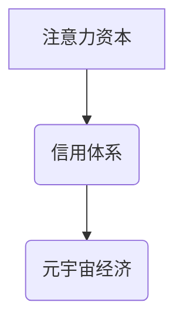

                 

## 注意力资本评级:元宇宙经济中的信用体系

> 关键词：元宇宙、注意力资本、信用体系、数据分析、算法模型、用户行为、信任机制、去中心化

## 1. 背景介绍

元宇宙概念的兴起，标志着人类进入一个全新的数字世界。在这个虚拟世界中，用户将拥有更沉浸式的体验，并参与到更丰富的社交、娱乐、工作和学习活动中。然而，元宇宙的蓬勃发展也带来了新的挑战，其中之一就是如何建立一个安全、可靠、可信的信用体系。

传统的信用体系主要基于现实世界的身份验证和交易记录，但在元宇宙中，用户身份更加虚拟化，交易行为也更加多样化。因此，我们需要一种全新的信用体系来评估和管理用户在元宇宙中的行为和贡献。

注意力资本作为一种新的资源形式，在元宇宙中扮演着越来越重要的角色。用户在元宇宙中花费的时间和精力，以及他们对内容和服务的关注度，都构成了注意力资本的积累。如何有效地评估和利用注意力资本，成为了元宇宙经济发展的重要课题。

## 2. 核心概念与联系

### 2.1 注意力资本

注意力资本是指用户在元宇宙中花费的时间和精力，以及他们对内容和服务的关注度。它是一种稀缺的资源，因为用户的注意力是有限的。

### 2.2 信用体系

信用体系是指用于评估和管理用户行为和贡献的系统。它通常包括以下几个方面：

* **身份验证:** 确认用户的真实身份。
* **行为记录:** 记录用户的交易行为、社交互动、内容创作等。
* **信用评分:** 根据用户的行为记录，计算出用户的信用等级。
* **信任机制:** 基于信用评分，建立用户之间的信任关系。

### 2.3 元宇宙经济

元宇宙经济是指在元宇宙中进行的经济活动，包括虚拟商品交易、服务提供、内容创作等。注意力资本是元宇宙经济的重要驱动力，它决定了用户对虚拟商品和服务的消费意愿。

**核心概念关系图:**



## 3. 核心算法原理 & 具体操作步骤

### 3.1 算法原理概述

注意力资本评级算法的核心是通过分析用户的行为数据，评估其在元宇宙中的贡献和价值。该算法可以参考传统的信用评分模型，例如FICO评分，并结合元宇宙的独特特点进行改进。

### 3.2 算法步骤详解

1. **数据收集:** 收集用户的元宇宙行为数据，包括但不限于：
    * **时间记录:** 用户在元宇宙中在线时长、不同平台和场景的停留时间等。
    * **互动记录:** 用户与其他用户的社交互动、参与虚拟活动、评论和点赞等行为。
    * **交易记录:** 用户购买虚拟商品、服务、土地等交易行为。
    * **内容创作:** 用户创作虚拟内容、分享经验、参与社区建设等行为。

2. **数据预处理:** 对收集到的数据进行清洗、转换和标准化，去除噪声数据、缺失值和异常值，以便于后续分析。

3. **特征提取:** 从预处理后的数据中提取关键特征，例如：
    * **活跃度:** 用户在元宇宙中的活跃程度，可以根据在线时长、互动频率等指标进行计算。
    * **参与度:** 用户参与元宇宙活动和社区建设的程度，可以根据参与虚拟活动、评论点赞等行为进行计算。
    * **贡献度:** 用户对元宇宙生态的贡献，可以根据内容创作、虚拟商品交易等行为进行计算。
    * **信任度:** 用户与其他用户的信任关系，可以根据社交互动、交易记录等行为进行计算。

4. **模型训练:** 使用机器学习算法，例如深度神经网络，对提取的特征进行训练，建立注意力资本评级模型。

5. **评分预测:** 将新用户的行为数据输入到训练好的模型中，预测其注意力资本评分。

6. **信用等级划分:** 根据注意力资本评分，将用户划分为不同的信用等级，例如：新手、普通、高级、VIP等。

### 3.3 算法优缺点

**优点:**

* **数据驱动:** 基于用户的真实行为数据进行评估，更加客观和准确。
* **动态更新:** 随着用户的行为变化，注意力资本评分也会动态更新，更加反映用户的实时价值。
* **可扩展性强:** 可以根据元宇宙的不断发展，添加新的行为数据和特征，不断完善信用体系。

**缺点:**

* **数据隐私:** 收集和使用用户的行为数据需要考虑隐私保护问题。
* **算法偏差:** 算法模型可能存在偏差，导致对不同用户的不公平评估。
* **黑客攻击:** 信用体系可能受到黑客攻击，导致用户数据泄露和信用评分被篡改。

### 3.4 算法应用领域

注意力资本评级算法可以应用于元宇宙的多个领域，例如：

* **虚拟商品交易:** 根据用户的注意力资本评分，提供不同的商品折扣和服务。
* **内容创作激励:** 对高注意力资本的用户提供更多的创作资源和收益分享。
* **虚拟身份认证:** 将注意力资本评分作为虚拟身份的一部分，提高用户身份的可靠性。
* **社区管理:** 根据用户的注意力资本评分，分配不同的社区权限和资源。

## 4. 数学模型和公式 & 详细讲解 & 举例说明

### 4.1 数学模型构建

注意力资本评级模型可以构建为一个线性回归模型，其中用户注意力资本评分作为因变量，用户的行为特征作为自变量。

### 4.2 公式推导过程

假设用户 $i$ 的注意力资本评分为 $S_i$，其行为特征包括活跃度 $A_i$、参与度 $P_i$、贡献度 $C_i$ 和信任度 $T_i$，则注意力资本评分模型可以表示为：

$$S_i = w_1A_i + w_2P_i + w_3C_i + w_4T_i + b$$

其中，$w_1$, $w_2$, $w_3$, $w_4$ 为权重系数，$b$ 为偏置项。

### 4.3 案例分析与讲解

假设我们收集了 100 个用户的行为数据，并使用机器学习算法训练了注意力资本评级模型。模型训练完成后，我们可以得到以下权重系数：

* $w_1 = 0.3$
* $w_2 = 0.2$
* $w_3 = 0.4$
* $w_4 = 0.1$

这意味着活跃度对注意力资本评分的影响最大，其次是贡献度，然后是参与度，最后是信任度。

如果一个用户的活跃度为 80，参与度为 60，贡献度为 90，信任度为 70，则其注意力资本评分可以计算为：

$$S_i = 0.3 * 80 + 0.2 * 60 + 0.4 * 90 + 0.1 * 70 + b$$

其中 $b$ 的值需要根据模型训练的结果确定。

## 5. 项目实践：代码实例和详细解释说明

### 5.1 开发环境搭建

* **编程语言:** Python
* **机器学习库:** scikit-learn
* **数据处理库:** pandas
* **可视化库:** matplotlib

### 5.2 源代码详细实现

```python
import pandas as pd
from sklearn.linear_model import LinearRegression

# 加载用户行为数据
data = pd.read_csv('user_behavior.csv')

# 选择特征和目标变量
X = data[['活跃度', '参与度', '贡献度', '信任度']]
y = data['注意力资本评分']

# 创建线性回归模型
model = LinearRegression()

# 训练模型
model.fit(X, y)

# 获取模型权重系数
weights = model.coef_
print('权重系数:', weights)

# 预测新用户的注意力资本评分
new_user_data = pd.DataFrame({'活跃度': [80], '参与度': [60], '贡献度': [90], '信任度': [70]})
predicted_score = model.predict(new_user_data)
print('预测注意力资本评分:', predicted_score)
```

### 5.3 代码解读与分析

* 代码首先加载用户行为数据，并选择特征和目标变量。
* 然后创建线性回归模型，并使用训练数据训练模型。
* 训练完成后，我们可以获取模型的权重系数，这些系数反映了不同特征对注意力资本评分的影响程度。
* 最后，我们可以使用训练好的模型预测新用户的注意力资本评分。

### 5.4 运行结果展示

运行代码后，会输出模型的权重系数和预测的注意力资本评分。

## 6. 实际应用场景

注意力资本评级算法可以应用于元宇宙的多个场景，例如：

### 6.1 虚拟商品交易

* 根据用户的注意力资本评分，提供不同的商品折扣和服务。
* 高注意力资本用户可以获得更优惠的价格或更优质的服务。
* 

### 6.2 内容创作激励

* 对高注意力资本的用户提供更多的创作资源和收益分享。
* 鼓励用户创作优质内容，提升元宇宙的整体内容质量。

### 6.3 虚拟身份认证

* 将注意力资本评分作为虚拟身份的一部分，提高用户身份的可靠性。
* 降低虚拟身份被冒充的风险，保障用户权益。

### 6.4 社区管理

* 根据用户的注意力资本评分，分配不同的社区权限和资源。
* 鼓励用户积极参与社区建设，提升社区活跃度和凝聚力。

### 6.5 未来应用展望

随着元宇宙的不断发展，注意力资本评级算法的应用场景将会更加广泛。例如，可以用于虚拟地产交易、虚拟工作场所管理、虚拟教育平台建设等领域。

## 7. 工具和资源推荐

### 7.1 学习资源推荐

* **书籍:**
    * 《元宇宙：下一代互联网》
    * 《注意力经济》
* **在线课程:**
    * Coursera: 元宇宙与虚拟现实
    * Udemy: 元宇宙开发入门

### 7.2 开发工具推荐

* **Unity:** 游戏引擎，用于开发元宇宙应用。
* **Unreal Engine:** 游戏引擎，用于开发元宇宙应用。
* **Decentraland:** 去中心化元宇宙平台。
* **The Sandbox:** 去中心化元宇宙平台。

### 7.3 相关论文推荐

* **The Metaverse: A New Paradigm for Social Interaction and Commerce**
* **Attention Capital: A New Currency in the Digital Age**

## 8. 总结：未来发展趋势与挑战

### 8.1 研究成果总结

注意力资本评级算法为元宇宙经济发展提供了新的思路和方法。它可以帮助我们更好地评估和管理用户在元宇宙中的行为和贡献，从而构建一个更加安全、可靠、可信的信用体系。

### 8.2 未来发展趋势

* **模型的复杂化:** 未来注意力资本评级模型将会更加复杂，能够更好地捕捉用户的行为特征和复杂关系。
* **数据来源的多元化:** 未来注意力资本评级模型将不仅仅依赖于元宇宙平台的数据，还会整合其他数据来源，例如社交媒体数据、搜索引擎数据等。
* **去中心化信用体系:** 未来注意力资本评级算法将更加注重去中心化，避免单一机构对信用体系的控制。

### 8.3 面临的挑战

* **数据隐私保护:** 如何收集和使用用户的行为数据，同时保障其隐私安全，是一个重要的挑战。
* **算法公平性:** 算法模型可能存在偏差，导致对不同用户的不公平评估，需要不断改进算法模型，确保其公平性。
* **黑客攻击:** 信用体系可能受到黑客攻击，导致用户数据泄露和信用评分被篡改，需要加强安全防护措施。

### 8.4 研究展望

未来，注意力资本评级算法的研究将继续深入，探索更有效的评估方法、更安全的信用体系和更广泛的应用场景。


## 9. 附录：常见问题与解答

**Q1: 注意力资本评级算法是如何保证公平性的？**

**A1:** 为了保证算法公平性，需要不断改进算法模型，消除潜在的偏差。例如，可以使用对抗性训练方法，训练模型能够抵抗不同类型的攻击，从而避免对特定用户群体的不公平评估。

**Q2: 如何保护用户数据隐私？**

**A2:** 在收集和使用用户数据时，需要严格遵守隐私保护政策，例如获得用户的明确同意，加密存储数据，限制数据访问权限等。

**Q3: 如何防止黑客攻击？**

**A3:** 可以采用多重安全防护措施，例如身份验证、数据加密、入侵检测系统等，来防止黑客攻击。


作者：禅与计算机程序设计艺术 / Zen and the Art of Computer Programming 
<end_of_turn>

