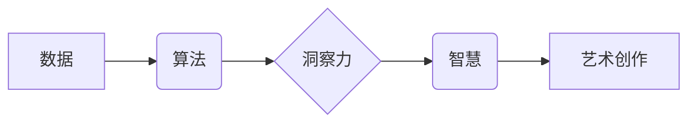

                 

## 洞察力与艺术：创作中的灵感与智慧

> 关键词：人工智能、算法、洞察力、艺术、创造力、智慧、编程

### 1. 背景介绍

在当今数据爆炸的时代，人工智能 (AI) 正以惊人的速度发展，其应用领域不断拓展，从医疗保健到金融，从自动驾驶到艺术创作，AI 正在深刻地改变着我们的生活。然而，AI 的发展并非仅仅依赖于算法的复杂性和计算能力的提升，更需要的是洞察力和艺术的融入。

传统上，人们将编程视为一种逻辑思维和技术操作的过程，而艺术则被视为情感表达和审美体验的领域。然而，随着 AI 技术的进步，这两者之间的界限正在逐渐模糊。AI 算法能够学习和分析海量数据，从中发现隐藏的模式和规律，而这些模式和规律正是艺术创作的灵感来源。

### 2. 核心概念与联系

**2.1 算法与艺术的共性**

算法和艺术都遵循着一定的规则和结构，并通过这些规则和结构来创造出新的事物。

* **算法**：是一系列明确的步骤，用于解决特定问题或完成特定任务。
* **艺术**：是一种创造性的表达形式，通过各种媒介，如绘画、音乐、舞蹈等，传达情感、思想和审美体验。

尽管它们的形式和目的不同，但算法和艺术都依赖于创造力和想象力。

**2.2 洞察力与智慧的驱动**

洞察力和智慧是 AI 创作的关键驱动力。

* **洞察力**：是指从数据中发现隐藏的模式和规律的能力。
* **智慧**：是指运用洞察力，做出明智的决策和创造出有价值的作品的能力。

AI 算法能够提供洞察力，但最终的创作决策和艺术价值的判断仍然需要人类的智慧。

**2.3  核心概念关系流程图**



### 3. 核心算法原理 & 具体操作步骤

**3.1 算法原理概述**

本文将探讨一种名为 **生成对抗网络 (GAN)** 的核心算法，它能够生成逼真的图像、文本和音乐等创意内容。GAN 由两个相互竞争的网络组成：

* **生成网络 (Generator)**：负责生成新的数据样本。
* **判别网络 (Discriminator)**：负责判断数据样本是真实数据还是由生成网络生成的伪造数据。

这两个网络在对抗游戏中不断学习和改进，最终生成网络能够生成与真实数据几乎 indistinguishable 的样本。

**3.2 算法步骤详解**

1. **初始化**：生成网络和判别网络随机初始化参数。
2. **训练判别网络**：使用真实数据和生成网络生成的伪造数据训练判别网络，使其能够区分真实数据和伪造数据。
3. **训练生成网络**：使用判别网络的反馈信息训练生成网络，使其能够生成更逼真的数据样本。
4. **重复步骤 2 和 3**：不断迭代训练生成网络和判别网络，直到生成网络能够生成与真实数据几乎 indistinguishable 的样本。

**3.3 算法优缺点**

**优点:**

* 可以生成逼真的数据样本，应用于图像合成、文本生成、音乐创作等领域。
* 能够学习数据中的复杂模式和结构。

**缺点:**

* 训练过程复杂，需要大量的计算资源和时间。
* 生成的样本可能存在模式重复或不稳定性问题。

**3.4 算法应用领域**

* **图像合成**: 生成逼真的图像，例如人脸生成、场景合成、图像修复等。
* **文本生成**: 生成逼真的文本，例如小说、诗歌、新闻报道等。
* **音乐创作**: 生成逼真的音乐，例如旋律、节奏、和声等。
* **药物研发**: 生成新的药物分子结构，加速药物研发过程。

### 4. 数学模型和公式 & 详细讲解 & 举例说明

**4.1 数学模型构建**

GAN 的核心数学模型是基于概率分布的。生成网络的目标是学习真实数据分布，并生成服从该分布的新数据样本。判别网络的目标是区分真实数据和生成数据，其输出是一个概率值，表示样本是真实数据的概率。

**4.2 公式推导过程**

* **生成网络损失函数**:  生成网络的目标是最大化判别网络对生成数据的判断概率。

$$
L_G = -log(D(G(z)))
$$

其中，$G(z)$ 是生成网络生成的样本，$D(x)$ 是判别网络对样本 $x$ 的判断概率。

* **判别网络损失函数**: 判别网络的目标是最大化对真实数据的判断概率，同时最小化对生成数据的判断概率。

$$
L_D = -log(D(x)) - log(1-D(G(z)))
$$

其中，$x$ 是真实数据样本。

**4.3 案例分析与讲解**

例如，在图像生成任务中，生成网络会从随机噪声向量 $z$ 中生成图像，判别网络则会判断生成的图像是否真实。通过不断训练，生成网络能够学习到真实图像的特征，并生成逼真的图像样本。

### 5. 项目实践：代码实例和详细解释说明

**5.1 开发环境搭建**

使用 Python 语言和 TensorFlow 或 PyTorch 深度学习框架进行开发。

**5.2 源代码详细实现**

```python
# 生成网络代码示例
import tensorflow as tf

def generator(z):
  # ... 生成网络结构代码 ...
  return generated_image

# 判别网络代码示例
def discriminator(image):
  # ... 判别网络结构代码 ...
  return probability

# 训练循环
for epoch in range(num_epochs):
  # ... 训练判别网络和生成网络 ...
```

**5.3 代码解读与分析**

代码示例展示了生成网络和判别网络的基本结构。具体实现细节取决于具体的任务和数据集。

**5.4 运行结果展示**

训练完成后，可以生成新的图像样本，并与真实图像进行比较。

### 6. 实际应用场景

**6.1 艺术创作**

GAN 可以用于生成逼真的图像、音乐和文本，为艺术家提供新的创作灵感和工具。

**6.2 游戏开发**

GAN 可以用于生成游戏场景、角色和道具，提高游戏画面和体验。

**6.3 数据增强**

GAN 可以用于生成新的训练数据，提高机器学习模型的性能。

**6.4 未来应用展望**

随着 AI 技术的不断发展，GAN 将在更多领域得到应用，例如医学影像分析、药物研发、金融风险评估等。

### 7. 工具和资源推荐

**7.1 学习资源推荐**

* **书籍**: 《深度学习》
* **课程**: Coursera 上的“深度学习”课程
* **博客**: TensorFlow 官方博客、PyTorch 官方博客

**7.2 开发工具推荐**

* **TensorFlow**: 开源深度学习框架
* **PyTorch**: 开源深度学习框架
* **Keras**: 高级深度学习 API

**7.3 相关论文推荐**

* **Generative Adversarial Networks** (Goodfellow et al., 2014)

### 8. 总结：未来发展趋势与挑战

**8.1 研究成果总结**

GAN 算法取得了显著的成果，在图像生成、文本生成、音乐创作等领域展现出强大的潜力。

**8.2 未来发展趋势**

* **算法改进**: 研究更有效的 GAN 算法，提高生成样本的质量和多样性。
* **应用拓展**: 将 GAN 应用于更多领域，例如科学研究、工程设计、教育培训等。
* **伦理问题**: 探索 GAN 的伦理问题，例如数据隐私、内容生成中的偏见等。

**8.3 面临的挑战**

* **训练复杂度**: GAN 的训练过程复杂，需要大量的计算资源和时间。
* **样本质量**: 生成的样本可能存在模式重复或不稳定性问题。
* **伦理问题**: GAN 的应用可能带来伦理问题，例如数据隐私、内容生成中的偏见等。

**8.4 研究展望**

未来，GAN 算法将继续发展，并与其他 AI 技术相结合，为人类创造更多价值。


### 9. 附录：常见问题与解答

**9.1 如何选择合适的 GAN 算法？**

选择合适的 GAN 算法取决于具体的应用场景和数据集。

**9.2 如何解决 GAN 训练中的模式崩溃问题？**

可以通过多种方法解决 GAN 训练中的模式崩溃问题，例如使用更复杂的生成网络结构、调整训练参数、引入正则化项等。

**9.3 GAN 的伦理问题有哪些？**

GAN 的应用可能带来伦理问题，例如数据隐私、内容生成中的偏见等。需要谨慎考虑这些问题，并制定相应的伦理规范。


作者：禅与计算机程序设计艺术 / Zen and the Art of Computer Programming 
<end_of_turn>

