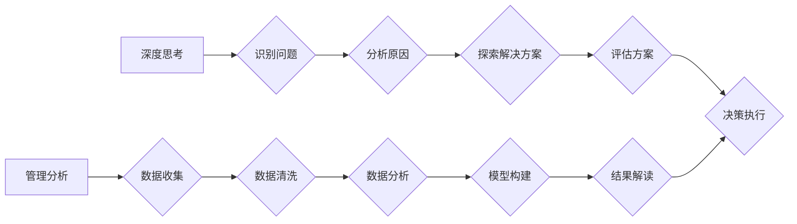

                 

## 深度思考与管理分析能力

> 关键词：深度思考、管理分析、决策支持、数据驱动、人工智能、机器学习、商业智能、战略规划、问题解决

## 1. 背景介绍

在当今数据爆炸和技术飞速发展的时代，深度思考和管理分析能力已成为企业和个人取得成功的关键要素。 传统的管理模式逐渐难以应对复杂多变的市场环境，需要更加深入的思考和分析能力来洞察问题本质、制定有效的策略和做出明智的决策。

深度思考是指能够深入挖掘问题背后的逻辑关系、识别关键因素、分析各种可能性并形成独立的判断能力。管理分析则是指运用科学的方法和工具，对大量数据进行收集、整理、分析和解读，以支持管理决策。

深度思考和管理分析能力的结合，能够帮助企业和个人：

* **洞察市场趋势和客户需求**: 通过对数据进行深入分析，识别潜在的市场机会和客户需求，制定更精准的市场策略。
* **优化运营流程和资源配置**: 通过分析数据，识别运营中的瓶颈和浪费，优化流程，提高资源利用效率。
* **降低风险和提高决策效率**: 通过对风险因素进行分析，制定有效的风险管理策略，并通过数据驱动决策，提高决策的准确性和效率。
* **促进创新和发展**: 通过深度思考和数据分析，发现新的商业模式和创新点，推动企业和个人的持续发展。

## 2. 核心概念与联系

深度思考和管理分析能力相互关联，共同构成了现代管理和决策的核心要素。

**深度思考**

* **批判性思维**: 质疑假设、分析证据、识别逻辑谬误，形成独立的判断。
* **创造性思维**: 提出新颖的想法、解决问题，寻找新的可能性。
* **系统思维**: 理解事物之间的相互关联，从整体角度分析问题。

**管理分析**

* **数据收集和整理**: 从各种来源收集数据，并进行整理和清洗。
* **数据分析和建模**: 使用统计学、机器学习等方法对数据进行分析，建立模型预测未来趋势。
* **结果解读和决策支持**: 对分析结果进行解读，并将其转化为可操作的决策建议。

**Mermaid 流程图**



## 3. 核心算法原理 & 具体操作步骤

### 3.1  算法原理概述

深度思考和管理分析能力的提升需要运用多种算法和模型，例如：

* **逻辑推理算法**: 用于分析问题逻辑关系，识别矛盾和推导结论。
* **机器学习算法**: 用于识别模式、预测趋势和进行数据挖掘。
* **决策树算法**: 用于构建决策规则，帮助做出选择。
* **神经网络算法**: 用于模拟人类大脑的学习过程，解决复杂问题。

### 3.2  算法步骤详解

**逻辑推理算法**

1. **定义问题**: 明确问题目标和范围。
2. **构建知识库**: 收集相关信息和知识，建立逻辑关系网络。
3. **应用推理规则**: 使用逻辑推理规则，从知识库中推导结论。
4. **验证结果**: 检查结论的合理性和可行性。

**机器学习算法**

1. **数据收集**: 收集大量相关数据。
2. **数据预处理**: 清洗、转换和格式化数据。
3. **模型选择**: 选择合适的机器学习算法。
4. **模型训练**: 使用训练数据训练模型，使其能够学习数据模式。
5. **模型评估**: 使用测试数据评估模型性能。
6. **模型部署**: 将训练好的模型部署到实际应用场景中。

### 3.3  算法优缺点

**逻辑推理算法**

* **优点**: 能够处理明确的逻辑问题，结果具有可解释性。
* **缺点**: 难以处理复杂、模糊的问题，需要人工构建知识库。

**机器学习算法**

* **优点**: 能够处理大量数据，发现隐藏的模式，自动化决策。
* **缺点**: 需要大量数据进行训练，结果难以解释，容易受到数据偏差的影响。

### 3.4  算法应用领域

* **逻辑推理算法**: 专家系统、自然语言处理、法律推理等。
* **机器学习算法**: 预测分析、推荐系统、图像识别、语音识别等。

## 4. 数学模型和公式 & 详细讲解 & 举例说明

### 4.1  数学模型构建

深度思考和管理分析能力的提升可以借助数学模型进行量化分析和预测。例如，可以使用贝叶斯定理来评估决策的风险和收益，可以使用线性回归模型来预测销售额，可以使用决策树模型来分析客户行为。

### 4.2  公式推导过程

**贝叶斯定理**:

$$P(A|B) = \frac{P(B|A)P(A)}{P(B)}$$

其中：

* $P(A|B)$ 是事件 A 在事件 B 发生的条件概率。
* $P(B|A)$ 是事件 B 在事件 A 发生的条件概率。
* $P(A)$ 是事件 A 的概率。
* $P(B)$ 是事件 B 的概率。

**举例说明**:

假设我们想要评估某个投资项目的风险。我们可以使用贝叶斯定理来计算，在项目成功的情况下，其风险的概率是多少。

* $A$：项目成功
* $B$：项目风险高

我们可以根据历史数据和专家意见，估计 $P(B|A)$、$P(A)$ 和 $P(B)$ 的值，然后代入贝叶斯定理公式，计算出 $P(A|B)$ 的值。

### 4.3  案例分析与讲解

**案例**:

一家电商公司想要预测客户的购买行为。他们收集了大量客户数据，包括购买历史、浏览记录、年龄、性别等信息。

**分析**:

可以使用机器学习算法，例如逻辑回归模型，对客户数据进行分析，建立预测模型。

**结果**:

模型可以预测客户购买特定商品的概率，帮助公司进行精准营销和库存管理。

## 5. 项目实践：代码实例和详细解释说明

### 5.1  开发环境搭建

* **操作系统**: Windows/macOS/Linux
* **编程语言**: Python
* **库和框架**: pandas, scikit-learn, matplotlib

### 5.2  源代码详细实现

```python
import pandas as pd
from sklearn.linear_model import LogisticRegression
from sklearn.model_selection import train_test_split
from sklearn.metrics import accuracy_score

# 加载数据
data = pd.read_csv('customer_data.csv')

# 划分训练集和测试集
X = data.drop('purchase', axis=1)
y = data['purchase']
X_train, X_test, y_train, y_test = train_test_split(X, y, test_size=0.2, random_state=42)

# 创建逻辑回归模型
model = LogisticRegression()

# 训练模型
model.fit(X_train, y_train)

# 预测测试集结果
y_pred = model.predict(X_test)

# 计算模型准确率
accuracy = accuracy_score(y_test, y_pred)
print('模型准确率:', accuracy)
```

### 5.3  代码解读与分析

* **数据加载**: 使用 pandas 库加载客户数据。
* **数据划分**: 将数据划分为训练集和测试集，用于模型训练和评估。
* **模型创建**: 使用 scikit-learn 库创建逻辑回归模型。
* **模型训练**: 使用训练集训练模型，使其能够学习数据模式。
* **模型预测**: 使用训练好的模型预测测试集结果。
* **模型评估**: 使用准确率等指标评估模型性能。

### 5.4  运行结果展示

运行代码后，会输出模型的准确率，例如：

```
模型准确率: 0.85
```

这表示模型能够准确预测客户购买行为的 85% 的情况。

## 6. 实际应用场景

深度思考和管理分析能力在各个领域都有广泛的应用场景，例如：

* **商业决策**: 分析市场趋势、客户需求、竞争对手情况，制定有效的营销策略、产品策略和运营策略。
* **风险管理**: 识别和评估风险因素，制定风险控制措施，降低企业风险。
* **人力资源管理**: 分析员工绩效、人才需求，优化招聘、培训和晋升策略。
* **医疗保健**: 分析患者数据，辅助诊断疾病、制定治疗方案，提高医疗效率。
* **金融投资**: 分析市场数据、公司财务状况，进行投资决策，降低投资风险。

### 6.4  未来应用展望

随着人工智能和数据分析技术的不断发展，深度思考和管理分析能力将发挥更加重要的作用。未来，我们将看到：

* **更智能的决策支持系统**: 利用人工智能技术，自动分析数据，提供更精准、更全面的决策建议。
* **更个性化的服务**: 通过对客户数据进行深入分析，提供更个性化的产品和服务。
* **更有效的风险管理**: 利用机器学习算法，识别和预测潜在风险，制定更有效的风险控制措施。

## 7. 工具和资源推荐

### 7.1  学习资源推荐

* **书籍**:
    * 《思考，快与慢》
    * 《数据驱动决策》
    * 《机器学习实战》
* **在线课程**:
    * Coursera: 数据科学、机器学习
    * edX: 决策分析、商业智能
* **网站**:
    * Towards Data Science
    * Analytics Vidhya

### 7.2  开发工具推荐

* **数据分析工具**:
    * Python (pandas, scikit-learn, matplotlib)
    * R
    * Tableau
* **机器学习平台**:
    * TensorFlow
    * PyTorch
    * Azure Machine Learning

### 7.3  相关论文推荐

* **深度学习**:
    * "ImageNet Classification with Deep Convolutional Neural Networks"
* **决策树**:
    * "Decision Trees"
* **贝叶斯定理**:
    * "An Introduction to Bayesian Statistics"

## 8. 总结：未来发展趋势与挑战

### 8.1  研究成果总结

深度思考和管理分析能力的提升是现代社会发展的重要趋势。通过运用科学的方法和工具，我们可以更好地洞察问题本质、制定有效的策略和做出明智的决策。

### 8.2  未来发展趋势

* **人工智能技术的进一步发展**: 人工智能技术将更加智能化，能够自动分析数据，提供更精准的决策建议。
* **数据分析技术的不断创新**: 新的算法和模型将不断涌现，能够处理更复杂的数据，提供更深入的分析结果。
* **跨学科融合**: 深度思考和管理分析能力将与其他学科融合，例如心理学、社会学、经济学等，形成更全面的分析框架。

### 8.3  面临的挑战

* **数据质量问题**: 数据的准确性、完整性和一致性是深度思考和管理分析的基础，需要加强数据管理和质量控制。
* **算法解释性问题**: 一些机器学习算法的决策过程难以解释，需要开发更可解释的算法模型。
* **伦理问题**: 深度思考和管理分析能力的应用需要考虑伦理问题，例如数据隐私、算法偏见等。

### 8.4  研究展望

未来，我们需要继续深入研究深度思考和管理分析能力的本质，开发更智能、更可解释、更安全的算法模型，并将其应用于更广泛的领域，推动社会进步和人类发展。

## 9. 附录：常见问题与解答

**问题**: 如何培养深度思考能力？

**解答**:

* **多阅读**: 阅读不同领域的书籍和文章，拓宽知识面，培养批判性思维。
* **多思考**: 遇到问题时，不要急于求解，先花时间思考问题本质，分析各种可能性。
* **多提问**: 不要害怕提问，即使是看似愚蠢的问题，也可能引发新的思考。
* **多练习**: 通过写作、演讲、辩论等方式，锻炼思考和表达能力。

**问题**: 如何选择合适的管理分析工具？

**解答**:

* **明确需求**: 首先要明确需要分析什么问题，目标是什么。
* **数据类型**: 不同的工具适合处理不同的数据类型，例如结构化数据、非结构化数据等。
* **技术水平**: 选择适合自身技术水平的工具，避免使用过于复杂的工具。
* **成本**: 考虑工具的成本，选择性价比高的工具。


作者：禅与计算机程序设计艺术 / Zen and the Art of Computer Programming 
<end_of_turn>

