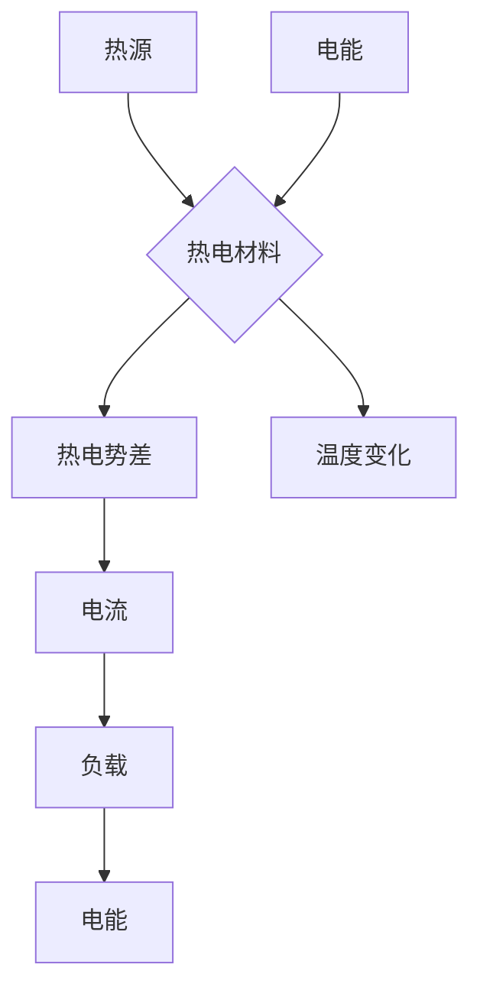

                 

## 热电材料在能源回收中的应用：提高能源利用效率

> 关键词：热电材料、能源回收、热电效应、热能转换、能源效率、 thermoelectric generator (TEG)

## 1. 背景介绍

随着全球能源需求的不断增长和环境问题的日益严峻，提高能源利用效率已成为一个迫切的课题。传统能源的利用效率普遍较低，大量的热能被浪费掉。热电材料凭借其独特的热电效应，为能源回收提供了新的途径。

热电材料能够将热能直接转换为电能，或将电能转换为热能，这一特性被称为热电效应。这种效应的发现可以追溯到1821年，但由于材料性能的限制，热电材料在实际应用中一直面临着挑战。近年来，随着材料科学和纳米技术的不断发展，热电材料的性能得到了显著提升，其在能源回收领域的应用前景越来越广阔。

## 2. 核心概念与联系

热电效应是指某些材料在温度梯度下产生电流，或在电流作用下产生温度梯度的现象。这种效应主要由两种机制驱动：

* **塞贝克效应 (Seebeck Effect):** 当温度梯度存在于热电材料中时，会产生电势差，从而驱动电流流动。
* **珀尔帖效应 (Peltier Effect):** 当电流通过热电材料时，会产生热量吸收或释放，从而改变材料的温度。

热电材料的性能通常用 **热电性能系数 (ZT)** 来衡量，ZT值越高，热电材料的性能越好。ZT值由以下三个因素决定：

* **塞贝克系数 (S):** 表征热电材料将热能转换为电能的能力。
* **电导率 (σ):** 表征热电材料导电能力。
* **热导率 (κ):** 表征热电材料导热能力。

**热电材料的应用流程:**



## 3. 核心算法原理 & 具体操作步骤

### 3.1  算法原理概述

热电材料的能量转换过程本质上是一个热力学过程，其核心原理是利用热电效应将热能转化为电能，或将电能转化为热能。

### 3.2  算法步骤详解

1. **选择合适的热电材料:** 不同的热电材料具有不同的性能参数，需要根据具体的应用场景选择合适的材料。
2. **设计热电元件:** 热电元件通常由多个热电对组成，每个热电对由两种不同材料构成。
3. **搭建热电装置:** 将热电元件连接到热源和负载之间，形成一个完整的热电装置。
4. **控制温度梯度:** 通过调节热源和冷源的温度，控制热电元件两端的温度差，从而影响热电效应的强度。
5. **收集电能:** 当热电效应发生时，热电元件会产生电流，可以通过负载收集电能。

### 3.3  算法优缺点

**优点:**

* **直接将热能转换为电能:** 热电材料能够直接将热能转换为电能，无需中间环节，提高了能源利用效率。
* **无污染:** 热电材料的能量转换过程不产生任何污染物，是一种清洁能源技术。
* **小型化:** 热电材料的装置可以小型化，便于集成到各种设备中。

**缺点:**

* **效率较低:** 目前热电材料的效率仍然较低，需要进一步提高材料性能。
* **成本较高:** 高性能热电材料的制备成本较高，制约了其大规模应用。
* **温度范围有限:** 热电材料的性能受温度范围的影响，在高温或低温环境下效率会降低。

### 3.4  算法应用领域

热电材料在能源回收领域具有广泛的应用前景，例如:

* **汽车废热回收:** 利用汽车发动机、变速箱等部件产生的废热，将其转换为电能，为车辆提供额外的动力。
* **工业余热回收:** 利用工业生产过程中的余热，将其转换为电能，降低能源消耗。
* **数据中心热能回收:** 利用数据中心服务器产生的热量，将其转换为电能，降低数据中心能耗。
* **人体热能回收:** 利用人体产生的热量，将其转换为电能，为小型电子设备提供能量。

## 4. 数学模型和公式 & 详细讲解 & 举例说明

### 4.1  数学模型构建

热电材料的性能可以用以下数学模型来描述:

* **热电性能系数 (ZT):** 
 $$ZT = \frac{S^2 \sigma T}{\kappa}$$

其中:

* S: 塞贝克系数 (V/K)
* σ: 电导率 (S/m)
* T: 绝对温度 (K)
* κ: 热导率 (W/mK)

### 4.2  公式推导过程

热电性能系数 (ZT) 的推导过程可以追溯到热力学第二定律和热电效应的物理机制。

* **热力学第二定律:** 热力学第二定律指出，热量总是从高温物体流向低温物体。
* **热电效应:** 当温度梯度存在于热电材料中时，会产生电势差，从而驱动电流流动。

通过将热力学第二定律和热电效应的物理机制结合起来，可以推导出热电性能系数 (ZT) 的表达式。

### 4.3  案例分析与讲解

假设一种热电材料的塞贝克系数为 200 μV/K，电导率为 100 S/m，热导率为 1 W/mK，温度为 300 K。

则该材料的热电性能系数 (ZT) 为:

$$ZT = \frac{(200 \times 10^{-6} V/K)^2 \times 100 S/m \times 300 K}{1 W/mK} = 0.012$$

该材料的ZT值较低，说明其热电性能较差。

## 5. 项目实践：代码实例和详细解释说明

### 5.1  开发环境搭建

* **操作系统:** Linux (Ubuntu 20.04)
* **编程语言:** Python 3.8
* **库:** NumPy, SciPy, Matplotlib

### 5.2  源代码详细实现

```python
import numpy as np
from scipy.optimize import minimize

# 定义热电材料的性能参数
S = 200e-6  # 塞贝克系数 (V/K)
sigma = 100  # 电导率 (S/m)
kappa = 1  # 热导率 (W/mK)

# 定义目标函数: 最大化热电性能系数 (ZT)
def objective_function(T):
    ZT = (S**2 * sigma * T) / kappa
    return ZT

# 设置温度范围
T_range = np.linspace(300, 600, 100)

# 计算不同温度下的ZT值
ZT_values = objective_function(T_range)

# 寻找ZT值最大化的温度
optimal_T = minimize(objective_function, T_range[0], method='Nelder-Mead')

# 打印结果
print(f"最佳温度: {optimal_T.x:.2f} K")
print(f"最大化ZT值: {optimal_T.fun:.4f}")

# 绘制ZT值随温度变化的曲线
import matplotlib.pyplot as plt
plt.plot(T_range, ZT_values)
plt.xlabel("温度 (K)")
plt.ylabel("热电性能系数 (ZT)")
plt.title("热电性能系数随温度变化")
plt.show()
```

### 5.3  代码解读与分析

该代码首先定义了热电材料的性能参数，然后定义了一个目标函数，该函数计算不同温度下的热电性能系数 (ZT)。

接着，代码使用 `scipy.optimize.minimize` 函数寻找ZT值最大化的温度。最后，代码绘制了ZT值随温度变化的曲线，以便直观地观察热电材料的性能特性。

### 5.4  运行结果展示

运行该代码后，会输出最佳温度和最大化ZT值。同时，还会绘制出ZT值随温度变化的曲线。

## 6. 实际应用场景

### 6.1  汽车废热回收

汽车发动机、变速箱等部件产生的废热量非常大，可以通过热电材料将其转换为电能，为车辆提供额外的动力，提高燃油经济性。

### 6.2  工业余热回收

许多工业生产过程都会产生大量的余热，例如钢铁厂、化工厂等。这些余热可以通过热电材料回收利用，降低能源消耗，减少环境污染。

### 6.3  数据中心热能回收

数据中心服务器的运行会产生大量的热量，可以通过热电材料将其转换为电能，降低数据中心的能耗。

### 6.4  未来应用展望

随着热电材料性能的不断提升，其在能源回收领域的应用前景更加广阔。未来，热电材料可能被应用于以下领域:

* **可穿戴设备:** 利用人体热能为可穿戴设备提供能量。
* **智能家居:** 利用家居设备产生的热能为智能家居系统提供能量。
* **太空探测:** 利用太阳能或太空环境中的热能为太空探测器提供能量。

## 7. 工具和资源推荐

### 7.1  学习资源推荐

* **书籍:**
    * "Thermoelectric Materials and Devices" by David Rowe
    * "Fundamentals of Thermoelectricity" by J.M. Ziman
* **在线课程:**
    * Coursera: "Introduction to Thermoelectric Materials"
    * edX: "Thermoelectric Energy Harvesting"

### 7.2  开发工具推荐

* **材料模拟软件:**
    * VASP
    * Quantum Espresso
* **热电性能计算软件:**
    * TEPROP
    * Thermoelectric Simulator

### 7.3  相关论文推荐

* **Nature:** "High-performance thermoelectric materials"
* **Science:** "Thermoelectric energy harvesting: A review"
* **Advanced Materials:** "Recent advances in thermoelectric materials and devices"

## 8. 总结：未来发展趋势与挑战

### 8.1  研究成果总结

近年来，热电材料的研究取得了显著进展，材料性能得到了显著提升，应用领域也逐渐扩展。

### 8.2  未来发展趋势

未来，热电材料的研究将朝着以下方向发展:

* **开发更高效的热电材料:** 通过材料设计和合成技术，开发具有更高ZT值的热电材料。
* **探索新的应用场景:** 将热电材料应用于更多领域，例如可穿戴设备、智能家居、太空探测等。
* **降低热电材料的制备成本:** 探索新的制备方法，降低热电材料的制备成本，促进其大规模应用。

### 8.3  面临的挑战

热电材料的发展仍然面临着一些挑战:

* **材料性能的局限性:** 目前热电材料的效率仍然较低，需要进一步提高材料性能。
* **制备成本高:** 高性能热电材料的制备成本较高，制约了其大规模应用。
* **应用环境的限制:** 热电材料的性能受温度范围的影响，在高温或低温环境下效率会降低。

### 8.4  研究展望

尽管面临着挑战，但热电材料在能源回收领域的应用前景依然十分广阔。相信随着科技的进步，热电材料的性能将得到进一步提升，其在能源回收领域的应用将更加广泛。

## 9. 附录：常见问题与解答

**1. 热电材料的效率如何提高？**

热电材料的效率可以通过以下方式提高:

* **提高塞贝克系数:** 寻找具有更高塞贝克系数的材料。
* **提高电导率:** 降低材料的电阻，提高电导率。
* **降低热导率:** 降低材料的热传导性，减少热量散失。

**2. 热电材料的制备成本如何降低？**

热电材料的制备成本可以通过以下方式降低:

* **探索新的制备方法:** 研究更经济高效的制备方法。
* **利用廉价材料:** 寻找具有良好性能的廉价材料。
* **规模化生产:** 通过规模化生产降低制备成本。


作者：禅与计算机程序设计艺术 / Zen and the Art of Computer Programming 
<end_of_turn>

