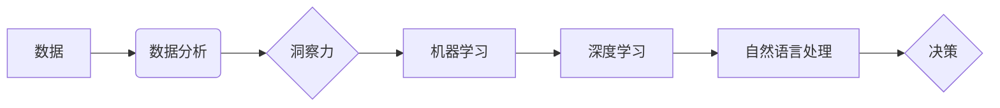

                 

## 理解洞察力的科学：揭开决策之谜

> 关键词：洞察力、机器学习、深度学习、决策树、自然语言处理、数据分析

### 1. 背景介绍

在当今数据爆炸的时代，人类面临着前所未有的决策挑战。从金融投资到医疗诊断，从城市规划到个性化推荐，我们都需要做出快速、准确、高效的决策。然而，传统的决策方法往往依赖于经验和直觉，难以应对复杂、多变的现实环境。

洞察力，即从海量数据中提取有价值信息的能力，成为解决这一难题的关键。它不仅能帮助我们识别隐藏的模式和趋势，还能洞悉事物的本质，从而做出更明智的决策。

近年来，人工智能（AI）技术取得了长足进步，为洞察力的科学发展提供了强有力的工具。机器学习、深度学习等算法能够自动学习数据中的规律，并生成洞察性的结论。

### 2. 核心概念与联系

**2.1 洞察力**

洞察力是指从数据中发现隐藏的模式、趋势和关系的能力，并将其转化为有价值的知识和行动建议。它需要结合数据分析、逻辑推理、知识背景和创造力等多种因素。

**2.2 机器学习**

机器学习是一种人工智能技术，它通过算法训练模型，使模型能够从数据中学习并做出预测或决策。常见的机器学习算法包括决策树、支持向量机、神经网络等。

**2.3 深度学习**

深度学习是一种更高级的机器学习技术，它使用多层神经网络来模拟人类大脑的学习过程。深度学习算法能够处理更复杂的数据，并获得更精细的洞察力。

**2.4 自然语言处理**

自然语言处理（NLP）是人工智能的一个分支，它致力于使计算机能够理解和处理人类语言。NLP技术可以用于分析文本数据，提取关键信息，识别情感倾向等，从而帮助我们洞察语言背后的含义。

**2.5 数据分析**

数据分析是指从数据中提取有价值信息的过程。它包括数据收集、清洗、整理、分析和可视化等步骤。数据分析是洞察力的基础，它为机器学习和深度学习算法提供数据支撑。

**核心概念与联系流程图**



### 3. 核心算法原理 & 具体操作步骤

**3.1 算法原理概述**

决策树是一种常用的机器学习算法，它通过构建树形结构来表示决策规则，并根据输入数据进行分类或预测。决策树算法的优点包括易于理解、解释和实现，以及对数据类型适应性强。

**3.2 算法步骤详解**

1. **选择特征:** 根据数据的特征选择最优的特征作为决策节点。
2. **划分数据集:** 根据选择的特征将数据集划分成子集。
3. **递归划分:** 对每个子集重复步骤1和步骤2，直到满足停止条件。
4. **生成决策树:** 将划分结果连接起来，形成决策树结构。

**3.3 算法优缺点**

**优点:**

* 易于理解和解释
* 对数据类型适应性强
* 训练速度快

**缺点:**

* 容易过拟合
* 对数据噪声敏感
* 对于高维数据效果不佳

**3.4 算法应用领域**

决策树算法广泛应用于各种领域，例如：

* **分类:** 识别邮件是否为垃圾邮件、预测客户是否会流失等。
* **回归:** 预测房价、股票价格等。
* **异常检测:** 识别网络攻击、欺诈交易等。

### 4. 数学模型和公式 & 详细讲解 & 举例说明

**4.1 数学模型构建**

决策树的构建过程可以看作是一个递归的决策过程，每个节点代表一个决策规则，每个分支代表一个可能的决策结果。

**4.2 公式推导过程**

决策树算法通常使用信息增益或基尼系数来选择最优特征划分。

* **信息增益:**

$$
Gain(S,A) = Entropy(S) - \sum_{v \in V} \frac{|S_v|}{|S|} Entropy(S_v)
$$

其中：

* $S$ 是数据集
* $A$ 是特征
* $V$ 是特征 $A$ 的取值集合
* $S_v$ 是特征 $A$ 取值为 $v$ 的子集
* $Entropy(S)$ 是数据集 $S$ 的熵

* **基尼系数:**

$$
Gini(S) = 1 - \sum_{i=1}^{k} p_i^2
$$

其中：

* $k$ 是类别数
* $p_i$ 是类别 $i$ 的概率

**4.3 案例分析与讲解**

假设我们有一个数据集，用于预测客户是否会购买产品。数据集包含以下特征：年龄、收入、性别、购买历史等。

我们可以使用信息增益或基尼系数来选择最优特征作为决策节点。例如，如果信息增益最高的特征是“收入”，那么决策树的第一个节点将是根据收入进行划分。

### 5. 项目实践：代码实例和详细解释说明

**5.1 开发环境搭建**

* Python 3.x
* scikit-learn 库

**5.2 源代码详细实现**

```python
from sklearn.tree import DecisionTreeClassifier
from sklearn.model_selection import train_test_split
from sklearn.metrics import accuracy_score

# 加载数据
# ...

# 将数据划分为训练集和测试集
X_train, X_test, y_train, y_test = train_test_split(X, y, test_size=0.2, random_state=42)

# 创建决策树模型
model = DecisionTreeClassifier()

# 训练模型
model.fit(X_train, y_train)

# 对测试集进行预测
y_pred = model.predict(X_test)

# 计算模型准确率
accuracy = accuracy_score(y_test, y_pred)
print(f"模型准确率: {accuracy}")
```

**5.3 代码解读与分析**

* `DecisionTreeClassifier()` 创建决策树模型。
* `train_test_split()` 将数据划分为训练集和测试集。
* `fit()` 方法训练模型。
* `predict()` 方法对测试集进行预测。
* `accuracy_score()` 计算模型准确率。

**5.4 运行结果展示**

运行代码后，会输出模型的准确率。

### 6. 实际应用场景

决策树算法在各种实际应用场景中发挥着重要作用，例如：

* **医疗诊断:** 根据患者的症状和病史，预测疾病类型。
* **金融风险评估:** 根据客户的信用记录和财务状况，评估贷款风险。
* **客户关系管理:** 根据客户的行为和偏好，进行个性化营销。

### 7. 工具和资源推荐

**7.1 学习资源推荐**

* **书籍:**

    * 《机器学习》 - 周志华
    * 《Python机器学习实战》 - 塞缪尔·阿布拉姆斯

* **在线课程:**

    * Coursera: Machine Learning
    * edX: Artificial Intelligence

**7.2 开发工具推荐**

* **Python:** 广泛使用的编程语言，用于机器学习和数据分析。
* **scikit-learn:** Python机器学习库，提供各种算法和工具。
* **TensorFlow:** 开源深度学习框架。

**7.3 相关论文推荐**

* **Decision Trees** - J.R. Quinlan (1986)
* **CART: Classification and Regression Trees** - L. Breiman, J. Friedman, R. Olshen, C. Stone (1984)

### 8. 总结：未来发展趋势与挑战

**8.1 研究成果总结**

近年来，洞察力科学取得了显著进展，机器学习、深度学习等算法为洞察力的发展提供了强有力的工具。决策树算法作为一种经典的机器学习算法，在洞察力应用中发挥着重要作用。

**8.2 未来发展趋势**

* **更强大的算法:** 研究更强大的机器学习和深度学习算法，能够处理更复杂的数据，并获得更精细的洞察力。
* **解释性更强的模型:** 研究更易于解释和理解的机器学习模型，帮助人们更好地理解模型的决策过程。
* **跨领域应用:** 将洞察力技术应用于更多领域，例如医疗、教育、金融等。

**8.3 面临的挑战**

* **数据质量:** 洞察力的质量取决于数据的质量，如何获取高质量的数据仍然是一个挑战。
* **算法可解释性:** 许多机器学习算法难以解释，如何提高算法的可解释性仍然是一个研究热点。
* **伦理问题:** 洞察力技术可能带来一些伦理问题，例如数据隐私、算法偏见等，需要认真思考和解决。

**8.4 研究展望**

未来，洞察力科学将继续朝着更强大、更智能、更可解释的方向发展。随着算法的进步和数据量的增加，洞察力技术将为人类社会带来更多价值。

### 9. 附录：常见问题与解答

**9.1 如何选择最优特征？**

可以使用信息增益或基尼系数来选择最优特征。

**9.2 如何避免决策树过拟合？**

可以使用正则化技术，例如剪枝，来避免决策树过拟合。

**9.3 如何解释决策树的决策过程？**

可以通过可视化决策树结构，或者使用特征重要性分析来解释决策树的决策过程。


作者：禅与计算机程序设计艺术 / Zen and the Art of Computer Programming 
<end_of_turn>

