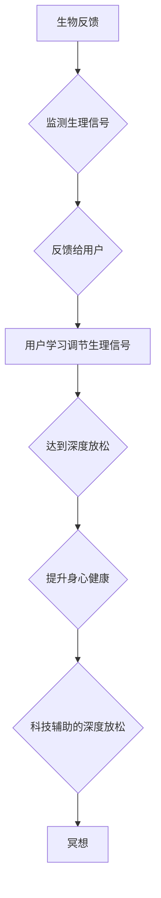

                 

## 生物反馈冥想创业：科技辅助的深度放松

> 关键词：生物反馈、冥想、深度放松、人工智能、神经科学、创业、科技辅助

## 1. 背景介绍

在当今快节奏的生活中，压力、焦虑和睡眠问题已成为普遍困扰。人们日益寻求有效的方法来缓解压力，提升专注力和改善身心健康。冥想作为一种古老的修行方式，近年来逐渐受到大众的关注，其在减轻压力、提高情绪调节能力、增强专注力等方面的益处得到越来越多的科学研究证实。

然而，传统的冥想方法对初学者来说可能难以掌握，需要长时间的练习和经验积累。而生物反馈技术则为冥想提供了新的可能性，通过实时监测身体生理信号，为用户提供反馈，帮助他们更好地理解和控制自己的身心状态，从而提升冥想效率和效果。

## 2. 核心概念与联系

### 2.1 生物反馈

生物反馈 (Biofeedback) 是一种通过技术手段实时监测身体生理信号，并将其反馈给用户，帮助用户了解和控制自身生理功能的技术。常见的生理信号包括心率、血压、皮肤电导、脑电波等。通过训练和练习，用户可以学习调节这些生理信号，从而达到放松、减压、改善睡眠等目的。

### 2.2 冥想

冥想是一种古老的修行方式，通过专注于呼吸、身体感觉或精神念想，达到平静心神、提升专注力和自我觉察的目的。冥想可以分为多种类型，例如正念冥想、专注冥想、慈悲冥想等。

### 2.3 科技辅助的深度放松

科技辅助的深度放松是指利用生物反馈技术、人工智能等技术手段，为用户提供个性化、智能化的深度放松体验。通过实时监测用户生理状态，智能算法可以根据用户的需求和状态，提供相应的放松指导、音乐、声音等，帮助用户更快、更有效地进入深度放松状态。

**核心概念与联系流程图**



## 3. 核心算法原理 & 具体操作步骤

### 3.1 算法原理概述

科技辅助的深度放松通常基于以下核心算法：

* **信号处理算法:** 用于从生物信号中提取有用的信息，例如心率变异性、脑电波频率等。
* **机器学习算法:** 用于分析用户生理信号的模式，识别用户的情绪状态和放松程度，并根据用户的需求提供个性化的放松指导。
* **音频/视频生成算法:** 用于根据用户的生理状态和需求，生成相应的放松音乐、声音、图像等。

### 3.2 算法步骤详解

1. **数据采集:** 使用生物传感器采集用户的生理信号，例如心率、血压、皮肤电导、脑电波等。
2. **信号预处理:** 对采集到的生理信号进行滤波、去噪等处理，去除无关信息，提取有用的信号特征。
3. **特征提取:** 使用信号处理算法提取生理信号的特征，例如心率变异性、脑电波频率等。
4. **状态识别:** 使用机器学习算法分析用户的生理信号特征，识别用户的当前情绪状态和放松程度。
5. **个性化放松指导:** 根据用户的生理状态和需求，生成相应的放松音乐、声音、图像等，并提供个性化的放松指导。
6. **反馈与交互:** 将放松指导反馈给用户，并根据用户的反馈进行调整，优化放松体验。

### 3.3 算法优缺点

**优点:**

* **个性化:** 可以根据用户的生理状态和需求提供个性化的放松指导。
* **智能化:** 可以自动识别用户的放松程度，并根据需要调整放松强度。
* **有效性:** 科学研究表明，生物反馈技术可以有效地缓解压力、改善睡眠和提升专注力。

**缺点:**

* **成本:** 生物传感器和相关软件的成本相对较高。
* **技术门槛:** 需要一定的技术知识和经验来开发和应用生物反馈技术。
* **用户接受度:** 一些用户可能对生物反馈技术感到陌生或不信任。

### 3.4 算法应用领域

* **医疗保健:** 用于治疗焦虑、抑郁、睡眠障碍等心理健康问题。
* **教育培训:** 用于提高学生注意力、学习效率和情绪调节能力。
* **企业管理:** 用于缓解员工压力、提高工作效率和团队协作能力。
* **个人健康管理:** 用于帮助用户了解和控制自己的身心状态，提升生活质量。

## 4. 数学模型和公式 & 详细讲解 & 举例说明

### 4.1 数学模型构建

生物反馈技术中常用的数学模型包括：

* **ARIMA模型:** 用于预测生理信号的时间序列，例如心率变化。
* **支持向量机 (SVM):** 用于分类用户的情绪状态，例如放松、焦虑、兴奋等。
* **神经网络:** 用于学习用户生理信号的复杂模式，并提供更精准的放松指导。

### 4.2 公式推导过程

由于篇幅限制，这里只列举ARIMA模型的基本公式：

* **ARIMA(p,d,q)模型:**

$$
y_t = c + \sum_{i=1}^{p} \phi_i y_{t-i} + \sum_{j=1}^{q} \theta_j \epsilon_{t-j} + \epsilon_t
$$

其中：

* $y_t$ 是时间t的观测值。
* $c$ 是常数项。
* $\phi_i$ 是自回归系数。
* $\theta_j$ 是移动平均系数。
* $\epsilon_t$ 是白噪声。

### 4.3 案例分析与讲解

例如，可以使用ARIMA模型预测用户的心率变化，并根据预测结果提供相应的放松指导。当用户的心率偏高时，可以播放舒缓的音乐或引导用户进行深呼吸练习，帮助降低心率。

## 5. 项目实践：代码实例和详细解释说明

### 5.1 开发环境搭建

* **操作系统:** Windows/macOS/Linux
* **编程语言:** Python
* **库:** NumPy, Pandas, Scikit-learn, TensorFlow/PyTorch
* **硬件:** 生物传感器 (例如心率传感器、脑电波传感器)

### 5.2 源代码详细实现

由于篇幅限制，这里只提供一个简单的Python代码示例，用于读取心率数据并进行简单的分析：

```python
import numpy as np
import matplotlib.pyplot as plt

# 读取心率数据
heart_rate_data = np.loadtxt("heart_rate.csv", delimiter=",")

# 计算心率平均值和标准差
mean_heart_rate = np.mean(heart_rate_data)
std_heart_rate = np.std(heart_rate_data)

# 绘制心率变化曲线
plt.plot(heart_rate_data)
plt.xlabel("时间")
plt.ylabel("心率 (bpm)")
plt.title("心率变化曲线")
plt.show()

# 打印心率统计信息
print("平均心率:", mean_heart_rate, "bpm")
print("标准差:", std_heart_rate, "bpm")
```

### 5.3 代码解读与分析

* 该代码首先使用NumPy库读取心率数据，然后使用NumPy库的内置函数计算心率的平均值和标准差。
* 最后，使用Matplotlib库绘制心率变化曲线，并打印心率统计信息。

### 5.4 运行结果展示

运行该代码后，将生成一个心率变化曲线图，并打印出心率的平均值和标准差。

## 6. 实际应用场景

* **冥想App:** 开发一款结合生物反馈技术的冥想App，帮助用户更好地掌握冥想技巧，提升冥想效果。
* **压力管理工具:** 开发一款压力管理工具，实时监测用户的生理信号，并提供相应的放松指导，帮助用户缓解压力和焦虑。
* **睡眠改善设备:** 开发一款睡眠改善设备，通过监测用户的脑电波和心率，提供个性化的睡眠指导，帮助用户改善睡眠质量。

### 6.4 未来应用展望

随着生物反馈技术和人工智能技术的不断发展，科技辅助的深度放松将有更广泛的应用场景，例如：

* **远程医疗:** 用于远程监测患者的生理状态，并提供个性化的治疗方案。
* **教育培训:** 用于评估学生的注意力和学习状态，并提供个性化的学习指导。
* **体育训练:** 用于监测运动员的生理状态，并提供个性化的训练方案。

## 7. 工具和资源推荐

### 7.1 学习资源推荐

* **书籍:**

    * 《生物反馈：原理与应用》
    * 《深度学习》
    * 《机器学习》

* **在线课程:**

    * Coursera: 生物反馈与神经科学
    * edX: 深度学习
    * Udacity: 机器学习工程师

### 7.2 开发工具推荐

* **Python:** 广泛应用于数据分析、机器学习和人工智能领域。
* **NumPy:** 用于数值计算和数组操作。
* **Pandas:** 用于数据分析和处理。
* **Scikit-learn:** 用于机器学习算法的实现。
* **TensorFlow/PyTorch:** 用于深度学习模型的开发。

### 7.3 相关论文推荐

* **生物反馈与冥想的结合:**

    * "Biofeedback and Meditation: A Review of the Literature"
    * "The Effects of Biofeedback-Assisted Meditation on Stress, Anxiety, and Depression"

* **深度学习在生物反馈中的应用:**

    * "Deep Learning for Biofeedback-Based Stress Management"
    * "A Deep Learning Approach to Personalized Biofeedback"

## 8. 总结：未来发展趋势与挑战

### 8.1 研究成果总结

科技辅助的深度放松技术在缓解压力、改善睡眠和提升专注力方面取得了显著的成果。生物反馈技术和人工智能技术的结合，为用户提供了更个性化、更智能化的深度放松体验。

### 8.2 未来发展趋势

* **更精准的生理信号监测:** 开发更先进的生物传感器，能够更精准地监测用户的生理信号。
* **更智能的放松指导:** 利用人工智能技术，开发更智能的放松指导系统，能够根据用户的生理状态和需求提供更个性化的指导。
* **更丰富的放松体验:** 开发更丰富的放松体验，例如虚拟现实冥想、增强现实冥想等。

### 8.3 面临的挑战

* **技术挑战:** 开发更精准的生物传感器和更智能的放松指导系统仍然面临技术挑战。
* **数据安全挑战:** 用户的生理数据是敏感信息，需要采取有效的措施保障数据安全。
* **用户接受度挑战:** 一些用户可能对生物反馈技术感到陌生或不信任，需要进行有效的宣传和教育。

### 8.4 研究展望

未来，科技辅助的深度放松技术将继续发展，为人们提供更有效、更便捷、更个性化的深度放松体验，帮助人们更好地应对压力、改善身心健康，提升生活质量。

## 9. 附录：常见问题与解答

* **Q: 生物反馈技术安全吗？**

A: 生物反馈技术是安全的，不会对人体造成任何伤害。

* **Q: 我需要购买昂贵的设备才能使用生物反馈技术吗？**

A: 不一定，现在市面上有一些价格相对亲民的生物反馈设备。

* **Q: 如何选择适合自己的生物反馈技术？**

A: 选择生物反馈技术时，需要考虑自己的需求、预算和使用场景。

* **Q: 生物反馈技术真的有效吗？**

A: 科学研究表明，生物反馈技术可以有效地缓解压力、改善睡眠和提升专注力。


作者：禅与计算机程序设计艺术 / Zen and the Art of Computer Programming 
<end_of_turn>

