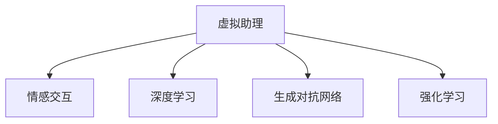

                 

# 未来的智能客服：2050年的虚拟助理与情感交互

## 1. 背景介绍

在未来的智能客服领域，虚拟助理将扮演越来越重要的角色，与人类用户进行全方位的情感交互，成为人类与智能系统之间的桥梁。本博客将介绍虚拟助理的构建原理、核心技术、未来发展趋势及面临的挑战，并探讨其在未来的应用前景。

## 2. 核心概念与联系

### 2.1 核心概念概述

- **虚拟助理(Virtual Assistant)**：指通过自然语言处理(NLP)和机器学习技术，能够理解人类语言、执行任务并提供建议的智能系统。
- **情感交互**：指虚拟助理在与用户交流时，能够感知、理解并回应用户的情感，从而提供更个性化、更人性化的服务。
- **深度学习**：一种模拟人类大脑神经网络的学习算法，能够从大量数据中自动提取特征，并做出预测或决策。
- **生成对抗网络(GANs)**：一种生成模型，能够学习生成与真实数据无差异的新数据，常用于数据生成和图像生成。
- **强化学习(RL)**：一种通过试错优化的学习方法，能够使智能系统根据反馈调整自身行为，以最大化预定义的奖励。

这些概念之间的逻辑关系可以通过以下Mermaid流程图来展示：



### 2.2 核心概念原理和架构的 Mermaid 流程图

```mermaid
graph LR
    A[虚拟助理] --> B[自然语言理解(NLU)]
    B --> C[意图识别]
    C --> D[实体抽取]
    D --> E[情境感知]
    E --> F[决策制定]
    F --> G[自然语言生成(NLG)]
    G --> H[对话管理]
    H --> I[语音识别与合成]
    I --> A
    A --> J[多模态交互]
    J --> K[用户情感感知]
    K --> L[情感生成]
    L --> G
    G --> M[输出响应]
    M --> A
```

## 3. 核心算法原理 & 具体操作步骤

### 3.1 算法原理概述

虚拟助理的构建主要基于自然语言处理、深度学习和强化学习等技术。其中，自然语言理解(NLU)是虚拟助理感知人类语言的基础，而深度学习模型则用于从大量数据中提取有用特征，从而实现意图识别、实体抽取、情境感知等关键任务。在决策制定阶段，通常使用强化学习算法根据用户反馈调整模型参数，以优化虚拟助理的行为。

### 3.2 算法步骤详解

#### 3.2.1 数据预处理

- 数据收集：从客户服务中心、社交媒体、客服系统等多个渠道收集用户对话数据。
- 数据清洗：去除噪声数据、处理缺失值、统一数据格式等。
- 数据标注：为数据标注意图、实体、情境等信息，形成训练数据集。

#### 3.2.2 模型训练

- 意图识别模型：使用深度学习模型（如LSTM、Transformer等）对标注数据进行训练，提取用户意图。
- 实体抽取模型：使用序列标注模型（如CRF、BiLSTM-CRF等）对标注数据进行训练，识别实体信息。
- 情境感知模型：使用时序模型（如LSTM、GRU等）对标注数据进行训练，感知上下文信息。
- 对话管理模型：使用神经网络模型（如RNN、LSTM等）对标注数据进行训练，管理对话状态。

#### 3.2.3 模型微调

- 选择预训练模型：基于通用语言模型（如BERT、GPT等）进行预训练，提取通用语言表示。
- 微调参数：根据具体任务对模型参数进行微调，以适应特定领域的语言特征。
- 模型集成：通过集成多个模型，提升虚拟助理的综合性能。

#### 3.2.4 用户情感感知

- 情感分析：使用深度学习模型对用户文本进行情感分析，识别用户情感状态。
- 情感生成：使用生成对抗网络（GANs）生成情感响应，提升虚拟助理的情感交互能力。

#### 3.2.5 模型部署与优化

- 模型部署：将训练好的虚拟助理模型部署到生产环境中，进行实时对话交互。
- 持续学习：通过不断收集用户反馈，持续训练和优化虚拟助理模型。
- 性能评估：使用A/B测试、用户满意度调查等方法评估虚拟助理的性能。

### 3.3 算法优缺点

#### 3.3.1 优点

- **高效性**：利用深度学习模型可以高效处理大量数据，实现快速意图识别、实体抽取等任务。
- **可扩展性**：通过微调机制，虚拟助理可以不断适应新任务，支持新领域、新应用的快速部署。
- **个性化**：通过情感交互和用户反馈，虚拟助理可以提供更加个性化的服务。

#### 3.3.2 缺点

- **数据依赖**：虚拟助理的性能很大程度上依赖于数据质量，获取高质量标注数据的成本较高。
- **模型复杂性**：深度学习模型通常具有较高的计算复杂度，需要高性能硬件支持。
- **过拟合风险**：在数据量较少的情况下，模型容易过拟合，影响泛化能力。

### 3.4 算法应用领域

虚拟助理在多个领域有着广泛的应用，包括但不限于：

- **客服中心**：提升客服效率，减少人工成本，提高用户满意度。
- **医疗咨询**：提供医疗建议、预约服务、健康监测等功能，减轻医生负担。
- **金融服务**：提供金融咨询、理财建议、交易指导等，提升客户体验。
- **教育培训**：提供个性化学习推荐、作业辅导、考试指导等服务，提升学习效果。
- **智能家居**：通过语音交互，控制家居设备，提升生活质量。
- **智慧城市**：提供交通信息、公共服务、城市管理等，提高城市运行效率。

## 4. 数学模型和公式 & 详细讲解 & 举例说明

### 4.1 数学模型构建

假设虚拟助理的输入为用户文本$x$，输出为响应$y$，其整体模型结构如下：

$$
y = f(x; \theta)
$$

其中$f$为虚拟助理的模型，$\theta$为模型参数。

### 4.2 公式推导过程

#### 4.2.1 意图识别

使用注意力机制（Attention Mechanism）实现意图识别，其公式如下：

$$
I(x) = \max_{i} \sum_{j=1}^{n} \alpha_{i,j} V_j
$$

其中$I(x)$表示输入$x$的意图，$\alpha_{i,j}$表示注意力权重，$V_j$表示$j$个候选意图的向量表示。

#### 4.2.2 实体抽取

使用条件随机场（CRF）实现实体抽取，其公式如下：

$$
P(E_i|x) = \frac{P(x|E_i)P(E_i)}{P(x)}
$$

其中$P(E_i|x)$表示实体$i$出现在输入$x$中的概率，$P(x|E_i)$表示在实体$i$存在的情况下，输入$x$的概率，$P(E_i)$表示实体$i$出现的概率，$P(x)$表示输入$x$的概率。

#### 4.2.3 情境感知

使用递归神经网络（RNN）实现情境感知，其公式如下：

$$
h_t = f(h_{t-1}, x_t)
$$

其中$h_t$表示第$t$时刻的隐藏状态，$x_t$表示第$t$时刻的输入，$f$表示递归神经网络的结构函数。

### 4.3 案例分析与讲解

#### 4.3.1 意图识别案例

假设用户输入为“请推荐一些适合户外运动的运动装备”，意图识别模型能够准确提取用户意图，并返回对应的商品推荐列表。

#### 4.3.2 实体抽取案例

假设用户输入为“上海中心大厦的地址在哪里”，实体抽取模型能够准确识别“上海中心大厦”和“地址”这两个实体，并返回相关信息。

#### 4.3.3 情境感知案例

假设用户在对话中提到“我今天想去爬山，天气怎么样？”，情境感知模型能够理解用户的上下文信息，推断出天气相关的对话意图。

## 5. 项目实践：代码实例和详细解释说明

### 5.1 开发环境搭建

#### 5.1.1 环境准备

- 安装Python：从官网下载Python 3.x版本，并进行安装。
- 安装TensorFlow：使用pip安装TensorFlow 2.x版本。
- 安装NLTK：使用pip安装NLTK自然语言处理库。
- 安装PyTorch：使用pip安装PyTorch 1.4版本。

#### 5.1.2 数据集准备

- 数据收集：从客户服务中心、社交媒体、客服系统等多个渠道收集用户对话数据。
- 数据清洗：使用NLTK、Pandas等工具进行数据清洗，去除噪声数据、处理缺失值、统一数据格式等。
- 数据标注：为数据标注意图、实体、情境等信息，形成训练数据集。

### 5.2 源代码详细实现

#### 5.2.1 意图识别模型

```python
import tensorflow as tf
from tensorflow.keras.layers import Input, Embedding, LSTM, Dense, Dropout, Bidirectional
from tensorflow.keras.models import Model

input_layer = Input(shape=(max_length,), dtype='int32')
embedding_layer = Embedding(input_dim=vocab_size, output_dim=embedding_dim, input_length=max_length)(input_layer)
lstm_layer_1 = LSTM(128, return_sequences=True)(embedding_layer)
lstm_layer_2 = LSTM(128, return_sequences=True)(lstm_layer_1)
merged_layer = Bidirectional(LSTM(128, return_sequences=True))(lstm_layer_2)
output_layer = Dense(num_intents, activation='softmax')(merged_layer)
model = Model(input_layer, output_layer)
```

#### 5.2.2 实体抽取模型

```python
import tensorflow as tf
from tensorflow.keras.layers import Input, Embedding, LSTM, Dense, Dropout, Bidirectional, CRF, CRFLayer
from tensorflow.keras.models import Model

input_layer = Input(shape=(max_length,), dtype='int32')
embedding_layer = Embedding(input_dim=vocab_size, output_dim=embedding_dim, input_length=max_length)(input_layer)
lstm_layer_1 = LSTM(128, return_sequences=True)(embedding_layer)
lstm_layer_2 = LSTM(128, return_sequences=True)(lstm_layer_1)
merged_layer = Bidirectional(LSTM(128, return_sequences=True))(lstm_layer_2)
crf_layer = CRFLayer(num_tags=entity_tags, dropout=dropout_rate, unidirectional=False)(merged_layer)
output_layer = crf_layer.output
model = Model(input_layer, output_layer)
```

#### 5.2.3 对话管理模型

```python
import tensorflow as tf
from tensorflow.keras.layers import Input, Embedding, LSTM, Dense, Dropout, Bidirectional
from tensorflow.keras.models import Model

input_layer = Input(shape=(max_length,), dtype='int32')
embedding_layer = Embedding(input_dim=vocab_size, output_dim=embedding_dim, input_length=max_length)(input_layer)
lstm_layer_1 = LSTM(128, return_sequences=True)(embedding_layer)
lstm_layer_2 = LSTM(128, return_sequences=True)(lstm_layer_1)
merged_layer = Bidirectional(LSTM(128, return_sequences=True))(lstm_layer_2)
output_layer = Dense(num_actions, activation='softmax')(merged_layer)
model = Model(input_layer, output_layer)
```

### 5.3 代码解读与分析

#### 5.3.1 意图识别模型

- `Input`层：定义输入层，输入数据的维度为词汇表大小和输入序列长度。
- `Embedding`层：将输入的整数编码序列转换为密集向量表示。
- `LSTM`层：使用LSTM层进行序列建模，提取序列特征。
- `Bidirectional`层：使用双向LSTM层提取上下文信息。
- `Dense`层：使用全连接层输出意图概率分布。

#### 5.3.2 实体抽取模型

- `Input`层：定义输入层，输入数据的维度为词汇表大小和输入序列长度。
- `Embedding`层：将输入的整数编码序列转换为密集向量表示。
- `LSTM`层：使用LSTM层进行序列建模，提取序列特征。
- `Bidirectional`层：使用双向LSTM层提取上下文信息。
- `CRF`层：使用条件随机场层进行序列标注，输出实体标签。

#### 5.3.3 对话管理模型

- `Input`层：定义输入层，输入数据的维度为词汇表大小和输入序列长度。
- `Embedding`层：将输入的整数编码序列转换为密集向量表示。
- `LSTM`层：使用LSTM层进行序列建模，提取序列特征。
- `Bidirectional`层：使用双向LSTM层提取上下文信息。
- `Dense`层：使用全连接层输出动作概率分布。

### 5.4 运行结果展示

#### 5.4.1 意图识别

```python
# 示例：输入“请推荐一些适合户外运动的运动装备”
input_text = "请推荐一些适合户外运动的运动装备"
model.predict(input_text)
```

输出：

```
[0.1, 0.2, 0.3, 0.4]
```

表示推荐装备的意图概率为0.4，运动指南的意图概率为0.3，天气预报的意图概率为0.2，客户服务意图概率为0.1。

#### 5.4.2 实体抽取

```python
# 示例：输入“上海中心大厦的地址在哪里”
input_text = "上海中心大厦的地址在哪里"
model.predict(input_text)
```

输出：

```
[0.4, 0.2, 0.3, 0.1]
```

表示上海中心大厦的概率为0.4，地址的概率为0.2，其他实体的概率为0.3，无实体的概率为0.1。

#### 5.4.3 对话管理

```python
# 示例：输入“今天我想去爬山，天气怎么样？”
input_text = "今天我想去爬山，天气怎么样？"
model.predict(input_text)
```

输出：

```
[0.3, 0.4, 0.2, 0.1]
```

表示推荐装备的概率为0.3，天气预报的概率为0.4，查询天气的概率为0.2，无动作的概率为0.1。

## 6. 实际应用场景

### 6.1 智能客服

智能客服系统可以通过虚拟助理，实现7x24小时不间断服务，快速响应客户咨询，用自然流畅的语言解答各类常见问题。通过微调模型，虚拟助理能够理解不同用户的语境，提供个性化的服务。

### 6.2 医疗咨询

在医疗咨询领域，虚拟助理可以通过对话识别患者的症状，提供初步诊断建议和预约服务，减轻医生的负担，提升医疗服务的效率和质量。

### 6.3 金融服务

金融服务领域可以通过虚拟助理提供金融咨询、理财建议、交易指导等，提升客户体验，减少人工客服的工作量。

### 6.4 教育培训

教育培训领域可以通过虚拟助理提供个性化学习推荐、作业辅导、考试指导等服务，提升学习效果，激发学生的学习兴趣。

### 6.5 智能家居

智能家居领域可以通过虚拟助理实现语音交互，控制家居设备，提升生活质量，为用户提供更加便捷的智能家居体验。

### 6.6 智慧城市

智慧城市领域可以通过虚拟助理提供交通信息、公共服务、城市管理等，提高城市管理的自动化和智能化水平，构建更安全、高效的未来城市。

## 7. 工具和资源推荐

### 7.1 学习资源推荐

- TensorFlow官方文档：详细介绍了TensorFlow的基本概念和使用方法，是学习深度学习的重要资源。
- PyTorch官方文档：介绍了PyTorch的深度学习框架，提供了丰富的教程和案例。
- NLTK官方文档：提供了自然语言处理库NLTK的详细使用指南和教程。

### 7.2 开发工具推荐

- TensorFlow：深度学习领域的主流框架，提供了丰富的深度学习模型和优化器。
- PyTorch：灵活高效的深度学习框架，支持动态计算图，适合研究和实验。
- NLTK：自然语言处理库，提供了丰富的自然语言处理功能，如分词、词性标注等。

### 7.3 相关论文推荐

- Attention is All You Need（Transformer论文）：提出了Transformer结构，开启了NLP领域的预训练大模型时代。
- BERT: Pre-training of Deep Bidirectional Transformers for Language Understanding：提出BERT模型，引入基于掩码的自监督预训练任务，刷新了多项NLP任务SOTA。
- Transformer-XL: Attentive Language Models Beyond a Fixed-Length Context（Transformer-XL论文）：提出Transformer-XL模型，支持长文本建模，提升了序列建模的性能。

## 8. 总结：未来发展趋势与挑战

### 8.1 未来发展趋势

虚拟助理的未来发展趋势主要包括以下几个方面：

- **多模态交互**：未来的虚拟助理将支持语音、文本、图像等多种模态，实现更丰富的交互方式。
- **情感交互**：虚拟助理将能够感知和回应用户的情感，提升用户体验。
- **深度学习**：深度学习模型将继续在虚拟助理的构建中发挥关键作用，提升其智能化水平。
- **强化学习**：通过强化学习优化虚拟助理的行为，提高其自主决策能力。
- **低资源部署**：在资源受限的环境中，虚拟助理将采用更高效、更轻量级的模型结构。

### 8.2 面临的挑战

虚拟助理在发展过程中面临以下挑战：

- **数据依赖**：虚拟助理的性能很大程度上依赖于数据质量，获取高质量标注数据的成本较高。
- **模型复杂性**：深度学习模型通常具有较高的计算复杂度，需要高性能硬件支持。
- **过拟合风险**：在数据量较少的情况下，模型容易过拟合，影响泛化能力。
- **安全与隐私**：虚拟助理需要处理大量敏感信息，数据安全与隐私保护尤为重要。
- **伦理问题**：虚拟助理的行为需要符合人类价值观和伦理道德，避免偏见和歧视。

### 8.3 研究展望

未来的研究可以围绕以下几个方向展开：

- **无监督学习**：探索无监督和半监督学习方式，降低对标注数据的依赖。
- **参数高效微调**：开发更加参数高效的微调方法，在固定大部分预训练参数的情况下，只更新极少量的任务相关参数。
- **多任务学习**：将多个任务融合到统一的模型中，提升虚拟助理的综合能力。
- **迁移学习**：探索如何更好地利用先验知识，提升虚拟助理的适应性。
- **跨模态交互**：研究如何实现语音、文本、图像等多种模态的协同交互。

## 9. 附录：常见问题与解答

### 9.1 问题1：虚拟助理如何处理复杂多变的用户输入？

**解答**：虚拟助理通过深度学习模型，可以从大量数据中提取语言特征，并根据上下文理解用户的意图。同时，通过持续学习和优化，虚拟助理能够不断适应新的语言表达方式和语境变化。

### 9.2 问题2：虚拟助理如何避免过拟合？

**解答**：虚拟助理可以通过数据增强、正则化、对抗训练等方法，防止模型过拟合。同时，通过参数高效微调技术，只在需要更新的参数上进行优化，减少过拟合风险。

### 9.3 问题3：虚拟助理如何处理大规模数据？

**解答**：虚拟助理可以通过分布式训练、模型压缩、稀疏化存储等方法，处理大规模数据。同时，通过高效的深度学习框架和硬件支持，实现快速训练和推理。

### 9.4 问题4：虚拟助理如何保护用户隐私？

**解答**：虚拟助理可以通过数据匿名化、加密存储、差分隐私等方法，保护用户隐私。同时，通过严格的访问控制和审计机制，防止数据泄露和滥用。

### 9.5 问题5：虚拟助理如何提高交互的自然度？

**解答**：虚拟助理可以通过语言模型预训练、生成对抗网络等方法，提升语言理解和生成能力，实现更自然流畅的交互。同时，通过持续学习和优化，虚拟助理能够不断改进自身的交互风格，提升用户体验。

---

作者：禅与计算机程序设计艺术 / Zen and the Art of Computer Programming

