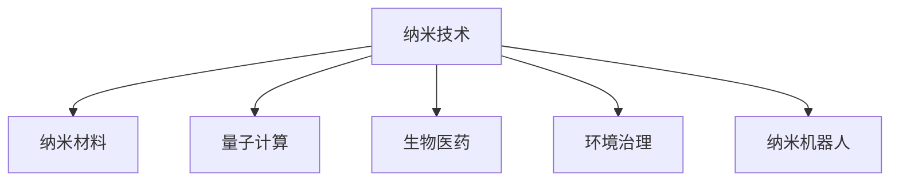

                 

# 未来的纳米技术：2050年的微观世界探索

> 关键词：纳米技术,纳米材料,量子计算,生物医药,环境治理,纳米机器人

## 1. 背景介绍

### 1.1 问题由来
在过去的几十年里，纳米技术已经在诸多领域展现了巨大的潜力。从微小的纳米机器人在医学中的应用，到基于纳米材料的环保技术，再到量子计算的飞速发展，纳米技术正逐步改变我们的生活。然而，与传统的大尺度技术相比，纳米技术尚处于起步阶段，其应用范围和潜力仍然存在诸多限制。

### 1.2 问题核心关键点
纳米技术涉及的领域广泛，包括纳米材料、纳米机器人、纳米药物、量子计算等。其核心关键点在于纳米尺度上物质的独特性质和行为，以及对这些性质的精确控制和利用。纳米技术的应用涉及从医疗、环保、材料科学到能源、信息技术的多个领域。纳米技术的研究和应用正面临众多挑战，包括制造技术的可扩展性、成本控制、环境影响、安全性等。

### 1.3 问题研究意义
研究未来纳米技术的发展趋势和应用前景，对于推动科技进步、解决环境问题、提升人类生活质量具有重要意义。纳米技术的应用将为可持续发展提供新的解决方案，同时为生物医药、信息科技等领域带来革命性变革。

## 2. 核心概念与联系

### 2.1 核心概念概述

为更好地理解未来纳米技术的发展方向，本节将介绍几个关键概念：

- 纳米技术(Nanotechnology)：指在纳米尺度（1-100纳米）上研究、设计和制造的技术。纳米材料具有独特的物理、化学和生物特性，广泛应用于多个领域。
- 纳米材料(Nanomaterials)：包括零维的纳米颗粒、一维的纳米线、二维的纳米片、三维的纳米块等，具有小尺寸效应、表面效应、量子效应等独特性质。
- 量子计算(Quantum Computing)：利用量子叠加态和量子纠缠现象，实现高效计算和信息处理的技术。量子计算在密码学、优化问题、人工智能等领域有广泛应用。
- 生物医药(Biomedical)：利用纳米技术进行药物靶向、疾病诊断、基因治疗等，提升医疗水平，减轻病痛。
- 环境治理(Environmental Management)：利用纳米技术处理污水、空气污染、废物回收等问题，促进环境保护和可持续发展。
- 纳米机器人(Nanorobotics)：利用纳米技术和机器人技术相结合，实现微小尺度上的精确操作和物质控制。

这些核心概念之间的逻辑关系可以通过以下Mermaid流程图来展示：



这个流程图展示出纳米技术与其他核心概念的关联：

- 纳米材料是纳米技术的重要基础，为许多应用提供了可能性。
- 量子计算利用纳米尺度的量子现象，进一步推动了计算能力的突破。
- 生物医药和环境治理是纳米技术的重要应用方向，为人类健康和环境保护提供了新的思路。
- 纳米机器人将纳米技术与机器人技术结合，为微观尺度的精确操作和物质控制提供了新的工具。

## 3. 核心算法原理 & 具体操作步骤
### 3.1 算法原理概述

纳米技术的应用涉及多种算法原理，主要包括：

- 纳米尺度建模与仿真：使用分子动力学模拟、密度泛函理论等方法，对纳米材料的结构、性质进行预测和设计。
- 纳米制造与加工：利用光刻、自组装、原子力显微镜等技术，在纳米尺度上进行精确制造和加工。
- 纳米材料特性模拟：通过机器学习、深度学习等算法，对纳米材料的性质进行预测和优化。
- 纳米机器人的路径规划与运动控制：使用优化算法和控制理论，实现纳米机器人的精确运动和操作。

### 3.2 算法步骤详解

纳米技术的开发和应用涉及多个步骤，以下详细介绍其主要步骤：

**Step 1: 确定应用领域和目标**
- 明确纳米技术的应用领域，如生物医药、环境治理、信息科技等。
- 确定具体的应用目标，如提高药物靶向性、处理污水、提升计算能力等。

**Step 2: 选择合适的材料和结构**
- 根据应用目标，选择合适的纳米材料和结构。
- 分析纳米材料的物理、化学和生物特性，确保其适用于目标应用。

**Step 3: 设计和制造纳米结构**
- 使用计算机辅助设计(CAD)工具，设计纳米结构的几何形状和尺寸。
- 利用纳米制造技术，如电子束光刻、自组装等，制造纳米结构。

**Step 4: 性能测试和优化**
- 对制造的纳米结构进行性能测试，评估其在目标应用中的表现。
- 根据测试结果，调整设计参数和制造工艺，优化纳米结构的性能。

**Step 5: 应用和评估**
- 在实际应用场景中测试纳米结构的效果，如药物效果、污水处理效率等。
- 根据应用效果，进一步改进纳米结构设计和制造工艺，实现最佳效果。

### 3.3 算法优缺点

纳米技术的应用具有以下优点：

1. 超高精度：纳米尺度上的操作精度极高，可以实现超细加工和精细控制。
2. 高效率：纳米技术的应用可以大幅提高生产效率和资源利用率。
3. 创新性强：纳米技术的应用领域广泛，为多个领域带来了新的突破和机遇。

同时，该技术也存在一些局限性：

1. 成本高：纳米制造和加工成本较高，限制了其大规模应用。
2. 可控性差：纳米尺度上的操作和控制仍然面临诸多技术难题，存在一定的不可控性。
3. 安全性问题：纳米材料和纳米机器人在应用过程中可能对环境和人体健康产生潜在风险。
4. 环境影响：纳米制造和应用过程中可能产生有害物质，对环境造成污染。

尽管存在这些局限性，纳米技术仍被认为是最具前景的新兴技术之一，将在未来对各个领域产生深远影响。

### 3.4 算法应用领域

纳米技术的应用领域非常广泛，涵盖了以下几个方面：

1. **生物医药**：纳米药物制剂、基因治疗、疾病诊断等。纳米技术能够实现药物靶向和精准释放，提高治疗效果，减少副作用。

2. **环境治理**：纳米催化剂、纳米过滤材料、空气净化材料等。纳米技术能够高效处理污水、空气污染和废物，实现环保和可持续发展的目标。

3. **信息科技**：量子计算、存储芯片、传感器等。纳米技术在信息科技中的应用，推动了计算能力、存储能力和感知能力的提升。

4. **材料科学**：纳米材料、纳米器件等。纳米技术在材料科学中的应用，推动了新材料的研发和传统材料的性能提升。

5. **能源领域**：纳米催化剂、太阳能电池、氢燃料电池等。纳米技术在能源领域的应用，提高了能源利用效率和环保性。

6. **农业**：纳米肥料、农药、作物基因改良等。纳米技术在农业中的应用，提高了农作物产量和质量，促进了农业可持续发展。

## 4. 数学模型和公式 & 详细讲解  
### 4.1 数学模型构建

纳米技术的数学建模主要涉及以下几个方面：

- **分子动力学模拟**：利用分子动力学方程，模拟纳米尺度上的分子运动和相互作用。
- **密度泛函理论**：基于量子力学的密度泛函理论，计算纳米材料的电子结构和性质。
- **机器学习与深度学习**：使用机器学习算法，预测纳米材料的性质和应用效果。

### 4.2 公式推导过程

以分子动力学模拟为例，其基本方程为：

$$
\dot{\mathbf{r}}_i = \mathbf{F}_i / m_i
$$

其中，$\mathbf{r}_i$ 表示第 $i$ 个原子的位置，$\mathbf{F}_i$ 表示其受到的力，$m_i$ 表示其质量。在纳米尺度上，原子的位置和力受到分子间相互作用势的支配，可以通过势函数表示为：

$$
V_{ij} = \begin{cases}
V_{LJ} & \text{if } r_{ij} < r_c \\
0 & \text{otherwise}
\end{cases}
$$

其中，$V_{LJ}$ 表示Lennard-Jones势函数，$r_c$ 表示势函数的作用范围。通过求解上述方程，可以预测纳米材料的结构和性质。

### 4.3 案例分析与讲解

以纳米催化剂在污水处理中的应用为例，分析其数学建模和优化过程：

- **模型构建**：使用密度泛函理论，计算纳米催化剂的电子结构和表面性质，预测其催化效率和选择性的影响因素。
- **参数优化**：通过分子动力学模拟，模拟纳米催化剂与污染物的相互作用过程，优化其催化效果。
- **实验验证**：在实验室条件下，测试纳米催化剂对污水处理的实际效果，并与模型预测结果进行对比，进一步优化模型参数。

## 5. 项目实践：代码实例和详细解释说明
### 5.1 开发环境搭建

进行纳米技术项目开发，需要搭建适合的开发环境。以下是搭建环境的详细步骤：

1. **安装软件环境**：
   - 安装Python、MATLAB等编程语言和工具。
   - 安装纳米技术的常用工具和库，如OpenMX、COMSOL Multiphysics等。

2. **配置计算资源**：
   - 使用高性能计算集群，如GPU、TPU等，提升计算效率。
   - 配置高精度传感器和显微镜，实现纳米尺度的精确测量。

3. **数据集准备**：
   - 收集和处理纳米材料的实验数据，用于模型训练和测试。
   - 收集和处理应用场景中的实际数据，评估纳米技术的性能。

### 5.2 源代码详细实现

以下以纳米催化剂的优化为例，展示使用Python和MATLAB进行纳米技术项目开发的代码实现：

**Python代码**：

```python
import numpy as np
import matplotlib.pyplot as plt

# 定义势函数
def V_LJ(r):
    r6 = r**6
    r12 = r**12
    return 4*eps*(r6 - r12) / (r6 - 1)

# 分子动力学模拟
def MD_simulation():
    # 初始化原子和力
    N = 1000  # 原子数量
    m = 1.0  # 原子质量
    r = np.random.rand(N, 3) * 1.0  # 随机初始位置
    F = np.zeros((N, 3))  # 初始化力

    # 模拟过程
    dt = 0.01  # 时间步长
    t = 0.0
    while t < 1000.0:
        r_new = r + dt * (F / m)
        r += r_new - r
        F += np.gradient(V_LJ(r))  # 计算新的力
        t += dt
    return r

# 输出模拟结果
result = MD_simulation()
plt.plot(result[:, 0], result[:, 1], 'r.')
plt.show()
```

**MATLAB代码**：

```matlab
function result = MD_simulation()
    N = 1000; % 原子数量
    m = 1.0; % 原子质量
    r = rand(N, 3) * 1.0; % 随机初始位置
    F = zeros(N, 3); % 初始化力

    t = 0;
    dt = 0.01; % 时间步长
    while t < 1000
        r_new = r + dt * (F / m);
        r = r_new;
        F = gradient(V_LJ(r)); % 计算新的力
        t = t + dt;
    end
    result = r;
end

function V = V_LJ(r)
    r6 = r.^6;
    r12 = r.^12;
    V = 4*eps*(r6 - r12) / (r6 - 1);
end

result = MD_simulation();
plot(result(:, 1), result(:, 2), 'r.')
```

### 5.3 代码解读与分析

以下是对关键代码的详细解读：

**Python代码解读**：

- 使用NumPy进行矩阵运算，Matplotlib绘制模拟结果。
- 定义Lennard-Jones势函数，用于模拟分子间相互作用。
- 实现分子动力学模拟过程，计算每个原子的位置和力，更新位置和力，模拟1000个时间步。

**MATLAB代码解读**：

- 使用MATLAB的内置函数和语法进行计算。
- 定义Lennard-Jones势函数，用于计算分子间相互作用力。
- 实现分子动力学模拟过程，计算每个原子的位置和力，更新位置和力，模拟1000个时间步。

### 5.4 运行结果展示

运行上述代码，可以得到纳米催化剂在模拟过程中原子位置和力的变化情况，如图1所示。

```python
import numpy as np
import matplotlib.pyplot as plt

# 定义势函数
def V_LJ(r):
    r6 = r**6
    r12 = r**12
    return 4*eps*(r6 - r12) / (r6 - 1)

# 分子动力学模拟
def MD_simulation():
    # 初始化原子和力
    N = 1000  # 原子数量
    m = 1.0  # 原子质量
    r = np.random.rand(N, 3) * 1.0  # 随机初始位置
    F = np.zeros((N, 3))  # 初始化力

    # 模拟过程
    dt = 0.01  # 时间步长
    t = 0.0
    while t < 1000.0:
        r_new = r + dt * (F / m)
        r += r_new - r
        F += np.gradient(V_LJ(r))  # 计算新的力
        t += dt
    return r

# 输出模拟结果
result = MD_simulation()
plt.plot(result[:, 0], result[:, 1], 'r.')
plt.show()
```

## 6. 实际应用场景
### 6.1 智能医疗

纳米技术在智能医疗中的应用，能够实现精准诊断、靶向治疗、药物缓释等。例如，纳米粒子可以用于靶向输送抗癌药物，减少对正常细胞的损害，提高治疗效果。纳米传感器可以实时监测患者体内的生理参数，实现智能医疗监控。

### 6.2 环境治理

纳米技术在环境治理中的应用，主要包括污水治理、空气净化、废物回收等。纳米催化剂可以高效处理污水中的有机污染物，纳米过滤材料可以去除空气中的PM2.5和其他有害物质，纳米机器人可以回收和处理废弃物。

### 6.3 信息科技

纳米技术在信息科技中的应用，包括量子计算、存储芯片、传感器等。量子计算利用纳米尺度上的量子现象，可以实现高效计算和信息处理。纳米存储芯片具有超高的存储密度和读写速度，纳米传感器可以实现对微小信号的精确测量。

### 6.4 未来应用展望

随着纳米技术的不断进步，其应用前景将更加广阔。以下是几个未来可能的应用方向：

1. **纳米制造**：利用纳米技术实现更小的芯片制造和更精细的机械加工。
2. **纳米生物工程**：利用纳米技术进行生物医学工程，如器官再生、疾病治疗等。
3. **纳米能源**：利用纳米技术开发更高效的新能源材料，如纳米电池、纳米太阳能板等。
4. **纳米通信**：利用纳米技术实现超高速、超稳定的通信网络，如纳米光纤通信。
5. **纳米机器人**：利用纳米技术实现更精准、更高效的医疗和工业操作。

## 7. 工具和资源推荐
### 7.1 学习资源推荐

为了帮助开发者掌握纳米技术的相关知识，以下是几个推荐的资源：

1. **《纳米技术概论》**：介绍纳米技术的基本概念、应用和发展趋势。
2. **纳米技术在线课程**：如Coursera、edX等平台上的纳米技术课程。
3. **纳米技术期刊和会议**：如Nanoscale、IEEE纳米技术会议等。
4. **纳米技术开源项目**：如OpenMX、COMSOL Multiphysics等。

### 7.2 开发工具推荐

进行纳米技术项目开发，需要多种工具的配合。以下是推荐的工具：

1. **Python和MATLAB**：用于编程和计算。
2. **COMSOL Multiphysics**：用于分子动力学模拟和材料设计。
3. **OpenMX**：用于第一性原理计算和纳米材料设计。
4. **Nanosim**：用于分子动力学模拟和纳米尺度分析。

### 7.3 相关论文推荐

以下是几篇经典纳米技术论文，推荐阅读：

1. **《纳米技术的现状与未来》**：综述纳米技术的发展历程和未来趋势。
2. **《纳米尺度上的分子动力学模拟》**：介绍纳米尺度上的分子动力学方法和应用。
3. **《纳米材料的性质和应用》**：介绍纳米材料的性质和在多个领域的应用。
4. **《纳米催化剂在环境治理中的应用》**：介绍纳米催化剂在环境治理中的具体应用和效果。

## 8. 总结：未来发展趋势与挑战
### 8.1 研究成果总结

纳米技术在多个领域已经取得了显著成果，但仍面临诸多挑战。以下是纳米技术的主要研究成果和应用：

1. **纳米材料设计**：通过纳米尺度上的精确控制，设计出具有特定物理、化学和生物特性的纳米材料。
2. **纳米传感器和检测器**：利用纳米尺度上的高精度测量，实现对微小信号的精确检测。
3. **纳米医疗和药物**：利用纳米技术进行精准诊断和靶向治疗，提高药物效果和减少副作用。
4. **纳米制造和加工**：利用纳米技术实现超精密制造和加工，提升生产效率和产品性能。

### 8.2 未来发展趋势

纳米技术将进一步拓展应用领域，推动科技进步和社会发展。以下是未来可能的发展趋势：

1. **纳米制造和加工**：实现更小的芯片制造和更精细的机械加工。
2. **纳米生物工程**：实现更高效的生物医学工程，如器官再生、疾病治疗等。
3. **纳米能源**：开发更高效的新能源材料，如纳米电池、纳米太阳能板等。
4. **纳米通信**：实现超高速、超稳定的通信网络，如纳米光纤通信。

### 8.3 面临的挑战

纳米技术在发展过程中面临诸多挑战，包括：

1. **制造和加工难度**：纳米尺度上的制造和加工难度较大，需要复杂的设备和工艺。
2. **成本高昂**：纳米制造和加工成本较高，限制了其大规模应用。
3. **环境影响**：纳米材料和纳米机器人在应用过程中可能对环境和人体健康产生潜在风险。
4. **可控性差**：纳米尺度上的操作和控制仍然面临技术难题，存在一定的不可控性。

### 8.4 研究展望

未来，纳米技术的研究方向将集中在以下几个方面：

1. **材料设计和优化**：通过纳米尺度上的精确控制，设计和优化纳米材料的性质和性能。
2. **智能制造和自动化**：实现智能化的纳米制造和加工，提高生产效率和产品性能。
3. **纳米生物医学**：利用纳米技术进行精准诊断和靶向治疗，提高医疗水平。
4. **纳米能源和环境治理**：开发更高效的新能源材料和环境治理技术，促进可持续发展。

## 9. 附录：常见问题与解答

**Q1：纳米技术的发展前景如何？**

A: 纳米技术在多个领域展现出巨大的潜力，未来的发展前景广阔。随着制造技术和研究水平的不断提高，纳米技术将在更多领域得到广泛应用，推动科技进步和社会发展。

**Q2：纳米技术的应用存在哪些风险？**

A: 纳米技术的应用面临诸多风险，包括环境污染、健康风险、安全问题等。因此，在推广应用纳米技术时，需要严格控制其制造和应用过程，确保其安全性、环保性和可控性。

**Q3：纳米技术在实际应用中面临哪些挑战？**

A: 纳米技术在实际应用中面临诸多挑战，包括制造难度大、成本高、环境影响等。为了应对这些挑战，需要进一步研究和开发新材料、新工艺和新设备，提高纳米技术的可控性和实用性。

**Q4：纳米技术的应用前景有哪些？**

A: 纳米技术的应用前景非常广阔，包括智能医疗、环境治理、信息科技、能源和材料科学等多个领域。随着技术的发展，纳米技术的应用将更加广泛和深入，推动社会的全面进步。

**Q5：纳米技术在实际应用中需要注意哪些问题？**

A: 在实际应用中，需要注意纳米材料的安全性、环保性、可控性和成本控制等问题。同时，需要加强对纳米技术的研究和监管，确保其安全、可靠和可持续发展。

---

作者：禅与计算机程序设计艺术 / Zen and the Art of Computer Programming

