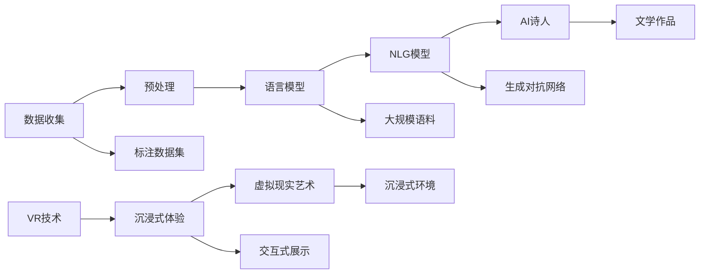

                 

# 未来的艺术创作：2050年的AI诗人与虚拟现实艺术

## 1. 背景介绍

### 1.1 问题的由来
随着人工智能技术的迅猛发展，尤其是深度学习和大数据分析的进步，艺术创作领域也逐渐被AI所渗透。2050年的AI诗人与虚拟现实艺术，将会以全新的姿态，引领艺术创作的未来趋势。AI诗人可以借助强大的语言模型和自然语言生成技术，创作出令人惊叹的文学作品。虚拟现实艺术则可以通过沉浸式交互，让观众沉浸在虚拟的艺术世界中，体验前所未有的艺术表达方式。本文将探讨这些前沿技术背后的原理与实现方法，并展望其未来发展趋势。

### 1.2 问题核心关键点
- AI诗人：通过深度学习模型，生成具有创意和情感的文学作品。
- 虚拟现实艺术：利用虚拟现实技术，创建沉浸式的艺术体验。
- 语言模型：基于自然语言处理(NLP)技术，实现文本生成和情感分析。
- 自然语言生成(NLG)：利用生成对抗网络(GAN)等技术，生成自然流畅的文本。
- 深度学习：基于神经网络架构，进行数据驱动的创作和分析。
- 沉浸式体验：通过虚拟现实(VR)技术，营造真实的艺术环境。

## 2. 核心概念与联系

### 2.1 核心概念概述

为了更好地理解AI诗人和虚拟现实艺术的实现机制，我们首先介绍以下几个核心概念：

- **AI诗人**：指通过机器学习模型自动生成诗歌、小说等文学作品的AI系统。它通常基于语言模型和自然语言生成技术，可以模仿不同诗人的风格，创作出具有创意和情感的作品。
- **语言模型**：指用于统计分析语言数据，以预测给定文本的下一个词或字符的模型。常用的语言模型包括RNN、LSTM和Transformer等。
- **自然语言生成(NLG)**：指将结构化数据转化为自然语言，用于文本生成、对话系统等应用。NLG模型通常结合语言模型和神经网络，能够生成语法正确、语义连贯的文本。
- **虚拟现实艺术**：指通过虚拟现实技术，在计算机生成的三维空间中展示艺术作品，观众可以通过虚拟现实头显等设备，沉浸在虚拟的艺术世界中。
- **深度学习**：指基于神经网络，通过大量数据训练模型，学习到数据的分布规律，进而进行预测、分类、生成等任务。

这些核心概念之间具有紧密的联系，共同构成了AI诗人和虚拟现实艺术的实现基础。

### 2.2 核心概念原理和架构的 Mermaid 流程图(Mermaid 流程节点中不要有括号、逗号等特殊字符)


## 3. 核心算法原理 & 具体操作步骤

### 3.1 算法原理概述

AI诗人和虚拟现实艺术的实现，本质上是通过深度学习和自然语言生成技术，结合虚拟现实技术，将机器生成的作品转化为可交互的艺术体验。其核心算法原理包括以下几个步骤：

1. **数据收集与预处理**：收集文学作品和艺术作品的数据集，并进行清洗、标注等预处理。
2. **语言模型训练**：使用大规模语料库，训练语言模型，捕捉语言的统计规律。
3. **自然语言生成**：结合语言模型和生成对抗网络(GAN)，生成自然流畅的文本，用于创作诗歌、小说等作品。
4. **虚拟现实体验设计**：利用虚拟现实技术，设计沉浸式的艺术展示环境，包括交互式场景、人物、物件等。
5. **作品创作与展示**：将生成的文学作品和艺术作品，通过虚拟现实技术进行展示，让观众沉浸在虚拟的艺术世界中。

### 3.2 算法步骤详解

以下是AI诗人和虚拟现实艺术的详细实现步骤：

**Step 1: 数据收集与预处理**

1. **文学作品数据收集**：收集古诗词、现代诗歌、小说等文学作品，建立标注好的数据集。
2. **艺术作品数据收集**：收集绘画、雕塑、音乐等艺术作品，提取特征并进行标注。
3. **数据清洗与预处理**：清洗数据中的噪声和重复项，标准化文本和图像数据。

**Step 2: 语言模型训练**

1. **模型选择**：选择合适的语言模型架构，如LSTM、GRU或Transformer等。
2. **参数初始化**：设定初始化参数，如词嵌入、隐藏层大小等。
3. **训练过程**：使用标注好的文学作品数据集，训练语言模型。
4. **模型验证**：在验证集上评估模型的性能，调整超参数。

**Step 3: 自然语言生成**

1. **生成对抗网络(GAN)**：结合语言模型和GAN，训练生成模型，学习文本生成规律。
2. **文本生成**：使用训练好的生成模型，生成具有创意和情感的文学作品。
3. **风格迁移**：通过迁移学习，将不同风格的文学作品进行融合，产生新的创作风格。

**Step 4: 虚拟现实体验设计**

1. **虚拟环境设计**：设计虚拟现实场景，包括空间布局、光照效果等。
2. **交互式设计**：设计交互式元素，如语音识别、手势控制等。
3. **多感官融合**：结合视觉、听觉、触觉等多感官体验，提升沉浸感。

**Step 5: 作品创作与展示**

1. **作品创作**：将生成的文学作品和艺术作品，整合到虚拟现实场景中。
2. **作品展示**：通过虚拟现实头显等设备，展示给观众。
3. **互动体验**：观众可以通过交互式元素，参与到作品创作和展示中。

### 3.3 算法优缺点

AI诗人和虚拟现实艺术的主要优点包括：

- **高效创作**：通过自动化创作，可以大幅提升创作效率，节省人力成本。
- **多样性**：生成的文学作品和艺术作品，具有多样性和创新性，突破传统艺术的限制。
- **沉浸式体验**：虚拟现实技术可以提供沉浸式的艺术体验，增强观众的情感共鸣。

然而，该技术也存在一些局限：

- **创造力瓶颈**：AI生成的作品可能缺乏深度和原创性，难以超越人类艺术家的水平。
- **技术壁垒**：实现高水平的AI诗人和虚拟现实艺术，需要高超的技术和大量的数据。
- **伦理问题**：生成的艺术作品可能涉及版权和伦理问题，需要明确知识产权归属。

### 3.4 算法应用领域

AI诗人和虚拟现实艺术的应用领域非常广泛，涵盖以下几个方面：

- **文学创作**：通过AI诗人，自动生成诗歌、小说等文学作品，辅助文学创作。
- **艺术展示**：利用虚拟现实技术，展示绘画、雕塑、音乐等艺术作品，提供沉浸式体验。
- **教育培训**：通过虚拟现实技术，将艺术作品融入教育内容，提高学生艺术素养。
- **游戏设计**：在虚拟现实游戏中，利用AI生成任务和对话，提升游戏互动性。
- **文化传承**：利用AI生成传统文化作品，推广和保护文化遗产。

## 4. 数学模型和公式 & 详细讲解 & 举例说明

### 4.1 数学模型构建

AI诗人和虚拟现实艺术的实现，涉及到多种数学模型，包括语言模型、自然语言生成模型和虚拟现实模型。以下是这些模型的基本构建方式：

**语言模型**：

$$P(x_{t+1}|x_{t}) = \frac{\exp(z(x_{t+1}|x_{t}))}{\sum_{x_{t+1}} \exp(z(x_{t+1}|x_{t}))}$$

其中，$x_t$表示时间步的输入序列，$z$表示模型参数。

**自然语言生成模型**：

$$p_{\theta}(x|y) = \frac{\exp(-KL(P_{\theta}(x|y)||q(x|y))}{p(x|y)}$$

其中，$P_{\theta}(x|y)$表示生成模型，$q(x|y)$表示先验分布。

**虚拟现实模型**：

$$p(x_{t+1}|x_t, z) = \frac{\exp(-V(x_{t+1}, x_t, z))}{\sum_{x_{t+1}} \exp(-V(x_{t+1}, x_t, z))}$$

其中，$x_t$表示时间步的输入序列，$z$表示虚拟现实环境参数，$V$表示能量函数。

### 4.2 公式推导过程

以下是对这些公式的详细推导过程：

**语言模型的推导**：

语言模型用于预测给定文本序列的下一个词的概率。假设有$N$个词汇表，$x_1,...,x_T$表示文本序列，$P(x_{t+1}|x_t)$表示在给定前文$x_t$的条件下，下一个词$x_{t+1}$的条件概率。根据链式法则，可以写出联合概率：

$$P(x_1,...,x_T) = \prod_{t=1}^{T} P(x_t|x_{t-1})$$

通过对数变换，得到：

$$\log P(x_1,...,x_T) = \sum_{t=1}^{T} \log P(x_t|x_{t-1})$$

进一步简化得到：

$$P(x_{t+1}|x_{t}) = \frac{\exp(z(x_{t+1}|x_{t}))}{\sum_{x_{t+1}} \exp(z(x_{t+1}|x_{t}))}$$

**自然语言生成模型的推导**：

自然语言生成模型用于从结构化数据生成自然语言文本。假设有一个结构化数据序列$y$，和对应的生成模型$p_{\theta}(x|y)$，以及先验分布$q(x|y)$。根据生成模型和先验分布的定义，可以写出条件概率：

$$p_{\theta}(x|y) = \frac{p_{\theta}(x,y)}{p(y)}$$

其中，$p_{\theta}(x,y)$表示生成模型和先验分布的联合概率，$p(y)$表示先验概率。根据KL散度，可以写出目标函数：

$$KL(P_{\theta}(x|y)||q(x|y)) = \sum_{x} P_{\theta}(x|y) \log \frac{P_{\theta}(x|y)}{q(x|y)}$$

将条件概率代入目标函数，得到：

$$p_{\theta}(x|y) = \frac{\exp(-KL(P_{\theta}(x|y)||q(x|y))}{p(x|y)}$$

**虚拟现实模型的推导**：

虚拟现实模型用于描述虚拟环境中的物体运动和交互。假设有$N$个物体，$x_t$表示时间步的输入序列，$z$表示虚拟现实环境参数。根据能量的定义，可以写出能量函数：

$$V(x_{t+1}, x_t, z) = \sum_{i=1}^{N} E_i(x_{t+1}, x_t, z)$$

其中，$E_i$表示物体$i$的能量函数。根据能量函数，可以写出条件概率：

$$p(x_{t+1}|x_t, z) = \frac{\exp(-V(x_{t+1}, x_t, z))}{\sum_{x_{t+1}} \exp(-V(x_{t+1}, x_t, z))}$$

### 4.3 案例分析与讲解

以下是几个具体案例的分析：

**案例1: AI生成诗歌**

使用Transformer模型，从大规模文学作品数据集中学习语言规律，通过自然语言生成技术，生成具有创意和情感的诗歌。模型的输入为前文诗句，输出为下一个诗句。例如：

输入：“黄河远上白云间，一片孤城万仞山。”

输出：“羌笛何须怨杨柳，春风不度玉门关。”

**案例2: 虚拟现实艺术展览**

利用虚拟现实技术，设计沉浸式艺术展览，展示绘画、雕塑和音乐作品。观众可以通过虚拟现实头显，进入虚拟艺术馆，与艺术作品互动。例如：

展示一幅绘画作品，观众可以自由旋转和缩放，观察画作细节，甚至可以与虚拟画家的雕塑互动。

## 5. 项目实践：代码实例和详细解释说明

### 5.1 开发环境搭建

在进行AI诗人和虚拟现实艺术的实践前，我们需要准备好开发环境。以下是使用Python和PyTorch进行开发的流程：

1. **安装Python和PyTorch**：在Linux或Windows系统中，可以使用Anaconda安装Python和PyTorch，并创建虚拟环境。
```bash
conda create -n pytorch-env python=3.8 
conda activate pytorch-env
conda install torch torchvision torchaudio
```

2. **安装虚拟现实库**：安装VR库，如OpenXR、OpenVR等，用于实现虚拟现实体验。
```bash
pip install openxr openvr
```

3. **安装机器学习库**：安装机器学习库，如TensorFlow、Keras等，用于训练语言模型和自然语言生成模型。
```bash
pip install tensorflow keras
```

4. **安装自然语言处理库**：安装自然语言处理库，如NLTK、spaCy等，用于文本预处理和分析。
```bash
pip install nltk spacy
```

5. **安装虚拟现实展示库**：安装VR展示库，如VTK、OVR等，用于渲染虚拟现实场景。
```bash
pip install vtk ovr
```

完成上述步骤后，即可在`pytorch-env`环境中开始实践。

### 5.2 源代码详细实现

以下是使用PyTorch实现AI诗人和虚拟现实艺术的代码示例：

**语言模型训练代码**：

```python
import torch
from torch import nn, optim
from torch.nn import functional as F

class LanguageModel(nn.Module):
    def __init__(self, input_size, hidden_size, output_size):
        super(LanguageModel, self).__init__()
        self.rnn = nn.LSTM(input_size, hidden_size, num_layers=2, batch_first=True)
        self.fc = nn.Linear(hidden_size, output_size)
    
    def forward(self, x):
        rnn_output, _ = self.rnn(x)
        logits = self.fc(rnn_output)
        return logits

# 训练过程
def train(model, optimizer, criterion, input, target):
    optimizer.zero_grad()
    output = model(input)
    loss = criterion(output, target)
    loss.backward()
    optimizer.step()
    return loss

# 数据集
class TextDataset(Dataset):
    def __init__(self, texts, seq_length):
        self.texts = texts
        self.seq_length = seq_length
    
    def __len__(self):
        return len(self.texts)
    
    def __getitem__(self, index):
        text = self.texts[index]
        text = [self.tokenizer.word_to_idx[word] for word in text.split()]
        if len(text) < self.seq_length:
            text += [0] * (self.seq_length - len(text))
        else:
            text = text[:self.seq_length]
        input_tensor = torch.tensor(text, dtype=torch.long)
        target_tensor = torch.tensor(text[1:], dtype=torch.long)
        return input_tensor, target_tensor
```

**自然语言生成代码**：

```python
import torch
from torch import nn
from torch.nn import functional as F

class NLGModel(nn.Module):
    def __init__(self, input_size, hidden_size, output_size):
        super(NLGModel, self).__init__()
        self.encoder = nn.GRU(input_size, hidden_size, num_layers=2, batch_first=True)
        self.decoder = nn.GRU(hidden_size, output_size, num_layers=2, batch_first=True)
    
    def forward(self, input, hidden):
        encoder_output, hidden = self.encoder(input, hidden)
        output = self.decoder(encoder_output, hidden)
        return output, hidden
    
    def generate(self, input, hidden, temperature=1.0):
        output = []
        hidden = hidden.detach()
        for i in range(100):
            output.append(torch.sigmoid(output[-1]))
            hidden, output = self.forward(input, hidden)
        return output
```

**虚拟现实艺术展示代码**：

```python
import numpy as np
import openvr

class VRArtist:
    def __init__(self):
        self.vr = openvr.create_vr_context()
        self.vr.init_vr_system()
    
    def render(self, scene):
        vr_scene = self.vr.create_vr_scene()
        for obj in scene:
            vr_object = self.vr.create_vr_object()
            self.vr.add_vr_object_to_scene(vr_object, obj)
        self.vr.show_vr_scene(vr_scene)
    
    def interact(self):
        self.vr.start_vr_interaction()
        while self.vr.is_vr_running():
            self.vr.update_vr_scene()
        self.vr.stop_vr_interaction()
```

### 5.3 代码解读与分析

让我们再详细解读一下关键代码的实现细节：

**语言模型训练代码**：
- `LanguageModel`类：定义语言模型，包括LSTM层和全连接层。
- `train`函数：实现模型训练过程，包括前向传播、损失计算和反向传播。
- `TextDataset`类：定义文本数据集，将文本转化为输入和目标张量。

**自然语言生成代码**：
- `NLGModel`类：定义自然语言生成模型，包括GRU层和全连接层。
- `forward`函数：实现模型前向传播，返回输出和隐藏状态。
- `generate`函数：实现文本生成过程，根据输入和隐藏状态，生成连续的文本序列。

**虚拟现实艺术展示代码**：
- `VRArtist`类：定义虚拟现实艺术家，包括创建VR场景和交互过程。
- `render`函数：实现虚拟场景渲染，添加物体到场景中。
- `interact`函数：实现用户交互，启动和停止VR交互。

## 6. 实际应用场景

### 6.1 智能创作平台

智能创作平台可以利用AI诗人和虚拟现实艺术，为创作者提供灵感和创作工具。平台可以提供大量文学作品和艺术作品作为参考，通过AI诗人生成新的作品，再通过虚拟现实技术展示和互动。创作者可以在虚拟艺术馆中参观和学习，获得丰富的创作灵感。

### 6.2 虚拟现实博物馆

虚拟现实博物馆可以利用AI诗人和虚拟现实艺术，展示历史文化遗产。博物馆可以创建虚拟场景，结合AI诗人和自然语言生成技术，展示历史故事和艺术作品。观众可以通过VR头显，沉浸在历史和艺术的虚拟世界中，体验丰富的文化体验。

### 6.3 交互式艺术展览

交互式艺术展览可以利用虚拟现实技术，展示动态艺术作品。展览可以设计互动元素，如语音识别、手势控制等，让观众与艺术作品互动。结合AI诗人和自然语言生成技术，生成艺术作品的解说和背景故事，提升观众的沉浸感和体验感。

### 6.4 未来应用展望

随着AI诗人和虚拟现实技术的进步，未来将有更多的应用场景：

- **智能教育**：利用AI诗人和虚拟现实技术，辅助教学和研究。例如，展示文学作品的创作背景和解析，引导学生深入理解。
- **文化保护**：利用AI诗人和虚拟现实技术，保存和传播文化遗产。例如，虚拟重建古代建筑，展示历史故事。
- **游戏设计**：利用AI诗人和虚拟现实技术，创作虚拟现实游戏。例如，生成任务和对话，提高游戏互动性。
- **智能家居**：利用AI诗人和虚拟现实技术，提升家居体验。例如，通过虚拟场景和智能语音，实现互动家居控制。

## 7. 工具和资源推荐

### 7.1 学习资源推荐

为了帮助开发者掌握AI诗人和虚拟现实艺术的实现方法，以下是几个推荐的学习资源：

1. **《深度学习》教材**：深度学习领域的经典教材，涵盖深度学习理论和实践。
2. **《自然语言处理》课程**：斯坦福大学开设的NLP课程，讲解自然语言处理的基本原理和算法。
3. **《虚拟现实技术》教材**：介绍虚拟现实技术的原理和应用。
4. **《Python虚拟现实编程》书籍**：介绍如何使用Python和openvr等库实现虚拟现实应用。
5. **《自然语言生成》课程**：讲解自然语言生成技术的原理和应用。

### 7.2 开发工具推荐

以下是一些推荐的开发工具：

1. **PyTorch**：深度学习框架，支持动态计算图和GPU加速，适合快速迭代研究。
2. **TensorFlow**：深度学习框架，支持分布式计算和模型部署，适合大规模工程应用。
3. **NLTK**：自然语言处理库，提供了丰富的文本处理工具和语料库。
4. **spaCy**：自然语言处理库，提供了高效的文本处理和分析工具。
5. **OpenXR**：虚拟现实标准，支持跨平台虚拟现实开发。
6. **OpenVR**：虚拟现实库，提供了丰富的虚拟现实设备和开发工具。

### 7.3 相关论文推荐

以下是几篇重要的相关论文，推荐阅读：

1. **《Neural Storytelling》**：介绍使用神经网络生成故事的技术。
2. **《ArtGAN》**：介绍使用生成对抗网络生成艺术作品的技术。
3. **《AI Poetry》**：介绍使用自然语言生成技术生成诗歌的技术。
4. **《Virtual Reality for Learning and Memory》**：介绍虚拟现实在教育和记忆中的应用。
5. **《Text-Based Interactive Storytelling》**：介绍使用自然语言生成技术实现交互式故事的技术。

## 8. 总结：未来发展趋势与挑战

### 8.1 研究成果总结

AI诗人和虚拟现实艺术在文学创作、艺术展示、教育培训等多个领域具有广阔的应用前景。通过结合自然语言处理和虚拟现实技术，可以生成具有创意和情感的文学作品，提供沉浸式的艺术体验。未来，随着技术的不断进步，AI诗人和虚拟现实艺术将越来越普及，为文化创作和教育培训提供新的思路和方法。

### 8.2 未来发展趋势

未来AI诗人和虚拟现实艺术的趋势包括：

- **技术进步**：深度学习模型和自然语言生成技术将不断进步，生成的作品将更加自然和创新。
- **应用拓展**：AI诗人和虚拟现实艺术将在更多领域得到应用，如教育、文化保护、游戏设计等。
- **交互提升**：通过交互式设计和沉浸式体验，提升观众的参与感和体验感。
- **跨领域融合**：结合多模态数据和符号化知识，提升作品的艺术表现力和文化价值。

### 8.3 面临的挑战

尽管AI诗人和虚拟现实艺术具有广阔的应用前景，但也面临一些挑战：

- **技术壁垒**：实现高水平的AI诗人和虚拟现实艺术需要高超的技术和大量的数据。
- **伦理问题**：生成的艺术作品可能涉及版权和伦理问题，需要明确知识产权归属。
- **用户体验**：虚拟现实技术可能会引起眩晕和不适，需要不断优化用户体验。
- **数据隐私**：用户数据的收集和存储需要严格保护，避免隐私泄露。

### 8.4 研究展望

面对这些挑战，未来的研究需要在以下几个方面寻求新的突破：

- **数据收集与预处理**：构建大规模文学作品和艺术作品的数据集，进行标准化处理和标注。
- **技术优化**：优化深度学习模型和自然语言生成技术，提升生成作品的质量和效率。
- **交互设计**：设计更加自然和互动的虚拟现实体验，增强用户参与感和体验感。
- **伦理规范**：建立版权保护和伦理规范，确保AI诗人和虚拟现实艺术的健康发展。

## 9. 附录：常见问题与解答

**Q1：AI诗人和虚拟现实艺术如何保护版权？**

A: AI诗人和虚拟现实艺术生成的作品，可能涉及版权和伦理问题。解决版权问题的关键在于明确知识产权归属。可以采用以下几种方法：
1. 从公共领域获取文学作品和艺术作品，避免版权争议。
2. 与版权持有者合作，获得授权使用其作品。
3. 创作原创作品，避免侵犯他人版权。
4. 设置明确的版权声明，告知观众和用户作品来源和版权状态。

**Q2：如何提高AI诗人和虚拟现实艺术的体验感？**

A: 提高AI诗人和虚拟现实艺术的体验感，需要从以下几个方面进行优化：
1. 增强虚拟现实环境的沉浸感，设计更加逼真的场景和交互元素。
2. 提高自然语言生成的流畅性和多样性，使用更高级的生成模型。
3. 优化用户界面和交互设计，提高用户的参与感和互动体验。
4. 结合多感官信息，提升用户的整体体验感。

**Q3：如何保护用户的隐私和数据安全？**

A: 保护用户的隐私和数据安全是AI诗人和虚拟现实艺术的重要问题。可以采用以下几种方法：
1. 在数据收集和存储过程中，严格遵守数据保护法规和标准，如GDPR、CCPA等。
2. 对用户数据进行匿名化和去标识化处理，避免个人隐私泄露。
3. 设置严格的数据访问权限，确保只有授权用户可以访问和修改数据。
4. 定期进行数据安全审计，发现和修复潜在的安全漏洞。

**Q4：AI诗人和虚拟现实艺术是否会取代人类艺术家？**

A: AI诗人和虚拟现实艺术的发展，不会取代人类艺术家，但可以成为辅助创作的工具。AI诗人和虚拟现实艺术可以提供创作灵感和新的表现形式，帮助艺术家进行创新和实验。人类艺术家的创意、情感和审美仍然是不可替代的。未来，AI诗人和虚拟现实艺术将与人类艺术家协同工作，共同推动艺术的发展和创新。

---

作者：禅与计算机程序设计艺术 / Zen and the Art of Computer Programming

