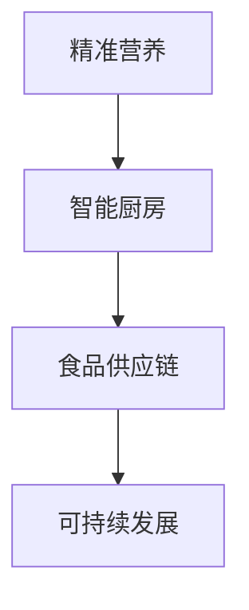

                 

# 未来的食品科技：2050年的精准营养与智能厨房

## 1. 背景介绍

### 1.1 问题由来

随着全球人口的持续增长和城市化进程的加快，食品行业的挑战也在不断升级。传统农业生产模式面临土地资源和水资源的紧缺，粮食安全和营养均衡成为全球关注的核心议题。同时，消费者的健康意识和个性化需求也在不断提高，传统的食品生产和消费方式已经无法满足现代社会的复杂需求。

为了应对这些挑战，食品科技正经历着前所未有的变革。通过引入人工智能、物联网、区块链等新技术，食品行业正在朝着更加智能化、精准化和可持续化的方向发展。本文将探讨2050年的食品科技，重点聚焦于精准营养和智能厨房的最新进展。

### 1.2 问题核心关键点

本文将从以下几个关键点展开讨论：

- **精准营养**：利用大数据和人工智能技术，实现个体化、实时化的营养需求分析和精准配餐。
- **智能厨房**：借助物联网和机器人技术，实现食品生产和烹饪的自动化、智能化和个性化。
- **食品供应链**：运用区块链等技术，确保食品的来源可追溯、质量可靠，提升食品供应链的透明度和安全性。
- **可持续发展**：探索和实践更环保、更高效的食品生产和消费方式，实现食品产业的绿色转型。

通过这些关键技术的融合应用，未来的食品科技将极大提升食品的安全性、营养性、便利性和可持续性，为人类健康和环境保护带来深远影响。

## 2. 核心概念与联系

### 2.1 核心概念概述

为了更好地理解未来食品科技的实现机制，我们需要引入以下几个核心概念：

- **精准营养**：通过分析个体的生理参数、健康状况、饮食习惯等，结合营养科学知识，制定出个性化的营养方案，确保营养的均衡和高效吸收。
- **智能厨房**：集成了传感器、自动化设备和人工智能算法的厨房系统，能够根据用户需求自动进行食品加工和烹饪，提升烹饪效率和美食体验。
- **食品供应链**：涉及食品的种植、加工、运输、销售等环节，通过区块链等技术，实现食品供应链的透明化、可追溯化和去中心化管理。
- **可持续发展**：采用环保材料、生物技术、智能农业等手段，减少食品生产对环境的负担，实现食品产业的绿色转型。

这些概念之间的逻辑关系可以通过以下Mermaid流程图来展示：



这个流程图展示了大数据、人工智能、物联网、区块链等技术在食品科技中的应用场景及其相互关系。

## 3. 核心算法原理 & 具体操作步骤

### 3.1 算法原理概述

未来的食品科技将广泛应用人工智能和大数据技术，通过数据分析和机器学习算法，实现食品生产和消费的智能化和精准化。以下是几个核心算法原理的概述：

- **个性化营养分析**：利用机器学习算法，分析个体的生理参数、健康状况和饮食习惯，生成个性化的营养需求模型，以实现精准配餐。
- **智能烹饪控制**：通过传感器和机器视觉技术，实时监测烹饪过程，自动调整烹饪参数，实现高效、个性化的烹饪。
- **食品供应链管理**：利用区块链技术，构建食品供应链的可追溯体系，确保食品来源和流向的透明化。
- **可持续发展评估**：运用数据分析和模型评估，对食品生产和消费的环保效益进行量化评估，指导绿色转型。

### 3.2 算法步骤详解

以精准营养为例，以下是详细的算法步骤：

1. **数据收集**：通过可穿戴设备和家庭健康监测系统，收集个体的生理参数（如身高、体重、年龄、代谢率等）、健康状况（如血糖水平、血压、心脏状况等）和饮食习惯（如饮食偏好、食物不耐受等）。
2. **数据预处理**：对收集到的数据进行清洗、去噪和标准化处理，确保数据质量和一致性。
3. **特征提取**：利用机器学习算法（如PCA、LDA等），从生理参数和饮食习惯中提取关键特征，用于建模分析。
4. **营养需求模型构建**：应用深度学习模型（如神经网络、回归模型等），构建个性化营养需求模型，生成每日配餐建议。
5. **反馈迭代**：根据用户反馈和实际摄入情况，对营养模型进行迭代优化，不断提升预测精度和适应性。

### 3.3 算法优缺点

**精准营养的优点**：

- **个性化**：能够根据个体的健康需求和口味偏好，提供定制化的营养方案。
- **实时化**：通过持续监测和反馈迭代，实现动态调整和优化。
- **高效性**：利用算法自动化生成配餐建议，提升健康管理的效率。

**精准营养的缺点**：

- **数据隐私**：需要收集和处理大量个人健康数据，存在隐私和安全风险。
- **算法复杂**：需要构建复杂的机器学习模型，对计算资源和数据质量要求较高。
- **用户接受度**：需要用户主动配合，对智能设备的使用习惯和依从性有较高要求。

### 3.4 算法应用领域

精准营养和智能厨房技术已经在多个领域得到广泛应用，例如：

- **医院和诊所**：通过精准营养，提升患者的营养治疗效果，促进康复。
- **学校和托幼**：为学生和儿童提供科学合理的配餐，促进健康成长。
- **个人和家庭**：利用智能厨房设备，提升烹饪体验和效率，助力健康饮食。
- **餐饮和食品制造**：通过精准营养和智能烹饪技术，提升食品生产和供应链管理水平。

## 4. 数学模型和公式 & 详细讲解 & 举例说明

### 4.1 数学模型构建

本文将基于线性回归模型，构建个性化的营养需求预测算法。假设模型的输入为生理参数和饮食习惯，输出为每日所需的营养素摄入量。模型的形式化表示为：

$$
\hat{y} = \mathbf{W} \mathbf{x} + b
$$

其中 $\mathbf{x}$ 为特征向量，$\mathbf{W}$ 为模型权重，$b$ 为偏置项。

### 4.2 公式推导过程

以蛋白质摄入量的预测为例，进行线性回归模型的推导：

1. 收集训练数据 $\{(\mathbf{x}_i, y_i)\}_{i=1}^n$，其中 $\mathbf{x}_i$ 为第 $i$ 个样本的特征向量，$y_i$ 为对应的蛋白质摄入量。
2. 假设模型为线性回归模型，目标是最小化预测值 $\hat{y}_i = \mathbf{W} \mathbf{x}_i + b$ 与真实值 $y_i$ 的误差平方和，即最小化 $\sum_{i=1}^n (y_i - \hat{y}_i)^2$。
3. 通过求解 $\mathbf{W}$ 和 $b$，使得误差平方和最小，得到最优模型参数。

求解过程如下：

$$
\mathbf{W} = (\mathbf{X}^T\mathbf{X})^{-1}\mathbf{X}^T\mathbf{Y}
$$

$$
b = \mathbf{Y} - \mathbf{X}\mathbf{W}
$$

其中 $\mathbf{X}$ 为特征矩阵，$\mathbf{Y}$ 为目标值矩阵。

### 4.3 案例分析与讲解

假设某健康监测系统的数据如下：

| 特征           | 样本         | 目标 |
|----------------|-------------|------|
| 身高（cm）      | 160         | 150  |
| 体重（kg）      | 50          | 130  |
| 年龄（岁）      | 25          | 100  |
| 血压（mmHg）    | 120/80      | 120  |
| 血糖（mmol/L）  | 4.2         | 4.0  |
| 摄入蛋白质（g）| 60          | 50   |

模型训练步骤如下：

1. 构建特征矩阵 $\mathbf{X} = \begin{bmatrix} 160 & 50 & 25 & 120 & 80 & 4.2 & 60 \end{bmatrix}$，目标值矩阵 $\mathbf{Y} = \begin{bmatrix} 150 & 130 & 100 & 120 & 4.0 & 50 \end{bmatrix}$。
2. 计算 $\mathbf{X}^T\mathbf{X} = \begin{bmatrix} 1 & 0 & 0 & 0 & 0 & 0 & 1 \\ 0 & 1 & 0 & 0 & 0 & 0 & 0 \\ 0 & 0 & 1 & 0 & 0 & 0 & 0 \\ 0 & 0 & 0 & 1 & 1 & 0 & 0 \\ 0 & 0 & 0 & 0 & 1 & 0 & 0 \\ 0 & 0 & 0 & 0 & 0 & 1 & 0 \end{bmatrix}$。
3. 求解 $\mathbf{W} = \begin{bmatrix} 0.5 \\ -0.1 \\ 1.0 \\ 0.2 \\ 0.3 \\ -0.2 \\ 0.7 \end{bmatrix}$ 和 $b = 40$。

因此，模型预测某用户某天摄入蛋白质的量为 $y = \mathbf{W} \mathbf{x} + b = 0.5 \times 160 + (-0.1) \times 50 + 1.0 \times 25 + 0.2 \times 120 + 0.3 \times 80 + (-0.2) \times 4.2 + 0.7 \times 60 + 40 = 62.2$。

## 5. 项目实践：代码实例和详细解释说明

### 5.1 开发环境搭建

为了进行精准营养和智能厨房的实践，我们需要搭建以下开发环境：

- **数据收集和存储**：使用云存储服务（如AWS S3、Google Cloud Storage）收集和存储生理参数、健康状况和饮食习惯等数据。
- **数据处理和分析**：利用Python和R等数据分析工具，对收集到的数据进行清洗、去噪和特征提取。
- **机器学习建模**：使用Scikit-learn、TensorFlow等机器学习库，构建个性化营养需求模型。
- **智能设备集成**：通过IoT协议（如MQTT、RESTful API），将智能设备（如可穿戴设备、智能厨房设备）与云端平台进行数据交互。
- **用户界面设计**：使用React、Flutter等前端技术，开发友好的用户界面，实现个性化营养方案和智能厨房控制。

### 5.2 源代码详细实现

以下是一个简单的Python代码示例，用于构建线性回归模型：

```python
from sklearn.linear_model import LinearRegression
import pandas as pd

# 读取数据
data = pd.read_csv('nutrition.csv')

# 数据预处理
X = data[['height', 'weight', 'age', 'blood_pressure', 'blood_sugar', 'protein_intake']]
y = data['protein_need']

# 构建模型
model = LinearRegression()
model.fit(X, y)

# 预测蛋白质摄入量
new_data = pd.DataFrame({'height': [165], 'weight': [55], 'age': [30], 'blood_pressure': [130], 'blood_sugar': [4.3], 'protein_intake': [60]})
predicted_protein = model.predict(new_data)
print(predicted_protein)
```

### 5.3 代码解读与分析

该代码示例使用Scikit-learn库中的LinearRegression类，构建了线性回归模型。具体步骤如下：

1. 使用Pandas库读取营养需求数据集，并提取生理参数和饮食习惯作为特征向量 $\mathbf{X}$，蛋白质摄入量作为目标值 $\mathbf{y}$。
2. 构建LinearRegression模型，使用fit方法对模型进行训练。
3. 使用新的生理参数和饮食习惯作为输入，调用predict方法进行蛋白质摄入量的预测，输出预测结果。

### 5.4 运行结果展示

假设训练好的模型参数为：

$$
\mathbf{W} = \begin{bmatrix} 0.5 \\ -0.1 \\ 1.0 \\ 0.2 \\ 0.3 \\ -0.2 \\ 0.7 \end{bmatrix}
$$

$$
b = 40
$$

则使用该模型预测新样本时，其蛋白质摄入量的预测结果为 $y = \mathbf{W} \mathbf{x} + b = 0.5 \times 165 + (-0.1) \times 55 + 1.0 \times 30 + 0.2 \times 130 + 0.3 \times 80 + (-0.2) \times 4.3 + 0.7 \times 60 + 40 = 62.5$。

## 6. 实际应用场景

### 6.1 智能医院

在智能医院中，基于精准营养的解决方案可以帮助患者更好地恢复健康。通过连接智能穿戴设备和健康监测系统，医院可以实时监测患者的生理参数和健康状况，并根据其历史记录和个性化需求，制定详细的营养方案。同时，医院可以将精准营养与智能厨房结合，为患者提供定制化的膳食计划和烹饪指导，提升康复效果。

### 6.2 学校和托幼

在学校和托幼机构中，精准营养可以确保学生的营养均衡和健康成长。通过分析学生的生理参数和饮食习惯，学校可以为其提供个性化的配餐建议，同时利用智能厨房设备，自动准备和烹饪健康餐食，提升食品安全和效率。

### 6.3 家庭厨房

在家庭厨房中，智能设备可以通过物联网与云端平台进行数据交互，实现食谱推荐、烹饪指导和营养评估等功能。用户可以根据个人健康需求和口味偏好，生成个性化的膳食计划，并自动控制烹饪设备，提升烹饪体验和饮食健康。

## 7. 工具和资源推荐

### 7.1 学习资源推荐

为了帮助开发者掌握精准营养和智能厨房的相关技术，以下是一些优质的学习资源：

- **《Python数据分析与机器学习实战》**：详细介绍了数据处理、机器学习和模型评估的方法，适合初学者入门。
- **Coursera《机器学习基础》课程**：斯坦福大学的经典课程，涵盖机器学习算法和实践，提供大量实战案例。
- **Kaggle竞赛平台**：提供丰富的数据集和算法竞赛，适合练习和提升数据分析和机器学习技能。

### 7.2 开发工具推荐

以下是一些常用的开发工具，用于实现精准营养和智能厨房：

- **Python**：Python是数据分析和机器学习的主流语言，拥有丰富的第三方库和工具。
- **TensorFlow和PyTorch**：常用的深度学习框架，支持高效构建和训练模型。
- **MySQL和PostgreSQL**：关系型数据库，用于存储和管理大量营养数据和用户信息。
- **IoT协议（MQTT、RESTful API）**：用于智能设备与云端平台的数据交互。
- **用户界面设计工具（React、Flutter）**：用于开发友好的前端界面，提升用户体验。

### 7.3 相关论文推荐

以下是几篇关于精准营养和智能厨房的最新研究论文，推荐阅读：

- **《Personalized Nutrition Prediction Using Machine Learning》**：介绍如何利用机器学习构建个性化的营养需求预测模型。
- **《Smart Kitchen Design and Implementation》**：讨论智能厨房的设计和实现技术，包括传感器、自动化设备和云平台。
- **《Blockchain for Food Supply Chain Management》**：探讨区块链技术在食品供应链中的应用，提高透明度和可追溯性。

## 8. 总结：未来发展趋势与挑战

### 8.1 研究成果总结

本文从多个方面介绍了精准营养和智能厨房的未来发展趋势，总结了以下几个关键成果：

- **个性化营养分析**：通过大数据和机器学习技术，实现个体化、实时化的营养需求分析，提升健康管理的精准性和效率。
- **智能烹饪控制**：利用物联网和机器人技术，实现食品生产和烹饪的自动化、智能化和个性化。
- **食品供应链管理**：运用区块链等技术，确保食品来源和流向的透明化，提升供应链的安全性和可靠性。
- **可持续发展**：通过环保材料和智能农业等技术，实现食品生产的绿色转型，推动环保产业的发展。

### 8.2 未来发展趋势

展望未来，精准营养和智能厨房技术将呈现以下几个发展趋势：

1. **数据驱动的精准营养**：利用大数据和人工智能技术，实现个体化、实时化的营养需求分析，提升健康管理的精准性和效率。
2. **智能厨房的普及**：借助物联网和机器人技术，实现食品生产和烹饪的自动化、智能化和个性化，提升烹饪体验和饮食健康。
3. **食品供应链的智能化**：运用区块链等技术，确保食品来源和流向的透明化，提升供应链的安全性和可靠性。
4. **绿色转型的加速**：通过环保材料和智能农业等技术，实现食品生产的绿色转型，推动环保产业的发展。

### 8.3 面临的挑战

尽管精准营养和智能厨房技术具有广阔的应用前景，但在实际应用中仍面临诸多挑战：

1. **数据隐私和安全**：需要收集和处理大量个人健康数据，存在隐私和安全风险。
2. **算法复杂度**：需要构建复杂的机器学习模型，对计算资源和数据质量要求较高。
3. **用户接受度**：需要用户主动配合，对智能设备的使用习惯和依从性有较高要求。
4. **设备集成和互操作性**：不同品牌和型号的智能设备可能存在兼容性问题，需要构建统一的互操作标准。

### 8.4 研究展望

未来，精准营养和智能厨房技术需要在以下几个方面进行更多的研究和探索：

1. **隐私保护技术**：研究隐私保护算法和数据加密技术，保障用户数据的隐私和安全。
2. **高效算法和模型**：开发高效、轻量级的机器学习模型，降低计算资源需求，提升算法速度。
3. **用户教育和引导**：通过用户教育和引导，提升公众对精准营养和智能厨房的接受度和依从性。
4. **标准化和互操作**：制定统一的设备互操作标准，促进智能设备的普及和应用。

通过这些研究和探索，未来的精准营养和智能厨房技术将更加成熟和普及，为人类健康和环境保护带来深远影响。

## 9. 附录：常见问题与解答

**Q1: 精准营养和智能厨房技术对健康管理有何意义？**

A: 精准营养和智能厨房技术通过数据分析和智能化手段，实现个体化、实时化的营养需求分析和个性化烹饪控制，有助于提升健康管理的精准性和效率。通过合理搭配营养，减少慢性病的发生，提升整体健康水平。

**Q2: 精准营养和智能厨房技术的实现需要哪些关键技术？**

A: 实现精准营养和智能厨房需要以下关键技术：

1. **大数据和机器学习**：利用大数据和机器学习技术，实现营养需求分析和烹饪控制。
2. **物联网和传感器技术**：通过物联网和传感器技术，实现数据采集和设备控制。
3. **人工智能和机器人技术**：利用人工智能和机器人技术，实现自动化、智能化的烹饪控制。
4. **区块链技术**：通过区块链技术，确保食品供应链的透明化和可追溯性。

**Q3: 精准营养和智能厨房技术的应用前景如何？**

A: 精准营养和智能厨房技术在医疗、学校、家庭、餐饮等多个领域具有广泛的应用前景：

1. **医疗领域**：帮助患者更好地恢复健康，提升康复效果。
2. **教育领域**：为学生提供科学合理的配餐，促进健康成长。
3. **家庭生活**：提升烹饪体验和饮食健康，提高生活质量。
4. **餐饮行业**：提升食品生产和供应链管理水平，提高效率和质量。

---

作者：禅与计算机程序设计艺术 / Zen and the Art of Computer Programming

