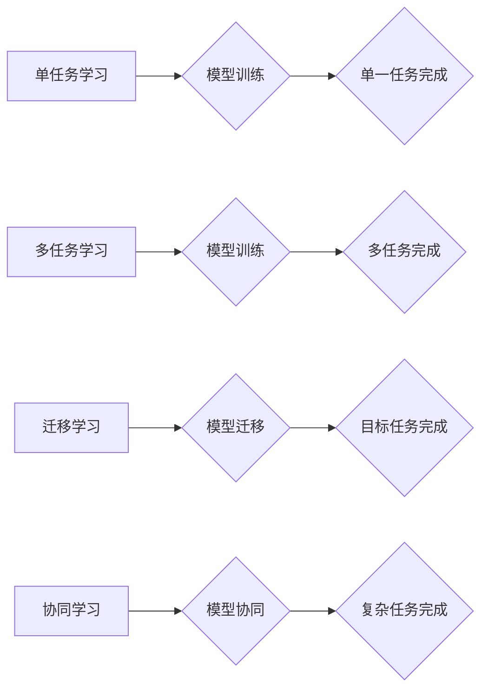

                 

## 关键词：电商平台、AI大模型、多任务学习、迁移学习、协同学习、推荐系统、个性化服务

## 1. 背景介绍

随着电商平台的蓬勃发展，用户数据爆炸式增长，对个性化推荐、精准营销、智能客服等方面的需求日益迫切。传统机器学习模型由于其单一任务特性和数据依赖性，难以满足电商平台日益复杂的需求。而AI大模型凭借其强大的泛化能力和对海量数据的处理能力，成为解决这些问题的关键技术。

AI大模型在电商平台的应用场景广泛，包括：

* **商品推荐:** 基于用户历史行为、偏好和上下文信息，推荐个性化商品，提升用户体验和转化率。
* **搜索引擎优化:** 理解用户搜索意图，提供更精准的搜索结果，提高用户搜索效率。
* **智能客服:** 利用自然语言处理技术，自动回复用户咨询，提供24小时在线服务，减轻人工客服压力。
* **价格预测:** 分析市场趋势和用户行为，预测商品价格波动，帮助商家制定合理的定价策略。
* **内容生成:** 自动生成商品描述、促销文案等内容，提高运营效率。

## 2. 核心概念与联系

### 2.1  AI大模型

AI大模型是指在海量数据上训练的深度学习模型，拥有强大的泛化能力和知识表示能力。其规模通常较大，参数数量在百万甚至数十亿级别。

### 2.2  单任务学习

单任务学习是指模型只针对一个特定的任务进行训练，例如商品推荐或文本分类。这种方法简单易行，但模型的泛化能力有限，难以应对多样的任务需求。

### 2.3  多任务学习

多任务学习是指模型同时学习多个相关任务，例如商品推荐和用户画像。通过共享底层特征和知识，模型可以提升泛化能力和学习效率。

### 2.4  迁移学习

迁移学习是指将预训练模型在源任务上的知识迁移到目标任务，以提高目标任务的学习效率。

### 2.5  协同学习

协同学习是指多个模型协同工作，共同完成一个复杂任务。每个模型负责特定的子任务，通过信息共享和联合训练，提升整体性能。

**Mermaid 流程图**



## 3. 核心算法原理 & 具体操作步骤

### 3.1  算法原理概述

多任务学习、迁移学习和协同学习都是为了提升AI大模型的泛化能力和学习效率的有效方法。

* **多任务学习**通过共享底层特征和知识，使模型能够更好地理解不同任务之间的关系，从而提升整体性能。
* **迁移学习**通过将预训练模型的知识迁移到目标任务，可以减少目标任务的训练数据需求，并提升模型的学习效率。
* **协同学习**通过多个模型协同工作，可以分解复杂任务，并通过信息共享和联合训练，提升整体性能。

### 3.2  算法步骤详解

**多任务学习:**

1. **任务定义:** 明确需要学习的多个任务。
2. **特征工程:** 设计共同的特征空间，用于表示不同任务的数据。
3. **模型构建:** 使用共享层和任务特有的层构建多任务学习模型。
4. **模型训练:** 使用联合损失函数，对所有任务进行联合训练。
5. **模型评估:** 对每个任务进行独立评估，并分析模型的泛化能力。

**迁移学习:**

1. **源任务选择:** 选择与目标任务相关的源任务。
2. **预训练模型训练:** 在源任务上训练一个预训练模型。
3. **特征提取:** 使用预训练模型提取目标任务数据的特征。
4. **目标任务模型训练:** 在目标任务上训练一个新的模型，并使用预训练模型提取的特征进行训练。
5. **模型评估:** 对目标任务进行评估，并分析模型的性能提升。

**协同学习:**

1. **任务分解:** 将复杂任务分解成多个子任务。
2. **模型选择:** 选择合适的模型类型，用于完成每个子任务。
3. **模型训练:** 训练每个模型，并通过信息共享和联合训练，提升整体性能。
4. **模型融合:** 将多个模型的输出进行融合，得到最终的预测结果。
5. **模型评估:** 对复杂任务进行评估，并分析模型的整体性能。

### 3.3  算法优缺点

| 算法类型 | 优点 | 缺点 |
|---|---|---|
| 多任务学习 | 提升模型泛化能力，提高学习效率 | 需要设计合理的任务关系，模型复杂度较高 |
| 迁移学习 | 减少目标任务的训练数据需求，提升模型学习效率 | 需要找到合适的源任务，预训练模型的质量影响目标任务的性能 |
| 协同学习 | 可以分解复杂任务，提升整体性能 | 需要设计合理的模型结构和信息共享机制，模型训练复杂度较高 |

### 3.4  算法应用领域

* **多任务学习:** 图像识别、自然语言处理、语音识别等领域。
* **迁移学习:** 语音识别、机器翻译、医疗诊断等领域。
* **协同学习:** 欺诈检测、推荐系统、目标跟踪等领域。

## 4. 数学模型和公式 & 详细讲解 & 举例说明

### 4.1  数学模型构建

**多任务学习:**

假设我们有K个任务，每个任务都有其对应的损失函数。我们可以使用一个共享的特征提取网络，并为每个任务添加一个特定的任务头。

**损失函数:**

$$L = \sum_{i=1}^{K} \lambda_i L_i$$

其中，$L$是总损失函数，$L_i$是第i个任务的损失函数，$\lambda_i$是权重系数。

**迁移学习:**

假设我们有一个预训练模型$F_{\theta}$，在源任务上训练得到参数$\theta$。我们希望将这个模型迁移到目标任务上。

**目标任务模型:**

$$F_{\phi} = F_{\theta} + \Delta \phi$$

其中，$F_{\phi}$是目标任务模型，$\Delta \phi$是需要学习的参数更新。

**协同学习:**

假设我们有M个模型，每个模型负责一个子任务。我们可以使用一个融合层，将所有模型的输出进行融合。

**融合层:**

$$y = \sum_{i=1}^{M} w_i f_i(x)$$

其中，$y$是最终的预测结果，$f_i(x)$是第i个模型的输出，$w_i$是权重系数。

### 4.2  公式推导过程

**多任务学习:**

损失函数的推导过程是基于每个任务的损失函数和权重系数的加权求和。

**迁移学习:**

目标任务模型的参数更新可以通过梯度下降算法进行优化。

**协同学习:**

融合层的权重系数可以通过训练过程进行学习，以优化最终的预测结果。

### 4.3  案例分析与讲解

**多任务学习:**

在电商平台中，我们可以使用多任务学习来同时学习商品推荐和用户画像。

**迁移学习:**

我们可以将预训练的图像识别模型迁移到商品分类任务中，以提高分类准确率。

**协同学习:**

我们可以使用多个模型协同完成商品推荐任务，例如使用一个模型进行用户画像，另一个模型进行商品相似度计算，并通过融合层得到最终的推荐结果。

## 5. 项目实践：代码实例和详细解释说明

### 5.1  开发环境搭建

* Python 3.7+
* TensorFlow 2.0+
* PyTorch 1.0+
* CUDA 10.1+

### 5.2  源代码详细实现

```python
# 多任务学习示例代码

import tensorflow as tf

# 定义共享特征提取网络
def shared_feature_extractor(input_tensor):
    # ...

# 定义任务特有的层
def task1_head(input_tensor):
    # ...

def task2_head(input_tensor):
    # ...

# 输入数据
input_data = tf.random.normal((100, 1024))

# 获取共享特征
shared_features = shared_feature_extractor(input_data)

# 获取任务特有的输出
task1_output = task1_head(shared_features)
task2_output = task2_head(shared_features)

# 定义损失函数
task1_loss = tf.keras.losses.BinaryCrossentropy()(task1_output, tf.ones_like(task1_output))
task2_loss = tf.keras.losses.CategoricalCrossentropy()(task2_output, tf.random.categorical(tf.ones_like(task2_output), num_classes=10))

# 定义总损失函数
total_loss = task1_loss + task2_loss

# 训练模型
optimizer = tf.keras.optimizers.Adam()
optimizer.minimize(total_loss)
```

### 5.3  代码解读与分析

* 代码首先定义了共享特征提取网络和任务特有的层。
* 然后，使用输入数据获取共享特征，并通过任务特有的层得到任务输出。
* 定义了每个任务的损失函数，并将其加权求和得到总损失函数。
* 使用Adam优化器对模型进行训练，以最小化总损失函数。

### 5.4  运行结果展示

训练完成后，可以评估模型在每个任务上的性能，例如准确率、召回率等。

## 6. 实际应用场景

### 6.1  电商平台推荐系统

AI大模型可以用于构建个性化商品推荐系统，根据用户的历史行为、偏好和上下文信息，推荐更符合用户需求的商品。

### 6.2  智能客服

AI大模型可以用于构建智能客服系统，自动回复用户咨询，提供24小时在线服务，减轻人工客服压力。

### 6.3  价格预测

AI大模型可以用于预测商品价格波动，帮助商家制定合理的定价策略。

### 6.4  未来应用展望

* **更精准的个性化服务:** 通过更深入的用户画像和行为分析，提供更精准的个性化商品推荐、广告投放和内容服务。
* **更智能的交互体验:** 利用自然语言处理技术，构建更智能的聊天机器人和虚拟助手，提供更自然、更人性化的交互体验。
* **更有效的运营策略:** 利用AI大模型分析用户行为和市场趋势，帮助商家制定更有效的运营策略，提升运营效率。

## 7. 工具和资源推荐

### 7.1  学习资源推荐

* **书籍:**
    * Deep Learning by Ian Goodfellow, Yoshua Bengio, and Aaron Courville
    * Hands-On Machine Learning with Scikit-Learn, Keras & TensorFlow by Aurélien Géron
* **在线课程:**
    * TensorFlow Tutorials: https://www.tensorflow.org/tutorials
    * PyTorch Tutorials: https://pytorch.org/tutorials/

### 7.2  开发工具推荐

* **TensorFlow:** https://www.tensorflow.org/
* **PyTorch:** https://pytorch.org/
* **Keras:** https://keras.io/

### 7.3  相关论文推荐

* Attention Is All You Need (Vaswani et al., 2017)
* BERT: Pre-training of Deep Bidirectional Transformers for Language Understanding (Devlin et al., 2018)
* GPT-3: Language Models are Few-Shot Learners (Brown et al., 2020)

## 8. 总结：未来发展趋势与挑战

### 8.1  研究成果总结

AI大模型在电商平台的应用取得了显著成果，例如提升了推荐系统的准确率、提高了智能客服的效率、优化了价格预测模型。

### 8.2  未来发展趋势

* **模型规模和能力的提升:** 未来AI大模型的规模和能力将继续提升，能够处理更复杂的任务和更海量的数据。
* **多模态学习:** AI大模型将融合文本、图像、音频等多模态数据，提供更全面的用户体验。
* **联邦学习:** 联邦学习技术将使AI大模型能够在不共享原始数据的情况下进行训练，提升数据隐私保护。

### 8.3  面临的挑战

* **模型训练成本:** 训练大型AI模型需要大量的计算资源和时间，成本较高。
* **数据安全和隐私:** AI大模型的训练需要大量用户数据，如何保证数据安全和隐私是一个重要挑战。
* **模型解释性和可信度:** AI大模型的决策过程往往难以解释，如何提升模型的解释性和可信度是一个重要的研究方向。

### 8.4  研究展望

未来，AI大模型将在电商平台的应用领域发挥更重要的作用，为用户提供更个性化、更智能、更便捷的购物体验。


## 9. 附录：常见问题与解答

**Q1: 如何选择合适的AI大模型？**

**A1:** 选择合适的AI大模型需要根据具体的应用场景和需求进行考虑，例如模型规模、参数数量、训练数据量、任务类型等。

**Q2: 如何训练和部署AI大模型？**

**A2:** 训练和部署AI大模型需要一定的技术基础和资源支持，可以参考相关教程和文档进行学习。

**Q3: 如何评估AI大模型的性能？**

**A3:** 可以使用相应的指标来评估AI大模型的性能，例如准确率、召回率、F1-score等。

**作者：禅与计算机程序设计艺术 / Zen and the Art of Computer Programming**<end_of_turn>

