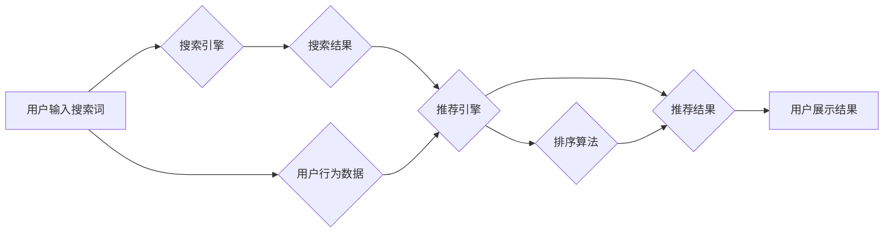

                 

##  电商平台搜索推荐系统的AI 大模型应用：应对数据规模与实时性的双重挑战

> 关键词：电商平台、搜索推荐系统、AI 大模型、数据规模、实时性、Transformer、BERT、推荐算法、深度学习

## 1. 背景介绍

在当今数据爆炸的时代，电商平台作为商品交易的重要载体，其搜索推荐系统扮演着至关重要的角色。用户在平台上搜索商品时，期望能够快速找到符合自身需求的商品，而搜索推荐系统正是通过分析用户行为、商品信息等数据，为用户提供个性化、精准的商品推荐，从而提升用户体验和转化率。

传统的搜索推荐系统主要依赖于基于规则的算法和特征工程，但随着数据规模的不断增长和用户需求的不断变化，这些方法逐渐显得力不从心。近年来，深度学习技术的发展为电商平台搜索推荐系统带来了新的机遇。AI 大模型，特别是 Transformer 架构下的模型，凭借其强大的学习能力和泛化能力，在处理海量数据、理解用户需求和生成精准推荐方面展现出巨大的潜力。

## 2. 核心概念与联系

### 2.1 搜索推荐系统

电商平台搜索推荐系统旨在帮助用户快速找到所需商品，并提供个性化的商品推荐。它通常由以下几个模块组成：

* **搜索引擎:** 处理用户搜索词，并返回相关商品列表。
* **推荐引擎:** 基于用户行为、商品信息等数据，为用户推荐个性化的商品。
* **排序算法:** 对搜索结果和推荐结果进行排序，将最相关的商品排在前面。
* **展示引擎:** 将排序后的结果以用户友好的方式展示给用户。

### 2.2 AI 大模型

AI 大模型是指在海量数据上训练的深度学习模型，具有强大的学习能力和泛化能力。常见的 AI 大模型架构包括 Transformer、BERT 等。

* **Transformer:**  一种基于注意力机制的深度学习架构，能够有效处理序列数据，例如文本和代码。
* **BERT:**  一种基于 Transformer 的预训练语言模型，能够理解上下文信息，并用于各种自然语言处理任务，例如文本分类、问答和搜索。

### 2.3  AI 大模型在电商平台搜索推荐系统中的应用

AI 大模型可以应用于电商平台搜索推荐系统的各个模块，例如：

* **搜索引擎:** 使用 BERT 等预训练语言模型进行搜索词理解和语义匹配，提高搜索结果的准确性。
* **推荐引擎:** 使用 Transformer 等模型学习用户行为和商品特征之间的关系，生成更精准的商品推荐。
* **排序算法:** 使用深度学习模型对搜索结果和推荐结果进行排序，提高排序结果的质量。

**Mermaid 流程图**



## 3. 核心算法原理 & 具体操作步骤

### 3.1  算法原理概述

在电商平台搜索推荐系统中，AI 大模型通常用于构建推荐模型，该模型能够学习用户行为和商品特征之间的关系，并预测用户对特定商品的兴趣。常见的推荐算法包括：

* **协同过滤:** 基于用户的历史行为和商品的相似性进行推荐。
* **内容过滤:** 基于商品的特征和用户的兴趣偏好进行推荐。
* **混合推荐:** 将协同过滤和内容过滤相结合，提高推荐效果。

### 3.2  算法步骤详解

以协同过滤算法为例，其具体操作步骤如下：

1. **数据收集:** 收集用户行为数据，例如用户浏览历史、购买记录、评分等。
2. **数据预处理:** 对用户行为数据进行清洗、转换和特征提取。
3. **相似度计算:** 计算用户之间的相似度和商品之间的相似度。
4. **推荐生成:** 根据用户和商品的相似度，生成推荐列表。

### 3.3  算法优缺点

**协同过滤算法:**

* **优点:** 能够发现用户和商品之间的隐性关系，推荐效果较好。
* **缺点:** 数据稀疏性问题，新用户和新商品的推荐效果较差。

**内容过滤算法:**

* **优点:** 不需要用户历史行为数据，能够推荐新商品。
* **缺点:** 难以发现用户和商品之间的隐性关系，推荐效果可能较差。

### 3.4  算法应用领域

协同过滤和内容过滤算法广泛应用于电商平台、视频网站、音乐平台等场景，用于商品推荐、内容推荐和用户画像等。

## 4. 数学模型和公式 & 详细讲解 & 举例说明

### 4.1  数学模型构建

协同过滤算法通常使用矩阵分解模型进行建模，将用户和商品表示为向量，并通过最小化用户-商品交互矩阵的误差来学习用户和商品的潜在特征。

假设用户集合为 U，商品集合为 I，用户-商品交互矩阵为 R，其中 R(u, i) 表示用户 u 对商品 i 的评分。

目标函数为：

$$
\min_{U, V} \frac{1}{2} \sum_{u \in U, i \in I} (R(u, i) - \mathbf{u}^T \mathbf{v}_i)^2 + \lambda (\|\mathbf{u}\|^2 + \|\mathbf{v}_i\|^2)
$$

其中：

* U 是用户特征矩阵，每一行代表一个用户，每一列代表一个特征。
* V 是商品特征矩阵，每一行代表一个商品，每一列代表一个特征。
* $\lambda$ 是正则化参数，用于防止模型过拟合。

### 4.2  公式推导过程

目标函数的最小化可以通过梯度下降算法实现。

对于用户特征矩阵 U，梯度为：

$$
\frac{\partial L}{\partial \mathbf{u}} = \sum_{i \in I} (R(u, i) - \mathbf{u}^T \mathbf{v}_i) \mathbf{v}_i + 2\lambda \mathbf{u}
$$

对于商品特征矩阵 V，梯度为：

$$
\frac{\partial L}{\partial \mathbf{v}_i} = \sum_{u \in U} (R(u, i) - \mathbf{u}^T \mathbf{v}_i) \mathbf{u} + 2\lambda \mathbf{v}_i
$$

通过迭代更新 U 和 V，最终得到用户和商品的潜在特征。

### 4.3  案例分析与讲解

假设有一个电商平台，用户集合为 U = {1, 2, 3}, 商品集合为 I = {A, B, C}, 用户-商品交互矩阵为：

$$
R = \begin{bmatrix}
5 & 3 & 4 \\
4 & 5 & 2 \\
3 & 2 & 5
\end{bmatrix}
$$

使用矩阵分解模型进行建模，可以学习到用户和商品的潜在特征，并根据这些特征进行商品推荐。

## 5. 项目实践：代码实例和详细解释说明

### 5.1  开发环境搭建

* Python 3.x
* TensorFlow 或 PyTorch
* Jupyter Notebook

### 5.2  源代码详细实现

```python
import tensorflow as tf

# 定义用户-商品交互矩阵
R = tf.constant([[5, 3, 4],
                 [4, 5, 2],
                 [3, 2, 5]])

# 定义用户和商品的维度
num_users = 3
num_items = 3
latent_dim = 10

# 定义用户和商品特征矩阵
U = tf.Variable(tf.random.normal([num_users, latent_dim]))
V = tf.Variable(tf.random.normal([num_items, latent_dim]))

# 定义损失函数
def loss_function(R, U, V):
    predictions = tf.matmul(U, V, transpose_b=True)
    error = tf.reduce_mean(tf.square(R - predictions))
    return error

# 定义优化器
optimizer = tf.keras.optimizers.Adam()

# 训练模型
for epoch in range(100):
    with tf.GradientTape() as tape:
        loss = loss_function(R, U, V)
    gradients = tape.gradient(loss, [U, V])
    optimizer.apply_gradients(zip(gradients, [U, V]))

    print(f"Epoch {epoch+1}, Loss: {loss.numpy()}")

# 生成推荐结果
recommendations = tf.matmul(U, V, transpose_b=True)
```

### 5.3  代码解读与分析

* 代码首先定义了用户-商品交互矩阵 R，以及用户和商品的维度。
* 然后定义了用户和商品特征矩阵 U 和 V，并使用随机数初始化。
* 损失函数计算了预测值与真实值的均方误差。
* 使用 Adam 优化器对模型参数进行更新。
* 训练完成后，使用用户特征矩阵 U 和商品特征矩阵 V 生成推荐结果。

### 5.4  运行结果展示

训练完成后，可以将生成的推荐结果与真实的用户行为数据进行比较，评估模型的推荐效果。

## 6. 实际应用场景

AI 大模型在电商平台搜索推荐系统中的应用场景非常广泛，例如：

* **商品推荐:** 根据用户的浏览历史、购买记录等数据，推荐用户可能感兴趣的商品。
* **搜索结果排序:** 根据用户的搜索词和历史行为数据，对搜索结果进行排序，提高搜索结果的准确性和相关性。
* **个性化广告:** 根据用户的兴趣偏好和行为数据，展示个性化的广告，提高广告点击率和转化率。
* **用户画像:** 学习用户的兴趣偏好、消费习惯等信息，构建用户画像，为用户提供更精准的服务。

### 6.4  未来应用展望

随着 AI 技术的不断发展，AI 大模型在电商平台搜索推荐系统中的应用将更加广泛和深入。例如：

* **多模态推荐:** 将文本、图像、视频等多模态数据融合，构建更全面的用户画像，提供更精准的推荐。
* **实时推荐:** 利用实时数据流，实时更新用户画像和商品信息，提供更及时和个性化的推荐。
* **解释性推荐:** 使推荐结果更加透明，用户能够理解推荐背后的逻辑，提升用户信任度。

## 7. 工具和资源推荐

### 7.1  学习资源推荐

* **书籍:**
    * Deep Learning by Ian Goodfellow, Yoshua Bengio, and Aaron Courville
    * Natural Language Processing with Python by Steven Bird, Ewan Klein, and Edward Loper
* **在线课程:**
    * TensorFlow Tutorials: https://www.tensorflow.org/tutorials
    * PyTorch Tutorials: https://pytorch.org/tutorials/

### 7.2  开发工具推荐

* **TensorFlow:** https://www.tensorflow.org/
* **PyTorch:** https://pytorch.org/
* **Jupyter Notebook:** https://jupyter.org/

### 7.3  相关论文推荐

* BERT: Pre-training of Deep Bidirectional Transformers for Language Understanding
* Transformer: Attention Is All You Need
* Collaborative Filtering for Recommender Systems

## 8. 总结：未来发展趋势与挑战

### 8.1  研究成果总结

AI 大模型在电商平台搜索推荐系统中的应用取得了显著的成果，能够有效提升推荐效果和用户体验。

### 8.2  未来发展趋势

未来，AI 大模型在电商平台搜索推荐系统中的应用将朝着以下方向发展：

* **更强大的模型:** 探索更深、更广的模型架构，提升模型的学习能力和泛化能力。
* **更精准的推荐:** 利用多模态数据、实时数据流等，构建更全面的用户画像，提供更精准的推荐。
* **更透明的推荐:** 使推荐结果更加透明，用户能够理解推荐背后的逻辑，提升用户信任度。

### 8.3  面临的挑战

AI 大模型在电商平台搜索推荐系统中的应用也面临着一些挑战：

* **数据规模:** 训练大型 AI 模型需要海量数据，而电商平台的数据往往存在稀疏性和噪声问题。
* **计算资源:** 训练大型 AI 模型需要大量的计算资源，这对于中小企业来说是一个挑战。
* **模型解释性:** AI 模型的决策过程往往难以解释，这可能会导致用户对推荐结果的信任度降低。

### 8.4  研究展望

未来，需要进一步研究如何解决 AI 大模型在电商平台搜索推荐系统中的应用面临的挑战，例如：

* 开发更有效的模型训练方法，能够处理稀疏性和噪声数据。
* 研究更轻量级的模型架构，降低模型训练和部署的成本。
* 开发更有效的模型解释方法，提升用户对推荐结果的信任度。


## 9. 附录：常见问题与解答

**Q1: AI 大模型的训练需要多长时间？**

A1: AI 大模型的训练时间取决于模型的规模、数据量和硬件资源等因素，通常需要几天到几周甚至更长时间。

**Q2: 如何评估 AI 大模型的推荐效果？**

A2: 可以使用各种指标来评估 AI 大模型的推荐效果，例如点击率、转化率、用户满意度等。

**Q3: AI 大模型的应用会带来哪些伦理问题？**

A3: AI 大模型的应用可能会带来一些伦理问题，例如数据隐私、算法偏见等，需要引起重视并采取相应的措施。


作者：禅与计算机程序设计艺术 / Zen and the Art of Computer Programming 
<end_of_turn>

