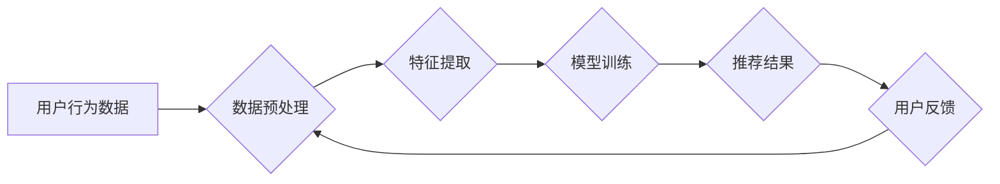

                 

## 电商推荐系统中的长尾商品推广策略

> 关键词：长尾商品、推荐系统、电商平台、个性化推荐、协同过滤、内容过滤、深度学习、CTR预估、转化率优化

## 1. 背景介绍

在当今以电商为主导的商业模式下，推荐系统已成为电商平台的核心竞争力之一。它能够根据用户的历史行为、偏好和浏览记录，精准推荐商品，提升用户体验，并最终促进销售转化。然而，电商平台上的商品种类繁多，其中长尾商品占据着相当大的比例。长尾商品是指销量相对较低、市场份额较小的商品，它们虽然数量众多，但单个商品的销售额较低。由于缺乏用户数据和曝光机会，长尾商品往往难以获得足够的关注和推广，从而导致其销售额难以提升。

长尾商品的推广对电商平台的整体发展至关重要。一方面，长尾商品丰富了平台的商品种类，满足了用户多样化的需求；另一方面，挖掘和推广长尾商品能够提升平台的商品覆盖率和用户粘性，最终促进平台的商业价值增长。

## 2. 核心概念与联系

### 2.1 长尾商品

长尾商品是指在商品销售曲线中，销量较低、市场份额较小的商品。它们通常具有以下特点：

* **销量低:** 单个商品的销量相对较低。
* **市场份额小:** 在整个商品市场中所占的份额较小。
* **用户需求细分:** 满足特定用户群体的特定需求。
* **潜在价值高:** 虽然单个商品的销量低，但由于数量众多，其总销售额可能不容忽视。

### 2.2 推荐系统

推荐系统是一种利用数据挖掘、机器学习等技术，根据用户的历史行为、偏好和浏览记录，预测用户可能感兴趣的商品，并将其推荐给用户的系统。推荐系统通常分为以下几种类型：

* **基于内容的推荐:** 根据商品的属性和用户过去的浏览记录，推荐与用户兴趣相符的商品。
* **基于协同过滤的推荐:** 根据其他用户对商品的评分和购买记录，推荐与用户相似用户的喜欢的商品。
* **混合推荐:** 将基于内容的推荐和基于协同过滤的推荐相结合，提高推荐的准确性和个性化程度。

### 2.3 长尾商品推广策略

长尾商品推广策略是指针对长尾商品的特点，利用推荐系统等技术，提高其曝光率、点击率和转化率的策略。

**Mermaid 流程图**



## 3. 核心算法原理 & 具体操作步骤

### 3.1 算法原理概述

长尾商品推广策略的核心算法通常基于以下几种方法：

* **深度学习:** 利用深度神经网络，从海量用户行为数据中学习用户兴趣和商品特征，实现更精准的推荐。
* **强化学习:** 将推荐系统视为一个马尔可夫决策过程，通过奖励机制引导模型学习最优的推荐策略。
* **图神经网络:** 将用户和商品构建成一个知识图谱，利用图神经网络挖掘用户和商品之间的潜在关系，实现更细粒度的推荐。

### 3.2 算法步骤详解

**以深度学习为例，长尾商品推广策略的具体操作步骤如下:**

1. **数据收集和预处理:** 收集用户行为数据，包括浏览记录、购买记录、评分等，并进行清洗、转换和特征提取。
2. **模型构建:** 选择合适的深度学习模型，例如多层感知机 (MLP)、卷积神经网络 (CNN) 或循环神经网络 (RNN)，并根据具体需求进行模型参数的调整。
3. **模型训练:** 利用训练数据训练深度学习模型，并通过评估指标，例如准确率、召回率和AUC，评估模型的性能。
4. **模型部署:** 将训练好的模型部署到线上环境，并实时进行商品推荐。
5. **模型优化:** 持续收集用户反馈数据，并根据反馈数据对模型进行调整和优化，以提高推荐的准确性和个性化程度。

### 3.3 算法优缺点

**深度学习算法在长尾商品推广中的优势:**

* **精准度高:** 深度学习模型能够从海量数据中学习用户兴趣和商品特征，实现更精准的推荐。
* **个性化程度高:** 深度学习模型能够根据用户的历史行为和偏好，提供个性化的商品推荐。
* **可扩展性强:** 深度学习模型能够处理海量数据，并随着数据量的增加，模型的性能也会不断提升。

**深度学习算法在长尾商品推广中的劣势:**

* **数据依赖性强:** 深度学习模型需要大量的训练数据才能达到较好的性能。
* **训练成本高:** 深度学习模型的训练需要大量的计算资源和时间。
* **解释性差:** 深度学习模型的决策过程较为复杂，难以解释其推荐结果背后的逻辑。

### 3.4 算法应用领域

深度学习算法在电商推荐系统中的应用领域非常广泛，包括：

* **商品推荐:** 根据用户的历史行为和偏好，推荐用户可能感兴趣的商品。
* **个性化营销:** 根据用户的兴趣和需求，进行个性化的营销推广。
* **用户画像:** 利用用户行为数据，构建用户画像，以便更好地理解用户的需求和行为模式。
* **搜索结果排序:** 根据用户的搜索关键词和历史行为，对搜索结果进行排序，提高用户搜索体验。

## 4. 数学模型和公式 & 详细讲解 & 举例说明

### 4.1 数学模型构建

在长尾商品推广策略中，常用的数学模型包括：

* **协同过滤模型:** 利用用户的评分和购买记录，预测用户对商品的评分和购买意愿。
* **内容过滤模型:** 利用商品的属性和用户过去的浏览记录，预测用户对商品的兴趣。
* **深度学习模型:** 利用深度神经网络，从海量用户行为数据中学习用户兴趣和商品特征，实现更精准的推荐。

### 4.2 公式推导过程

**以协同过滤模型为例，其核心公式为:**

$$
\hat{r}_{u,i} = \bar{r}_u + \frac{\sum_{v \in N(u)} (r_{v,i} - \bar{r}_v) \cdot sim(u,v)}{\sum_{v \in N(u)} sim(u,v)}
$$

其中:

* $\hat{r}_{u,i}$: 用户 $u$ 对商品 $i$ 的预测评分。
* $\bar{r}_u$: 用户 $u$ 的平均评分。
* $r_{v,i}$: 用户 $v$ 对商品 $i$ 的实际评分。
* $sim(u,v)$: 用户 $u$ 和用户 $v$ 之间的相似度。
* $N(u)$: 用户 $u$ 的邻居用户集合。

### 4.3 案例分析与讲解

假设有一个电商平台，用户 $A$ 和用户 $B$ 都购买了商品 $X$ 和商品 $Y$，但用户 $A$ 对商品 $X$ 的评分为 5 分，而用户 $B$ 对商品 $X$ 的评分为 3 分。如果我们想预测用户 $C$ 对商品 $X$ 的评分，我们可以利用协同过滤模型，根据用户 $A$ 和用户 $B$ 的评分和相似度，计算出用户 $C$ 对商品 $X$ 的预测评分。

## 5. 项目实践：代码实例和详细解释说明

### 5.1 开发环境搭建

为了实现长尾商品推广策略，我们需要搭建一个开发环境，包括以下软件和工具:

* **编程语言:** Python
* **机器学习库:** scikit-learn, TensorFlow, PyTorch
* **数据处理库:** pandas, numpy
* **数据库:** MySQL, PostgreSQL
* **云平台:** AWS, Azure, GCP

### 5.2 源代码详细实现

以下是一个使用 Python 和 scikit-learn 库实现协同过滤推荐的简单代码示例:

```python
from sklearn.metrics.pairwise import cosine_similarity

# 用户评分矩阵
ratings = {
    'user1': {'item1': 5, 'item2': 3, 'item3': 4},
    'user2': {'item1': 4, 'item2': 5, 'item3': 2},
    'user3': {'item1': 3, 'item2': 4, 'item3': 5},
}

# 计算用户之间的相似度
user_similarity = cosine_similarity(ratings)

# 预测用户对商品的评分
def predict_rating(user, item):
    # 获取用户的邻居用户
    neighbors = get_neighbors(user, user_similarity)
    # 计算预测评分
    predicted_rating = sum([ratings[neighbor][item] for neighbor in neighbors]) / len(neighbors)
    return predicted_rating

# 获取用户的邻居用户
def get_neighbors(user, similarity):
    # 根据相似度排序，选择前 k 个邻居用户
    return sorted(range(len(similarity)), key=lambda i: similarity[user][i], reverse=True)[:5]

# 预测用户1对商品4的评分
predicted_rating = predict_rating('user1', 'item4')
print(f'Predicted rating for user1 on item4: {predicted_rating}')
```

### 5.3 代码解读与分析

这段代码首先定义了一个用户评分矩阵，然后使用 cosine_similarity 函数计算用户之间的相似度。接着，定义了一个 predict_rating 函数，用于预测用户对商品的评分。该函数首先获取用户的邻居用户，然后根据邻居用户的评分计算预测评分。最后，使用 predict_rating 函数预测用户1对商品4的评分。

### 5.4 运行结果展示

运行这段代码后，会输出用户1对商品4的预测评分。

## 6. 实际应用场景

### 6.1 电商平台商品推荐

长尾商品推广策略可以应用于电商平台的商品推荐系统，提高长尾商品的曝光率和转化率。例如，可以根据用户的浏览记录和购买历史，推荐用户可能感兴趣的长尾商品。

### 6.2 个性化营销

长尾商品推广策略可以用于个性化营销，例如，可以根据用户的兴趣和需求，推荐相关的长尾商品，并进行个性化的促销活动。

### 6.3 内容推荐

长尾商品推广策略也可以应用于内容推荐，例如，可以根据用户的阅读记录和兴趣，推荐相关的长尾文章或视频。

### 6.4 未来应用展望

随着人工智能技术的不断发展，长尾商品推广策略将会有更广泛的应用场景，例如：

* **智能客服:** 利用长尾商品推广策略，帮助智能客服推荐更精准的商品解决方案。
* **搜索引擎优化:** 利用长尾商品推广策略，优化搜索引擎排名，提高长尾商品的曝光率。
* **社交媒体营销:** 利用长尾商品推广策略，在社交媒体平台上进行精准的广告投放。

## 7. 工具和资源推荐

### 7.1 学习资源推荐

* **书籍:**
    * 《推荐系统实践》
    * 《深度学习》
* **在线课程:**
    * Coursera: Machine Learning
    * Udacity: Deep Learning Nanodegree
* **博客:**
    * Towards Data Science
    * Analytics Vidhya

### 7.2 开发工具推荐

* **Python:** 
    * scikit-learn
    * TensorFlow
    * PyTorch
* **数据库:**
    * MySQL
    * PostgreSQL
* **云平台:**
    * AWS
    * Azure
    * GCP

### 7.3 相关论文推荐

* **Collaborative Filtering for Implicit Feedback Datasets**
* **Deep Learning for Recommender Systems**
* **Hybrid Recommender Systems: A Survey**

## 8. 总结：未来发展趋势与挑战

### 8.1 研究成果总结

长尾商品推广策略的研究取得了显著成果，例如，深度学习算法在长尾商品推荐中的应用取得了较好的效果。

### 8.2 未来发展趋势

未来，长尾商品推广策略的研究将朝着以下方向发展:

* **更精准的推荐:** 利用更先进的机器学习算法和数据分析技术，实现更精准的商品推荐。
* **更个性化的体验:** 利用用户行为数据和个性化分析，提供更个性化的商品推荐和营销体验。
* **更有效的转化:** 利用转化率优化技术，提高长尾商品的转化率。

### 8.3 面临的挑战

长尾商品推广策略也面临着一些挑战:

* **数据稀疏性:** 长尾商品的数据往往稀疏，难以训练有效的推荐模型。
* **冷启动问题:** 新用户和新商品难以获得足够的曝光和推荐，导致推荐效果不佳。
* **用户隐私保护:** 利用用户行为数据进行推荐，需要考虑用户隐私保护问题。

### 8.4 研究展望

未来，需要进一步研究解决长尾商品推广策略面临的挑战，例如，开发新的数据处理和模型训练方法，提高长尾商品推荐的准确性和个性化程度。同时，还需要加强用户隐私保护，确保用户数据安全和隐私权。

## 9. 附录：常见问题与解答

### 9.1 如何解决长尾商品数据稀疏性问题?

数据稀疏性是长尾商品推广策略面临的一个重要挑战。可以采用以下方法解决数据稀疏性问题:

* **数据聚合:** 将用户和商品进行聚类，将相似用户和商品的数据进行聚合，提高数据密度。
* **迁移学习:** 利用其他领域的数据进行预训练，然后将预训练模型迁移到长尾商品推荐任务中。
* **生成对抗网络 (GAN):** 利用 GAN 生成虚拟数据，补充真实数据的不足。

### 9.2 如何解决长尾商品冷启动问题?

冷启动问题是指新用户和新商品难以获得足够的曝光和推荐，导致推荐效果不佳。可以采用以下方法解决冷启动问题:

* **基于内容的推荐:** 利用商品的属性和描述信息，推荐与用户兴趣相符的商品。
* **基于流行度的推荐:** 推荐当前热门的商品，即使这些商品与用户兴趣不完全匹配。
* **用户反馈引导:** 利用用户点击、评分等反馈信息，不断更新推荐模型，提高新商品的推荐效果。


作者：禅与计算机程序设计艺术 / Zen and the Art of Computer Programming<end_of_turn>

