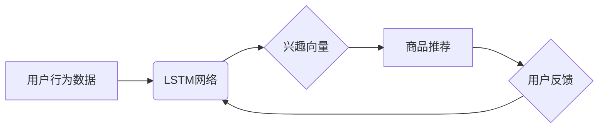

                 

## 电商推荐系统中的长短期兴趣建模

> 关键词：电商推荐系统、长短期记忆网络、兴趣建模、用户行为预测、个性化推荐

## 1. 背景介绍

在当今数据爆炸的时代，电商平台面临着海量用户和商品的挑战。如何精准地推荐用户感兴趣的商品，提升用户体验和转化率，成为电商平台的核心竞争力。推荐系统作为解决这一问题的关键技术，近年来发展迅速，其中兴趣建模扮演着至关重要的角色。

传统电商推荐系统主要依赖于用户的历史购买行为和商品的特征信息，但这些方法往往难以捕捉用户的动态变化和多层次兴趣。用户兴趣并非静态的，会随着时间推移、环境变化和新信息的获取而发生演变。因此，需要构建更智能、更精准的兴趣建模方法，以更好地理解用户的长短期兴趣，提供更个性化的商品推荐。

## 2. 核心概念与联系

### 2.1 兴趣建模

兴趣建模是指通过分析用户的行为数据、偏好信息等，构建用户兴趣的数学模型，并将其应用于推荐系统中，以预测用户对商品的潜在兴趣。

### 2.2 长短期记忆网络 (LSTM)

长短期记忆网络是一种特殊的循环神经网络 (RNN)，能够有效地学习序列数据中的长期依赖关系。它通过引入门控机制，控制信息的流动，从而克服了传统 RNN 在处理长序列数据时容易出现的梯度消失问题。

### 2.3 核心架构

电商推荐系统中的长短期兴趣建模通常采用 LSTM 网络作为核心算法，结合用户行为数据、商品特征信息等构建多层级兴趣模型。



## 3. 核心算法原理 & 具体操作步骤

### 3.1 算法原理概述

LSTM 网络的核心思想是通过门控机制控制信息的流动，学习序列数据中的长期依赖关系。它包含三个主要门控：输入门、遗忘门和输出门。

* **输入门:** 控制新信息的输入，决定哪些信息会被添加到细胞状态中。
* **遗忘门:** 控制旧信息的遗忘，决定哪些信息会被从细胞状态中移除。
* **输出门:** 控制细胞状态中信息的输出，决定哪些信息会被传递到下一个时间步。

通过这些门控机制，LSTM 网络能够有效地捕捉序列数据中的长期依赖关系，并生成更准确的兴趣向量。

### 3.2 算法步骤详解

1. **数据预处理:** 将用户行为数据和商品特征信息进行清洗、转换和编码，使其适合 LSTM 网络的输入。
2. **模型构建:** 使用深度学习框架 (如 TensorFlow 或 PyTorch) 搭建 LSTM 网络模型，并设置网络结构、参数等。
3. **模型训练:** 使用训练数据训练 LSTM 网络模型，通过反向传播算法优化模型参数，使其能够准确地预测用户的兴趣。
4. **模型评估:** 使用测试数据评估模型的性能，并根据评估结果进行模型调优。
5. **模型部署:** 将训练好的模型部署到线上环境，用于实时推荐商品。

### 3.3 算法优缺点

**优点:**

* 能够有效地捕捉用户行为序列中的长期依赖关系。
* 能够学习用户多层次的兴趣，包括短期兴趣和长期兴趣。
* 性能优于传统基于规则或协同过滤的推荐算法。

**缺点:**

* 训练时间较长，需要大量的计算资源。
* 对数据质量要求较高，需要高质量的训练数据。
* 模型解释性较差，难以理解模型的决策过程。

### 3.4 算法应用领域

* **电商推荐:** 推荐商品、优惠券、广告等。
* **内容推荐:** 推荐新闻、视频、音乐等。
* **社交推荐:** 推荐好友、群组、活动等。
* **医疗推荐:** 推荐药物、治疗方案等。

## 4. 数学模型和公式 & 详细讲解 & 举例说明

### 4.1 数学模型构建

LSTM 网络的数学模型可以表示为一个循环神经网络，其中每个时间步的输出依赖于前一个时间步的输出和当前时间步的输入。

假设用户行为序列为 $x_1, x_2, ..., x_T$，其中 $x_t$ 表示用户在时间步 $t$ 的行为。LSTM 网络的输出为 $h_1, h_2, ..., h_T$，其中 $h_t$ 表示用户在时间步 $t$ 的兴趣向量。

### 4.2 公式推导过程

LSTM 网络的具体公式推导过程较为复杂，涉及到矩阵运算、激活函数等。这里只列出核心公式，详细推导过程可以参考相关文献。

* **输入门:** $i_t = \sigma(W_{xi}x_t + W_{hi}h_{t-1} + b_i)$
* **遗忘门:** $f_t = \sigma(W_{xf}x_t + W_{hf}h_{t-1} + b_f)$
* **细胞状态更新:** $C_t = f_t * C_{t-1} + i_t * \tanh(W_{xc}x_t + W_{hc}h_{t-1} + b_c)$
* **输出门:** $o_t = \sigma(W_{xo}x_t + W_{ho}h_{t-1} + b_o)$
* **输出:** $h_t = o_t * \tanh(C_t)$

其中，$\sigma$ 表示 sigmoid 函数，$\tanh$ 表示 hyperbolic tangent 函数，$W$ 表示权重矩阵，$b$ 表示偏置项。

### 4.3 案例分析与讲解

假设用户在电商平台上浏览了以下商品：

* 时间步 1: 手机
* 时间步 2: 耳机
* 时间步 3: 电脑
* 时间步 4: 游戏

通过 LSTM 网络，可以学习到用户的兴趣向量，并根据兴趣向量预测用户对未来商品的兴趣。例如，根据用户的浏览历史，LSTM 网络可能会预测用户对笔记本电脑、游戏手柄等商品感兴趣。

## 5. 项目实践：代码实例和详细解释说明

### 5.1 开发环境搭建

* Python 3.x
* TensorFlow 或 PyTorch
* Jupyter Notebook

### 5.2 源代码详细实现

```python
import tensorflow as tf

# 定义 LSTM 网络模型
model = tf.keras.Sequential([
    tf.keras.layers.Embedding(input_dim=vocab_size, output_dim=embedding_dim),
    tf.keras.layers.LSTM(units=128),
    tf.keras.layers.Dense(units=num_classes, activation='softmax')
])

# 编译模型
model.compile(optimizer='adam',
              loss='sparse_categorical_crossentropy',
              metrics=['accuracy'])

# 训练模型
model.fit(x_train, y_train, epochs=10, batch_size=32)

# 评估模型
loss, accuracy = model.evaluate(x_test, y_test)
print('Loss:', loss)
print('Accuracy:', accuracy)
```

### 5.3 代码解读与分析

* **Embedding 层:** 将用户行为序列转换为稠密的向量表示。
* **LSTM 层:** 学习用户行为序列中的长期依赖关系，生成兴趣向量。
* **Dense 层:** 将兴趣向量映射到商品类别概率分布。
* **编译模型:** 设置优化器、损失函数和评价指标。
* **训练模型:** 使用训练数据训练 LSTM 网络模型。
* **评估模型:** 使用测试数据评估模型的性能。

### 5.4 运行结果展示

训练完成后，可以将模型部署到线上环境，用于实时推荐商品。

## 6. 实际应用场景

### 6.1 个性化商品推荐

根据用户的长短期兴趣，推荐个性化的商品，提高用户体验和转化率。

### 6.2 内容推荐

根据用户的兴趣偏好，推荐相关的新闻、视频、音乐等内容，增强用户粘性和参与度。

### 6.3 用户画像构建

通过分析用户的长短期兴趣，构建用户画像，为用户提供更精准的个性化服务。

### 6.4 未来应用展望

随着人工智能技术的不断发展，长短期兴趣建模在电商推荐系统中的应用将更加广泛和深入。

* **多模态兴趣建模:** 将文本、图像、视频等多模态数据融合到兴趣建模中，构建更全面的用户兴趣模型。
* **动态兴趣建模:** 结合实时用户行为数据，动态更新用户的兴趣模型，提供更精准的实时推荐。
* **跨平台兴趣建模:** 将用户在不同平台的兴趣信息整合到一起，构建跨平台的用户兴趣模型，提供更个性化的跨平台服务。

## 7. 工具和资源推荐

### 7.1 学习资源推荐

* **书籍:**
    * Deep Learning by Ian Goodfellow, Yoshua Bengio, and Aaron Courville
    * Hands-On Machine Learning with Scikit-Learn, Keras & TensorFlow by Aurélien Géron
* **在线课程:**
    * TensorFlow Tutorials: https://www.tensorflow.org/tutorials
    * PyTorch Tutorials: https://pytorch.org/tutorials/

### 7.2 开发工具推荐

* **深度学习框架:** TensorFlow, PyTorch
* **数据处理工具:** Pandas, NumPy
* **可视化工具:** Matplotlib, Seaborn

### 7.3 相关论文推荐

* **Long Short-Term Memory Recurrent Neural Networks for Sequence Learning** by Hochreiter and Schmidhuber (1997)
* **Recurrent Neural Networks for Sequence Modeling** by Graves (2012)
* **Attention Is All You Need** by Vaswani et al. (2017)

## 8. 总结：未来发展趋势与挑战

### 8.1 研究成果总结

长短期兴趣建模在电商推荐系统中取得了显著的成果，能够有效地提升推荐精准度和用户体验。

### 8.2 未来发展趋势

未来，长短期兴趣建模将朝着以下方向发展:

* **多模态兴趣建模:** 将文本、图像、视频等多模态数据融合到兴趣建模中，构建更全面的用户兴趣模型。
* **动态兴趣建模:** 结合实时用户行为数据，动态更新用户的兴趣模型，提供更精准的实时推荐。
* **跨平台兴趣建模:** 将用户在不同平台的兴趣信息整合到一起，构建跨平台的用户兴趣模型，提供更个性化的跨平台服务。

### 8.3 面临的挑战

长短期兴趣建模也面临着一些挑战:

* **数据质量:** 训练高质量的兴趣模型需要大量的优质数据，而数据获取和清洗成本较高。
* **模型解释性:** LSTM 网络的决策过程较为复杂，难以解释模型的推荐结果，这可能会影响用户的信任度。
* **计算资源:** 训练大型 LSTM 网络模型需要大量的计算资源，这可能会限制模型的规模和性能。

### 8.4 研究展望

未来，需要进一步研究如何解决上述挑战，构建更智能、更精准、更可解释的兴趣建模方法，为用户提供更个性化、更满意的服务。

## 9. 附录：常见问题与解答

### 9.1 如何选择 LSTM 网络的超参数？

LSTM 网络的超参数包括隐藏单元个数、学习率、批处理大小等。选择超参数需要根据具体的数据集和任务进行调整，可以使用交叉验证等方法进行调优。

### 9.2 如何处理用户行为序列中的缺失数据？

用户行为序列中可能存在缺失数据，可以使用多种方法进行处理，例如：

* **删除缺失数据:** 如果缺失数据量较少，可以考虑删除缺失数据。
* **填充缺失数据:** 使用平均值、中位数等方法填充缺失数据。
* **使用嵌入层:** 使用嵌入层将用户行为序列转换为稠密的向量表示，可以有效地处理缺失数据。

### 9.3 如何评估 LSTM 网络的性能？

可以使用准确率、召回率、F1-score等指标评估 LSTM 网络的性能。

作者：禅与计算机程序设计艺术 / Zen and the Art of Computer Programming


<end_of_turn>

