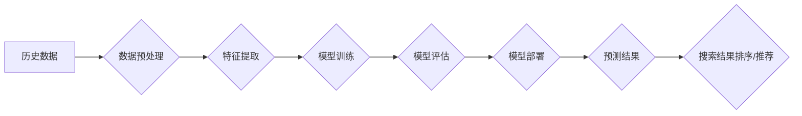

                 

## 电商搜索中的AI时间序列分析技术

> 关键词：电商搜索、时间序列分析、AI预测、推荐系统、用户行为分析、趋势挖掘、机器学习

## 1. 背景介绍

在当今数据爆炸的时代，电商平台面临着海量用户行为数据的挑战。如何有效地分析这些数据，洞察用户需求，并提供个性化推荐和精准搜索体验，成为电商平台发展的重要课题。时间序列分析作为一种强大的数据挖掘技术，能够从历史数据中识别出潜在的模式和趋势，为电商搜索提供重要的决策支持。

电商搜索系统通常需要处理以下关键问题：

* **商品推荐:** 根据用户的历史浏览、购买、收藏等行为，推荐相关的商品。
* **搜索结果排序:** 根据用户的搜索关键词和历史行为，对搜索结果进行排序，提升用户搜索体验。
* **趋势预测:** 分析商品销量、搜索热度等时间序列数据，预测未来商品需求和趋势。
* **异常检测:** 识别异常的搜索行为或商品销量波动，及时进行预警和处理。

传统的电商搜索系统主要依赖于基于规则的算法和人工特征工程，难以有效地处理海量数据和复杂的用户行为模式。随着人工智能技术的快速发展，基于机器学习的AI时间序列分析技术逐渐成为电商搜索领域的新宠。

## 2. 核心概念与联系

时间序列分析的核心是识别数据随时间变化的规律和模式。在电商搜索领域，时间序列数据通常包括商品销量、搜索热度、用户点击率、转化率等指标。

**2.1 时间序列分析的要素**

* **时间维度:** 时间序列数据具有时间顺序性，分析时需要考虑时间因素的影响。
* **趋势:** 指时间序列数据随时间变化的总体方向，例如上升趋势、下降趋势或稳定趋势。
* **季节性:** 指时间序列数据在特定时间周期内重复出现的周期性波动，例如每天的峰值流量、每周的周末流量高峰。
* **随机性:** 指时间序列数据中不可预测的波动，通常由外部因素或随机事件引起。

**2.2 AI时间序列分析技术架构**



**2.3 AI时间序列分析技术与电商搜索的联系**

AI时间序列分析技术可以应用于电商搜索的多个环节，例如：

* **商品推荐:** 根据用户的历史购买和浏览记录，预测用户未来可能感兴趣的商品，并进行个性化推荐。
* **搜索结果排序:** 根据商品的销量、搜索热度等时间序列数据，对搜索结果进行排序，提升用户搜索体验。
* **趋势预测:** 分析商品销量、搜索热度等时间序列数据，预测未来商品需求和趋势，帮助电商平台进行库存管理和商品开发。

## 3. 核心算法原理 & 具体操作步骤

### 3.1  算法原理概述

时间序列分析算法主要分为以下几类：

* **均值移动法:** 通过计算滑动窗口内的平均值，平滑时间序列数据，去除短期波动。
* **指数平滑法:** 给予最近的数据更高的权重，对时间序列数据进行加权平均，更能反映数据最新的变化趋势。
* **ARIMA模型:** 是一种基于自回归、移动平均和季节性成分的统计模型，能够捕捉时间序列数据的复杂性，并进行准确的预测。
* **Prophet模型:** 由Facebook开发的开源时间序列预测模型，能够处理具有季节性、趋势和异常值的复杂时间序列数据。

### 3.2  算法步骤详解

以ARIMA模型为例，其具体操作步骤如下：

1. **数据预处理:** 清洗数据，处理缺失值，对数据进行标准化或归一化处理。
2. **特征提取:** 计算时间序列数据的自相关系数和偏自相关系数，确定模型的AR、I、MA参数。
3. **模型训练:** 使用训练数据训练ARIMA模型，确定模型参数。
4. **模型评估:** 使用测试数据评估模型的预测精度，例如使用均方误差 (MSE) 或平均绝对误差 (MAE) 作为评价指标。
5. **模型部署:** 将训练好的模型部署到生产环境中，用于预测未来时间序列数据。

### 3.3  算法优缺点

**ARIMA模型:**

* **优点:** 能够捕捉时间序列数据的复杂性，预测精度较高。
* **缺点:** 需要大量的历史数据进行训练，对数据质量要求较高，参数选择较为复杂。

**Prophet模型:**

* **优点:** 能够处理具有季节性、趋势和异常值的复杂时间序列数据，参数选择相对简单。
* **缺点:** 预测精度可能不如ARIMA模型高。

### 3.4  算法应用领域

时间序列分析算法广泛应用于以下领域：

* **金融:** 股票价格预测、风险管理、投资策略制定。
* **电商:** 商品推荐、搜索结果排序、趋势预测、库存管理。
* **医疗:** 病人预警、疾病诊断、药物研发。
* **气象:** 天气预报、气候变化研究。

## 4. 数学模型和公式 & 详细讲解 & 举例说明

### 4.1  数学模型构建

ARIMA模型的数学模型可以表示为：

$$
\phi(B)y_t = \theta(B)a_t + c_t
$$

其中：

* $y_t$ 表示时间序列数据在时间t处的观测值。
* $a_t$ 表示白噪声序列，满足均值为0、方差为$\sigma^2$的独立同分布假设。
* $\phi(B)$ 和 $\theta(B)$ 分别表示自回归 (AR) 和移动平均 (MA) 算子，$B$ 表示后移算子，即$B^k y_t = y_{t-k}$。
* $c_t$ 表示季节性成分。

### 4.2  公式推导过程

ARIMA模型的具体参数选择需要根据时间序列数据的特征进行调整。常用的方法包括：

* **自相关函数 (ACF) 和偏自相关函数 (PACF):** 通过分析ACF和PACF图，可以确定AR和MA模型的阶数。
* **信息准则:** 例如AIC、BIC等信息准则可以用于比较不同ARIMA模型的拟合效果，选择最优模型。

### 4.3  案例分析与讲解

假设我们想要预测某商品的未来销量，并已收集到该商品过去一年的销量数据。我们可以使用ARIMA模型进行预测。

1. **数据预处理:** 清洗数据，处理缺失值，对数据进行标准化处理。
2. **特征提取:** 计算销量数据的ACF和PACF图，确定AR和MA模型的阶数。
3. **模型训练:** 使用训练数据训练ARIMA模型，确定模型参数。
4. **模型评估:** 使用测试数据评估模型的预测精度，例如使用MSE或MAE作为评价指标。
5. **模型部署:** 将训练好的模型部署到生产环境中，用于预测未来商品销量。

## 5. 项目实践：代码实例和详细解释说明

### 5.1  开发环境搭建

* Python 3.x
* pandas
* statsmodels
* matplotlib

### 5.2  源代码详细实现

```python
import pandas as pd
from statsmodels.tsa.arima.model import ARIMA
from sklearn.metrics import mean_squared_error

# 加载数据
data = pd.read_csv('sales_data.csv', index_col='Date')

# 数据预处理
data = data['Sales'].dropna()

# 模型训练
model = ARIMA(data, order=(5, 1, 0))
model_fit = model.fit()

# 模型预测
predictions = model_fit.predict(start=len(data), end=len(data)+30)

# 模型评估
rmse = mean_squared_error(data.values[-30:], predictions, squared=False)
print('RMSE:', rmse)

# 可视化结果
plt.plot(data.values[-30:], label='Actual')
plt.plot(predictions, label='Predicted')
plt.legend()
plt.show()
```

### 5.3  代码解读与分析

* 首先，我们使用pandas库加载数据，并使用statsmodels库的ARIMA模型进行训练。
* 模型的阶数 (p, d, q) 需要根据数据的特征进行确定，可以使用ACF和PACF图进行分析。
* 训练完成后，我们可以使用模型进行预测，并使用RMSE作为评价指标。
* 最后，我们可以使用matplotlib库可视化预测结果和实际值。

### 5.4  运行结果展示

运行代码后，会输出RMSE值，并生成一个图表，展示预测结果和实际值之间的差异。

## 6. 实际应用场景

### 6.1  商品推荐

电商平台可以利用AI时间序列分析技术，分析用户的浏览、购买、收藏等历史行为数据，预测用户未来可能感兴趣的商品，并进行个性化推荐。例如，如果用户经常购买运动鞋，那么系统可以推荐类似的运动服、运动背包等商品。

### 6.2  搜索结果排序

电商平台可以利用AI时间序列分析技术，分析商品的销量、搜索热度等数据，对搜索结果进行排序，提升用户搜索体验。例如，如果某个商品的销量和搜索热度较高，那么系统会将该商品排在搜索结果的前面。

### 6.3  趋势预测

电商平台可以利用AI时间序列分析技术，预测未来商品需求和趋势，帮助平台进行库存管理和商品开发。例如，如果系统预测某个商品的销量将在未来几个月内大幅增长，那么平台可以增加该商品的库存，以满足用户需求。

### 6.4  未来应用展望

随着人工智能技术的不断发展，AI时间序列分析技术在电商搜索领域的应用将更加广泛和深入。例如，未来可能出现以下应用场景：

* **个性化搜索:** 根据用户的历史行为和实时上下文信息，提供更加个性化的搜索结果。
* **动态价格调整:** 根据商品的销量、竞争对手的价格等数据，动态调整商品价格，提高平台的盈利能力。
* **智能客服:** 利用AI时间序列分析技术，分析用户咨询的趋势和问题，提供更加智能和高效的客服服务。

## 7. 工具和资源推荐

### 7.1  学习资源推荐

* **书籍:**
    * 《时间序列分析与预测》
    * 《机器学习实战》
* **在线课程:**
    * Coursera: Time Series Analysis
    * edX: Machine Learning

### 7.2  开发工具推荐

* **Python:** 
    * pandas
    * statsmodels
    * scikit-learn
    * matplotlib
* **R:** 
    * forecast
    * ggplot2

### 7.3  相关论文推荐

* **ARIMA模型:**
    * Box, G. E. P., & Jenkins, G. M. (1976). Time series analysis: Forecasting and control. Holden-Day.
* **Prophet模型:**
    * Taylor, J. W., & Letham, C. (2017). Forecasting at scale. Proceedings of the 31st International Conference on Neural Information Processing Systems (NeurIPS), 3605-3614.

## 8. 总结：未来发展趋势与挑战

### 8.1  研究成果总结

AI时间序列分析技术在电商搜索领域取得了显著的成果，能够有效地提升商品推荐、搜索结果排序、趋势预测等方面的效果。

### 8.2  未来发展趋势

* **深度学习:** 将深度学习技术应用于时间序列分析，提高预测精度和处理复杂数据的能力。
* **强化学习:** 利用强化学习技术，训练智能代理，自动优化时间序列分析模型的参数。
* **联邦学习:** 在保护用户隐私的前提下，利用联邦学习技术，协同训练时间序列分析模型。

### 8.3  面临的挑战

* **数据质量:** 时间序列数据的质量直接影响模型的预测精度，需要不断完善数据清洗和预处理技术。
* **模型 interpretability:** 深度学习模型的复杂性使得其难以解释，需要开发更加可解释的时间序列分析模型。
* **实时性:** 随着电商平台的快速发展，需要开发更加实时高效的时间序列分析算法，以满足用户的实时需求。

### 8.4  研究展望

未来，AI时间序列分析技术将继续朝着更加智能、高效、可解释的方向发展，为电商搜索提供更加精准、个性化的服务。


## 9. 附录：常见问题与解答

**Q1: ARIMA模型的阶数 (p, d, q) 如何确定？**

**A1:** 可以通过分析ACF和PACF图，确定AR和MA模型的阶数。

**Q2: 如何评估时间序列分析模型的预测精度？**

**A2:** 可以使用RMSE、MAE等指标作为评价指标。

**Q3: 如何处理时间序列数据中的缺失值？**

**A3:** 可以使用插值法、平均法等方法进行处理。


作者：禅与计算机程序设计艺术 / Zen and the Art of Computer Programming 
<end_of_turn>

