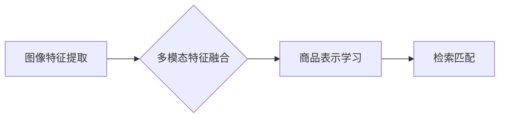

                 

## 电商搜索中的多模态商品检索：图文融合的深度学习模型

> 关键词：电商搜索、多模态检索、深度学习、图文融合、商品检索、视觉语义、BERT、CNN、Transformer

## 1. 背景介绍

随着电商平台的蓬勃发展，商品检索已成为用户获取所需商品的关键环节。传统的基于文本关键词的商品检索方式存在着局限性，难以准确理解用户意图，尤其在面对复杂、多样的商品描述和用户搜索需求时，效果往往不佳。

多模态商品检索旨在利用商品的多模态信息，如图像、文本、视频等，构建更全面的商品表示，提升检索的准确性和效率。图文融合作为一种重要的多模态检索技术，通过结合商品图像和文本信息，可以更深入地理解商品的特征和用户需求，从而实现更精准的商品匹配。

## 2. 核心概念与联系

### 2.1  多模态检索

多模态检索是指利用多种模态信息进行检索的任务。在电商搜索场景中，常见的模态信息包括：

* **文本模态:** 商品标题、描述、属性等文本信息。
* **图像模态:** 商品图片、视频截图等视觉信息。
* **音频模态:** 商品语音描述、用户评论等音频信息。

多模态检索的目标是学习不同模态之间的语义关联，构建一个统一的商品表示，从而实现跨模态的检索。

### 2.2  图文融合

图文融合是指将图像和文本信息进行结合，构建更丰富的商品表示。

**图文融合的优势:**

* **提升检索准确性:** 图像信息可以提供更直观的商品特征，弥补文本信息描述不足的缺陷。
* **增强用户体验:** 多模态检索可以提供更丰富的搜索结果，帮助用户更快速、更准确地找到所需商品。

**图文融合的挑战:**

* **模态间语义鸿沟:** 图像和文本信息表达方式不同，难以直接融合。
* **数据标注难度:** 多模态数据标注成本高，数据质量难以保证。

### 2.3  深度学习模型

深度学习模型在多模态检索领域取得了显著进展，能够有效学习图像和文本之间的语义关联。常见的深度学习模型包括：

* **CNN (卷积神经网络):** 用于提取图像特征。
* **RNN (循环神经网络):** 用于处理文本序列信息。
* **Transformer:** 用于捕捉图像和文本之间的长距离依赖关系。

**Mermaid 流程图:**



## 3. 核心算法原理 & 具体操作步骤

### 3.1  算法原理概述

图文融合的深度学习模型通常采用以下步骤进行商品检索：

1. **图像特征提取:** 使用CNN模型提取商品图像的特征表示。
2. **文本特征提取:** 使用BERT等预训练语言模型提取商品文本信息的特征表示。
3. **多模态特征融合:** 将图像特征和文本特征进行融合，构建一个统一的商品表示。
4. **商品表示学习:** 使用深度学习模型学习商品表示之间的语义关联。
5. **检索匹配:** 根据用户查询进行检索，匹配最相关的商品。

### 3.2  算法步骤详解

1. **图像特征提取:**

   * 使用预训练的CNN模型 (例如 ResNet, VGG) 对商品图像进行卷积操作，提取图像特征。
   * 将提取到的特征进行降维处理，得到一个固定长度的特征向量。

2. **文本特征提取:**

   * 使用预训练的语言模型 (例如 BERT, RoBERTa) 对商品文本信息进行编码，得到文本特征向量。
   * 可以使用不同的BERT模型，例如针对电商场景的BERT模型，以获得更精准的文本特征。

3. **多模态特征融合:**

   * 常见的融合方法包括：
     * **Early Fusion:** 将图像特征和文本特征直接拼接，作为输入到后续模型中。
     * **Late Fusion:** 将图像特征和文本特征分别输入到独立的模型中，得到各自的特征表示，然后进行融合。
     * **Attention Fusion:** 使用注意力机制学习图像特征和文本特征之间的权重，进行融合。

4. **商品表示学习:**

   * 使用深度学习模型 (例如 Transformer) 学习商品表示之间的语义关联。
   * 可以使用多模态自编码器 (例如 MoCo) 学习商品的隐式表示。

5. **检索匹配:**

   * 使用余弦相似度等距离度量方法计算用户查询与商品表示之间的相似度。
   * 根据相似度排序，返回最相关的商品。

### 3.3  算法优缺点

**优点:**

* 能够利用商品的多模态信息，提升检索准确性。
* 能够提供更丰富的搜索结果，增强用户体验。

**缺点:**

* 数据标注难度大，数据质量难以保证。
* 模型训练复杂，需要大量的计算资源。

### 3.4  算法应用领域

* **电商搜索:** 提升商品检索的准确性和效率。
* **图像识别:** 利用文本信息辅助图像识别。
* **视频理解:** 利用文本信息辅助视频理解。
* **问答系统:** 利用多模态信息进行更精准的回答。

## 4. 数学模型和公式 & 详细讲解 & 举例说明

### 4.1  数学模型构建

图文融合的深度学习模型通常采用以下数学模型进行构建:

* **图像特征提取:** 使用CNN模型，通过卷积、池化等操作，将图像转换为特征向量。

* **文本特征提取:** 使用BERT等预训练语言模型，通过词嵌入、注意力机制等操作，将文本转换为特征向量。

* **多模态特征融合:** 使用注意力机制、拼接等方法，将图像特征和文本特征融合为统一的商品表示。

* **商品表示学习:** 使用Transformer等深度学习模型，学习商品表示之间的语义关联。

### 4.2  公式推导过程

**注意力机制:**

注意力机制可以学习图像特征和文本特征之间的权重，进行融合。

$$
\text{Attention}(Q, K, V) = \text{softmax}\left(\frac{Q K^T}{\sqrt{d_k}}\right) V
$$

其中:

* $Q$ 是查询向量。
* $K$ 是键向量。
* $V$ 是值向量。
* $d_k$ 是键向量的维度。

**Transformer:**

Transformer模型使用多头注意力机制和前馈神经网络，学习图像和文本之间的长距离依赖关系。

### 4.3  案例分析与讲解

**案例:**

假设用户搜索“红色长款外套”，系统需要从商品库中找到最相关的商品。

**分析:**

* **图像特征:** 系统会提取商品图像中的颜色、款式、长度等特征。
* **文本特征:** 系统会提取商品标题、描述中的关键词，例如“红色”、“长款”、“外套”。
* **多模态融合:** 系统会使用注意力机制，学习图像特征和文本特征之间的权重，构建一个统一的商品表示。
* **检索匹配:** 系统会计算用户查询与商品表示之间的相似度，返回最相关的商品。

## 5. 项目实践：代码实例和详细解释说明

### 5.1  开发环境搭建

* **操作系统:** Ubuntu 18.04
* **深度学习框架:** PyTorch 1.7.1
* **其他依赖:** torchvision, transformers, numpy, pandas

### 5.2  源代码详细实现

```python
# 图像特征提取
import torch
import torchvision.models as models

# 使用预训练的ResNet模型提取图像特征
resnet = models.resnet50(pretrained=True)
resnet.fc = torch.nn.Identity()

# 文本特征提取
from transformers import AutoTokenizer, AutoModel

# 使用预训练的BERT模型提取文本特征
tokenizer = AutoTokenizer.from_pretrained("bert-base-uncased")
model = AutoModel.from_pretrained("bert-base-uncased")

# 多模态特征融合
def fuse_features(image_features, text_features):
    # 使用注意力机制融合图像特征和文本特征
    # ...

# 商品表示学习
# 使用Transformer模型学习商品表示之间的语义关联
# ...

# 检索匹配
def retrieve_products(query, product_features):
    # 计算用户查询与商品表示之间的相似度
    # ...
    # 返回最相关的商品
    # ...
```

### 5.3  代码解读与分析

* 图像特征提取部分使用预训练的ResNet模型，提取商品图像的特征表示。
* 文本特征提取部分使用预训练的BERT模型，提取商品文本信息的特征表示。
* 多模态特征融合部分使用注意力机制，学习图像特征和文本特征之间的权重，进行融合。
* 商品表示学习部分使用Transformer模型，学习商品表示之间的语义关联。
* 检索匹配部分计算用户查询与商品表示之间的相似度，返回最相关的商品。

### 5.4  运行结果展示

运行代码后，系统会根据用户查询，返回最相关的商品列表。

## 6. 实际应用场景

### 6.1  电商搜索

图文融合的深度学习模型可以应用于电商平台的商品搜索，提升商品检索的准确性和效率。

### 6.2  视觉问答

图文融合的深度学习模型可以应用于视觉问答系统，根据图像和文本信息回答用户的问题。

### 6.3  跨模态检索

图文融合的深度学习模型可以应用于跨模态检索，例如根据图像搜索相关的文本信息，或者根据文本搜索相关的图像信息。

### 6.4  未来应用展望

图文融合的深度学习模型在未来将有更广泛的应用场景，例如：

* **个性化推荐:** 根据用户的画像信息，推荐更符合用户需求的商品。
* **智能客服:** 利用图文融合技术，提高智能客服的理解能力和服务质量。
* **内容创作:** 利用图文融合技术，辅助内容创作，例如生成商品描述、撰写新闻报道等。

## 7. 工具和资源推荐

### 7.1  学习资源推荐

* **书籍:**

    * Deep Learning with Python
    * Hands-On Machine Learning with Scikit-Learn, Keras & TensorFlow

* **在线课程:**

    * Coursera: Deep Learning Specialization
    * Udacity: Deep Learning Nanodegree

### 7.2  开发工具推荐

* **深度学习框架:** PyTorch, TensorFlow
* **图像处理库:** OpenCV, Pillow
* **自然语言处理库:** NLTK, spaCy

### 7.3  相关论文推荐

* **Attention Is All You Need:** https://arxiv.org/abs/1706.03762
* **BERT: Pre-training of Deep Bidirectional Transformers for Language Understanding:** https://arxiv.org/abs/1810.04805
* **Multimodal Deep Learning: A Survey:** https://arxiv.org/abs/1903.00427

## 8. 总结：未来发展趋势与挑战

### 8.1  研究成果总结

图文融合的深度学习模型在电商搜索等领域取得了显著进展，能够有效提升检索的准确性和效率。

### 8.2  未来发展趋势

* **多模态数据增强:** 开发新的数据增强方法，提高多模态数据的质量和数量。
* **跨模态知识图谱:** 建立跨模态知识图谱，丰富商品的语义表示。
* **个性化多模态检索:** 开发个性化多模态检索模型，根据用户的偏好和需求进行定制化检索。

### 8.3  面临的挑战

* **模态间语义鸿沟:** 不同模态信息表达方式不同，难以直接融合。
* **数据标注难度:** 多模态数据标注成本高，数据质量难以保证。
* **模型训练复杂:** 多模态模型训练复杂，需要大量的计算资源。

### 8.4  研究展望

未来，图文融合的深度学习模型将继续朝着更精准、更智能、更个性化的方向发展，为用户提供更优质的商品检索体验。

## 9. 附录：常见问题与解答

**问题:**

* 图文融合的深度学习模型需要多少数据才能训练？

**解答:**

训练图文融合的深度学习模型需要大量的多模态数据，一般来说，需要至少几万条数据才能达到较好的效果。

* 图文融合的深度学习模型训练时间长吗？

**解答:**

图文融合的深度学习模型训练时间取决于模型复杂度、数据规模和硬件资源等因素，一般来说，训练时间可能需要几天到几周。

* 图文融合的深度学习模型的应用场景有哪些？

**解答:**

图文融合的深度学习模型的应用场景非常广泛，例如电商搜索、视觉问答、跨模态检索等。


作者：禅与计算机程序设计艺术 / Zen and the Art of Computer Programming 
<end_of_turn>

