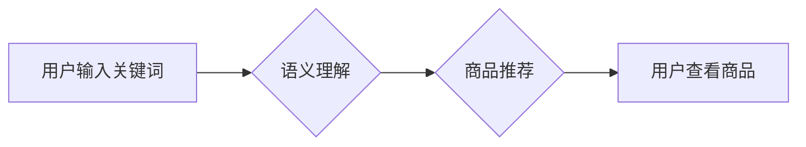

                 

## 电商搜索中的语义理解：AI大模型的优势

> 关键词：电商搜索、语义理解、AI大模型、自然语言处理、BERT、Transformer、推荐系统

## 1. 背景介绍

电商平台作为现代商业的重要组成部分，其搜索引擎扮演着至关重要的角色。用户通过搜索引擎输入关键词，期望找到与自身需求相匹配的商品。然而，传统的基于关键词匹配的搜索方式存在着诸多局限性，无法准确理解用户搜索意图，导致搜索结果不精准，用户体验下降。

随着人工智能技术的飞速发展，特别是深度学习技术的突破，语义理解在电商搜索领域得到了广泛应用。语义理解是指机器能够理解文本的深层含义，识别词语之间的关系和上下文语境，从而更准确地理解用户搜索意图。

AI大模型，作为深度学习技术的代表，凭借其强大的学习能力和泛化能力，在语义理解领域展现出巨大的优势。

## 2. 核心概念与联系

### 2.1 语义理解

语义理解是人工智能领域的核心研究方向之一，旨在使机器能够理解人类语言的深层含义。它涉及到多个子领域，包括：

* **词义消歧：** 识别词语在不同语境下的不同含义。
* **依存句法分析：** 分析句子结构，识别词语之间的关系。
* **文本蕴含：** 判断一个句子是否蕴含另一个句子。
* **情感分析：** 识别文本中表达的情感。

### 2.2 AI大模型

AI大模型是指在海量数据上训练的深度学习模型，具有强大的泛化能力和学习能力。常见的AI大模型包括：

* **BERT：** 基于Transformer架构的预训练语言模型，在自然语言理解任务上取得了突破性进展。
* **GPT-3：** 基于Transformer架构的文本生成模型，能够生成高质量的文本内容。
* **LaMDA：** 基于Transformer架构的对话模型，能够进行自然流畅的对话。

### 2.3 电商搜索

电商搜索是指用户在电商平台上输入关键词，期望找到与自身需求相匹配的商品的过程。传统的电商搜索主要基于关键词匹配，存在着以下问题：

* **缺乏语义理解：** 无法理解用户搜索意图的深层含义。
* **结果不精准：** 搜索结果可能包含与用户需求不匹配的商品。
* **用户体验差：** 用户需要多次搜索才能找到所需商品。

**Mermaid 流程图**



## 3. 核心算法原理 & 具体操作步骤

### 3.1 算法原理概述

AI大模型在电商搜索中的语义理解主要基于以下算法原理：

* **词嵌入：** 将词语映射到低维向量空间，捕捉词语之间的语义关系。
* **注意力机制：** 允许模型关注文本中重要的部分，提高对语义信息的理解能力。
* **Transformer架构：** 是一种新型的深度学习架构，能够有效处理长文本序列，并具有强大的语义理解能力。

### 3.2 算法步骤详解

1. **数据预处理：** 将用户搜索词和商品信息进行清洗、格式化和编码。
2. **词嵌入：** 使用预训练的词嵌入模型（如Word2Vec、GloVe）将词语映射到低维向量空间。
3. **语义表示构建：** 使用Transformer架构的模型（如BERT、RoBERTa）对用户搜索词进行编码，构建其语义表示。
4. **商品检索：** 将商品信息也进行编码，计算其与用户搜索词语义表示之间的相似度，并根据相似度排序商品。
5. **结果展示：** 将排序后的商品信息展示给用户。

### 3.3 算法优缺点

**优点：**

* **语义理解能力强：** 能够准确理解用户搜索意图的深层含义。
* **结果精准度高：** 搜索结果更符合用户需求。
* **用户体验提升：** 用户更容易找到所需商品。

**缺点：**

* **计算资源消耗大：** 训练和使用AI大模型需要大量的计算资源。
* **数据依赖性强：** 模型性能依赖于训练数据的质量和数量。
* **解释性差：** AI大模型的决策过程难以解释。

### 3.4 算法应用领域

* **电商搜索：** 提高搜索结果的精准度和用户体验。
* **问答系统：** 理解用户问题，并给出准确的答案。
* **机器翻译：** 准确翻译文本，保留语义信息。
* **文本摘要：** 生成文本的简洁摘要，保留关键信息。

## 4. 数学模型和公式 & 详细讲解 & 举例说明

### 4.1 数学模型构建

在语义理解任务中，常用的数学模型是基于Transformer架构的模型，其核心是注意力机制。注意力机制允许模型关注文本中重要的部分，提高对语义信息的理解能力。

**注意力机制公式：**

$$
\text{Attention}(Q, K, V) = \text{softmax}\left(\frac{QK^T}{\sqrt{d_k}}\right)V
$$

其中：

* $Q$：查询矩阵
* $K$：键矩阵
* $V$：值矩阵
* $d_k$：键向量的维度
* $\text{softmax}$：softmax函数，用于归一化注意力权重

### 4.2 公式推导过程

注意力机制的公式通过计算查询矩阵 $Q$ 与键矩阵 $K$ 的点积，并使用softmax函数归一化，得到注意力权重。然后，将注意力权重与值矩阵 $V$ 进行加权求和，得到最终的语义表示。

### 4.3 案例分析与讲解

假设我们有一个句子：“我爱吃苹果”。

* $Q$：查询向量，表示“我爱吃”的语义。
* $K$：键向量，表示每个词语的语义。
* $V$：值向量，表示每个词语的语义信息。

通过计算 $Q$ 与 $K$ 的点积，并使用softmax函数归一化，得到每个词语的注意力权重。例如，“苹果”的注意力权重可能较高，因为它是句子中最重要的信息。

然后，将注意力权重与 $V$ 进行加权求和，得到最终的语义表示，表示“我爱吃苹果”的整体语义。

## 5. 项目实践：代码实例和详细解释说明

### 5.1 开发环境搭建

* Python 3.6+
* TensorFlow 2.0+
* PyTorch 1.0+
* CUDA Toolkit (可选)

### 5.2 源代码详细实现

```python
# 使用BERT模型进行语义理解
from transformers import BertTokenizer, BertModel

# 加载预训练的BERT模型
tokenizer = BertTokenizer.from_pretrained('bert-base-uncased')
model = BertModel.from_pretrained('bert-base-uncased')

# 将用户搜索词和商品信息进行编码
user_query = "我要买一个红色的苹果"
product_description = "这是一个红色的苹果，很新鲜。"

input_ids_query = tokenizer.encode(user_query, add_special_tokens=True)
input_ids_description = tokenizer.encode(product_description, add_special_tokens=True)

# 将编码后的输入送入BERT模型
outputs_query = model(input_ids=input_ids_query)
outputs_description = model(input_ids=input_ids_description)

# 获取模型输出的语义表示
query_embedding = outputs_query.last_hidden_state[:, 0, :]
description_embedding = outputs_description.last_hidden_state[:, 0, :]

# 计算语义相似度
similarity = cosine_similarity(query_embedding, description_embedding)

# 打印相似度
print(similarity)
```

### 5.3 代码解读与分析

* 使用预训练的BERT模型进行语义理解。
* 将用户搜索词和商品信息进行编码，得到其语义表示。
* 计算语义表示之间的相似度，判断商品与用户搜索意图的匹配程度。

### 5.4 运行结果展示

运行代码后，会输出用户搜索词和商品描述之间的语义相似度。相似度越高，表示商品与用户搜索意图的匹配程度越高。

## 6. 实际应用场景

### 6.1 个性化推荐

AI大模型可以根据用户的搜索历史、浏览记录和购买行为，构建其个性化的语义模型，并推荐与用户兴趣相符的商品。

### 6.2 搜索结果排序

AI大模型可以根据商品与用户搜索词语义相似度，对搜索结果进行排序，提高搜索结果的精准度。

### 6.3 智能客服

AI大模型可以理解用户的自然语言问题，并给出准确的答案，提高智能客服的效率和用户体验。

### 6.4 未来应用展望

* **多模态搜索：** 将文本、图像、视频等多模态信息融合，实现更全面的语义理解。
* **跨语言搜索：** 支持多种语言的搜索，打破语言障碍。
* **实时语义理解：** 实现对实时语义流的理解，例如直播电商中的用户互动。

## 7. 工具和资源推荐

### 7.1 学习资源推荐

* **Stanford NLP Group:** https://nlp.stanford.edu/
* **Hugging Face:** https://huggingface.co/
* **OpenAI:** https://openai.com/

### 7.2 开发工具推荐

* **TensorFlow:** https://www.tensorflow.org/
* **PyTorch:** https://pytorch.org/
* **SpaCy:** https://spacy.io/

### 7.3 相关论文推荐

* **BERT: Pre-training of Deep Bidirectional Transformers for Language Understanding:** https://arxiv.org/abs/1810.04805
* **Attention Is All You Need:** https://arxiv.org/abs/1706.03762
* **XLNet: Generalized Autoregressive Pretraining for Language Understanding:** https://arxiv.org/abs/1906.08237

## 8. 总结：未来发展趋势与挑战

### 8.1 研究成果总结

AI大模型在电商搜索中的语义理解取得了显著进展，能够提高搜索结果的精准度和用户体验。

### 8.2 未来发展趋势

* **模型规模和能力的提升：** 训练更大规模的AI大模型，提高其语义理解能力。
* **多模态语义理解：** 将文本、图像、视频等多模态信息融合，实现更全面的语义理解。
* **个性化语义理解：** 根据用户的个性化需求，定制化语义理解模型。

### 8.3 面临的挑战

* **数据质量和数量：** AI大模型的性能依赖于训练数据的质量和数量。
* **计算资源消耗：** 训练和使用AI大模型需要大量的计算资源。
* **解释性问题：** AI大模型的决策过程难以解释，难以获得用户的信任。

### 8.4 研究展望

未来，研究者将继续探索新的AI大模型架构和训练方法，提高其语义理解能力和效率。同时，也将致力于解决AI大模型的解释性问题，使其能够更好地服务于用户。

## 9. 附录：常见问题与解答

**Q1：AI大模型的语义理解能力是否可以完全替代人类？**

A1：目前，AI大模型的语义理解能力虽然取得了显著进展，但仍无法完全替代人类。人类拥有更丰富的语言理解能力和常识知识，能够更好地理解复杂的语境和隐含信息。

**Q2：如何评估AI大模型的语义理解能力？**

A2：常用的评估指标包括准确率、召回率、F1-score等。此外，还可以通过人工标注和评估来评估模型的语义理解能力。

**Q3：如何提高AI大模型的语义理解能力？**

A3：可以通过以下方法提高AI大模型的语义理解能力：

* 使用更大规模的数据进行训练。
* 设计更复杂的模型架构。
* 使用更有效的训练方法。
* 结合其他知识源，例如词典、百科全书等。


作者：禅与计算机程序设计艺术 / Zen and the Art of Computer Programming 
<end_of_turn>

