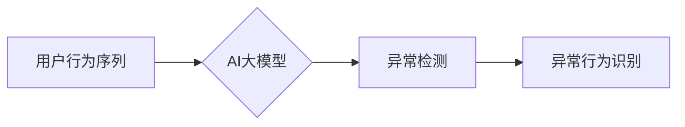

                 

## 电商搜索推荐中的AI大模型用户行为序列异常检测评估体系

> 关键词：电商搜索推荐、AI大模型、用户行为序列、异常检测、评估体系

## 1. 背景介绍

随着电商平台的蓬勃发展，用户行为数据呈指数级增长。这些数据蕴含着丰富的商业价值，为精准的搜索推荐提供了重要支撑。然而，用户行为数据中也可能存在异常值，例如恶意刷单、虚假交易等，这些异常值会对搜索推荐算法的准确性造成负面影响，甚至损害平台的声誉和利益。因此，如何有效地检测和处理用户行为序列中的异常值，成为电商平台安全运营和用户体验提升的关键问题。

传统的异常检测方法主要依赖于统计特征和规则匹配，但随着数据规模和复杂度的增加，这些方法难以有效地应对新的异常模式。近年来，随着深度学习技术的快速发展，基于AI大模型的用户行为序列异常检测方法逐渐成为研究热点。AI大模型能够学习用户行为数据中的复杂模式和潜在关系，并对异常行为进行更精准的识别。

## 2. 核心概念与联系

### 2.1 用户行为序列

用户行为序列是指用户在电商平台上进行一系列交互行为的记录，例如浏览商品、添加购物车、下单购买等。这些行为序列通常具有时间依赖性，用户在不同时间段的行为模式可能存在差异。

### 2.2 异常检测

异常检测是指从数据集中识别出与大多数数据点显著不同的数据点，这些数据点可能代表着异常行为或事件。

### 2.3 AI大模型

AI大模型是指具有海量参数和强大的学习能力的深度学习模型，例如Transformer、BERT等。

**核心概念与联系流程图**



## 3. 核心算法原理 & 具体操作步骤

### 3.1 算法原理概述

基于AI大模型的用户行为序列异常检测算法通常采用以下原理：

* **序列编码:** 将用户行为序列转换为模型可理解的向量表示，例如使用Word2Vec或BERT进行词嵌入，或使用LSTM/GRU等循环神经网络进行序列编码。
* **异常特征提取:** 利用AI大模型学习用户行为序列中的异常特征，例如行为模式的突变、时间间隔的异常、商品类别的不匹配等。
* **异常评分:** 为每个用户行为序列赋予一个异常评分，高分代表异常行为的可能性更大。
* **异常阈值设定:** 根据实际业务需求设定异常阈值，将异常评分高于阈值的序列标记为异常行为。

### 3.2 算法步骤详解

1. **数据预处理:** 对用户行为序列数据进行清洗、去噪、格式转换等预处理操作，确保数据质量。
2. **序列编码:** 使用合适的编码方法将用户行为序列转换为向量表示。
3. **模型训练:** 使用训练数据训练AI大模型，学习用户行为序列的正常模式和异常特征。
4. **异常特征提取:** 将训练好的AI大模型应用于新的用户行为序列数据，提取异常特征。
5. **异常评分计算:** 根据提取的异常特征，计算每个用户行为序列的异常评分。
6. **异常阈值设定:** 根据实际业务需求和异常评分分布，设定异常阈值。
7. **异常行为识别:** 将异常评分高于阈值的序列标记为异常行为。

### 3.3 算法优缺点

**优点:**

* 能够学习复杂的用户行为模式，识别新的异常模式。
* 具有较高的准确率和鲁棒性。
* 可以进行个性化的异常检测，针对不同用户群体设置不同的异常阈值。

**缺点:**

* 训练数据量大，需要大量的计算资源和时间。
* 模型解释性较差，难以理解模型是如何进行异常检测的。
* 对数据质量要求较高，数据噪声和偏差会影响模型性能。

### 3.4 算法应用领域

* **电商平台:** 检测恶意刷单、虚假交易、账号盗用等异常行为。
* **金融机构:** 检测信用卡欺诈、账户异常登录、资金转移异常等风险行为。
* **医疗机构:** 检测医疗数据异常、医疗设备故障、患者行为异常等潜在问题。
* **工业控制系统:** 检测设备故障、网络攻击、操作异常等安全威胁。

## 4. 数学模型和公式 & 详细讲解 & 举例说明

### 4.1 数学模型构建

假设用户行为序列为 $S = (s_1, s_2, ..., s_T)$，其中 $s_i$ 表示第 $i$ 个行为。可以使用循环神经网络（RNN）或Transformer等模型对序列进行编码，得到每个行为的隐藏状态向量 $h_i$。

### 4.2 公式推导过程

可以使用以下公式计算用户行为序列的异常评分：

$$
score(S) = \sum_{i=1}^{T} \alpha_i * ||h_i - \mu_h||^2
$$

其中：

* $score(S)$ 是用户行为序列的异常评分。
* $\alpha_i$ 是第 $i$ 个行为的权重，可以根据行为的重要性进行调整。
* $h_i$ 是第 $i$ 个行为的隐藏状态向量。
* $\mu_h$ 是所有行为隐藏状态向量的平均值。
* $||h_i - \mu_h||^2$ 是第 $i$ 个行为隐藏状态向量与平均向量的欧氏距离平方。

### 4.3 案例分析与讲解

例如，假设用户在电商平台上浏览了多个商品，但突然购买了一个价格异常高的商品，这可能代表着异常行为。

在该情况下，AI大模型可以学习到用户浏览商品的正常模式，并识别出该异常购买行为。

## 5. 项目实践：代码实例和详细解释说明

### 5.1 开发环境搭建

* Python 3.7+
* TensorFlow/PyTorch
* Jupyter Notebook

### 5.2 源代码详细实现

```python
import tensorflow as tf

# 定义用户行为序列编码模型
class SequenceEncoder(tf.keras.Model):
    def __init__(self, embedding_dim, hidden_dim):
        super(SequenceEncoder, self).__init__()
        self.embedding = tf.keras.layers.Embedding(input_dim=vocab_size, output_dim=embedding_dim)
        self.lstm = tf.keras.layers.LSTM(hidden_dim)

    def call(self, inputs):
        embedded = self.embedding(inputs)
        encoded = self.lstm(embedded)
        return encoded

# 定义异常评分模型
class AnomalyScoreModel(tf.keras.Model):
    def __init__(self, hidden_dim):
        super(AnomalyScoreModel, self).__init__()
        self.dense = tf.keras.layers.Dense(1)

    def call(self, inputs):
        scores = self.dense(inputs)
        return scores

# 训练模型
model = tf.keras.Sequential([
    SequenceEncoder(embedding_dim=128, hidden_dim=64),
    AnomalyScoreModel(hidden_dim=64)
])

model.compile(optimizer='adam', loss='mse')
model.fit(train_data, train_labels, epochs=10)

# 预测异常评分
predictions = model.predict(test_data)

# 设置异常阈值
threshold = 0.8

# 识别异常行为
anomaly_indices = np.where(predictions > threshold)[0]
```

### 5.3 代码解读与分析

* **SequenceEncoder:** 负责对用户行为序列进行编码，提取序列特征。
* **AnomalyScoreModel:** 负责计算用户行为序列的异常评分。
* **模型训练:** 使用训练数据训练模型，学习用户行为序列的正常模式和异常特征。
* **预测异常评分:** 将训练好的模型应用于新的用户行为序列数据，预测异常评分。
* **识别异常行为:** 根据预设的异常阈值，识别异常评分高于阈值的序列。

### 5.4 运行结果展示

运行结果展示包括预测的异常评分、识别出的异常行为序列以及相应的分析报告。

## 6. 实际应用场景

### 6.1 电商平台

* **刷单检测:** 识别恶意刷单行为，防止平台利益受损。
* **虚假交易检测:** 识别虚假交易行为，维护平台交易安全。
* **账号盗用检测:** 识别账号盗用行为，保护用户账户安全。

### 6.2 金融机构

* **信用卡欺诈检测:** 识别信用卡欺诈行为，防止资金损失。
* **账户异常登录检测:** 识别账户异常登录行为，防止账户被盗用。
* **资金转移异常检测:** 识别资金转移异常行为，防止资金被盗。

### 6.3 其他领域

* **医疗机构:** 检测医疗数据异常、医疗设备故障、患者行为异常等潜在问题。
* **工业控制系统:** 检测设备故障、网络攻击、操作异常等安全威胁。

### 6.4 未来应用展望

随着AI技术的不断发展，用户行为序列异常检测技术将更加智能化、自动化和个性化。未来，我们可以期待以下应用场景：

* **主动预警:** 基于AI模型的预测能力，提前预警潜在的异常行为，并提供相应的解决方案。
* **智能决策:** 将异常检测结果与其他业务数据结合，为决策者提供更精准的决策支持。
* **个性化服务:** 根据用户的异常行为特征，提供个性化的服务和建议，提升用户体验。

## 7. 工具和资源推荐

### 7.1 学习资源推荐

* **书籍:**
    * Deep Learning by Ian Goodfellow, Yoshua Bengio, and Aaron Courville
    * Natural Language Processing with Python by Steven Bird, Ewan Klein, and Edward Loper
* **在线课程:**
    * TensorFlow Tutorials: https://www.tensorflow.org/tutorials
    * PyTorch Tutorials: https://pytorch.org/tutorials/

### 7.2 开发工具推荐

* **TensorFlow:** https://www.tensorflow.org/
* **PyTorch:** https://pytorch.org/
* **Jupyter Notebook:** https://jupyter.org/

### 7.3 相关论文推荐

* **Anomaly Detection with Recurrent Neural Networks**
* **BERT: Pre-training of Deep Bidirectional Transformers for Language Understanding**
* **Attention Is All You Need**

## 8. 总结：未来发展趋势与挑战

### 8.1 研究成果总结

基于AI大模型的用户行为序列异常检测技术取得了显著进展，能够有效识别复杂异常行为，并具有较高的准确率和鲁棒性。

### 8.2 未来发展趋势

* **模型架构创新:** 研究更深、更广的AI模型架构，提升模型的学习能力和泛化能力。
* **数据增强:** 开发新的数据增强技术，提高训练数据的质量和多样性。
* **解释性增强:** 研究模型解释性技术，提高模型的可解释性和可信度。
* **边缘计算:** 将异常检测模型部署到边缘设备，实现实时异常检测。

### 8.3 面临的挑战

* **数据隐私保护:** 如何在保证数据隐私的前提下进行异常检测，是需要解决的关键问题。
* **模型可解释性:** 如何提高模型的解释性，让用户能够理解模型是如何进行异常检测的，也是一个重要的挑战。
* **模型部署成本:** 将大型AI模型部署到生产环境中，需要考虑部署成本和资源消耗。

### 8.4 研究展望

未来，基于AI大模型的用户行为序列异常检测技术将继续发展，并应用于更多领域，为社会带来更多价值。


## 9. 附录：常见问题与解答

**Q1: 如何选择合适的异常检测算法？**

**A1:** 选择合适的异常检测算法需要根据实际业务需求和数据特点进行综合考虑。例如，如果数据量较大，可以使用基于机器学习的算法，例如基于AI大模型的异常检测算法；如果数据量较小，可以使用基于统计特征的算法，例如Z-score法或IQR法。

**Q2: 如何设置异常阈值？**

**A2:** 异常阈值需要根据实际业务需求和异常评分分布进行设定。可以使用箱线图、分位数法等方法确定合适的阈值。

**Q3: 如何评估异常检测模型的性能？**

**A3:** 可以使用准确率、召回率、F1-score等指标评估异常检测模型的性能。

**Q4: 如何处理异常检测结果？**

**A4:** 处理异常检测结果需要根据实际情况进行制定策略，例如进行人工复核、采取相应的措施进行干预等。


作者：禅与计算机程序设计艺术 / Zen and the Art of Computer Programming 
<end_of_turn>

