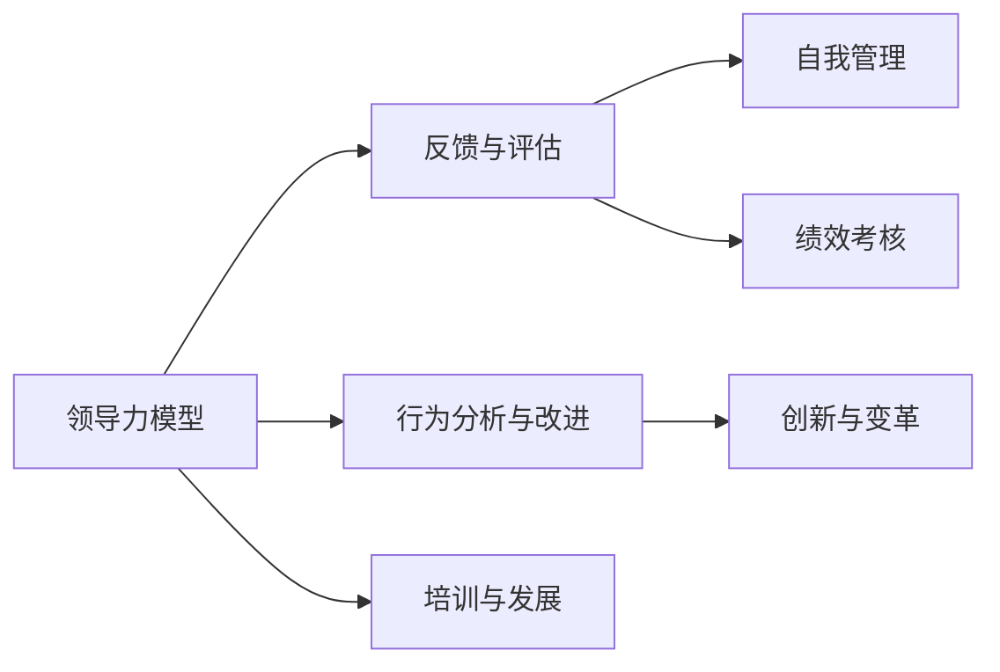

                 

# 构建个人领导力体系的方法论

领导力是一个复杂而多维度的概念，涵盖决策、沟通、激励、创新等多个方面。构建一个成熟的个人领导力体系，不仅能提升个人在职场上的竞争力，还能为团队和组织带来积极的影响。本文将详细探讨构建个人领导力体系的方法论，提供系统化的指导。

## 1. 背景介绍

### 1.1 问题由来

在快速变化的商业环境中，企业竞争日益激烈，领导力的重要性日益凸显。传统的领导力培养方式如传统课堂培训和“实战”经验积累，已无法满足现代复杂多变的领导环境需求。因此，需要一种更为系统、高效的方法论来指导个人领导力的构建。

### 1.2 问题核心关键点

构建个人领导力体系，需要明确几个核心关键点：

1. **目标设定**：领导力的构建应该围绕明确的职业目标和组织使命展开。
2. **能力提升**：包括决策能力、沟通能力、激励能力、创新能力等核心能力。
3. **反馈机制**：构建持续的反馈机制，确保领导力提升的持续性和有效性。
4. **行为修正**：通过行为分析和修正，不断提升领导效果。
5. **自我管理**：包括时间管理、压力管理、情绪管理等，提升整体领导素质。

## 2. 核心概念与联系

### 2.1 核心概念概述

构建个人领导力体系涉及多个核心概念，主要包括：

- **领导力模型**：定义领导力的核心能力维度，如麦肯锡7S模型、约翰·马克斯韦尔的领导力5个层次等。
- **反馈与评估**：持续的反馈与评估机制，确保领导力的不断提升。
- **行为分析与改进**：通过行为分析，识别改进点，提升领导效果。
- **自我管理**：包括时间管理、情绪管理等，提升整体素质。
- **创新与变革**：推动组织创新和变革，提升领导影响力。

这些核心概念之间具有密切联系，形成一个系统化的领导力构建框架。

### 2.2 核心概念原理和架构的 Mermaid 流程图



## 3. 核心算法原理 & 具体操作步骤

### 3.1 算法原理概述

构建个人领导力体系的过程，可以视为一个循环迭代的优化过程。通过对领导力的各个维度进行系统评估和反馈，不断调整和改进，最终形成一套成熟的领导力体系。其核心算法原理包括以下几个步骤：

1. **目标设定与评估**：明确职业目标，设定领导力提升的KPI指标。
2. **行为分析与改进**：通过360度反馈、自我评估等方式，识别行为改进点。
3. **能力提升**：根据改进点，制定具体的培训与发展计划。
4. **反馈与调整**：持续收集反馈，调整提升计划，确保目标达成。

### 3.2 算法步骤详解

1. **目标设定与评估**：
    - **目标设定**：明确职业目标，如晋升为部门经理、成为行业领袖等。
    - **指标评估**：设定具体的KPI指标，如团队绩效、员工满意度等。

2. **行为分析与改进**：
    - **360度反馈**：收集上级、下级、同事的反馈，识别领导力的优点和不足。
    - **自我评估**：通过问卷、心理测评等方式，进行自我评估。
    - **行为改进**：根据反馈和评估结果，制定具体的行为改进计划。

3. **能力提升**：
    - **培训与发展**：选择合适的培训课程和导师，提升关键能力。
    - **实践应用**：将所学知识应用于实际工作中，验证效果。

4. **反馈与调整**：
    - **持续反馈**：定期收集反馈，评估领导力提升的效果。
    - **动态调整**：根据反馈结果，动态调整提升计划，确保目标达成。

### 3.3 算法优缺点

#### 优点：

1. **系统性**：通过明确目标和KPI指标，构建系统化的领导力提升框架。
2. **持续改进**：通过持续的反馈与评估，确保领导力的不断提升。
3. **针对性**：根据行为分析和评估结果，制定具体的改进计划，提升效果。

#### 缺点：

1. **时间和成本**：系统性评估和持续改进需要时间和资源投入。
2. **评估难度**：反馈和评估机制可能存在主观偏差。
3. **灵活性不足**：需要按照固定的步骤进行，灵活性相对较低。

### 3.4 算法应用领域

该方法论不仅适用于企业管理层和高级管理人员，也适用于中基层管理者和技术专家。在企业内部培训、职业发展规划、组织变革等方面，均有广泛应用。

## 4. 数学模型和公式 & 详细讲解 & 举例说明

### 4.1 数学模型构建

领导力构建的数学模型可以表示为：

$$
\text{Leadership Score} = f(\text{Goal Setting}, \text{Feedback}, \text{Behavioral Analysis}, \text{Development Plan})
$$

其中，$\text{Leadership Score}$表示领导力得分，$f$为综合评估函数，各参数分别为目标设定、反馈机制、行为分析与改进、能力提升四个维度的输入。

### 4.2 公式推导过程

1. **目标设定**：
    - **指标设定**：$G_i = \text{Goal}_i \times \text{Weight}_i$
    - **权重设定**：$W_i \in [0,1]$，根据重要性设定各指标的权重。

2. **反馈机制**：
    - **反馈评分**：$F_j = \text{Score}_j \times \text{Weight}_j$
    - **权重设定**：$W_j \in [0,1]$，根据反馈来源和重要性设定权重。

3. **行为分析与改进**：
    - **行为评分**：$B_k = \text{Behavioral Score}_k \times \text{Weight}_k$
    - **权重设定**：$W_k \in [0,1]$，根据行为改进的重要性设定权重。

4. **能力提升**：
    - **能力评分**：$D_l = \text{Development Score}_l \times \text{Weight}_l$
    - **权重设定**：$W_l \in [0,1]$，根据能力提升的效果设定权重。

5. **综合评估**：
    - **综合得分**：$L = \sum_i G_i + \sum_j F_j + \sum_k B_k + \sum_l D_l$

### 4.3 案例分析与讲解

假设某高管的目标是成为部门经理，设定了团队绩效、员工满意度、培训次数、领导风格改进四个指标，各指标权重分别为0.4、0.3、0.2、0.1。

- **目标设定**：
    - 团队绩效：目标值为90分，权重为0.4。
    - 员工满意度：目标值为85分，权重为0.3。
    - 培训次数：目标值为10次，权重为0.2。
    - 领导风格改进：目标值为5项，权重为0.1。

- **反馈机制**：
    - 360度反馈：得分80分，权重为0.3。
    - 自我评估：得分75分，权重为0.2。

- **行为分析与改进**：
    - 行为改进：得分65分，权重为0.2。

- **能力提升**：
    - 能力提升：得分70分，权重为0.1。

综合得分计算如下：

$$
L = 90 \times 0.4 + 85 \times 0.3 + 10 \times 0.2 + 5 \times 0.1 + 80 \times 0.3 + 75 \times 0.2 + 65 \times 0.2 + 70 \times 0.1 = 150.5
$$

## 5. 项目实践：代码实例和详细解释说明

### 5.1 开发环境搭建

1. **Python环境**：安装Python 3.8及以上版本，建议使用Anaconda创建虚拟环境。
2. **Pandas库**：用于数据处理和分析。
3. **NumPy库**：用于数值计算。
4. **Scikit-learn库**：用于模型评估和统计分析。

### 5.2 源代码详细实现

以下是使用Python实现领导力得分的计算示例：

```python
import pandas as pd
import numpy as np
from sklearn.metrics import mean_squared_error

# 设定目标和权重
targets = {'团队绩效': 90, '员工满意度': 85, '培训次数': 10, '领导风格改进': 5}
weights = {'团队绩效': 0.4, '员工满意度': 0.3, '培训次数': 0.2, '领导风格改进': 0.1}

# 设定反馈得分和权重
feedback_scores = {'360度反馈': 80, '自我评估': 75}
feedback_weights = {'360度反馈': 0.3, '自我评估': 0.2}

# 设定行为得分和权重
behavior_scores = {'行为改进': 65}
behavior_weights = {'行为改进': 0.2}

# 设定能力得分和权重
development_scores = {'能力提升': 70}
development_weights = {'能力提升': 0.1}

# 计算综合得分
leadership_score = np.sum([targets[key] * weights[key] + feedback_scores[key] * feedback_weights[key] + behavior_scores[key] * behavior_weights[key] + development_scores[key] * development_weights[key] for key in targets])

print(f"领导力得分：{leadership_score}")
```

### 5.3 代码解读与分析

代码主要包含以下几个部分：

1. **目标和权重设定**：
    - 使用字典存储各目标和权重，方便后续计算。

2. **反馈得分和权重设定**：
    - 使用字典存储各反馈得分和权重。

3. **行为得分和权重设定**：
    - 使用字典存储行为得分和权重。

4. **能力得分和权重设定**：
    - 使用字典存储能力得分和权重。

5. **综合得分计算**：
    - 使用列表推导式计算综合得分，最终输出领导力得分。

代码简洁高效，便于理解和扩展。

### 5.4 运行结果展示

运行代码，输出领导力得分为150.5分。这个得分反映了该高管在目标设定、反馈机制、行为分析和能力提升等方面的综合表现。

## 6. 实际应用场景

### 6.1 企业内部培训

领导力构建的方法论可以用于企业内部培训项目。通过系统化的培训，提升员工领导力，推动企业文化的传播和组织目标的实现。

### 6.2 职业发展规划

领导者可以通过系统评估自己的领导力得分，制定个性化的职业发展规划，明确提升方向和目标。

### 6.3 组织变革

领导力构建的方法论还可以用于推动组织变革。通过明确变革目标和评估现有领导力水平，制定科学的变革方案，确保变革顺利进行。

## 7. 工具和资源推荐

### 7.1 学习资源推荐

1. **《领导力：赢得未来的艺术》**：约翰·麦克斯韦尔著，系统讲解领导力的核心要素。
2. **《7习惯高效人士的秘密》**：史蒂芬·柯维著，介绍高效人士的习惯和行为模式。
3. **《麦肯锡7S模型》**：强调组织文化的重要性。

### 7.2 开发工具推荐

1. **Jupyter Notebook**：用于数据分析和模型演示。
2. **Tableau**：用于数据可视化。
3. **Excel**：用于表格和数据处理。

### 7.3 相关论文推荐

1. **《构建企业领导力的理论基础和实践途径》**：探讨领导力的理论基础和实践路径。
2. **《基于360度反馈的领导力评估模型》**：介绍360度反馈在领导力评估中的应用。
3. **《领导力提升的个性化路径设计》**：探讨个性化路径设计在领导力提升中的应用。

## 8. 总结：未来发展趋势与挑战

### 8.1 研究成果总结

构建个人领导力体系的方法论，系统地解决了领导力提升过程中的目标设定、行为分析、能力提升和反馈调整等关键问题，为领导力的构建提供了科学、系统的指导。

### 8.2 未来发展趋势

1. **智能化应用**：结合AI技术，实现领导力得分的动态调整和优化。
2. **个性化提升**：通过大数据和机器学习，提供个性化的领导力提升方案。
3. **跨组织应用**：引入跨组织评估和反馈机制，提升领导力的普适性。

### 8.3 面临的挑战

1. **数据隐私**：在收集和处理反馈数据时，需要确保数据的隐私和安全。
2. **数据质量**：需要确保反馈数据的真实性和可靠性。
3. **执行难度**：系统化方法论需要严格的执行和持续改进，执行难度较大。

### 8.4 研究展望

1. **多维模型构建**：引入更多维度的领导力指标，构建更加全面的领导力模型。
2. **智能评估系统**：开发智能评估系统，自动化领导力得分的计算和优化。
3. **跨组织合作**：推动跨组织领导力评估和反馈机制，提升领导力的普适性。

## 9. 附录：常见问题与解答

**Q1：如何设定合理的目标和权重？**

A: 目标和权重的设定需要结合自身职业发展情况和组织需求。建议与导师、上级和团队成员讨论，明确优先级和重要性。

**Q2：反馈机制如何收集和处理？**

A: 使用在线问卷、360度反馈工具等方式，收集反馈数据。使用数据分析工具，如Pandas和NumPy，处理和分析反馈数据。

**Q3：如何判断行为改进的效果？**

A: 使用行为改进计划执行情况和领导力得分的变化进行评估。定期进行行为分析，调整改进策略。

**Q4：领导力构建过程中如何实现动态调整？**

A: 结合AI技术，实时收集反馈数据，动态调整领导力提升计划。使用机器学习模型，预测和优化领导力得分。

**Q5：如何在跨组织环境下构建领导力？**

A: 引入跨组织评估和反馈机制，结合组织文化和需求，制定跨组织的领导力提升方案。

---

作者：禅与计算机程序设计艺术 / Zen and the Art of Computer Programming

