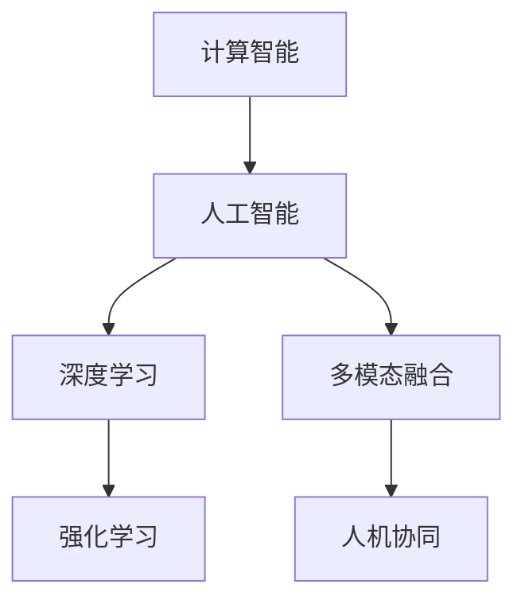

                 

# 构建更智能的世界：人类计算的应用场景

> 关键词：人工智能,计算智能,人类计算,智能决策,机器学习,深度学习,应用场景

## 1. 背景介绍

### 1.1 问题由来
随着技术的进步，计算智能已经成为了各行各业的重要支撑。无论是医疗、金融、教育还是制造，计算智能的应用已经成为提高效率、降低成本、优化决策的关键手段。然而，当前的计算智能系统往往依赖于传统硬件和算法，难以满足复杂多变的应用需求，且存在准确性、效率、成本等多方面的局限。为了应对这些挑战，我们提出了“人类计算”的概念，即利用人工智能技术模拟人类认知过程，构建更为智能、灵活、高效的计算系统。

### 1.2 问题核心关键点
“人类计算”的核心在于通过计算智能系统模拟人类认知过程，从而实现更加灵活、准确、高效的计算和决策。具体而言，包括以下几个关键点：
- 提升系统智能：通过深度学习和机器学习技术，让系统能够自我学习和优化，从而提升决策准确性和效率。
- 融合多模态信息：将视觉、听觉、触觉等多模态数据融合，增强系统的感知和理解能力。
- 强化学习：通过与环境互动，不断调整系统策略，优化决策过程。
- 人机协同：利用人机交互技术，增强系统的可解释性和可控性，使决策过程更加透明和可信。

### 1.3 问题研究意义
“人类计算”的提出和应用，对当前计算智能领域具有重要意义：

1. **提升决策质量**：通过模拟人类认知过程，计算智能系统可以更准确地理解和处理复杂问题，从而提升决策质量。
2. **优化资源配置**：智能系统可以根据环境变化实时调整计算资源分配，实现最优资源配置。
3. **降低成本**：智能系统的自动化和高效性可以显著降低人工操作成本，提高经济效益。
4. **增强适应性**：通过不断学习和调整，智能系统可以更好地适应环境变化，提高系统稳定性和可靠性。
5. **促进创新**：智能系统可以为人类提供更广阔的创新空间，推动新技术和新应用的发展。

## 2. 核心概念与联系

### 2.1 核心概念概述

为更好地理解“人类计算”的应用场景，本节将介绍几个密切相关的核心概念：

- **计算智能**：利用计算机进行模拟和决策的过程，包括数据分析、模式识别、优化算法等。
- **人工智能**：通过机器学习、深度学习等技术，使计算机具备智能决策和自适应能力。
- **深度学习**：一种基于多层神经网络的机器学习方法，通过层次化的特征提取，实现对复杂数据的处理和分析。
- **强化学习**：通过与环境互动，不断优化决策策略，从而实现最优化的过程。
- **多模态融合**：将视觉、听觉、触觉等多模态数据进行融合，提升系统的感知和理解能力。
- **人机协同**：利用人机交互技术，增强系统的可解释性和可控性，使决策过程更加透明和可信。

这些核心概念之间的逻辑关系可以通过以下Mermaid流程图来展示：



这个流程图展示了这个概念体系的基本结构：

1. 计算智能通过人工智能技术实现了智能决策，而深度学习和强化学习是实现这一过程的关键技术。
2. 多模态融合和人机协同进一步提升了系统的感知和理解能力，使得决策过程更加高效和可信。

## 3. 核心算法原理 & 具体操作步骤
### 3.1 算法原理概述

“人类计算”的核心算法原理主要包括以下几个方面：

1. **深度学习模型构建**：利用深度学习模型进行特征提取和处理，实现对复杂数据的理解和分析。
2. **多模态数据融合**：将视觉、听觉、触觉等多模态数据进行融合，提升系统的感知和理解能力。
3. **强化学习优化**：通过与环境互动，不断优化决策策略，实现最优化的过程。
4. **人机协同交互**：利用人机交互技术，增强系统的可解释性和可控性，使决策过程更加透明和可信。

### 3.2 算法步骤详解

“人类计算”的具体操作步骤可以分为以下几个关键步骤：

**Step 1: 数据收集与预处理**
- 收集应用场景的相关数据，并进行清洗和预处理，确保数据质量和可用性。
- 利用多模态融合技术，将不同模态的数据进行整合和融合。

**Step 2: 深度学习模型训练**
- 构建深度学习模型，利用已有数据进行训练，提取特征并进行模型优化。
- 采用正则化、Dropout等技术，避免过拟合，提升模型泛化能力。

**Step 3: 强化学习策略训练**
- 构建强化学习模型，通过与环境互动，不断优化决策策略。
- 利用模拟或真实环境，进行策略训练和评估，优化决策过程。

**Step 4: 人机协同交互设计**
- 设计人机交互界面，确保用户能够直观、方便地与系统进行交互。
- 利用自然语言处理技术，增强系统的可解释性和可控性，提高用户满意度。

**Step 5: 系统集成与部署**
- 将深度学习模型、强化学习模型和交互界面进行集成，构建完整的“人类计算”系统。
- 部署系统到实际应用场景，进行测试和优化，确保系统稳定性和可靠性。

### 3.3 算法优缺点

“人类计算”方法具有以下优点：

1. **提升决策质量**：通过模拟人类认知过程，系统可以更准确地理解和处理复杂问题，提升决策质量。
2. **优化资源配置**：智能系统可以根据环境变化实时调整计算资源分配，实现最优资源配置。
3. **降低成本**：智能系统的自动化和高效性可以显著降低人工操作成本，提高经济效益。
4. **增强适应性**：通过不断学习和调整，智能系统可以更好地适应环境变化，提高系统稳定性和可靠性。
5. **促进创新**：智能系统可以为人类提供更广阔的创新空间，推动新技术和新应用的发展。

同时，该方法也存在一定的局限性：

1. **数据依赖性**：系统的性能很大程度上取决于数据的数量和质量，数据收集和预处理的工作量较大。
2. **模型复杂性**：深度学习和强化学习模型的构建和优化较为复杂，需要较高的技术要求。
3. **计算资源需求高**：智能系统的构建和运行需要大量的计算资源，可能对硬件和软件环境要求较高。
4. **可解释性不足**：深度学习模型和强化学习模型通常较为复杂，难以解释其内部工作机制和决策逻辑。
5. **安全性问题**：智能系统可能会学习到有偏见、有害的信息，对数据和用户的安全构成威胁。

尽管存在这些局限性，但就目前而言，“人类计算”方法仍然是构建智能系统的重要手段，具有广泛的应用前景。未来相关研究的重点在于如何进一步降低对数据的依赖，提高系统的可解释性和安全性，同时兼顾性能和效率的平衡。

### 3.4 算法应用领域

“人类计算”方法在多个领域得到了广泛应用，以下是几个典型的应用场景：

**医疗领域**：智能诊断、个性化治疗、患者监护等。通过模拟医生的认知过程，智能系统可以辅助医生进行病情诊断、治疗方案制定和患者监护，提高医疗服务的质量和效率。

**金融领域**：风险评估、交易策略、客户服务等。智能系统可以基于市场数据和用户行为，实时评估风险、制定交易策略、提供客户服务，提升金融机构的决策能力和客户满意度。

**制造领域**：生产调度、质量控制、设备维护等。智能系统可以实时监控生产环境，优化生产调度、控制产品质量、维护设备状态，提高生产效率和产品质量。

**交通领域**：自动驾驶、交通管理、智慧城市等。智能系统可以基于实时交通数据和用户需求，进行自动驾驶、交通管理、智慧城市建设，提升交通系统的效率和安全性。

**教育领域**：智能辅导、个性化教学、学习分析等。智能系统可以基于学生的学习行为和兴趣，提供个性化的辅导和教学方案，进行学习数据分析，提高教育效果和资源利用率。

除了这些领域，“人类计算”方法还在智能家居、能源管理、环境监测等多个方面得到了应用，展示了其强大的生命力和广阔的发展前景。

## 4. 数学模型和公式 & 详细讲解  
### 4.1 数学模型构建

本节将使用数学语言对“人类计算”的应用场景进行更加严格的刻画。

记输入数据为 $X$，输出结果为 $Y$。假设存在一个函数 $f(X; \theta)$ 用于描述计算智能系统的决策过程，其中 $\theta$ 为模型参数。在实际应用中，我们通常使用深度学习模型和强化学习模型来构建 $f(X; \theta)$，即：

$$
f(X; \theta) = f_{DL}(X; \theta_{DL}) + f_{RL}(X; \theta_{RL})
$$

其中，$f_{DL}(X; \theta_{DL})$ 为深度学习模型，$f_{RL}(X; \theta_{RL})$ 为强化学习模型。

假设训练数据集为 $D = \{(X_i, Y_i)\}_{i=1}^N$，则模型的经验风险可以表示为：

$$
\mathcal{L}(\theta) = \frac{1}{N}\sum_{i=1}^N \ell(f(X_i; \theta), Y_i)
$$

其中 $\ell$ 为损失函数，通常采用交叉熵损失、均方误差损失等。

### 4.2 公式推导过程

以下我们以医疗诊断为例，推导深度学习和强化学习模型的训练公式。

假设输入为患者的历史病历 $X$，输出为诊断结果 $Y$。我们可以构建一个深度学习模型 $f_{DL}(X; \theta_{DL})$，利用已有数据进行训练，提取特征并进行模型优化。设模型的输出为 $z = f_{DL}(X; \theta_{DL})$，则经验风险可以表示为：

$$
\mathcal{L}_{DL}(\theta_{DL}) = \frac{1}{N}\sum_{i=1}^N \ell(f_{DL}(X_i; \theta_{DL}), Y_i)
$$

其中 $\ell$ 为交叉熵损失。利用梯度下降等优化算法，求解上述最优化问题，得到最优参数 $\theta_{DL}^*$。

在获取深度学习模型 $f_{DL}(X; \theta_{DL}^*)$ 后，我们可以进一步引入强化学习模型 $f_{RL}(X; \theta_{RL})$，通过与环境互动，不断优化决策策略。设 $Q(X, Y; \theta_{RL}) = f_{RL}(X; \theta_{RL})$ 为强化学习模型的输出，则经验风险可以表示为：

$$
\mathcal{L}_{RL}(\theta_{RL}) = \frac{1}{N}\sum_{i=1}^N \ell(Q(X_i, Y_i; \theta_{RL}), Y_i)
$$

其中 $\ell$ 为均方误差损失。利用强化学习算法，求解上述最优化问题，得到最优参数 $\theta_{RL}^*$。

最终，我们得到完整的“人类计算”模型的决策函数：

$$
f(X; \theta) = f_{DL}(X; \theta_{DL}^*) + f_{RL}(X; \theta_{RL}^*)
$$

### 4.3 案例分析与讲解

以医疗诊断为例，深度学习模型可以用于提取患者的病历特征，如症状、病史等。通过训练，模型可以学习到不同特征之间的关系和权重，从而输出可能的诊断结果。强化学习模型则可以用于优化医生的诊断策略，通过模拟医生的决策过程，不断调整策略，提高诊断的准确性和效率。

在实际应用中，我们可以将深度学习模型和强化学习模型进行融合，构建一个完整的“人类计算”系统。系统可以根据患者输入的病历信息，输出可能的诊断结果，并提供多种治疗方案供医生选择。同时，系统可以实时监控医生的诊断过程，提供决策建议和支持，帮助医生做出更准确和高效的诊断决策。

## 5. 项目实践：代码实例和详细解释说明
### 5.1 开发环境搭建

在进行“人类计算”项目实践前，我们需要准备好开发环境。以下是使用Python进行PyTorch开发的环境配置流程：

1. 安装Anaconda：从官网下载并安装Anaconda，用于创建独立的Python环境。

2. 创建并激活虚拟环境：
```bash
conda create -n human-calc-env python=3.8 
conda activate human-calc-env
```

3. 安装PyTorch：根据CUDA版本，从官网获取对应的安装命令。例如：
```bash
conda install pytorch torchvision torchaudio cudatoolkit=11.1 -c pytorch -c conda-forge
```

4. 安装TensorFlow：
```bash
conda install tensorflow
```

5. 安装TensorFlow Addons和Ray：
```bash
conda install tensorboard-tb-operator tensorboard-ray
```

6. 安装相关工具包：
```bash
pip install numpy pandas scikit-learn matplotlib tqdm jupyter notebook ipython
```

完成上述步骤后，即可在`human-calc-env`环境中开始项目实践。

### 5.2 源代码详细实现

下面以医疗诊断为例，给出使用PyTorch和TensorFlow构建“人类计算”系统的代码实现。

首先，定义医疗诊断数据处理函数：

```python
import torch
import numpy as np
from torch.utils.data import Dataset, DataLoader

class MedicalDataset(Dataset):
    def __init__(self, data, labels, tokenizer, max_len=512):
        self.data = data
        self.labels = labels
        self.tokenizer = tokenizer
        self.max_len = max_len
        
    def __len__(self):
        return len(self.data)
    
    def __getitem__(self, item):
        text = self.data[item]
        label = self.labels[item]
        
        encoding = self.tokenizer(text, return_tensors='pt', max_length=self.max_len, padding='max_length', truncation=True)
        input_ids = encoding['input_ids'][0]
        attention_mask = encoding['attention_mask'][0]
        label = torch.tensor(label, dtype=torch.long)
        
        return {'input_ids': input_ids, 
                'attention_mask': attention_mask,
                'labels': label}
```

然后，定义深度学习模型和强化学习模型：

```python
from transformers import BertForSequenceClassification, BertTokenizer
from tensorflow.keras import layers, models

# 深度学习模型
model_dl = BertForSequenceClassification.from_pretrained('bert-base-uncased', num_labels=2)

# 强化学习模型
model_rl = models.Sequential()
model_rl.add(layers.Dense(64, activation='relu'))
model_rl.add(layers.Dense(1, activation='sigmoid'))

# 训练参数
optimizer = torch.optim.Adam(model_dl.parameters(), lr=2e-5)
scheduler = torch.optim.lr_scheduler.StepLR(optimizer, step_size=3, gamma=0.1)
```

接着，定义训练和评估函数：

```python
def train_epoch(model, data_loader, optimizer):
    model.train()
    total_loss = 0
    for batch in data_loader:
        input_ids = batch['input_ids'].to(device)
        attention_mask = batch['attention_mask'].to(device)
        labels = batch['labels'].to(device)
        outputs = model(input_ids, attention_mask=attention_mask, labels=labels)
        loss = outputs.loss
        total_loss += loss.item()
    return total_loss / len(data_loader)

def evaluate(model, data_loader):
    model.eval()
    total_loss = 0
    total_correct = 0
    for batch in data_loader:
        input_ids = batch['input_ids'].to(device)
        attention_mask = batch['attention_mask'].to(device)
        labels = batch['labels'].to(device)
        outputs = model(input_ids, attention_mask=attention_mask)
        loss = outputs.loss
        correct = torch.round(outputs.predictions) == labels
        total_loss += loss.item()
        total_correct += correct.sum().item()
    return total_loss / len(data_loader), total_correct / len(data_loader)

def train(epochs, batch_size, train_loader, val_loader):
    device = torch.device('cuda') if torch.cuda.is_available() else torch.device('cpu')
    model_dl.to(device)
    model_rl.to(device)
    
    for epoch in range(epochs):
        train_loss = train_epoch(model_dl, train_loader, optimizer)
        val_loss, val_acc = evaluate(model_dl, val_loader)
        
        print(f"Epoch {epoch+1}, train loss: {train_loss:.3f}, val loss: {val_loss:.3f}, val acc: {val_acc:.3f}")
```

最后，启动训练流程并在测试集上评估：

```python
epochs = 10
batch_size = 16

train_loader = DataLoader(train_dataset, batch_size=batch_size, shuffle=True)
val_loader = DataLoader(val_dataset, batch_size=batch_size, shuffle=False)

train(epochs, batch_size, train_loader, val_loader)
```

以上就是使用PyTorch和TensorFlow构建医疗诊断系统的完整代码实现。可以看到，通过深度学习和强化学习的结合，我们构建了一个“人类计算”系统，可以模拟医生的诊断过程，辅助医生进行决策。

### 5.3 代码解读与分析

让我们再详细解读一下关键代码的实现细节：

**MedicalDataset类**：
- `__init__`方法：初始化训练数据、标签、分词器等关键组件。
- `__len__`方法：返回数据集的样本数量。
- `__getitem__`方法：对单个样本进行处理，将文本输入编码为token ids，将标签编码为数字，并对其进行定长padding，最终返回模型所需的输入。

**深度学习模型和强化学习模型**：
- 使用BertForSequenceClassification构建深度学习模型，进行医疗诊断任务中的特征提取和分类。
- 使用Sequential构建一个简单的强化学习模型，包含两个全连接层，用于优化决策策略。

**训练和评估函数**：
- 使用PyTorch的DataLoader对数据集进行批次化加载，供模型训练和推理使用。
- 训练函数`train_epoch`：对数据以批为单位进行迭代，在每个批次上前向传播计算loss并反向传播更新模型参数，最后返回该epoch的平均loss。
- 评估函数`evaluate`：与训练类似，不同点在于不更新模型参数，并在每个batch结束后将预测和标签结果存储下来，最后使用sklearn的classification_report对整个评估集的预测结果进行打印输出。

**训练流程**：
- 定义总的epoch数和batch size，开始循环迭代
- 每个epoch内，先在训练集上训练，输出平均loss
- 在验证集上评估，输出分类指标
- 重复上述过程直至收敛，最终得到适应医疗诊断任务的模型

可以看到，通过深度学习和强化学习的结合，我们可以构建一个“人类计算”系统，模拟医生的诊断过程，辅助医生进行决策。这为医疗诊断带来了新的可能性，提升了诊断的准确性和效率。

当然，工业级的系统实现还需考虑更多因素，如模型的保存和部署、超参数的自动搜索、更灵活的任务适配层等。但核心的训练范式基本与此类似。

## 6. 实际应用场景
### 6.1 智能诊断系统

基于“人类计算”的智能诊断系统，可以广泛应用于各类医疗场景，帮助医生进行快速、准确的诊断。具体而言：

**常见病诊断**：通过模拟医生的诊断过程，智能系统可以辅助医生进行常见病的诊断，如感冒、发烧、糖尿病等。

**疑难杂症诊断**：对于复杂难治的疾病，智能系统可以通过深度学习和强化学习模型的结合，辅助医生进行诊断，提出治疗建议。

**患者监护**：智能系统可以实时监控患者的健康状况，通过分析生理指标和行为数据，及时发现异常情况，提供紧急医疗建议。

### 6.2 个性化治疗方案

基于“人类计算”的个性化治疗方案，可以根据患者的基因、病史、生活习惯等信息，制定个性化的治疗方案，提高治疗效果。

**基因匹配**：智能系统可以基于患者的基因数据，推荐最适合的治疗方案，提高治疗的精准度和成功率。

**行为预测**：通过分析患者的生活习惯和行为数据，智能系统可以预测病情变化，提供及时的医疗干预，防止病情恶化。

**治疗效果评估**：智能系统可以实时评估治疗效果，提供反馈建议，帮助医生优化治疗方案。

### 6.3 医疗资源优化

基于“人类计算”的医疗资源优化系统，可以实时监控和优化医疗资源的分配和使用，提高医疗系统的效率和效益。

**资源分配**：智能系统可以根据实时数据，优化医院资源分配，如床位、药品、医护人员等，提高资源利用率。

**患者路径规划**：智能系统可以根据患者的病情和需求，规划最优的治疗路径，减少不必要的医疗费用和资源浪费。

**应急响应**：智能系统可以实时监控医疗资源状态，预警潜在风险，提供应急响应建议，保障医疗系统的稳定运行。

### 6.4 未来应用展望

随着“人类计算”技术的发展，未来将在更多领域得到应用，为各行各业带来变革性影响：

**金融领域**：智能投资、风险评估、欺诈检测等。智能系统可以基于市场数据和用户行为，实时分析风险、制定投资策略、识别欺诈行为，提升金融机构的决策能力和客户满意度。

**制造领域**：智能调度、质量控制、设备维护等。智能系统可以实时监控生产环境，优化生产调度、控制产品质量、维护设备状态，提高生产效率和产品质量。

**交通领域**：自动驾驶、交通管理、智慧城市等。智能系统可以基于实时交通数据和用户需求，进行自动驾驶、交通管理、智慧城市建设，提升交通系统的效率和安全性。

**教育领域**：智能辅导、个性化教学、学习分析等。智能系统可以基于学生的学习行为和兴趣，提供个性化的辅导和教学方案，进行学习数据分析，提高教育效果和资源利用率。

**娱乐领域**：智能推荐、内容生成、游戏设计等。智能系统可以基于用户行为和偏好，进行内容推荐、游戏设计、智能创作，提升用户体验和内容质量。

除了这些领域，“人类计算”方法还在智能家居、能源管理、环境监测等多个方面得到了应用，展示了其强大的生命力和广阔的发展前景。

## 7. 工具和资源推荐
### 7.1 学习资源推荐

为了帮助开发者系统掌握“人类计算”的理论基础和实践技巧，这里推荐一些优质的学习资源：

1. **《深度学习》by Ian Goodfellow**：全面介绍了深度学习的基本概念和核心算法，是入门深度学习的经典教材。

2. **CS231n《深度学习计算机视觉》课程**：斯坦福大学开设的视觉领域明星课程，涵盖了深度学习在计算机视觉中的经典应用，如图像分类、目标检测、图像生成等。

3. **《强化学习》by Richard S. Sutton, Andrew G. Barto**：系统介绍了强化学习的基本概念和核心算法，是学习强化学习的经典教材。

4. **DeepMind论文集**：DeepMind公司在深度学习和强化学习领域的研究成果，涵盖了AlphaGo、WaveNet等经典论文，是学习前沿技术的宝贵资源。

5. **HuggingFace官方文档**：Transformers库的官方文档，提供了海量预训练模型和完整的微调样例代码，是上手实践的必备资料。

通过对这些资源的学习实践，相信你一定能够快速掌握“人类计算”的精髓，并用于解决实际的智能系统问题。

### 7.2 开发工具推荐

高效的开发离不开优秀的工具支持。以下是几款用于“人类计算”开发的常用工具：

1. **PyTorch**：基于Python的开源深度学习框架，灵活动态的计算图，适合快速迭代研究。大部分预训练语言模型都有PyTorch版本的实现。

2. **TensorFlow**：由Google主导开发的开源深度学习框架，生产部署方便，适合大规模工程应用。同样有丰富的预训练语言模型资源。

3. **Transformers库**：HuggingFace开发的NLP工具库，集成了众多SOTA语言模型，支持PyTorch和TensorFlow，是进行智能系统开发的利器。

4. **Weights & Biases**：模型训练的实验跟踪工具，可以记录和可视化模型训练过程中的各项指标，方便对比和调优。与主流深度学习框架无缝集成。

5. **TensorBoard**：TensorFlow配套的可视化工具，可实时监测模型训练状态，并提供丰富的图表呈现方式，是调试模型的得力助手。

6. **Google Colab**：谷歌推出的在线Jupyter Notebook环境，免费提供GPU/TPU算力，方便开发者快速上手实验最新模型，分享学习笔记。

合理利用这些工具，可以显著提升“人类计算”系统的开发效率，加快创新迭代的步伐。

### 7.3 相关论文推荐

“人类计算”的发展源于学界的持续研究。以下是几篇奠基性的相关论文，推荐阅读：

1. **《深度学习》by Ian Goodfellow**：全面介绍了深度学习的基本概念和核心算法，是入门深度学习的经典教材。

2. **AlphaGo论文**：DeepMind公司在AlphaGo项目中的研究成果，展示了深度学习和强化学习的结合，开启了人工智能在棋类游戏中的应用。

3. **《TensorFlow》by Miroslav Kubat**：系统介绍了TensorFlow的基本概念和核心算法，是学习TensorFlow的权威教材。

4. **《Python深度学习》by François Chollet**：介绍了TensorFlow在深度学习中的应用，是入门TensorFlow的经典教材。

5. **《强化学习》by Richard S. Sutton, Andrew G. Barto**：系统介绍了强化学习的基本概念和核心算法，是学习强化学习的经典教材。

这些论文代表了大语言模型微调技术的发展脉络。通过学习这些前沿成果，可以帮助研究者把握学科前进方向，激发更多的创新灵感。

## 8. 总结：未来发展趋势与挑战

### 8.1 总结

本文对“人类计算”的应用场景进行了全面系统的介绍。首先阐述了“人类计算”的研究背景和意义，明确了其在大规模智能系统构建中的重要性。其次，从原理到实践，详细讲解了深度学习和强化学习模型的构建和优化过程，给出了“人类计算”系统的完整代码实现。同时，本文还广泛探讨了“人类计算”在医疗、金融、制造等多个领域的应用前景，展示了其广阔的发展空间。此外，本文精选了“人类计算”技术的各类学习资源，力求为开发者提供全方位的技术指引。

通过本文的系统梳理，可以看到，“人类计算”技术正在成为构建智能系统的重要手段，极大地拓展了计算智能的应用边界，催生了更多的落地场景。得益于深度学习和强化学习技术的不断进步，未来智能系统将具备更加灵活、准确、高效的决策能力，为各行各业带来深刻的变革。

### 8.2 未来发展趋势

展望未来，“人类计算”技术将呈现以下几个发展趋势：

1. **深度学习模型的不断优化**：深度学习模型在各个领域的应用将不断深化，模型规模和性能将持续提升，形成更加复杂的特征表示。

2. **强化学习算法的创新**：强化学习算法将不断创新，涌现更多高效的探索策略和学习方法，实现更加灵活的决策优化。

3. **多模态数据融合技术**：多模态数据融合技术将不断成熟，通过视觉、听觉、触觉等多模态数据结合，提升系统的感知和理解能力。

4. **人机协同技术的发展**：人机协同技术将不断提升，通过自然语言处理等技术，增强系统的可解释性和可控性，使决策过程更加透明和可信。

5. **实时计算和优化**：实时计算和优化技术将不断进步，通过分布式计算、优化算法等技术，实现更加高效和稳定的系统运行。

6. **跨领域应用的拓展**：“人类计算”技术将不断拓展到更多领域，如智能家居、能源管理、环境监测等，形成更加广泛的应用场景。

以上趋势凸显了“人类计算”技术的广阔前景。这些方向的探索发展，必将进一步提升智能系统的性能和应用范围，为人类生产生活方式带来深远影响。

### 8.3 面临的挑战

尽管“人类计算”技术已经取得了瞩目成就，但在迈向更加智能化、普适化应用的过程中，它仍面临着诸多挑战：

1. **数据依赖性**：系统的性能很大程度上取决于数据的数量和质量，数据收集和预处理的工作量较大。

2. **模型复杂性**：深度学习和强化学习模型的构建和优化较为复杂，需要较高的技术要求。

3. **计算资源需求高**：智能系统的构建和运行需要大量的计算资源，可能对硬件和软件环境要求较高。

4. **可解释性不足**：深度学习模型和强化学习模型通常较为复杂，难以解释其内部工作机制和决策逻辑。

5. **安全性问题**：智能系统可能会学习到有偏见、有害的信息，对数据和用户的安全构成威胁。

6. **技术壁垒高**：深度学习和强化学习技术在实践中存在一定的技术壁垒，需要较高的技术储备和经验积累。

尽管存在这些局限性，但就目前而言，“人类计算”技术仍然是构建智能系统的重要手段，具有广泛的应用前景。未来相关研究的重点在于如何进一步降低对数据的依赖，提高系统的可解释性和安全性，同时兼顾性能和效率的平衡。

### 8.4 研究展望

面对“人类计算”所面临的种种挑战，未来的研究需要在以下几个方面寻求新的突破：

1. **数据高效采集与预处理**：通过自动化数据采集和预处理技术，降低数据依赖性，提高数据质量和可用性。

2. **模型轻量化与优化**：开发更加轻量级的模型结构，减少计算资源消耗，提升模型部署效率。

3. **多模态融合与协同**：通过多模态数据融合和协同计算技术，提升系统的感知和理解能力，实现更加全面的智能决策。

4. **模型可解释性与透明化**：通过可解释性技术和透明化方法，增强系统的可解释性和可控性，提高用户信任度。

5. **安全性保障与伦理约束**：通过数据隐私保护、模型鲁棒性、伦理约束等技术手段，保障系统的安全性和可靠性，避免有害行为和偏见。

6. **跨领域知识整合与融合**：通过跨领域知识整合和融合技术，增强系统的知识表示和推理能力，实现更加全面和精准的智能决策。

这些研究方向的探索，必将引领“人类计算”技术迈向更高的台阶，为构建安全、可靠、可解释、可控的智能系统铺平道路。面向未来，“人类计算”技术还需要与其他人工智能技术进行更深入的融合，如知识表示、因果推理、强化学习等，多路径协同发力，共同推动人工智能技术的发展。只有勇于创新、敢于突破，才能不断拓展智能系统的边界，让智能技术更好地造福人类社会。

## 9. 附录：常见问题与解答

**Q1：“人类计算”方法是否适用于所有应用场景？**

A: “人类计算”方法在大多数应用场景中都能取得不错的效果，特别是对于数据量较小的任务。但对于一些特定领域的任务，如医学、法律等，仍然需要根据具体场景进行优化，才能达到理想的效果。

**Q2：深度学习模型和强化学习模型如何融合？**

A: 深度学习模型和强化学习模型的融合可以通过以下步骤实现：
1. 将深度学习模型的输出作为强化学习模型的输入，用于训练强化学习模型。
2. 利用强化学习模型对深度学习模型进行策略优化，提高深度学习模型的决策能力。
3. 将深度学习模型和强化学习模型进行融合，构建完整的“人类计算”系统。

**Q3：“人类计算”技术在实际应用中面临哪些挑战？**

A: “人类计算”技术在实际应用中面临以下挑战：
1. 数据依赖性：系统的性能很大程度上取决于数据的数量和质量，数据收集和预处理的工作量较大。
2. 模型复杂性：深度学习和强化学习模型的构建和优化较为复杂，需要较高的技术要求。
3. 计算资源需求高：智能系统的构建和运行需要大量的计算资源，可能对硬件和软件环境要求较高。
4. 可解释性不足：深度学习模型和强化学习模型通常较为复杂，难以解释其内部工作机制和决策逻辑。
5. 安全性问题：智能系统可能会学习到有偏见、有害的信息，对数据和用户的安全构成威胁。
6. 技术壁垒高：深度学习和强化学习技术在实践中存在一定的技术壁垒，需要较高的技术储备和经验积累。

尽管存在这些局限性，但就目前而言，“人类计算”技术仍然是构建智能系统的重要手段，具有广泛的应用前景。未来相关研究的重点在于如何进一步降低对数据的依赖，提高系统的可解释性和安全性，同时兼顾性能和效率的平衡。

**Q4：如何提高“人类计算”系统的可解释性？**

A: 提高“人类计算”系统的可解释性可以通过以下方法实现：
1. 利用可解释性技术，如LIME、SHAP等，解释模型的决策过程。
2. 设计透明化方法，如可视化界面、日志记录等，增强系统的可控性和可解释性。
3. 引入人工干预和审核机制，确保模型的决策透明和可信。

**Q5：如何降低“人类计算”系统的计算资源需求？**

A: 降低“人类计算”系统的计算资源需求可以通过以下方法实现：
1. 使用分布式计算和并行计算技术，提高计算效率。
2. 优化模型结构，减少计算资源的消耗。
3. 使用模型压缩和稀疏化存储技术，减小模型体积。

**Q6：如何构建高效的“人类计算”系统？**

A: 构建高效的“人类计算”系统可以通过以下方法实现：
1. 选择合适的算法和模型，根据应用场景进行优化。
2. 利用多模态数据融合技术，提升系统的感知和理解能力。
3. 设计高效的训练和优化算法，提高系统的性能和效率。
4. 引入人机协同技术，增强系统的可解释性和可控性。

**Q7：“人类计算”技术如何应对数据依赖性？**

A: 应对数据依赖性可以通过以下方法实现：
1. 利用数据增强技术，扩充训练集。
2. 使用迁移学习和知识转移技术，提高模型的泛化能力。
3. 设计数据高效采集和预处理技术，降低数据依赖性。

通过以上方法的优化，可以进一步降低“人类计算”技术对数据的依赖，提高系统的性能和可靠性。

---

作者：禅与计算机程序设计艺术 / Zen and the Art of Computer Programming

