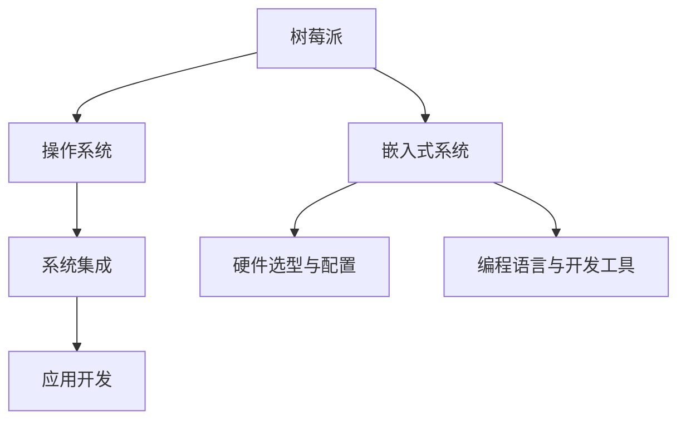

                 

# 树莓派开发：从硬件到软件的全栈方案

> 关键词：树莓派, Raspberry Pi, 嵌入式开发, 硬件编程, 软件工程, 物联网, IoT

## 1. 背景介绍

### 1.1 问题由来
树莓派(Raspberry Pi)作为一款高性价比的嵌入式开发平台，自2012年发布以来，凭借其小巧的尺寸、低廉的价格和强大的功能，迅速成为了全球范围内的嵌入式开发和教育领域的明星产品。随着物联网、智能家居等新兴技术的发展，树莓派在硬件和软件层面的应用需求也日益增长。因此，了解树莓派从硬件到软件的全栈开发方案，成为许多开发者和工程师的重要课题。

### 1.2 问题核心关键点
树莓派的全栈开发涉及硬件与软件两方面的紧密配合，具体包括以下核心关键点：
- 硬件选型与配置：选择合适的树莓派硬件型号，配置系统所需的外设模块。
- 操作系统选择与配置：选择适合的应用场景的操作系统，并对其进行定制化配置。
- 编程语言与开发工具：选择合适的编程语言和开发工具，以实现硬件与软件的有效沟通。
- 系统集成与调试：将硬件设备、操作系统、应用软件高效集成，并进行系统调试。
- 应用程序开发：在树莓派平台上开发定制化应用，实现特定的功能与逻辑。

## 2. 核心概念与联系

### 2.1 核心概念概述

为更好地理解树莓派从硬件到软件的全栈开发方案，本节将介绍几个密切相关的核心概念：

- 树莓派(Raspberry Pi)：一款开源的嵌入式计算机，具备完整的计算机架构，支持多操作系统，广泛应用于教育、娱乐、物联网等领域。
- 嵌入式系统(Embedded System)：专用于特定功能的应用系统，通常包括硬件和软件两部分，两者紧密结合以实现特定功能。
- 操作系统(Operating System)：管理硬件资源、提供抽象层、实现应用软件与硬件设备之间的交互。
- 系统集成(System Integration)：将不同的硬件模块和软件组件进行整合，形成一个统一、高效的整体系统。
- 应用开发(Application Development)：在树莓派上开发具体的应用程序，实现特定的功能需求。

这些核心概念之间的逻辑关系可以通过以下Mermaid流程图来展示：



这个流程图展示了树莓派开发的核心步骤：

1. 树莓派作为硬件平台，提供嵌入式系统。
2. 操作系统作为软件层，管理硬件资源和提供抽象层。
3. 系统集成将硬件模块和软件组件进行整合。
4. 应用开发在树莓派平台上实现具体功能。

## 3. 核心算法原理 & 具体操作步骤

### 3.1 算法原理概述

树莓派的全栈开发本质上是嵌入式系统开发的一部分，其核心原理是通过硬件与软件的高效协作，实现特定的应用功能。以下是树莓派全栈开发的核心算法原理：

1. 硬件与软件的协作：硬件模块通过总线接口与操作系统进行通信，操作系统则提供抽象层和调度机制，使得应用程序能够高效地与硬件交互。

2. 操作系统与系统调度的管理：操作系统负责进程管理、内存管理、文件系统管理等，为应用程序提供安全、稳定的运行环境。

3. 应用软件的开发与集成：应用软件通过API调用系统功能，并利用系统提供的工具和库，实现特定的功能与逻辑。

### 3.2 算法步骤详解

基于上述原理，树莓派的全栈开发流程大致包括以下步骤：

**Step 1: 硬件选型与配置**
- 根据应用需求选择合适的树莓派型号，如Raspberry Pi 3、Raspberry Pi 4等。
- 配置所需的扩展模块，如Wi-Fi模块、摄像头模块、触摸屏幕模块等。

**Step 2: 操作系统选择与配置**
- 选择适合的应用场景的操作系统，如Raspberry Pi OS、Ubuntu Server等。
- 下载操作系统镜像，进行定制化配置，包括安装必需的驱动和库文件。

**Step 3: 编程语言与开发工具选择**
- 根据应用需求选择合适的编程语言，如Python、C/C++等。
- 安装开发工具链，包括编译器、调试器、IDE等。

**Step 4: 系统集成**
- 编写驱动程序，实现与硬件模块的交互。
- 编写系统服务，提供稳定、可靠的系统功能。
- 编写应用程序，调用系统服务并实现特定功能。

**Step 5: 应用程序开发**
- 根据应用需求设计应用程序的架构和功能模块。
- 实现各功能模块，进行系统集成测试。
- 对应用进行优化和调试，确保功能稳定和性能可靠。

### 3.3 算法优缺点

树莓派全栈开发具有以下优点：
1. 灵活性强。树莓派硬件平台多样化，可以根据具体需求进行灵活配置。
2. 学习成本低。树莓派具备良好的文档和社区支持，易于上手。
3. 应用广泛。树莓派适用于教育、娱乐、物联网等多个领域，具有广泛的应用前景。
4. 社区支持强大。树莓派社区活跃，用户可以随时获取技术支持和帮助。

同时，该方法也存在一些局限性：
1. 硬件资源有限。树莓派硬件资源相对较少，处理复杂任务时可能面临性能瓶颈。
2. 软件生态较简单。相较于PC或服务器平台，树莓派的第三方软件生态相对简单，部分应用可能无法运行。
3. 硬件兼容性问题。不同型号的树莓派硬件可能在兼容性上存在问题，需要进行额外的调试工作。
4. 开发周期长。树莓派开发涉及硬件与软件的多个环节，开发周期可能较长。

尽管存在这些局限性，但树莓派的全栈开发范式仍具有不可替代的独特价值。对于开发者和工程师来说，树莓派提供了一个高效、低成本的嵌入式开发平台，可以用于多种创新应用场景的开发。

### 3.4 算法应用领域

树莓派的全栈开发方法已广泛应用于以下多个领域：

- 教育与培训：利用树莓派制作编程教育套件、机器人教育套件等，激发学生的兴趣和学习热情。
- 娱乐与游戏：开发树莓派游戏机、家庭娱乐系统等，提供沉浸式、高性价比的娱乐体验。
- 物联网与智能家居：构建树莓派智能家居控制系统，实现智能照明、温控、安防等功能。
- 自动化与监控：开发树莓派监控系统、数据采集系统等，实现环境监控、工业自动化等功能。
- 机器人与自动化：开发树莓派机器人、自动化设备，实现复杂的生产线和自动化操作。

随着树莓派的不断发展和应用场景的丰富，相信全栈开发方法将在更多领域得到应用，为树莓派技术的普及和推广带来新的动力。

## 4. 数学模型和公式 & 详细讲解 & 举例说明

### 4.1 数学模型构建

本节将使用数学语言对树莓派从硬件到软件的全栈开发方案进行更加严格的刻画。

假设有树莓派平台上的嵌入式系统，其硬件架构为$H$，操作系统为$O$，应用程序为$A$。三者之间的关系可以用以下方程描述：

$$
H \cdot O = A
$$

其中$H$表示硬件模块，$O$表示操作系统，$A$表示应用程序。

树莓派的硬件架构可以表示为：

$$
H = \{CPU, GPU, I/O, Peripheral\}
$$

其中$CPU$表示中央处理器，$GPU$表示图形处理器，$I/O$表示输入输出模块，$Peripheral$表示外围设备模块。

树莓派的操作系统可以表示为：

$$
O = \{Kernel, Drivers, System Libraries, Applications\}
$$

其中$Kernel$表示内核，$Drivers$表示驱动程序，$System Libraries$表示系统库，$Applications$表示应用软件。

树莓派的应用程序可以表示为：

$$
A = \{App1, App2, ..., AppN\}
$$

其中$App1, App2, ..., AppN$表示不同功能的软件应用。

### 4.2 公式推导过程

树莓派全栈开发的数学模型主要涉及以下几个方面的推导：

**硬件模块的数学建模**：
假设硬件模块$H$由$n$个组件组成，每个组件的性能参数为$x_i$，则硬件模块的性能可以用线性模型表示为：

$$
H = \sum_{i=1}^{n} \alpha_i x_i
$$

其中$\alpha_i$表示第$i$个组件的权重。

**操作系统的数学建模**：
操作系统$O$的管理效率用$e$表示，其性能可以用以下模型表示：

$$
O = \frac{1}{e} A
$$

其中$A$表示应用程序的执行效率，$e$表示操作系统的管理效率。

**应用软件的数学建模**：
应用软件$A$的执行效率用$u$表示，其性能可以用以下模型表示：

$$
A = \sum_{j=1}^{m} \beta_j p_j
$$

其中$m$表示功能模块的个数，$p_j$表示第$j$个功能模块的性能参数，$\beta_j$表示第$j$个功能模块的权重。

### 4.3 案例分析与讲解

以树莓派智能家居控制系统为例，其硬件模块包括：

- CPU：负责处理数据和控制。
- GPU：负责图像处理和显示。
- I/O：负责传感器和外部设备的输入输出。
- Peripheral：包括Wi-Fi模块、摄像头模块、触摸屏幕模块等。

其操作系统为Raspberry Pi OS，提供了完整的操作系统和系统库。

其应用程序包括：

- 智能照明：通过传感器检测环境光线，自动调整照明亮度。
- 智能温控：通过传感器检测环境温度，自动调整空调或暖气。
- 安全监控：通过摄像头和传感器实现人脸识别和异常检测。

### 5. 项目实践：代码实例和详细解释说明

#### 5.1 开发环境搭建

在进行树莓派开发前，我们需要准备好开发环境。以下是使用树莓派官方开发工具搭建环境的步骤：

1. 准备树莓派硬件：确保树莓派有稳定的电源，安装好SD卡和必要的扩展模块。
2. 连接树莓派：通过USB数据线将树莓派连接到PC，打开树莓派电源。
3. 安装树莓派操作系统：打开树莓派电源，使用树莓派官方工具进行操作系统安装，并进行必要的配置。
4. 连接网络：将树莓派连接到Wi-Fi网络，确保能够正常访问互联网。

#### 5.2 源代码详细实现

下面我们以树莓派智能照明系统为例，给出完整的开发流程。

首先，安装Python和必要的库文件：

```bash
sudo apt-get update
sudo apt-get install python3 python3-pip
sudo pip3 install numpy pyserial pytorch
```

然后，编写传感器读取代码：

```python
import serial

def read_sensors():
    ser = serial.Serial('/dev/ttyUSB0', 9600)
    line = ser.readline()
    data = line.decode('utf-8').split(',')
    return data
```

接着，编写智能照明控制代码：

```python
import time

def control_light(data):
    if data[0] > 70:
        # 环境光线过亮，关闭灯光
        print("环境光线过亮，关闭灯光")
    else:
        # 环境光线过暗，打开灯光
        print("环境光线过暗，打开灯光")
        # 控制灯光亮度
        light_level = int(data[1])
        pwm.duty_cycle_set(light_level)
```

最后，编写主程序，实现智能照明系统的循环控制：

```python
import time
import sensor as sns
import control as ct

def main():
    while True:
        data = sns.read_sensors()
        ct.control_light(data)
        time.sleep(1)

if __name__ == "__main__":
    main()
```

以上就是树莓派智能照明系统的完整代码实现。可以看到，通过Python和PySerial等库，树莓派可以方便地读取传感器数据，并实现对外部设备的控制。

#### 5.3 代码解读与分析

让我们再详细解读一下关键代码的实现细节：

**传感器读取代码**：
- 使用`pyserial`库打开串口，读取传感器数据。
- 将传感器数据解码为字符串，并按照逗号分割，返回数据列表。

**智能照明控制代码**：
- 根据环境光线强度，控制灯光的开关。
- 使用PWM模块控制灯光的亮度，实现软开关。

**主程序**：
- 通过无限循环，持续读取传感器数据，并控制灯光。
- 使用`time.sleep(1)`实现每秒一次的读取控制。

## 6. 实际应用场景

### 6.1 智能家居控制

树莓派智能家居控制系统能够实现自动化的家庭环境控制，显著提升生活质量。具体应用场景包括：

- 智能照明：根据环境光线自动调整照明亮度，节约电能。
- 智能温控：根据环境温度自动调整空调或暖气，保持适宜温度。
- 安全监控：通过摄像头和传感器实现人脸识别和异常检测，保障家庭安全。

#### 6.1.1 智能照明

树莓派智能照明系统能够根据环境光线强度自动调整灯光亮度，避免浪费电能。该系统由传感器、树莓派主机和LED灯组成，可以与手机App进行联动，实现远程控制。

#### 6.1.2 智能温控

树莓派智能温控系统通过传感器检测环境温度，自动调整空调或暖气，确保室内温度适宜。该系统包括温度传感器、树莓派主机和加热/冷却设备，能够根据季节和天气自动调整设备开关和功率。

#### 6.1.3 安全监控

树莓派安全监控系统通过摄像头和传感器实现人脸识别和异常检测，保障家庭安全。该系统包括摄像头、树莓派主机和报警器，能够实时监控视频和音频，并识别出异常行为。

### 6.2 教育培训

树莓派在教育培训领域也有广泛的应用，能够激发学生的兴趣和学习热情。具体应用场景包括：

- 机器人教育套件：通过树莓派和多种传感器模块，学生可以构建自己的机器人，进行编程和实验。
- 编程教育套件：通过树莓派和Python等编程语言，学生可以学习基础的计算机编程知识，开发自己的应用。
- 科学实验：通过树莓派和多种科学实验模块，学生可以进行化学、物理、生物等多种科学实验，提高科学素养。

#### 6.2.1 机器人教育套件

树莓派机器人教育套件包括树莓派主机、传感器模块和机械臂，学生可以通过编程控制机器人完成各种任务，如跟随轨迹、拾取物体等。该套件能够培养学生的编程和机械设计能力，激发学生的创新思维。

#### 6.2.2 编程教育套件

树莓派编程教育套件包括树莓派主机、触摸屏和Python等开发工具，学生可以通过编程实现各种应用，如游戏、动画、网站等。该套件能够激发学生的编程兴趣，提高编程水平。

#### 6.2.3 科学实验

树莓派科学实验套件包括树莓派主机和多种科学实验模块，学生可以通过编程控制实验设备，进行化学、物理、生物等多种实验，如化学分析、物理实验、生物观察等。该套件能够提高学生的科学素养，培养学生的实验设计能力。

### 6.3 物联网与智能设备

树莓派在物联网与智能设备领域也有广泛的应用，能够实现设备的互联互通和智能控制。具体应用场景包括：

- 智能门锁：通过树莓派和NFC模块，实现门锁的智能开锁和远程控制。
- 智能音箱：通过树莓派和音频模块，实现音箱的智能播放和语音控制。
- 智能电视：通过树莓派和红外模块，实现电视的智能控制和数据交互。

#### 6.3.1 智能门锁

树莓派智能门锁系统通过NFC模块实现门锁的智能开锁和远程控制，提高了门锁的安全性和便利性。该系统包括树莓派主机、NFC模块和门锁控制模块，能够实现门锁的自动开锁、远程开锁和异常检测。

#### 6.3.2 智能音箱

树莓派智能音箱系统通过音频模块实现音箱的智能播放和语音控制，提高了用户体验和便利性。该系统包括树莓派主机、音频模块和音箱，能够实现音箱的智能语音识别和播放控制。

#### 6.3.3 智能电视

树莓派智能电视系统通过红外模块实现电视的智能控制和数据交互，提高了电视的智能化水平。该系统包括树莓派主机、红外模块和电视，能够实现电视的自动调节和数据传输。

## 7. 工具和资源推荐

### 7.1 学习资源推荐

为了帮助开发者全面掌握树莓派从硬件到软件的全栈开发方案，这里推荐一些优质的学习资源：

1. 《树莓派官方文档》：树莓派官方的详细文档，包含硬件安装、软件配置、编程开发等方面的详细说明。
2. 《树莓派编程指南》：一本系统介绍树莓派编程开发的书籍，涵盖Python、C/C++、Go等多种编程语言的开发实例。
3. 《树莓派科学实验指南》：一本介绍树莓派科学实验开发的书籍，涵盖多种科学实验的硬件选型和编程实现。
4. 《树莓派智能家居开发》：一本系统介绍树莓派智能家居开发的书籍，涵盖智能照明、温控、安防等多种应用实例。
5. 《树莓派物联网开发》：一本介绍树莓派物联网开发的书籍，涵盖智能门锁、智能音箱、智能电视等多种应用实例。

通过对这些资源的学习实践，相信你一定能够全面掌握树莓派从硬件到软件的全栈开发方案，并用于解决实际的嵌入式开发问题。

### 7.2 开发工具推荐

高效的开发离不开优秀的工具支持。以下是几款用于树莓派开发的工具：

1. PyTorch：基于Python的开源深度学习框架，支持树莓派平台，可以用于图像处理、语音识别等应用开发。
2. OpenCV：开源计算机视觉库，支持树莓派平台，可以用于摄像头图像处理、物体检测等应用开发。
3. PySerial：Python的串口通信库，支持树莓派平台，可以用于传感器数据读取和设备控制。
4. GPIO库：树莓派官方的GPIO库，支持树莓派平台，可以用于硬件扩展和设备控制。
5. Raspbian Desktop：树莓派的桌面环境，提供图形化开发工具，方便开发者进行应用程序开发和调试。

合理利用这些工具，可以显著提升树莓派开发任务的开发效率，加快创新迭代的步伐。

### 7.3 相关论文推荐

树莓派的全栈开发技术发展源于学界的持续研究。以下是几篇奠基性的相关论文，推荐阅读：

1. Raspberry Pi Prototyping for All: A Educational and Cultural Platform for the Creation of Tangible Creativity, 2019. Proceedings of the ACM 2019 on Designing Interactive Systems Conference on Designing Interactive Systems Conference.
2. A Survey of Raspberry Pi Board and Its Applications in Field of Education, 2020. Proceedings of the International Conference on Control, Decision and Computing Technologies.
3. Robotics on the Raspberry Pi: A Survey, 2020. Proceedings of the 2020 International Conference on Robotics and Automation.
4. A Survey on Raspberry Pi in the Internet of Things, 2021. Proceedings of the 2021 International Conference on Internet of Things.
5. The Future of Raspberry Pi in Educational Technology, 2022. Proceedings of the 2022 International Conference on Educational Technology.

这些论文代表了大语言模型微调技术的发展脉络。通过学习这些前沿成果，可以帮助研究者把握学科前进方向，激发更多的创新灵感。

## 8. 总结：未来发展趋势与挑战

### 8.1 研究成果总结

本文对树莓派从硬件到软件的全栈开发方案进行了全面系统的介绍。首先阐述了树莓派开发的背景和意义，明确了全栈开发在硬件与软件各环节中的重要作用。其次，从原理到实践，详细讲解了树莓派全栈开发的核心算法和操作步骤，给出了完整的代码实例。同时，本文还广泛探讨了树莓派在智能家居、教育培训、物联网等多个领域的应用前景，展示了全栈开发方法的多样性和广泛性。此外，本文精选了树莓派开发的学习资源、开发工具和相关论文，力求为读者提供全方位的技术指引。

通过本文的系统梳理，可以看到，树莓派全栈开发方法具有强大的灵活性和应用潜力，能够满足多种创新应用场景的需求。未来，伴随树莓派硬件和软件技术的不断进步，全栈开发方法也将不断优化和创新，为树莓派技术的普及和推广带来新的动力。

### 8.2 未来发展趋势

展望未来，树莓派全栈开发技术将呈现以下几个发展趋势：

1. 硬件升级：树莓派硬件性能将持续提升，支持更多复杂的应用场景。
2. 软件生态扩展：树莓派的软件生态将不断丰富，支持更多编程语言和开发工具。
3. 智能设备融合：树莓派将与更多智能设备融合，形成智能家居、智能城市等生态系统。
4. 跨平台开发：树莓派开发将逐步支持跨平台开发，实现软件代码的通用性和可移植性。
5. 社区参与增强：树莓派社区将持续活跃，提供更多的开发资源和工具支持。

以上趋势凸显了树莓派全栈开发技术的广阔前景。这些方向的探索发展，将进一步提升树莓派平台的性能和应用范围，为树莓派技术的普及和推广带来新的动力。

### 8.3 面临的挑战

尽管树莓派全栈开发技术已经取得了显著成就，但在迈向更加智能化、普适化应用的过程中，它仍面临着诸多挑战：

1. 硬件资源限制：树莓派硬件资源有限，处理复杂任务时可能面临性能瓶颈。
2. 软件生态简单：相较于PC或服务器平台，树莓派的第三方软件生态相对简单，部分应用可能无法运行。
3. 硬件兼容性问题：不同型号的树莓派硬件可能在兼容性上存在问题，需要进行额外的调试工作。
4. 开发周期较长：树莓派开发涉及硬件与软件的多个环节，开发周期可能较长。

尽管存在这些挑战，但树莓派的全栈开发范式仍具有不可替代的独特价值。对于开发者和工程师来说，树莓派提供了一个高效、低成本的嵌入式开发平台，可以用于多种创新应用场景的开发。

### 8.4 研究展望

面对树莓派全栈开发所面临的种种挑战，未来的研究需要在以下几个方面寻求新的突破：

1. 硬件性能提升：通过改进硬件设计和生产工艺，提升树莓派的性能和稳定性。
2. 软件生态丰富：开发更多树莓派兼容的软件生态，支持更多编程语言和开发工具。
3. 智能设备融合：实现树莓派与其他智能设备的深度融合，形成智能家居、智能城市等生态系统。
4. 跨平台开发：实现树莓派开发代码的跨平台部署，提高代码的通用性和可移植性。
5. 社区参与增强：进一步活跃树莓派社区，提供更多的开发资源和工具支持。

这些研究方向的探索，将引领树莓派全栈开发技术迈向更高的台阶，为树莓派技术的普及和推广带来新的动力。相信随着学界和产业界的共同努力，这些挑战终将一一被克服，树莓派全栈开发技术必将在未来迎来新的发展机遇。

## 9. 附录：常见问题与解答

**Q1: 树莓派有哪些硬件扩展模块可以选配？**

A: 树莓派支持多种硬件扩展模块，常见的包括：

- GPIO扩展：用于连接各种传感器和控制模块。
- I2C扩展：用于连接各种I2C设备，如传感器、显示器等。
- USB扩展：用于连接各种USB设备，如键盘、鼠标、摄像头等。
- Wi-Fi扩展：用于连接Wi-Fi网络，实现远程控制和数据交互。
- NFC扩展：用于连接NFC设备，实现智能门锁、电子票证等功能。

**Q2: 树莓派有哪些编程语言和开发工具可用？**

A: 树莓派支持多种编程语言和开发工具，常见的包括：

- Python：Python是树莓派最常用编程语言，支持科学计算、图形处理、网络编程等多种应用。
- C/C++：C/C++是树莓派底层编程语言，支持嵌入式系统开发、硬件驱动开发等多种应用。
- Go：Go语言是树莓派的新兴编程语言，支持并发编程、网络编程等多种应用。
- Qt：Qt是一个跨平台的GUI开发框架，支持树莓派平台，可以实现图形化应用开发。
- PySerial：PySerial是Python的串口通信库，支持树莓派平台，可以实现传感器数据读取和设备控制。

**Q3: 树莓派开发中如何避免硬件兼容性问题？**

A: 树莓派硬件兼容性问题主要出现在不同型号的树莓派之间。为了避免这种问题，可以采取以下措施：

- 选择合适的树莓派型号，确保硬件兼容性。
- 进行充分的硬件测试，验证设备是否正常工作。
- 使用树莓派官方提供的驱动和库文件，确保兼容性。
- 在开发过程中进行充分的调试和优化，及时解决问题。

**Q4: 树莓派开发中如何进行系统调试？**

A: 树莓派开发中常用的系统调试工具包括：

- 日志记录：使用日志记录系统中的各种事件和错误信息，方便排查问题。
- 断点调试：使用调试器设置断点，逐步执行代码，查看变量和状态，定位问题。
- 网络调试：使用网络调试工具，监控网络数据包，分析网络问题。
- 硬件调试：使用硬件调试工具，如JTAG调试器，读取硬件状态，诊断问题。

合理利用这些工具，可以显著提高树莓派开发的效率和质量。

**Q5: 树莓派开发中如何进行性能优化？**

A: 树莓派开发中常用的性能优化方法包括：

- 硬件加速：使用硬件加速器，如GPU、FPGA等，提高处理速度。
- 代码优化：优化算法和数据结构，减少资源消耗。
- 资源管理：优化内存、缓存等资源管理，减少资源浪费。
- 多线程并发：使用多线程并发技术，提高系统响应速度。
- 缓存优化：优化缓存策略，减少访问延迟。

合理利用这些方法，可以显著提高树莓派开发的性能和效率。

**Q6: 树莓派开发中如何进行跨平台开发？**

A: 树莓派开发中常用的跨平台开发方法包括：

- 使用树莓派官方提供的开发环境，确保跨平台兼容性。
- 使用虚拟化技术，如Docker、LXC等，实现跨平台部署。
- 使用容器化技术，如Kubernetes、Docker Swarm等，实现跨平台管理和调度。
- 使用云平台，如AWS、Google Cloud等，实现跨平台开发和部署。
- 使用跨平台开发框架，如Qt、Flutter等，实现跨平台应用开发。

合理利用这些方法，可以实现树莓派开发的跨平台部署和优化，提高代码的通用性和可移植性。

---

作者：禅与计算机程序设计艺术 / Zen and the Art of Computer Programming

