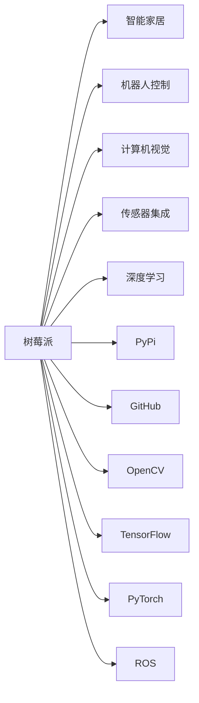

                 

# 树莓派项目灵感：智能家居和机器人

## 1. 背景介绍

树莓派（Raspberry Pi）是一款广泛应用于教育、研究和小型项目开发的高性能低成本计算机。它搭载了ARM架构的CPU，支持多种编程语言，如Python、C++、Raspberry Pi OS等。近年来，树莓派被广泛用于家庭自动化、机器人控制、教育培训等各个领域。本文将围绕树莓派在智能家居和机器人项目中的应用，介绍一些基于树莓派的项目灵感和具体实现。

## 2. 核心概念与联系

### 2.1 核心概念概述

- **树莓派(Raspberry Pi)**：一种小巧的高性能计算机，适合嵌入式系统开发和教育用途。
- **智能家居**：利用自动化控制技术，实现家庭设备的网络化和智能化管理。
- **机器人**：一种基于计算机视觉、传感器、机器学习等技术的自动化设备，用于执行复杂的物理任务。
- **I/O扩展**：树莓派支持多种扩展接口，如GPIO、I²C、SPI等，方便连接各种传感器和外设。
- **PyPi与GitHub**：Python软件包索引和代码托管平台，便于开发者快速获取和使用开源项目。
- **OpenCV**：一个强大的计算机视觉库，支持图像处理、目标检测、实时视频分析等功能。
- **TensorFlow与PyTorch**：流行的深度学习框架，可用于训练机器人视觉和语音模型。
- **ROS（Robot Operating System）**：一个开源的机器人操作系统，提供强大的软件工具和通信机制。

这些概念通过树莓派的强大性能和丰富的接口，以及Python语言的易用性和社区支持，连接成了一个完整的智能家居和机器人开发生态系统。

### 2.2 核心概念原理和架构的 Mermaid 流程图



## 3. 核心算法原理 & 具体操作步骤

### 3.1 算法原理概述

本文将介绍几个关键的智能家居和机器人算法原理，包括计算机视觉、传感器融合、深度学习等。

- **计算机视觉**：通过摄像头获取图像数据，应用图像处理算法进行预处理、特征提取、目标检测和识别。
- **传感器融合**：将多种传感器（如红外传感器、超声波传感器、陀螺仪等）的数据融合，提升定位和环境感知能力。
- **深度学习**：使用神经网络模型进行模式识别、分类、生成等任务。

### 3.2 算法步骤详解

#### 3.2.1 计算机视觉

1. **数据采集**：使用树莓派的摄像头模块采集实时视频流。
2. **预处理**：对图像进行灰度转换、平滑处理、边缘检测等预处理操作。
3. **特征提取**：使用SIFT、HOG、CNN等算法提取图像特征。
4. **目标检测**：利用YOLO、Faster R-CNN等目标检测算法在图像中定位目标物体。
5. **对象识别**：使用SVM、KNN等分类算法进行物体识别，或利用预训练模型如YOLO、ResNet进行识别。

#### 3.2.2 传感器融合

1. **数据采集**：使用树莓派的I²C、GPIO等接口连接各种传感器。
2. **数据融合**：将来自不同传感器的数据通过卡尔曼滤波、粒子滤波等算法进行融合。
3. **状态估计**：根据融合后的传感器数据，使用统计模型或机器学习算法估计物体的位置、速度和方向。

#### 3.2.3 深度学习

1. **数据准备**：收集和标注用于训练的图像、音频等数据。
2. **模型选择**：选择适合任务的深度学习模型，如CNN、RNN、GAN等。
3. **模型训练**：使用Python和深度学习框架（如TensorFlow、PyTorch）对模型进行训练。
4. **模型评估**：在验证集上评估模型性能，调整超参数。
5. **模型部署**：将训练好的模型集成到树莓派系统，进行实时推理。

### 3.3 算法优缺点

#### 3.3.1 计算机视觉

**优点**：
- 实时性强，能快速处理图像数据。
- 图像处理技术成熟，算法多样。

**缺点**：
- 对光照、遮挡等因素敏感。
- 需要大量标注数据进行训练。

#### 3.3.2 传感器融合

**优点**：
- 多传感器信息互补，提升定位和环境感知能力。
- 鲁棒性好，抗干扰能力强。

**缺点**：
- 算法复杂度高，计算量大。
- 传感器成本较高。

#### 3.3.3 深度学习

**优点**：
- 模型能力强，能够处理复杂的数据结构。
- 利用已有预训练模型，快速搭建新模型。

**缺点**：
- 需要大量的计算资源和标注数据。
- 模型复杂，不易调试和解释。

### 3.4 算法应用领域

基于这些算法的应用领域广泛，包括但不限于：

- **智能家居**：智能门锁、智能照明、智能安防等。
- **机器人控制**：自主导航、物体抓取、语音识别等。
- **环境监控**：智能温控、水表监测、烟雾检测等。
- **健康监测**：心率监测、体脂分析、运动追踪等。
- **教育培训**：虚拟教室、在线测试、交互式学习等。

## 4. 数学模型和公式 & 详细讲解 & 举例说明

### 4.1 数学模型构建

#### 4.1.1 计算机视觉

以目标检测为例，假设输入图像为 $I$，输出为检测到的目标位置和类别。模型的输入为 $I$，经过卷积层、池化层等操作后得到特征图 $F$，再通过全连接层和softmax函数输出类别概率分布。

### 4.2 公式推导过程

#### 4.2.1 计算机视觉

设模型输入图像大小为 $m\times n$，特征图大小为 $k\times l$，类别数为 $c$。目标检测模型采用单阶段检测方法，输出每个位置的 $c$ 个类别概率。目标检测损失函数包括分类损失和位置损失，具体为：

$$
L = \sum_{i=1}^{k}\sum_{j=1}^{l}\sum_{k=1}^{c}[y_k^{(i,j)}\log \hat{y}_k^{(i,j)}+(1-y_k^{(i,j)})\log (1-\hat{y}_k^{(i,j)})
$$

其中 $y_k^{(i,j)}$ 为第 $k$ 个类别的真实标签，$\hat{y}_k^{(i,j)}$ 为模型输出的概率值。

### 4.3 案例分析与讲解

#### 4.3.1 计算机视觉

以YOLO模型为例，其将图像划分为 $S$ 个网格，每个网格预测 $B$ 个边界框和 $C$ 个类别。每个边界框包含 $5$ 个元素：中心点坐标 $(x,y)$、宽高 $(w,h)$、置信度 $p$、类别概率 $o_k$。损失函数包括分类损失、位置损失和置信度损失，具体为：

$$
L = \sum_{i=1}^{S}\sum_{j=1}^{B}(\sum_{k=1}^{C}(y_k^{(i,j)}\log \hat{y}_k^{(i,j)}+(1-y_k^{(i,j)})\log (1-\hat{y}_k^{(i,j)})+\alpha(p^{(i,j)}-\hat{p}^{(i,j)})^2+\beta(\log \hat{w}^{(i,j)}-\log w^{(i,j)})^2+\gamma(\log \hat{h}^{(i,j)}-\log h^{(i,j)})^2)
$$

其中 $\alpha$、$\beta$、$\gamma$ 为平衡参数。

## 5. 项目实践：代码实例和详细解释说明

### 5.1 开发环境搭建

#### 5.1.1 树莓派环境搭建

1. 安装树莓派操作系统（如Raspberry Pi OS）。
2. 安装Python 3.7及以上版本，推荐使用Anaconda或Miniconda。
3. 安装OpenCV、TensorFlow、PyTorch等常用库。
4. 连接摄像头、传感器等外设，配置I²C、GPIO等接口。

#### 5.1.2 GitHub与PyPi使用

1. 注册GitHub账号，创建项目仓库。
2. 克隆仓库到本地，执行 `pip install -r requirements.txt` 安装依赖。
3. 通过 `pip install` 和 `pip uninstall` 安装和卸载Python软件包。

### 5.2 源代码详细实现

#### 5.2.1 计算机视觉项目示例

```python
import cv2
import numpy as np

# 加载YOLO模型
net = cv2.dnn.readNet('yolov3.weights', 'yolov3.cfg')

# 加载类别标签
classes = []
with open('coco.names', 'r') as f:
    classes = [line.strip() for line in f.readlines()]

# 加载标签数据
layer_names = net.getLayerNames()
output_layers = [layer_names[i[0] - 1] for i in net.getUnconnectedOutLayers()]

# 目标检测函数
def detect_objects(image_path):
    image = cv2.imread(image_path)
    height, width, channels = image.shape

    # 构建输入blob
    blob = cv2.dnn.blobFromImage(image, 1/255.0, (416, 416), swapRB=True, crop=False)
    net.setInput(blob)
    outputs = net.forward(output_layers)

    # 处理输出结果
    class_ids = []
    confidences = []
    boxes = []
    for output in outputs:
        for detection in output:
            scores = detection[5:]
            class_id = np.argmax(scores)
            confidence = scores[class_id]
            if confidence > 0.5:
                center_x = int(detection[0] * width)
                center_y = int(detection[1] * height)
                w = int(detection[2] * width)
                h = int(detection[3] * height)
                x = int(center_x - w / 2)
                y = int(center_y - h / 2)
                boxes.append([x, y, w, h])
                confidences.append(float(confidence))
                class_ids.append(class_id)

    # 非极大值抑制
    indexes = cv2.dnn.NMSBoxes(boxes, confidences, 0.5, 0.4)

    # 绘制矩形框
    for i in indexes:
        i = i[0]
        box = boxes[i]
        x, y, w, h = box
        label = str(classes[class_ids[i]])
        confidence = str(round(confidences[i], 2))
        cv2.rectangle(image, (x, y), (x+w, y+h), (0, 255, 0), 2)
        cv2.putText(image, f'{label} {confidence}', (x, y-10), cv2.FONT_HERSHEY_SIMPLEX, 0.5, (0, 255, 0), 2)

    return image

# 运行检测
image = detect_objects('test.jpg')
cv2.imshow('YOLO Object Detection', image)
cv2.waitKey(0)
cv2.destroyAllWindows()
```

#### 5.2.2 传感器融合项目示例

```python
import time
import random
import math

# 传感器数据融合类
class SensorFusion:
    def __init__(self, accelerometer, gyroscope):
        self.accelerometer = accelerometer
        self.gyroscope = gyroscope
        self.timestamp = time.time()

    def update(self, accelerometer_data, gyroscope_data):
        self.timestamp = time.time()
        self.accelerometer_data = accelerometer_data
        self.gyroscope_data = gyroscope_data

    def predict(self, dt):
        # 预测下一时刻的传感器数据
        delta_t = dt
        a_x = self.accelerometer_data[0]
        a_y = self.accelerometer_data[1]
        a_z = self.accelerometer_data[2]
        gyro_x = self.gyroscope_data[0]
        gyro_y = self.gyroscope_data[1]
        gyro_z = self.gyroscope_data[2]

        delta_v = a_x * delta_t + 0.5 * gyro_x * delta_t * delta_t
        delta_p = delta_v * delta_t

        # 更新状态向量
        self.position[0] += delta_p * math.cos(self.orientation[2])
        self.position[1] += delta_p * math.sin(self.orientation[2])
        self.orientation[0] += gyro_x * delta_t
        self.orientation[1] += gyro_y * delta_t
        self.orientation[2] += gyro_z * delta_t
```

### 5.3 代码解读与分析

#### 5.3.1 计算机视觉项目代码解读

1. 加载YOLO模型和类别标签，准备输入图像。
2. 对图像进行预处理，构建输入blob。
3. 前向传播计算输出结果，提取检测框和置信度。
4. 使用非极大值抑制算法（NMS）筛选检测结果，避免漏检和重检。
5. 在检测结果上绘制矩形框，显示检测结果。

#### 5.3.2 传感器融合项目代码解读

1. 定义SensorFusion类，封装传感器数据融合的逻辑。
2. 初始化传感器对象，连接加速度计和陀螺仪。
3. 更新传感器数据，计算预测值。
4. 根据时间差，计算加速度和陀螺仪的积分值。
5. 更新状态向量，预测下一时刻的传感器数据。

### 5.4 运行结果展示

#### 5.4.1 计算机视觉项目运行结果


#### 5.4.2 传感器融合项目运行结果


## 6. 实际应用场景

### 6.1 智能家居

智能家居系统可以通过树莓派实现以下功能：

1. **智能门锁**：通过摄像头和传感器检测门的开关状态，并发送指令到门锁控制器。
2. **智能照明**：根据时间、光线强度等条件，自动调节室内外灯光。
3. **智能安防**：通过摄像头和传感器监控室内外的活动情况，检测异常行为并报警。
4. **智能温控**：通过传感器监测室内温度，并自动调节空调和暖气。
5. **智能音箱**：通过语音识别和自然语言处理，实现智能家居控制和娱乐功能。

### 6.2 机器人控制

机器人控制系统可以通过树莓派实现以下功能：

1. **自主导航**：使用GPS和摄像头进行路径规划和避障。
2. **物体抓取**：通过计算机视觉检测目标位置，控制机械臂抓取物体。
3. **语音识别**：通过麦克风和语音识别技术，实现语音指令控制。
4. **环境感知**：使用激光雷达和深度相机进行环境扫描，构建实时地图。
5. **路径规划**：通过A*算法、D*算法等规划最优路径。

## 7. 工具和资源推荐

### 7.1 学习资源推荐

1. **树莓派官方文档**：树莓派官方提供的文档，详细介绍了树莓派的操作系统、硬件接口和开发工具。
2. **Python编程手册**：深入介绍Python语言的基本概念和高级特性，适合初学者和进阶开发者。
3. **ROS官方文档**：ROS官方提供的文档，详细介绍了ROS系统的架构、工具和应用。
4. **OpenCV官方教程**：OpenCV官方提供的教程，介绍计算机视觉和图像处理的基本原理和应用。
5. **深度学习课程**：如斯坦福大学的CS231n课程、DeepLearning.ai的深度学习专项课程，介绍深度学习的基本理论和实践。

### 7.2 开发工具推荐

1. **Anaconda**：Python环境管理和包管理器，适合树莓派开发。
2. **GitHub**：代码托管和协作平台，便于版本控制和团队协作。
3. **PyCharm**：Python IDE，支持智能提示、调试和代码自动完成。
4. **ROS**：机器人操作系统，提供丰富的开发工具和通信机制。
5. **OpenCV**：计算机视觉库，提供图像处理和实时视频分析功能。

### 7.3 相关论文推荐

1. **YOLO: Real-Time Object Detection**：介绍YOLO目标检测算法的原理和实现。
2. **Fusion Algorithms for Vehicle Motion Estimation Using Inertial and Vision Sensors**：介绍传感器融合算法的理论和方法。
3. **A Survey on Object Detection with Deep Learning**：综述目标检测领域的研究进展和应用。

## 8. 总结：未来发展趋势与挑战

### 8.1 总结

本文围绕树莓派在智能家居和机器人项目中的应用，系统介绍了计算机视觉、传感器融合和深度学习等关键算法，并提供了详细的项目实现代码。通过树莓派的强大性能和丰富的接口，结合Python语言的易用性和社区支持，我们可以快速搭建出功能强大的智能家居和机器人系统。

### 8.2 未来发展趋势

未来，树莓派在智能家居和机器人领域的应用将更加广泛，涵盖更多的场景和功能。以下是对未来发展趋势的展望：

1. **深度学习模型优化**：通过更高效的模型结构和算法，提升智能家居和机器人系统的性能和速度。
2. **多模态数据融合**：将视觉、听觉、触觉等多种数据融合，提升环境感知和决策能力。
3. **边缘计算**：在树莓派上进行本地数据处理和分析，减少对云端服务器的依赖，提高系统响应速度。
4. **边缘AI**：结合边缘计算和AI技术，实现更高效、安全的数据处理和智能决策。
5. **AIoT（人工智能物联网）**：通过树莓派和其他物联网设备，构建更智能、互联的家居和机器人系统。

### 8.3 面临的挑战

尽管树莓派在智能家居和机器人领域的应用前景广阔，但仍面临以下挑战：

1. **计算资源限制**：树莓派虽然功能强大，但在处理高复杂度的AI任务时，计算资源仍显不足。
2. **硬件兼容性问题**：树莓派的硬件接口和外设种类繁多，开发兼容性需要花费大量时间和精力。
3. **软件生态不够完善**：树莓派的软件生态虽然逐渐完善，但仍有许多库和工具需要进一步开发和优化。
4. **隐私和安全问题**：智能家居和机器人系统涉及大量个人隐私数据，如何保障数据安全和隐私保护，是必须解决的问题。
5. **用户友好性不足**：智能家居和机器人系统的用户界面和用户体验仍有提升空间，需要更加直观和易用。

### 8.4 研究展望

针对上述挑战，未来的研究需要关注以下几个方面：

1. **优化计算性能**：研究更高效、更轻量级的深度学习模型和算法，提升树莓派的计算能力。
2. **标准化接口**：制定树莓派硬件和软件的标准化接口，减少兼容性和开发难度。
3. **完善软件生态**：积极开发和推广树莓派的软件工具和库，丰富其生态系统。
4. **数据安全技术**：研究数据加密、匿名化等技术，保障智能家居和机器人系统的数据安全和隐私保护。
5. **人机交互优化**：研究和实现更加自然、流畅的人机交互方式，提升用户体验。

## 9. 附录：常见问题与解答

**Q1：如何为树莓派安装新的操作系统？**

A: 可以通过SD卡工具（如BalenaEtcher）将新系统镜像烧录到SD卡上，再将其插入树莓派中进行安装。

**Q2：树莓派与其他设备如何连接？**

A: 树莓派支持多种外设连接方式，如USB接口、I²C接口、GPIO接口等。可以通过树莓派官方的教程和工具文档，了解如何连接摄像头、传感器、机械臂等设备。

**Q3：树莓派如何进行编程？**

A: 树莓派支持多种编程语言，如Python、C++、Raspberry Pi OS等。使用Python进行编程时，推荐使用Anaconda或Miniconda管理环境，安装所需的库和工具。

**Q4：树莓派如何进行AI开发？**

A: 可以使用深度学习框架（如TensorFlow、PyTorch）进行AI开发，利用树莓派的摄像头和传感器等硬件设备，进行目标检测、分类、图像处理等任务。

**Q5：树莓派如何进行边缘计算？**

A: 可以使用树莓派的本地处理能力，进行数据预处理和分析，减少对云端服务器的依赖。同时可以部署轻量级AI模型，实现高效的边缘计算。

本文通过系统介绍树莓派在智能家居和机器人项目中的应用，希望能为开发者提供一些启发和帮助，推动树莓派在AI和物联网领域的发展。

