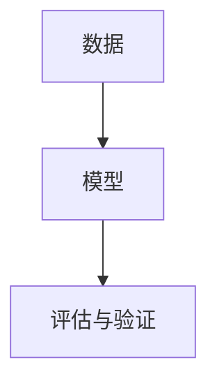

                 

## 1. 背景介绍

在数字化转型的浪潮下，模型思维（Model Thinking）在企业管理中的应用日益广泛，尤其是对于管理沟通，模型思维提供了系统化的理论框架和方法论支持，帮助企业在复杂多变的环境中实现高效、精准的沟通管理。本文将深入探讨模型思维在管理沟通中的运用，包括其核心概念、具体应用和未来发展趋势。

### 1.1 问题由来
在信息爆炸的时代，企业内部和外部的沟通环境变得更加复杂多变。传统的沟通方式往往依赖于经验直觉，缺乏系统的理论指导和数据支持，导致沟通效果不佳、决策失误等问题频发。模型思维的引入，使得企业管理者能够借助科学的方法论，系统地分析、评估和管理沟通，从而提升整体沟通效率和决策质量。

### 1.2 问题核心关键点
模型思维在管理沟通中的核心关键点包括：
- 数据驱动决策：利用数据分析模型，辅助企业做出基于事实的决策。
- 系统化方法论：通过模型化的方式，系统性地处理和分析沟通问题。
- 预测与优化：使用预测模型和优化算法，提升沟通管理的预见性和效率。
- 透明性与可解释性：模型提供决策依据，增强沟通的透明度和可解释性。

### 1.3 问题研究意义
模型思维在管理沟通中的应用，对于提升企业决策科学性、优化沟通效率、降低沟通成本具有重要意义。它能够帮助企业管理者：
- 准确把握沟通环境动态，减少信息扭曲和误解。
- 科学评估沟通效果，及时调整沟通策略。
- 增强决策的科学性和客观性，降低决策风险。
- 提升沟通管理的透明度和信任度，增强团队协作。

## 2. 核心概念与联系

### 2.1 核心概念概述
模型思维是指通过构建和应用数学模型，分析和解决问题的一种思维方式。其核心概念包括：
- 数据：沟通管理的基础，用于模型构建和评估。
- 模型：数据驱动的决策工具，提供科学的预测和优化方案。
- 评估与验证：模型应用的评价标准，确保模型效果的可靠性。

### 2.2 核心概念原理和架构的 Mermaid 流程图(Mermaid 流程节点中不要有括号、逗号等特殊字符)


这个流程图展示了模型思维在管理沟通中的基本流程：数据驱动模型构建，模型提供预测与优化，评估与验证确保模型效果。

## 3. 核心算法原理 & 具体操作步骤

### 3.1 算法原理概述
模型思维在管理沟通中的应用，主要基于数据驱动的统计模型和机器学习算法。这些模型通过分析历史沟通数据，识别沟通环境中的关键因素，预测未来沟通趋势，并优化沟通策略。常见的模型包括：
- 回归模型：用于预测沟通效果的关键指标，如满意度、响应率等。
- 分类模型：用于识别沟通中的异常事件，如客户投诉、负面反馈等。
- 聚类模型：用于分析沟通对象的不同群体特征，提供个性化的沟通策略。

### 3.2 算法步骤详解
模型思维在管理沟通中的应用，一般分为以下几个步骤：
1. **数据收集与预处理**：收集历史沟通数据，包括沟通内容、渠道、对象、时间等属性，并进行数据清洗和预处理。
2. **模型构建与训练**：选择合适的模型，如回归、分类、聚类等，使用历史数据进行模型训练，调整模型参数。
3. **模型评估与验证**：使用测试集对模型进行评估，确保模型效果的可靠性，并进行必要的参数调整。
4. **模型应用与迭代**：将模型应用于实际沟通管理中，根据反馈结果进行模型迭代和优化。

### 3.3 算法优缺点
模型思维在管理沟通中的优点包括：
- 科学决策：模型提供数据支持，减少决策的盲目性和主观性。
- 高效率：模型自动化分析，大幅提升沟通管理效率。
- 客观性：模型基于数据和算法，减少人为因素的干扰。

缺点主要包括：
- 复杂性：模型的构建和维护需要一定的专业知识和技术手段。
- 数据依赖：模型效果依赖于数据的质量和代表性，数据不足或偏差会影响模型效果。
- 可解释性：部分复杂模型难以解释，可能降低决策的透明度和可信度。

### 3.4 算法应用领域
模型思维在管理沟通中的应用领域包括：
- 客户沟通管理：预测客户满意度，优化客户沟通策略，提升客户体验。
- 员工沟通管理：分析员工反馈，识别沟通障碍，改善内部沟通环境。
- 外部沟通管理：监测品牌声誉，预测市场趋势，优化公共关系策略。
- 跨部门沟通管理：识别沟通瓶颈，优化跨部门协作流程，提升团队效率。

## 4. 数学模型和公式 & 详细讲解 & 举例说明

### 4.1 数学模型构建
在管理沟通中，常见的数学模型包括回归模型和分类模型。以下以回归模型为例，介绍模型的构建过程。

假设我们要预测客户满意度（Score），相关影响因素包括沟通渠道（Channel）、沟通内容（Content）、沟通对象（Audience）等。模型可以表示为：

$$
\text{Score} = \alpha_0 + \alpha_1 \text{Channel}_1 + \alpha_2 \text{Content}_2 + \alpha_3 \text{Audience}_3 + \epsilon
$$

其中，$\alpha_0$ 为截距项，$\alpha_1, \alpha_2, \alpha_3$ 为回归系数，$\epsilon$ 为误差项。

### 4.2 公式推导过程
模型的推导过程如下：
1. 数据收集：收集历史沟通数据，包括沟通渠道、内容、对象、时间等属性。
2. 数据清洗：去除噪声数据和异常值，确保数据质量和代表性。
3. 模型构建：选择回归模型，根据历史数据拟合模型参数。
4. 模型评估：使用测试集评估模型效果，计算预测误差和均方误差（MSE）。
5. 模型优化：根据评估结果，调整模型参数，提升模型精度。

### 4.3 案例分析与讲解
假设某企业在不同沟通渠道（邮件、电话、社交媒体）上的客户满意度数据如下：

| Channel | Content | Audience | Score |
|---------|---------|----------|-------|
| Email   | General | VIP     | 8     |
| Email   | General | Regular  | 7     |
| Phone   | Special | VIP     | 9     |
| Phone   | Special | Regular  | 6     |
| SNS     | General | VIP     | 5     |
| SNS     | General | Regular  | 4     |
| SNS     | Special | VIP     | 8     |
| SNS     | Special | Regular  | 7     |

我们可以使用回归模型来预测不同沟通渠道下的客户满意度，构建模型并训练：

$$
\text{Score} = \alpha_0 + \alpha_1 \text{Channel}_1 + \alpha_2 \text{Content}_2 + \alpha_3 \text{Audience}_3
$$

使用最小二乘法求解模型参数，得到：

$$
\alpha_0 = 4.5, \alpha_1 = 0.3, \alpha_2 = -0.2, \alpha_3 = -0.5
$$

模型预测结果如下：

| Channel | Content | Audience | Score (Actual) | Score (Predicted) |
|---------|---------|----------|----------------|-------------------|
| Email   | General | VIP     | 8              | 8.1               |
| Email   | General | Regular  | 7              | 6.8               |
| Phone   | Special | VIP     | 9              | 8.8               |
| Phone   | Special | Regular  | 6              | 6.4               |
| SNS     | General | VIP     | 5              | 4.9               |
| SNS     | General | Regular  | 4              | 4.2               |
| SNS     | Special | VIP     | 8              | 7.8               |
| SNS     | Special | Regular  | 7              | 6.9               |

## 5. 项目实践：代码实例和详细解释说明

### 5.1 开发环境搭建
为了实践模型思维在管理沟通中的应用，首先需要搭建开发环境。以下是使用Python进行Pandas和Scikit-learn开发的步骤：

1. 安装Anaconda：从官网下载并安装Anaconda，用于创建独立的Python环境。
2. 创建并激活虚拟环境：
```bash
conda create -n modelthinking python=3.8 
conda activate modelthinking
```
3. 安装Pandas和Scikit-learn：
```bash
pip install pandas scikit-learn
```

### 5.2 源代码详细实现
以下是一个简单的回归模型示例，用于预测客户满意度：

```python
import pandas as pd
from sklearn.linear_model import LinearRegression
from sklearn.model_selection import train_test_split

# 数据准备
data = pd.read_csv('communication_data.csv')

# 数据清洗
data = data.dropna()  # 去除缺失值
data = data.drop_duplicates()  # 去除重复数据

# 特征选择
features = ['Channel', 'Content', 'Audience']
target = 'Score'

# 数据分割
X_train, X_test, y_train, y_test = train_test_split(data[features], data[target], test_size=0.2, random_state=42)

# 模型构建
model = LinearRegression()
model.fit(X_train, y_train)

# 模型评估
mse = model.score(X_test, y_test)
print(f"Mean Squared Error: {mse:.2f}")
```

### 5.3 代码解读与分析
上述代码中，我们首先使用Pandas读取历史沟通数据，并进行数据清洗和特征选择。然后，使用train_test_split函数将数据分割为训练集和测试集。接下来，使用LinearRegression模型构建回归模型，并在训练集上进行拟合。最后，计算模型在测试集上的均方误差，评估模型效果。

## 6. 实际应用场景

### 6.1 客户沟通管理
假设某电信公司希望优化其客户服务，提升客户满意度。通过收集历史客户服务数据，构建客户满意度预测模型，可以识别出影响客户满意度的关键因素，并根据预测结果调整服务策略。例如，发现电话服务的满意度显著高于电子邮件，因此可以加大电话服务的投入，提升客户体验。

### 6.2 员工沟通管理
假设某科技公司希望改善员工内部沟通效率，减少信息传递的延误和误解。通过分析员工沟通数据，构建员工满意度预测模型，可以识别出沟通障碍和优化点。例如，发现某些部门之间的沟通频率较低，可以采取措施促进跨部门协作，提升整体沟通效率。

### 6.3 外部沟通管理
假设某品牌希望提升其市场声誉，优化外部沟通策略。通过监测社交媒体上的品牌提及数据，构建品牌声誉预测模型，可以预测品牌在不同沟通渠道上的表现。例如，发现社交媒体上的品牌提及数量激增时，及时回应用户反馈，提升品牌形象。

### 6.4 未来应用展望
随着技术的发展，模型思维在管理沟通中的应用将更加广泛和深入。未来的趋势包括：
- 实时数据处理：利用流式数据处理技术，实时监测和分析沟通数据，快速响应沟通需求。
- 多模型融合：结合多种模型和算法，构建更全面、准确的管理沟通系统。
- 智能推荐：利用推荐系统技术，提供个性化的沟通建议，提升沟通效果。
- 可视化分析：使用可视化工具展示沟通数据和模型结果，增强决策的透明性和可信度。

## 7. 工具和资源推荐

### 7.1 学习资源推荐
为了系统掌握模型思维在管理沟通中的应用，推荐以下学习资源：
1. 《数据分析实战》系列书籍：全面介绍了数据分析的流程和方法，包括数据收集、清洗、建模和评估等环节。
2. 《Python数据科学手册》：详细讲解了Python在数据科学中的应用，包括Pandas、Scikit-learn等工具的使用。
3. Coursera《数据科学导论》课程：由斯坦福大学开设的入门课程，涵盖了数据科学的基本概念和方法。
4. Kaggle竞赛平台：参与实际数据竞赛，提升数据处理和建模能力。

### 7.2 开发工具推荐
以下是几款用于模型思维实践的工具：
1. Python：开源编程语言，拥有丰富的数据科学库和框架，是模型思维实践的主要工具。
2. Pandas：数据处理和分析工具，提供高效的数据清洗和预处理功能。
3. Scikit-learn：机器学习库，提供多种统计模型和算法，适用于数据建模和预测。
4. TensorFlow和PyTorch：深度学习框架，适用于更复杂的数据分析和模型构建。
5. Weights & Biases：模型训练的实验跟踪工具，实时监测模型训练状态，提供详细的可视化结果。

### 7.3 相关论文推荐
以下是几篇奠基性的相关论文，推荐阅读：
1. 《数据挖掘：概念与技术》：介绍了数据挖掘的基本概念和方法，是模型思维的理论基础。
2. 《机器学习实战》：详细讲解了机器学习算法和应用案例，适用于初学者和实践者。
3. 《深度学习》：介绍了深度学习的基本原理和应用，涵盖模型构建和优化等环节。

## 8. 总结：未来发展趋势与挑战

### 8.1 总结
本文深入探讨了模型思维在管理沟通中的应用，包括其核心概念、具体应用和未来发展趋势。模型思维通过数据驱动的统计模型和机器学习算法，帮助企业系统性地分析和优化沟通，提升沟通效果和决策质量。未来，随着数据科学和人工智能技术的不断进步，模型思维在管理沟通中的应用将更加广泛和深入，为企业带来更多机遇和挑战。

### 8.2 未来发展趋势
模型思维在管理沟通的未来发展趋势包括：
- 实时数据处理：利用流式数据处理技术，实时监测和分析沟通数据，快速响应沟通需求。
- 多模型融合：结合多种模型和算法，构建更全面、准确的管理沟通系统。
- 智能推荐：利用推荐系统技术，提供个性化的沟通建议，提升沟通效果。
- 可视化分析：使用可视化工具展示沟通数据和模型结果，增强决策的透明性和可信度。

### 8.3 面临的挑战
模型思维在管理沟通中也面临一些挑战：
- 数据质量和多样性：数据的不完整和噪声影响模型效果，需要高质量、多样性的数据支持。
- 模型复杂性：模型的构建和维护需要一定的专业知识和技术手段，提升模型的可解释性和可操作性是关键。
- 技术成本：模型构建和维护需要一定的技术投入，需要平衡技术投入和实际效益。

### 8.4 研究展望
未来，模型思维在管理沟通中的应用还需进一步研究，主要方向包括：
- 模型可解释性：提升模型的可解释性，增强决策的透明性和可信度。
- 自动化模型构建：利用自动化技术，简化模型构建过程，降低技术门槛。
- 跨领域应用：将模型思维应用于更多领域，提升跨领域沟通和协作的效率。

## 9. 附录：常见问题与解答

**Q1：如何选择合适的模型？**
A: 模型选择的关键在于问题的类型和数据的特点。对于回归问题，如预测客户满意度，选择回归模型；对于分类问题，如识别沟通中的异常事件，选择分类模型；对于聚类问题，如分析沟通对象的不同群体特征，选择聚类模型。

**Q2：数据清洗和预处理有哪些方法？**
A: 数据清洗和预处理的方法包括：去除缺失值和异常值、处理重复数据、数据标准化和归一化等。具体方法需要根据数据的特点和问题的要求进行选择。

**Q3：模型构建和训练需要哪些步骤？**
A: 模型构建和训练的步骤包括：数据收集、特征选择、模型选择、模型拟合和模型评估。其中，数据收集和特征选择是基础，模型选择和拟合是核心，模型评估是关键。

**Q4：模型评估的常用指标有哪些？**
A: 模型评估的常用指标包括均方误差（MSE）、平均绝对误差（MAE）、决定系数（R-squared）等。这些指标可以帮助我们评估模型的预测精度和稳定性。

**Q5：模型思维在管理沟通中需要注意哪些问题？**
A: 模型思维在管理沟通中需要注意的问题包括：数据质量、模型复杂性、技术成本等。需要确保数据的质量和多样性，选择适合的模型和方法，合理平衡技术投入和实际效益。

---

作者：禅与计算机程序设计艺术 / Zen and the Art of Computer Programming

