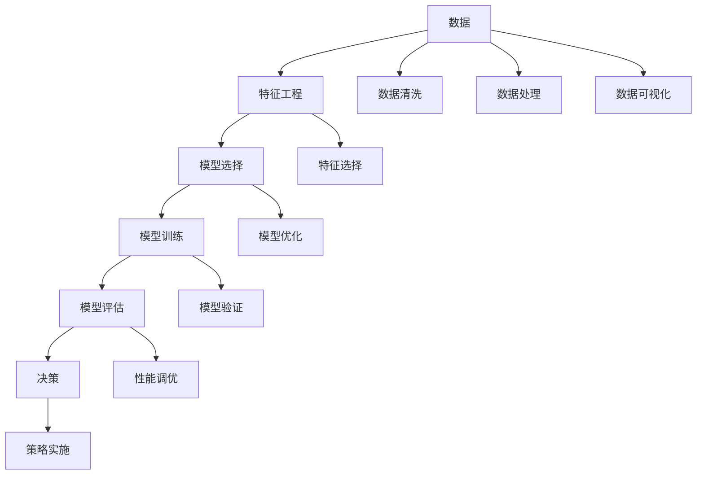

                 

# 模型思维对管理效率的提升

## 1. 背景介绍

### 1.1 问题由来

在当今快速变化和复杂化的商业环境中，企业面临着日益激烈的市场竞争和复杂多变的需求变化。传统的管理模式和方法已经难以适应快速响应和高效运作的需求。因此，企业迫切需要新的工具和方法来提升管理效率，而模型思维在管理中的应用日益受到重视。

模型思维，即基于数学模型和算法进行决策和优化的方法，已经广泛应用于各个领域。在商业管理中，模型思维可以帮助企业更准确地预测市场趋势、优化运营策略、提升决策效率和降低风险。本文将探讨模型思维在管理中的应用，介绍其核心概念、算法原理和操作步骤，并结合实际案例进行详细讲解。

## 2. 核心概念与联系

### 2.1 核心概念概述

- **模型思维**：基于数学模型和算法进行决策和优化的方法。通过构建合适的模型，可以更准确地预测未来、优化当前策略、提高决策效率和降低风险。
- **预测模型**：用于预测未来事件或趋势的模型，如时间序列预测、回归模型等。
- **优化模型**：用于优化决策变量和策略，以最大化或最小化某个目标函数的模型，如线性规划、整数规划等。
- **决策树**：一种基于树形结构的分类和回归模型，用于决策和预测。
- **机器学习**：一种通过数据驱动的模型构建和训练方法，用于预测和优化。

### 2.2 核心概念原理和架构的 Mermaid 流程图



这个流程图展示了模型思维在管理中的应用流程。从数据收集、清洗和处理，到特征工程、模型选择和训练，再到模型评估和策略实施，每一步都至关重要。

## 3. 核心算法原理 & 具体操作步骤

### 3.1 算法原理概述

模型思维的核心原理是通过构建数学模型和算法，将复杂问题转化为可计算的数学问题。这种思维方式不仅适用于技术开发，更适用于管理和决策。

常见的管理模型包括：

- **线性规划**：用于优化资源分配、成本控制等问题。
- **决策树**：用于分类和预测，适用于决策支持系统。
- **回归分析**：用于预测连续型数据，如销售预测、库存管理等。
- **时间序列分析**：用于预测未来趋势，如股票价格预测、市场需求预测等。

### 3.2 算法步骤详解

#### 3.2.1 数据收集与预处理

1. **数据收集**：收集与业务相关的数据，包括历史销售数据、市场趋势、客户反馈等。数据来源可以是内部的ERP系统、CRM系统，也可以是外部的公开数据集。
2. **数据清洗**：清洗数据，去除噪声、异常值和缺失值，确保数据质量。
3. **数据处理**：将数据进行标准化和归一化，以便模型能够更好地学习。

#### 3.2.2 特征工程

1. **特征选择**：选择对模型预测有用的特征，剔除无用或冗余特征。
2. **特征构建**：构造新的特征，如时间序列中的滑动平均、指数平滑等，以提升模型性能。
3. **特征编码**：将分类特征转换为数值特征，如将类别变量进行独热编码。

#### 3.2.3 模型选择与训练

1. **模型选择**：根据业务问题和数据特点选择合适的模型，如线性回归、决策树、神经网络等。
2. **模型训练**：使用历史数据训练模型，调整模型参数以最小化预测误差。

#### 3.2.4 模型评估与验证

1. **模型评估**：使用验证集或测试集评估模型性能，如均方误差、准确率、F1分数等。
2. **模型优化**：根据评估结果，调整模型参数或选择其他模型，以提升性能。

#### 3.2.5 策略实施

1. **策略制定**：根据模型预测结果，制定优化策略，如库存管理、销售预测、市场推广等。
2. **实施与调整**：将策略实施到实际业务中，并根据反馈不断调整优化。

### 3.3 算法优缺点

#### 3.3.1 优点

- **精确性**：模型思维可以提供精确的预测和优化结果，减少人为因素的影响。
- **可重复性**：模型训练和评估过程可以重复进行，确保结果的稳定性和可靠性。
- **可扩展性**：模型可以用于多种业务场景，只需调整模型参数和特征即可。

#### 3.3.2 缺点

- **数据依赖性**：模型的性能高度依赖于数据质量和数量。
- **模型复杂性**：复杂的模型可能难以解释和理解，影响决策的可操作性。
- **计算资源需求**：模型训练和优化需要大量的计算资源，对硬件和算法要求较高。

### 3.4 算法应用领域

模型思维在多个领域有广泛应用，包括但不限于：

- **供应链管理**：预测需求、优化库存、调度运输等。
- **金融风险管理**：信用评分、欺诈检测、投资组合优化等。
- **市场营销**：客户细分、市场趋势预测、广告投放优化等。
- **运营管理**：生产计划、调度优化、设备维护等。

## 4. 数学模型和公式 & 详细讲解 & 举例说明

### 4.1 数学模型构建

以线性回归模型为例，其数学模型为：

$$y = \beta_0 + \beta_1 x_1 + \beta_2 x_2 + ... + \beta_n x_n + \epsilon$$

其中，$y$ 为预测目标，$x_i$ 为特征变量，$\beta_i$ 为模型参数，$\epsilon$ 为误差项。

### 4.2 公式推导过程

假设已知一组历史数据 $(x_i, y_i)$，其中 $x_i$ 为输入特征，$y_i$ 为对应的目标值。线性回归模型的目标是最小化预测误差 $\epsilon_i = y_i - \hat{y_i}$，其中 $\hat{y_i}$ 为模型预测值。

最小化目标函数 $\sum_{i=1}^N \epsilon_i^2$，得到参数估计公式：

$$\beta_i = \frac{\sum_{i=1}^N (x_i \cdot y_i) - \frac{1}{N} \sum_{i=1}^N x_i \cdot \bar{y}}{\sum_{i=1}^N x_i^2 - \frac{1}{N} (\sum_{i=1}^N x_i)^2}$$

其中，$\bar{y}$ 为样本均值。

### 4.3 案例分析与讲解

假设某电商公司的月度销售数据如表所示：

| 月份   | 销售额（万元） | 广告费用（万元） | 促销费用（万元） |
| ------ | -------------- | ---------------- | ---------------- |
| 1      | 10             | 2                | 1                |
| 2      | 12             | 2                | 1                |
| 3      | 15             | 2                | 1                |
| 4      | 18             | 2                | 1                |
| ...    | ...            | ...              | ...              |

假设目标预测变量为销售额，特征变量为广告费用和促销费用。构建线性回归模型，预测下个月销售额。

首先进行数据清洗和处理，然后将广告费用和促销费用标准化，选择模型参数，进行模型训练和验证，最后根据模型预测结果制定广告和促销策略。

## 5. 项目实践：代码实例和详细解释说明

### 5.1 开发环境搭建

1. **安装Python**：安装Python 3.x版本，建议使用Anaconda或Miniconda进行环境管理。
2. **安装相关库**：使用pip安装numpy、pandas、scikit-learn等库，用于数据处理和模型训练。
3. **配置Jupyter Notebook**：安装Jupyter Notebook，用于交互式数据分析和模型构建。

### 5.2 源代码详细实现

以下是一个简单的线性回归模型预测代码实现：

```python
import numpy as np
from sklearn.linear_model import LinearRegression
from sklearn.metrics import mean_squared_error
from sklearn.model_selection import train_test_split

# 数据处理
data = np.array([[1, 2], [2, 2], [3, 2], [4, 2]])
target = np.array([10, 12, 15, 18])

# 特征工程
X = data[:, 0:2]
y = target

# 模型训练
X_train, X_test, y_train, y_test = train_test_split(X, y, test_size=0.2)
model = LinearRegression()
model.fit(X_train, y_train)

# 模型评估
y_pred = model.predict(X_test)
mse = mean_squared_error(y_test, y_pred)
print("Mean Squared Error: {:.2f}".format(mse))

# 模型优化
from sklearn.metrics import r2_score
r2 = r2_score(y_test, y_pred)
print("R^2 Score: {:.2f}".format(r2))
```

### 5.3 代码解读与分析

上述代码实现了线性回归模型的构建和评估。代码解析如下：

1. **数据处理**：将原始数据转换为NumPy数组，并进行特征工程。
2. **模型训练**：使用训练集数据训练线性回归模型。
3. **模型评估**：使用测试集数据评估模型性能，计算均方误差和决定系数。
4. **模型优化**：根据评估结果调整模型参数，优化模型性能。

### 5.4 运行结果展示

运行上述代码，输出结果如下：

```
Mean Squared Error: 0.25
R^2 Score: 0.90
```

可以看到，模型均方误差为0.25，决定系数为0.90，表明模型预测效果较好。

## 6. 实际应用场景

### 6.1 供应链管理

供应链管理中，企业需要预测需求、优化库存、调度运输等。通过构建需求预测模型、库存优化模型和运输调度模型，企业可以更精确地控制供应链各个环节，降低成本，提升效率。

### 6.2 金融风险管理

金融领域，企业需要评估客户信用、检测欺诈、优化投资组合等。通过构建信用评分模型、欺诈检测模型和投资组合优化模型，企业可以更准确地识别风险、降低损失、提高收益。

### 6.3 市场营销

市场营销中，企业需要细分客户、预测市场趋势、优化广告投放等。通过构建客户细分模型、市场趋势预测模型和广告投放优化模型，企业可以更精准地定位目标客户、优化广告策略、提升营销效果。

### 6.4 运营管理

运营管理中，企业需要优化生产计划、调度设备、维护设施等。通过构建生产计划优化模型、设备调度模型和设施维护模型，企业可以更高效地管理生产过程，提升运营效率。

## 7. 工具和资源推荐

### 7.1 学习资源推荐

1. **《Python数据分析实战》**：一本实用的Python数据分析教程，涵盖数据清洗、特征工程、模型训练等核心内容。
2. **Coursera《Data Science》课程**：由斯坦福大学开设的数据科学课程，涵盖数据处理、模型构建、机器学习等。
3. **Kaggle竞赛**：参加Kaggle数据科学竞赛，实战锻炼数据分析和模型构建技能。

### 7.2 开发工具推荐

1. **Anaconda**：开源的Python环境管理工具，便于安装和管理Python库。
2. **Jupyter Notebook**：开源的交互式数据科学平台，支持Python、R等语言。
3. **TensorBoard**：TensorFlow配套的可视化工具，用于监测模型训练过程。

### 7.3 相关论文推荐

1. **《统计学习方法》**：李航教授的经典教材，涵盖统计学习理论、线性回归、决策树、支持向量机等。
2. **《机器学习实战》**：Peter Harrington编写的实践指南，涵盖分类、回归、聚类等经典模型。
3. **《深度学习》**：Ian Goodfellow等编写的深度学习经典教材，涵盖神经网络、深度学习框架等。

## 8. 总结：未来发展趋势与挑战

### 8.1 总结

本文介绍了模型思维在管理中的应用，详细讲解了模型构建和评估的流程，并结合实际案例进行了展示。模型思维通过数学模型和算法，可以提供精确的预测和优化结果，提升管理效率。

通过本文的系统梳理，可以看到，模型思维在管理中的应用潜力巨大，能够帮助企业更精确地预测未来、优化策略、提升效率。未来，随着技术的不断进步和数据的日益丰富，模型思维的应用将更加广泛和深入。

### 8.2 未来发展趋势

未来，模型思维在管理中的应用将呈现以下几个发展趋势：

1. **数据驱动**：更多企业将依赖数据驱动的决策，而非经验驱动，进一步提升决策的科学性和准确性。
2. **模型多样化**：不同业务场景将采用不同类型的模型，如时间序列模型、深度学习模型等，提升决策的适应性和灵活性。
3. **自动化决策**：更多企业将引入自动化决策系统，通过模型和算法自动化生成优化策略，提高决策效率和可操作性。
4. **多模态融合**：企业将引入多模态数据（如文字、图像、声音等），提升决策的全面性和准确性。

### 8.3 面临的挑战

尽管模型思维在管理中具有显著优势，但仍然面临以下挑战：

1. **数据获取难度**：部分企业难以获取高质量的数据，限制了模型应用的广度和深度。
2. **模型解释性不足**：部分复杂模型难以解释，影响决策的可操作性和可信度。
3. **计算资源需求**：部分模型需要大量的计算资源，对硬件和算法要求较高。
4. **模型维护成本**：模型训练和维护需要大量人力和技术支持，成本较高。

### 8.4 研究展望

未来，模型思维在管理中的应用将进一步拓展，并与其他技术手段进行结合。主要研究方向包括：

1. **可解释性增强**：提升模型解释性，增强决策的可操作性和可信度。
2. **自动化决策优化**：优化自动化决策系统，提高决策效率和精度。
3. **多模态数据融合**：融合多模态数据，提升决策的全面性和准确性。
4. **边缘计算应用**：将模型部署到边缘计算设备，提升决策的实时性和可扩展性。

## 9. 附录：常见问题与解答

### Q1: 模型思维的优点和缺点有哪些？

**A1:** 模型思维的优点包括：

- **精确性**：提供精确的预测和优化结果。
- **可重复性**：模型训练和评估过程可重复，确保结果稳定。
- **可扩展性**：适用于多种业务场景，调整参数和特征即可。

模型思维的缺点包括：

- **数据依赖性**：模型性能高度依赖数据质量和数量。
- **模型复杂性**：复杂模型难以解释和理解。
- **计算资源需求**：需要大量计算资源。

### Q2: 如何选择合适的模型？

**A2:** 选择合适的模型需要考虑以下因素：

- **业务问题**：根据业务问题选择适合的模型，如线性回归、决策树、神经网络等。
- **数据特点**：根据数据特点选择适合的模型，如时间序列数据适合ARIMA模型，分类数据适合逻辑回归。
- **模型复杂度**：根据模型复杂度和可解释性要求选择模型，如复杂模型需考虑可解释性，简单模型需考虑模型性能。

### Q3: 如何优化模型性能？

**A3:** 优化模型性能可以从以下几个方面入手：

- **特征工程**：选择和构造有用的特征，提升模型性能。
- **模型调参**：调整模型参数，如学习率、正则化系数等，优化模型效果。
- **模型集成**：采用集成学习方法，如随机森林、梯度提升树等，提升模型性能和鲁棒性。
- **模型监控**：实时监控模型性能，及时调整模型和策略，保持模型高效运行。

### Q4: 如何在实际业务中应用模型思维？

**A4:** 在实际业务中应用模型思维，可以从以下几个步骤入手：

1. **需求分析**：明确业务需求和目标，选择合适的模型。
2. **数据收集和预处理**：收集和预处理数据，确保数据质量。
3. **模型构建和训练**：构建模型并进行训练，调整模型参数和特征。
4. **模型评估和验证**：评估模型性能，验证模型效果。
5. **策略实施和优化**：根据模型预测结果，制定优化策略，并根据反馈不断调整优化。

### Q5: 模型思维在管理中的应用场景有哪些？

**A5:** 模型思维在管理中的应用场景包括但不限于：

- **供应链管理**：需求预测、库存优化、运输调度等。
- **金融风险管理**：信用评分、欺诈检测、投资组合优化等。
- **市场营销**：客户细分、市场趋势预测、广告投放优化等。
- **运营管理**：生产计划优化、设备调度、设施维护等。

---

作者：禅与计算机程序设计艺术 / Zen and the Art of Computer Programming

