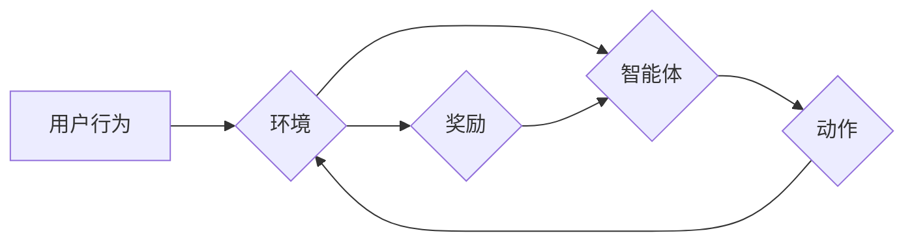

                 

## 电商行业中的强化学习：大模型的实践

> 关键词：强化学习、大模型、电商推荐、个性化服务、库存优化、价格策略、机器人自动化

## 1. 背景介绍

电子商务行业在全球范围内蓬勃发展，其核心竞争力在于为用户提供个性化、高效、便捷的购物体验。传统电商平台依靠规则引擎和基于内容的推荐算法，但随着用户行为的复杂化和数据量的激增，这些方法逐渐难以满足日益增长的需求。强化学习（Reinforcement Learning，RL）作为一种机器学习范式，凭借其强大的学习能力和适应性，逐渐成为电商行业的重要技术驱动力。

强化学习的核心思想是通过智能体与环境的交互，学习最优的策略以最大化累积奖励。在电商场景中，智能体可以是推荐系统、库存管理系统、价格调整系统等，环境则是用户行为、市场动态等复杂因素，奖励则是用户满意度、转化率、利润等指标。

大模型（Large Language Model，LLM）作为近年来人工智能领域取得突破性进展的代表，拥有强大的文本理解和生成能力。将大模型与强化学习相结合，可以进一步提升电商平台的智能化水平，实现更精准的个性化服务、更有效的库存优化、更灵活的价格策略等。

## 2. 核心概念与联系

### 2.1 强化学习

强化学习的核心概念包括：

* **智能体 (Agent):**  决策者，例如推荐系统、库存管理系统等。
* **环境 (Environment):** 智能体所处的外部世界，例如用户行为、市场动态等。
* **状态 (State):** 环境的当前描述，例如用户浏览历史、商品库存量等。
* **动作 (Action):** 智能体可以执行的操作，例如推荐商品、调整库存、修改价格等。
* **奖励 (Reward):** 环境对智能体动作的反馈，例如用户点击、购买、好评等。
* **策略 (Policy):** 智能体根据状态选择动作的规则。

强化学习的目标是通过智能体与环境的交互，学习最优的策略，使得智能体在长期内获得最大的累积奖励。

### 2.2 大模型

大模型是指参数量巨大、训练数据海量的人工智能模型。大模型通常具有强大的文本理解和生成能力，可以用于各种自然语言处理任务，例如文本分类、机器翻译、对话系统等。

### 2.3 强化学习与大模型的结合

将强化学习与大模型相结合，可以充分发挥两者各自的优势。大模型可以提供丰富的语义理解和文本生成能力，帮助智能体更好地感知环境和制定策略。而强化学习可以引导大模型学习最优的策略，使其在实际应用中更加高效和智能。

**Mermaid 流程图**



## 3. 核心算法原理 & 具体操作步骤

### 3.1 算法原理概述

强化学习算法的核心是通过迭代更新策略，使得智能体在与环境交互的过程中不断学习，最终找到最优的策略。常见的强化学习算法包括：

* **Q-学习:** 通过构建Q表，学习每个状态下采取不同动作的期望回报，选择最大期望回报的动作。
* **SARSA:** 与Q-学习类似，但更新Q表时使用的是当前状态和采取的动作的实际回报。
* **Deep Q-Network (DQN):** 将Q表替换为深度神经网络，可以处理高维状态空间。
* **Policy Gradient:** 直接优化策略参数，无需构建Q表。

### 3.2 算法步骤详解

以Q-学习为例，其具体操作步骤如下：

1. 初始化Q表，将所有状态-动作对的Q值设置为0。
2. 智能体根据策略选择动作，执行动作并观察环境的反馈（状态和奖励）。
3. 更新Q值：

 $$Q(s,a) = Q(s,a) + \alpha [r + \gamma \max_{a'} Q(s',a') - Q(s,a)]$$

其中：

* $Q(s,a)$ 是状态s下采取动作a的Q值。
* $\alpha$ 是学习率，控制学习速度。
* $r$ 是获得的奖励。
* $\gamma$ 是折扣因子，控制未来奖励的权重。
* $s'$ 是执行动作后进入的新状态。
* $a'$ 是在新的状态下选择动作的策略。

4. 重复步骤2和3，直到Q值收敛。

### 3.3 算法优缺点

**优点:**

* 学习能力强，可以学习复杂的环境和策略。
* 适应性强，可以适应环境的变化。
* 可以处理连续动作空间。

**缺点:**

* 训练时间长，需要大量的样本数据。
* 容易陷入局部最优解。
* 算法参数需要精心调优。

### 3.4 算法应用领域

强化学习算法广泛应用于各种领域，例如：

* **游戏:** 训练游戏AI，例如AlphaGo、AlphaStar。
* **机器人控制:** 训练机器人执行复杂任务，例如导航、抓取。
* **推荐系统:** 训练推荐系统，例如个性化商品推荐、内容推荐。
* **金融:** 训练交易策略、风险管理系统。
* **医疗:** 训练辅助诊断系统、个性化治疗方案。

## 4. 数学模型和公式 & 详细讲解 & 举例说明

### 4.1 数学模型构建

强化学习的数学模型通常由以下几个部分组成：

* **状态空间 (S):** 所有可能的系统状态的集合。
* **动作空间 (A):** 智能体可以采取的所有动作的集合。
* **奖励函数 (R):** 描述环境对智能体动作的反馈，通常是一个从状态-动作对到实数的函数。
* **策略 (π):** 智能体根据状态选择动作的概率分布。

### 4.2 公式推导过程

Q-学习算法的核心公式是Bellman方程：

$$Q(s,a) = \mathbb{E}_{\pi}[R_{t+1} + \gamma \max_{a'} Q(s',a')]$$

其中：

* $Q(s,a)$ 是状态s下采取动作a的期望回报。
* $\mathbb{E}_{\pi}$ 表示根据策略π取期望。
* $R_{t+1}$ 是下一个时间步的奖励。
* $\gamma$ 是折扣因子，控制未来奖励的权重。
* $s'$ 是执行动作后进入的新状态。
* $a'$ 是在新的状态下选择动作的策略。

### 4.3 案例分析与讲解

假设一个智能体在玩一个简单的游戏，状态空间是游戏中的地图，动作空间是“向上”、“向下”、“向左”、“向右”四个方向。奖励函数是：

* 当智能体到达游戏目标时，奖励为100。
* 当智能体撞到障碍物时，奖励为-10。
* 其他情况下，奖励为0。

通过Q-学习算法，智能体可以学习到每个状态下采取不同动作的期望回报，最终找到到达目标的最佳策略。

## 5. 项目实践：代码实例和详细解释说明

### 5.1 开发环境搭建

* Python 3.7+
* TensorFlow/PyTorch
* Jupyter Notebook

### 5.2 源代码详细实现

```python
import numpy as np

# 定义状态空间和动作空间
state_space = 4  # 四个方向
action_space = 4  # 四个方向

# 定义Q表
Q = np.zeros((state_space, action_space))

# 定义学习参数
alpha = 0.1  # 学习率
gamma = 0.9  # 折扣因子

# 定义游戏环境
class GameEnv:
    def __init__(self):
        # 初始化游戏地图
        self.map = np.zeros((state_space, state_space))
        # 设置目标位置
        self.goal = (2, 2)

    def reset(self):
        # 重置游戏状态
        return (0, 0)  # 初始位置

    def step(self, action):
        # 执行动作
        state = self.current_state
        next_state = self.get_next_state(state, action)
        reward = self.get_reward(next_state)
        done = self.is_done(next_state)
        return next_state, reward, done

# 游戏循环
env = GameEnv()
state = env.reset()

while True:
    # 选择动作
    action = np.argmax(Q[state])
    # 执行动作
    next_state, reward, done = env.step(action)
    # 更新Q值
    Q[state, action] = Q[state, action] + alpha * (reward + gamma * np.max(Q[next_state]) - Q[state, action])
    # 更新状态
    state = next_state
    # 检查是否结束游戏
    if done:
        break
```

### 5.3 代码解读与分析

* 代码首先定义了状态空间、动作空间、Q表、学习参数等。
* 然后定义了一个游戏环境类，包含地图、目标位置、奖励函数等。
* 游戏循环中，智能体根据Q表选择动作，执行动作后更新Q值，直到游戏结束。

### 5.4 运行结果展示

运行代码后，智能体会逐渐学习到到达目标的最佳策略，最终能够成功到达目标。

## 6. 实际应用场景

### 6.1 个性化推荐

强化学习可以用于个性化商品推荐，例如根据用户的浏览历史、购买记录等信息，学习用户的偏好，推荐更符合用户需求的商品。

### 6.2 库存优化

强化学习可以用于优化库存管理，例如根据商品需求预测、库存成本等因素，学习最优的库存水平，避免库存积压或缺货。

### 6.3 价格策略

强化学习可以用于优化价格策略，例如根据市场需求、竞争对手价格等因素，学习最优的定价策略，最大化利润。

### 6.4 机器人自动化

强化学习可以用于训练机器人执行自动化任务，例如仓库物流、配送服务等，提高效率和准确性。

### 6.5 未来应用展望

随着大模型和强化学习技术的不断发展，其在电商行业的应用场景将更加广泛，例如：

* 更精准的个性化服务，例如根据用户的实时行为和情绪，提供更个性化的商品推荐和服务。
* 更智能的营销策略，例如根据用户的行为数据，自动生成个性化的广告和促销活动。
* 更高效的运营管理，例如自动完成商品分类、库存管理、物流配送等任务。

## 7. 工具和资源推荐

### 7.1 学习资源推荐

* **书籍:**
    * Reinforcement Learning: An Introduction by Richard S. Sutton and Andrew G. Barto
    * Deep Reinforcement Learning Hands-On by Maxim Lapan
* **在线课程:**
    * Coursera: Reinforcement Learning Specialization
    * Udacity: Deep Reinforcement Learning Nanodegree

### 7.2 开发工具推荐

* **TensorFlow:** 开源深度学习框架，支持强化学习算法的实现。
* **PyTorch:** 开源深度学习框架，支持强化学习算法的实现。
* **OpenAI Gym:** 强化学习环境库，提供各种标准的强化学习任务。

### 7.3 相关论文推荐

* Deep Q-Network (DQN)
* Policy Gradient
* Proximal Policy Optimization (PPO)

## 8. 总结：未来发展趋势与挑战

### 8.1 研究成果总结

强化学习在电商行业取得了显著的成果，例如个性化推荐、库存优化、价格策略等方面都取得了突破。大模型的加入进一步提升了强化学习的性能和应用范围。

### 8.2 未来发展趋势

* **更强大的大模型:** 大模型的规模和能力将不断提升，为强化学习提供更强大的数据和计算资源。
* **更复杂的场景:** 强化学习将应用于更复杂的电商场景，例如多用户交互、动态环境等。
* **更有效的算法:** 新的强化学习算法将不断涌现，提高算法效率和鲁棒性。

### 8.3 面临的挑战

* **数据稀缺:** 一些电商场景的数据稀缺，难以训练有效的强化学习模型。
* **计算成本高:** 训练大型强化学习模型需要大量的计算资源，成本较高。
* **可解释性差:** 强化学习模型的决策过程难以解释，难以获得用户的信任。

### 8.4 研究展望

未来，强化学习在电商行业将继续发挥重要作用，推动电商平台的智能化发展。研究者将继续探索更有效的算法、更强大的模型、更复杂的场景，以解决当前面临的挑战，实现强化学习在电商行业的更大应用。

## 9. 附录：常见问题与解答

* **Q: 强化学习与规则引擎相比，有哪些优势？**

A: 强化学习可以学习用户行为的复杂模式，并根据环境变化动态调整策略，而规则引擎则需要人工设定规则，难以适应复杂变化的场景。

* **Q: 强化学习的训练时间长吗？**

A: 强化学习的训练时间取决于算法、模型规模、数据量等因素，一般来说需要较长的训练时间。

* **Q: 强化学习的应用场景有哪些？**

A: 强化学习的应用场景非常广泛，例如推荐系统、库存优化、价格策略、机器人自动化等。


作者：禅与计算机程序设计艺术 / Zen and the Art of Computer Programming<end_of_turn>

