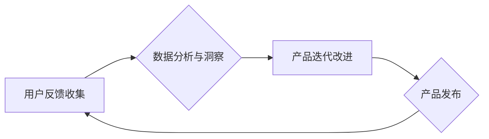

                 

## 知识付费产品的用户反馈闭环管理

> 关键词：知识付费、用户反馈、闭环管理、数据分析、产品迭代、用户体验

### 1. 背景介绍

知识付费行业近年来发展迅速，涌现出众多优质的知识产品。然而，知识付费产品的成功离不开用户持续的参与和反馈。用户反馈是产品改进和迭代的重要源泉，能够帮助产品方了解用户需求，优化产品功能，提升用户体验。因此，建立完善的用户反馈闭环管理体系，对于知识付费产品的长期发展至关重要。

传统的知识付费产品往往缺乏有效的用户反馈机制，导致产品难以根据用户需求进行调整，最终影响用户粘性和复购率。随着数据分析技术的不断发展，知识付费平台可以利用数据分析手段，收集、分析和处理用户反馈，形成闭环管理体系，从而实现产品持续优化和用户体验提升。

### 2. 核心概念与联系

#### 2.1 用户反馈闭环管理

用户反馈闭环管理是指从用户反馈收集、分析、处理到产品迭代改进的全流程管理体系。其核心目标是将用户反馈转化为产品改进的动力，实现产品与用户需求的不断匹配。

#### 2.2 知识付费产品特点

知识付费产品具有以下特点：

* **知识为核心：** 产品的核心价值在于知识的传递和分享。
* **用户需求多样化：** 不同用户对知识的需求和学习方式各不相同。
* **持续更新迭代：** 知识领域不断发展，产品需要不断更新和迭代以满足用户需求。
* **用户粘性至关重要：** 用户的持续学习和付费是知识付费产品的生命线。

#### 2.3 数据分析与用户洞察

数据分析是用户反馈闭环管理的关键环节。通过对用户行为、反馈内容等数据的分析，可以洞察用户需求、痛点和喜好，为产品迭代提供决策依据。

**Mermaid 流程图：**



### 3. 核心算法原理 & 具体操作步骤

#### 3.1 算法原理概述

用户反馈闭环管理的核心算法原理在于将用户反馈数据进行分类、聚合和分析，提取出有价值的信息，并将其转化为产品改进的建议。常用的算法包括：

* **文本分类算法：** 用于对用户反馈文本进行分类，例如问题、建议、投诉等。
* **主题模型算法：** 用于从用户反馈文本中提取出主题和关键词，了解用户关注的领域和问题。
* **关联规则挖掘算法：** 用于发现用户反馈数据之间的关联关系，例如哪些用户反馈经常出现一起，哪些问题与特定产品功能相关。

#### 3.2 算法步骤详解

1. **数据收集：** 从各种渠道收集用户反馈数据，例如评论、问答、反馈表单等。
2. **数据预处理：** 对收集到的数据进行清洗、格式化和标准化处理，例如去除停用词、标点符号等。
3. **数据分析：** 使用文本分类、主题模型等算法对数据进行分析，提取出有价值的信息。
4. **信息整合：** 将分析结果整合到产品管理系统中，形成用户反馈报告。
5. **产品改进：** 根据用户反馈报告，制定产品改进计划，并进行迭代开发。

#### 3.3 算法优缺点

**优点：**

* **数据驱动：** 基于数据分析，能够更客观地了解用户需求。
* **效率提升：** 自动化处理用户反馈，提高效率。
* **洞察力增强：** 挖掘用户反馈数据中的隐藏信息，提升洞察力。

**缺点：**

* **数据质量依赖：** 算法效果依赖于数据质量，数据不准确或不完整会导致分析结果偏差。
* **算法选择复杂：** 不同算法适用于不同的场景，需要根据实际情况选择合适的算法。
* **人工干预不可或缺：** 算法分析结果需要人工进行解读和验证，最终决策权仍然在人类手中。

#### 3.4 算法应用领域

用户反馈闭环管理算法广泛应用于各个领域，例如：

* **电商平台：** 分析用户评论，了解产品优缺点，改进产品设计和服务。
* **社交媒体：** 分析用户反馈，识别潜在问题，提升用户体验。
* **教育行业：** 分析学生反馈，优化教学内容和方法。
* **金融行业：** 分析客户反馈，改进金融产品和服务。

### 4. 数学模型和公式 & 详细讲解 & 举例说明

#### 4.1 数学模型构建

用户反馈闭环管理可以构建数学模型来量化用户反馈的价值和影响。例如，可以构建一个用户满意度模型，将用户反馈数据转化为用户满意度得分。

#### 4.2 公式推导过程

用户满意度模型可以采用以下公式：

$$
满意度 = \frac{\sum_{i=1}^{n} (反馈值_i - 平均反馈值)}{标准差}
$$

其中：

* $满意度$：用户满意度得分
* $反馈值_i$：第i个用户的反馈值
* $平均反馈值$：所有用户的平均反馈值
* $标准差$：所有用户的反馈值标准差

#### 4.3 案例分析与讲解

假设一个知识付费平台收集了100个用户的反馈数据，平均反馈值为4，标准差为1。其中，用户A的反馈值为5，用户B的反馈值为3。

根据公式，用户A的满意度得分：

$$
满意度_A = \frac{5 - 4}{1} = 1
$$

用户B的满意度得分：

$$
满意度_B = \frac{3 - 4}{1} = -1
$$

通过计算用户满意度得分，可以更直观地了解用户对产品的满意程度。

### 5. 项目实践：代码实例和详细解释说明

#### 5.1 开发环境搭建

* **操作系统：** Windows/macOS/Linux
* **编程语言：** Python
* **开发工具：** PyCharm/VS Code
* **数据存储：** MySQL/MongoDB

#### 5.2 源代码详细实现

```python
import pandas as pd

# 数据加载
data = pd.read_csv('user_feedback.csv')

# 数据预处理
data['feedback_text'] = data['feedback_text'].str.lower()
data['feedback_text'] = data['feedback_text'].str.replace('[^a-zA-Z0-9\s]', '')

# 文本分类
from sklearn.feature_extraction.text import TfidfVectorizer
from sklearn.linear_model import LogisticRegression

vectorizer = TfidfVectorizer()
X = vectorizer.fit_transform(data['feedback_text'])
y = data['feedback_type']

model = LogisticRegression()
model.fit(X, y)

# 预测反馈类型
new_feedback = ['产品功能很棒！', '客服态度很差。']
new_feedback_vector = vectorizer.transform(new_feedback)
predicted_types = model.predict(new_feedback_vector)

# 输出预测结果
print(predicted_types)
```

#### 5.3 代码解读与分析

* 代码首先加载用户反馈数据，并进行预处理，例如转换为小写，去除停用词等。
* 然后使用TF-IDF向量化技术将文本数据转化为数值向量。
* 使用逻辑回归模型对文本数据进行分类，预测用户反馈的类型。
* 最后，使用训练好的模型对新反馈进行预测，并输出预测结果。

#### 5.4 运行结果展示

运行代码后，将输出预测结果，例如：

```
['positive', 'negative']
```

这表明第一个新反馈属于正向反馈，第二个新反馈属于负向反馈。

### 6. 实际应用场景

#### 6.1 知识付费平台

知识付费平台可以利用用户反馈闭环管理体系，了解用户对课程内容、教学方式、平台功能等方面的需求和反馈，从而不断优化产品，提升用户体验。

#### 6.2 在线教育机构

在线教育机构可以利用用户反馈闭环管理体系，了解学生对课程内容、学习进度、师资力量等方面的需求和反馈，从而改进教学内容和方法，提高教学质量。

#### 6.3 知识分享社区

知识分享社区可以利用用户反馈闭环管理体系，了解用户对社区内容、互动机制、平台功能等方面的需求和反馈，从而优化社区运营，提升用户粘性。

#### 6.4 未来应用展望

随着人工智能技术的不断发展，用户反馈闭环管理体系将更加智能化和自动化。例如，可以利用自然语言处理技术，自动识别用户反馈中的情感倾向和关键信息，并将其转化为产品改进建议。

### 7. 工具和资源推荐

#### 7.1 学习资源推荐

* **书籍：**
    * 《数据分析实战》
    * 《机器学习实战》
    * 《自然语言处理入门》
* **在线课程：**
    * Coursera
    * edX
    * Udemy

#### 7.2 开发工具推荐

* **数据分析工具：**
    * Python (Pandas, Scikit-learn)
    * R
    * Tableau
* **机器学习平台：**
    * TensorFlow
    * PyTorch
    * scikit-learn

#### 7.3 相关论文推荐

* **用户反馈分析：**
    * "Sentiment Analysis of Customer Reviews"
    * "Topic Modeling for User Feedback Analysis"
* **知识付费产品研究：**
    * "The Impact of User Feedback on Knowledge Sharing Platforms"
    * "A Study of User Engagement in Online Knowledge Communities"

### 8. 总结：未来发展趋势与挑战

#### 8.1 研究成果总结

用户反馈闭环管理体系能够有效地收集、分析和处理用户反馈，为产品改进提供决策依据，提升用户体验。

#### 8.2 未来发展趋势

* **人工智能技术应用：** 利用人工智能技术，实现用户反馈的自动分析和分类，提高效率和准确性。
* **个性化反馈：** 根据用户的个人特征和行为，提供个性化的反馈建议，提升用户体验。
* **多渠道反馈整合：** 将来自不同渠道的用户反馈整合到统一平台，形成全面的用户洞察。

#### 8.3 面临的挑战

* **数据质量问题：** 用户反馈数据可能存在不准确、不完整等问题，需要进行有效的数据清洗和预处理。
* **算法选择和优化：** 不同算法适用于不同的场景，需要根据实际情况选择合适的算法，并进行持续优化。
* **隐私保护问题：** 用户反馈数据可能包含个人隐私信息，需要采取有效措施保护用户隐私。

#### 8.4 研究展望

未来，用户反馈闭环管理体系将更加智能化、个性化和安全，为知识付费产品的发展提供更强大的支持。


### 9. 附录：常见问题与解答

#### 9.1 如何收集用户反馈？

* **评论区：** 在知识付费产品页面设置评论区，方便用户发表意见和建议。
* **问答平台：** 在知识付费平台内设置问答功能，方便用户提问和交流。
* **反馈表单：** 提供在线反馈表单，方便用户填写详细的反馈意见。
* **邮件/客服：** 提供邮件和客服渠道，方便用户提交反馈。

#### 9.2 如何分析用户反馈数据？

* **文本分类：** 将用户反馈文本进行分类，例如问题、建议、投诉等。
* **主题模型：** 从用户反馈文本中提取出主题和关键词，了解用户关注的领域和问题。
* **关联规则挖掘：** 发现用户反馈数据之间的关联关系，例如哪些用户反馈经常出现一起，哪些问题与特定产品功能相关。

#### 9.3 如何将用户反馈转化为产品改进建议？

* **优先级排序：** 根据用户反馈的频率、重要性和影响程度，对反馈进行优先级排序。
* **问题分析：** 对用户反馈中的问题进行深入分析，了解其根源和影响范围。
* **解决方案设计：** 根据问题分析结果，设计相应的解决方案，并进行产品迭代开发。


作者：禅与计算机程序设计艺术 / Zen and the Art of Computer Programming 
<end_of_turn>

