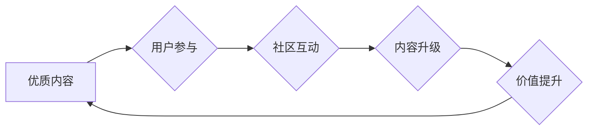

                 

## 知识付费创业中的内容协同效应

> 关键词：知识付费、内容协同效应、社区建设、用户参与、内容生态

## 1. 背景介绍

知识付费行业近年来蓬勃发展，从在线课程、付费文章到直播带货，各种形式的知识付费模式层出不穷。然而，在激烈的市场竞争中，单纯依靠优质内容难以获得持续的成功。如何提升内容价值，打造用户粘性，成为知识付费创业者面临的共同挑战。

内容协同效应，即多个内容元素相互作用，产生超出单个元素总和的价值，成为解决这一问题的关键。它强调用户参与、社区建设和内容生态的构建，通过用户之间的互动和协作，提升内容的深度、广度和时效性。

## 2. 核心概念与联系

**2.1 内容协同效应原理**

内容协同效应的核心在于打破内容的单向传播模式，将用户从被动接受者转变为主动参与者。通过用户之间的互动和协作，内容可以得到更全面的解读、更深入的思考和更广泛的传播。

**2.2 内容协同效应架构**



**2.3 核心概念联系**

* **优质内容:** 作为协同效应的基础，优质内容需要具备专业性、实用性和吸引力。
* **用户参与:** 用户可以通过评论、点赞、分享、提问等方式参与到内容互动中。
* **社区互动:** 平台需要提供合适的机制和工具，鼓励用户之间进行交流和协作。
* **内容升级:** 通过用户反馈和互动，内容可以得到不断完善和更新。
* **价值提升:** 内容协同效应最终目的是提升内容的价值，为用户提供更丰富的学习体验和更实用的知识。

## 3. 核心算法原理 & 具体操作步骤

**3.1 算法原理概述**

内容协同效应的实现需要结合多种算法和技术，例如推荐算法、社区算法、内容分析算法等。

* **推荐算法:** 根据用户的兴趣和行为，推荐相关的内容，提高用户参与度。
* **社区算法:** 挖掘用户之间的关系和兴趣，构建用户社区，促进用户互动。
* **内容分析算法:** 分析内容的主题、关键词、情感等信息，为内容升级和推荐提供数据支持。

**3.2 算法步骤详解**

1. **数据采集:** 收集用户行为数据、内容数据等。
2. **数据预处理:** 对数据进行清洗、转换和格式化。
3. **特征提取:** 从数据中提取用户特征、内容特征等。
4. **模型训练:** 使用机器学习算法训练推荐模型、社区模型、内容分析模型等。
5. **模型评估:** 对模型进行评估，并进行调优。
6. **系统部署:** 将模型部署到线上系统中。

**3.3 算法优缺点**

* **优点:** 能够有效提升用户参与度、内容价值和平台粘性。
* **缺点:** 需要大量的用户数据和计算资源，算法模型的训练和维护需要专业技术人员。

**3.4 算法应用领域**

* **在线教育:** 推荐课程、构建学习社区、个性化学习路径。
* **知识分享平台:** 推荐文章、构建用户兴趣圈、内容协同创作。
* **付费直播:** 推荐主播、构建粉丝社区、互动直播内容。

## 4. 数学模型和公式 & 详细讲解 & 举例说明

**4.1 数学模型构建**

内容协同效应可以抽象为一个网络模型，其中用户和内容作为节点，互动关系作为边。

* **用户节点:** 代表平台上的用户，每个用户拥有独特的兴趣和行为特征。
* **内容节点:** 代表平台上的知识内容，每个内容拥有特定的主题、关键词和价值。
* **互动关系:** 代表用户与内容之间的互动行为，例如点赞、评论、分享等。

**4.2 公式推导过程**

我们可以使用 PageRank 算法来衡量内容的价值。PageRank 算法的核心思想是，一个内容的价值与其被其他内容引用的次数成正比。

$$PR(C) = (1-d) + d \sum_{i=1}^{N} \frac{PR(P_i)}{C_i}$$

其中：

* $PR(C)$: 内容 $C$ 的 PageRank 值
* $d$: 阻尼系数，通常取值为 0.85
* $N$: 指向内容 $C$ 的链接数量
* $PR(P_i)$: 链接到内容 $C$ 的内容 $P_i$ 的 PageRank 值
* $C_i$: 链接到内容 $C$ 的内容 $P_i$ 的出度

**4.3 案例分析与讲解**

假设一个知识付费平台上有三个内容节点 $C_1$, $C_2$, $C_3$，以及三个用户节点 $U_1$, $U_2$, $U_3$。用户 $U_1$ 对内容 $C_1$ 和 $C_2$ 都点赞，用户 $U_2$ 对内容 $C_2$ 和 $C_3$ 都点赞，用户 $U_3$ 对内容 $C_1$ 和 $C_3$ 都点赞。

根据 PageRank 算法，我们可以计算出每个内容节点的 PageRank 值。例如，内容 $C_2$ 的 PageRank 值将高于内容 $C_1$ 和 $C_3$，因为 $C_2$ 被更多用户点赞。

## 5. 项目实践：代码实例和详细解释说明

**5.1 开发环境搭建**

* Python 3.x
* Flask 或 Django 框架
* MySQL 或 PostgreSQL 数据库
* Redis 或 Memcached 缓存

**5.2 源代码详细实现**

```python
# Flask 示例代码

from flask import Flask, render_template

app = Flask(__name__)

@app.route('/')
def index():
    return render_template('index.html')

if __name__ == '__main__':
    app.run(debug=True)
```

**5.3 代码解读与分析**

* 该代码是一个简单的 Flask 应用，用于展示一个知识付费平台的首页。
* `render_template('index.html')` 函数渲染一个名为 `index.html` 的 HTML 模板。

**5.4 运行结果展示**

运行该代码后，访问 `http://127.0.0.1:5000/`，即可看到一个简单的知识付费平台首页。

## 6. 实际应用场景

**6.1 在线教育平台**

* 推荐个性化课程
* 建立学习社区，促进用户交流
* 提供在线答疑和辅导服务

**6.2 知识分享平台**

* 推荐相关文章和博客
* 建立用户兴趣圈，促进内容协同创作
* 提供付费咨询和一对一指导服务

**6.3 付费直播平台**

* 推荐优质主播和直播内容
* 建立粉丝社区，促进互动直播
* 提供付费会员服务和专属福利

**6.4 未来应用展望**

* 内容协同效应将更加深入地融入到知识付费平台的各个环节，例如内容创作、推荐、传播、互动等。
* 人工智能技术将进一步提升内容协同效应的效率和精准度，例如自动生成个性化推荐、自动识别用户需求等。
* 内容协同效应将推动知识付费行业向更个性化、更互动化、更生态化的方向发展。

## 7. 工具和资源推荐

**7.1 学习资源推荐**

* **书籍:** 《网络科学》、《推荐系统》、《机器学习》
* **在线课程:** Coursera、edX、Udacity 等平台上的相关课程
* **博客和论坛:** 知乎、CSDN 等平台上的相关文章和讨论

**7.2 开发工具推荐**

* **Python:** 作为主流的编程语言，Python 拥有丰富的机器学习和数据分析库，例如 scikit-learn、pandas、numpy 等。
* **Flask/Django:** 作为 Python 的 Web 框架，Flask 和 Django 可以帮助开发者快速搭建 Web 应用。
* **MySQL/PostgreSQL:** 作为关系型数据库，MySQL 和 PostgreSQL 可以存储和管理大量的数据。
* **Redis/Memcached:** 作为缓存系统，Redis 和 Memcached 可以提高应用的性能。

**7.3 相关论文推荐**

* PageRank: The Pagerank Citation Ranking: Bringing Order to the Web
* Collaborative Filtering for Recommender Systems
* Content-Based Recommendation Systems

## 8. 总结：未来发展趋势与挑战

**8.1 研究成果总结**

* 内容协同效应为知识付费行业提供了新的发展思路，能够有效提升用户参与度和内容价值。
* 算法模型和技术手段不断发展，为内容协同效应的实现提供了更强大的支持。

**8.2 未来发展趋势**

* 内容协同效应将更加深入地融入到知识付费平台的各个环节，例如内容创作、推荐、传播、互动等。
* 人工智能技术将进一步提升内容协同效应的效率和精准度，例如自动生成个性化推荐、自动识别用户需求等。
* 内容协同效应将推动知识付费行业向更个性化、更互动化、更生态化的方向发展。

**8.3 面临的挑战**

* 如何有效收集和分析用户数据，为内容协同效应提供数据支持。
* 如何设计合理的算法模型，平衡用户体验和平台利益。
* 如何构建健康的社区生态，避免内容沉淀和用户流失。

**8.4 研究展望**

* 深入研究内容协同效应的机制和规律，探索更有效的算法模型和技术手段。
* 关注用户体验和隐私保护，构建更加安全、可靠和可持续的知识付费平台。
* 推动内容协同效应的应用场景拓展，探索更多新的商业模式和服务模式。

## 9. 附录：常见问题与解答

**9.1 如何提高内容协同效应？**

* 提供优质的内容，满足用户的学习需求和兴趣。
* 鼓励用户参与互动，例如点赞、评论、分享等。
* 建立用户社区，促进用户之间的交流和协作。
* 使用算法模型，推荐相关内容和用户，提升用户参与度。

**9.2 内容协同效应的优势有哪些？**

* 提升用户参与度和内容价值。
* 增强平台粘性，提高用户留存率。
* 促进内容传播和推广，扩大平台影响力。

**9.3 内容协同效应的应用场景有哪些？**

* 在线教育平台
* 知识分享平台
* 付费直播平台
* 其他知识付费平台


作者：禅与计算机程序设计艺术 / Zen and the Art of Computer Programming 
<end_of_turn>

