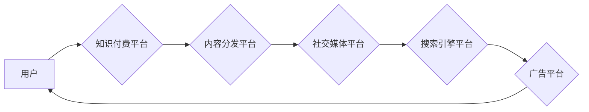

                 

## 知识付费如何实现跨平台整合营销？

> 关键词：知识付费、跨平台营销、整合营销、用户画像、内容分发、数据分析、自动化工具、用户体验

## 1. 背景介绍

知识付费作为一种新型的商业模式，近年来发展迅速，涌现出众多优秀平台和内容创作者。然而，随着市场竞争的加剧，知识付费平台面临着用户获取、内容推广和用户留存等挑战。跨平台整合营销成为知识付费平台发展的重要趋势，能够帮助平台更好地触达目标用户，提升内容传播效率，增强用户粘性。

**1.1 知识付费市场现状**

知识付费市场规模持续增长，用户群体也日益扩大。从教育培训、职业技能到兴趣爱好，各种类型的知识付费产品层出不穷。然而，市场竞争激烈，平台之间差异化竞争日益突出。

**1.2 跨平台整合营销的必要性**

传统的单平台营销模式已难以满足知识付费平台的需求。用户分散在多个平台，内容传播受限，难以形成规模效应。跨平台整合营销能够打破平台壁垒，实现用户全方位触达，提升营销效率。

## 2. 核心概念与联系

**2.1 核心概念**

* **知识付费:** 指用户通过付费的方式获取知识、技能或其他价值内容。
* **跨平台营销:** 在多个平台进行营销活动，触达更广泛的用户群体。
* **整合营销:** 将多种营销手段有机结合，形成协同效应，提升营销效果。

**2.2 架构图**



**2.3 联系分析**

跨平台整合营销将知识付费平台与内容分发平台、社交媒体平台、搜索引擎平台和广告平台等多个平台有机结合，形成一个完整的营销闭环。用户可以通过不同的平台接触到知识付费内容，最终完成付费购买。

## 3. 核心算法原理 & 具体操作步骤

**3.1 算法原理概述**

跨平台整合营销的核心算法原理是基于用户画像和内容推荐。通过分析用户行为数据，构建用户画像，并根据用户画像特征，推荐合适的知识付费内容。

**3.2 算法步骤详解**

1. **数据采集:** 收集用户行为数据，包括用户浏览记录、购买记录、评论记录等。
2. **用户画像构建:** 利用机器学习算法，对用户行为数据进行分析，构建用户画像，包括用户兴趣、偏好、消费能力等。
3. **内容推荐:** 根据用户画像特征，推荐合适的知识付费内容。
4. **内容分发:** 将推荐内容分发到不同的平台，例如内容分发平台、社交媒体平台、搜索引擎平台等。
5. **效果监测:** 监测营销活动的效果，包括用户点击率、转化率等，并根据效果进行调整。

**3.3 算法优缺点**

* **优点:** 能够精准推荐内容，提升用户体验，提高转化率。
* **缺点:** 需要大量的数据支持，算法模型需要不断优化。

**3.4 算法应用领域**

跨平台整合营销算法广泛应用于电商、教育、娱乐等各个领域。

## 4. 数学模型和公式 & 详细讲解 & 举例说明

**4.1 数学模型构建**

用户画像构建可以利用聚类算法，将用户分为不同的群体。例如，可以使用K-means算法将用户根据他们的兴趣爱好进行聚类。

**4.2 公式推导过程**

K-means算法的目标是将数据点划分为K个簇，使得每个数据点到其所属簇中心的距离最小。

**公式:**

$$
J = \sum_{i=1}^{K} \sum_{x \in C_i} ||x - \mu_i||^2
$$

其中：

* $J$ 是目标函数
* $K$ 是簇的数量
* $C_i$ 是第i个簇
* $x$ 是数据点
* $\mu_i$ 是第i个簇的中心

**4.3 案例分析与讲解**

假设我们有一个包含100个用户的数据库，我们想将用户分为3个簇。我们可以使用K-means算法将用户根据他们的兴趣爱好进行聚类。

**举例说明:**

用户A和用户B都对编程感兴趣，用户C和用户D都对音乐感兴趣。K-means算法会将用户A和用户B归为一个簇，用户C和用户D归为另一个簇。

## 5. 项目实践：代码实例和详细解释说明

**5.1 开发环境搭建**

* Python 3.x
* scikit-learn

**5.2 源代码详细实现**

```python
from sklearn.cluster import KMeans

# 数据集
data = [[1, 2], [1.5, 1.8], [5, 8], [8, 8], [1, 0.6], [9, 11]]

# 创建KMeans模型
kmeans = KMeans(n_clusters=3)

# 训练模型
kmeans.fit(data)

# 获取聚类结果
labels = kmeans.labels_

# 打印聚类结果
print(labels)
```

**5.3 代码解读与分析**

* 首先，我们导入必要的库，包括scikit-learn中的KMeans算法。
* 然后，我们定义一个包含用户数据的列表。
* 接下来，我们创建KMeans模型，并设置簇的数量为3。
* 然后，我们使用fit()方法训练模型，将数据点划分为3个簇。
* 最后，我们使用labels_属性获取聚类结果，并打印出来。

**5.4 运行结果展示**

运行代码后，会输出用户被分配到的簇标签。例如：

```
[0 0 1 1 0 2]
```

这表示用户0、1、2被分配到簇0，用户3、4被分配到簇1，用户5被分配到簇2。

## 6. 实际应用场景

**6.1 知识付费平台用户画像分析**

知识付费平台可以利用跨平台整合营销算法，分析用户的兴趣爱好、学习习惯、消费能力等，构建用户画像，为用户提供个性化的内容推荐和营销服务。

**6.2 内容分发优化**

跨平台整合营销可以帮助知识付费平台优化内容分发策略，将内容推送给更精准的用户群体，提高内容传播效率。

**6.3 营销活动精准投放**

跨平台整合营销可以帮助知识付费平台精准投放营销活动，例如针对不同用户群体的优惠活动、定制化课程推荐等，提升营销效果。

**6.4 用户留存提升**

跨平台整合营销可以帮助知识付费平台建立用户粘性，通过个性化推荐、互动活动等方式，增强用户参与度，提升用户留存率。

**6.5 未来应用展望**

随着人工智能技术的不断发展，跨平台整合营销将更加智能化、个性化。未来，知识付费平台可以利用更先进的算法模型，实现更精准的用户画像分析、内容推荐和营销服务，为用户提供更优质的学习体验。

## 7. 工具和资源推荐

**7.1 学习资源推荐**

* **书籍:**
    * 《数据挖掘: 概念与技术》
    * 《机器学习》
* **在线课程:**
    * Coursera: 数据科学
    * edX: 机器学习
* **博客:**
    * Towards Data Science
    * Analytics Vidhya

**7.2 开发工具推荐**

* **Python:** 
    * scikit-learn
    * TensorFlow
    * PyTorch
* **数据可视化工具:**
    * Tableau
    * Power BI

**7.3 相关论文推荐**

* **K-means聚类算法:**
    * Lloyd, S. (1982). Least squares quantization in PCM. IEEE Transactions on Information Theory, 28(4), 49-60.
* **用户画像分析:**
    * Chen, Y., & Liu, Y. (2018). User profiling for personalized recommendations. ACM Computing Surveys, 50(6), 1-35.

## 8. 总结：未来发展趋势与挑战

**8.1 研究成果总结**

跨平台整合营销为知识付费平台提供了新的发展方向，能够帮助平台更好地触达用户、提升内容传播效率、增强用户粘性。

**8.2 未来发展趋势**

* **更精准的用户画像分析:** 利用更先进的算法模型，对用户行为数据进行更深入的分析，构建更精准的用户画像。
* **更个性化的内容推荐:** 根据用户画像特征，提供更个性化的内容推荐，提升用户体验。
* **更智能化的营销自动化:** 利用人工智能技术，实现营销活动的自动化，提高营销效率。

**8.3 面临的挑战**

* **数据隐私保护:** 跨平台整合营销需要收集和分析大量用户数据，如何保护用户隐私是一个重要的挑战。
* **算法模型的准确性:** 算法模型的准确性直接影响到营销效果，需要不断优化算法模型，提高其准确性。
* **跨平台数据整合:** 不同平台的数据格式和结构可能不同，如何进行跨平台数据整合是一个技术难题。

**8.4 研究展望**

未来，跨平台整合营销将朝着更智能化、个性化、自动化方向发展。研究者需要不断探索新的算法模型、数据分析方法和技术手段，解决跨平台整合营销面临的挑战，推动知识付费行业健康发展。


## 9. 附录：常见问题与解答

**9.1 如何构建用户画像？**

用户画像构建需要收集用户行为数据，例如用户浏览记录、购买记录、评论记录等。然后，利用机器学习算法，对用户行为数据进行分析，提取用户特征，构建用户画像。

**9.2 如何进行跨平台数据整合？**

跨平台数据整合需要解决数据格式和结构的差异问题。可以使用数据转换工具或编写自定义脚本，将不同平台的数据转换为统一格式。

**9.3 如何评估跨平台整合营销的效果？**

可以根据不同的营销目标，选择不同的评估指标，例如用户点击率、转化率、用户留存率等。

作者：禅与计算机程序设计艺术 / Zen and the Art of Computer Programming 
<end_of_turn>

