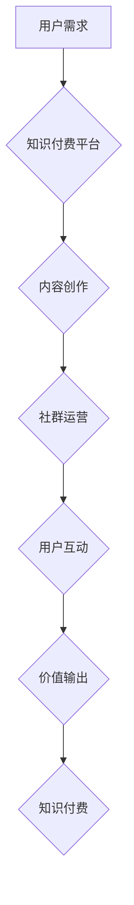

                 

## 知识付费：程序员的社群运营思维

> 关键词：知识付费、程序员、社群运营、内容创作、社区建设、技术分享、价值输出、商业模式

## 1. 背景介绍

在当今数字化时代，知识已成为最宝贵的资源。程序员作为科技创新的核心力量，拥有丰富的技术经验和专业技能。然而，传统的学习模式和职业发展路径面临着新的挑战。一方面，技术迭代速度日新月异，程序员需要不断学习新知识和技能，才能保持竞争力；另一方面，程序员的专业知识和技能往往难以被有效地传播和利用。

知识付费应运而生，为程序员提供了新的学习和发展机会。它打破了传统的知识壁垒，让程序员能够以更灵活的方式获取知识，并通过分享自己的经验和技能，获得经济回报。同时，知识付费也为程序员提供了建立个人品牌、拓展人脉和提升社会影响力的平台。

## 2. 核心概念与联系

**2.1 知识付费的核心概念**

知识付费是指以知识、技能、经验等为核心内容，通过线上或线下平台，向付费用户提供学习、培训、咨询等服务，并从中获取收益的商业模式。

**2.2 社群运营与知识付费的联系**

社群运营是知识付费的重要支撑。通过构建和运营活跃的社群，可以有效地聚集目标用户，建立信任关系，促进知识传播和价值交换。

**2.3 社群运营思维**

社群运营思维是指以用户为中心，通过提供价值、建立关系、营造氛围，打造一个用户粘性强、互动活跃的社群。

**Mermaid 流程图**



## 3. 核心算法原理 & 具体操作步骤

**3.1 算法原理概述**

知识付费平台的运营需要依靠一系列算法来实现用户匹配、内容推荐、社群管理等功能。这些算法通常基于机器学习、数据挖掘等技术，通过分析用户行为、内容特征、社群结构等数据，实现智能化运营。

**3.2 算法步骤详解**

1. **用户画像构建:** 收集用户数据，包括用户 demographics、兴趣爱好、学习习惯、消费行为等，构建用户画像。
2. **内容推荐:** 根据用户画像，推荐相关内容，包括课程、文章、视频、直播等。
3. **社群匹配:** 根据用户兴趣和标签，将用户匹配到合适的社群。
4. **互动分析:** 分析用户在社群中的互动行为，例如评论、点赞、转发等，识别活跃用户和优质内容。
5. **内容分级:** 根据内容质量、用户反馈等因素，对内容进行分级，提高内容推荐的精准度。

**3.3 算法优缺点**

**优点:**

* **精准化推荐:** 算法可以根据用户需求，精准推荐相关内容，提高用户体验。
* **个性化服务:** 算法可以根据用户画像，提供个性化服务，满足不同用户的需求。
* **数据驱动:** 算法基于数据分析，可以不断优化运营策略，提高运营效率。

**缺点:**

* **数据依赖:** 算法需要大量数据支持，数据质量直接影响算法效果。
* **算法偏差:** 算法可能存在偏差，导致推荐结果不准确或不公平。
* **隐私安全:** 数据收集和分析需要注重用户隐私安全。

**3.4 算法应用领域**

* **内容推荐:** 电商平台、视频网站、新闻网站等。
* **用户匹配:** 社交平台、 dating app 等。
* **广告投放:** 搜索引擎、社交媒体等。
* **风险控制:** 金融机构、电商平台等。

## 4. 数学模型和公式 & 详细讲解 & 举例说明

**4.1 数学模型构建**

知识付费平台的运营可以抽象为一个用户-内容-社群的网络模型。

* **用户:**  每个用户都有一个独特的 ID 和一系列特征，例如年龄、性别、兴趣爱好、学习习惯等。
* **内容:** 每个内容都有一个 ID 和一系列特征，例如主题、类型、难度、价格等。
* **社群:** 每个社群都有一个 ID 和一系列特征，例如主题、规模、活跃度等。

**4.2 公式推导过程**

用户对内容的评价可以表示为一个评分函数：

$$
Score(u, c) = f(u, c)
$$

其中：

* $u$ 表示用户 ID
* $c$ 表示内容 ID
* $f(u, c)$ 表示评分函数，可以根据用户特征、内容特征和用户历史行为等因素进行计算。

**4.3 案例分析与讲解**

假设一个知识付费平台提供编程课程，用户对课程的评分函数可以考虑以下因素：

* 用户的编程经验：经验丰富的用户对课程难度要求更高。
* 课程的主题：用户对感兴趣的主题的课程评分更高。
* 课程的评价：用户对其他用户的评价更信任。

评分函数可以设计为：

$$
Score(u, c) = w_1 * Exp(u) * Difficulty(c) + w_2 * Interest(u, c) + w_3 * AverageRating(c)
$$

其中：

* $w_1$, $w_2$, $w_3$ 为权重系数，可以根据平台策略进行调整。
* $Exp(u)$ 表示用户的编程经验，可以采用等级或年限等指标。
* $Difficulty(c)$ 表示课程的难度，可以采用星级或难度等级等指标。
* $Interest(u, c)$ 表示用户对课程主题的兴趣，可以采用用户标签或搜索历史等指标。
* $AverageRating(c)$ 表示课程的平均评分，可以采用用户评价的平均值。

## 5. 项目实践：代码实例和详细解释说明

**5.1 开发环境搭建**

* Python 3.x
* Flask 或 Django 等 Web 框架
* 数据库 (例如 MySQL, PostgreSQL)
* Redis 或 Memcached 等缓存服务

**5.2 源代码详细实现**

以下是一个简单的 Flask 应用示例，用于展示知识付费平台的基本功能：

```python
from flask import Flask, render_template, request

app = Flask(__name__)

# 模拟用户数据
users = {
    1: {'name': 'Alice', 'interest': ['Python', 'Machine Learning']},
    2: {'name': 'Bob', 'interest': ['Java', 'Web Development']}
}

# 模拟课程数据
courses = {
    1: {'title': 'Python基础', 'price': 99, 'tags': ['Python', 'Beginner']},
    2: {'title': '机器学习入门', 'price': 199, 'tags': ['Machine Learning', 'Intermediate']}
}

@app.route('/')
def index():
    return render_template('index.html', users=users, courses=courses)

@app.route('/course/<int:course_id>')
def course_detail(course_id):
    return render_template('course_detail.html', course=courses[course_id])

if __name__ == '__main__':
    app.run(debug=True)
```

**5.3 代码解读与分析**

* 该代码使用 Flask 框架构建了一个简单的知识付费平台。
* 用户和课程数据模拟存储在字典中。
* `/` 路由渲染首页，显示用户和课程列表。
* `/course/<int:course_id>` 路由渲染课程详情页，根据课程 ID 获取课程信息。

**5.4 运行结果展示**

运行代码后，访问 `http://127.0.0.1:5000/`，即可看到简单的知识付费平台首页。

## 6. 实际应用场景

**6.1 在线教育平台**

知识付费平台可以为在线教育平台提供课程销售、用户管理、学习进度追踪等功能。

**6.2 技术博客和社区**

技术博客和社区可以利用知识付费平台，将优质内容付费化，并建立会员制度，提高用户粘性。

**6.3 个人品牌建设**

程序员可以利用知识付费平台，分享自己的技术经验和技能，建立个人品牌，并获得经济回报。

**6.4 企业培训**

企业可以利用知识付费平台，为员工提供内部培训课程，提升员工技能水平。

**6.5 未来应用展望**

随着人工智能、虚拟现实等技术的不断发展，知识付费平台将更加智能化、个性化和沉浸式。

## 7. 工具和资源推荐

**7.1 学习资源推荐**

* **书籍:**《程序员的成长之路》、《高效学习的艺术》
* **课程:** Coursera、edX、Udemy 等在线学习平台
* **博客:** Hacker News、Medium、GitHub 等技术博客平台

**7.2 开发工具推荐**

* **Web 框架:** Flask、Django、Ruby on Rails 等
* **数据库:** MySQL、PostgreSQL、MongoDB 等
* **缓存服务:** Redis、Memcached 等

**7.3 相关论文推荐**

* **推荐系统:** Collaborative Filtering, Content-Based Filtering
* **社群运营:** Community Building, Social Network Analysis
* **知识付费:** The Economics of Knowledge Sharing, The Future of Education

## 8. 总结：未来发展趋势与挑战

**8.1 研究成果总结**

知识付费为程序员提供了新的学习和发展机会，并为技术传播和价值输出提供了新的模式。

**8.2 未来发展趋势**

* **智能化:** 利用人工智能技术，实现更精准的推荐、更个性化的服务。
* **沉浸式体验:** 利用虚拟现实、增强现实等技术，打造更沉浸式的学习体验。
* **社区化:** 构建更活跃的社群，促进用户之间的互动和交流。

**8.3 面临的挑战**

* **内容质量:** 确保知识付费平台上的内容质量，避免低质量内容泛滥。
* **用户信任:** 建立用户对平台的信任，防止知识付费平台被滥用。
* **商业模式:** 探索更可持续的商业模式，平衡平台收益和用户体验。

**8.4 研究展望**

未来研究方向包括：

* **更精准的推荐算法:** 研究更有效的推荐算法，提高推荐精准度和用户体验。
* **更沉浸式的学习体验:** 研究利用虚拟现实、增强现实等技术，打造更沉浸式的学习体验。
* **更有效的社群运营模式:** 研究更有效的社群运营模式，促进用户之间的互动和交流。


## 9. 附录：常见问题与解答

**9.1 如何选择合适的知识付费平台？**

选择知识付费平台时，需要考虑以下因素：

* **平台内容:** 平台提供的内容是否符合自己的需求？
* **平台用户:** 平台的用户群体是否与自己相似？
* **平台价格:** 平台的收费模式是否合理？
* **平台口碑:** 平台的用户评价如何？

**9.2 如何保护知识产权？**

知识付费平台通常会提供知识产权保护机制，例如版权声明、水印技术等。

**9.3 如何避免知识付费平台被滥用？**

知识付费平台需要建立完善的审核机制，防止低质量内容和虚假信息传播。

**9.4 如何提高知识付费平台的收益？**

知识付费平台可以探索多种商业模式，例如会员制度、广告合作、数据分析等。


作者：禅与计算机程序设计艺术 / Zen and the Art of Computer Programming 
<end_of_turn>

