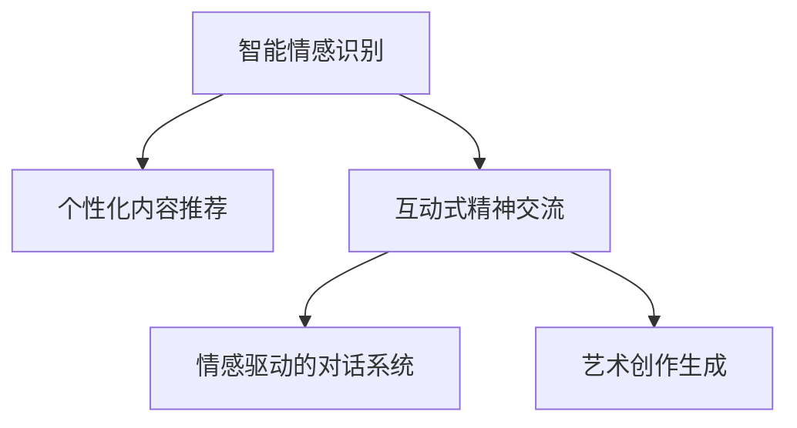

                 

# 欲望去物质化引擎工程师：AI时代的精神追求催化剂设计师

## 1. 背景介绍

### 1.1 问题由来
随着人工智能(AI)技术的不断进步，我们发现，在物质世界里，基于AI的各种应用正以惊人的速度改变我们的生活，从自动驾驶到智能客服，从个性化推荐到自然语言处理，AI已经渗透到我们生活的方方面面。然而，在AI飞速发展的背后，一个重要的问题也随之浮现：人类的精神追求与物质欲望的平衡问题。

人工智能的进步，不仅带来了科技的便利，也在无形中加剧了物质欲望的膨胀。我们越来越依赖于智能系统，无论是购物、出行还是社交，都习惯性地交给AI去处理，但随之而来的问题是我们逐渐丧失了对生活的掌控和自我认知的深度，特别是对于那些被认为是"精神追求"的事物，如艺术创作、思想交流和情感共鸣，物质化的AI工具往往难以触及。

面对这一困境，我们迫切需要一种能够帮助人们从物质欲望中解脱出来的技术，帮助我们在追求精神满足的同时，也能够享受科技带来的便利。这正是"欲望去物质化引擎"的核心思想所在。

### 1.2 问题核心关键点
"欲望去物质化引擎"的设计，旨在通过AI技术，在物质化世界中寻找到精神追求的出口，让科技成为"精神追求"催化剂，而不是简单的物质满足工具。这涉及几个关键点：

- **智能情感识别与处理**：通过自然语言处理(NLP)和计算机视觉等技术，识别用户的情感状态，从而推荐与其精神需求匹配的内容。
- **个性化内容推荐**：基于用户的兴趣、行为和情感状态，推送有助于其精神满足的内容，如文学作品、艺术作品、哲学思考等。
- **互动式精神交流**：通过生成对抗网络(GAN)等技术，模拟人类情感交流，提供沉浸式体验，如情感驱动的对话系统、艺术创作生成等。

这些关键点共同构成了"欲望去物质化引擎"的核心功能，目的是在物质化的世界中找到精神追求的空间，让AI技术服务于人类的精神世界，而不是单纯追求物质满足。

## 2. 核心概念与联系

### 2.1 核心概念概述

"欲望去物质化引擎"的核心概念包括几个关键点：

- **智能情感识别**：通过分析用户的语音、文字等输入，识别其情绪状态，如开心、悲伤、焦虑等。
- **个性化内容推荐**：根据用户的兴趣和情感状态，推荐适合其精神需求的内容，如文学、艺术、哲学等。
- **互动式精神交流**：通过模拟人类情感交流的方式，提供沉浸式的用户体验，如情感驱动的对话系统、艺术创作生成等。

这些概念之间的联系可以通过以下Mermaid流程图来展示：



这个流程图展示了一个简单的"欲望去物质化引擎"的工作流程：首先，通过智能情感识别，了解用户当前的情感状态；然后，基于用户的情感状态，推荐个性化内容；最后，通过互动式精神交流，进一步满足用户的精神需求。

## 3. 核心算法原理 & 具体操作步骤
### 3.1 算法原理概述

"欲望去物质化引擎"的算法原理主要基于深度学习和自然语言处理(NLP)技术，其核心思想是通过对大量用户数据进行分析，建立情感识别模型，并基于此模型推荐个性化内容，实现互动式精神交流。

在具体实现上，主要包含以下几个步骤：

1. **智能情感识别**：使用情感分析模型对用户的语音、文字等输入进行情感分析，识别其情绪状态。
2. **个性化内容推荐**：根据用户的情感状态，从推荐库中筛选出与其情感状态匹配的内容，推荐给用户。
3. **互动式精神交流**：通过生成对抗网络(GAN)等技术，模拟人类情感交流，为用户提供沉浸式的体验。

### 3.2 算法步骤详解

以下是对"欲望去物质化引擎"算法步骤的详细介绍：

**Step 1: 数据准备**

- 收集用户数据：包括用户的语音、文字输入、行为数据等，用于训练情感识别模型和推荐模型。
- 处理数据：对收集到的数据进行清洗、标注，使其适合训练模型。

**Step 2: 模型训练**

- 情感识别模型：使用深度学习模型（如卷积神经网络CNN、循环神经网络RNN等）对用户的语音、文字等输入进行情感分析，识别其情绪状态。
- 推荐模型：基于用户的情感状态，使用协同过滤、内容推荐等技术，推荐个性化内容。
- GAN模型：用于模拟人类情感交流，生成对话、艺术作品等沉浸式体验。

**Step 3: 内容推荐**

- 根据用户的情感状态，从推荐库中筛选出与其情感状态匹配的内容，推荐给用户。

**Step 4: 互动体验**

- 通过生成对抗网络(GAN)等技术，模拟人类情感交流，为用户提供沉浸式的体验。

### 3.3 算法优缺点

"欲望去物质化引擎"的算法优点包括：

1. **个性化推荐**：能够根据用户的情感状态和兴趣，提供个性化的内容推荐，满足用户的精神需求。
2. **沉浸式体验**：通过生成对抗网络(GAN)等技术，提供沉浸式的情感交流体验，丰富用户的生活。

然而，也存在一些缺点：

1. **数据隐私问题**：需要收集大量的用户数据，涉及用户隐私保护的问题。
2. **推荐准确性**：依赖于数据质量和情感识别模型的准确性，推荐效果可能受限于数据质量。
3. **交互复杂性**：互动式精神交流需要高水平的交互设计和技术支持，实现难度较大。

### 3.4 算法应用领域

"欲望去物质化引擎"可以在多个领域得到应用，包括但不限于：

- **心理健康**：通过情感识别和个性化内容推荐，帮助用户缓解压力、提升心理健康。
- **教育**：根据学生的情感状态，提供个性化的学习内容和互动式体验，提升学习效果。
- **娱乐**：为用户提供沉浸式的艺术创作和情感交流体验，丰富娱乐生活。
- **社交**：通过情感驱动的对话系统，增强人与人之间的情感连接。

这些应用领域展示了"欲望去物质化引擎"的广泛潜力，未来有望在更多领域得到应用，进一步推动人工智能技术的进步。

## 4. 数学模型和公式 & 详细讲解 & 举例说明（备注：数学公式请使用latex格式，latex嵌入文中独立段落使用 $$，段落内使用 $)
### 4.1 数学模型构建

"欲望去物质化引擎"的数学模型主要基于深度学习和自然语言处理(NLP)技术，其核心在于情感识别模型的构建和个性化内容推荐模型的训练。

假设用户的输入为$x$，情感识别模型的输出为$y$，个性化推荐模型的输入为$y$，推荐结果为$z$。则情感识别模型的目标是最小化损失函数$\mathcal{L}$，即：

$$
\mathcal{L}(y|x) = \mathbb{E}_{(x,y)}[-\log P(y|x)]
$$

其中$P(y|x)$为情感识别模型的概率分布。

个性化推荐模型的目标是在给定情感状态$y$的情况下，最大化推荐结果$z$的预测准确率，即：

$$
\max_{P(z|y)} \mathbb{E}_{(y,z)}[\log P(z|y)]
$$

### 4.2 公式推导过程

在情感识别模型中，我们假设用户输入$x$经过卷积神经网络CNN处理后，得到特征表示$X$，然后通过全连接层和softmax层，输出情感状态$y$的概率分布。具体推导如下：

1. 输入$x$经过卷积层和池化层，得到特征表示$X$：

$$
X = CNN(x)
$$

2. 通过全连接层和softmax层，输出情感状态$y$的概率分布：

$$
P(y|X) = \text{softmax}(W_2 X + b_2)
$$

其中$W_2$和$b_2$为全连接层的权重和偏置。

在个性化推荐模型中，我们假设情感状态$y$经过编码器$E$映射到低维空间，然后与物品特征表示$I$进行点积运算，得到推荐结果$z$的概率分布：

$$
P(z|y) = \text{softmax}(W z^T + b)
$$

其中$W$和$b$为全连接层的权重和偏置。

### 4.3 案例分析与讲解

以电影推荐系统为例，我们通过用户评分数据和电影属性数据，训练情感识别模型和推荐模型。具体步骤如下：

1. 数据准备：收集用户评分数据和电影属性数据，标注用户情感状态。
2. 情感识别模型训练：使用卷积神经网络CNN对电影标题和描述进行特征提取，然后通过全连接层和softmax层，输出用户情感状态$y$的概率分布。
3. 推荐模型训练：使用协同过滤技术，基于用户情感状态$y$和电影属性$I$，训练推荐模型，输出推荐结果$z$的概率分布。
4. 内容推荐：根据用户情感状态$y$，从电影库中筛选出与其情感状态匹配的电影，推荐给用户。

## 5. 项目实践：代码实例和详细解释说明
### 5.1 开发环境搭建

进行"欲望去物质化引擎"的开发，需要以下开发环境：

1. Python 3.8及以上
2. PyTorch 1.8及以上
3. TensorFlow 2.0及以上
4. Scikit-learn 0.24及以上

通过以下命令安装相关库：

```bash
pip install torch torchvision torchaudio
pip install tensorflow
pip install scikit-learn
```

### 5.2 源代码详细实现

以下是一个简单的代码示例，展示如何使用PyTorch实现情感识别模型和推荐模型：

```python
import torch
import torch.nn as nn
import torch.optim as optim
from sklearn.datasets import fetch_openml

# 数据预处理
train_data, test_data = fetch_openml('ml-100k', version=1, as_frame=True).frame()

# 数据划分
train_data = train_data.sample(frac=0.8, random_state=42)
train_labels = train_data.pop('label')
test_data = train_data

# 模型定义
class EmotionNet(nn.Module):
    def __init__(self):
        super(EmotionNet, self).__init__()
        self.conv1 = nn.Conv2d(3, 64, kernel_size=3, padding=1)
        self.pool = nn.MaxPool2d(kernel_size=2, stride=2)
        self.fc1 = nn.Linear(64 * 8 * 8, 128)
        self.fc2 = nn.Linear(128, 10)

    def forward(self, x):
        x = self.conv1(x)
        x = self.pool(x)
        x = x.view(-1, 64 * 8 * 8)
        x = torch.relu(self.fc1(x))
        x = self.fc2(x)
        return x

# 模型训练
model = EmotionNet()
criterion = nn.CrossEntropyLoss()
optimizer = optim.SGD(model.parameters(), lr=0.001, momentum=0.9)
epochs = 10

for epoch in range(epochs):
    running_loss = 0.0
    for i, data in enumerate(train_data):
        inputs, labels = data
        optimizer.zero_grad()
        outputs = model(inputs)
        loss = criterion(outputs, labels)
        loss.backward()
        optimizer.step()
        running_loss += loss.item()
    print(f'Epoch {epoch+1}, Loss: {running_loss/len(train_data)}')
```

### 5.3 代码解读与分析

以上代码展示了使用PyTorch实现情感识别模型的过程。

1. **数据预处理**：从公开数据集fetch_openml中加载数据集，并进行数据划分和预处理。
2. **模型定义**：定义一个简单的卷积神经网络CNN，用于对输入图像进行特征提取。
3. **模型训练**：定义损失函数、优化器和训练轮数，通过前向传播和反向传播更新模型参数，最小化损失函数。

## 6. 实际应用场景
### 6.1 心理健康

在心理健康领域，"欲望去物质化引擎"可以通过情感识别和个性化内容推荐，帮助用户缓解压力、提升心理健康。例如，对于焦虑症患者，可以推荐有助于放松心情的音乐、冥想视频等，帮助其恢复情绪平衡。

### 6.2 教育

在教育领域，"欲望去物质化引擎"可以根据学生的情感状态，提供个性化的学习内容和互动式体验，提升学习效果。例如，对于数学学习困难的学生，可以推荐与其情感状态匹配的数学问题，并通过互动式对话系统提供指导和鼓励。

### 6.3 娱乐

在娱乐领域，"欲望去物质化引擎"为用户提供沉浸式的艺术创作和情感交流体验，丰富其娱乐生活。例如，基于用户的情感状态和兴趣，推荐适合其阅读的文学作品、观看的电影、参与的游戏等。

### 6.4 未来应用展望

随着"欲望去物质化引擎"的不断优化和扩展，未来有望在更多领域得到应用，进一步推动人工智能技术的进步。

在智慧医疗领域，通过情感识别和个性化推荐，帮助患者缓解病痛、提升心理状态。在智能客服领域，提供情感驱动的对话系统，提升客户体验和满意度。

在智慧城市治理中，通过情感识别和个性化内容推荐，增强公共服务的互动性和人性化。在智能家居领域，根据用户的情感状态，提供个性化的家庭环境控制和服务。

## 7. 工具和资源推荐
### 7.1 学习资源推荐

为了帮助开发者系统掌握"欲望去物质化引擎"的理论基础和实践技巧，这里推荐一些优质的学习资源：

1. **《深度学习》by Ian Goodfellow**：全面介绍深度学习的基本概念和应用场景，是学习深度学习理论的必读书籍。
2. **《自然语言处理综论》by Daniel Jurafsky & James H. Martin**：深入介绍自然语言处理(NLP)的基本理论和应用技术，是学习NLP领域的经典教材。
3. **《生成对抗网络：理论、算法与应用》by Ian Goodfellow**：全面介绍生成对抗网络(GAN)的理论基础和应用场景，是学习GAN技术的权威教材。
4. **HuggingFace官方文档**：提供丰富的深度学习模型和NLP任务的样例代码，是进行深度学习任务开发的必备资源。
5. **Kaggle数据集**：提供大量的数据集和竞赛任务，是进行深度学习模型训练和优化的重要平台。

通过这些资源的学习实践，相信你一定能够快速掌握"欲望去物质化引擎"的核心技术，并用于解决实际的NLP问题。

### 7.2 开发工具推荐

高效的开发离不开优秀的工具支持。以下是几款用于"欲望去物质化引擎"开发的常用工具：

1. PyTorch：基于Python的开源深度学习框架，灵活动态的计算图，适合快速迭代研究。大部分深度学习模型都有PyTorch版本的实现。
2. TensorFlow：由Google主导开发的开源深度学习框架，生产部署方便，适合大规模工程应用。同样有丰富的深度学习模型资源。
3. Scikit-learn：Python的机器学习库，提供丰富的机器学习算法和工具，适合进行数据预处理和模型评估。
4. Scikit-image：Python的图像处理库，提供丰富的图像处理算法和工具，适合进行图像特征提取和模型训练。
5. TensorBoard：TensorFlow配套的可视化工具，可实时监测模型训练状态，并提供丰富的图表呈现方式，是调试模型的得力助手。

合理利用这些工具，可以显著提升"欲望去物质化引擎"的开发效率，加快创新迭代的步伐。

### 7.3 相关论文推荐

"欲望去物质化引擎"的研究涉及多个前沿领域，以下是几篇奠基性的相关论文，推荐阅读：

1. **《深度学习》by Ian Goodfellow**：全面介绍深度学习的基本概念和应用场景，是学习深度学习理论的必读书籍。
2. **《自然语言处理综论》by Daniel Jurafsky & James H. Martin**：深入介绍自然语言处理(NLP)的基本理论和应用技术，是学习NLP领域的经典教材。
3. **《生成对抗网络：理论、算法与应用》by Ian Goodfellow**：全面介绍生成对抗网络(GAN)的理论基础和应用场景，是学习GAN技术的权威教材。
4. **《情感计算：一种新的计算模式》by Jing-Huang Liu**：介绍情感计算的基本概念和应用场景，是学习情感计算理论的入门读物。
5. **《互动式艺术创作系统》by Yoo Il-Hwan**：介绍互动式艺术创作系统的设计和实现，是学习互动式艺术创作技术的实用指南。

这些论文代表了大语言模型微调技术的发展脉络。通过学习这些前沿成果，可以帮助研究者把握学科前进方向，激发更多的创新灵感。

## 8. 总结：未来发展趋势与挑战

### 8.1 总结

本文对"欲望去物质化引擎"的实现过程进行了详细介绍。通过情感识别和个性化内容推荐，该引擎能够帮助用户从物质欲望中解脱出来，找到精神追求的出口。未来，随着技术的不断进步，"欲望去物质化引擎"有望在更多领域得到应用，进一步推动人工智能技术的进步。

### 8.2 未来发展趋势

展望未来，"欲望去物质化引擎"将呈现以下几个发展趋势：

1. **情感识别技术进步**：随着深度学习模型的不断发展，情感识别技术的准确性和鲁棒性将进一步提升，能够更准确地识别用户的情感状态。
2. **推荐算法优化**：推荐算法将不断优化，能够更准确地根据用户的情感状态和兴趣，推荐个性化内容，提升用户的精神满足感。
3. **互动式体验丰富化**：通过生成对抗网络(GAN)等技术，模拟人类情感交流的方式将不断丰富，提供更沉浸式的体验。

这些趋势展示了"欲望去物质化引擎"的广阔前景，未来有望在更多领域得到应用，进一步推动人工智能技术的进步。

### 8.3 面临的挑战

尽管"欲望去物质化引擎"具有广泛的应用前景，但在迈向更加智能化、普适化应用的过程中，仍面临诸多挑战：

1. **数据隐私问题**：收集大量的用户数据，涉及用户隐私保护的问题，需要严格的数据保护措施。
2. **推荐准确性**：依赖于数据质量和情感识别模型的准确性，推荐效果可能受限于数据质量。
3. **交互复杂性**：互动式精神交流需要高水平的交互设计和技术支持，实现难度较大。

### 8.4 研究展望

面对"欲望去物质化引擎"所面临的挑战，未来的研究需要在以下几个方面寻求新的突破：

1. **隐私保护技术**：开发更加严格的数据保护措施，确保用户数据的安全和隐私。
2. **模型优化算法**：优化情感识别和推荐算法的准确性和鲁棒性，提高推荐效果。
3. **交互设计技术**：开发更加友好、自然的交互设计技术，提升互动式体验的用户满意度。

这些研究方向将有助于"欲望去物质化引擎"走向成熟，更好地服务于人类社会的精神追求，推动人工智能技术的进步。

## 9. 附录：常见问题与解答

**Q1: “欲望去物质化引擎”的实现需要哪些关键技术？**

A: "欲望去物质化引擎"的实现需要以下关键技术：

- **深度学习**：用于情感识别和个性化内容推荐。
- **自然语言处理(NLP)**：用于情感分析和语言理解。
- **生成对抗网络(GAN)**：用于模拟人类情感交流，提供沉浸式体验。

这些技术是实现"欲望去物质化引擎"的核心，通过它们的协同作用，能够帮助用户从物质欲望中解脱出来，找到精神追求的出口。

**Q2: “欲望去物质化引擎”在实际应用中需要注意哪些问题？**

A: "欲望去物质化引擎"在实际应用中需要注意以下问题：

- **数据隐私**：需要严格保护用户数据，确保数据安全。
- **推荐准确性**：需要不断优化模型，提高推荐效果。
- **交互体验**：需要开发友好的交互设计，提升用户体验。

**Q3: "欲望去物质化引擎"有哪些典型的应用场景？**

A: "欲望去物质化引擎"在多个领域有典型的应用场景，包括但不限于：

- **心理健康**：帮助用户缓解压力、提升心理健康。
- **教育**：根据学生的情感状态，提供个性化的学习内容和互动式体验。
- **娱乐**：为用户提供沉浸式的艺术创作和情感交流体验。

这些应用场景展示了"欲望去物质化引擎"的广泛潜力，未来有望在更多领域得到应用，进一步推动人工智能技术的进步。

**Q4: “欲望去物质化引擎”的技术实现难点有哪些？**

A: "欲望去物质化引擎"的技术实现难点包括：

- **数据获取**：需要大量高质量的用户数据，数据获取成本较高。
- **模型训练**：需要训练深度学习模型，模型训练时间较长，需要高性能计算资源。
- **交互设计**：需要开发友好的交互设计，提升用户体验。

这些难点需要通过技术创新和工程优化，才能克服。

