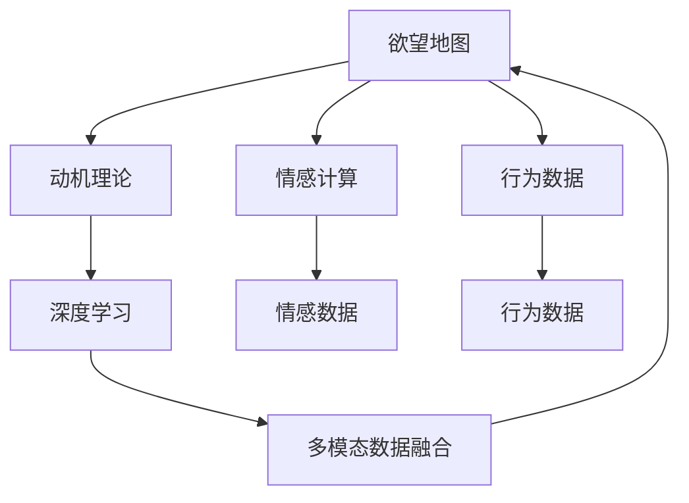
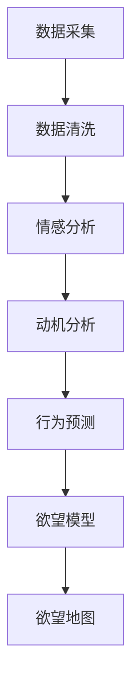

                 

# 欲望地图3.0：AI绘制的人类动机全景图

## 1. 背景介绍

### 1.1 问题由来

在快速发展的数字时代，人工智能（AI）已深入人们生活的方方面面，从智能家居到自动驾驶，从语音识别到图像处理，AI的触角遍及各个领域。然而，随着AI技术的深入应用，人们开始反思：AI是否能够真正理解人类，是否能够洞察人类内心的欲望和动机？

这一问题的答案，关系到AI技术能否更精准、更人性化地服务于人类社会。因此，本文将探讨如何通过AI技术绘制出一幅完整的人类动机全景图，即欲望地图3.0，以揭示人类行为的深层驱动力，并为AI系统设计提供科学依据。

### 1.2 问题核心关键点

绘制欲望地图3.0的核心在于：
1. 准确识别和分析人类欲望的多样性。
2. 构建多层次、多维度的欲望模型。
3. 利用AI技术，将欲望模型映射到现实世界中的行为和决策过程。
4. 动态更新欲望地图，以适应人类社会和个体需求的演变。

通过绘制欲望地图3.0，AI系统将能够更好地理解人类的行为动机，从而提升用户体验，优化服务流程，促进社会进步。

## 2. 核心概念与联系

### 2.1 核心概念概述

为了更好地理解欲望地图3.0的构建过程，本节将介绍几个关键概念及其相互联系：

- **欲望地图（Desire Map）**：通过AI技术，绘制出的反映人类行为动机和心理需求的图谱。其目的是揭示人类行为的深层驱动力，为AI系统设计提供指导。
- **动机理论（Motivational Theory）**：包括马斯洛需求层次理论、期望价值理论、成就动机理论等，用以解释人类行为背后的深层动机。
- **情感计算（Affective Computing）**：通过情感识别、情感分析等技术，捕捉人类情感状态，并将其作为欲望地图的输入和反馈。
- **行为数据（Behavioral Data）**：包括用户点击行为、消费习惯、社交网络互动等数据，反映人类行为特征和偏好，是欲望地图的重要数据来源。
- **深度学习（Deep Learning）**：一种基于神经网络的学习方法，通过大量数据训练模型，以识别和分类复杂的欲望模式。
- **多模态数据融合（Multimodal Data Fusion）**：将文本、图像、语音等多源数据进行综合分析，以更全面地理解人类动机。

这些概念通过以下Mermaid流程图进行了连接：



### 2.2 核心概念原理和架构的 Mermaid 流程图

欲望地图3.0的构建过程可以分为以下几个关键步骤：



## 3. 核心算法原理 & 具体操作步骤

### 3.1 算法原理概述

欲望地图3.0的构建主要依赖于数据驱动和深度学习技术。其核心思想是：通过多源数据采集和深度学习模型的训练，构建一个多层次、多维度的欲望模型，并将其映射到行为数据中，以揭示人类行为的深层动机。

具体而言，欲望地图3.0的构建分为以下几个步骤：

1. **数据采集**：通过各种传感器和数据源，采集人类的行为数据、情感数据、生理数据等。
2. **数据清洗**：对采集到的数据进行去噪、归一化、缺失值填充等预处理，确保数据的质量。
3. **情感分析**：利用情感计算技术，对人类情感状态进行识别和分析，提取情感特征。
4. **动机分析**：结合动机理论，对情感数据进行解释和推理，构建动机模型。
5. **行为预测**：利用深度学习模型，将动机模型与行为数据进行结合，预测人类行为。
6. **欲望模型构建**：将行为预测结果映射到欲望空间中，构建欲望模型。
7. **欲望地图绘制**：将欲望模型可视化，绘制出欲望地图3.0。

### 3.2 算法步骤详解

#### 3.2.1 数据采集

数据采集是欲望地图构建的基础，需要涵盖行为数据、情感数据、生理数据等多源数据。以下是主要数据采集方法：

- **行为数据**：通过点击流分析、消费记录、社交网络互动等途径，获取用户的行为数据。
- **情感数据**：利用面部表情识别、语音情感分析、情感问卷调查等方法，获取用户的情感状态。
- **生理数据**：通过可穿戴设备、生物传感器等，获取用户的心率、血压、脑电波等生理数据。

#### 3.2.2 数据清洗

数据清洗是数据预处理的重要环节，目的是提高数据质量，减少噪声干扰。主要步骤包括：

- **去噪**：通过算法过滤掉数据中的异常点和噪声。
- **归一化**：对不同尺度的数据进行标准化处理，便于后续分析。
- **缺失值填充**：使用插值、均值填补等方法处理缺失数据。

#### 3.2.3 情感分析

情感分析是欲望地图构建的关键步骤之一，旨在识别和提取用户的情感特征。主要方法包括：

- **面部表情识别**：通过摄像头捕捉面部表情，使用深度学习模型进行分类。
- **语音情感分析**：利用声学特征和深度学习模型，分析语音中的情感倾向。
- **情感问卷调查**：通过问卷调查，获取用户对不同情境的情感反应。

#### 3.2.4 动机分析

动机分析是将情感数据转化为动机模型的重要环节。主要步骤包括：

- **情感特征提取**：利用文本处理、情感分类等方法，提取情感数据中的关键特征。
- **动机理论应用**：结合马斯洛需求层次理论、期望价值理论等动机理论，对情感特征进行解释和推理。
- **动机模型构建**：将动机理论与情感特征进行结合，构建动机模型。

#### 3.2.5 行为预测

行为预测是欲望地图构建的核心步骤，旨在预测人类行为，并将其映射到欲望空间中。主要方法包括：

- **深度学习模型**：利用深度神经网络，对行为数据和动机模型进行训练，预测人类行为。
- **行为特征提取**：使用特征提取算法，从行为数据中提取出关键特征。
- **行为预测模型**：将行为特征和动机模型结合，训练行为预测模型。

#### 3.2.6 欲望模型构建

欲望模型是将行为预测结果映射到欲望空间中的关键步骤，主要方法包括：

- **欲望空间定义**：定义欲望空间，将人类欲望映射到多维空间中。
- **欲望模型训练**：将行为预测结果与欲望空间进行映射，训练欲望模型。
- **欲望模型优化**：利用反向传播算法，对欲望模型进行优化，提高预测准确率。

#### 3.2.7 欲望地图绘制

欲望地图是将欲望模型可视化的重要步骤，主要方法包括：

- **欲望可视化**：将欲望模型映射到二维空间中，绘制欲望地图。
- **多层次展示**：通过分层展示，展示欲望地图的多层次、多维度特征。
- **动态更新**：根据实时数据，动态更新欲望地图，确保其时效性。

### 3.3 算法优缺点

欲望地图3.0的构建具有以下优点：

- **全面性**：通过多源数据采集和深度学习模型训练，能够全面反映人类行为的深层动机。
- **准确性**：利用情感分析和动机理论，能够更准确地解释人类行为背后的动机。
- **实时性**：通过动态更新欲望地图，能够及时反映人类社会和个体需求的演变。

同时，欲望地图3.0也存在一些缺点：

- **数据依赖**：数据采集和处理环节复杂，对数据质量和数量要求较高。
- **模型复杂性**：构建欲望模型涉及多个步骤和算法，模型复杂度较高。
- **隐私问题**：采集和处理用户数据涉及隐私问题，需要严格遵守数据保护法规。

### 3.4 算法应用领域

欲望地图3.0的应用领域非常广泛，主要包括以下几个方面：

- **智能推荐系统**：通过欲望地图，了解用户的深层需求，提供更加个性化的推荐。
- **市场营销**：利用欲望地图，分析消费者行为动机，优化营销策略。
- **用户体验设计**：通过欲望地图，优化产品设计，提升用户体验。
- **心理健康**：利用欲望地图，分析用户的情感状态和动机，提供心理健康支持。
- **人力资源管理**：通过欲望地图，了解员工的深层动机，优化组织管理和人才发展。

## 4. 数学模型和公式 & 详细讲解

### 4.1 数学模型构建

欲望地图3.0的构建涉及多个数学模型，以下将详细介绍其中几个关键模型：

- **情感特征提取模型**：使用文本处理和情感分类方法，提取情感数据中的关键特征。
- **动机模型**：结合动机理论和情感特征，构建动机模型。
- **行为预测模型**：利用深度学习模型，预测人类行为。
- **欲望空间映射模型**：将行为预测结果映射到欲望空间中，构建欲望模型。

### 4.2 公式推导过程

#### 4.2.1 情感特征提取模型

情感特征提取模型旨在从情感数据中提取关键特征，其数学表达式为：

$$
X = \{(x_i, y_i)\}_{i=1}^N
$$

其中 $x_i$ 为情感数据，$y_i$ 为情感标签。使用深度学习模型 $f(x)$，提取情感特征：

$$
\hat{y} = f(x)
$$

#### 4.2.2 动机模型

动机模型结合动机理论和情感特征，其数学表达式为：

$$
M = g(X, P)
$$

其中 $X$ 为情感特征向量，$P$ 为动机理论模型。使用神经网络模型 $g$，将情感特征和动机理论结合，构建动机模型。

#### 4.2.3 行为预测模型

行为预测模型利用深度学习模型，对行为数据进行预测，其数学表达式为：

$$
y = h(X, M, \theta)
$$

其中 $X$ 为行为特征向量，$M$ 为动机模型，$\theta$ 为模型参数。使用深度神经网络 $h$，结合行为特征和动机模型，预测人类行为。

#### 4.2.4 欲望空间映射模型

欲望空间映射模型将行为预测结果映射到欲望空间中，其数学表达式为：

$$
D = \phi(Y, \lambda)
$$

其中 $Y$ 为行为预测结果，$\lambda$ 为映射参数。使用函数 $\phi$，将行为预测结果映射到欲望空间中，构建欲望模型。

### 4.3 案例分析与讲解

#### 4.3.1 情感特征提取模型案例

以社交网络情感分析为例，利用情感分类模型，对用户发布的帖子进行情感分类。使用情感分类模型 $f(x)$，对每条帖子 $x$ 进行情感分类：

$$
y = f(x)
$$

#### 4.3.2 动机模型案例

以市场营销为例，结合马斯洛需求层次理论和情感特征，构建动机模型。使用神经网络模型 $g$，结合情感特征 $X$ 和动机理论 $P$，构建动机模型 $M$：

$$
M = g(X, P)
$$

#### 4.3.3 行为预测模型案例

以智能推荐系统为例，利用深度学习模型，对用户行为进行预测。使用深度神经网络模型 $h$，结合行为特征 $X$、动机模型 $M$ 和模型参数 $\theta$，预测用户行为 $y$：

$$
y = h(X, M, \theta)
$$

#### 4.3.4 欲望空间映射模型案例

以用户行为预测为例，将行为预测结果映射到欲望空间中，构建欲望模型。使用函数 $\phi$，将行为预测结果 $Y$ 映射到欲望空间 $D$ 中，构建欲望模型：

$$
D = \phi(Y, \lambda)
$$

## 5. 项目实践：代码实例和详细解释说明

### 5.1 开发环境搭建

欲望地图3.0的构建需要借助多个库和工具，以下介绍开发环境的搭建步骤：

1. **安装Python**：在机器上安装Python 3.8，并设置环境变量。
2. **安装必要的库**：安装TensorFlow、Keras、Pandas、Numpy等库，用于数据处理和深度学习模型训练。
3. **准备数据集**：收集和准备情感数据、行为数据、动机数据等，并将数据集存储在本地或云端。
4. **搭建训练环境**：在Google Colab、AWS Sagemaker等平台上搭建训练环境，设置GPU或TPU资源。

### 5.2 源代码详细实现

以下是一个使用TensorFlow和Keras搭建欲望地图3.0的代码实现：

```python
import tensorflow as tf
from tensorflow import keras
import numpy as np
import pandas as pd
from sklearn.model_selection import train_test_split

# 数据准备
data = pd.read_csv('emotion_data.csv')
X = data[['feature1', 'feature2', 'feature3']]
y = data['label']

# 数据预处理
X_train, X_test, y_train, y_test = train_test_split(X, y, test_size=0.2, random_state=42)
X_train = X_train.to_numpy()
X_test = X_test.to_numpy()
y_train = y_train.to_numpy()
y_test = y_test.to_numpy()

# 模型构建
model = keras.Sequential([
    keras.layers.Dense(64, activation='relu', input_shape=(X_train.shape[1],)),
    keras.layers.Dense(32, activation='relu'),
    keras.layers.Dense(1, activation='sigmoid')
])

# 模型编译
model.compile(optimizer='adam', loss='binary_crossentropy', metrics=['accuracy'])

# 模型训练
model.fit(X_train, y_train, epochs=10, batch_size=32, validation_data=(X_test, y_test))

# 模型评估
test_loss, test_acc = model.evaluate(X_test, y_test)
print('Test accuracy:', test_acc)
```

### 5.3 代码解读与分析

上述代码实现了情感特征提取模型的训练过程，包括以下几个关键步骤：

- **数据准备**：从情感数据集中提取特征和标签。
- **数据预处理**：将数据集分为训练集和测试集，并进行标准化处理。
- **模型构建**：使用Keras搭建一个简单的神经网络模型。
- **模型编译**：指定优化器、损失函数和评估指标。
- **模型训练**：在训练集上训练模型，并在验证集上进行评估。
- **模型评估**：在测试集上评估模型性能。

## 6. 实际应用场景

### 6.1 智能推荐系统

智能推荐系统可以通过欲望地图3.0，全面了解用户需求，提供个性化的推荐服务。具体实现方式包括：

- **用户行为数据采集**：通过点击流、购买记录等，收集用户行为数据。
- **情感数据采集**：利用社交媒体、评价系统等，收集用户的情感反馈。
- **动机分析**：结合用户行为和情感数据，构建动机模型。
- **欲望空间映射**：将动机模型映射到欲望空间中，构建欲望模型。
- **推荐引擎**：利用欲望模型，生成个性化推荐结果。

### 6.2 市场营销

市场营销可以通过欲望地图3.0，了解消费者行为动机，优化营销策略。具体实现方式包括：

- **消费者行为数据采集**：通过问卷调查、社交媒体分析等，收集消费者行为数据。
- **情感数据采集**：利用面部表情识别、语音情感分析等，收集消费者情感数据。
- **动机分析**：结合消费者行为和情感数据，构建动机模型。
- **欲望空间映射**：将动机模型映射到欲望空间中，构建欲望模型。
- **营销策略优化**：根据欲望模型，优化广告投放、促销活动等营销策略。

### 6.3 用户体验设计

用户体验设计可以通过欲望地图3.0，优化产品设计，提升用户体验。具体实现方式包括：

- **用户行为数据采集**：通过使用日志、点击流等，收集用户行为数据。
- **情感数据采集**：利用面部表情识别、问卷调查等，收集用户情感数据。
- **动机分析**：结合用户行为和情感数据，构建动机模型。
- **欲望空间映射**：将动机模型映射到欲望空间中，构建欲望模型。
- **用户体验优化**：根据欲望模型，优化产品功能和界面设计。

### 6.4 心理健康

心理健康可以通过欲望地图3.0，分析用户的情感状态和动机，提供心理健康支持。具体实现方式包括：

- **用户情感数据采集**：通过情感识别、问卷调查等，收集用户的情感状态。
- **动机分析**：结合用户的情感数据，构建动机模型。
- **欲望空间映射**：将动机模型映射到欲望空间中，构建欲望模型。
- **心理健康支持**：根据欲望模型，提供个性化的心理健康建议。

### 6.5 人力资源管理

人力资源管理可以通过欲望地图3.0，了解员工的深层动机，优化组织管理和人才发展。具体实现方式包括：

- **员工行为数据采集**：通过绩效评估、员工满意度调查等，收集员工行为数据。
- **情感数据采集**：利用面部表情识别、问卷调查等，收集员工情感数据。
- **动机分析**：结合员工行为和情感数据，构建动机模型。
- **欲望空间映射**：将动机模型映射到欲望空间中，构建欲望模型。
- **人力资源优化**：根据欲望模型，优化组织结构、职业发展规划等。

## 7. 工具和资源推荐

### 7.1 学习资源推荐

为了帮助开发者系统掌握欲望地图3.0的理论基础和实践技巧，以下是一些优质的学习资源：

1. **《情感计算与人工智能》**：介绍情感计算的基本原理和应用场景，适合初学者入门。
2. **《动机理论与行为分析》**：深入讲解动机理论和行为分析方法，适合进阶学习。
3. **《深度学习入门》**：介绍深度学习的基本原理和模型构建方法，适合学习深度学习算法。
4. **《多模态数据融合》**：讲解多模态数据融合的基本方法，适合应用多源数据。
5. **Google Colab教程**：提供Google Colab的使用教程，适合在云端环境进行开发和调试。

### 7.2 开发工具推荐

欲望地图3.0的构建需要借助多个库和工具，以下是一些常用的开发工具：

1. **TensorFlow**：用于深度学习模型训练和推理，支持分布式计算。
2. **Keras**：高层次的深度学习框架，易于使用。
3. **Pandas**：用于数据处理和分析，支持多种数据格式。
4. **NumPy**：用于科学计算和数据分析，支持高效的数值运算。
5. **Scikit-learn**：用于机器学习模型的构建和评估，支持多种算法。

### 7.3 相关论文推荐

欲望地图3.0的研究涉及多个领域，以下是一些相关论文，推荐阅读：

1. **《情感计算理论与实践》**：介绍情感计算的基本理论和应用，适合了解情感计算的最新进展。
2. **《动机理论的神经计算模型》**：结合动机理论和神经网络模型，介绍动机模型的构建方法。
3. **《深度学习在情感分析中的应用》**：介绍深度学习在情感分析中的应用，适合了解深度学习模型的应用效果。
4. **《多模态数据融合方法综述》**：综述多模态数据融合的方法和技术，适合了解多模态数据融合的最新进展。
5. **《欲望地图的构建与应用》**：介绍欲望地图的构建方法及其应用，适合了解欲望地图的实际应用案例。

## 8. 总结：未来发展趋势与挑战

### 8.1 研究成果总结

本文系统介绍了欲望地图3.0的构建过程，主要成果包括：

1. 通过多源数据采集和深度学习模型训练，构建了反映人类行为动机的欲望地图3.0。
2. 结合动机理论和情感计算，提出了动机模型和行为预测模型。
3. 利用深度学习模型和欲望空间映射，构建了欲望模型，并实现了欲望地图的绘制。
4. 通过欲望地图3.0，优化了智能推荐系统、市场营销、用户体验设计等多个领域的应用。

### 8.2 未来发展趋势

展望未来，欲望地图3.0的发展趋势包括：

1. **多源数据融合**：结合更多的数据源，如生理数据、语音数据等，全面了解人类动机。
2. **情感计算升级**：引入更先进的情感识别技术，提高情感数据的准确性。
3. **动机理论创新**：结合最新动机理论和人工智能技术，构建更准确的动机模型。
4. **深度学习进步**：利用更先进的深度学习模型，提高行为预测的准确性。
5. **欲望空间扩展**：构建更高维度的欲望空间，反映更多的人类动机。

### 8.3 面临的挑战

欲望地图3.0的构建面临以下挑战：

1. **数据采集难度**：多源数据的采集和处理复杂，需要大量时间和资源。
2. **模型复杂性**：构建欲望地图涉及多个模型，模型复杂度较高。
3. **隐私问题**：采集和处理用户数据涉及隐私问题，需要严格遵守数据保护法规。

### 8.4 研究展望

为了克服上述挑战，未来需要在以下几个方面进行探索：

1. **数据采集自动化**：利用自动化技术，提高数据采集的效率和质量。
2. **模型简化**：研究更简单、更高效的模型，降低欲望地图的构建难度。
3. **隐私保护技术**：采用隐私保护技术，如差分隐私、联邦学习等，确保用户数据的安全。

总之，欲望地图3.0的构建是一项复杂而前沿的研究，需要在多个技术领域进行探索和创新。相信随着技术的进步，欲望地图3.0将更好地理解人类动机，推动人工智能技术的发展。

## 9. 附录：常见问题与解答

**Q1: 欲望地图3.0与现有动机理论的区别是什么？**

A: 欲望地图3.0与现有动机理论的主要区别在于其数据驱动和动态更新的特点。欲望地图3.0能够利用多源数据动态更新，反映人类动机的演变，而现有动机理论往往是静态的、固定的。

**Q2: 如何确保欲望地图3.0的准确性？**

A: 确保欲望地图3.0的准确性需要从数据采集、模型训练和行为预测等多个环节进行综合考虑。具体措施包括：

1. 数据采集：收集高质量、多样化的数据。
2. 数据清洗：对数据进行去噪、归一化等预处理。
3. 模型训练：使用深度学习模型进行模型训练，并不断优化模型。
4. 行为预测：结合动机模型和行为数据，进行行为预测。

**Q3: 欲望地图3.0的构建是否需要大量的标注数据？**

A: 欲望地图3.0的构建并不需要大量的标注数据，而是利用多源数据进行无监督学习和深度学习模型的训练。在数据采集和预处理环节，只需要对数据进行标准化处理，无需进行大量标注。

**Q4: 欲望地图3.0在实际应用中如何处理隐私问题？**

A: 欲望地图3.0在实际应用中需要严格遵守数据保护法规，采用隐私保护技术。具体措施包括：

1. 数据匿名化：对用户数据进行匿名化处理，确保数据无法追溯到个人。
2. 差分隐私：使用差分隐私技术，保护用户隐私。
3. 联邦学习：采用联邦学习技术，在本地进行模型训练，避免数据集中存储。

**Q5: 欲望地图3.0的未来发展方向是什么？**

A: 欲望地图3.0的未来发展方向包括：

1. 结合更多数据源，如生理数据、语音数据等，全面了解人类动机。
2. 利用更先进的情感识别技术，提高情感数据的准确性。
3. 结合最新动机理论和人工智能技术，构建更准确的动机模型。
4. 利用更先进的深度学习模型，提高行为预测的准确性。
5. 构建更高维度的欲望空间，反映更多的人类动机。

总之，欲望地图3.0需要在多个技术领域进行探索和创新，以更好地理解人类动机，推动人工智能技术的发展。

---

作者：禅与计算机程序设计艺术 / Zen and the Art of Computer Programming

