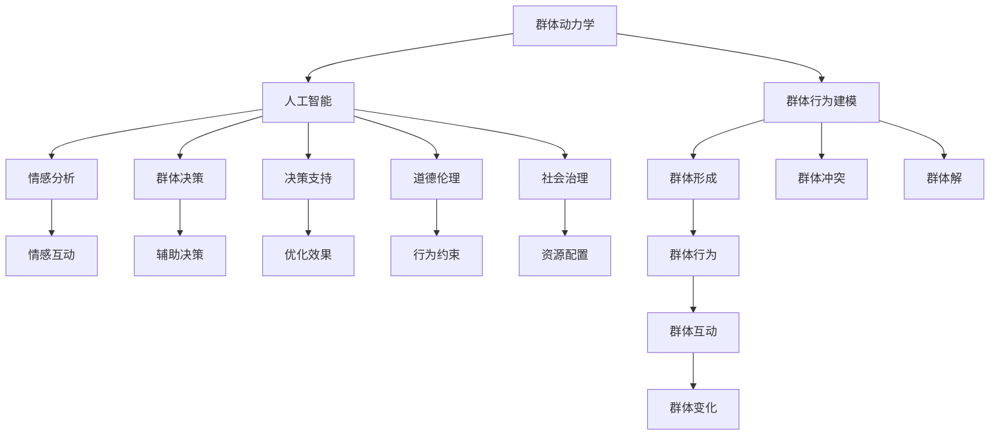

                 

## 1. 背景介绍

### 1.1 问题由来

随着人工智能技术的迅猛发展，AI已经渗透到我们生活的方方面面。从智能家居、自动驾驶，到医疗健康、金融服务，AI的应用无处不在。但与此同时，AI也引发了关于欲望、伦理、社会治理等深刻的社会问题。如何通过AI技术来解决这些问题，促进社会和谐发展，成为当前研究的热点。

群体动力学（Group Dynamics）是研究个体在群体中行为变化的一门科学。AI驱动的群体动力学指的是利用AI技术，如机器学习、深度学习等，对群体行为进行建模、分析和预测。这种研究有助于我们理解AI技术如何影响社会行为、决策和互动，以及如何在AI技术助力下实现社会治理和优化。

### 1.2 问题核心关键点

AI驱动的群体动力学涉及以下几个核心关键点：

- **群体行为建模**：如何基于AI技术构建群体行为模型，以描述和预测群体中个体的行为变化。
- **情感分析**：如何通过AI技术分析群体中的情感状态，理解个体与群体间的情感互动。
- **决策支持**：如何在群体决策过程中利用AI技术提供辅助决策，以优化决策效果。
- **道德伦理**：如何通过AI技术引导和约束个体行为，确保群体行为符合伦理道德标准。
- **社会治理**：如何利用AI技术，如自然语言处理、机器学习等，提升社会治理效率和公平性。

这些关键点涉及社会科学的多个领域，是AI与社会科学交叉融合的重要方向。

## 2. 核心概念与联系

### 2.1 核心概念概述

为了更好地理解AI驱动的群体动力学，我们需要明确几个核心概念：

- **群体动力学**：研究个体在群体中行为变化的过程，包括群体形成、演化、冲突和解等。
- **人工智能**：一种通过计算机算法实现智能行为的科技手段，包括机器学习、深度学习、自然语言处理等。
- **AI驱动的群体动力学**：利用AI技术对群体行为进行建模、分析和预测的科学。
- **群体决策**：群体中个体共同参与决策的过程，AI技术可以帮助优化这一过程，提升决策效率和效果。
- **情感分析**：通过AI技术分析群体中个体情感状态的变化，理解群体互动的情感基础。
- **社会治理**：利用AI技术，提升社会管理效率，优化资源配置，促进社会公平。

这些概念之间的逻辑关系可以通过以下Mermaid流程图来展示：



这个流程图展示了大语言模型微调的主要概念及其之间的关系：

1. 群体动力学研究个体在群体中行为的变化过程，包括群体形成、演化、冲突和解等。
2. 人工智能技术，尤其是机器学习和深度学习，可以用于构建群体行为模型，分析群体决策过程，理解群体情感状态，引导群体行为，优化社会治理。
3. 情感分析、群体决策支持、道德伦理约束、社会治理等关键点，都是基于群体动力学和人工智能技术，旨在通过数据驱动的方法，提升社会管理和决策的科学性和公平性。

## 3. 核心算法原理 & 具体操作步骤

### 3.1 算法原理概述

AI驱动的群体动力学研究的核心在于利用AI技术对群体行为进行建模、分析和预测。其基本思路是将群体行为视为一个复杂系统，通过数据采集、特征提取和模型训练，构建群体行为模型，并应用于实际场景。

以下是群体动力学研究的几个主要步骤：

1. **数据采集**：通过传感器、问卷调查等方式，收集群体中个体的行为数据、情感数据、决策数据等。
2. **特征提取**：对采集到的数据进行处理，提取出与群体行为相关的特征。
3. **模型构建**：利用机器学习或深度学习算法，构建群体行为模型，以预测群体行为的变化。
4. **模型验证**：通过验证集或实际应用场景，评估模型的预测准确性和鲁棒性。
5. **模型应用**：将构建的群体行为模型应用于实际场景，如群体决策支持、情感分析、社会治理等。

### 3.2 算法步骤详解

#### 3.2.1 数据采集

数据采集是群体动力学研究的基础。以下是几种常用的数据采集方法：

1. **传感器数据**：通过智能穿戴设备、物联网传感器等，实时采集个体行为数据，如步数、心率、位置等。
2. **问卷调查**：通过问卷调查，收集个体对特定事件的情感反应、态度倾向等。
3. **社交媒体数据**：通过爬虫技术，采集社交媒体上的用户互动数据，如评论、点赞、分享等。
4. **事件记录**：通过日志记录，收集群体中的重要事件，如会议记录、工作流程等。

#### 3.2.2 特征提取

特征提取是构建群体行为模型的关键步骤。以下是几种常用的特征提取方法：

1. **时序特征**：提取个体行为数据的时间序列特征，如时间间隔、趋势等。
2. **空间特征**：提取个体行为数据的地理位置信息，如移动轨迹、区域分布等。
3. **情感特征**：提取个体情感数据的情感极性、情感强度等。
4. **文本特征**：提取群体决策记录、会议记录等文本数据的关键词、主题、情感极性等。

#### 3.2.3 模型构建

模型构建是群体动力学研究的重点。以下是几种常用的模型构建方法：

1. **随机森林**：通过集成多个决策树，构建群体行为预测模型。
2. **深度学习模型**：如卷积神经网络（CNN）、循环神经网络（RNN）、变分自编码器（VAE）等，用于处理高维度、非线性的群体行为数据。
3. **图神经网络**：通过图结构模型，描述群体中个体间的互动关系，预测群体行为的变化。
4. **情感分析模型**：利用深度学习模型，如LSTM、GRU等，分析个体情感状态，预测群体情感变化。

#### 3.2.4 模型验证

模型验证是评估群体行为模型预测准确性的关键步骤。以下是几种常用的验证方法：

1. **交叉验证**：将数据集划分为训练集和验证集，评估模型在验证集上的预测准确性。
2. **实际应用**：将模型应用于实际场景，评估模型在实际数据上的预测效果。
3. **对比实验**：与其他预测模型进行对比实验，评估模型在预测精度、计算效率等方面的表现。

#### 3.2.5 模型应用

模型应用是将群体行为模型应用于实际场景的关键步骤。以下是几种常用的模型应用方法：

1. **群体决策支持**：利用群体行为模型，分析群体决策过程，提供辅助决策。
2. **情感分析**：通过群体情感分析模型，理解群体情感状态，提供情感支持。
3. **社会治理**：利用群体行为模型，提升社会治理效率，优化资源配置。

### 3.3 算法优缺点

AI驱动的群体动力学研究具有以下优点：

1. **数据驱动**：利用大规模数据，构建群体行为模型，提升预测准确性。
2. **模型可解释性**：通过机器学习、深度学习等算法，模型具有较好的可解释性，易于理解和调试。
3. **模型灵活性**：模型可以根据实际数据和任务需求进行灵活调整和优化。
4. **应用广泛**：模型可以应用于群体决策、情感分析、社会治理等多个领域，具有广泛的应用前景。

但同时，该方法也存在一些局限性：

1. **数据依赖**：模型性能依赖于数据的质量和多样性，数据采集和处理成本较高。
2. **模型复杂性**：深度学习模型等复杂的模型结构，计算资源消耗较大。
3. **隐私问题**：群体行为数据涉及个体隐私，数据采集和处理需遵守相关法律法规。
4. **伦理挑战**：模型预测结果可能引发伦理问题，需进行伦理审查和约束。

## 4. 数学模型和公式 & 详细讲解 & 举例说明

### 4.1 数学模型构建

群体行为模型可以基于多种数学模型进行构建，如随机过程、概率图模型、深度学习模型等。以深度学习模型为例，以下是常见的群体行为预测模型：

1. **LSTM模型**：用于处理时间序列数据，预测群体行为的变化。
2. **卷积神经网络（CNN）**：用于处理高维度、非线性的群体行为数据，如情感分析。
3. **变分自编码器（VAE）**：用于处理低维度的群体行为数据，如群体行为空间建模。
4. **图神经网络（GNN）**：用于处理群体中个体间的互动关系，预测群体行为的变化。

### 4.2 公式推导过程

#### 4.2.1 LSTM模型

LSTM模型是用于处理时间序列数据的一种深度学习模型，其公式如下：

$$
h_t = f_{LSTM}(h_{t-1}, x_t)
$$

其中，$h_t$ 表示当前时间步的隐藏状态，$f_{LSTM}$ 表示LSTM模型的计算函数，$x_t$ 表示当前时间步的输入数据。LSTM模型的计算函数包括以下几个步骤：

1. **输入门**：计算当前时间步的输入门的激活函数。
2. **遗忘门**：计算当前时间步的遗忘门的激活函数。
3. **输出门**：计算当前时间步的输出门的激活函数。
4. **候选状态**：计算当前时间步的候选状态。
5. **隐藏状态**：计算当前时间步的隐藏状态。

#### 4.2.2 卷积神经网络（CNN）

CNN模型是用于处理高维度、非线性的群体行为数据的一种深度学习模型，其公式如下：

$$
y = f_{CNN}(x)
$$

其中，$y$ 表示输出结果，$f_{CNN}$ 表示CNN模型的计算函数，$x$ 表示输入数据。CNN模型的计算函数包括以下几个步骤：

1. **卷积层**：对输入数据进行卷积操作，提取特征。
2. **池化层**：对卷积层输出的特征进行池化操作，减少特征维度。
3. **全连接层**：对池化层输出的特征进行全连接操作，得到输出结果。

#### 4.2.3 变分自编码器（VAE）

VAE模型是用于处理低维度的群体行为数据的一种深度学习模型，其公式如下：

$$
z \sim q(z|x) \\
p(x|z) \propto \exp(-||x-m(z)||^2 / 2 \sigma^2(z)) \\
p(z) = \mathcal{N}(0, I)
$$

其中，$z$ 表示潜在变量，$q(z|x)$ 表示潜在变量的概率分布，$p(x|z)$ 表示观察变量的概率分布，$\sigma^2(z)$ 表示潜在变量的方差，$m(z)$ 表示潜在变量的均值。

### 4.3 案例分析与讲解

#### 4.3.1 群体决策支持

在群体决策支持中，利用群体行为模型可以预测群体中个体对特定决策的反应，从而提供辅助决策。以下是一个基于LSTM模型的群体决策支持案例：

假设某公司需要决定是否投资一个新的项目。公司员工通过匿名投票，表示对项目的支持或反对。利用LSTM模型，可以分析员工投票的时间序列数据，预测群体对项目的态度变化，从而提供决策支持。

#### 4.3.2 情感分析

在情感分析中，利用群体情感分析模型可以分析群体中个体对特定事件的情感反应，从而理解群体情感状态。以下是一个基于CNN模型的情感分析案例：

假设某社区发生了一起火灾事故，利用CNN模型，可以分析社交媒体上社区成员的评论、点赞、分享等数据，预测群体对火灾事故的情感反应，从而提供情感支持。

## 5. 项目实践：代码实例和详细解释说明

### 5.1 开发环境搭建

在进行群体动力学研究时，我们需要准备好开发环境。以下是使用Python进行PyTorch开发的环境配置流程：

1. 安装Anaconda：从官网下载并安装Anaconda，用于创建独立的Python环境。

2. 创建并激活虚拟环境：
```bash
conda create -n pytorch-env python=3.8 
conda activate pytorch-env
```

3. 安装PyTorch：根据CUDA版本，从官网获取对应的安装命令。例如：
```bash
conda install pytorch torchvision torchaudio cudatoolkit=11.1 -c pytorch -c conda-forge
```

4. 安装TensorFlow：
```bash
pip install tensorflow
```

5. 安装TensorFlow Addons：
```bash
pip install tensorflow-addons
```

6. 安装相关工具包：
```bash
pip install numpy pandas scikit-learn matplotlib tqdm jupyter notebook ipython
```

完成上述步骤后，即可在`pytorch-env`环境中开始群体动力学研究。

### 5.2 源代码详细实现

以下是基于LSTM模型进行群体行为预测的PyTorch代码实现：

```python
import torch
import torch.nn as nn
import torch.optim as optim
from torch.utils.data import Dataset, DataLoader
from torchvision import datasets, transforms

# 定义LSTM模型
class LSTMModel(nn.Module):
    def __init__(self, input_size, hidden_size, output_size):
        super(LSTMModel, self).__init__()
        self.hidden_size = hidden_size
        self.lstm = nn.LSTM(input_size, hidden_size, batch_first=True)
        self.fc = nn.Linear(hidden_size, output_size)

    def forward(self, x):
        h0 = torch.zeros(1, x.size(0), self.hidden_size).to(x.device)
        c0 = torch.zeros(1, x.size(0), self.hidden_size).to(x.device)
        out, _ = self.lstm(x, (h0, c0))
        out = self.fc(out[:, -1, :])
        return out

# 定义数据集
class GroupData(Dataset):
    def __init__(self, data, target):
        self.data = data
        self.target = target

    def __len__(self):
        return len(self.data)

    def __getitem__(self, idx):
        return self.data[idx], self.target[idx]

# 定义数据预处理
transform = transforms.Compose([
    transforms.ToTensor(),
    transforms.Normalize((0.5,), (0.5,))
])

# 加载数据集
data = datasets.MNIST(root='./data', train=True, download=True, transform=transform)
data_loader = DataLoader(data, batch_size=32, shuffle=True)

# 定义模型、损失函数和优化器
model = LSTMModel(input_size=28, hidden_size=64, output_size=10)
criterion = nn.CrossEntropyLoss()
optimizer = optim.Adam(model.parameters(), lr=0.001)

# 训练模型
for epoch in range(10):
    for i, (inputs, labels) in enumerate(data_loader):
        inputs = inputs.to(device)
        labels = labels.to(device)
        optimizer.zero_grad()
        outputs = model(inputs)
        loss = criterion(outputs, labels)
        loss.backward()
        optimizer.step()

    print(f'Epoch {epoch+1}, Loss: {loss.item()}')

# 测试模型
test_data = datasets.MNIST(root='./data', train=False, download=True, transform=transform)
test_loader = DataLoader(test_data, batch_size=32, shuffle=True)

correct = 0
total = 0
with torch.no_grad():
    for inputs, labels in test_loader:
        inputs = inputs.to(device)
        labels = labels.to(device)
        outputs = model(inputs)
        _, predicted = torch.max(outputs.data, 1)
        total += labels.size(0)
        correct += (predicted == labels).sum().item()

print(f'Test Accuracy of the model on the 10000 test images: {correct}/{total} ({correct/total*100:.2f}%)')
```

### 5.3 代码解读与分析

让我们再详细解读一下关键代码的实现细节：

**LSTMModel类**：
- `__init__`方法：初始化模型结构，包括LSTM层和全连接层。
- `forward`方法：定义模型的前向传播过程。

**GroupData类**：
- `__init__`方法：初始化数据集。
- `__len__`方法：返回数据集大小。
- `__getitem__`方法：返回单个样本。

**数据预处理**：
- `transform`：对数据进行归一化处理。

**加载数据集**：
- 使用PyTorch自带的MNIST数据集，进行预处理和加载。

**模型训练**：
- 定义模型、损失函数和优化器。
- 通过DataLoader对数据进行批次化加载，训练模型。
- 打印每个epoch的损失。

**模型测试**：
- 使用测试数据集进行测试，计算模型准确率。

## 6. 实际应用场景

### 6.1 智能城市治理

智能城市治理是AI驱动的群体动力学的典型应用场景。通过智能传感器、摄像头、公共场所Wi-Fi等设备，收集城市中的群体行为数据，如人群流动、交通状况、环境变化等。利用AI技术，可以分析这些数据，预测群体行为，提供智能决策支持，优化城市资源配置，提升城市管理效率。

例如，通过分析人群流动数据，可以预测人流高峰期的出现，从而优化交通信号灯设置，减少交通拥堵；通过分析环境变化数据，可以预测空气污染等环境问题，从而采取相应的治理措施。

### 6.2 健康管理

健康管理是AI驱动的群体动力学的另一重要应用场景。通过智能穿戴设备、医院记录、公共卫生数据等，收集个体的健康数据，分析群体健康状态，预测疾病流行趋势，提供健康管理建议，提升公共卫生水平。

例如，通过分析医院记录数据，可以预测某些疾病的流行趋势，从而提前采取预防措施；通过分析公共卫生数据，可以预测疫情爆发，从而制定相应的防控策略。

### 6.3 金融风险控制

金融风险控制是AI驱动的群体动力学的典型应用场景。通过金融市场数据、用户行为数据等，分析群体风险偏好，预测市场走势，提供风险控制建议，提升金融市场稳定性和安全性。

例如，通过分析用户行为数据，可以预测用户的投资偏好和风险承受能力，从而制定相应的投资策略；通过分析市场数据，可以预测市场走势，从而制定相应的风险控制措施。

## 7. 工具和资源推荐

### 7.1 学习资源推荐

为了帮助开发者系统掌握AI驱动的群体动力学的理论基础和实践技巧，这里推荐一些优质的学习资源：

1. 《群体动力学》系列书籍：介绍群体行为的基本理论和分析方法，适合入门学习。
2. 《深度学习》系列书籍：介绍深度学习的基本理论和算法，适合进一步学习。
3. 《TensorFlow官方文档》：详细介绍了TensorFlow的API和使用方法，适合深入学习。
4. 《机器学习实战》系列书籍：介绍机器学习的基本理论和算法，适合实践应用。
5. 《自然语言处理》系列课程：介绍自然语言处理的基本理论和算法，适合应用开发。

通过对这些资源的学习实践，相信你一定能够快速掌握AI驱动的群体动力学的精髓，并用于解决实际的AI应用问题。

### 7.2 开发工具推荐

高效的开发离不开优秀的工具支持。以下是几款用于AI驱动的群体动力学开发的常用工具：

1. PyTorch：基于Python的开源深度学习框架，灵活动态的计算图，适合快速迭代研究。
2. TensorFlow：由Google主导开发的开源深度学习框架，生产部署方便，适合大规模工程应用。
3. TensorFlow Addons：TensorFlow的扩展库，提供了更多的API和模型，适合复杂应用开发。
4. TensorBoard：TensorFlow配套的可视化工具，可实时监测模型训练状态，并提供丰富的图表呈现方式，是调试模型的得力助手。
5. Weights & Biases：模型训练的实验跟踪工具，可以记录和可视化模型训练过程中的各项指标，方便对比和调优。
6. Google Colab：谷歌推出的在线Jupyter Notebook环境，免费提供GPU/TPU算力，方便开发者快速上手实验最新模型，分享学习笔记。

合理利用这些工具，可以显著提升AI驱动的群体动力学开发效率，加快创新迭代的步伐。

### 7.3 相关论文推荐

AI驱动的群体动力学研究源于学界的持续研究。以下是几篇奠基性的相关论文，推荐阅读：

1. Social Dynamics and Machine Learning：介绍机器学习在群体动力学中的应用，探讨如何通过机器学习建模群体行为。
2. Group Dynamics and Data Science：介绍数据科学在群体动力学中的应用，探讨如何通过数据科学分析群体行为。
3. Deep Learning for Social Dynamics：介绍深度学习在群体动力学中的应用，探讨如何通过深度学习分析群体行为。
4. Machine Learning for Health Management：介绍机器学习在健康管理中的应用，探讨如何通过机器学习分析群体健康状态。
5. Machine Learning for Risk Control：介绍机器学习在金融风险控制中的应用，探讨如何通过机器学习分析群体风险偏好。

这些论文代表了大语言模型微调技术的发展脉络。通过学习这些前沿成果，可以帮助研究者把握学科前进方向，激发更多的创新灵感。

## 8. 总结：未来发展趋势与挑战

### 8.1 总结

本文对AI驱动的群体动力学进行了全面系统的介绍。首先阐述了群体动力学和AI技术的研究背景和意义，明确了群体动力学和AI技术在群体行为建模、情感分析、群体决策等方面的应用。其次，从原理到实践，详细讲解了AI驱动的群体动力学数学模型和关键步骤，给出了AI驱动的群体动力学项目开发的完整代码实例。同时，本文还广泛探讨了AI驱动的群体动力学在智能城市治理、健康管理、金融风险控制等领域的实际应用前景，展示了AI驱动的群体动力学的巨大潜力。最后，本文精选了AI驱动的群体动力学的学习资源，力求为读者提供全方位的技术指引。

通过本文的系统梳理，可以看到，AI驱动的群体动力学研究正在成为群体行为分析和智能决策的重要方向，极大地拓展了群体行为研究的领域，催生了更多的落地场景。受益于深度学习、自然语言处理等前沿技术的不断进步，AI驱动的群体动力学技术必将在更广阔的领域发挥重要作用，推动群体行为分析和智能决策的发展。

### 8.2 未来发展趋势

展望未来，AI驱动的群体动力学研究将呈现以下几个发展趋势：

1. **数据驱动**：随着数据采集技术的进步，群体行为数据的质量和多样性将不断提升，基于大数据的群体动力学研究将得到更大发展。
2. **模型优化**：深度学习模型等复杂模型的应用将进一步优化，计算效率和预测准确性将得到提升。
3. **跨领域融合**：AI驱动的群体动力学研究将与其他学科（如心理学、社会学、经济学等）进行跨领域融合，提供更加全面和准确的群体行为分析。
4. **伦理和隐私**：群体行为数据涉及个体隐私，如何平衡数据利用和隐私保护将成为研究的热点。
5. **多模态融合**：融合视觉、听觉、文本等多模态数据，提升群体行为分析的准确性和全面性。

以上趋势凸显了AI驱动的群体动力学研究的广阔前景。这些方向的探索发展，必将进一步提升群体行为分析和智能决策的科学性和公平性，为社会治理和智能化发展提供新的支持。

### 8.3 面临的挑战

尽管AI驱动的群体动力学研究已经取得了瞩目成就，但在迈向更加智能化、普适化应用的过程中，它仍面临着诸多挑战：

1. **数据依赖**：模型性能依赖于数据的质量和多样性，数据采集和处理成本较高。
2. **计算资源**：深度学习模型等复杂模型的计算资源消耗较大，需要高性能计算平台支持。
3. **隐私问题**：群体行为数据涉及个体隐私，数据采集和处理需遵守相关法律法规。
4. **伦理约束**：模型预测结果可能引发伦理问题，需进行伦理审查和约束。
5. **模型泛化**：群体行为模型在不同场景下的泛化能力有待提升，需要更多的数据和经验积累。

这些挑战凸显了AI驱动的群体动力学研究的复杂性和多面性，需要研究者综合考虑技术、伦理、隐私等多方面因素，确保研究的安全性和可接受性。

### 8.4 研究展望

面对AI驱动的群体动力学所面临的挑战，未来的研究需要在以下几个方面寻求新的突破：

1. **无监督学习**：探索无监督学习和半监督学习的方法，降低对标注数据的依赖，提升模型的泛化能力。
2. **模型融合**：融合不同的群体行为模型，提升模型的鲁棒性和准确性。
3. **多模态融合**：融合视觉、听觉、文本等多模态数据，提升群体行为分析的全面性和准确性。
4. **伦理和隐私**：引入伦理和隐私保护机制，确保数据采集和使用的合法性和公平性。
5. **跨领域融合**：与其他学科（如心理学、社会学、经济学等）进行跨领域融合，提供更加全面和准确的群体行为分析。

这些研究方向的探索，必将引领AI驱动的群体动力学研究迈向更高的台阶，为群体行为分析和智能决策提供新的支持。面向未来，AI驱动的群体动力学研究还需要与其他人工智能技术进行更深入的融合，如知识表示、因果推理、强化学习等，多路径协同发力，共同推动群体行为分析和智能决策的发展。只有勇于创新、敢于突破，才能不断拓展群体行为分析和智能决策的边界，让智能技术更好地服务于社会。

## 9. 附录：常见问题与解答

**Q1：AI驱动的群体动力学研究如何处理群体行为数据？**

A: AI驱动的群体动力学研究通常通过以下步骤处理群体行为数据：

1. **数据采集**：通过传感器、问卷调查、社交媒体爬虫等方式，收集群体行为数据。
2. **数据清洗**：对采集到的数据进行清洗和预处理，去除噪音和异常值。
3. **特征提取**：对清洗后的数据进行特征提取，如时序特征、空间特征、情感特征等。
4. **数据增强**：通过数据增强技术，如数据增强、数据合成等，扩充数据集。
5. **数据划分**：将数据集划分为训练集、验证集和测试集，用于模型训练、验证和测试。

通过这些步骤，AI驱动的群体动力学研究可以有效地处理群体行为数据，构建高质量的群体行为模型。

**Q2：AI驱动的群体动力学研究如何避免伦理问题？**

A: AI驱动的群体动力学研究需特别注意伦理问题，避免模型预测结果对个体和群体产生不利影响。以下是一些避免伦理问题的方法：

1. **数据匿名化**：在数据采集过程中，对个体数据进行匿名化处理，保护隐私。
2. **伦理审查**：在模型构建和应用过程中，进行伦理审查，确保模型符合伦理标准。
3. **透明性**：公开模型构建和应用过程，增加透明度，提高信任度。
4. **用户反馈**：建立用户反馈机制，及时调整和优化模型，避免负面影响。
5. **法律合规**：遵守相关法律法规，确保数据采集和使用的合法性。

通过这些方法，AI驱动的群体动力学研究可以最大限度地避免伦理问题，确保模型预测结果的公平性和安全性。

**Q3：AI驱动的群体动力学研究如何提高模型的泛化能力？**

A: 提高模型泛化能力是AI驱动的群体动力学研究的重要目标。以下是一些提高模型泛化能力的方法：

1. **多样性数据**：使用多样性数据集，避免模型过拟合。
2. **正则化技术**：使用正则化技术，如L2正则、Dropout等，避免模型过拟合。
3. **模型融合**：融合多个模型，提高模型的鲁棒性和泛化能力。
4. **迁移学习**：在相似场景中，利用迁移学习技术，提升模型的泛化能力。
5. **数据增强**：通过数据增强技术，扩充数据集，提升模型的泛化能力。

通过这些方法，AI驱动的群体动力学研究可以显著提高模型的泛化能力，提升模型的预测准确性和鲁棒性。

**Q4：AI驱动的群体动力学研究如何处理异常值和噪音？**

A: 在群体行为数据中，异常值和噪音是不可避免的。以下是一些处理异常值和噪音的方法：

1. **数据清洗**：对数据进行清洗和预处理，去除异常值和噪音。
2. **离群值检测**：使用离群值检测技术，如Z-score、IQR等，检测并处理异常值。
3. **数据增强**：通过数据增强技术，如数据合成、数据重采样等，扩充数据集。
4. **模型选择**：选择鲁棒性较强的模型，减少异常值和噪音对模型的影响。
5. **模型训练**：在模型训练过程中，使用正则化技术，减少异常值和噪音的影响。

通过这些方法，AI驱动的群体动力学研究可以有效地处理异常值和噪音，提高模型的预测准确性和鲁棒性。

**Q5：AI驱动的群体动力学研究如何处理隐私问题？**

A: 群体行为数据涉及个体隐私，处理隐私问题是AI驱动的群体动力学研究的重要挑战。以下是一些处理隐私问题的方法：

1. **数据匿名化**：在数据采集过程中，对个体数据进行匿名化处理，保护隐私。
2. **差分隐私**：使用差分隐私技术，保护个体隐私。
3. **数据加密**：对数据进行加密处理，保护隐私。
4. **访问控制**：对数据访问进行严格控制，确保数据使用的合法性。
5. **法律合规**：遵守相关法律法规，确保数据采集和使用的合法性。

通过这些方法，AI驱动的群体动力学研究可以有效地处理隐私问题，确保数据采集和使用的合法性和安全性。

**Q6：AI驱动的群体动力学研究如何处理数据不平衡问题？**

A: 在群体行为数据中，不同类别的数据可能存在不平衡问题，处理方法包括：

1. **数据增强**：对少数类数据进行数据增强，扩充数据集。
2. **重采样技术**：使用重采样技术，如过采样和欠采样，平衡数据集。
3. **模型选择**：选择鲁棒性较强的模型，减少不平衡数据对模型的影响。
4. **类别权重**：在模型训练过程中，为不同类别的数据设置不同的权重，提升少数类数据的预测准确性。
5. **集成学习**：使用集成学习技术，提升模型在少数类数据上的预测准确性。

通过这些方法，AI驱动的群体动力学研究可以有效地处理数据不平衡问题，提升模型的预测准确性和鲁棒性。

**Q7：AI驱动的群体动力学研究如何提高模型的可解释性？**

A: 提高模型可解释性是AI驱动的群体动力学研究的重要目标。以下是一些提高模型可解释性的方法：

1. **模型可视化**：通过模型可视化技术，如图表、热力图等，理解模型的内部机制。
2. **特征重要性**：通过特征重要性分析，理解模型中各个特征对预测结果的影响。
3. **解释性模型**：使用解释性模型，如决策树、规则模型等，提升模型的可解释性。
4. **模型评估**：在模型评估过程中，使用可解释性指标，如SHAP值、LIME等，评估模型的可解释性。
5. **用户反馈**：建立用户反馈机制，及时调整和优化模型，提升模型的可解释性。

通过这些方法，AI驱动的群体动力学研究可以有效地提高模型的可解释性，增加模型的透明度和可信度。

---

作者：禅与计算机程序设计艺术 / Zen and the Art of Computer Programming

