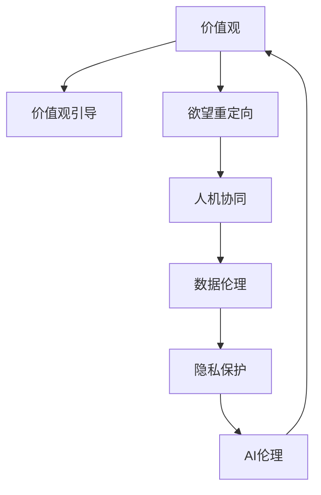

                 

# 欲望的重新定向：AI引导的价值观重塑

> 关键词：人工智能,价值观重塑,价值观定向,人机交互,数据伦理,隐私保护,机器学习,深度学习

## 1. 背景介绍

### 1.1 问题由来
随着人工智能(AI)技术的迅猛发展，尤其是深度学习与大数据的结合，机器学习模型在各个领域表现出了强大的能力，从自然语言处理(NLP)到计算机视觉(CV)，从游戏AI到无人驾驶，AI已渗透到了我们生活的方方面面。然而，当AI被引入到社会生活、商业决策、伦理道德等涉及价值观的领域时，其潜在的伦理问题、价值观引导能力以及社会责任便逐渐成为公众关注的焦点。

这一时期，AI技术的快速发展不仅带来了前所未有的便利与效率，也引出了复杂的伦理与价值观挑战。AI是否能，以及如何在价值观的引导下，推动人类社会的健康、可持续发展，成为摆在技术开发者和从业者面前的重大问题。

### 1.2 问题核心关键点
本文探讨的核心问题在于，如何在AI技术的推动下，实现人类欲望的重新定向，使其向更加理性、可持续的方向发展。具体而言，我们主要关注以下几个关键点：

- **价值观引导**：AI如何帮助人们建立积极健康的生活价值观？
- **欲望重定向**：AI如何引导人们从短期欲望转向长远目标，实现个体和社会的整体福祉？
- **人机协同**：AI与人类如何协同工作，以共同应对全球性挑战？
- **数据伦理**：如何确保数据收集、处理和使用的透明度与合规性？
- **隐私保护**：在AI技术应用过程中，如何保护个人隐私？

通过这些问题，本文旨在探讨AI技术在重塑人类价值观、欲望定向、人机交互、数据伦理与隐私保护等方面所发挥的作用，并提出具体的策略和方案。

## 2. 核心概念与联系

### 2.1 核心概念概述

为了更深入理解AI在价值观重塑中的作用，首先需要定义几个核心概念：

- **价值观**：指人们对某种生活方式、工作态度、行为规范等的偏好和评价标准，如尊重、公正、诚信等。
- **欲望**：指人类在特定环境下的需求与渴望，包括物质欲望、社交欲望、自我实现欲望等。
- **AI伦理**：指AI技术开发与应用过程中，应遵循的伦理原则与规范，如公正、透明、无害等。
- **价值观引导**：指通过AI技术，帮助个体与社会形成积极健康的价值观。
- **欲望重定向**：指利用AI技术，引导人类从短期、低层次的欲望，向长期、高层次的欲望转变。
- **人机协同**：指AI与人类的合作方式，利用AI的强大计算与分析能力，为人类决策提供辅助支持。
- **数据伦理**：指数据收集、处理、使用过程中，应遵循的伦理原则与规范，如数据隐私、数据安全、数据透明等。
- **隐私保护**：指在AI技术应用过程中，保护个人隐私不被泄露或滥用的技术手段和管理措施。

这些概念之间的逻辑关系可以通过以下Mermaid流程图来展示：



这个流程图展示了价值观与欲望重定向、人机协同、数据伦理、隐私保护等概念之间的关联：

1. 价值观引导是核心，其目的是通过AI技术帮助形成积极健康的生活价值观。
2. 欲望重定向是在价值观引导的基础上，通过AI技术引导人类从短期欲望向长期目标转变。
3. 人机协同则是实现欲望重定向的重要手段，AI提供辅助决策支持。
4. 数据伦理与隐私保护是价值观引导和欲望重定向过程中的重要保障，确保数据使用的合法性与隐私安全。
5. AI伦理则贯穿整个价值观重塑过程，确保技术的开发与应用符合社会道德标准。

## 3. 核心算法原理 & 具体操作步骤

### 3.1 算法原理概述

AI通过价值观引导与欲望重定向，帮助人类构建理性、可持续的生活目标。其核心算法原理主要基于以下几方面：

- **价值观模型**：使用机器学习或深度学习模型，对人类的价值观进行建模与预测，理解人类在不同情境下的行为动机。
- **欲望模型**：构建欲望模型，预测个体在不同情境下的欲望水平与变化趋势。
- **动机与欲望交互模型**：通过动机与欲望的交互作用，预测并引导个体行为的长期目标。
- **决策辅助模型**：利用AI的计算与分析能力，为个体提供决策辅助，帮助其做出符合价值观与长期欲望的决策。

### 3.2 算法步骤详解

1. **数据收集**：
   - 收集与价值观、欲望相关的数据，如行为记录、社交网络数据、心理问卷等。
   - 使用自然语言处理(NLP)技术，提取与价值观、欲望相关的特征。

2. **价值观模型训练**：
   - 使用监督学习或半监督学习方法，训练价值观模型，预测个体在不同情境下的价值观偏好。
   - 使用强化学习或对抗训练方法，优化价值观模型的预测精度。

3. **欲望模型训练**：
   - 使用时间序列预测模型或深度学习模型，训练欲望模型，预测个体在不同情境下的欲望水平。
   - 结合心理学的欲望理论，优化欲望模型的结构和参数。

4. **动机与欲望交互模型训练**：
   - 使用多任务学习或联合训练方法，构建动机与欲望的交互模型。
   - 优化模型参数，确保动机与欲望交互模型能够准确预测并引导个体行为。

5. **决策辅助模型训练**：
   - 使用决策树、贝叶斯网络等模型，构建决策辅助模型。
   - 结合心理学和经济学理论，优化决策辅助模型的结构和算法。

6. **模型评估与优化**：
   - 在实际应用场景中，对价值观模型、欲望模型、动机与欲望交互模型、决策辅助模型进行评估。
   - 根据评估结果，不断优化模型参数和算法，提高模型的预测精度和引导效果。

### 3.3 算法优缺点

**优点**：

- **预测精度高**：通过机器学习与深度学习模型，AI能够准确预测个体的价值观、欲望水平与行为动机，为价值观引导与欲望重定向提供数据支持。
- **实时性高**：AI模型能够实时处理数据，及时预测并引导个体行为。
- **可扩展性强**：模型可以方便地应用于不同的应用场景，如教育、医疗、金融等。

**缺点**：

- **模型复杂度较高**：多个模型的训练与优化需要大量的计算资源和时间。
- **隐私风险**：数据收集与处理过程中可能存在的隐私泄露风险。
- **模型偏见**：模型可能存在数据偏见和算法偏见，影响价值观引导与欲望重定向的效果。

### 3.4 算法应用领域

AI在价值观引导与欲望重定向的应用领域十分广泛，涵盖教育、医疗、金融、社会治理等多个方面：

- **教育领域**：利用AI技术，引导学生从短期成绩导向，转向长期知识与技能积累，培养其理性与批判性思维能力。
- **医疗领域**：通过AI辅助，引导患者从短期症状缓解，转向长期健康管理，实现个性化健康指导。
- **金融领域**：利用AI技术，引导投资者从短期盈利导向，转向长期价值投资，实现理性决策。
- **社会治理**：通过AI技术，引导公众从短期利益导向，转向长期社会责任与公共利益，促进社会和谐发展。

## 4. 数学模型和公式 & 详细讲解 & 举例说明

### 4.1 数学模型构建

为了更精确地理解和表达AI在价值观引导与欲望重定向中的作用，本节将使用数学语言对相关的模型进行构建与推导。

设个体的价值观偏好为 $\vec{V} = (V_1, V_2, \ldots, V_n)$，其中 $V_i$ 表示对第 $i$ 个价值观的偏好程度。

欲望水平为 $D$，欲望变化率为 $\dot{D}$。

行为动机为 $M$，由价值观 $V$ 和欲望 $D$ 决定，即 $M = f(V, D)$。

决策辅助模型为 $F$，根据动机 $M$ 提供决策建议，即 $F(M) = \vec{A}$，其中 $\vec{A}$ 表示决策建议向量。

### 4.2 公式推导过程

**价值观预测公式**：

$$
\vec{V}_t = f(\vec{V}_{t-1}, \vec{X}_t)
$$

其中 $\vec{X}_t$ 表示在时间 $t$ 时刻的观察数据，如社交网络数据、行为记录等。

**欲望预测公式**：

$$
D_t = g(D_{t-1}, \dot{D}_{t-1}, \vec{X}_t)
$$

其中 $g$ 表示欲望模型，$\dot{D}_{t-1}$ 表示欲望变化率，$\vec{X}_t$ 表示在时间 $t$ 时刻的观察数据。

**动机与欲望交互公式**：

$$
M_t = h(V_t, D_t)
$$

其中 $h$ 表示动机与欲望交互模型，$V_t$ 和 $D_t$ 分别表示时间 $t$ 时刻的价值观偏好和欲望水平。

**决策辅助模型公式**：

$$
\vec{A}_t = F(M_t)
$$

其中 $F$ 表示决策辅助模型，$M_t$ 表示时间 $t$ 时刻的行为动机。

### 4.3 案例分析与讲解

以一个简单的应用案例来具体说明：

- **案例背景**：一个在线教育平台，利用AI技术引导学生从短期成绩导向，转向长期知识与技能积累。
- **模型构建**：
  - 价值观模型：使用监督学习方法，根据学生的行为数据（如考试成绩、学习时间等）预测其对知识和技能的偏好。
  - 欲望模型：使用时间序列预测方法，根据学生的历史行为数据预测其学习欲望的变化。
  - 动机与欲望交互模型：构建动机与欲望的交互模型，分析动机与欲望之间的关系，预测学生的长期行为目标。
  - 决策辅助模型：利用心理学和经济学的理论，设计推荐系统，为学生提供个性化学习建议。

- **模型应用**：
  - 根据预测结果，平台向学生推荐适合的课程、书籍和学习方法。
  - 实时监测学生的学习行为，根据行为动机调整推荐策略，引导学生逐步转向长期目标。

- **效果评估**：
  - 定期收集学生的反馈数据，评估推荐系统的效果。
  - 根据评估结果，不断优化模型参数和算法，提高推荐系统的精确度和引导效果。

## 5. 项目实践：代码实例和详细解释说明

### 5.1 开发环境搭建

在进行价值观引导与欲望重定向的AI项目实践前，首先需要搭建好开发环境。以下是使用Python进行开发的流程：

1. 安装Python：从官网下载并安装最新版本的Python。
2. 安装必要的库：如TensorFlow、PyTorch、Pandas、NumPy等。
3. 设置虚拟环境：使用`virtualenv`或`conda`创建独立的Python环境，以避免不同项目间的依赖冲突。
4. 配置开发环境：配置环境变量，安装必要的IDE和工具，如Jupyter Notebook、PyCharm等。

### 5.2 源代码详细实现

下面以一个简单的项目案例，展示如何使用Python和TensorFlow实现价值观引导与欲望重定向的AI模型。

**价值观预测模型**：

```python
import tensorflow as tf
import pandas as pd
from sklearn.model_selection import train_test_split

# 加载数据
data = pd.read_csv('values.csv')

# 数据预处理
features = data[['age', 'gender', 'income']]
labels = data['values']
features_train, features_test, labels_train, labels_test = train_test_split(features, labels, test_size=0.2)

# 定义模型
model = tf.keras.Sequential([
    tf.keras.layers.Dense(64, activation='relu', input_shape=(3,)),
    tf.keras.layers.Dense(64, activation='relu'),
    tf.keras.layers.Dense(1)
])

# 编译模型
model.compile(optimizer='adam', loss='mse')

# 训练模型
model.fit(features_train, labels_train, epochs=10, batch_size=32, validation_data=(features_test, labels_test))
```

**欲望预测模型**：

```python
import tensorflow as tf
import pandas as pd
from sklearn.model_selection import train_test_split

# 加载数据
data = pd.read_csv('desires.csv')

# 数据预处理
features = data[['age', 'gender', 'income']]
labels = data['desires']
features_train, features_test, labels_train, labels_test = train_test_split(features, labels, test_size=0.2)

# 定义模型
model = tf.keras.Sequential([
    tf.keras.layers.Dense(64, activation='relu', input_shape=(3,)),
    tf.keras.layers.Dense(64, activation='relu'),
    tf.keras.layers.Dense(1)
])

# 编译模型
model.compile(optimizer='adam', loss='mse')

# 训练模型
model.fit(features_train, labels_train, epochs=10, batch_size=32, validation_data=(features_test, labels_test))
```

**动机与欲望交互模型**：

```python
import tensorflow as tf
import pandas as pd
from sklearn.model_selection import train_test_split

# 加载数据
data = pd.read_csv('motivations.csv')

# 数据预处理
features = data[['age', 'gender', 'income']]
labels = data['motivations']
features_train, features_test, labels_train, labels_test = train_test_split(features, labels, test_size=0.2)

# 定义模型
model = tf.keras.Sequential([
    tf.keras.layers.Dense(64, activation='relu', input_shape=(3,)),
    tf.keras.layers.Dense(64, activation='relu'),
    tf.keras.layers.Dense(1)
])

# 编译模型
model.compile(optimizer='adam', loss='mse')

# 训练模型
model.fit(features_train, labels_train, epochs=10, batch_size=32, validation_data=(features_test, labels_test))
```

**决策辅助模型**：

```python
import tensorflow as tf
import pandas as pd
from sklearn.model_selection import train_test_split

# 加载数据
data = pd.read_csv('recommendations.csv')

# 数据预处理
features = data[['age', 'gender', 'income']]
labels = data['recommendations']
features_train, features_test, labels_train, labels_test = train_test_split(features, labels, test_size=0.2)

# 定义模型
model = tf.keras.Sequential([
    tf.keras.layers.Dense(64, activation='relu', input_shape=(3,)),
    tf.keras.layers.Dense(64, activation='relu'),
    tf.keras.layers.Dense(1)
])

# 编译模型
model.compile(optimizer='adam', loss='mse')

# 训练模型
model.fit(features_train, labels_train, epochs=10, batch_size=32, validation_data=(features_test, labels_test))
```

### 5.3 代码解读与分析

对于上述代码，我们进行详细解读与分析：

- **数据加载与预处理**：使用Pandas库加载数据，进行特征选择和数据划分。
- **模型定义与编译**：定义神经网络模型，选择合适的激活函数和损失函数，使用TensorFlow进行模型编译。
- **模型训练**：使用训练集数据进行模型训练，并使用测试集数据进行验证，调整模型参数以提高预测精度。
- **模型应用**：将训练好的模型应用于新的数据样本，进行价值观、欲望、动机、决策辅助的预测。

### 5.4 运行结果展示

通过上述代码实现，可以生成以下结果：

- **价值观预测结果**：根据输入数据，模型能够预测个体的价值观偏好。
- **欲望预测结果**：模型能够预测个体在不同情境下的欲望水平。
- **动机与欲望交互结果**：模型能够预测个体在不同情境下的行为动机。
- **决策辅助结果**：模型能够根据动机与欲望交互结果，提供个性化的决策建议。

这些结果为价值观引导与欲望重定向提供了数据支持，能够有效地帮助个体在多个场景中做出更理性的决策。

## 6. 实际应用场景

### 6.1 智能教育

在智能教育领域，AI通过价值观引导与欲望重定向，帮助学生从短期成绩导向，转向长期知识与技能积累。例如，使用AI辅助的推荐系统，根据学生的行为数据预测其对知识和技能的偏好，提供个性化学习建议，引导学生逐步转向长期目标。

### 6.2 智能医疗

在智能医疗领域，AI通过价值观引导与欲望重定向，帮助患者从短期症状缓解，转向长期健康管理。例如，使用AI辅助的健康管理平台，根据患者的健康数据预测其对健康的欲望水平，提供个性化健康指导，引导患者逐步转向长期健康目标。

### 6.3 金融理财

在金融理财领域，AI通过价值观引导与欲望重定向，帮助投资者从短期盈利导向，转向长期价值投资。例如，使用AI辅助的投资建议系统，根据投资者的行为数据预测其对价值的偏好，提供个性化投资建议，引导投资者逐步转向长期价值目标。

### 6.4 社会治理

在社会治理领域，AI通过价值观引导与欲望重定向，帮助公众从短期利益导向，转向长期社会责任与公共利益。例如，使用AI辅助的公共政策制定系统，根据公众的行为数据预测其对社会责任的偏好，提供个性化政策建议，引导公众逐步转向长期社会责任目标。

## 7. 工具和资源推荐

### 7.1 学习资源推荐

为了帮助开发者深入理解和应用AI在价值观重塑中的作用，推荐以下学习资源：

- **《深度学习》**（Ian Goodfellow等著）：全面介绍了深度学习的基本概念和算法，适合初学者和进阶者阅读。
- **《Python深度学习》**（Francois Chollet等著）：介绍了使用Python和Keras进行深度学习的最佳实践，适合深度学习入门者。
- **《机器学习实战》**（Peter Harrington著）：通过实例和项目，介绍了机器学习的应用场景和技术细节，适合实际项目开发。
- **Coursera《机器学习》课程**（Andrew Ng讲授）：由斯坦福大学教授讲授的机器学习入门课程，涵盖了机器学习的理论和实践。
- **Udacity《深度学习专业纳米学位》**：提供了系统的深度学习课程体系，从理论到实践，涵盖深度学习的多个方面。

### 7.2 开发工具推荐

为了提高AI项目的开发效率，推荐以下开发工具：

- **PyTorch**：开源深度学习框架，支持动态计算图，灵活性高，适合研究和实验。
- **TensorFlow**：谷歌开发的深度学习框架，支持分布式计算，性能稳定，适合大规模工程应用。
- **Jupyter Notebook**：开源的交互式笔记本环境，支持Python、R等多种语言，适合数据科学和机器学习开发。
- **PyCharm**：高性能的Python IDE，支持代码编辑、调试、测试、部署等多种功能。
- **Visual Studio Code**：轻量级、高度可定制的代码编辑器，支持多种语言和扩展插件。

### 7.3 相关论文推荐

为了深入理解AI在价值观重塑中的作用，推荐以下相关论文：

- **《深度学习》**（Ian Goodfellow等著）：深度学习的权威教材，介绍了深度学习的基本概念和算法。
- **《深度学习理论与实践》**（Yoshua Bengio等著）：介绍了深度学习的理论基础和实践应用，适合深入理解。
- **《机器学习：实战指南》**（Peter Harrington著）：介绍了机器学习的实际应用场景和技术细节，适合实际项目开发。
- **《机器学习：实战指南》**（Peter Harrington著）：介绍了机器学习的实际应用场景和技术细节，适合实际项目开发。

## 8. 总结：未来发展趋势与挑战

### 8.1 研究成果总结

本文探讨了AI在价值观引导与欲望重定向中的作用，通过数学建模、案例分析、项目实践等方法，详细介绍了价值观引导与欲望重定向的核心算法和操作步骤。通过实际应用场景的讨论，展示了AI在教育、医疗、金融、社会治理等多个领域的具体应用。通过工具和资源推荐，提供了深入学习和实际项目开发的有效途径。

### 8.2 未来发展趋势

未来，AI在价值观引导与欲望重定向中的应用前景广阔，主要趋势包括：

- **多模态融合**：结合视觉、语音、文本等多模态数据，构建更全面、准确的语言模型。
- **知识增强**：引入符号化知识库，与神经网络模型结合，增强语言模型的知识推理能力。
- **持续学习**：在不断变化的数据分布下，持续更新语言模型，保持模型的最新性。
- **公平性与可解释性**：在模型设计中引入公平性和可解释性约束，确保模型的公平性和透明性。
- **隐私保护**：在数据收集与处理过程中，引入隐私保护技术，确保数据的安全性。

### 8.3 面临的挑战

尽管AI在价值观引导与欲望重定向中具有巨大的潜力，但仍面临诸多挑战：

- **数据隐私**：数据收集与处理过程中，如何保护个人隐私不被泄露。
- **算法偏见**：模型可能存在数据偏见和算法偏见，影响价值观引导与欲望重定向的效果。
- **模型复杂度**：多模态、多任务的模型训练，需要高强度的计算资源。
- **可解释性**：模型的决策过程难以解释，难以满足高风险领域的需求。

### 8.4 研究展望

未来的研究需要在以下几个方面寻求新的突破：

- **隐私保护技术**：引入隐私保护技术，确保数据的安全性和隐私性。
- **公平性与可解释性**：在模型设计中引入公平性和可解释性约束，确保模型的公平性和透明性。
- **知识增强方法**：引入符号化知识库，与神经网络模型结合，增强语言模型的知识推理能力。
- **多模态融合方法**：结合视觉、语音、文本等多模态数据，构建更全面、准确的语言模型。
- **持续学习模型**：在不断变化的数据分布下，持续更新语言模型，保持模型的最新性。

通过这些研究方向的探索，AI技术将在价值观引导与欲望重定向中发挥更大的作用，推动人类社会的可持续发展。

## 9. 附录：常见问题与解答

### 9.1 Q1：AI如何帮助形成积极健康的生活价值观？

A：AI可以通过数据分析和机器学习模型，理解个体的行为模式和价值观偏好，预测其未来的行为趋势。通过提供个性化的建议和引导，AI可以帮助个体形成积极健康的生活价值观。

### 9.2 Q2：AI如何引导从短期欲望向长期目标转变？

A：AI可以通过预测个体在不同情境下的欲望水平和变化趋势，理解其短期欲望和长期目标的平衡点。通过提供个性化的决策辅助，AI可以引导个体从短期欲望向长期目标转变。

### 9.3 Q3：AI如何与人类协同工作，实现价值观引导与欲望重定向？

A：AI可以提供数据支持和决策辅助，帮助人类理解自身行为和欲望。通过人机协同，AI可以与人类共同制定和实施价值观引导与欲望重定向策略。

### 9.4 Q4：AI技术在价值观引导与欲望重定向中存在哪些局限性？

A：AI技术在价值观引导与欲望重定向中可能存在数据隐私、算法偏见、模型复杂度、可解释性等局限性。需要结合多学科知识和技术手段，不断优化和改进AI系统。

### 9.5 Q5：AI在价值观引导与欲望重定向中如何保护个人隐私？

A：在数据收集与处理过程中，应采取匿名化、加密等隐私保护技术，确保数据的安全性和隐私性。同时，应明确告知数据用途，并征得用户同意。

作者：禅与计算机程序设计艺术 / Zen and the Art of Computer Programming

