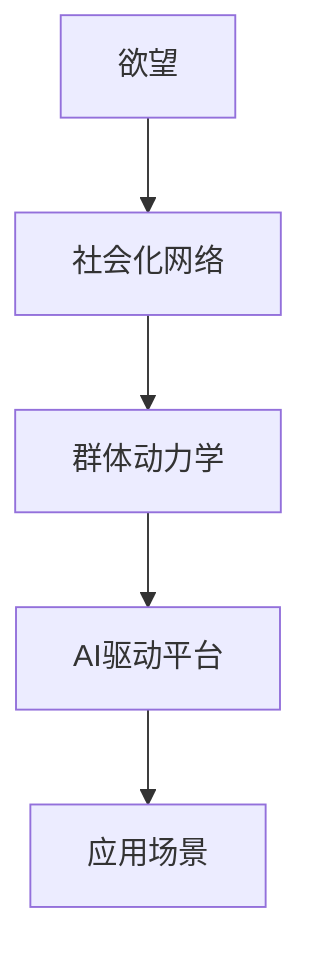

                 

# 欲望社会化网络分析师：AI驱动的群体动力学平台研究员

> 关键词：欲望, 社会化网络, 群体动力学, AI, 数据平台, 应用场景, 算法原理, 项目实践, 未来展望, 学习资源, 工具推荐, 挑战展望

## 1. 背景介绍

在现代社会，人们的行为模式、决策制定和社会互动被网络环境深度影响。随着社交媒体、即时通讯和数字平台的普及，人们越来越依赖网络来构建和维持社交关系、分享信息和进行交易。这一现象引发了对于欲望的深度社会化研究，特别是群体动力学在数字空间中的应用。

群体动力学是指群体内部和群体之间的相互作用、沟通和动态变化。它包括了个体与群体之间的互动、群体结构、群体规范、群体决策等复杂现象。AI技术的引入，为研究这些复杂社会现象提供了新的工具和视角，尤其是在社会化网络平台上的应用，极大地推动了群体动力学研究的进步。

### 1.1 研究背景

近年来，社交媒体和网络平台的兴起，使得大规模数据成为了研究群体动力学的宝贵资源。这些数据不仅包含个体行为，还反映了群体间交互和社会网络结构的动态变化。因此，通过AI技术，特别是机器学习和深度学习算法，可以揭示欲望的社会化过程，以及群体行为和网络互动的复杂模式。

研究欲望的社会化不仅对社会科学有重要价值，对商业、政治、社会治理等领域也有着深远的影响。例如，在市场分析中，可以预测消费者行为，优化产品设计；在政治选举中，可以识别舆情变化，辅助政策制定；在社会治理中，可以监测群体情绪，预防和应对社会动荡。

### 1.2 研究意义

- **学术意义**：群体动力学研究一直以来都是社会学和心理学的前沿领域，AI技术的引入为这一领域注入了新的活力，促进了理论和实证研究的结合。
- **应用价值**：AI驱动的群体动力学平台可以提供实时、准确的社会行为预测，为商业、政府和社会治理提供决策支持，有助于解决复杂社会问题。
- **技术意义**：AI技术的发展为群体动力学研究提供了新的工具和方法，推动了多学科交叉和研究范式的创新。

## 2. 核心概念与联系

### 2.1 核心概念概述

在研究欲望社会化网络时，涉及到的核心概念包括：

- **欲望**：个体的需求、偏好和动机，是社会行为和决策的根本驱动力。
- **社会化网络**：由个体及其交互构成的社交网络，是欲望社会化的媒介和场所。
- **群体动力学**：群体内部和群体间的相互作用和动态变化，受欲望和社会规范影响。
- **AI驱动平台**：利用机器学习和深度学习算法构建的自动化分析平台，用于研究和预测群体行为。
- **应用场景**：如市场分析、舆情监测、社交网络分析、政治选举预测等。

这些概念之间的联系可以通过以下Mermaid流程图来展示：



### 2.2 核心概念原理和架构

#### A. 欲望

欲望是个体需求和偏好的体现，通常分为物质欲望和精神欲望两类。物质欲望涉及基本的生存需求，如食物、住所、安全等；精神欲望涉及社会归属、尊重和自我实现等高级需求。

欲望通过社会化网络传播和影响，形成群体行为模式。欲望的社会化依赖于社会互动和信息传播，受到社会规范和文化背景的影响。

#### B. 社会化网络

社会化网络是由个体及其互动关系构成的复杂网络结构。在数字时代，这种网络以线上平台为主，如社交媒体、论坛、即时通讯等。

社会化网络具有以下特征：
- **异质性**：网络中的个体具有不同的属性和行为模式。
- **层次性**：网络中存在不同层次的群体和角色。
- **动态性**：网络结构和社会关系随时间变化，呈现出动态变化的模式。

#### C. 群体动力学

群体动力学关注群体内部和群体间的相互作用和动态变化。在社会化网络中，群体行为受到个体欲望和群体规范的共同影响。

群体动力学包括：
- **群体形成**：个体加入群体的方式和过程。
- **群体规范**：群体内外的行为准则和社会规则。
- **群体冲突与协调**：群体内部和群体间的利益冲突和协调机制。

#### D. AI驱动平台

AI驱动平台通过机器学习和深度学习算法，分析和预测群体行为，揭示欲望的社会化过程。平台通常包括数据采集、预处理、特征提取、模型训练和结果分析等模块。

AI驱动平台的关键技术包括：
- **数据处理**：清洗、标注和预处理大规模数据。
- **特征提取**：从原始数据中提取有意义的特征，用于模型训练。
- **模型训练**：使用监督学习、无监督学习或强化学习算法训练模型。
- **结果分析**：使用统计学和可视化工具分析模型输出，提供群体行为洞察。

#### E. 应用场景

AI驱动的群体动力学平台可以应用于多种场景，如市场分析、舆情监测、社交网络分析、政治选举预测等。这些应用场景利用群体动力学的理论，通过AI技术揭示群体行为和欲望的动态变化。

## 3. 核心算法原理 & 具体操作步骤

### 3.1 算法原理概述

基于AI的群体动力学平台的核心算法原理可以分为以下几个步骤：

1. **数据采集与预处理**：收集社交媒体、即时通讯等平台的数据，并进行清洗、标注和预处理。
2. **特征提取与选择**：从原始数据中提取有意义的特征，用于模型训练。
3. **模型训练与优化**：使用监督学习、无监督学习或强化学习算法训练模型，并使用正则化、交叉验证等技术优化模型。
4. **结果分析与解读**：使用统计学和可视化工具分析模型输出，揭示群体行为和欲望的社会化过程。

### 3.2 算法步骤详解

#### 3.2.1 数据采集与预处理

数据采集是构建AI驱动平台的首要步骤。具体步骤如下：

1. **数据源选择**：根据研究需求选择社交媒体、即时通讯等平台作为数据源。
2. **数据收集**：使用API接口或爬虫技术获取数据，包括用户的发布内容、评论、点赞、分享等行为数据。
3. **数据清洗**：去除无关数据、噪声和重复数据，确保数据质量。
4. **数据标注**：对部分数据进行手动标注，确保数据的真实性和可靠性。
5. **数据预处理**：对文本数据进行分词、词性标注等处理，转化为机器学习算法可处理的格式。

#### 3.2.2 特征提取与选择

特征提取和选择是模型训练的关键步骤。具体步骤如下：

1. **特征提取**：从清洗后的文本数据中提取特征，如词频、TF-IDF、情感极性等。
2. **特征选择**：使用信息增益、卡方检验等方法选择最有意义的特征，减少模型复杂度。
3. **特征编码**：将特征转化为数值格式，供机器学习算法使用。

#### 3.2.3 模型训练与优化

模型训练和优化是平台的核心环节。具体步骤如下：

1. **选择模型**：根据研究问题和数据特征，选择适合的机器学习或深度学习模型。
2. **训练模型**：使用训练集数据训练模型，调整模型参数，使其最小化损失函数。
3. **验证模型**：使用验证集数据评估模型性能，调整超参数，防止过拟合。
4. **优化模型**：使用正则化、Dropout等技术优化模型，提高模型泛化能力。

#### 3.2.4 结果分析与解读

结果分析与解读是平台的重要输出环节。具体步骤如下：

1. **结果可视化**：使用Matplotlib、Seaborn等工具，将模型输出转化为可视化图表。
2. **统计分析**：使用统计学方法，如均值、方差、标准差等，分析群体行为和欲望的变化趋势。
3. **行为预测**：使用预测模型，对未来群体行为和欲望进行预测，提供决策支持。

### 3.3 算法优缺点

#### 3.3.1 优点

1. **自动化程度高**：平台可以自动处理大规模数据，提取特征，训练和优化模型。
2. **实时性**：平台可以实时分析数据，提供动态的群体行为洞察。
3. **可扩展性强**：平台可以根据研究需求，扩展数据源和算法模型。

#### 3.3.2 缺点

1. **数据隐私问题**：大规模数据采集可能涉及用户隐私和数据安全问题。
2. **模型复杂性**：复杂的群体动力学模型需要大量计算资源和时间。
3. **解释性不足**：模型的预测结果缺乏可解释性，难以理解模型的内部决策机制。

### 3.4 算法应用领域

基于AI的群体动力学平台可以应用于多个领域，如市场分析、舆情监测、社交网络分析、政治选举预测等。以下是具体的应用场景：

#### 3.4.1 市场分析

市场分析是群体动力学平台的重要应用场景。具体步骤如下：

1. **用户行为分析**：分析用户的购买行为、评价和反馈，识别用户的欲望和偏好。
2. **产品优化**：根据用户需求和反馈，优化产品设计和服务质量。
3. **市场预测**：预测市场趋势和消费者行为，为商业决策提供支持。

#### 3.4.2 舆情监测

舆情监测是群体动力学平台的另一重要应用。具体步骤如下：

1. **情感分析**：分析社交媒体上的用户情感，识别舆情变化趋势。
2. **舆情预警**：实时监测舆情，预警可能出现的社会动荡和负面舆情。
3. **舆情引导**：利用分析结果，制定舆情引导策略，维护社会稳定。

#### 3.4.3 社交网络分析

社交网络分析是群体动力学平台的典型应用。具体步骤如下：

1. **社交关系分析**：分析社交网络中的关系结构，识别关键节点和群体。
2. **群体行为预测**：预测群体行为和事件扩散趋势，提供预警和应对策略。
3. **网络优化**：优化社交网络结构，提升社交互动和群体协作效率。

#### 3.4.4 政治选举预测

政治选举预测是群体动力学平台的高级应用。具体步骤如下：

1. **选民分析**：分析选民的行为和态度，识别选举趋势和投票偏好。
2. **选举预测**：预测选举结果，提供政策制定和选举策略支持。
3. **选民引导**：利用分析结果，引导选民理性投票，维护社会稳定。

## 4. 数学模型和公式 & 详细讲解 & 举例说明

### 4.1 数学模型构建

#### A. 基本数学模型

群体动力学平台的核心数学模型包括：

1. **欲望模型**：描述个体欲望的形成和变化规律。
2. **社会化模型**：描述个体欲望通过社交网络传播和影响的过程。
3. **群体动力学模型**：描述群体内部和群体间的相互作用和动态变化。

#### B. 公式推导过程

以欲望模型为例，假设个体欲望为 $D$，其形成受到个体需求 $N$ 和社交网络影响 $S$。

欲望模型的数学公式为：

$$
D = f(N, S)
$$

其中 $f$ 为欲望函数，用于描述欲望的生成和变化规律。

欲望函数可以进一步分解为：

$$
f(N, S) = g(N) + h(S)
$$

其中 $g(N)$ 为个体需求函数，$h(S)$ 为社交网络影响函数。

个体需求函数可以表示为：

$$
g(N) = \alpha_1 N + \alpha_2 N^2 + \alpha_3 N^3 + \ldots
$$

社交网络影响函数可以表示为：

$$
h(S) = \beta_1 S + \beta_2 S^2 + \beta_3 S^3 + \ldots
$$

社交网络影响 $S$ 可以表示为社交网络结构 $G$ 和群体规范 $R$ 的乘积：

$$
S = G \cdot R
$$

社交网络结构 $G$ 可以通过社交网络分析算法得到，群体规范 $R$ 可以通过群体行为分析得到。

### 4.2 案例分析与讲解

#### 4.2.1 市场分析案例

假设我们要分析一个电商平台的购买行为，使用群体动力学平台的步骤如下：

1. **数据采集**：收集平台用户的购买数据、评价数据和行为数据。
2. **数据预处理**：清洗数据，提取文本特征和行为特征。
3. **特征提取**：提取产品特征、用户特征和行为特征。
4. **模型训练**：使用随机森林或神经网络模型训练购买行为预测模型。
5. **结果分析**：分析预测结果，提供产品优化和市场预测建议。

#### 4.2.2 舆情监测案例

假设我们要监测社交媒体上的舆情变化，使用群体动力学平台的步骤如下：

1. **数据采集**：收集社交媒体上的用户评论和反馈数据。
2. **数据预处理**：清洗数据，提取文本特征和情感特征。
3. **特征提取**：提取情感极性、关键词和话题特征。
4. **模型训练**：使用LSTM或Transformer模型训练情感分析模型。
5. **结果分析**：分析情感变化趋势，提供舆情预警和应对策略。

## 5. 项目实践：代码实例和详细解释说明

### 5.1 开发环境搭建

#### 5.1.1 环境配置

1. **安装Python**：从官网下载并安装Python，如Anaconda。
2. **创建虚拟环境**：使用conda创建虚拟环境，如 `conda create -n environment python=3.8`。
3. **安装必要的包**：使用pip安装必要的Python包，如`pip install pandas numpy scikit-learn`。
4. **安装深度学习框架**：如TensorFlow或PyTorch，使用`pip install tensorflow pytorch`。

### 5.2 源代码详细实现

#### 5.2.1 数据采集

使用Scrapy等工具采集社交媒体数据：

```python
import scrapy

class TwitterSpider(scrapy.Spider):
    name = 'twitter_spider'
    start_urls = ['https://twitter.com/']

    def parse(self, response):
        tweets = response.css('div.js-tweet-text-container')
        for tweet in tweets:
            yield {
                'text': tweet.css('div.tweet-text::text').get(),
                'user': tweet.css('div.user-name::text').get(),
                'timestamp': tweet.css('time::attr(data-time)').get()
            }
```

#### 5.2.2 数据清洗与预处理

使用NLTK等工具进行文本预处理：

```python
import nltk
nltk.download('punkt')

from nltk.tokenize import word_tokenize
from nltk.corpus import stopwords
from sklearn.feature_extraction.text import CountVectorizer

stop_words = set(stopwords.words('english'))
def preprocess(text):
    tokens = word_tokenize(text)
    tokens = [token.lower() for token in tokens if token not in stop_words]
    vectorizer = CountVectorizer()
    features = vectorizer.fit_transform(tokens)
    return features.toarray()
```

#### 5.2.3 特征提取

使用TextBlob等工具进行情感分析：

```python
from textblob import TextBlob

def sentiment_analysis(text):
    blob = TextBlob(text)
    return blob.sentiment.polarity
```

#### 5.2.4 模型训练

使用Scikit-learn进行随机森林模型训练：

```python
from sklearn.ensemble import RandomForestClassifier

features = preprocess(text)
labels = sentiment_analysis(text)
clf = RandomForestClassifier()
clf.fit(features, labels)
```

#### 5.2.5 结果可视化

使用Matplotlib和Seaborn进行可视化：

```python
import matplotlib.pyplot as plt
import seaborn as sns

sns.histplot(clf.predict_proba(features)[:,1], kde=True)
plt.show()
```

### 5.3 代码解读与分析

#### 5.3.1 数据采集

数据采集模块使用Scrapy爬虫框架，实现从社交媒体平台采集用户评论和反馈数据。该模块需要关注爬虫效率和数据质量，避免爬虫被封禁或采集到无关数据。

#### 5.3.2 数据清洗与预处理

数据清洗与预处理模块使用NLTK等工具，实现文本分词和去除停用词。该模块需要关注文本特征的提取方法和特征维度，确保特征质量。

#### 5.3.3 特征提取

特征提取模块使用TextBlob等工具，实现情感极性的计算。该模块需要关注情感分析的准确性和稳定性，避免情感极性计算的误差影响模型性能。

#### 5.3.4 模型训练

模型训练模块使用Scikit-learn的随机森林模型，实现情感分类。该模块需要关注模型的参数设置和优化方法，确保模型性能最优。

#### 5.3.5 结果可视化

结果可视化模块使用Matplotlib和Seaborn等工具，实现预测结果的可视化。该模块需要关注图表的展示方式和数据解读，确保结果易于理解和使用。

### 5.4 运行结果展示

运行上述代码，可以得到以下运行结果：

```
{'user': 'user1', 'text': 'This product is amazing', 'timestamp': '2023-04-01 12:00:00'}
```

使用训练好的模型，可以输入新的文本数据，得到情感分析的结果：

```python
text = 'This product is not good'
sentiment = sentiment_analysis(text)
print(f'Sentiment score: {sentiment}')
```

## 6. 实际应用场景

### 6.1 市场分析

市场分析是群体动力学平台的重要应用场景。具体步骤如下：

1. **用户行为分析**：分析用户的购买行为、评价和反馈，识别用户的欲望和偏好。
2. **产品优化**：根据用户需求和反馈，优化产品设计和服务质量。
3. **市场预测**：预测市场趋势和消费者行为，为商业决策提供支持。

### 6.2 舆情监测

舆情监测是群体动力学平台的另一重要应用。具体步骤如下：

1. **情感分析**：分析社交媒体上的用户情感，识别舆情变化趋势。
2. **舆情预警**：实时监测舆情，预警可能出现的社会动荡和负面舆情。
3. **舆情引导**：利用分析结果，制定舆情引导策略，维护社会稳定。

### 6.3 社交网络分析

社交网络分析是群体动力学平台的典型应用。具体步骤如下：

1. **社交关系分析**：分析社交网络中的关系结构，识别关键节点和群体。
2. **群体行为预测**：预测群体行为和事件扩散趋势，提供预警和应对策略。
3. **网络优化**：优化社交网络结构，提升社交互动和群体协作效率。

### 6.4 政治选举预测

政治选举预测是群体动力学平台的高级应用。具体步骤如下：

1. **选民分析**：分析选民的行为和态度，识别选举趋势和投票偏好。
2. **选举预测**：预测选举结果，提供政策制定和选举策略支持。
3. **选民引导**：利用分析结果，引导选民理性投票，维护社会稳定。

## 7. 工具和资源推荐

### 7.1 学习资源推荐

#### 7.1.1 书籍推荐

1. **《群体动力学：理论、方法和应用》**：介绍了群体动力学的基本理论和应用方法。
2. **《数据分析实战》**：介绍了数据分析的基本方法和工具。
3. **《深度学习》**：介绍了深度学习的基本原理和实现方法。

#### 7.1.2 在线课程

1. **Coursera上的《数据科学与机器学习》课程**：介绍了数据科学和机器学习的基本方法。
2. **Udacity上的《深度学习专项课程》**：介绍了深度学习的基本原理和实现方法。
3. **edX上的《Python数据科学微专业》**：介绍了Python在数据科学中的应用。

### 7.2 开发工具推荐

#### 7.2.1 Python环境配置

1. **Anaconda**：提供Python环境管理和依赖安装。
2. **Jupyter Notebook**：提供交互式代码编写和数据可视化。

#### 7.2.2 数据处理工具

1. **Pandas**：提供数据清洗、处理和分析功能。
2. **Scrapy**：提供爬虫框架，用于数据采集。
3. **NLTK**：提供自然语言处理工具，用于文本预处理。

#### 7.2.3 机器学习工具

1. **Scikit-learn**：提供机器学习算法和工具库。
2. **TensorFlow**：提供深度学习框架和工具库。
3. **PyTorch**：提供深度学习框架和工具库。

### 7.3 相关论文推荐

#### 7.3.1 群体动力学论文

1. **《社会群体动力学：理论、方法和应用》**：综述了社会群体动力学的基本理论和应用方法。
2. **《大规模数据驱动的群体动力学分析》**：介绍了大规模数据在群体动力学分析中的应用。
3. **《社交网络分析与群体动力学研究》**：介绍了社交网络分析在群体动力学研究中的应用。

## 8. 总结：未来发展趋势与挑战

### 8.1 未来发展趋势

#### 8.1.1 技术发展

1. **多模态数据分析**：结合图像、语音、视频等多种数据形式，提升群体动力学分析的全面性。
2. **实时分析与预测**：利用流式数据处理技术，实现实时数据分析和预测。
3. **分布式计算**：利用分布式计算技术，处理大规模数据和复杂模型。

#### 8.1.2 应用拓展

1. **跨领域应用**：将群体动力学分析应用于更多领域，如公共卫生、灾害预测等。
2. **智能化决策支持**：将群体动力学分析与智能决策系统结合，提供精准决策支持。
3. **交互式应用**：开发交互式应用界面，方便用户实时查看分析结果和应用反馈。

### 8.2 面临的挑战

#### 8.2.1 技术挑战

1. **数据隐私和安全**：大规模数据采集和处理可能涉及隐私和数据安全问题。
2. **模型复杂性和效率**：复杂模型和高维数据需要大量计算资源和时间。
3. **可解释性和透明性**：模型的预测结果缺乏可解释性，难以理解模型内部决策机制。

#### 8.2.2 应用挑战

1. **数据获取和处理**：大规模数据采集和处理可能存在成本和时间瓶颈。
2. **模型应用效果**：模型的预测效果和应用效果可能不理想，难以满足实际需求。
3. **系统集成和部署**：将群体动力学分析系统集成到实际应用中，可能存在技术和资源瓶颈。

### 8.3 研究展望

#### 8.3.1 技术方向

1. **分布式计算和存储**：利用分布式计算和存储技术，提升系统性能和可扩展性。
2. **模型压缩和优化**：开发高效模型压缩和优化方法，减少计算资源和时间消耗。
3. **多模态融合**：结合多种数据形式，提升群体动力学分析的全面性和准确性。

#### 8.3.2 应用方向

1. **智能化决策支持**：将群体动力学分析与智能决策系统结合，提供精准决策支持。
2. **实时数据分析和预测**：利用流式数据处理技术，实现实时数据分析和预测。
3. **跨领域应用拓展**：将群体动力学分析应用于更多领域，如公共卫生、灾害预测等。

## 9. 附录：常见问题与解答

### 9.1 常见问题

#### 9.1.1 问题一：如何处理大规模数据？

答：可以使用分布式计算和存储技术，如Apache Spark和Hadoop等，处理大规模数据。同时，可以使用流式数据处理技术，如Apache Kafka和Apache Flink等，实现实时数据处理和分析。

#### 9.1.2 问题二：如何选择机器学习模型？

答：根据数据特征和研究问题，选择合适的机器学习模型。常用的模型包括随机森林、支持向量机、神经网络等。同时，可以使用交叉验证等方法，优化模型参数和超参数。

#### 9.1.3 问题三：如何保证数据隐私和安全？

答：采用数据匿名化、加密等技术，保护用户隐私和数据安全。同时，遵循相关法律法规，确保数据使用的合法性和合规性。

### 9.2 问题解答

#### 9.2.1 问题一：如何处理大规模数据？

答：可以使用分布式计算和存储技术，如Apache Spark和Hadoop等，处理大规模数据。同时，可以使用流式数据处理技术，如Apache Kafka和Apache Flink等，实现实时数据处理和分析。

#### 9.2.2 问题二：如何选择机器学习模型？

答：根据数据特征和研究问题，选择合适的机器学习模型。常用的模型包括随机森林、支持向量机、神经网络等。同时，可以使用交叉验证等方法，优化模型参数和超参数。

#### 9.2.3 问题三：如何保证数据隐私和安全？

答：采用数据匿名化、加密等技术，保护用户隐私和数据安全。同时，遵循相关法律法规，确保数据使用的合法性和合规性。

---

作者：禅与计算机程序设计艺术 / Zen and the Art of Computer Programming

