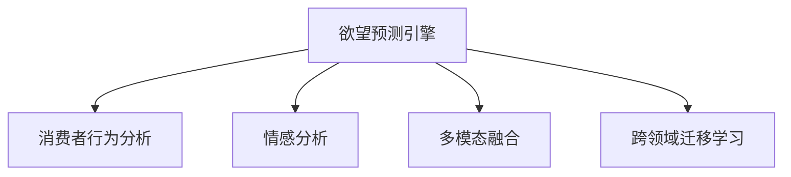

                 

# 欲望预测引擎：AI解码的人类需求未来

## 1. 背景介绍

### 1.1 问题由来
在数字化时代，数据无处不在。然而，如何高效利用这些数据，挖掘其中的价值，实现对人类需求的精准预测，一直是个重大挑战。特别是随着消费习惯、行为模式的变化，如何从海量数据中洞察用户真实需求，制定更加符合用户预期的产品策略，成为众多品牌和企业亟需解决的问题。

近年来，人工智能技术的快速发展，为这一挑战带来了全新的解决方案。基于机器学习和大数据分析的欲望预测引擎（Desire Prediction Engine, DPE）应运而生，通过深度学习、自然语言处理、图像识别等多维数据源，挖掘用户需求，预测市场趋势，辅助决策制定。

本文将深入探讨欲望预测引擎的原理与实践，解读AI如何解码人类需求，以及该技术在现实中的应用。

## 2. 核心概念与联系

### 2.1 核心概念概述

为了更好地理解欲望预测引擎，本节将介绍几个密切相关的核心概念：

- **欲望预测引擎（Desire Prediction Engine, DPE）**：利用深度学习、自然语言处理、图像识别等多模态数据，预测用户需求，辅助决策制定的人工智能系统。

- **消费者行为分析（Consumer Behavior Analysis, CBA）**：通过分析消费者的购买行为、浏览记录、评论反馈等多维数据，揭示用户需求，为品牌和商家制定营销策略提供依据。

- **情感分析（Sentiment Analysis, SA）**：通过分析文本数据中的情感倾向，了解用户对产品的满意度、偏好和反馈，指导产品改进和优化。

- **多模态融合（Multimodal Fusion）**：融合文本、图像、视频等多种数据源，提升预测模型的准确性和鲁棒性。

- **跨领域迁移学习（Cross-domain Transfer Learning）**：将一个领域的知识迁移到另一个相关领域，增强模型在新领域上的泛化能力。

这些核心概念之间的逻辑关系可以通过以下Mermaid流程图来展示：



这个流程图展示了一个典型的欲望预测引擎系统如何从多个数据源中提取信息，并最终形成对用户需求的预测。

## 3. 核心算法原理 & 具体操作步骤

### 3.1 算法原理概述

欲望预测引擎的核心算法原理基于深度学习和多模态数据融合。具体而言，通过以下步骤实现对用户需求的预测：

1. **数据采集与预处理**：收集用户在不同渠道（如电商平台、社交媒体、线下门店等）的交互数据，包括文本评论、图像、视频、点击行为等。

2. **特征提取**：使用自然语言处理（NLP）技术，如词向量、BERT等，将文本数据转化为数值向量。同时，使用卷积神经网络（CNN）、循环神经网络（RNN）等模型，从图像和视频中提取特征。

3. **多模态融合**：将不同模态的特征向量进行融合，得到更加丰富的用户特征表示。

4. **模型训练**：在融合后的用户特征上进行深度学习模型的训练，如深度神经网络（DNN）、长短期记忆网络（LSTM）等。

5. **预测与优化**：基于训练好的模型，对新数据进行预测，并根据预测结果不断优化模型参数，提高预测准确性。

### 3.2 算法步骤详解

#### 3.2.1 数据采集与预处理

- **文本数据**：从电商平台、社交媒体、用户评论中采集文本数据，进行清洗和标准化处理。例如去除噪声、停用词，进行分词和词性标注。

- **图像数据**：从电商平台、社交媒体、用户上传的图片中采集图像数据，进行预处理，包括尺寸归一化、灰度化等。

- **视频数据**：从社交媒体、直播平台中采集视频数据，进行剪辑、帧率调整和特征提取。

#### 3.2.2 特征提取

- **文本特征**：使用BERT模型进行文本向量化，将文本转化为固定长度的向量表示。

- **图像特征**：使用CNN模型提取图像特征，生成高维特征向量。

- **视频特征**：使用3D-CNN模型提取视频特征，生成高维特征向量。

#### 3.2.3 多模态融合

- **特征拼接**：将不同模态的特征向量拼接，得到综合特征表示。

- **加权融合**：根据不同模态对用户行为的影响权重，对特征进行加权融合，提升融合效果。

#### 3.2.4 模型训练

- **模型选择**：选择合适的深度学习模型，如DNN、LSTM、CNN等。

- **训练过程**：使用损失函数（如交叉熵），在训练数据上进行反向传播训练，不断调整模型参数。

- **验证与优化**：在验证集上评估模型性能，使用早停法（Early Stopping）避免过拟合，并采用正则化技术（如L2正则）提高泛化能力。

#### 3.2.5 预测与优化

- **预测过程**：对新数据进行前向传播，得到预测结果。

- **结果评估**：使用评估指标（如准确率、召回率、F1值等）评估模型性能。

- **参数调整**：根据评估结果，调整模型参数，提高预测准确性。

### 3.3 算法优缺点

#### 3.3.1 优点

- **多模态融合**：能够综合利用不同数据源的信息，提升预测准确性。

- **鲁棒性强**：通过多模态融合，可以有效降低单一数据源的噪声干扰，提高模型鲁棒性。

- **泛化能力强**：跨领域迁移学习技术，能够将一个领域的经验迁移到另一个领域，增强模型在新领域上的泛化能力。

#### 3.3.2 缺点

- **数据依赖**：需要大量的高质量数据，数据收集和处理成本较高。

- **模型复杂**：涉及多种数据源和多种模型，模型复杂度较高，训练和部署难度较大。

- **解释性不足**：深度学习模型往往是"黑盒"系统，缺乏可解释性，难以理解模型内部决策过程。

### 3.4 算法应用领域

欲望预测引擎在多个领域有着广泛的应用，包括但不限于：

- **零售电商**：预测用户购买行为，指导库存管理、价格优化、个性化推荐等。

- **金融服务**：预测用户投资行为，进行风险控制、市场预测、客户服务优化等。

- **医疗健康**：预测用户健康需求，提供个性化的健康建议、疾病预测、治疗方案推荐等。

- **娱乐媒体**：预测用户观看偏好，提供个性化的内容推荐、广告投放、用户行为分析等。

- **智能家居**：预测用户行为需求，提供智能化的家居控制、个性化服务、设备维护等。

## 4. 数学模型和公式 & 详细讲解 & 举例说明

### 4.1 数学模型构建

欲望预测引擎的数学模型构建包括以下几个关键步骤：

- **输入表示**：将不同模态的数据转换为向量表示。

- **特征融合**：将多模态的特征进行融合，得到综合特征表示。

- **模型定义**：定义深度学习模型，进行参数训练。

- **输出预测**：对新数据进行预测，得到用户需求。

### 4.2 公式推导过程

#### 4.2.1 文本特征提取

- **BERT表示**：使用BERT模型对文本进行向量化，得到文本特征向量 $X_t$。

$$ X_t = \text{BERT}(x_t) $$

#### 4.2.2 图像特征提取

- **CNN表示**：使用CNN模型对图像进行特征提取，得到图像特征向量 $X_i$。

$$ X_i = \text{CNN}(i) $$

#### 4.2.3 视频特征提取

- **3D-CNN表示**：使用3D-CNN模型对视频进行特征提取，得到视频特征向量 $X_v$。

$$ X_v = \text{3D-CNN}(v) $$

#### 4.2.4 多模态融合

- **特征拼接**：将不同模态的特征向量拼接，得到综合特征表示 $X$。

$$ X = [X_t; X_i; X_v] $$

#### 4.2.5 深度学习模型

- **定义模型**：定义深度学习模型 $M$，进行参数训练。

$$ M(X) = M_{\theta}(X) $$

其中 $M_{\theta}$ 为深度学习模型参数。

#### 4.2.6 预测与优化

- **预测过程**：对新数据进行前向传播，得到预测结果 $Y$。

$$ Y = M_{\theta}(X) $$

- **评估指标**：使用评估指标 $L$ 评估模型性能。

$$ L = \text{Accuracy}(Y, Y_{true}) $$

其中 $Y_{true}$ 为真实标签。

### 4.3 案例分析与讲解

#### 4.3.1 电商购物需求预测

- **数据采集**：从电商平台采集用户的浏览记录、购买历史、评价反馈等数据。

- **特征提取**：使用BERT模型对用户评论进行向量化，使用CNN模型对用户浏览商品图片进行特征提取。

- **多模态融合**：将评论向量、图片特征向量拼接，并进行加权融合。

- **模型训练**：使用LSTM模型进行训练，预测用户的购买需求。

- **预测与优化**：在验证集上评估模型性能，根据评估结果调整模型参数，提高预测准确性。

#### 4.3.2 金融投资需求预测

- **数据采集**：从金融平台采集用户的交易记录、资金流向、评论反馈等数据。

- **特征提取**：使用BERT模型对用户评论进行向量化，使用CNN模型对交易图表进行特征提取。

- **多模态融合**：将评论向量、交易特征向量拼接，并进行加权融合。

- **模型训练**：使用DNN模型进行训练，预测用户的投资需求。

- **预测与优化**：在验证集上评估模型性能，根据评估结果调整模型参数，提高预测准确性。

## 5. 项目实践：代码实例和详细解释说明

### 5.1 开发环境搭建

进行欲望预测引擎的开发实践，需要以下开发环境：

- **编程语言**：Python
- **深度学习框架**：TensorFlow或PyTorch
- **自然语言处理库**：NLTK、spaCy、BERT等
- **数据处理库**：Pandas、NumPy等
- **可视化工具**：Matplotlib、Seaborn等

### 5.2 源代码详细实现

以下是一个使用TensorFlow和BERT模型进行文本特征提取和融合的Python代码示例：

```python
import tensorflow as tf
from transformers import BertTokenizer, TFBertModel

# 初始化BERT模型和分词器
tokenizer = BertTokenizer.from_pretrained('bert-base-uncased')
model = TFBertModel.from_pretrained('bert-base-uncased')

# 定义文本特征提取函数
def extract_text_features(text):
    tokens = tokenizer.encode(text, add_special_tokens=False)
    return model(tokens).last_hidden_state[:, 0, :]

# 定义图像特征提取函数
def extract_image_features(image_path):
    image_tensor = tf.keras.preprocessing.image.load_img(image_path, target_size=(224, 224))
    image_tensor = tf.keras.preprocessing.image.img_to_array(image_tensor)
    image_tensor = tf.keras.applications.ResNet50.preprocess_input(image_tensor)
    features = model.predict(tf.expand_dims(image_tensor, axis=0))
    return features[0]

# 定义多模态融合函数
def fuse_features(text_features, image_features):
    combined_features = tf.concat([text_features, image_features], axis=-1)
    return combined_features

# 定义深度学习模型
model = tf.keras.Sequential([
    tf.keras.layers.Dense(256, activation='relu', input_shape=(512,)),
    tf.keras.layers.Dropout(0.5),
    tf.keras.layers.Dense(1, activation='sigmoid')
])

# 编译模型
model.compile(optimizer='adam', loss='binary_crossentropy', metrics=['accuracy'])

# 训练模型
model.fit(X_train, y_train, epochs=10, validation_data=(X_val, y_val))

# 预测新数据
new_text = 'I want to buy a new smartphone'
new_image = 'path/to/new_image.jpg'
text_features = extract_text_features(new_text)
image_features = extract_image_features(new_image)
combined_features = fuse_features(text_features, image_features)
prediction = model.predict(combined_features)
```

### 5.3 代码解读与分析

上述代码中，我们使用了BERT模型进行文本特征提取，使用了ResNet50模型进行图像特征提取，并对不同模态的特征进行了融合。最后，我们定义了一个简单的DNN模型进行训练和预测。

- **文本特征提取**：使用BertTokenizer对文本进行分词和向量化，通过TFBertModel进行前向传播，获取文本的BERT表示。

- **图像特征提取**：使用Keras预训练模型ResNet50进行图像特征提取，获取图像的特征向量。

- **多模态融合**：将文本特征和图像特征拼接，并作为输入送入DNN模型进行训练和预测。

- **模型训练**：定义DNN模型，使用Adam优化器进行训练，并定义二分类交叉熵损失函数。

- **预测与优化**：对新数据进行前向传播，获取预测结果，并使用评估指标进行性能评估。

### 5.4 运行结果展示

运行上述代码后，可以输出训练过程中模型在验证集上的准确率、损失值等性能指标。同时，对新数据进行预测，输出预测结果。

## 6. 实际应用场景

### 6.1 电商购物需求预测

- **背景**：电商平台需要精准预测用户需求，进行个性化推荐和库存管理。

- **方案**：使用欲望预测引擎，综合分析用户评论、浏览记录和商品图片，预测用户的购买需求。

- **效果**：显著提高推荐系统的准确性，减少库存积压，提升用户满意度。

### 6.2 金融投资需求预测

- **背景**：金融机构需要预测用户投资需求，进行风险控制和市场预测。

- **方案**：使用欲望预测引擎，综合分析用户交易记录、资金流向和评论反馈，预测用户的投资需求。

- **效果**：降低投资风险，提高市场预测的准确性，优化客户服务体验。

### 6.3 医疗健康需求预测

- **背景**：医疗机构需要预测用户健康需求，提供个性化的健康建议和治疗方案。

- **方案**：使用欲望预测引擎，综合分析用户的医疗记录、健康数据和评论反馈，预测用户的需求。

- **效果**：提高医疗服务质量和效率，改善患者体验，优化医疗资源分配。

## 7. 工具和资源推荐

### 7.1 学习资源推荐

1. **《深度学习入门》（作者：Ian Goodfellow）**：深入浅出地介绍了深度学习的基本原理和应用，适合初学者入门。

2. **《自然语言处理综述》（作者：Yoav Artzi）**：全面介绍了自然语言处理的核心技术和最新进展，适合进阶学习。

3. **《Python深度学习》（作者：Francois Chollet）**：详细介绍了TensorFlow和Keras的使用方法，适合动手实践。

4. **《机器学习实战》（作者：Peter Harrington）**：通过实例讲解了机器学习模型的实现和应用，适合入门和实践。

5. **Coursera上的深度学习课程**：由斯坦福大学和DeepMind等机构开设，涵盖深度学习的基本原理和最新进展，适合系统学习。

### 7.2 开发工具推荐

1. **TensorFlow**：谷歌开源的深度学习框架，支持分布式训练和模型部署，适合大规模项目开发。

2. **PyTorch**：Facebook开源的深度学习框架，灵活性高，支持动态图和静态图，适合研究和实验。

3. **Keras**：高层次的深度学习框架，易于上手，适合快速原型开发和实验。

4. **Jupyter Notebook**：交互式的开发环境，支持多语言和多种库的集成，适合数据分析和模型实验。

5. **TensorBoard**：TensorFlow的可视化工具，支持实时监测模型训练状态和结果，适合调试和分析。

### 7.3 相关论文推荐

1. **《A Survey of Deep Learning Techniques for Consumer Behavior Prediction》**：综述了深度学习在消费者行为预测中的应用，适合理论学习。

2. **《Multimodal Feature Fusion for Consumer Behavior Prediction》**：介绍了多模态特征融合技术，适合实践应用。

3. **《Transfer Learning for Cross-Domain Consumer Behavior Prediction》**：介绍了跨领域迁移学习方法，适合领域扩展。

## 8. 总结：未来发展趋势与挑战

### 8.1 研究成果总结

欲望预测引擎结合深度学习和多模态数据融合技术，成功应用于多个行业，显著提高了预测准确性和用户满意度。通过跨领域迁移学习，增强了模型的泛化能力，扩大了应用范围。

### 8.2 未来发展趋势

1. **模型规模不断增大**：随着算力的提升和数据量的增加，大模型的规模将不断扩大，预测能力将进一步提升。

2. **多模态融合技术发展**：随着计算机视觉、语音识别等技术的进步，多模态融合将更加多样化和深入，提升预测精度。

3. **跨领域迁移学习普及**：跨领域迁移学习技术将更加成熟，应用于更多领域，提升模型在新领域的适应能力。

4. **数据来源多元化**：更多实时数据源（如社交媒体、物联网等）将被引入，增强模型的实时性和动态性。

5. **伦理和安全问题**：随着模型的普及，隐私保护、数据安全等问题将越来越重要，需要相应的法律法规和技术手段保障。

### 8.3 面临的挑战

1. **数据质量和数量**：高质量的数据是欲望预测引擎的基础，如何获取和处理大量高质数据是首要挑战。

2. **模型复杂度**：多模态融合和深度学习模型复杂度较高，训练和部署成本较高。

3. **解释性和可控性**：深度学习模型的"黑盒"性质，导致缺乏可解释性和可控性，需要进一步研究。

4. **鲁棒性和泛化性**：模型对噪声和异常值的鲁棒性不足，泛化能力有待提高。

5. **伦理和安全问题**：模型预测结果可能存在偏见和歧视，需要加强伦理和安全保障。

### 8.4 研究展望

未来，欲望预测引擎将更加注重以下几个方面：

1. **模型解释性**：通过可解释性技术（如LIME、SHAP等），提高模型的可解释性和可控性。

2. **鲁棒性和泛化性**：开发鲁棒性更强的模型，适应更多数据分布，增强泛化能力。

3. **跨领域迁移学习**：进一步探索跨领域迁移学习技术，提升模型在新领域的应用效果。

4. **数据融合和实时性**：引入更多数据源，实现实时动态预测，提升应用效果。

5. **伦理和安全**：制定相关法律法规，保障数据隐私和安全，避免模型偏见和歧视。

## 9. 附录：常见问题与解答

**Q1：欲望预测引擎是否适用于所有行业？**

A: 欲望预测引擎在多个行业都有广泛的应用，但需要根据行业特性进行相应的数据采集和模型优化。

**Q2：如何选择合适的模型架构？**

A: 根据数据类型和预测任务选择合适的模型架构，如DNN、LSTM、CNN等。同时，需要考虑模型的复杂度和训练成本。

**Q3：模型训练过程中如何避免过拟合？**

A: 使用正则化技术（如L2正则、Dropout等），设置合理的学习率，并进行早停（Early Stopping）等方法避免过拟合。

**Q4：模型部署后如何进行监控和优化？**

A: 使用可视化工具（如TensorBoard）监测模型训练和推理状态，根据性能指标进行调整和优化。

**Q5：模型如何应对数据分布变化？**

A: 定期更新模型，加入更多实时数据，使用增量学习技术，确保模型适应数据分布的变化。

---

作者：禅与计算机程序设计艺术 / Zen and the Art of Computer Programming

