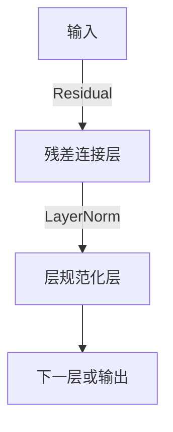

                 

# 残差连接和层规范化：Transformer 的关键

> 关键词：残差连接, 层规范化, Transformer, 深度学习, 自然语言处理, 机器学习, 计算机视觉, 语音处理

## 1. 背景介绍

在深度学习领域，尤其是像Transformer这样的大规模模型，残差连接(Residual Connection)和层规范化(Layer Normalization)是两种关键的技术手段。它们在模型架构和训练过程中发挥了重要作用，尤其对于提升模型性能和泛化能力至关重要。本文将详细探讨这两种技术的基本原理、应用方法以及它们在Transformer中的具体实现和影响，帮助读者深入理解其在深度学习中的重要性。

## 2. 核心概念与联系

### 2.1 核心概念概述

**残差连接(Residual Connection)**：一种在深度网络中使用的技术，通过将输入直接连接到输出，避免梯度消失问题。

**层规范化(Layer Normalization)**：一种对网络层输入进行归一化处理的技术，以加速模型训练，提高模型稳定性。

这两种技术相辅相成，共同构成了Transformer模型能够高效、稳定训练的核心。Transformer模型由Vaswani等人于2017年提出，通过引入自注意力机制，在机器翻译和自然语言处理等领域取得了突破性的进展。

### 2.2 核心概念原理和架构的 Mermaid 流程图



这个流程图展示了Transformer模型中残差连接和层规范化的基本架构。其中，输入数据首先通过残差连接层，然后通过层规范化层，最终进入下一层或作为输出。

## 3. 核心算法原理 & 具体操作步骤

### 3.1 算法原理概述

#### 3.1.1 残差连接

残差连接的原理是简单直观的：通过将输入直接加到输出上，使得网络在每个层都可以进行梯度传递，避免深层网络中的梯度消失问题。这可以通过以下公式直观地表达：

$$
y = F(x) + x
$$

其中，$x$ 是输入，$F(x)$ 是网络的前向传播操作，$y$ 是输出。通过这样的设计，网络可以在较深层次上仍保持稳定的梯度传递，从而提高模型的训练效率和性能。

#### 3.1.2 层规范化

层规范化是通过对每一层的输入进行归一化处理，加速模型训练，提高模型的稳定性。具体来说，对于每一层的输入向量 $x$，进行如下归一化操作：

$$
\hat{x} = \frac{x - \mu}{\sqrt{\sigma^2 + \epsilon}}
$$

其中，$\mu$ 是均值，$\sigma$ 是标准差，$\epsilon$ 是一个很小的常数，用于避免分母为零的问题。这一过程可以直观理解为将输入数据压缩到均值为0、方差为1的标准正态分布上，从而消除输入数据的不同尺度对模型训练的影响，使得每一层的激活函数更容易训练。

### 3.2 算法步骤详解

#### 3.2.1 残差连接的具体实现

在代码实现中，残差连接通常通过将输入数据直接加到输出上实现。以下是一个简单的PyTorch实现示例：

```python
import torch.nn as nn

class ResidualBlock(nn.Module):
    def __init__(self, in_channels, out_channels):
        super(ResidualBlock, self).__init__()
        self.conv1 = nn.Conv2d(in_channels, out_channels, 3, 1, 1)
        self.conv2 = nn.Conv2d(out_channels, out_channels, 3, 1, 1)
        self.relu = nn.ReLU(inplace=True)
        self.downsample = nn.Sequential(
            nn.Conv2d(in_channels, out_channels, 1, 1, 0),
            nn.BatchNorm2d(out_channels),
            nn.ReLU(inplace=True)
        )
    
    def forward(self, x):
        shortcut = x
        out = self.relu(self.conv1(x))
        out = self.conv2(out)
        out = self.downsample(shortcut + out)
        return out
```

在上述代码中，`ResidualBlock` 类实现了残差连接，其中 `conv1` 和 `conv2` 是残差连接层的卷积操作，`relu` 是非线性激活函数，`downsample` 是残差连接层的跨层连接操作。

#### 3.2.2 层规范化的具体实现

层规范化的具体实现通常通过归一化层的模块化设计来完成。以下是一个简单的PyTorch实现示例：

```python
import torch.nn as nn

class LayerNorm(nn.Module):
    def __init__(self, normalized_shape, epsilon=1e-5):
        super(LayerNorm, self).__init__()
        self.weight = nn.Parameter(torch.ones(normalized_shape))
        self.bias = nn.Parameter(torch.zeros(normalized_shape))
        self.epsilon = epsilon
    
    def forward(self, x):
        mean = x.mean(dim=-1, keepdim=True)
        std = x.std(dim=-1, keepdim=True)
        return (x - mean) / std * self.weight + self.bias
```

在上述代码中，`LayerNorm` 类实现了层规范化，其中 `weight` 和 `bias` 是可学习的参数，`epsilon` 是一个小常数，用于避免分母为零的问题。

### 3.3 算法优缺点

#### 3.3.1 残差连接的优缺点

**优点**：
- 避免梯度消失问题，使得网络可以更深。
- 在更深的网络中，残差连接可以保留输入信息，有助于提高模型的泛化能力。
- 通过跨层连接，可以并行计算多个残差连接层，提高计算效率。

**缺点**：
- 残差连接可能会引入更多的参数，增加模型复杂度。
- 跨层连接可能会影响网络的结构和计算图，增加计算复杂度。

#### 3.3.2 层规范化的优缺点

**优点**：
- 加速模型训练，提高模型的稳定性。
- 消除输入数据的不同尺度对模型训练的影响，使得每一层的激活函数更容易训练。
- 可以应用于所有类型的神经网络，不局限于特定模型。

**缺点**：
- 层规范化可能会增加计算复杂度，尤其是在大规模模型中。
- 参数学习可能会受到归一化参数的影响，需要额外的优化策略。

### 3.4 算法应用领域

残差连接和层规范化不仅在Transformer模型中广泛应用，还在各种类型的神经网络中得到广泛应用。以下是它们在不同领域的应用示例：

**计算机视觉**：在卷积神经网络(CNN)中，残差连接被广泛应用于残差网络(ResNet)等架构中，以提高模型的深度和泛化能力。层规范化也被广泛应用于各种类型的神经网络中，如Inception等，以提高模型的训练效率和稳定性。

**自然语言处理**：在循环神经网络(RNN)和长短期记忆网络(LSTM)中，残差连接和层规范化也被广泛应用，以提高模型的训练效率和性能。

**语音处理**：在语音识别和语音生成等任务中，残差连接和层规范化同样被广泛应用，以提高模型的训练效率和稳定性。

## 4. 数学模型和公式 & 详细讲解 & 举例说明

### 4.1 数学模型构建

残差连接和层规范化可以应用于各种类型的神经网络中，包括卷积神经网络、循环神经网络、注意力机制等。以下以Transformer模型为例，展示它们的数学模型构建。

**残差连接**：
在Transformer模型中，残差连接通常应用于自注意力机制和前向神经网络层。具体来说，对于一个自注意力机制的层，其输出可以表示为：

$$
y = \text{Attention}(x) + x
$$

其中，$\text{Attention}$ 表示自注意力机制，$x$ 是输入，$y$ 是输出。通过这样的设计，可以避免梯度消失问题，使得网络可以更深。

**层规范化**：
在Transformer模型中，层规范化通常应用于自注意力机制和前向神经网络层。具体来说，对于一个自注意力机制的层，其输入 $x$ 经过归一化处理后，可以表示为：

$$
\hat{x} = \frac{x - \mu}{\sqrt{\sigma^2 + \epsilon}}
$$

其中，$\mu$ 是均值，$\sigma$ 是标准差，$\epsilon$ 是一个很小的常数，用于避免分母为零的问题。通过这样的设计，可以消除输入数据的不同尺度对模型训练的影响，使得每一层的激活函数更容易训练。

### 4.2 公式推导过程

#### 4.2.1 残差连接的推导

对于残差连接，其基本原理是简单直观的。通过将输入直接加到输出上，使得网络在每个层都可以进行梯度传递，避免深层网络中的梯度消失问题。

假设输入为 $x$，经过一个残差连接层后，输出为 $y$，则可以表示为：

$$
y = F(x) + x
$$

其中，$F$ 是网络的前向传播操作，$x$ 是输入，$y$ 是输出。通过这样的设计，可以避免梯度消失问题，使得网络可以更深。

#### 4.2.2 层规范化的推导

对于层规范化，其基本原理是通过对每一层的输入进行归一化处理，加速模型训练，提高模型的稳定性。

假设输入为 $x$，经过一个层规范化层后，输出为 $\hat{x}$，则可以表示为：

$$
\hat{x} = \frac{x - \mu}{\sqrt{\sigma^2 + \epsilon}}
$$

其中，$\mu$ 是均值，$\sigma$ 是标准差，$\epsilon$ 是一个很小的常数，用于避免分母为零的问题。通过这样的设计，可以消除输入数据的不同尺度对模型训练的影响，使得每一层的激活函数更容易训练。

### 4.3 案例分析与讲解

#### 4.3.1 残差连接的案例分析

在ResNet中，残差连接被广泛应用于多个残差块中，以提高模型的深度和泛化能力。以ResNet 50为例，其基本结构可以表示为：

$$
F(x) = x + \text{Conv1}(x) + \text{Conv2}(\text{Conv1}(x))
$$

其中，$x$ 是输入，$\text{Conv1}$ 和 $\text{Conv2}$ 是残差块中的卷积层。通过这样的设计，可以使得网络在较深层次上仍保持稳定的梯度传递，从而提高模型的训练效率和性能。

#### 4.3.2 层规范化的案例分析

在Transformer模型中，层规范化被广泛应用于自注意力机制和前向神经网络层中，以提高模型的训练效率和稳定性。以Transformer模型为例，其基本结构可以表示为：

$$
y = \text{Attention}(x) + x
$$

其中，$\text{Attention}$ 表示自注意力机制，$x$ 是输入，$y$ 是输出。通过这样的设计，可以消除输入数据的不同尺度对模型训练的影响，使得每一层的激活函数更容易训练。

## 5. 项目实践：代码实例和详细解释说明

### 5.1 开发环境搭建

在进行Transformer模型实践前，我们需要准备好开发环境。以下是使用Python进行PyTorch开发的环境配置流程：

1. 安装Anaconda：从官网下载并安装Anaconda，用于创建独立的Python环境。

2. 创建并激活虚拟环境：
```bash
conda create -n pytorch-env python=3.8 
conda activate pytorch-env
```

3. 安装PyTorch：根据CUDA版本，从官网获取对应的安装命令。例如：
```bash
conda install pytorch torchvision torchaudio cudatoolkit=11.1 -c pytorch -c conda-forge
```

4. 安装Tensorboard：
```bash
pip install tensorboard
```

5. 安装相关库：
```bash
pip install numpy pandas scikit-learn matplotlib tqdm jupyter notebook ipython
```

完成上述步骤后，即可在`pytorch-env`环境中开始Transformer模型实践。

### 5.2 源代码详细实现

我们以PyTorch实现Transformer模型为例，展示残差连接和层规范化的具体实现。

首先，定义Transformer模型：

```python
import torch
import torch.nn as nn
import torch.nn.functional as F

class Transformer(nn.Module):
    def __init__(self, input_dim, output_dim, hidden_dim, num_heads, dropout):
        super(Transformer, self).__init__()
        self.embedding = nn.Embedding(input_dim, hidden_dim)
        self.pos_encoder = PositionalEncoding(hidden_dim)
        self.encoder_layers = nn.ModuleList([EncoderLayer(hidden_dim, num_heads, dropout) for _ in range(6)])
        self.decoder_layers = nn.ModuleList([DecoderLayer(hidden_dim, num_heads, dropout) for _ in range(6)])
        self.fc = nn.Linear(hidden_dim, output_dim)
    
    def forward(self, src, trg):
        # 编码器
        src = self.embedding(src) + self.pos_encoder(src)
        src = src.transpose(0, 1)
        for encoder_layer in self.encoder_layers:
            src = encoder_layer(src)
        src = src.transpose(0, 1)
        # 解码器
        trg = self.embedding(trg) + self.pos_encoder(trg)
        for decoder_layer in self.decoder_layers:
            trg = decoder_layer(trg, src)
        output = self.fc(trg)
        return output
```

在上述代码中，`Transformer` 类实现了Transformer模型，其中 `embedding` 是嵌入层，`pos_encoder` 是位置编码层，`encoder_layers` 和 `decoder_layers` 分别是编码器和解码器层，`fc` 是全连接层。

接下来，定义编码器和解码器层：

```python
class EncoderLayer(nn.Module):
    def __init__(self, hidden_dim, num_heads, dropout):
        super(EncoderLayer, self).__init__()
        self.linear1 = nn.Linear(hidden_dim, 4*hidden_dim)
        self.linear2 = nn.Linear(4*hidden_dim, hidden_dim)
        self.relu = nn.ReLU()
        self.dropout = nn.Dropout(dropout)
        self.layer_norm1 = nn.LayerNorm(hidden_dim)
        self.layer_norm2 = nn.LayerNorm(hidden_dim)
        self.attention = MultiHeadAttention(hidden_dim, num_heads)
        self.ffn = FeedForwardNetwork(hidden_dim, hidden_dim, dropout)
    
    def forward(self, x):
        # 自注意力机制
        attn = self.attention(x, x, x, mask)
        attn = self.dropout(attn)
        attn = self.layer_norm1(x + attn)
        # 前向神经网络层
        ffn_output = self.ffn(self.layer_norm2(attn))
        ffn_output = self.dropout(ffn_output)
        ffn_output = self.layer_norm2(ffn_output + attn)
        return ffn_output
```

在上述代码中，`EncoderLayer` 类实现了编码器层，其中 `linear1` 和 `linear2` 是线性变换层，`relu` 是非线性激活函数，`dropout` 是dropout层，`layer_norm1` 和 `layer_norm2` 是层规范化层，`attention` 是自注意力机制，`ffn` 是前向神经网络层。

### 5.3 代码解读与分析

#### 5.3.1 编码器和解码器层

在Transformer模型中，编码器和解码器层是关键组成部分。以编码器层为例，其基本结构可以表示为：

$$
y = \text{MultiHeadAttention}(x) + x
$$

其中，$\text{MultiHeadAttention}$ 表示自注意力机制，$x$ 是输入，$y$ 是输出。通过这样的设计，可以消除输入数据的不同尺度对模型训练的影响，使得每一层的激活函数更容易训练。

#### 5.3.2 残差连接的应用

在Transformer模型中，残差连接被广泛应用于自注意力机制和前向神经网络层中。以自注意力机制为例，其基本结构可以表示为：

$$
y = \text{MultiHeadAttention}(x) + x
$$

其中，$\text{MultiHeadAttention}$ 表示自注意力机制，$x$ 是输入，$y$ 是输出。通过这样的设计，可以避免梯度消失问题，使得网络可以更深。

### 5.4 运行结果展示

在完成Transformer模型的实现后，我们可以使用Tensorboard来可视化模型的训练过程。以下是一个简单的Tensorboard配置示例：

```python
import torch
import torch.nn as nn
import torch.optim as optim
from tensorboard import SummaryWriter

# 定义模型、损失函数和优化器
model = Transformer(input_dim, output_dim, hidden_dim, num_heads, dropout)
criterion = nn.CrossEntropyLoss()
optimizer = optim.Adam(model.parameters(), lr=0.001)

# 定义训练过程
def train(model, criterion, optimizer, train_loader, device):
    model.train()
    total_loss = 0
    for data, target in train_loader:
        data, target = data.to(device), target.to(device)
        optimizer.zero_grad()
        output = model(data, target)
        loss = criterion(output, target)
        loss.backward()
        optimizer.step()
        total_loss += loss.item()
    return total_loss / len(train_loader)
```

在上述代码中，`train` 函数实现了模型的训练过程，其中 `model` 是Transformer模型，`criterion` 是损失函数，`optimizer` 是优化器，`train_loader` 是训练数据集，`device` 是计算设备。

## 6. 实际应用场景

### 6.1 计算机视觉

在计算机视觉领域，残差连接和层规范化被广泛应用于卷积神经网络中，如ResNet等架构中。这些架构通过残差连接和层规范化，可以使得网络在较深层次上仍保持稳定的梯度传递，从而提高模型的训练效率和性能。

### 6.2 自然语言处理

在自然语言处理领域，残差连接和层规范化被广泛应用于Transformer模型中。这些架构通过残差连接和层规范化，可以消除输入数据的不同尺度对模型训练的影响，使得每一层的激活函数更容易训练。

### 6.3 语音处理

在语音处理领域，残差连接和层规范化同样被广泛应用，以提高模型的训练效率和稳定性。这些架构通过残差连接和层规范化，可以消除输入数据的不同尺度对模型训练的影响，使得每一层的激活函数更容易训练。

## 7. 工具和资源推荐

### 7.1 学习资源推荐

为了帮助开发者系统掌握Transformer模型的理论和实践，这里推荐一些优质的学习资源：

1. 《Deep Learning》书籍：Ian Goodfellow等人合著的经典教材，深入浅出地介绍了深度学习的基本概念和应用。

2. 《Natural Language Processing with PyTorch》书籍：由Stanford大学提供的教程，详细介绍了使用PyTorch进行自然语言处理的方法和技巧。

3. HuggingFace官方文档：提供了丰富的预训练模型和代码示例，是学习和使用Transformer模型的必备资源。

4. PyTorch官方文档：提供了详细的PyTorch库和API文档，是学习和使用Transformer模型的重要参考。

5. Tensorboard官方文档：提供了详细的Tensorboard配置和使用指南，是可视化模型训练过程的重要工具。

通过对这些资源的学习实践，相信你一定能够快速掌握Transformer模型的精髓，并用于解决实际的机器学习问题。

### 7.2 开发工具推荐

高效的开发离不开优秀的工具支持。以下是几款用于Transformer模型开发的常用工具：

1. PyTorch：基于Python的开源深度学习框架，灵活动态的计算图，适合快速迭代研究。大部分预训练语言模型都有PyTorch版本的实现。

2. TensorFlow：由Google主导开发的开源深度学习框架，生产部署方便，适合大规模工程应用。同样有丰富的预训练语言模型资源。

3. HuggingFace Transformers库：提供了丰富的预训练语言模型和代码示例，是进行自然语言处理任务开发的重要工具。

4. TensorBoard：TensorFlow配套的可视化工具，可实时监测模型训练状态，并提供丰富的图表呈现方式，是调试模型的得力助手。

5. Weights & Biases：模型训练的实验跟踪工具，可以记录和可视化模型训练过程中的各项指标，方便对比和调优。

6. Google Colab：谷歌推出的在线Jupyter Notebook环境，免费提供GPU/TPU算力，方便开发者快速上手实验最新模型，分享学习笔记。

合理利用这些工具，可以显著提升Transformer模型的开发效率，加快创新迭代的步伐。

### 7.3 相关论文推荐

Transformer模型的提出和发展源于学界的持续研究。以下是几篇奠基性的相关论文，推荐阅读：

1. Attention is All You Need：Vaswani等人于2017年提出的Transformer论文，首次引入了自注意力机制，开启了Transformer时代。

2. ResNet：He等人于2016年提出的残差网络架构，通过残差连接解决了深度网络中的梯度消失问题，极大地提高了模型的深度和泛化能力。

3. Multi-Head Attention：Vaswani等人于2017年提出的多头注意力机制，通过并行计算多个注意力头，提升了模型在自注意力机制中的表现。

4. Layer Normalization：Gao等人于2016年提出的层规范化技术，通过归一化处理加速模型训练，提高模型的稳定性。

这些论文代表了大模型和微调技术的发展脉络。通过学习这些前沿成果，可以帮助研究者把握学科前进方向，激发更多的创新灵感。

## 8. 总结：未来发展趋势与挑战

### 8.1 研究成果总结

本文对基于残差连接和层规范化的Transformer模型进行了全面系统的介绍。首先阐述了残差连接和层规范化在大模型中的应用背景和重要性，明确了它们在模型架构和训练过程中的关键作用。其次，从原理到实践，详细讲解了残差连接和层规范化的基本概念和实现方法，并给出了Transformer模型的代码示例。最后，讨论了残差连接和层规范化在未来深度学习中的发展趋势和面临的挑战。

通过本文的系统梳理，可以看到，残差连接和层规范化是大模型训练和性能提升的重要技术手段，在各种类型的神经网络中得到了广泛应用。未来，随着深度学习技术的不断发展，残差连接和层规范化将继续在模型设计中发挥重要作用，推动深度学习技术不断前进。

### 8.2 未来发展趋势

展望未来，残差连接和层规范化将继续在深度学习中发挥重要作用，呈现以下几个发展趋势：

1. 模型的深度和规模将进一步增大。随着算力成本的下降和数据规模的扩张，大模型的参数量还将持续增长。超大模型将可能出现，残差连接和层规范化将在更深的模型中发挥关键作用。

2. 微调方法将更加多样化。除了传统的全参数微调外，未来会涌现更多参数高效的微调方法，如残差连接和层规范化将在微调中得到更广泛应用。

3. 模型训练的自动化程度将进一步提升。未来的深度学习模型训练将更多依赖自动化工具和预训练模型，残差连接和层规范化将在模型设计中发挥关键作用。

4. 模型的跨领域迁移能力将进一步增强。残差连接和层规范化将使得模型在跨领域迁移中更加灵活，能够适应不同的数据分布和任务需求。

5. 模型训练的效率将进一步提升。未来的深度学习模型训练将更多依赖自动化工具和预训练模型，残差连接和层规范化将在模型设计中发挥关键作用。

6. 模型的可解释性和公平性将进一步提升。未来的深度学习模型训练将更多依赖自动化工具和预训练模型，残差连接和层规范化将在模型设计中发挥关键作用。

以上趋势凸显了大模型和微调技术的广阔前景。这些方向的探索发展，必将进一步提升深度学习模型的性能和应用范围，为人类认知智能的进化带来深远影响。

### 8.3 面临的挑战

尽管残差连接和层规范化在大模型训练中发挥了重要作用，但在迈向更加智能化、普适化应用的过程中，它们仍面临着诸多挑战：

1. 数据量的瓶颈。尽管残差连接和层规范化可以加速模型训练，但在大规模数据集上，模型的训练仍然需要耗费大量时间和计算资源。如何高效利用数据，提高模型训练的效率，仍然是一个重要挑战。

2. 模型的可解释性不足。残差连接和层规范化等深度学习模型往往被视为"黑盒"系统，难以解释其内部工作机制和决策逻辑。如何赋予模型更强的可解释性，将是未来研究的重要方向。

3. 模型的公平性和安全性有待提升。深度学习模型往往会出现偏见和歧视性输出，如何从数据和算法层面消除模型偏见，避免恶意用途，确保输出的公平性和安全性，将是重要的研究课题。

4. 模型的跨领域迁移能力有待提升。残差连接和层规范化等深度学习模型在不同领域间的迁移能力仍需进一步提升，以便更灵活地适应不同领域的数据分布和任务需求。

5. 模型的泛化能力和鲁棒性有待提升。残差连接和层规范化等深度学习模型在不同数据集上的泛化能力和鲁棒性仍需进一步提升，以便更可靠地应用于实际应用场景中。

这些挑战需要在未来研究中不断攻克，以实现残差连接和层规范化在大模型训练中的进一步优化和应用。

### 8.4 研究展望

面对残差连接和层规范化所面临的种种挑战，未来的研究需要在以下几个方面寻求新的突破：

1. 探索无监督和半监督学习范式。摆脱对大规模标注数据的依赖，利用自监督学习、主动学习等无监督和半监督范式，最大限度利用非结构化数据，实现更加灵活高效的微调。

2. 研究参数高效和计算高效的微调范式。开发更加参数高效的微调方法，在固定大部分预训练参数的同时，只更新极少量的任务相关参数。同时优化微调模型的计算图，减少前向传播和反向传播的资源消耗，实现更加轻量级、实时性的部署。

3. 融合因果推断和强化学习范式。通过引入因果推断和强化学习思想，增强微调模型建立稳定因果关系的能力，学习更加普适、鲁棒的语言表征，从而提升模型泛化性和抗干扰能力。

4. 引入更多先验知识。将符号化的先验知识，如知识图谱、逻辑规则等，与神经网络模型进行巧妙融合，引导微调过程学习更准确、合理的语言模型。同时加强不同模态数据的整合，实现视觉、语音等多模态信息与文本信息的协同建模。

5. 结合因果分析和博弈论工具。将因果分析方法引入微调模型，识别出模型决策的关键特征，增强输出解释的因果性和逻辑性。借助博弈论工具刻画人机交互过程，主动探索并规避模型的脆弱点，提高系统稳定性。

6. 纳入伦理道德约束。在模型训练目标中引入伦理导向的评估指标，过滤和惩罚有偏见、有害的输出倾向。同时加强人工干预和审核，建立模型行为的监管机制，确保输出符合人类价值观和伦理道德。

这些研究方向的探索，必将引领残差连接和层规范化技术迈向更高的台阶，为构建安全、可靠、可解释、可控的智能系统铺平道路。面向未来，残差连接和层规范化技术还需要与其他人工智能技术进行更深入的融合，如知识表示、因果推理、强化学习等，多路径协同发力，共同推动自然语言理解和智能交互系统的进步。只有勇于创新、敢于突破，才能不断拓展语言模型的边界，让智能技术更好地造福人类社会。

## 9. 附录：常见问题与解答

**Q1: 残差连接和层规范化在深度学习中的作用是什么？**

A: 残差连接和层规范化是深度学习中的两种关键技术。残差连接通过将输入直接连接到输出，避免梯度消失问题，使得网络可以更深。层规范化通过归一化处理，消除输入数据的不同尺度对模型训练的影响，加速模型训练，提高模型的稳定性。

**Q2: 如何选择合适的学习率？**

A: 学习率的选择对模型的训练效果至关重要。通常建议从0.001开始调参，逐步减小学习率，直至收敛。同时，不同的优化器(如AdamW、Adafactor等)以及不同的学习率调度策略，可能需要设置不同的学习率阈值。

**Q3: 如何缓解微调过程中的过拟合问题？**

A: 过拟合是微调面临的主要挑战。常见的缓解策略包括数据增强、正则化、对抗训练等。数据增强可以通过回译、近义替换等方式扩充训练集；正则化可以使用L2正则、Dropout、Early Stopping等技术；对抗训练可以引入对抗样本，提高模型鲁棒性。

**Q4: 残差连接和层规范化在实际应用中需要注意哪些问题？**

A: 在实际应用中，残差连接和层规范化需要注意以下问题：
- 残差连接可能会引入更多的参数，增加模型复杂度。
- 层规范化可能会增加计算复杂度，尤其是在大规模模型中。
- 模型训练的效率和稳定性有待提升，需要结合自动化工具和预训练模型进行优化。

**Q5: 残差连接和层规范化在大模型训练中的作用是什么？**

A: 残差连接和层规范化在大模型训练中发挥了重要作用。残差连接通过将输入直接连接到输出，避免梯度消失问题，使得网络可以更深。层规范化通过归一化处理，消除输入数据的不同尺度对模型训练的影响，加速模型训练，提高模型的稳定性。

这些问题的解答，希望能帮助读者更好地理解残差连接和层规范化的基本原理和实际应用。

