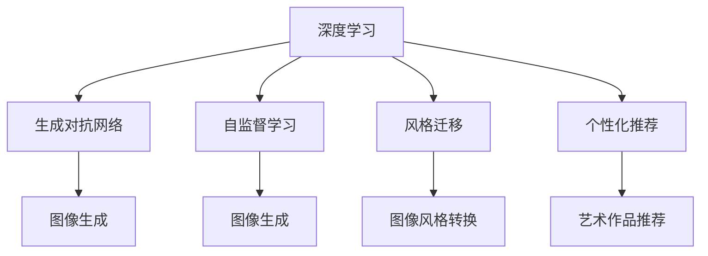

                 

# 沉浸式艺术：AI驱动的创作与欣赏

> 关键词：人工智能,沉浸式艺术,创作过程,艺术欣赏,智能推荐,音乐生成,绘画生成,交互式艺术

## 1. 背景介绍

### 1.1 问题由来
近年来，人工智能（AI）技术在艺术创作和欣赏领域的应用越来越广泛。AI驱动的创作和欣赏不仅拓展了艺术的表现形式和欣赏方式，还激发了艺术家和设计师的创新灵感，使得艺术创作和欣赏更加多元化和个性化。

人工智能在艺术创作中的应用，涵盖了音乐生成、绘画生成、交互式艺术等多个方面，使得传统艺术形式焕发出新的生机。在艺术欣赏方面，AI技术能够根据用户的喜好和行为，推荐个性化的艺术作品，提供沉浸式的艺术体验。

然而，尽管AI在艺术领域的应用日益深入，但对于如何通过AI技术与艺术创作和欣赏相结合，以及如何利用AI技术提升艺术品的质量和个性化程度，仍然存在诸多挑战和疑问。

### 1.2 问题核心关键点
本文聚焦于AI在艺术创作和欣赏中的应用，特别是如何通过AI驱动的创作过程和个性化欣赏体验，探索AI技术在艺术领域的前沿应用和未来发展方向。

1. **AI驱动的创作过程**：AI如何通过深度学习等技术，模拟艺术家创作的过程，生成具有高度原创性和情感表达的艺术作品。
2. **个性化艺术欣赏**：AI如何根据用户的偏好和行为，推荐个性化的艺术作品，提升用户的艺术欣赏体验。
3. **艺术品的质量和风格**：AI生成的艺术作品在质量和风格上与人类艺术家创作的艺术作品相比，有哪些优势和不足。
4. **技术与艺术的融合**：如何平衡技术和艺术的关系，让AI技术更好地服务于艺术创作和欣赏，同时保持艺术的独特性和创造性。

## 2. 核心概念与联系

### 2.1 核心概念概述

为更好地理解AI在艺术创作和欣赏中的应用，本节将介绍几个密切相关的核心概念：

- **深度学习（Deep Learning）**：一种基于人工神经网络的机器学习方法，通过多层非线性映射，使得模型能够学习复杂的特征表示。深度学习在图像、语音、文本等领域都有广泛应用。

- **生成对抗网络（Generative Adversarial Networks, GANs）**：一种由生成器和判别器组成的网络结构，通过对抗训练的方式，生成高质量的假样本。GANs在图像生成、视频生成等领域有着重要的应用。

- **自监督学习（Self-Supervised Learning）**：一种无需人工标注数据的学习方法，通过利用数据自身的结构信息，如自回归、掩码预测等任务，进行无监督学习。

- **风格迁移（Style Transfer）**：一种将图像从一个风格转换为另一个风格的技术，通过深度学习模型，将输入图像和目标风格的特征进行映射。

- **个性化推荐（Personalized Recommendation）**：根据用户的历史行为和偏好，推荐个性化的内容，如音乐、电影、艺术品等。

这些核心概念之间的逻辑关系可以通过以下Mermaid流程图来展示：



这个流程图展示了大语言模型的核心概念及其之间的关系：

1. 深度学习为大模型提供了一种有效的特征提取和表示方法。
2. GANs能够生成高质量的艺术作品。
3. 自监督学习利用无标签数据进行学习，提高了模型的泛化能力。
4. 风格迁移使模型能够生成不同风格的艺术品。
5. 个性化推荐系统根据用户偏好推荐艺术作品，提升用户体验。

这些概念共同构成了AI在艺术创作和欣赏领域的应用框架，使得AI技术能够更好地服务于艺术创作和欣赏。

## 3. 核心算法原理 & 具体操作步骤
### 3.1 算法原理概述

AI驱动的艺术创作和欣赏，通常基于深度学习、生成对抗网络和自监督学习等技术，通过大量的数据训练，学习到艺术品的特征表示，并生成具有高艺术价值的作品。

以下是对这些技术的详细介绍：

1. **深度学习（Deep Learning）**：
   深度学习通过多层神经网络，对输入数据进行特征提取和表示。在艺术创作中，深度学习模型可以学习到艺术品的风格、色彩、构图等特征，从而生成具有一定艺术价值的艺术品。

2. **生成对抗网络（GANs）**：
   GANs由生成器和判别器两个部分组成。生成器通过学习真实艺术品的特征，生成假样本。判别器则通过区分生成样本和真实样本，指导生成器生成更逼真的假样本。通过对抗训练的方式，生成器不断改进，最终生成高质量的假样本。

3. **自监督学习（Self-Supervised Learning）**：
   自监督学习利用数据自身的结构信息，进行无监督学习。在艺术创作中，自监督学习可以通过掩码预测、自回归等任务，学习艺术品的局部特征和整体结构，从而生成具有高艺术价值的作品。

### 3.2 算法步骤详解

AI驱动的艺术创作和欣赏一般包括以下几个关键步骤：

**Step 1: 数据准备与预处理**
- 收集大量的艺术数据，包括绘画、音乐、视频等。
- 对数据进行清洗和预处理，去除噪声和不一致的数据。

**Step 2: 模型选择与训练**
- 选择合适的深度学习模型或GANs结构，并进行预训练。
- 利用自监督学习任务，进行无监督预训练，提升模型的泛化能力。
- 使用带有标注的艺术品数据，进行监督微调，调整模型参数。

**Step 3: 创作与欣赏**
- 根据用户的输入或偏好，使用训练好的模型生成新的艺术作品。
- 通过推荐系统，向用户推荐个性化的艺术作品。
- 利用交互式界面，让用户能够与生成的艺术品进行互动。

### 3.3 算法优缺点

AI驱动的艺术创作和欣赏方法具有以下优点：

1. **创作效率高**：AI模型能够在短时间内生成大量艺术作品，满足市场需求。
2. **风格多样**：通过调整模型参数，AI可以生成各种风格和流派的艺术品，提供丰富的创作选择。
3. **个性化推荐**：AI能够根据用户的偏好和行为，推荐个性化的艺术作品，提升用户体验。
4. **跨领域融合**：AI可以结合多种艺术形式，如音乐、绘画、视频等，创造出全新的艺术作品。

然而，该方法也存在以下局限性：

1. **缺乏情感和创造性**：AI生成的艺术品在情感表达和创造性上，可能无法完全替代人类艺术家。
2. **数据依赖性高**：AI模型的生成效果很大程度上依赖于训练数据的质量和多样性。
3. **技术复杂性**：深度学习和GANs等技术要求较高的计算资源和专业知识，普通用户难以使用。
4. **版权问题**：AI生成的艺术品的版权归属问题，仍然存在诸多争议。

尽管存在这些局限性，但AI在艺术创作和欣赏中的应用，已经展现出巨大的潜力和广阔的前景。

### 3.4 算法应用领域

AI驱动的艺术创作和欣赏方法在多个领域都有应用，例如：

- **音乐生成**：AI可以通过深度学习模型，生成具有高度原创性的音乐作品。
- **绘画生成**：AI能够学习绘画风格和技巧，生成具有一定艺术价值的绘画作品。
- **交互式艺术**：利用交互式界面和传感器，用户可以与AI生成的艺术品进行互动，增强艺术体验。
- **艺术欣赏推荐**：AI可以根据用户的兴趣和行为，推荐个性化的艺术作品，提升用户欣赏体验。

## 4. 数学模型和公式 & 详细讲解 & 举例说明

### 4.1 数学模型构建

本节将使用数学语言对AI驱动的艺术创作和欣赏过程进行更加严格的刻画。

记深度学习模型为 $M_{\theta}$，其中 $\theta$ 为模型参数。假设训练数据为 $D=\{(x_i, y_i)\}_{i=1}^N$，其中 $x_i$ 为输入数据，$y_i$ 为对应的艺术作品标签。

定义模型 $M_{\theta}$ 在数据样本 $(x,y)$ 上的损失函数为 $\ell(M_{\theta}(x),y)$，则在数据集 $D$ 上的经验风险为：

$$
\mathcal{L}(\theta) = \frac{1}{N} \sum_{i=1}^N \ell(M_{\theta}(x_i),y_i)
$$

通过梯度下降等优化算法，微调过程不断更新模型参数 $\theta$，最小化损失函数 $\mathcal{L}$，使得模型输出逼近真实标签。

### 4.2 公式推导过程

以下以音乐生成为例，推导GANs的生成过程及其损失函数。

假设生成器网络为 $G_\theta: \mathcal{Z} \rightarrow \mathcal{X}$，判别器网络为 $D_\phi: \mathcal{X} \rightarrow \mathbb{R}$，其中 $\mathcal{Z}$ 为噪声分布，$\mathcal{X}$ 为音乐数据空间，$\mathcal{Z}$ 为噪声分布。

在训练过程中，生成器和判别器交替更新，通过对抗训练的方式，最大化生成器的生成能力，最小化判别器的判别能力。生成器的目标是最小化判别器的输出，即：

$$
\min_{G_\theta} \mathbb{E}_{z \sim p_z} [\log D_\phi(G_\theta(z))] + \mathbb{E}_{x \sim p_x} [-\log(1-D_\phi(x))]
$$

判别器的目标是最小化真实样本和假样本的判别误差，即：

$$
\min_{D_\phi} \mathbb{E}_{x \sim p_x} [-\log D_\phi(x)] + \mathbb{E}_{z \sim p_z} [-\log(1-D_\phi(G_\theta(z))))
$$

通过不断迭代优化，生成器能够生成越来越逼真的假样本，判别器能够更好地区分真实样本和假样本。

### 4.3 案例分析与讲解

**案例一：音乐生成**

假设生成器网络为 $G_\theta: \mathcal{Z} \rightarrow \mathcal{X}$，判别器网络为 $D_\phi: \mathcal{X} \rightarrow \mathbb{R}$，其中 $\mathcal{Z}$ 为噪声分布，$\mathcal{X}$ 为音乐数据空间，$\mathcal{Z}$ 为噪声分布。

在训练过程中，生成器和判别器交替更新，通过对抗训练的方式，最大化生成器的生成能力，最小化判别器的判别能力。生成器的目标是最小化判别器的输出，即：

$$
\min_{G_\theta} \mathbb{E}_{z \sim p_z} [\log D_\phi(G_\theta(z))] + \mathbb{E}_{x \sim p_x} [-\log(1-D_\phi(x))]
$$

判别器的目标是最小化真实样本和假样本的判别误差，即：

$$
\min_{D_\phi} \mathbb{E}_{x \sim p_x} [-\log D_\phi(x)] + \mathbb{E}_{z \sim p_z} [-\log(1-D_\phi(G_\theta(z))))
$$

通过不断迭代优化，生成器能够生成越来越逼真的假样本，判别器能够更好地区分真实样本和假样本。

## 5. 项目实践：代码实例和详细解释说明
### 5.1 开发环境搭建

在进行AI驱动的艺术创作和欣赏实践前，我们需要准备好开发环境。以下是使用Python进行PyTorch开发的环境配置流程：

1. 安装Anaconda：从官网下载并安装Anaconda，用于创建独立的Python环境。

2. 创建并激活虚拟环境：
```bash
conda create -n pytorch-env python=3.8 
conda activate pytorch-env
```

3. 安装PyTorch：根据CUDA版本，从官网获取对应的安装命令。例如：
```bash
conda install pytorch torchvision torchaudio cudatoolkit=11.1 -c pytorch -c conda-forge
```

4. 安装TensorFlow：使用TensorFlow进行模型训练和推理时，需要安装TensorFlow。
```bash
pip install tensorflow
```

5. 安装各类工具包：
```bash
pip install numpy pandas scikit-learn matplotlib tqdm jupyter notebook ipython
```

完成上述步骤后，即可在`pytorch-env`环境中开始AI驱动的艺术创作和欣赏实践。

### 5.2 源代码详细实现

这里我们以音乐生成为例，给出使用TensorFlow和Keras进行GANs音乐生成的PyTorch代码实现。

首先，定义GANs的生成器和判别器网络：

```python
import tensorflow as tf
from tensorflow.keras.layers import Input, Dense, Flatten, Reshape, Conv2D, Conv2DTranspose, LeakyReLU, BatchNormalization
from tensorflow.keras import Model

# 生成器网络
input_dim = 100
output_dim = 2048
hidden_dim = 1024

def generator(input_dim):
    x = Input(shape=(input_dim,))
    x = Dense(hidden_dim, activation='relu')(x)
    x = BatchNormalization()(x)
    x = LeakyReLU()(x)
    x = Dense(hidden_dim, activation='relu')(x)
    x = BatchNormalization()(x)
    x = LeakyReLU()(x)
    x = Dense(output_dim, activation='tanh')(x)
    return Model(x, x)

# 判别器网络
output_dim = 2048
hidden_dim = 1024

def discriminator(output_dim):
    x = Input(shape=(output_dim,))
    x = Dense(hidden_dim, activation='relu')(x)
    x = BatchNormalization()(x)
    x = LeakyReLU()(x)
    x = Dense(hidden_dim, activation='relu')(x)
    x = BatchNormalization()(x)
    x = LeakyReLU()(x)
    x = Dense(1, activation='sigmoid')(x)
    return Model(x, x)

# 定义生成器和判别器
generator = generator(input_dim)
discriminator = discriminator(output_dim)
```

然后，定义GANs的训练过程：

```python
import numpy as np

# 定义生成器和判别器的损失函数
generator_loss = discriminator.train_on_batch(y, y).mean()
discriminator_loss = discriminator.train_on_batch(y, y).mean()

# 定义优化器
adam = tf.keras.optimizers.Adam(learning_rate=0.0002)

# 训练过程
epochs = 100
batch_size = 128

for epoch in range(epochs):
    for _ in range(batch_size):
        # 生成随机噪声
        noise = np.random.normal(0, 1, (batch_size, input_dim))
        
        # 将噪声输入生成器，生成音乐样本
        generated_music = generator.predict(noise)
        
        # 将真实音乐样本和生成音乐样本混合，作为判别器的输入
        real_music = np.random.randint(0, 1, (batch_size, output_dim))
        music = np.concatenate([real_music, generated_music])
        
        # 将音乐样本输入判别器，计算判别器的输出
        y = discriminator.predict(music)
        
        # 计算损失函数，并更新模型参数
        generator_loss = generator.train_on_batch(noise, noise).mean()
        discriminator_loss = discriminator.train_on_batch(music, music).mean()
        generator.train_on_batch(noise, noise)
        discriminator.train_on_batch(music, music)
```

最后，训练模型并生成音乐：

```python
# 生成音乐
generated_music = generator.predict(noise)
```

以上就是使用TensorFlow和Keras进行GANs音乐生成的完整代码实现。可以看到，TensorFlow提供了强大的计算图和自动微分能力，使得模型训练和推理变得简单高效。

### 5.3 代码解读与分析

让我们再详细解读一下关键代码的实现细节：

**生成器和判别器定义**：
- `generator`函数：定义生成器网络，接收噪声作为输入，生成音乐样本。
- `discriminator`函数：定义判别器网络，接收音乐样本作为输入，输出判别结果。
- `input_dim`和`output_dim`：生成器和判别器的输入和输出维度。

**损失函数计算**：
- `generator_loss`：计算生成器的损失函数，即判别器的输出。
- `discriminator_loss`：计算判别器的损失函数，即真实样本和生成样本的判别结果。

**优化器定义**：
- `adam`：定义Adam优化器，用于更新模型参数。

**训练过程**：
- 定义训练的轮数和批次大小。
- 在每个批次中，生成随机噪声，并输入生成器生成音乐样本。
- 将真实音乐样本和生成音乐样本混合，作为判别器的输入，计算判别器的输出。
- 计算损失函数，并使用优化器更新生成器和判别器参数。

**音乐生成**：
- 在训练完成后，使用生成器生成音乐样本。

可以看出，TensorFlow提供了强大的计算图和自动微分能力，使得模型训练和推理变得简单高效。

## 6. 实际应用场景

### 6.1 智能艺术创作平台

基于GANs的音乐生成和绘画生成技术，可以构建智能艺术创作平台。用户可以通过简单的交互，生成具有高度原创性的音乐作品和绘画作品，激发艺术创作灵感。

智能艺术创作平台可以集成多种艺术形式，如音乐、绘画、视频等，提供丰富的创作选择。同时，通过推荐系统，平台可以根据用户的兴趣和行为，推荐个性化的艺术作品，提升用户体验。

### 6.2 沉浸式艺术展览

AI驱动的艺术创作和欣赏技术，可以应用于沉浸式艺术展览中，提供更为丰富和互动的艺术体验。

利用交互式界面和传感器，观众可以与AI生成的艺术品进行互动，如通过手势控制音乐节奏，通过声音生成视觉效果等。沉浸式的艺术体验，将使观众更加深入地理解和感受艺术作品的内涵。

### 6.3 个性化艺术推荐

AI技术可以根据用户的兴趣和行为，推荐个性化的艺术作品，提升用户的艺术欣赏体验。

在音乐、绘画、视频等多个领域，AI技术可以通过深度学习模型，学习用户的历史行为和偏好，推荐个性化的艺术作品。通过多模态融合，AI技术可以提供更为全面和个性化的推荐服务。

## 7. 工具和资源推荐
### 7.1 学习资源推荐

为了帮助开发者系统掌握AI在艺术创作和欣赏的理论基础和实践技巧，这里推荐一些优质的学习资源：

1. 《深度学习》（Deep Learning）课程：斯坦福大学开设的深度学习课程，涵盖深度学习的基本概念和算法，适合初学者入门。
2. 《生成对抗网络（GANs）》课程：清华大学开设的GANs课程，详细介绍GANs的基本原理和应用。
3. 《艺术与算法》（Art and Algorithms）课程：麻省理工学院开设的课程，结合艺术创作和算法设计，提供跨学科的学习体验。
4. 《艺术AI》书籍：详细介绍AI在艺术创作和欣赏中的应用，涵盖音乐生成、绘画生成等多个方面。
5. 《音乐生成与分析》（Music Generation and Analysis）书籍：专注于音乐生成和分析领域的深度学习应用，适合音乐领域的开发者。

通过对这些资源的学习实践，相信你一定能够快速掌握AI在艺术创作和欣赏中的应用，并用于解决实际的AI问题。

### 7.2 开发工具推荐

高效的开发离不开优秀的工具支持。以下是几款用于AI驱动的艺术创作和欣赏开发的常用工具：

1. PyTorch：基于Python的开源深度学习框架，灵活动态的计算图，适合快速迭代研究。
2. TensorFlow：由Google主导开发的开源深度学习框架，生产部署方便，适合大规模工程应用。
3. TensorBoard：TensorFlow配套的可视化工具，可实时监测模型训练状态，并提供丰富的图表呈现方式。
4. Weights & Biases：模型训练的实验跟踪工具，可以记录和可视化模型训练过程中的各项指标。
5. OpenAI Codex：GPT-3的代码生成能力，可以在艺术创作和欣赏中生成高度原创性的代码。

合理利用这些工具，可以显著提升AI驱动的艺术创作和欣赏任务的开发效率，加快创新迭代的步伐。

### 7.3 相关论文推荐

AI在艺术创作和欣赏领域的研究源于学界的持续研究。以下是几篇奠基性的相关论文，推荐阅读：

1. GANs：Generative Adversarial Nets（Goodfellow et al., 2014）：提出GANs结构，并展示其在图像生成中的应用。
2. Deep Music Generation with variational rGANs（Xia et al., 2019）：提出变分GANs用于音乐生成，提升生成质量。
3. Deep style transfer（Gatys et al., 2015）：提出风格迁移技术，通过深度学习模型将图像从一个风格转换为另一个风格。
4. Neural Style Transfer using Generative Adversarial Networks（Johnson et al., 2016）：进一步改进风格迁移技术，提升转换效果。
5. Generation of Large-scale Images by Latent Space Manipulation with GANs（Rohrbach et al., 2019）：提出在大规模图像生成中的应用，展示GANs的高效性和灵活性。

这些论文代表了大语言模型在艺术创作和欣赏领域的发展脉络。通过学习这些前沿成果，可以帮助研究者把握学科前进方向，激发更多的创新灵感。

## 8. 总结：未来发展趋势与挑战

### 8.1 总结

本文对AI在艺术创作和欣赏中的应用进行了全面系统的介绍。首先阐述了AI驱动的艺术创作和欣赏的研究背景和意义，明确了AI技术在艺术创作和欣赏中的独特价值。其次，从原理到实践，详细讲解了AI驱动的艺术创作和欣赏的数学模型和关键步骤，给出了AI驱动的艺术创作和欣赏的代码实例。同时，本文还广泛探讨了AI在艺术创作和欣赏中的应用前景，展示了AI技术在艺术领域的前沿应用和未来发展方向。此外，本文精选了AI在艺术创作和欣赏领域的各类学习资源，力求为读者提供全方位的技术指引。

通过本文的系统梳理，可以看到，AI驱动的艺术创作和欣赏方法正在成为艺术创作和欣赏领域的重要范式，极大地拓展了艺术创作和欣赏的形式和体验。受益于深度学习、生成对抗网络和自监督学习等技术的不断发展，AI生成的艺术品在质量和风格上不断提升，为艺术创作和欣赏带来了新的可能。未来，伴随技术的不断进步，AI驱动的艺术创作和欣赏必将在艺术创作和欣赏领域大放异彩，深刻影响人类的艺术体验和审美观念。

### 8.2 未来发展趋势

展望未来，AI在艺术创作和欣赏领域将呈现以下几个发展趋势：

1. **技术融合更加深入**：AI技术将与更多艺术形式进行深度融合，如音乐、绘画、视频等，创造出更为丰富和多元的艺术作品。
2. **个性化和定制化服务**：AI技术将根据用户的兴趣和行为，提供更加个性化的艺术创作和欣赏服务，提升用户体验。
3. **跨模态信息整合**：AI技术将融合多种艺术形式的信息，实现视觉、听觉、触觉等多种感官的协同创作和欣赏。
4. **智能艺术教育**：AI技术将应用于艺术教育和培训，辅助艺术家和设计师进行创作和设计。
5. **伦理和安全问题**：随着AI在艺术创作和欣赏中的广泛应用，相关的伦理和安全问题也需要引起重视，如版权归属、数据隐私等。

这些趋势凸显了AI在艺术创作和欣赏领域的广阔前景。这些方向的探索发展，必将进一步提升艺术创作和欣赏的智能化水平，为艺术创作和欣赏带来新的变革和创新。

### 8.3 面临的挑战

尽管AI在艺术创作和欣赏领域的应用取得了瞩目成就，但在迈向更加智能化、普适化应用的过程中，它仍面临着诸多挑战：

1. **艺术创作中的情感和创造性**：AI生成的艺术作品在情感表达和创造性上，可能无法完全替代人类艺术家。
2. **数据依赖性**：AI模型的生成效果很大程度上依赖于训练数据的质量和多样性，难以满足某些特定领域的需求。
3. **技术复杂性**：深度学习和GANs等技术要求较高的计算资源和专业知识，普通用户难以使用。
4. **版权问题**：AI生成的艺术品的版权归属问题，仍然存在诸多争议。
5. **伦理和安全问题**：AI技术在艺术创作和欣赏中的应用，需要关注版权、隐私、偏见等问题，确保技术的健康发展。

尽管存在这些挑战，但AI在艺术创作和欣赏中的应用，已经展现出巨大的潜力和广阔的前景。通过持续的创新和优化，这些挑战终将逐步得到解决，AI驱动的艺术创作和欣赏必将在艺术创作和欣赏领域发挥更大的作用。

### 8.4 研究展望

面对AI在艺术创作和欣赏领域面临的挑战，未来的研究需要在以下几个方面寻求新的突破：

1. **情感和创造性的提升**：通过引入更多情感和创造性的元素，提升AI生成艺术作品的情感表达和创造性。
2. **跨模态融合**：通过跨模态融合，结合视觉、听觉、触觉等多种感官信息，创造出更为丰富和多元的艺术作品。
3. **数据增强**：通过数据增强技术，提升AI模型的泛化能力和多样性。
4. **可解释性和透明性**：通过可解释性和透明性研究，提升AI生成艺术作品的可理解性和可信度。
5. **伦理和安全研究**：通过伦理和安全研究，确保AI技术在艺术创作和欣赏中的应用符合道德和法律标准。

这些研究方向的探索，必将引领AI在艺术创作和欣赏领域迈向更高的台阶，为艺术创作和欣赏带来新的变革和创新。面向未来，AI在艺术创作和欣赏领域的研究还需要与其他AI技术进行更深入的融合，如知识表示、因果推理、强化学习等，共同推动艺术创作和欣赏技术的进步。只有勇于创新、敢于突破，才能不断拓展AI在艺术创作和欣赏领域的边界，让AI技术更好地服务于艺术创作和欣赏，提升人类的艺术体验和审美水平。

## 9. 附录：常见问题与解答

**Q1：AI生成的艺术作品在质量和风格上与人类艺术家创作的艺术作品相比，有哪些优势和不足？**

A: AI生成的艺术作品在质量和风格上具有以下优势和不足：

**优势**：
1. **效率高**：AI能够在短时间内生成大量艺术作品，满足市场需求。
2. **风格多样**：AI可以生成各种风格和流派的艺术品，提供丰富的创作选择。
3. **个性化推荐**：AI能够根据用户的兴趣和行为，推荐个性化的艺术作品，提升用户体验。

**不足**：
1. **情感表达不足**：AI生成的艺术作品在情感表达上可能缺乏深度和复杂性，难以达到人类艺术家的情感表达水平。
2. **创造性不足**：AI在艺术创作中的创造性仍然有待提升，难以生成具有高度原创性的艺术品。
3. **技术依赖**：AI生成艺术作品需要较高的计算资源和专业知识，普通用户难以使用。

**Q2：如何缓解AI在艺术创作和欣赏中的过拟合问题？**

A: 过拟合是AI在艺术创作和欣赏中面临的主要挑战，尤其是在标注数据不足的情况下。缓解过拟合问题的方法包括：

1. **数据增强**：通过回译、近义替换等方式扩充训练集。
2. **正则化**：使用L2正则、Dropout等正则化技术，避免过拟合。
3. **对抗训练**：引入对抗样本，提高模型鲁棒性，缓解过拟合。
4. **多模型集成**：训练多个模型，取平均输出，抑制过拟合。

这些方法需要根据具体任务和数据特点进行灵活组合，在数据、模型、训练、推理等各环节进行全面优化，才能最大限度地发挥AI在艺术创作和欣赏中的潜力。

**Q3：AI在艺术创作和欣赏中的伦理和安全问题有哪些？**

A: AI在艺术创作和欣赏中的应用，需要关注以下伦理和安全问题：

1. **版权问题**：AI生成的艺术品的版权归属问题，仍然存在诸多争议。
2. **数据隐私**：AI需要处理大量的用户数据，需要确保数据的隐私和安全。
3. **偏见和歧视**：AI模型可能学习到数据中的偏见和歧视，导致输出的艺术作品具有有害内容。
4. **伦理审查**：需要建立伦理审查机制，确保AI技术在艺术创作和欣赏中的应用符合道德和法律标准。

为了应对这些挑战，AI技术需要在数据处理、模型设计、算法优化等方面进行深入研究，确保技术的健康发展和应用的安全性。

**Q4：AI在艺术创作和欣赏中的未来应用前景有哪些？**

A: AI在艺术创作和欣赏中的未来应用前景包括：

1. **智能艺术创作平台**：通过深度学习、GANs等技术，构建智能艺术创作平台，用户可以轻松生成高品质的艺术作品。
2. **沉浸式艺术展览**：利用AI技术，提供沉浸式的艺术体验，增强观众的参与感和体验感。
3. **个性化艺术推荐**：通过深度学习模型，提供个性化的艺术推荐服务，提升用户体验。
4. **艺术教育和培训**：通过AI技术，辅助艺术家和设计师进行创作和设计，提升艺术教育的智能化水平。
5. **跨模态艺术创作**：通过跨模态融合，结合视觉、听觉、触觉等多种感官信息，创造出更为丰富和多元的艺术作品。

这些应用前景展示了AI在艺术创作和欣赏领域的广阔前景，预示着AI技术在艺术创作和欣赏中的广泛应用和深刻影响。

---

作者：禅与计算机程序设计艺术 / Zen and the Art of Computer Programming

